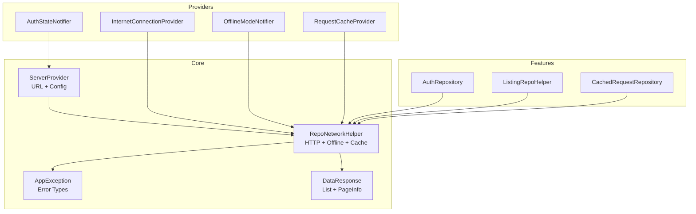
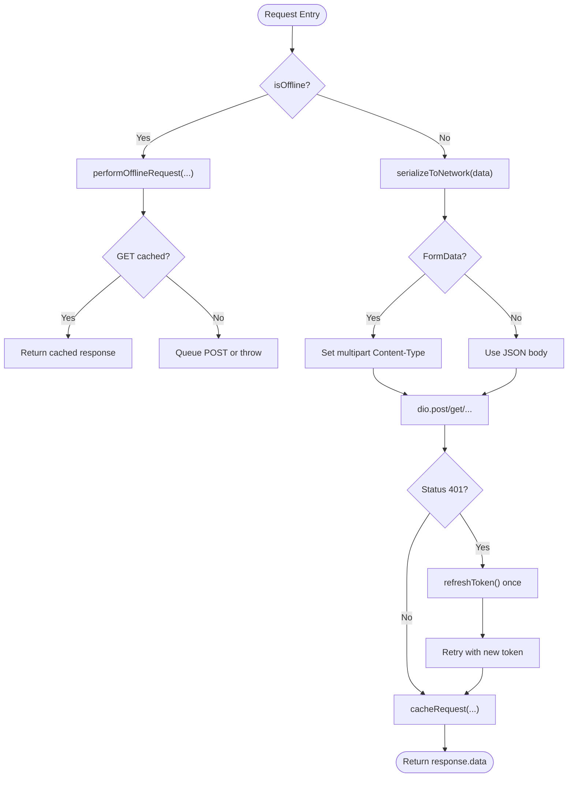
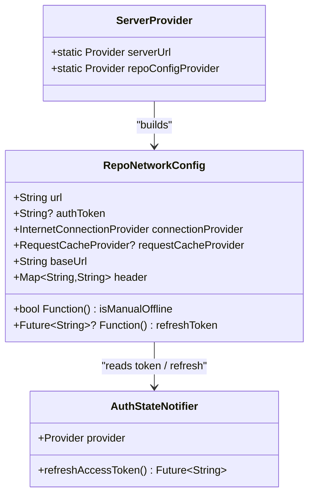
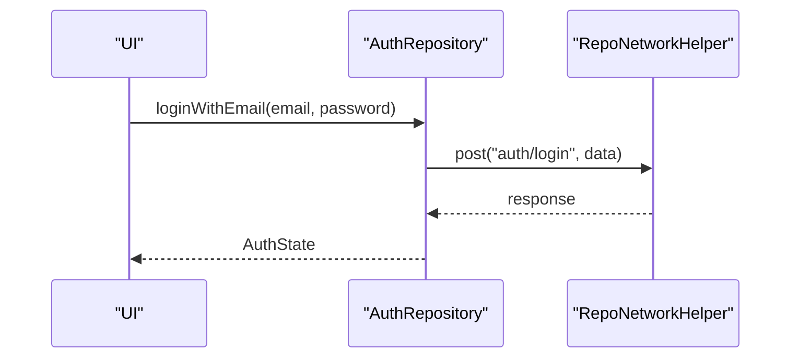
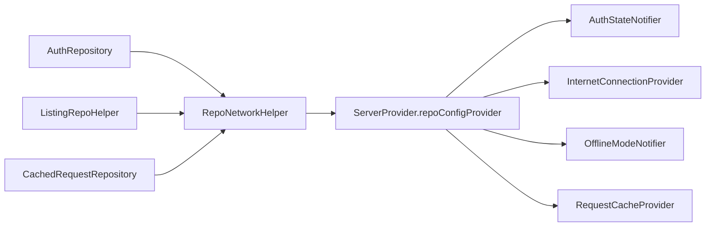

# API Reference

<cite>
**Referenced Files in This Document**
- [repo_network_helper.dart](file://lib/app/core/logic/repository/repo_network_helper.dart)
- [server_provider.dart](file://lib/app/core/provider/server_provider.dart)
- [auth_repository.dart](file://lib/app/features/authentication/repository/auth_repository.dart)
- [data_response.dart](file://lib/app/core/model/data_response.dart)
- [listing_repo_helper.dart](file://lib/app/core/logic/repository/listing_repo_helper.dart)
- [cached_request_repository.dart](file://lib/app/core/logic/repository/cached_request_repository.dart)
- [app_exception.dart](file://lib/app/core/logic/repository/app_exception.dart)
- [data_state.dart](file://lib/app/core/logic/data_state/data_state.dart)
- [account_settings_view_model.dart](file://lib/app/features/dashboard/viewmodel/account_settings_view_model.dart)
</cite>

## Table of Contents
1. Introduction
2. Project Structure
3. Core Components
4. Architecture Overview
5. Detailed Component Analysis
6. Dependency Analysis
7. Performance Considerations
8. Troubleshooting Guide
9. Conclusion
10. Appendices

## Introduction
This document provides a comprehensive API reference for the Leadership Edge Live LMS internal APIs. It focuses on:
- Repository interfaces that define data access contracts (methods, parameters, return types, and error handling).
- Network client configuration, request/response transformation, and interceptor chain.
- Provider APIs for state management, including provider creation, dependency injection, and reactive updates.
- Utility functions, configuration options, and extension points.
- Concrete examples for implementing custom repositories, creating new providers, and integrating external services following established patterns.

## Project Structure
The repository is organized around a core networking layer, feature-scoped repositories, Riverpod-based providers, and shared models/utilities. Key areas:
- Core networking and helpers: Dio client setup, interceptors, offline behavior, caching hooks, and HTTP methods.
- Providers: Server URL resolution, connection status, offline mode toggle, request cache, and auth state integration.
- Feature repositories: Domain-specific data access (e.g., authentication, dashboard).
- Shared models: Standardized response wrappers and data states.



**Diagram sources**
- [repo_network_helper.dart:31-128](file://lib/app/core/logic/repository/repo_network_helper.dart#L31-L128)
- [server_provider.dart:8-39](file://lib/app/core/provider/server_provider.dart#L8-L39)
- [auth_repository.dart:7-66](file://lib/app/features/authentication/repository/auth_repository.dart#L7-L66)
- [data_response.dart:3-19](file://lib/app/core/model/data_response.dart#L3-L19)
- [listing_repo_helper.dart:4-24](file://lib/app/core/logic/repository/listing_repo_helper.dart#L4-L24)
- [cached_request_repository.dart:9-31](file://lib/app/core/logic/repository/cached_request_repository.dart#L9-L31)

**Section sources**
- [repo_network_helper.dart:31-128](file://lib/app/core/logic/repository/repo_network_helper.dart#L31-L128)
- [server_provider.dart:8-39](file://lib/app/core/provider/server_provider.dart#L8-L39)

## Core Components
- RepoNetworkConfig: Central configuration for base URL, auth token, connectivity source, optional request cache, manual offline flag, and token refresh callback. Provides computed base URL and default headers with optional Authorization header.
- RepoNetworkHelper: Mixin providing HTTP methods (get/post/put/delete/patch), offline detection, body serialization, FormData handling, progress callbacks, request caching hooks, and exception mapping. Includes an optional 401 retry interceptor using a provided refresh token function.
- ServerProvider: Resolves server URL from environment or defaults and builds RepoNetworkConfig wired to InternetConnectionProvider, RequestCacheProvider, OfflineModeNotifier, and AuthStateNotifier.
- DataResponse<T>: Standardized wrapper for list payloads with pagination metadata; includes parsing logic that validates success flags and payload shape.
- ListingRepoHelper<T>: Adds paginated GET support by appending page query parameter and parsing responses into DataResponse<T>.
- CachedRequestRepository: Example repository demonstrating how to send cached requests via post with explicit cache type control.
- AppException hierarchy: Uniform exceptions for network and application errors (e.g., UnauthorizedException, BadRequestException, InvalidResponseException).
- DataState<T>: State container used by view models to represent idle/loading/data/error states.

**Section sources**
- [repo_network_helper.dart:31-128](file://lib/app/core/logic/repository/repo_network_helper.dart#L31-L128)
- [repo_network_helper.dart:129-479](file://lib/app/core/logic/repository/repo_network_helper.dart#L129-L479)
- [server_provider.dart:8-39](file://lib/app/core/provider/server_provider.dart#L8-L39)
- [data_response.dart:3-19](file://lib/app/core/model/data_response.dart#L3-L19)
- [listing_repo_helper.dart:4-24](file://lib/app/core/logic/repository/listing_repo_helper.dart#L4-L24)
- [cached_request_repository.dart:9-31](file://lib/app/core/logic/repository/cached_request_repository.dart#L9-L31)
- [app_exception.dart:6-54](file://lib/app/core/logic/repository/app_exception.dart#L6-L54)
- [data_state.dart:1-22](file://lib/app/core/logic/data_state/data_state.dart#L1-L22)

## Architecture Overview
The system uses a layered approach:
- Providers supply runtime configuration and dependencies (server URL, connectivity, offline mode, cache, auth token).
- Repositories encapsulate domain data access using RepoNetworkHelper for consistent HTTP calls, transformations, and error handling.
- View models consume repositories and expose reactive state via Riverpod StateNotifiers.

```mermaid
sequenceDiagram
participant VM as "AccountSettingsViewModel"
participant Repo as "AccountSettingsRepository"
participant Net as "RepoNetworkHelper"
participant Dio as "Dio Client"
participant Int as "InternetConnectionProvider"
participant Off as "OfflineModeNotifier"
participant Cache as "RequestCacheProvider"
participant Auth as "AuthStateNotifier"
VM->>Repo : call repository method
Repo->>Net : post/get/...
Net->>Int : check isConnected
Net->>Off : read isManualOffline()
alt offline or manual offline
Net->>Cache : performOfflineRequest(...)
Cache-->>Net : cached response or throw
else online
Net->>Dio : execute request with headers + timeouts
Dio-->>Net : response.data
Net->>Cache : cacheRequest(...) if applicable
end
Net-->>Repo : transformed data or throws AppException
Repo-->>VM : result wrapped in DataState
```

**Diagram sources**
- [repo_network_helper.dart:79-128](file://lib/app/core/logic/repository/repo_network_helper.dart#L79-L128)
- [repo_network_helper.dart:286-394](file://lib/app/core/logic/repository/repo_network_helper.dart#L286-L394)
- [server_provider.dart:19-39](file://lib/app/core/provider/server_provider.dart#L19-L39)
- [account_settings_view_model.dart:9-28](file://lib/app/features/dashboard/viewmodel/account_settings_view_model.dart#L9-L28)

## Detailed Component Analysis

### Network Client Configuration and Interceptor Chain
- Base options:
  - baseUrl derived from RepoNetworkConfig.url.
  - Default headers include content-type and optional Authorization Bearer token.
  - Timeouts: connect 20s, receive 20s, send 30s.
- Interceptors:
  - Optional 401 retry: when a response is 401, the interceptor calls config.refreshToken once per request, updates Authorization header, and retries exactly once.
- Offline behavior:
  - isOffline combines manual offline flag and device connectivity.
  - On offline, requests either return cached GET responses or queue POSTs for later sync.
- Body transformation:
  - serializeToNetwork recursively converts supported types (e.g., DateTime to ISO string).
  - Auto-detects multipart bodies and sets correct Content-Type boundary.
  - Arrays are serialized with bracket notation for form encoding.
- Caching hooks:
  - cacheRequest stores GET/POST results based on RequestCacheType.
  - performOfflineRequest returns cached GET or queues POST when offline.



**Diagram sources**
- [repo_network_helper.dart:79-128](file://lib/app/core/logic/repository/repo_network_helper.dart#L79-L128)
- [repo_network_helper.dart:129-237](file://lib/app/core/logic/repository/repo_network_helper.dart#L129-L237)
- [repo_network_helper.dart:286-394](file://lib/app/core/logic/repository/repo_network_helper.dart#L286-L394)

**Section sources**
- [repo_network_helper.dart:31-128](file://lib/app/core/logic/repository/repo_network_helper.dart#L31-L128)
- [repo_network_helper.dart:129-237](file://lib/app/core/logic/repository/repo_network_helper.dart#L129-L237)
- [repo_network_helper.dart:286-394](file://lib/app/core/logic/repository/repo_network_helper.dart#L286-L394)

### Provider APIs for State Management
- ServerProvider:
  - serverUrl: resolves SERVER_URL from build-time defines or falls back to staging URL.
  - repoConfigProvider: constructs RepoNetworkConfig wiring:
    - url from serverUrl
    - authToken from current AuthStateNotifier
    - connectionProvider from InternetConnectionProvider
    - requestCacheProvider from RequestCacheProvider
    - isManualOffline via live closure reading OfflineModeNotifier
    - refreshToken via live closure calling AuthStateNotifier.refreshAccessToken
- Usage pattern:
  - Repositories depend on RepoNetworkConfig via ServerProvider.repoConfigProvider to ensure dynamic auth tokens and offline behavior without tearing down existing providers.



**Diagram sources**
- [server_provider.dart:8-39](file://lib/app/core/provider/server_provider.dart#L8-L39)
- [repo_network_helper.dart:31-70](file://lib/app/core/logic/repository/repo_network_helper.dart#L31-L70)

**Section sources**
- [server_provider.dart:8-39](file://lib/app/core/provider/server_provider.dart#L8-L39)

### Repository Interfaces and Examples
- AuthRepository:
  - loginWithEmail(email, password): posts to 'auth/login', returns AuthState.
  - autoLogin(email, auto_login_token): posts to 'auth/auto-login', returns AuthState.
  - validateToken(AuthState): attempts to validate via listing endpoint; if unauthorized, performs auto-login and returns updated AuthState.
- ListingRepoHelper<T>:
  - getData(pageNo, queryParams?): appends page param, performs GET with fetch cache type, parses into DataResponse<T> using fromMap.
- CachedRequestRepository:
  - sendCachedRequest(CachableRequest): posts with cacheType none to replay queued requests.



**Diagram sources**
- [auth_repository.dart:16-27](file://lib/app/features/authentication/repository/auth_repository.dart#L16-L27)
- [repo_network_helper.dart:286-350](file://lib/app/core/logic/repository/repo_network_helper.dart#L286-L350)

**Section sources**
- [auth_repository.dart:7-66](file://lib/app/features/authentication/repository/auth_repository.dart#L7-L66)
- [listing_repo_helper.dart:4-24](file://lib/app/core/logic/repository/listing_repo_helper.dart#L4-L24)
- [cached_request_repository.dart:9-31](file://lib/app/core/logic/repository/cached_request_repository.dart#L9-L31)

### Data Models and Parsing
- DataResponse<T>:
  - Fields: List<T> data, PageInfo pageInfo.
  - parse(response, fromMap): validates success flag, extracts payload, maps items using fromMap, returns typed response.
- DataState<T>:
  - States: idle, loading, data, error.
  - Factory constructors to create immutable state instances.

```mermaid
classDiagram
class DataResponse~T~ {
+T[] data
+PageInfo pageInfo
+parse(dynamic, T Function(Map)) DataResponse~T~
}
class DataState~T~ {
+T? data
+String? error
+DataProviderState state
+idle()
+loading()
+onData(T)
+onError(String)
}
enum DataProviderState { idle, loading, data, error }
```

**Diagram sources**
- [data_response.dart:3-19](file://lib/app/core/model/data_response.dart#L3-L19)
- [data_state.dart:1-22](file://lib/app/core/logic/data_state/data_state.dart#L1-L22)

**Section sources**
- [data_response.dart:3-19](file://lib/app/core/model/data_response.dart#L3-L19)
- [data_state.dart:1-22](file://lib/app/core/logic/data_state/data_state.dart#L1-L22)

### Error Handling Patterns
- Exceptions:
  - AppException and subclasses provide uniform error titles/messages across repositories.
  - Common types: InvalidResponseException, FetchDataException, TooManyRequestException, InternetException, BadRequestException, UnauthorizedException, InvalidInputException, NotFoundException.
- Mapping:
  - RepoNetworkHelper delegates error handling to a centralized handler before rethrowing, ensuring consistent propagation to callers.

**Section sources**
- [app_exception.dart:6-54](file://lib/app/core/logic/repository/app_exception.dart#L6-L54)
- [repo_network_helper.dart:346-350](file://lib/app/core/logic/repository/repo_network_helper.dart#L346-L350)

### View Model Integration Pattern
- AccountSettingsViewModel:
  - Extends StateNotifier<DataState<UserProfileDetail>>.
  - Uses ref.read to avoid rebuild loops when updating auth state during operations.
  - Demonstrates fetching profile and managing lifecycle with autoDispose provider.

**Section sources**
- [account_settings_view_model.dart:9-28](file://lib/app/features/dashboard/viewmodel/account_settings_view_model.dart#L9-L28)

## Dependency Analysis
- Coupling:
  - Repositories depend on RepoNetworkHelper for all HTTP concerns.
  - RepoNetworkHelper depends on providers for connectivity, offline mode, caching, and auth token refresh.
- Cohesion:
  - Each repository encapsulates a single domain area (e.g., authentication).
  - Shared utilities (DataResponse, DataState, exceptions) reduce duplication.
- External integrations:
  - Dio for HTTP.
  - Riverpod for dependency injection and reactive state.
  - Optional RequestCacheProvider for offline persistence.



**Diagram sources**
- [auth_repository.dart:7-15](file://lib/app/features/authentication/repository/auth_repository.dart#L7-L15)
- [listing_repo_helper.dart:4-24](file://lib/app/core/logic/repository/listing_repo_helper.dart#L4-L24)
- [cached_request_repository.dart:9-22](file://lib/app/core/logic/repository/cached_request_repository.dart#L9-L22)
- [server_provider.dart:19-39](file://lib/app/core/provider/server_provider.dart#L19-L39)

**Section sources**
- [auth_repository.dart:7-15](file://lib/app/features/authentication/repository/auth_repository.dart#L7-L15)
- [server_provider.dart:19-39](file://lib/app/core/provider/server_provider.dart#L19-L39)

## Performance Considerations
- Timeouts:
  - Connect/receive/send timeouts prevent indefinite hangs.
- Token refresh:
  - Single retry on 401 avoids infinite loops while maintaining session continuity.
- Offline mode:
  - Manual offline flag decouples UI toggles from provider lifecycles to avoid unnecessary rebuilds.
- Caching:
  - GET responses can be cached; POSTs queued for later sync. Avoid caching FormData bodies.
- Serialization:
  - Recursive serializer minimizes overhead and ensures proper date formatting.

[No sources needed since this section provides general guidance]

## Troubleshooting Guide
- 401 Unauthorized:
  - Ensure RepoNetworkConfig.refreshToken is provided and returns a valid token.
  - Verify that the refresh flow does not itself fail silently; handle exceptions in the refresh callback.
- No Internet:
  - Confirm InternetConnectionProvider reflects actual connectivity.
  - For GET requests, ensure cached responses exist; otherwise expect an exception.
- Invalid Response:
  - Validate server payload structure; DataResponse.parse expects a success flag and a list payload.
- Multipart Uploads:
  - Ensure bodies contain MultipartFile or nested structures detected by shouldUseFormData; verify Content-Type is set correctly by optionsFor.

**Section sources**
- [repo_network_helper.dart:79-128](file://lib/app/core/logic/repository/repo_network_helper.dart#L79-L128)
- [repo_network_helper.dart:129-237](file://lib/app/core/logic/repository/repo_network_helper.dart#L129-L237)
- [data_response.dart:9-19](file://lib/app/core/model/data_response.dart#L9-L19)

## Conclusion
The LMS internal API layer is built around a robust, configurable networking helper with consistent error handling, offline support, and optional caching. Providers centralize configuration and inject dependencies like connectivity, offline mode, and auth token refresh. Repositories implement clean domain boundaries and leverage shared utilities for parsing and state representation. Following these patterns enables scalable feature development and straightforward integration of external services.

[No sources needed since this section summarizes without analyzing specific files]

## Appendices

### API Surface Summary

- RepoNetworkConfig
  - Purpose: Configure base URL, auth token, connectivity source, cache provider, offline flag, and token refresh callback.
  - Key members: url, authToken, connectionProvider, requestCacheProvider, isManualOffline(), refreshToken(), baseUrl, header.

- RepoNetworkHelper (mixin)
  - Methods:
    - post(url, data?, queryParameters?, options?, cancelToken?, onSendProgress?, onReceiveProgress?, cacheType)
    - getRequest(url, queryParameters?, options?, cancelToken?, onReceiveProgress?, cacheType)
    - put(url, data?, queryParameters?, options?, cancelToken?, onSendProgress?, onReceiveProgress?, cacheType)
    - deleteRequest(url, data?, queryParameters?, options?, cancelToken?, onSendProgress?, onReceiveProgress?)
    - patch(url, data?, queryParameters?, options?, cancelToken?, onSendProgress?, onReceiveProgress?, cacheType)
  - Behavior:
    - Offline detection and fallback to cache/queue.
    - Automatic multipart detection and Content-Type handling.
    - Optional 401 retry via refreshToken.
    - Caching hooks for GET/POST based on RequestCacheType.

- ServerProvider
  - serverUrl: Provider resolving build-time or default server URL.
  - repoConfigProvider: Provider building RepoNetworkConfig with live closures for offline and token refresh.

- AuthRepository
  - loginWithEmail(email, password): Returns AuthState.
  - autoLogin(email, auto_login_token): Returns AuthState.
  - validateToken(AuthState): Validates or refreshes session via auto-login.

- ListingRepoHelper<T>
  - getData(pageNo, queryParams?): Returns DataResponse<T> with parsed list and pagination info.

- DataResponse<T>
  - parse(response, fromMap): Validates and maps server response to typed list and PageInfo.

- DataState<T>
  - Represents UI state transitions: idle, loading, data, error.

**Section sources**
- [repo_network_helper.dart:31-128](file://lib/app/core/logic/repository/repo_network_helper.dart#L31-L128)
- [repo_network_helper.dart:286-479](file://lib/app/core/logic/repository/repo_network_helper.dart#L286-L479)
- [server_provider.dart:8-39](file://lib/app/core/provider/server_provider.dart#L8-L39)
- [auth_repository.dart:16-66](file://lib/app/features/authentication/repository/auth_repository.dart#L16-L66)
- [listing_repo_helper.dart:4-24](file://lib/app/core/logic/repository/listing_repo_helper.dart#L4-L24)
- [data_response.dart:3-19](file://lib/app/core/model/data_response.dart#L3-L19)
- [data_state.dart:1-22](file://lib/app/core/logic/data_state/data_state.dart#L1-L22)

### Implementation Recipes

- Implement a custom repository
  - Create a class mixing RepoNetworkHelper.
  - Provide RepoNetworkConfig via ServerProvider.repoConfigProvider.
  - Implement methods using post/get/put/delete/patch with appropriate cacheType.
  - Map responses to domain models; wrap errors using AppException subclasses where necessary.

- Create a new provider
  - Define a Riverpod Provider to compute values (e.g., server URL, config).
  - Use ref.watch for static dependencies and ref.read inside closures for live values (offline toggle, token refresh).

- Integrate an external service
  - Add a new repository method using RepoNetworkHelper.
  - If the service requires file uploads, pass MultipartFile or nested structures; rely on automatic multipart detection.
  - Handle errors uniformly by catching and rethrowing AppException variants.

**Section sources**
- [auth_repository.dart:7-66](file://lib/app/features/authentication/repository/auth_repository.dart#L7-L66)
- [server_provider.dart:19-39](file://lib/app/core/provider/server_provider.dart#L19-L39)
- [repo_network_helper.dart:129-237](file://lib/app/core/logic/repository/repo_network_helper.dart#L129-L237)