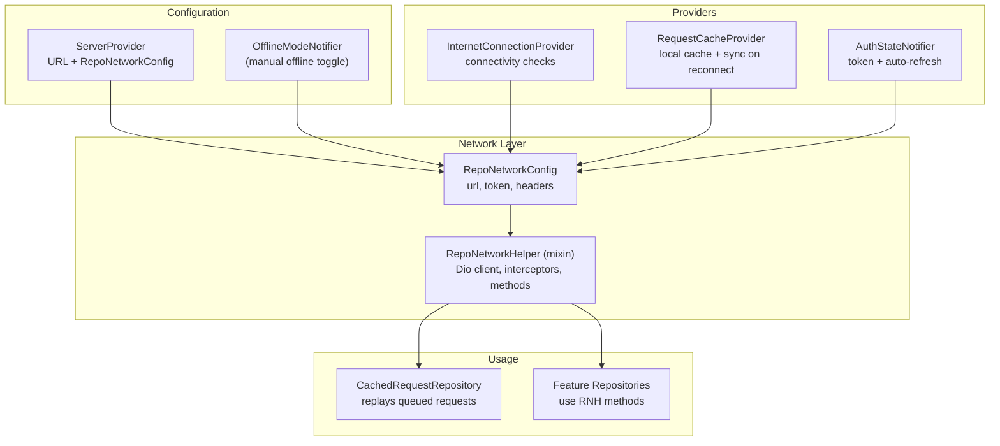
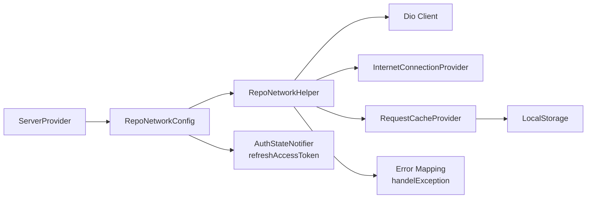

# Network Client API

<cite>
**Referenced Files in This Document**
- [repo_network_helper.dart](file://lib/app/core/logic/repository/repo_network_helper.dart)
- [server_provider.dart](file://lib/app/core/provider/server_provider.dart)
- [internet_connection_provider.dart](file://lib/app/core/provider/internet_connection_provider.dart)
- [request_cache_provider.dart](file://lib/app/core/provider/request_cache_provider.dart)
- [error.dart](file://lib/app/core/logic/repository/error.dart)
- [auth_state_provider.dart](file://lib/app/features/authentication/app_state/auth_state_provider.dart)
- [cached_request_repository.dart](file://lib/app/core/logic/repository/cached_request_repository.dart)
</cite>

## Table of Contents
1. Introduction
2. Project Structure
3. Core Components
4. Architecture Overview
5. Detailed Component Analysis
6. Dependency Analysis
7. Performance Considerations
8. Troubleshooting Guide
9. Conclusion

## Introduction
This document describes the network client system used by Leadership Edge Live LMS. It focuses on configuration via RepoNetworkConfig, HTTP request/response handling, interceptor-based token refresh, error handling strategies, offline mode support, and server provider configuration for environment-based URL management. It also provides practical guidance for configuring the client, setting up interceptors for authentication and logging, handling different response formats, and managing network errors.

## Project Structure
The network layer is implemented as a reusable mixin that builds a configured Dio client, handles serialization and multipart bodies, integrates with connectivity and caching providers, and exposes typed HTTP methods. Configuration and dependency wiring are provided by Riverpod providers.



**Diagram sources**
- [server_provider.dart:8-38](file://lib/app/core/provider/server_provider.dart#L8-L38)
- [internet_connection_provider.dart:9-36](file://lib/app/core/provider/internet_connection_provider.dart#L9-L36)
- [request_cache_provider.dart:9-28](file://lib/app/core/provider/request_cache_provider.dart#L9-L28)
- [repo_network_helper.dart:31-70](file://lib/app/core/logic/repository/repo_network_helper.dart#L31-L70)
- [repo_network_helper.dart:72-128](file://lib/app/core/logic/repository/repo_network_helper.dart#L72-L128)
- [cached_request_repository.dart:9-30](file://lib/app/core/logic/repository/cached_request_repository.dart#L9-L30)

**Section sources**
- [server_provider.dart:8-38](file://lib/app/core/provider/server_provider.dart#L8-L38)
- [repo_network_helper.dart:31-128](file://lib/app/core/logic/repository/repo_network_helper.dart#L31-L128)

## Core Components
- RepoNetworkConfig: Central configuration object holding base URL, optional auth token, connection provider, optional request cache provider, manual offline flag, and token refresh callback.
- RepoNetworkHelper (mixin): Builds a Dio client with timeouts and default headers, adds an error interceptor for automatic token refresh, exposes GET/POST/PUT/PATCH/DELETE helpers, body conversion (including FormData), offline detection, and caching integration.
- InternetConnectionProvider: Monitors device connectivity using app-server-specific and fallback endpoints; exposes current status and stream.
- RequestCacheProvider: Persists GET responses and queued POST requests locally; replays queued requests when connectivity returns.
- ServerProvider: Provides environment-based API URL and constructs RepoNetworkConfig with live references to auth state, connectivity, and offline mode.
- Error Handling: Centralized mapping from Dio exceptions to domain-specific exceptions with user-friendly messages.

**Section sources**
- [repo_network_helper.dart:31-128](file://lib/app/core/logic/repository/repo_network_helper.dart#L31-L128)
- [internet_connection_provider.dart:9-36](file://lib/app/core/provider/internet_connection_provider.dart#L9-L36)
- [request_cache_provider.dart:9-78](file://lib/app/core/provider/request_cache_provider.dart#L9-L78)
- [server_provider.dart:8-38](file://lib/app/core/provider/server_provider.dart#L8-L38)
- [error.dart:19-93](file://lib/app/core/logic/repository/error.dart#L19-L93)

## Architecture Overview
The network client is built around a single Dio instance per RepoNetworkHelper usage. Requests flow through:
- Offline check: If offline or manual offline is enabled, use cached data or queue POSTs.
- Serialization: Convert application objects to network payloads; detect and wrap FormData when needed.
- Interceptors: On 401, attempt to refresh the access token once and retry the original request.
- Caching: For GET requests, optionally cache responses; for POST, optionally queue for later replay.
- Error mapping: Convert low-level network errors into typed exceptions consumed by callers.

```mermaid
sequenceDiagram
participant Caller as "Caller Repository"
participant Helper as "RepoNetworkHelper"
participant Dio as "Dio Client"
participant Auth as "AuthStateNotifier"
participant Cache as "RequestCacheProvider"
Caller->>Helper : post/get/put/patch/delete(...)
Helper->>Helper : isOffline?
alt Offline
Helper->>Cache : getCachedGet / cacheStore
Cache-->>Helper : cached response or null
Helper-->>Caller : cached data or queued
else Online
Helper->>Helper : serializeToNetwork / optionsFor
Helper->>Dio : send request
Dio-->>Helper : response or error
opt 401 Unauthorized
Helper->>Auth : refreshToken()
Auth-->>Helper : new token or null
alt Token refreshed
Helper->>Dio : retry with new Authorization header
Dio-->>Helper : final response
else Refresh failed
Helper-->>Caller : propagate error
end
else Success
Helper->>Cache : cacheGetRequest (if applicable)
Helper-->>Caller : response.data
end
end
```

**Diagram sources**
- [repo_network_helper.dart:79-128](file://lib/app/core/logic/repository/repo_network_helper.dart#L79-L128)
- [repo_network_helper.dart:239-394](file://lib/app/core/logic/repository/repo_network_helper.dart#L239-L394)
- [request_cache_provider.dart:34-78](file://lib/app/core/provider/request_cache_provider.dart#L34-L78)
- [auth_state_provider.dart:114-150](file://lib/app/features/authentication/app_state/auth_state_provider.dart#L114-L150)

## Detailed Component Analysis

### RepoNetworkConfig
Purpose:
- Holds base URL, optional bearer token, connection provider, optional request cache provider, manual offline flag, and token refresh callback.
- Normalizes baseUrl to always end with "/".
- Builds default headers including content-type and Authorization when a token is present.

Key options:
- url: Base API origin (environment-driven).
- authToken: Optional Bearer token injected into headers.
- connectionProvider: Connectivity source used to determine offline state.
- requestCacheProvider: Optional persistence for GET responses and queued POSTs.
- isManualOffline: Live function to read UI offline toggle at call time.
- refreshToken: Callback invoked on 401 to obtain a fresh access token.

Typical construction:
- Provided by ServerProvider.repoConfigProvider, which wires URL, token, connectivity, cache, offline toggle, and token refresh.

**Section sources**
- [repo_network_helper.dart:31-70](file://lib/app/core/logic/repository/repo_network_helper.dart#L31-L70)
- [server_provider.dart:19-38](file://lib/app/core/provider/server_provider.dart#L19-L38)

### RepoNetworkHelper (HTTP client and interceptors)
Responsibilities:
- Build a Dio client with base URL, headers, and timeouts.
- Add an error interceptor that:
  - Detects 401 Unauthorized.
  - Calls config.refreshToken once per failing request.
  - Retries the original request with the new Authorization header.
  - Prevents infinite retry loops via a request extra flag.
- Provide HTTP methods:
  - post(url, data, queryParameters, options, cancelToken, progress callbacks, cacheType)
  - getRequest(url, queryParameters, options, cancelToken, progress, cacheType)
  - put(url, data, ...)
  - deleteRequest(url, data, ...)
  - patch(url, data, ...)
- Body conversion:
  - serializeToNetwork recursively transforms values (e.g., DateTime to ISO strings).
  - shouldUseFormData detects MultipartFile or nested structures requiring multipart.
  - prepareFormData flattens arrays into indexed keys for multipart.
  - optionsFor sets correct contentType for FormData to avoid JSON encoding conflicts.
- Offline behavior:
  - isOffline combines manual offline flag and connectivity provider.
  - performOfflineRequest serves cached GET responses or queues POST requests.
- Caching:
  - cacheRequest persists GET responses or queued POSTs based on cacheType.

Timeouts:
- connectTimeout: 20 seconds
- receiveTimeout: 20 seconds
- sendTimeout: 30 seconds

Error handling:
- All methods catch and map Dio/network errors via handelException before rethrowing.

**Section sources**
- [repo_network_helper.dart:72-193](file://lib/app/core/logic/repository/repo_network_helper.dart#L72-L193)
- [repo_network_helper.dart:239-478](file://lib/app/core/logic/repository/repo_network_helper.dart#L239-L478)
- [error.dart:19-93](file://lib/app/core/logic/repository/error.dart#L19-L93)

### InternetConnectionProvider
Responsibilities:
- Monitor connectivity using a primary check against the app’s own server endpoint and a reliable fallback (Cloudflare DNS).
- Expose isConnected and a broadcast stream for connectivity changes.
- Ensure idempotent initialization and only notify listeners on actual state transitions.

Configuration:
- Uses the current SERVER_URL to probe the app server.
- enableStrictCheck is false so either check passing indicates connectivity.

**Section sources**
- [internet_connection_provider.dart:9-36](file://lib/app/core/provider/internet_connection_provider.dart#L9-L36)
- [internet_connection_provider.dart:51-79](file://lib/app/core/provider/internet_connection_provider.dart#L51-L79)

### RequestCacheProvider
Responsibilities:
- Persist GET responses under keys derived from path.
- Queue POST requests under a shared list key.
- On connectivity restoration, replay queued POST requests via CachedRequestRepository and persist any failures.

Data model:
- CachableRequest stores path, params, body, and response for serialization.

**Section sources**
- [request_cache_provider.dart:9-78](file://lib/app/core/provider/request_cache_provider.dart#L9-L78)
- [request_cache_provider.dart:81-118](file://lib/app/core/provider/request_cache_provider.dart#L81-L118)

### ServerProvider and Environment-Based URLs
Responsibilities:
- Provide the API base URL from build-time environment variables (SERVER_URL) with a staging default.
- Construct RepoNetworkConfig with live references to:
  - Current auth token
  - Connectivity provider
  - Request cache provider
  - Manual offline toggle
  - Token refresh callback

Build-time override example:
- flutter run --dart-define=SERVER_URL=https://your-api.example.com/api/web/

**Section sources**
- [server_provider.dart:8-17](file://lib/app/core/provider/server_provider.dart#L8-L17)
- [server_provider.dart:19-38](file://lib/app/core/provider/server_provider.dart#L19-L38)

### Authentication and Token Refresh Flow
- When a request receives a 401, the helper’s interceptor calls config.refreshToken.
- The refresh implementation uses stored credentials to obtain a new access token and updates persisted session state.
- On success, the original request is retried with the new Authorization header; on failure, the 401 propagates to callers.

**Section sources**
- [repo_network_helper.dart:88-123](file://lib/app/core/logic/repository/repo_network_helper.dart#L88-L123)
- [auth_state_provider.dart:114-150](file://lib/app/features/authentication/app_state/auth_state_provider.dart#L114-L150)

### Offline Mode Support
- isOffline evaluates both manual offline toggle and real connectivity.
- GET requests return cached data if available; otherwise throw a “No Internet” exception.
- POST requests are queued and replayed when connectivity returns.

**Section sources**
- [repo_network_helper.dart:127-128](file://lib/app/core/logic/repository/repo_network_helper.dart#L127-L128)
- [repo_network_helper.dart:257-283](file://lib/app/core/logic/repository/repo_network_helper.dart#L257-L283)
- [request_cache_provider.dart:63-78](file://lib/app/core/provider/request_cache_provider.dart#L63-L78)

### Error Handling Strategies
- Centralized mapping from DioException types to domain exceptions:
  - Timeouts -> AppException with clear messages
  - Bad responses -> BadRequestException, UnauthorizedException, NotFoundException, InvalidInputException, TooManyRequestException, etc.
  - Connection errors -> InternetException
  - Unknown errors -> FetchDataException
- Non-Dio SocketExceptions are also mapped to InternetException.

**Section sources**
- [error.dart:19-93](file://lib/app/core/logic/repository/error.dart#L19-L93)

## Dependency Analysis


**Diagram sources**
- [server_provider.dart:19-38](file://lib/app/core/provider/server_provider.dart#L19-L38)
- [repo_network_helper.dart:72-128](file://lib/app/core/logic/repository/repo_network_helper.dart#L72-L128)
- [internet_connection_provider.dart:9-36](file://lib/app/core/provider/internet_connection_provider.dart#L9-L36)
- [request_cache_provider.dart:9-28](file://lib/app/core/provider/request_cache_provider.dart#L9-L28)
- [error.dart:19-93](file://lib/app/core/logic/repository/error.dart#L19-L93)

**Section sources**
- [server_provider.dart:19-38](file://lib/app/core/provider/server_provider.dart#L19-L38)
- [repo_network_helper.dart:72-128](file://lib/app/core/logic/repository/repo_network_helper.dart#L72-L128)

## Performance Considerations
- Timeouts prevent indefinite hangs; tune connect/receive/send timeouts according to your network profile.
- Avoid excessive retries; the 401 refresh interceptor retries at most once per request to prevent loops.
- Use caching for GET endpoints that are stable to reduce network load and improve perceived performance.
- Defer heavy work until connectivity returns by queuing POST requests instead of blocking the UI.

[No sources needed since this section provides general guidance]

## Troubleshooting Guide
Common issues and resolutions:
- Persistent loading spinners: Ensure timeouts are set and errors are surfaced; verify error mapping is active.
- Repeated 401 loops: Confirm the refresh callback returns a valid token and that the retry flag prevents infinite retries.
- Multipart upload failures: Verify FormData detection and contentType override via optionsFor to avoid JSON encoding attempts.
- Offline behavior not working: Check manual offline toggle and connectivity provider; ensure cache keys exist for GET requests.
- Queued requests not replaying: Validate connectivity change listener and CachedRequestRepository usage.

**Section sources**
- [repo_network_helper.dart:79-128](file://lib/app/core/logic/repository/repo_network_helper.dart#L79-L128)
- [repo_network_helper.dart:129-193](file://lib/app/core/logic/repository/repo_network_helper.dart#L129-L193)
- [error.dart:19-93](file://lib/app/core/logic/repository/error.dart#L19-L93)
- [request_cache_provider.dart:63-78](file://lib/app/core/provider/request_cache_provider.dart#L63-L78)

## Conclusion
The network client provides a robust, configurable foundation for API communication in Leadership Edge Live LMS. RepoNetworkConfig centralizes settings, RepoNetworkHelper encapsulates HTTP logic with interceptors and offline support, and providers wire environment-based URLs, connectivity, caching, and authentication. By following the patterns described here, you can reliably configure endpoints, handle diverse response formats, implement secure token refresh, and deliver resilient offline-first experiences.

[No sources needed since this section summarizes without analyzing specific files]