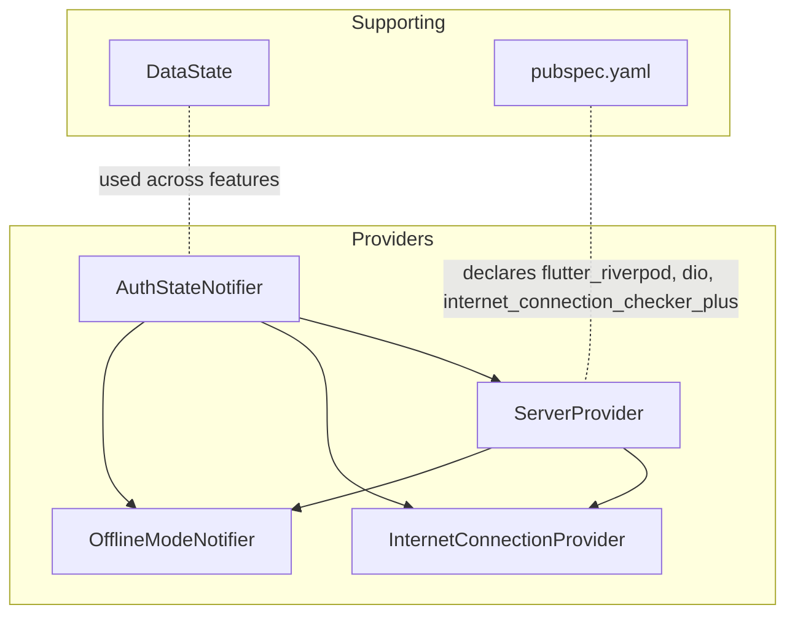
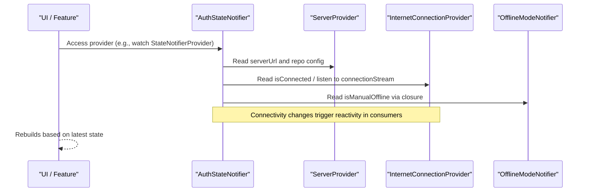
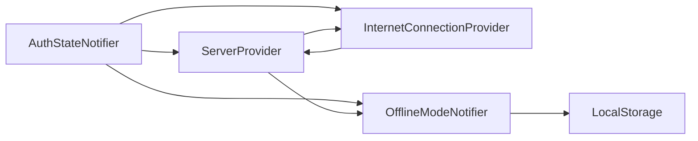

# Provider APIs

<cite>
**Referenced Files in This Document**
- [server_provider.dart](file://lib/app/core/provider/server_provider.dart)
- [auth_state_provider.dart](file://lib/app/features/authentication/app_state/auth_state_provider.dart)
- [internet_connection_provider.dart](file://lib/app/core/provider/internet_connection_provider.dart)
- [offline_mode_provider.dart](file://lib/app/core/provider/offline_mode_provider.dart)
- [data_state.dart](file://lib/app/core/logic/data_state/data_state.dart)
- [pubspec.yaml](file://pubspec.yaml)
</cite>

## Table of Contents
1. [Introduction](#introduction)
2. [Project Structure](#project-structure)
3. [Core Components](#core-components)
4. [Architecture Overview](#architecture-overview)
5. [Detailed Component Analysis](#detailed-component-analysis)
6. [Dependency Analysis](#dependency-analysis)
7. [Performance Considerations](#performance-considerations)
8. [Troubleshooting Guide](#troubleshooting-guide)
9. [Conclusion](#conclusion)
10. [Appendices](#appendices)

## Introduction
This document provides comprehensive API documentation for the Riverpod provider system used by the Leadership Edge Live LMS. It focuses on:
- ServerProvider for server configuration and dependency injection
- AuthStateNotifier for authentication state management
- InternetConnectionProvider for connectivity monitoring
- OfflineModeNotifier for offline functionality

It explains provider creation patterns, dependency injection setup, reactive state updates, lifecycle management, and best practices for organization and performance optimization.

## Project Structure
The providers are organized under lib/app/core/provider and feature-specific state providers under lib/app/features. The application uses Riverpod for state management and dependency injection, with additional packages for networking, caching, and connectivity checks.

**Diagram sources**
- [server_provider.dart:1-40](file://lib/app/core/provider/server_provider.dart#L1-L40)
- [auth_state_provider.dart:1-203](file://lib/app/features/authentication/app_state/auth_state_provider.dart#L1-L203)
- [internet_connection_provider.dart:1-100](file://lib/app/core/provider/internet_connection_provider.dart#L1-L100)
- [offline_mode_provider.dart:1-37](file://lib/app/core/provider/offline_mode_provider.dart#L1-L37)
- [data_state.dart:1-22](file://lib/app/core/logic/data_state/data_state.dart#L1-L22)
- [pubspec.yaml:30-60](file://pubspec.yaml#L30-L60)

**Section sources**
- [pubspec.yaml:30-60](file://pubspec.yaml#L30-L60)

## Core Components
- ServerProvider: Provides the configured server URL and a RepoNetworkConfig that wires dependencies like auth token, connection status, request cache, manual offline mode, and token refresh.
- InternetConnectionProvider: Monitors network connectivity using app server endpoint plus a reliable fallback; exposes current status, stream, and listener callbacks.
- OfflineModeNotifier: Manages a user-controlled offline toggle persisted to storage; when enabled, requests behave as if offline.
- AuthStateNotifier: Manages authenticated session state, login/logout, profile updates, token refresh, and initialization/validation logic. Integrates with offline helpers and sync queue repository.

Key responsibilities and interactions:
- Dependency injection via Riverpod providers ensures singletons and controlled lifecycles.
- Reactive updates propagate changes to UI and dependent services.
- Lifecycle methods handle initialization, validation, and cleanup.

**Section sources**
- [server_provider.dart:8-39](file://lib/app/core/provider/server_provider.dart#L8-L39)
- [internet_connection_provider.dart:9-99](file://lib/app/core/provider/internet_connection_provider.dart#L9-L99)
- [offline_mode_provider.dart:11-36](file://lib/app/core/provider/offline_mode_provider.dart#L11-L36)
- [auth_state_provider.dart:15-203](file://lib/app/features/authentication/app_state/auth_state_provider.dart#L15-L203)

## Architecture Overview
The provider architecture centers around a small set of core providers that other parts of the app consume through Riverpod. ServerProvider composes RepoNetworkConfig with live references to authentication and connectivity. AuthStateNotifier orchestrates authentication flows and integrates with offline behavior. InternetConnectionProvider supplies real-time connectivity events. OfflineModeNotifier allows explicit offline simulation.

**Diagram sources**
- [server_provider.dart:15-38](file://lib/app/core/provider/server_provider.dart#L15-L38)
- [auth_state_provider.dart:15-32](file://lib/app/features/authentication/app_state/auth_state_provider.dart#L15-L32)
- [internet_connection_provider.dart:18-99](file://lib/app/core/provider/internet_connection_provider.dart#L18-L99)
- [offline_mode_provider.dart:11-35](file://lib/app/core/provider/offline_mode_provider.dart#L11-L35)

## Detailed Component Analysis

### ServerProvider
Purpose:
- Provide the runtime server URL from environment or default.
- Build a RepoNetworkConfig that injects dependencies needed by repositories and view models.

Key behaviors:
- serverUrl: Resolves to an environment-defined value or a default staging URL.
- repoConfigProvider: Constructs RepoNetworkConfig with:
  - url from serverUrl
  - authToken from current AuthState
  - connectionProvider from InternetConnectionProvider
  - requestCacheProvider from RequestCacheProvider
  - isManualOffline via ref.read(OfflineModeNotifier.provider) to avoid tearing down already-initialized providers
  - refreshToken via ref.read(AuthStateNotifier.provider.notifier).refreshAccessToken()

Design notes:
- Uses ref.read for dynamic toggles and refresh functions to prevent unnecessary rebuilds when flags change.
- Centralizes configuration so repositories can be constructed consistently.

Usage patterns:
- Consume serverUrl where base URLs are needed.
- Consume repoConfigProvider to build network clients or repositories.

**Section sources**
- [server_provider.dart:8-39](file://lib/app/core/provider/server_provider.dart#L8-L39)

### InternetConnectionProvider
Purpose:
- Monitor device connectivity with a primary check against the app’s own server and a reliable fallback.
- Expose current connectivity status, a broadcast stream of changes, and listener registration.

Key behaviors:
- Initializes once and subscribes to connection status changes.
- Emits only on actual transitions to avoid noisy updates.
- Provides:
  - isConnected getter
  - connectionStream broadcast stream
  - addListener/removeListener callbacks

Initialization:
- Idempotent initialize method ensures a single subscription even when called multiple times.

Integration:
- Consumed by ServerProvider and AuthStateNotifier to adapt behavior based on connectivity.

**Section sources**
- [internet_connection_provider.dart:9-99](file://lib/app/core/provider/internet_connection_provider.dart#L9-L99)

### OfflineModeNotifier
Purpose:
- Manage a user-controlled offline mode toggle that persists across app restarts.
- When enabled, signals to the system to treat the app as offline regardless of real connectivity.

Key behaviors:
- Loads persisted preference at startup.
- Provides toggle() and setMode(value) to update state and persist.
- Used via ref.read closures to avoid tearing down dependent providers when toggled.

Integration:
- Referenced by ServerProvider’s repoConfigProvider to influence request behavior without recreating existing providers.

**Section sources**
- [offline_mode_provider.dart:11-36](file://lib/app/core/provider/offline_mode_provider.dart#L11-L36)

### AuthStateNotifier
Purpose:
- Manage authentication state, including login, logout, profile updates, token refresh, and initialization.
- Integrate with offline helpers and sync queue repository to support offline-first workflows.

Key behaviors:
- Provider definition wires dependencies: server URL, local storage, connectivity, and sync queue repository.
- Login flow:
  - If offline, attempts to restore session from local storage.
  - Otherwise, authenticates via repository and persists session data.
- Profile updates:
  - Avoids redundant state replacements by comparing profiles.
  - Persists updated profile to storage.
- Token refresh:
  - De-duplicates concurrent refresh attempts.
  - Calls auto-login with stored credentials and updates/persists state.
- Initialization:
  - Restores session from storage.
  - Validates token online or defers validation until connected.
- Logout:
  - Clears session and queued offline completions while preserving downloaded content.

Lifecycle:
- Uses mounted checks to avoid updating after disposal.
- Completer-based initialization signaling for external coordination.

**Section sources**
- [auth_state_provider.dart:15-203](file://lib/app/features/authentication/app_state/auth_state_provider.dart#L15-L203)

## Dependency Analysis
Riverpod providers form a clear dependency graph:
- AuthStateNotifier depends on ServerProvider, InternetConnectionProvider, LocalStorage, and SyncQueueRepository.
- ServerProvider constructs RepoNetworkConfig depending on InternetConnectionProvider, RequestCacheProvider, OfflineModeNotifier, and AuthStateNotifier.
- InternetConnectionProvider depends on ServerProvider for the target endpoint.
- OfflineModeNotifier depends on LocalStorage.

**Diagram sources**
- [auth_state_provider.dart:15-32](file://lib/app/features/authentication/app_state/auth_state_provider.dart#L15-L32)
- [server_provider.dart:15-38](file://lib/app/core/provider/server_provider.dart#L15-L38)
- [internet_connection_provider.dart:9-16](file://lib/app/core/provider/internet_connection_provider.dart#L9-L16)
- [offline_mode_provider.dart:11-15](file://lib/app/core/provider/offline_mode_provider.dart#L11-L15)

**Section sources**
- [auth_state_provider.dart:15-32](file://lib/app/features/authentication/app_state/auth_state_provider.dart#L15-L32)
- [server_provider.dart:15-38](file://lib/app/core/provider/server_provider.dart#L15-L38)
- [internet_connection_provider.dart:9-16](file://lib/app/core/provider/internet_connection_provider.dart#L9-L16)
- [offline_mode_provider.dart:11-15](file://lib/app/core/provider/offline_mode_provider.dart#L11-L15)

## Performance Considerations
- Use ref.read for dynamic values (like offline mode and refresh functions) to avoid tearing down already-initialized providers when flags change.
- Debounce or guard connection change notifications to emit only on actual transitions, preventing unnecessary refreshes.
- De-duplicate concurrent operations (e.g., token refresh) to reduce network load and race conditions.
- Prefer immutable state updates and equality checks to minimize rebuilds (e.g., profile comparison before replacing state).
- Initialize connectivity checks idempotently to avoid duplicate listeners and redundant probes.

[No sources needed since this section provides general guidance]

## Troubleshooting Guide
Common issues and resolutions:
- Duplicate connection listeners causing spurious reconnects:
  - Ensure initialize runs once and subscriptions are managed centrally.
  - Verify listeners are removed on dispose.
- Unnecessary rebuilds when toggling offline mode:
  - Use ref.read for offline mode flag inside configurations rather than ref.watch.
- Concurrent token refresh storms:
  - Guard refresh calls with a single in-flight future to de-duplicate.
- Stale sessions after logout:
  - Clear session storage and queued offline completions during logout.

**Section sources**
- [internet_connection_provider.dart:39-79](file://lib/app/core/provider/internet_connection_provider.dart#L39-L79)
- [server_provider.dart:25-36](file://lib/app/core/provider/server_provider.dart#L25-L36)
- [auth_state_provider.dart:114-129](file://lib/app/features/authentication/app_state/auth_state_provider.dart#L114-L129)
- [auth_state_provider.dart:152-162](file://lib/app/features/authentication/app_state/auth_state_provider.dart#L152-L162)

## Conclusion
The Riverpod provider system in the Leadership Edge Live LMS is designed for clarity, performance, and resilience:
- ServerProvider centralizes configuration and dependency wiring.
- InternetConnectionProvider offers robust connectivity monitoring with minimal noise.
- OfflineModeNotifier enables explicit offline behavior with persistence.
- AuthStateNotifier manages authentication lifecycle, integrates with offline workflows, and optimizes for concurrency and stability.

Adhering to the patterns and best practices outlined here will help maintain a responsive, testable, and scalable application.

[No sources needed since this section summarizes without analyzing specific files]

## Appendices

### Provider Creation Patterns
- Stateless configuration providers:
  - Use Provider for read-only values derived from environment or other providers (e.g., serverUrl).
- Stateful notifiers:
  - Use StateNotifierProvider for complex state with side effects (e.g., AuthStateNotifier, OfflineModeNotifier).
- Singleton-like services:
  - Wrap classes with Providers to manage lifecycle and dependencies (e.g., InternetConnectionProvider).

Examples:
- Create a custom provider for a service that depends on connectivity and storage:
  - Define a class with required dependencies injected via constructor.
  - Expose a static Provider that reads dependencies from ref.
  - Use ref.watch for reactive dependencies and ref.read for non-reactive access when appropriate.

Accessing provider dependencies:
- In providers: use ref.watch to subscribe to changes or ref.read to fetch values without subscribing.
- In widgets: use ConsumerWidget or ref.watch to react to provider changes.

Handling provider state changes:
- Update state immutably in notifiers to ensure efficient rebuilds.
- Guard updates with mounted checks to avoid post-disposal mutations.

Implementing complex provider logic:
- Encapsulate asynchronous operations within notifiers.
- De-duplicate concurrent work using in-flight futures.
- Persist critical state to storage to survive restarts.

Best practices for organization:
- Group related providers by feature or layer.
- Keep providers small and focused on a single responsibility.
- Use composition to build complex configurations from smaller providers.

Optimization tips:
- Prefer ref.read for flags and functions that should not cause teardown.
- Emit minimal updates (e.g., only on actual connectivity transitions).
- Avoid heavy computations in provider constructors; defer to lazy initialization.

[No sources needed since this section provides general guidance]