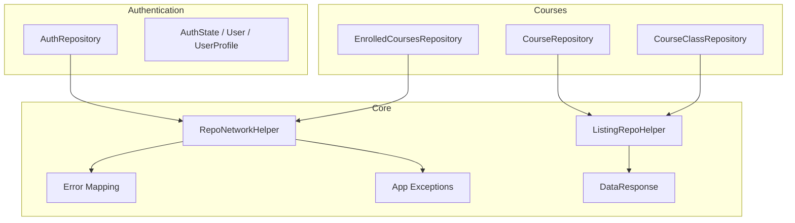
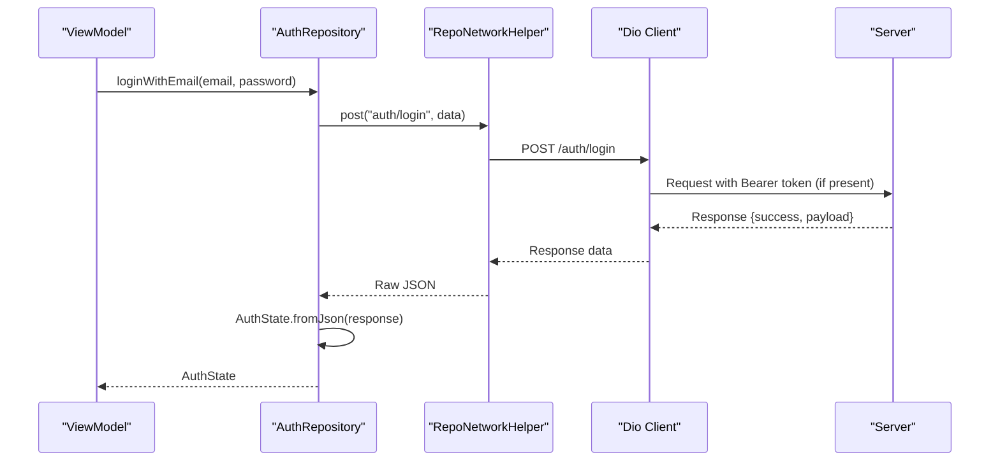
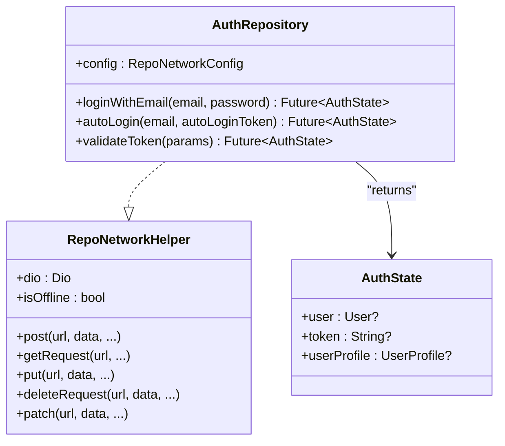
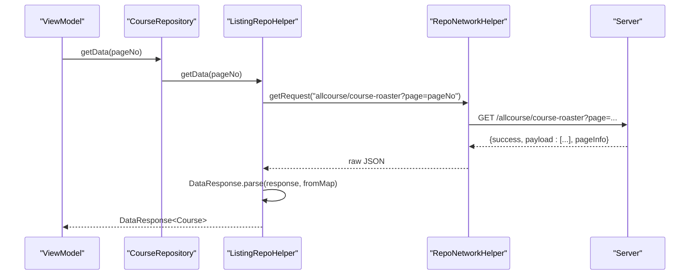
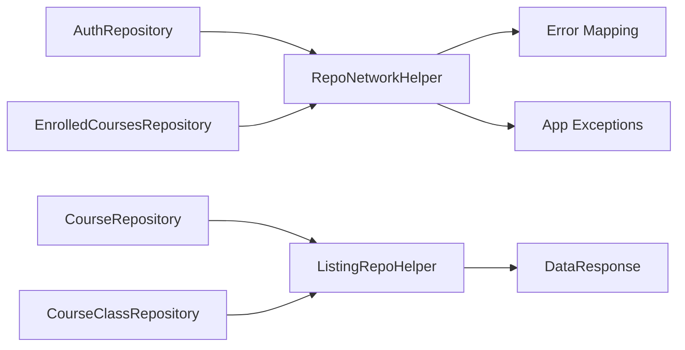

# Repository Interfaces

<cite>
**Referenced Files in This Document**
- [auth_repository.dart](file://lib/app/features/authentication/repository/auth_repository.dart)
- [repo_network_helper.dart](file://lib/app/core/logic/repository/repo_network_helper.dart)
- [listing_repo_helper.dart](file://lib/app/core/logic/repository/listing_repo_helper.dart)
- [error.dart](file://lib/app/core/logic/repository/error.dart)
- [app_exception.dart](file://lib/app/core/logic/repository/app_exception.dart)
- [data_response.dart](file://lib/app/core/model/data_response.dart)
- [course_repository.dart](file://lib/app/features/courses/repository/course_repository.dart)
- [course_class_repository.dart](file://lib/app/features/courses/repository/course_class_repository.dart)
- [enrolled_courses_repository.dart](file://lib/app/features/dashboard/repository/enrolled_courses_repository.dart)
- [redirect_login_repository.dart](file://lib/app/features/courses/repository/redirect_login_repository.dart)
- [auth_state.dart](file://lib/app/features/authentication/model/auth_state.dart)
</cite>

## Table of Contents
1. [Introduction](#introduction)
2. [Project Structure](#project-structure)
3. [Core Components](#core-components)
4. [Architecture Overview](#architecture-overview)
5. [Detailed Component Analysis](#detailed-component-analysis)
6. [Dependency Analysis](#dependency-analysis)
7. [Performance Considerations](#performance-considerations)
8. [Troubleshooting Guide](#troubleshooting-guide)
9. [Conclusion](#conclusion)

## Introduction
This document provides comprehensive API documentation for the repository layer in the Leadership Edge Live LMS. It focuses on the repository pattern implementation, detailing method signatures, parameters, return types, and error handling patterns. It covers:
- AuthRepository for authentication operations (login, auto-login/token refresh support, token validation).
- CourseRepository and related repositories for course data operations (fetching courses, enrollment, progress tracking).
- Base helper methods and common patterns used across all repositories via mixins and shared configuration.
- Integration with the network layer using a centralized HTTP client with offline caching, retry-on-401, and standardized error mapping.

## Project Structure
The repository layer is organized under feature modules with shared core helpers:
- Core networking and error handling live under lib/app/core/logic/repository.
- Feature-specific repositories live under lib/app/features/<feature>/repository.
- Data models for authentication and responses are under lib/app/features/authentication/model and lib/app/core/model.

**Diagram sources**
- [repo_network_helper.dart:72-126](file://lib/app/core/logic/repository/repo_network_helper.dart#L72-L126)
- [listing_repo_helper.dart:4-24](file://lib/app/core/logic/repository/listing_repo_helper.dart#L4-L24)
- [error.dart:19-94](file://lib/app/core/logic/repository/error.dart#L19-L94)
- [app_exception.dart:6-55](file://lib/app/core/logic/repository/app_exception.dart#L6-L55)
- [data_response.dart:3-19](file://lib/app/core/model/data_response.dart#L3-L19)
- [auth_repository.dart:7-65](file://lib/app/features/authentication/repository/auth_repository.dart#L7-L65)
- [course_repository.dart:7-21](file://lib/app/features/courses/repository/course_repository.dart#L7-L21)
- [course_class_repository.dart:8-23](file://lib/app/features/courses/repository/course_class_repository.dart#L8-L23)
- [enrolled_courses_repository.dart:37-54](file://lib/app/features/dashboard/repository/enrolled_courses_repository.dart#L37-L54)

**Section sources**
- [repo_network_helper.dart:31-70](file://lib/app/core/logic/repository/repo_network_helper.dart#L31-L70)
- [auth_repository.dart:7-65](file://lib/app/features/authentication/repository/auth_repository.dart#L7-L65)
- [course_repository.dart:7-21](file://lib/app/features/courses/repository/course_repository.dart#L7-L21)
- [course_class_repository.dart:8-23](file://lib/app/features/courses/repository/course_class_repository.dart#L8-L23)
- [enrolled_courses_repository.dart:37-54](file://lib/app/features/dashboard/repository/enrolled_courses_repository.dart#L37-L54)

## Core Components
- RepoNetworkConfig: Central configuration for base URL, auth token, connection provider, optional request cache, manual offline mode, and token refresh callback. Provides headers and base URL normalization.
- RepoNetworkHelper: Mixin providing HTTP methods (post, get, put, delete, patch), offline behavior, FormData preparation, serialization, caching hooks, and Dio instance creation with interceptors for automatic 401 retry.
- ListingRepoHelper<T>: Mixin that standardizes paginated GET endpoints by appending page query parameter and parsing responses into DataResponse<T>.
- DataResponse<T>: Generic response wrapper containing typed payload list and PageInfo metadata; parses server responses and enforces success flag and payload shape.
- Error mapping: Converts Dio exceptions to domain-specific AppException subclasses with user-friendly messages.

Key responsibilities:
- Network abstraction and retries
- Offline-first behavior with optional caching
- Consistent error propagation
- Typed response parsing

**Section sources**
- [repo_network_helper.dart:31-126](file://lib/app/core/logic/repository/repo_network_helper.dart#L31-L126)
- [repo_network_helper.dart:239-478](file://lib/app/core/logic/repository/repo_network_helper.dart#L239-L478)
- [listing_repo_helper.dart:4-24](file://lib/app/core/logic/repository/listing_repo_helper.dart#L4-L24)
- [data_response.dart:3-19](file://lib/app/core/model/data_response.dart#L3-L19)
- [error.dart:19-94](file://lib/app/core/logic/repository/error.dart#L19-L94)
- [app_exception.dart:6-55](file://lib/app/core/logic/repository/app_exception.dart#L6-L55)

## Architecture Overview
Repositories implement the repository pattern by composing mixins for networking and listing capabilities. Authentication flows use direct POST calls and token refresh via interceptor. Course-related repositories leverage ListingRepoHelper for consistent pagination and response parsing.

**Diagram sources**
- [auth_repository.dart:16-27](file://lib/app/features/authentication/repository/auth_repository.dart#L16-L27)
- [repo_network_helper.dart:286-350](file://lib/app/core/logic/repository/repo_network_helper.dart#L286-L350)
- [repo_network_helper.dart:79-126](file://lib/app/core/logic/repository/repo_network_helper.dart#L79-L126)

## Detailed Component Analysis

### AuthRepository
Purpose:
- Authenticate users via email/password.
- Exchange an auto-login token for a fresh access token without re-entering credentials.
- Validate current session by probing a protected endpoint or refreshing via auto-login if needed.

Methods:
- loginWithEmail({required String email, required String password}) -> Future<AuthState>
  - Posts to "auth/login" with email and password.
  - Returns parsed AuthState.
  - Uses RequestCacheType.none to avoid caching sensitive data.
- autoLogin({required String email, required String autoLoginToken}) -> Future<AuthState>
  - Posts to "auth/auto-login" to exchange tokens.
  - Returns parsed AuthState.
- validateToken(AuthState params) -> Future<AuthState>
  - Attempts a protected GET ("allcourse") to verify session validity.
  - On failure, attempts auto-login using stored autoLoginToken and email from params.
  - Throws UnauthorizedException when required tokens are missing.

Integration notes:
- Inherits RepoNetworkHelper for HTTP calls and error mapping.
- Relies on RepoNetworkConfig.refreshToken for automatic 401 retry at the network layer.

Error handling:
- UnauthorizedException thrown when auto-login token or email is missing during validation.
- All network errors mapped to AppException subclasses by RepoNetworkHelper.

**Section sources**
- [auth_repository.dart:7-65](file://lib/app/features/authentication/repository/auth_repository.dart#L7-L65)
- [repo_network_helper.dart:79-126](file://lib/app/core/logic/repository/repo_network_helper.dart#L79-L126)
- [app_exception.dart:43-45](file://lib/app/core/logic/repository/app_exception.dart#L43-L45)

#### Class Diagram: AuthRepository

**Diagram sources**
- [auth_repository.dart:7-65](file://lib/app/features/authentication/repository/auth_repository.dart#L7-L65)
- [repo_network_helper.dart:72-126](file://lib/app/core/logic/repository/repo_network_helper.dart#L72-L126)
- [auth_state.dart:12-93](file://lib/app/features/authentication/model/auth_state.dart#L12-L93)

### CourseRepository and Related Repositories
Purpose:
- Fetch paginated course rosters and events.
- Provide enrollment and progress data via dedicated repositories.

CourseRepository:
- Mixes RepoNetworkHelper and ListingRepoHelper<Course>.
- Defines endPoint = "allcourse/course-roaster".
- Implements fromMap = Course.fromJson.
- Exposes getData(pageNo, queryParams) via ListingRepoHelper which appends page query and parses into DataResponse<Course>.

CourseClassRepository:
- Similar structure for events.
- endPoint = "allcourse/events".
- fromMap = CourseClass.fromJson.

EnrolledCoursesRepository:
- Directly uses getRequest to fetch enrolled courses for a user.
- Validates status field and throws descriptive Exception on failure.
- Parses result into EnrolledCoursesResult.

RedirectLoginRepository:
- Retrieves a pre-authenticated redirect link for WebView flows.
- Returns null on any failure to allow fallback behavior.

Common patterns:
- Pagination via ListingRepoHelper for list endpoints.
- Explicit status checks and custom exceptions where needed.
- Use of RequestCacheType.none for non-cacheable requests.

**Section sources**
- [course_repository.dart:7-21](file://lib/app/features/courses/repository/course_repository.dart#L7-L21)
- [course_class_repository.dart:8-23](file://lib/app/features/courses/repository/course_class_repository.dart#L8-L23)
- [enrolled_courses_repository.dart:37-54](file://lib/app/features/dashboard/repository/enrolled_courses_repository.dart#L37-L54)
- [redirect_login_repository.dart:5-37](file://lib/app/features/courses/repository/redirect_login_repository.dart#L5-L37)
- [listing_repo_helper.dart:4-24](file://lib/app/core/logic/repository/listing_repo_helper.dart#L4-L24)

#### Sequence Diagram: Paginated Course Fetch

**Diagram sources**
- [listing_repo_helper.dart:4-24](file://lib/app/core/logic/repository/listing_repo_helper.dart#L4-L24)
- [repo_network_helper.dart:353-394](file://lib/app/core/logic/repository/repo_network_helper.dart#L353-L394)
- [data_response.dart:3-19](file://lib/app/core/model/data_response.dart#L3-L19)
- [course_repository.dart:7-21](file://lib/app/features/courses/repository/course_repository.dart#L7-L21)

### Base Repository Helper Methods and Common Patterns
- HTTP methods: post, getRequest, put, deleteRequest, patch.
- Offline handling: isOffline check delegates to manual offline toggle and connectivity provider; performOfflineRequest returns cached data or throws when unavailable.
- Serialization: serializeToNetwork recursively converts values (e.g., DateTime to ISO strings); prepareFormData transforms nested arrays to form-compatible keys.
- Caching: cacheRequest stores responses based on RequestCacheType; getCachedGetRequest retrieves cached GET responses when offline.
- Token refresh: Dio interceptor automatically retries once after obtaining a new token via RepoNetworkConfig.refreshToken on 401 responses.

Usage patterns:
- Set RequestCacheType.none for mutations and sensitive reads.
- Use ListingRepoHelper for list endpoints requiring pagination.
- Wrap business logic in try/catch to handle AppException subclasses and map to UI states.

**Section sources**
- [repo_network_helper.dart:79-126](file://lib/app/core/logic/repository/repo_network_helper.dart#L79-L126)
- [repo_network_helper.dart:127-283](file://lib/app/core/logic/repository/repo_network_helper.dart#L127-L283)
- [repo_network_helper.dart:286-478](file://lib/app/core/logic/repository/repo_network_helper.dart#L286-L478)
- [listing_repo_helper.dart:4-24](file://lib/app/core/logic/repository/listing_repo_helper.dart#L4-L24)

## Dependency Analysis
Repositories depend on:
- RepoNetworkHelper for all network I/O and error mapping.
- ListingRepoHelper for standardized pagination and response parsing.
- DataResponse for typed payloads and pagination metadata.
- AuthState models for authentication results.

**Diagram sources**
- [auth_repository.dart:7-65](file://lib/app/features/authentication/repository/auth_repository.dart#L7-L65)
- [course_repository.dart:7-21](file://lib/app/features/courses/repository/course_repository.dart#L7-L21)
- [course_class_repository.dart:8-23](file://lib/app/features/courses/repository/course_class_repository.dart#L8-L23)
- [enrolled_courses_repository.dart:37-54](file://lib/app/features/dashboard/repository/enrolled_courses_repository.dart#L37-L54)
- [listing_repo_helper.dart:4-24](file://lib/app/core/logic/repository/listing_repo_helper.dart#L4-L24)
- [data_response.dart:3-19](file://lib/app/core/model/data_response.dart#L3-L19)
- [error.dart:19-94](file://lib/app/core/logic/repository/error.dart#L19-L94)
- [app_exception.dart:6-55](file://lib/app/core/logic/repository/app_exception.dart#L6-L55)

**Section sources**
- [repo_network_helper.dart:72-126](file://lib/app/core/logic/repository/repo_network_helper.dart#L72-L126)
- [listing_repo_helper.dart:4-24](file://lib/app/core/logic/repository/listing_repo_helper.dart#L4-L24)
- [data_response.dart:3-19](file://lib/app/core/model/data_response.dart#L3-L19)
- [error.dart:19-94](file://lib/app/core/logic/repository/error.dart#L19-L94)
- [app_exception.dart:6-55](file://lib/app/core/logic/repository/app_exception.dart#L6-L55)

## Performance Considerations
- Timeouts: Dio client sets connect/receive/send timeouts to prevent indefinite hangs.
- Retry-on-401: Automatic single retry after token refresh reduces redundant user logins.
- Offline caching: GET requests can be served from cache when offline; POSTs queue or return early depending on cache strategy.
- Pagination: ListingRepoHelper centralizes page parameter handling to minimize duplication and reduce network overhead.
- FormData optimization: Automatic detection and transformation ensure efficient multipart uploads without extra encoding steps.

[No sources needed since this section provides general guidance]

## Troubleshooting Guide
Common issues and strategies:
- 401 Unauthorized: The network layer will attempt token refresh once; if it fails, UnauthorizedException propagates to callers. Ensure RepoNetworkConfig.refreshToken is configured and returns a valid token.
- No Internet: Requests throw InternetException or generic exceptions when offline and no cached data is available. Handle these in viewmodels to show appropriate UI feedback.
- Validation Errors: Server 422 responses are mapped to InvalidInputException with aggregated error messages. Display these to users for corrective action.
- Payload Shape: DataResponse expects a success flag and a list payload; malformed responses raise InvalidResponseException or similar errors.

Actionable tips:
- Wrap repository calls in try/catch blocks and map AppException subclasses to user-facing messages.
- For sensitive endpoints, set RequestCacheType.none to avoid caching tokens or personal data.
- When implementing custom repositories, follow ListingRepoHelper for lists and explicit status checks for non-standard endpoints.

**Section sources**
- [repo_network_helper.dart:79-126](file://lib/app/core/logic/repository/repo_network_helper.dart#L79-L126)
- [error.dart:19-94](file://lib/app/core/logic/repository/error.dart#L19-L94)
- [app_exception.dart:6-55](file://lib/app/core/logic/repository/app_exception.dart#L6-L55)
- [data_response.dart:3-19](file://lib/app/core/model/data_response.dart#L3-L19)

## Conclusion
The repository layer in the Leadership Edge Live LMS provides a robust, reusable foundation for network interactions. AuthRepository encapsulates authentication flows and integrates seamlessly with automatic token refresh. Course-related repositories leverage ListingRepoHelper for consistent pagination and typed responses. Shared helpers enforce offline-first behavior, standardized error handling, and efficient network usage. Following these patterns ensures maintainability, testability, and a consistent developer experience across features.