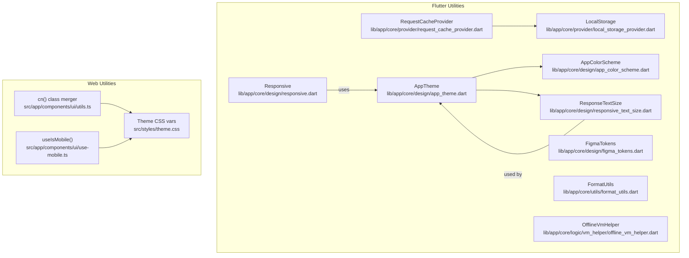
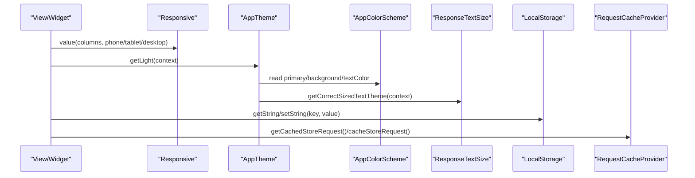
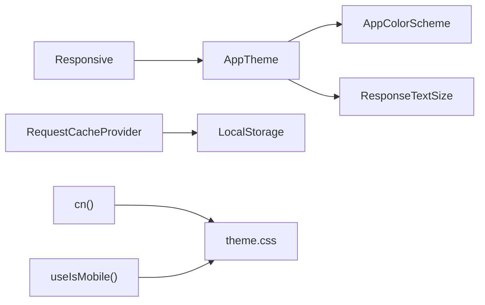

# Utility Functions

<cite>
**Referenced Files in This Document**
- [local_storage_provider.dart](file://lib/app/core/provider/local_storage_provider.dart)
- [request_cache_provider.dart](file://lib/app/core/provider/request_cache_provider.dart)
- [responsive.dart](file://lib/app/core/design/responsive.dart)
- [responsive_text_size.dart](file://lib/app/core/design/responsive_text_size.dart)
- [app_theme.dart](file://lib/app/core/design/app_theme.dart)
- [app_color_scheme.dart](file://lib/app/core/design/app_color_scheme.dart)
- [figma_tokens.dart](file://lib/app/core/design/figma_tokens.dart)
- [utils.ts](file://src/app/components/ui/utils.ts)
- [use-mobile.ts](file://src/app/components/ui/use-mobile.ts)
- [theme.css](file://src/styles/theme.css)
- [format_utils.dart](file://lib/app/core/utils/format_utils.dart)
- [offline_vm_helper.dart](file://lib/app/core/logic/vm_helper/offline_vm_helper.dart)
</cite>

## Table of Contents
1. Introduction
2. Project Structure
3. Core Components
4. Architecture Overview
5. Detailed Component Analysis
6. Dependency Analysis
7. Performance Considerations
8. Troubleshooting Guide
9. Conclusion

## Introduction
This document provides API documentation for utility functions and helper classes used across the Leadership Edge Live LMS. It focuses on:
- Local data persistence utilities (Hive-based storage and request caching)
- Theme management for consistent styling (Flutter theme, color scheme, design tokens)
- Responsive design helpers for adaptive layouts (breakpoints, text sizing, mobile detection)
- Common utilities (string formatting, class name merging, offline reconnection handling)

Each section includes method signatures, parameter descriptions, return values, usage examples, configuration options, and integration patterns.

## Project Structure
The utilities are organized into platform-specific layers:
- Flutter utilities under lib/app/core (storage, design, utils, logic helpers)
- Web UI utilities under src/app/components/ui (class name merging, mobile hook)
- Web theme variables under src/styles (CSS custom properties for theming)

**Diagram sources**
- [local_storage_provider.dart:1-48](file://lib/app/core/provider/local_storage_provider.dart#L1-L48)
- [request_cache_provider.dart:40-83](file://lib/app/core/provider/request_cache_provider.dart#L40-L83)
- [responsive.dart:1-71](file://lib/app/core/design/responsive.dart#L1-L71)
- [responsive_text_size.dart:1-145](file://lib/app/core/design/responsive_text_size.dart#L1-L145)
- [app_theme.dart:1-121](file://lib/app/core/design/app_theme.dart#L1-L121)
- [app_color_scheme.dart:1-105](file://lib/app/core/design/app_color_scheme.dart#L1-L105)
- [figma_tokens.dart:1-46](file://lib/app/core/design/figma_tokens.dart#L1-L46)
- [utils.ts:1-7](file://src/app/components/ui/utils.ts#L1-L7)
- [use-mobile.ts:1-21](file://src/app/components/ui/use-mobile.ts#L1-L21)
- [theme.css:41-160](file://src/styles/theme.css#L41-L160)

**Section sources**
- [local_storage_provider.dart:1-48](file://lib/app/core/provider/local_storage_provider.dart#L1-L48)
- [request_cache_provider.dart:40-83](file://lib/app/core/provider/request_cache_provider.dart#L40-L83)
- [responsive.dart:1-71](file://lib/app/core/design/responsive.dart#L1-L71)
- [responsive_text_size.dart:1-145](file://lib/app/core/design/responsive_text_size.dart#L1-L145)
- [app_theme.dart:1-121](file://lib/app/core/design/app_theme.dart#L1-L121)
- [app_color_scheme.dart:1-105](file://lib/app/core/design/app_color_scheme.dart#L1-L105)
- [figma_tokens.dart:1-46](file://lib/app/core/design/figma_tokens.dart#L1-L46)
- [utils.ts:1-7](file://src/app/components/ui/utils.ts#L1-L7)
- [use-mobile.ts:1-21](file://src/app/components/ui/use-mobile.ts#L1-L21)
- [theme.css:41-160](file://src/styles/theme.css#L41-L160)

## Core Components
- LocalStorage: Key-value storage using Hive with automatic initialization per platform.
- RequestCacheProvider: JSON-based cache for network requests with connectivity-aware replay.
- Responsive: Breakpoint-based layout helpers for Flutter widgets.
- ResponseTextSize: Device-aware TextTheme generation for consistent typography scaling.
- AppTheme: Centralized Material theme builder integrating color scheme and responsive text sizes.
- AppColorScheme: Centralized colors and status colors as a ThemeExtension.
- FigmaTokens: Design token constants aligned with the design system.
- cn(): Tailwind class name merger for web components.
- useIsMobile(): React hook to detect mobile viewport width.
- FormatUtils: String utilities including HTML stripping.
- OfflineVmHelper: ViewModel mixin to schedule callbacks when connectivity is restored.

**Section sources**
- [local_storage_provider.dart:1-48](file://lib/app/core/provider/local_storage_provider.dart#L1-L48)
- [request_cache_provider.dart:40-83](file://lib/app/core/provider/request_cache_provider.dart#L40-L83)
- [responsive.dart:1-71](file://lib/app/core/design/responsive.dart#L1-L71)
- [responsive_text_size.dart:1-145](file://lib/app/core/design/responsive_text_size.dart#L1-L145)
- [app_theme.dart:1-121](file://lib/app/core/design/app_theme.dart#L1-L121)
- [app_color_scheme.dart:1-105](file://lib/app/core/design/app_color_scheme.dart#L1-L105)
- [figma_tokens.dart:1-46](file://lib/app/core/design/figma_tokens.dart#L1-L46)
- [utils.ts:1-7](file://src/app/components/ui/utils.ts#L1-L7)
- [use-mobile.ts:1-21](file://src/app/components/ui/use-mobile.ts#L1-L21)
- [format_utils.dart:38-59](file://lib/app/core/utils/format_utils.dart#L38-L59)
- [offline_vm_helper.dart:1-34](file://lib/app/core/logic/vm_helper/offline_vm_helper.dart#L1-L34)

## Architecture Overview
The utilities form a cohesive layer that supports UI rendering and data operations:
- Storage layer persists app state and caches network requests.
- Theme layer centralizes colors, typography, and breakpoints.
- Responsive utilities adapt layouts and text sizes based on device width.
- Web utilities provide class merging and mobile detection for React components.
- Offline helpers coordinate background tasks upon connectivity restoration.

**Diagram sources**
- [responsive.dart:27-39](file://lib/app/core/design/responsive.dart#L27-L39)
- [app_theme.dart:9-23](file://lib/app/core/design/app_theme.dart#L9-L23)
- [app_color_scheme.dart:7-38](file://lib/app/core/design/app_color_scheme.dart#L7-L38)
- [responsive_text_size.dart:3-15](file://lib/app/core/design/responsive_text_size.dart#L3-L15)
- [local_storage_provider.dart:13-28](file://lib/app/core/provider/local_storage_provider.dart#L13-L28)
- [request_cache_provider.dart:46-61](file://lib/app/core/provider/request_cache_provider.dart#L46-L61)

## Detailed Component Analysis

### LocalStorage (Hive-backed key-value store)
Purpose: Provide simple string key-value persistence across platforms with automatic initialization.

Key methods:
- initialize(): Initializes Hive and opens the named box.
- getString(key): Returns a stored string or null; initializes if needed.
- setString(key, value): Stores a string value; initializes if needed.

Parameters:
- key: String key for the value.
- value: String? to persist.

Return values:
- getString returns String?
- setString returns void

Usage example:
- Persist user preferences: call setString("theme_mode", "dark") and retrieve via getString("theme_mode").

Integration notes:
- Box name defaults to "lms".
- On web, uses Hive.initFlutter(); on native, uses application support directory.

**Section sources**
- [local_storage_provider.dart:6-48](file://lib/app/core/provider/local_storage_provider.dart#L6-L48)

### RequestCacheProvider (Network request cache)
Purpose: Cache serialized network requests and replay them when connectivity is restored.

Key methods:
- getCachedStoreRequest(): Reads cached requests from local storage as JSON list.
- cacheStoreRequest(request): Appends a new request to the cache and persists it.
- onConnectivityChanged(isConnected): Replays successful requests and updates persisted failed ones.

Data model:
- CachableRequest: Represents a path and optional parameters for caching.

Usage example:
- Before sending a network request, check cache; after success, remove from cache; on reconnect, replay remaining items.

Error handling:
- Failed replays are retained; only successful ones are cleared.

**Section sources**
- [request_cache_provider.dart:40-83](file://lib/app/core/provider/request_cache_provider.dart#L40-L83)

### Responsive (Breakpoint utilities)
Purpose: Centralize breakpoints and provide helpers to select values based on screen width.

Key methods:
- widthOf(context): Current width.
- isTablet(context), isTabletOnly(context), isDesktop(context): Boolean checks.
- value<T>(context, phone, tablet?, desktop?): Selects a typed value based on width.
- columnsForWidth(width, phone, tablet?, desktop?, wide?) and columns(context, ...): Grid column selection.

Configuration:
- Breakpoints: tablet = 700, desktop = 1024, wide = 1400.

Usage example:
- columns(context, phone: 1, tablet: 2, desktop: 4) to set grid columns responsively.

**Section sources**
- [responsive.dart:1-71](file://lib/app/core/design/responsive.dart#L1-L71)

### ResponseTextSize (Responsive typography)
Purpose: Generate a TextTheme sized appropriately for the current device width.

Key method:
- getCorrectSizedTextTheme(context): Returns a TextTheme with font sizes mapped to device size ranges.

Behavior:
- Chooses a size tier based on MediaQuery width and applies predefined font sizes for each style slot.

Usage example:
- Pass the returned TextTheme to ThemeData.textTheme to ensure consistent scaling across the app.

**Section sources**
- [responsive_text_size.dart:1-145](file://lib/app/core/design/responsive_text_size.dart#L1-L145)

### AppTheme (Centralized theme builder)
Purpose: Build a consistent Material theme using color scheme and responsive text sizes.

Key methods:
- getLight(context): Returns ThemeData for light mode.
- getAppTextTheme(colorScheme, context): Builds TextTheme using Google Fonts and responsive sizing.

Configuration:
- Uses seed color and extends theme with AppColorScheme.
- Configures buttons, checkboxes, input decorations, and floating action button shapes/colors.

Usage example:
- Set MaterialApp.theme to AppTheme.getLight(context) to apply globally.

Customization points:
- Extend AppColorScheme to add dark mode or brand variants.
- Adjust button themes and input decoration borders within _constructForColorScheme.

**Section sources**
- [app_theme.dart:1-121](file://lib/app/core/design/app_theme.dart#L1-L121)
- [responsive_text_size.dart:3-15](file://lib/app/core/design/responsive_text_size.dart#L3-L15)

### AppColorScheme (Design colors and status colors)
Purpose: Provide centralized colors and status colors as a ThemeExtension.

Key members:
- background, textColor, onPrimary, primaryCard, secondaryCard
- Brand colors: primary, secondary, primaryDark, primaryLight, gradient
- Status colors: completed, unresolved, review, pending

Usage example:
- Access via Theme.of(context).extension<AppColorScheme>() to color widgets consistently.

**Section sources**
- [app_color_scheme.dart:1-105](file://lib/app/core/design/app_color_scheme.dart#L1-L105)

### FigmaTokens (Design tokens)
Purpose: Single source of truth for design colors and gradients aligned with the design system.

Key members:
- Primary brand colors, backgrounds, text colors, borders, and status colors.

Usage example:
- Reference FigmaTokens.primaryPurple instead of hardcoding colors in views.

**Section sources**
- [figma_tokens.dart:1-46](file://lib/app/core/design/figma_tokens.dart#L1-L46)

### cn() (Class name merger for web)
Purpose: Merge and deduplicate Tailwind classes safely.

Signature:
- cn(...inputs: ClassValue[]): string

Parameters:
- inputs: Variable number of class values (strings, arrays, objects).

Return value:
- Merged class string suitable for className props.

Usage example:
- className={cn("p-4", isActive && "bg-primary")}

**Section sources**
- [utils.ts:1-7](file://src/app/components/ui/utils.ts#L1-L7)

### useIsMobile() (Mobile detection hook)
Purpose: Detect whether the current viewport is mobile-sized.

Signature:
- function useIsMobile(): boolean

Behavior:
- Uses window.matchMedia with a breakpoint of 768px.
- Subscribes to change events and updates state accordingly.

Usage example:
- Conditionally render mobile-only UI or adjust layout based on the returned boolean.

**Section sources**
- [use-mobile.ts:1-21](file://src/app/components/ui/use-mobile.ts#L1-L21)

### FormatUtils (String utilities)
Purpose: Provide common string transformations, notably stripping HTML tags and decoding entities.

Key extension:
- stripHtml on String: Removes HTML tags and decodes common entities.

Usage example:
- Convert rich text payloads to plain text for display or search indexing.

**Section sources**
- [format_utils.dart:38-59](file://lib/app/core/utils/format_utils.dart#L38-L59)

### OfflineVmHelper (Connectivity-aware callbacks)
Purpose: Schedule callbacks to run when the app regains connectivity.

Key members:
- fetchWhenConnected(callback): Registers a callback to execute on next online event.
- disposeDataFetcher(): Cancels the connection stream subscription.

Usage example:
- Register data refresh callbacks in view models; they will run automatically when back online.

**Section sources**
- [offline_vm_helper.dart:1-34](file://lib/app/core/logic/vm_helper/offline_vm_helper.dart#L1-L34)

## Dependency Analysis

**Diagram sources**
- [app_theme.dart:9-23](file://lib/app/core/design/app_theme.dart#L9-L23)
- [responsive_text_size.dart:3-15](file://lib/app/core/design/responsive_text_size.dart#L3-L15)
- [request_cache_provider.dart:46-61](file://lib/app/core/provider/request_cache_provider.dart#L46-L61)
- [local_storage_provider.dart:13-28](file://lib/app/core/provider/local_storage_provider.dart#L13-L28)
- [responsive.dart:27-39](file://lib/app/core/design/responsive.dart#L27-L39)
- [utils.ts:1-7](file://src/app/components/ui/utils.ts#L1-L7)
- [use-mobile.ts:1-21](file://src/app/components/ui/use-mobile.ts#L1-L21)
- [theme.css:41-160](file://src/styles/theme.css#L41-L160)

**Section sources**
- [app_theme.dart:1-121](file://lib/app/core/design/app_theme.dart#L1-L121)
- [request_cache_provider.dart:40-83](file://lib/app/core/provider/request_cache_provider.dart#L40-L83)
- [local_storage_provider.dart:1-48](file://lib/app/core/provider/local_storage_provider.dart#L1-L48)
- [responsive.dart:1-71](file://lib/app/core/design/responsive.dart#L1-L71)
- [utils.ts:1-7](file://src/app/components/ui/utils.ts#L1-L7)
- [use-mobile.ts:1-21](file://src/app/components/ui/use-mobile.ts#L1-L21)
- [theme.css:41-160](file://src/styles/theme.css#L41-L160)

## Performance Considerations
- LocalStorage: Avoid frequent small writes; batch updates where possible. Ensure initialization happens once per session.
- RequestCacheProvider: Limit cache size by purging old entries; replay only necessary requests on reconnect.
- Responsive utilities: Prefer computing values once per build and memoizing results in complex widgets.
- Theme: Centralizing colors and typography reduces redundant computations and ensures consistency.
- Web utilities: cn() minimizes class conflicts; use sparingly in hot paths but generally low overhead.

[No sources needed since this section provides general guidance]

## Troubleshooting Guide
Common issues and resolutions:
- LocalStorage not initialized: Ensure initialize() is called before any read/write operations. Check platform-specific initialization paths.
- Cached requests not replayed: Verify connectivity stream is active and onConnectivityChanged is invoked; inspect failed request lists.
- Inconsistent breakpoints: Use Responsive constants rather than magic numbers to avoid drift across screens.
- Typography mismatch: Apply ResponseTextSize to ThemeData to keep scales consistent across devices.
- Web theme variables not applied: Confirm theme.css is imported and CSS custom properties are present.

**Section sources**
- [local_storage_provider.dart:34-48](file://lib/app/core/provider/local_storage_provider.dart#L34-L48)
- [request_cache_provider.dart:63-78](file://lib/app/core/provider/request_cache_provider.dart#L63-L78)
- [responsive.dart:9-11](file://lib/app/core/design/responsive.dart#L9-L11)
- [responsive_text_size.dart:3-15](file://lib/app/core/design/responsive_text_size.dart#L3-L15)
- [theme.css:41-160](file://src/styles/theme.css#L41-L160)

## Conclusion
These utilities provide a robust foundation for persistence, theming, responsiveness, and common operations across the Leadership Edge Live LMS. By centralizing storage, design tokens, and responsive logic, the codebase achieves consistency, maintainability, and scalability. Adopt the documented APIs to ensure uniform behavior and simplify future enhancements.

[No sources needed since this section summarizes without analyzing specific files]