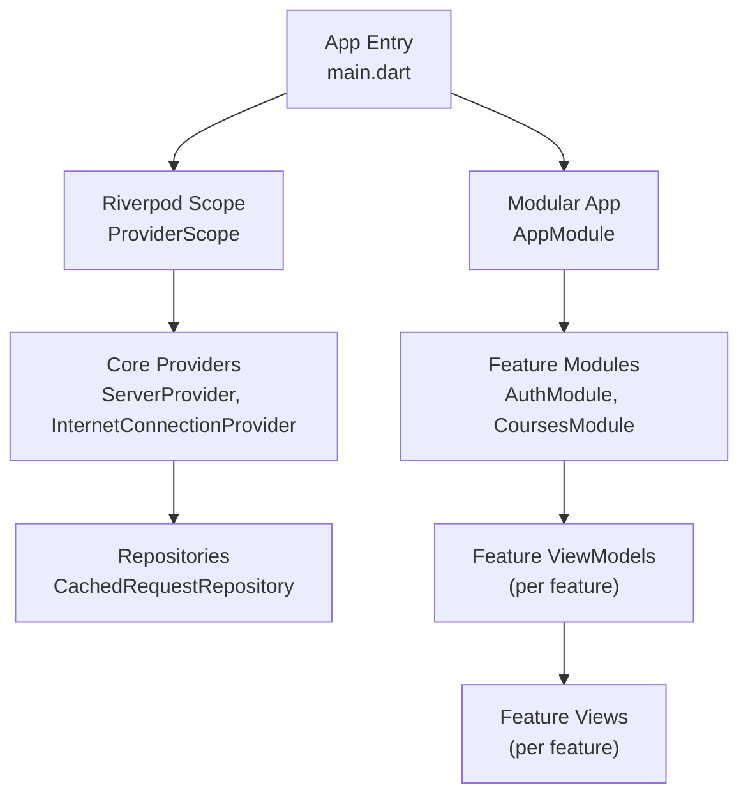
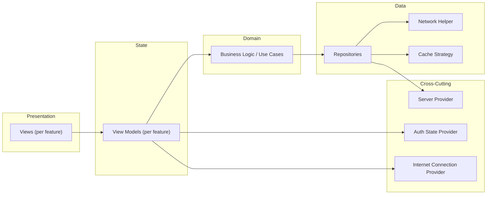
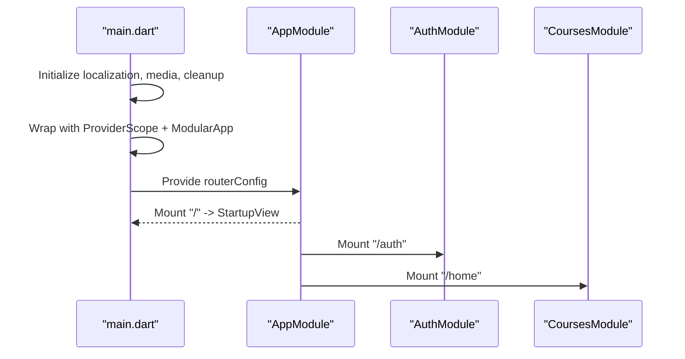
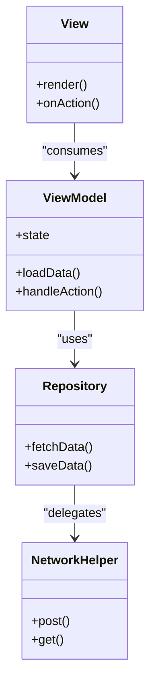
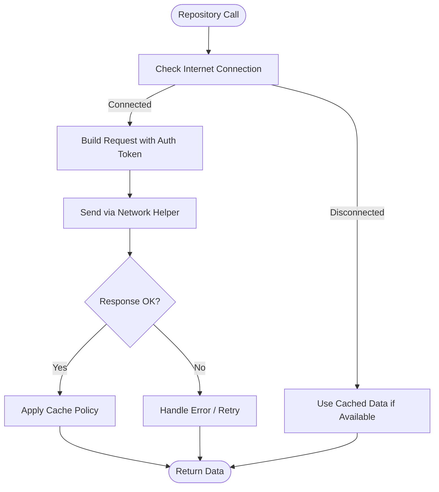
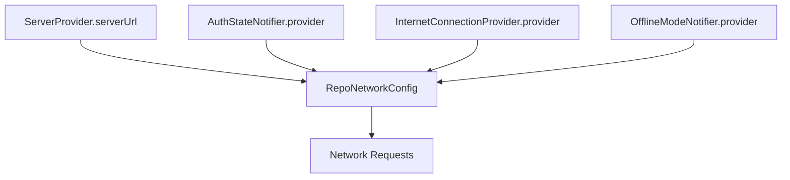
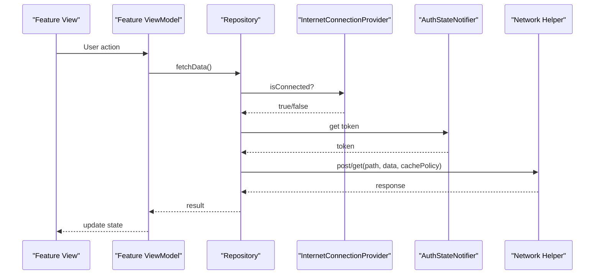
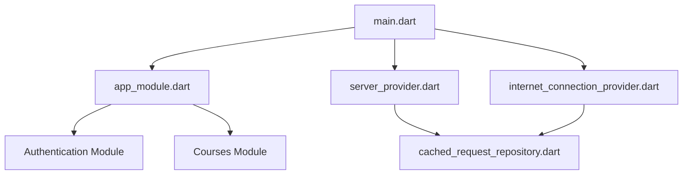

# Architecture Overview

<cite>
**Referenced Files in This Document**
- [main.dart](file://lib/main.dart)
- [app_module.dart](file://lib/app_module.dart)
- [core.dart](file://lib/app/core/core.dart)
- [server_provider.dart](file://lib/app/core/provider/server_provider.dart)
- [internet_connection_provider.dart](file://lib/app/core/provider/internet_connection_provider.dart)
- [cached_request_repository.dart](file://lib/app/core/logic/repository/cached_request_repository.dart)
</cite>

## Table of Contents
1. [Introduction](#introduction)
2. [Project Structure](#project-structure)
3. [Core Components](#core-components)
4. [Architecture Overview](#architecture-overview)
5. [Detailed Component Analysis](#detailed-component-analysis)
6. [Dependency Analysis](#dependency-analysis)
7. [Performance Considerations](#performance-considerations)
8. [Troubleshooting Guide](#troubleshooting-guide)
9. [Conclusion](#conclusion)

## Introduction
This document describes the architectural design of the Leadership Edge Live LMS Flutter application. It explains how the app is organized using Flutter Modular for dependency injection and feature separation, how MVVM is implemented with clear separation between views, view models, and business logic, and how Riverpod provides reactive state management across features. It also details the repository pattern for data abstraction, routing and navigation, data flow from network/API to UI, and cross-cutting concerns such as authentication, caching strategies, and error handling patterns.

## Project Structure
The application follows a modular, feature-based structure:
- Application entry point initializes localization, media, and providers, then bootstraps Flutter Modular and Riverpod.
- The root module defines top-level routes and mounts feature modules (authentication, courses).
- Core utilities, providers, and shared logic live under lib/app/core and are re-exported via a core barrel file for convenient consumption.
- Each feature (e.g., authentication, courses) contains its own module, view, viewmodel, model, and repository layers.

**Diagram sources**
- [main.dart:16-38](file://lib/main.dart#L16-L38)
- [app_module.dart:7-20](file://lib/app_module.dart#L7-L20)
- [server_provider.dart:8-39](file://lib/app/core/provider/server_provider.dart#L8-L39)
- [internet_connection_provider.dart:9-99](file://lib/app/core/provider/internet_connection_provider.dart#L9-L99)
- [cached_request_repository.dart:9-31](file://lib/app/core/logic/repository/cached_request_repository.dart#L9-L31)

**Section sources**
- [main.dart:16-59](file://lib/main.dart#L16-L59)
- [app_module.dart:7-20](file://lib/app_module.dart#L7-L20)
- [core.dart:1-38](file://lib/app/core/core.dart#L1-L38)

## Core Components
- Application bootstrap: Initializes localization, media kit, cleans up temporary files, and wraps the app with ProviderScope and ModularApp. Routes are provided by Modular.routerConfig.
- Root module: Defines top-level routes and mounts feature modules for authentication and courses.
- Core exports: A barrel file centralizes exports for design tokens, form elements, data state types, repository helpers, providers, utilities, and UI elements.
- Server configuration: A provider supplies the API base URL and constructs a RepoNetworkConfig that includes auth token, connection status, cache strategy, offline mode toggle, and token refresh callback.
- Connectivity: A provider monitors connectivity against the configured server and a reliable fallback endpoint, emitting connection changes and exposing a stream/listeners for consumers.
- Repository helper: A cached request repository composes network calls with configurable caching behavior and uses the repo network helper to perform requests with auth and connection awareness.

**Section sources**
- [main.dart:16-59](file://lib/main.dart#L16-L59)
- [app_module.dart:7-20](file://lib/app_module.dart#L7-L20)
- [core.dart:1-38](file://lib/app/core/core.dart#L1-L38)
- [server_provider.dart:8-39](file://lib/app/core/provider/server_provider.dart#L8-L39)
- [internet_connection_provider.dart:9-99](file://lib/app/core/provider/internet_connection_provider.dart#L9-L99)
- [cached_request_repository.dart:9-31](file://lib/app/core/logic/repository/cached_request_repository.dart#L9-L31)

## Architecture Overview
The system is layered and modular:
- Presentation layer: Feature-specific views consume Riverpod providers to render UI reactively.
- State layer: Feature view models manage UI state and orchestrate business operations; they depend on repositories and core providers.
- Domain layer: Business logic resides in view models and feature services; it coordinates use cases and transforms data.
- Data layer: Repositories abstract data sources (network, cache, local storage) and expose typed results to the domain layer.
- Cross-cutting: Authentication state, connectivity, and server configuration are provided centrally via Riverpod providers and consumed throughout the app.

[No sources needed since this diagram shows conceptual architecture, not specific code structure]

## Detailed Component Analysis

### Application Bootstrap and Routing
- The app initializes localization, media, and cleanup tasks before launching.
- ProviderScope enables Riverpod throughout the widget tree.
- ModularApp wires routing via routerConfig and mounts the root module.
- The root module defines routes for startup, authentication, and courses, delegating navigation to feature modules.

**Diagram sources**
- [main.dart:16-59](file://lib/main.dart#L16-L59)
- [app_module.dart:7-20](file://lib/app_module.dart#L7-L20)

**Section sources**
- [main.dart:16-59](file://lib/main.dart#L16-L59)
- [app_module.dart:7-20](file://lib/app_module.dart#L7-L20)

### MVVM Pattern Implementation
- Views: Feature-specific widgets consume Riverpod providers to read state and trigger actions.
- View Models: Feature-specific classes encapsulate UI state and coordinate with repositories and business logic. They are typically exposed as Riverpod providers for reactive updates.
- Business Logic: Use cases and feature services implement domain rules and orchestrate multi-step flows.
- Separation: Views do not directly access repositories or network; they delegate to view models. View models do not contain UI rendering logic.

[No sources needed since this diagram shows conceptual MVVM relationships]

### Repository Pattern and Data Abstraction
- CachedRequestRepository exposes a provider that configures network calls with current server URL, auth token, connectivity, and cache strategy.
- It delegates HTTP operations to a shared network helper while applying caching policies per request type.
- Repositories provide a clean interface to view models and domain logic, isolating them from transport details.

**Diagram sources**
- [cached_request_repository.dart:9-31](file://lib/app/core/logic/repository/cached_request_repository.dart#L9-L31)
- [internet_connection_provider.dart:9-99](file://lib/app/core/provider/internet_connection_provider.dart#L9-L99)
- [server_provider.dart:8-39](file://lib/app/core/provider/server_provider.dart#L8-L39)

**Section sources**
- [cached_request_repository.dart:9-31](file://lib/app/core/logic/repository/cached_request_repository.dart#L9-L31)

### Reactive State Management with Riverpod
- Providers supply global configuration (server URL), connectivity status, and auth state.
- View models and repositories watch or read these providers to stay in sync with changing state without manual subscriptions.
- The server provider constructs RepoNetworkConfig dynamically, including a token refresh callback and offline mode toggle, ensuring requests adapt to runtime changes.

**Diagram sources**
- [server_provider.dart:8-39](file://lib/app/core/provider/server_provider.dart#L8-L39)
- [internet_connection_provider.dart:9-99](file://lib/app/core/provider/internet_connection_provider.dart#L9-L99)

**Section sources**
- [server_provider.dart:8-39](file://lib/app/core/provider/server_provider.dart#L8-L39)
- [internet_connection_provider.dart:9-99](file://lib/app/core/provider/internet_connection_provider.dart#L9-L99)

### Data Flow: Network/API to UI
- UI triggers an action in the view model.
- The view model calls a repository method.
- The repository checks connectivity and builds a request with the current auth token and cache policy.
- The network helper performs the request; responses are cached according to policy.
- The repository returns structured data to the view model, which updates Riverpod state.
- Views rebuild reactively based on provider changes.

**Diagram sources**
- [internet_connection_provider.dart:9-99](file://lib/app/core/provider/internet_connection_provider.dart#L9-L99)
- [server_provider.dart:8-39](file://lib/app/core/provider/server_provider.dart#L8-L39)
- [cached_request_repository.dart:9-31](file://lib/app/core/logic/repository/cached_request_repository.dart#L9-L31)

**Section sources**
- [internet_connection_provider.dart:9-99](file://lib/app/core/provider/internet_connection_provider.dart#L9-L99)
- [server_provider.dart:8-39](file://lib/app/core/provider/server_provider.dart#L8-L39)
- [cached_request_repository.dart:9-31](file://lib/app/core/logic/repository/cached_request_repository.dart#L9-L31)

### Cross-Cutting Concerns
- Authentication: Auth state is provided centrally and injected into network configuration so all requests include the current token. Token refresh is wired into the server provider configuration.
- Caching: Repositories apply cache policies per request; connectivity-aware logic ensures offline scenarios can still present cached data when available.
- Error Handling: Network errors are surfaced through repository responses; UI components can display consistent error states and toasts via core UI elements.

**Section sources**
- [server_provider.dart:8-39](file://lib/app/core/provider/server_provider.dart#L8-L39)
- [internet_connection_provider.dart:9-99](file://lib/app/core/provider/internet_connection_provider.dart#L9-L99)
- [cached_request_repository.dart:9-31](file://lib/app/core/logic/repository/cached_request_repository.dart#L9-L31)
- [core.dart:1-38](file://lib/app/core/core.dart#L1-L38)

## Dependency Analysis
Key dependencies and their roles:
- main.dart depends on Flutter Modular and Riverpod to wire DI and routing.
- AppModule declares routes and mounts feature modules.
- ServerProvider centralizes API origin and builds RepoNetworkConfig used by repositories.
- InternetConnectionProvider supplies connectivity status and streams to consumers.
- CachedRequestRepository composes network calls with auth and cache settings.

**Diagram sources**
- [main.dart:16-59](file://lib/main.dart#L16-L59)
- [app_module.dart:7-20](file://lib/app_module.dart#L7-L20)
- [server_provider.dart:8-39](file://lib/app/core/provider/server_provider.dart#L8-L39)
- [internet_connection_provider.dart:9-99](file://lib/app/core/provider/internet_connection_provider.dart#L9-L99)
- [cached_request_repository.dart:9-31](file://lib/app/core/logic/repository/cached_request_repository.dart#L9-L31)

**Section sources**
- [main.dart:16-59](file://lib/main.dart#L16-L59)
- [app_module.dart:7-20](file://lib/app_module.dart#L7-L20)
- [server_provider.dart:8-39](file://lib/app/core/provider/server_provider.dart#L8-L39)
- [internet_connection_provider.dart:9-99](file://lib/app/core/provider/internet_connection_provider.dart#L9-L99)
- [cached_request_repository.dart:9-31](file://lib/app/core/logic/repository/cached_request_repository.dart#L9-L31)

## Performance Considerations
- Minimize redundant listeners: Connectivity initialization is idempotent to avoid duplicate subscriptions during navigation.
- Avoid unnecessary provider rebuilds: Use ref.read for dynamic toggles (offline mode, token refresh) to prevent tearing down already successful providers.
- Prefer streaming for connectivity: Consumers subscribe once and receive only meaningful transitions.
- Cache strategically: Apply appropriate cache policies per request to reduce network overhead and improve perceived performance.

[No sources needed since this section provides general guidance]

## Troubleshooting Guide
- Connectivity issues: Verify the server URL and ensure the connectivity check endpoints are reachable. Review connection stream events and listener registration to detect spurious disconnects.
- Authentication failures: Confirm that the auth token is present and refreshed when needed. Check that RepoNetworkConfig includes the latest token and refresh callback.
- Caching anomalies: Inspect cache policies and ensure stale data is invalidated appropriately after mutations.
- Error visibility: Ensure error paths surface user-friendly messages via core toast/error components.

**Section sources**
- [internet_connection_provider.dart:9-99](file://lib/app/core/provider/internet_connection_provider.dart#L9-L99)
- [server_provider.dart:8-39](file://lib/app/core/provider/server_provider.dart#L8-L39)
- [cached_request_repository.dart:9-31](file://lib/app/core/logic/repository/cached_request_repository.dart#L9-L31)
- [core.dart:1-38](file://lib/app/core/core.dart#L1-L38)

## Conclusion
The Leadership Edge Live LMS employs a modular, layered architecture built on Flutter Modular and Riverpod. Features are isolated with clear MVVM boundaries, repositories abstract data sources, and cross-cutting concerns like authentication, connectivity, and caching are centralized and reactive. This design promotes maintainability, testability, and scalability while delivering a responsive user experience across platforms.