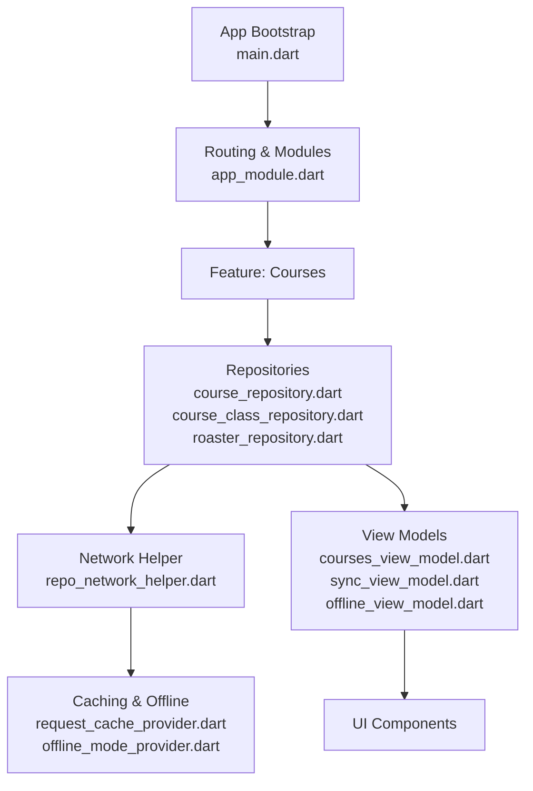
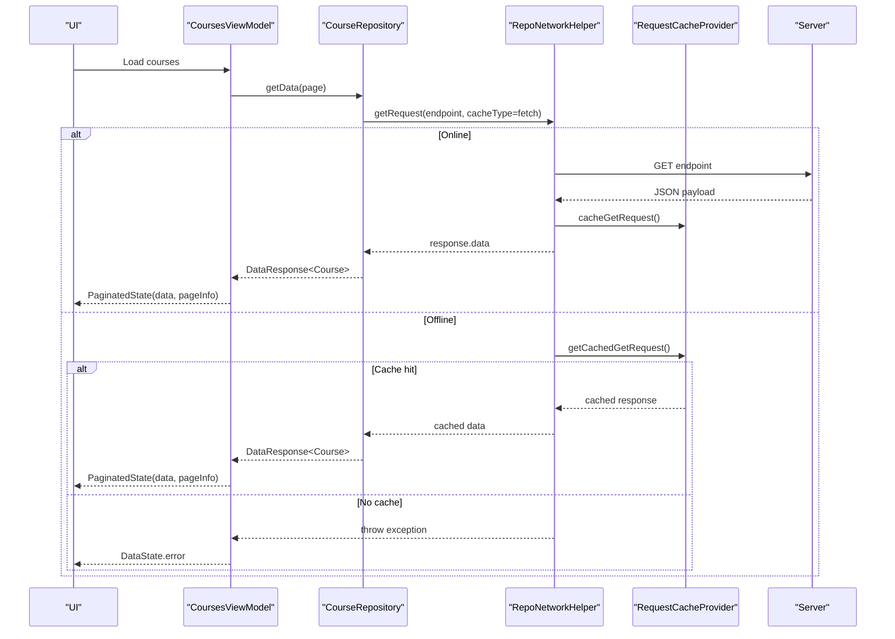
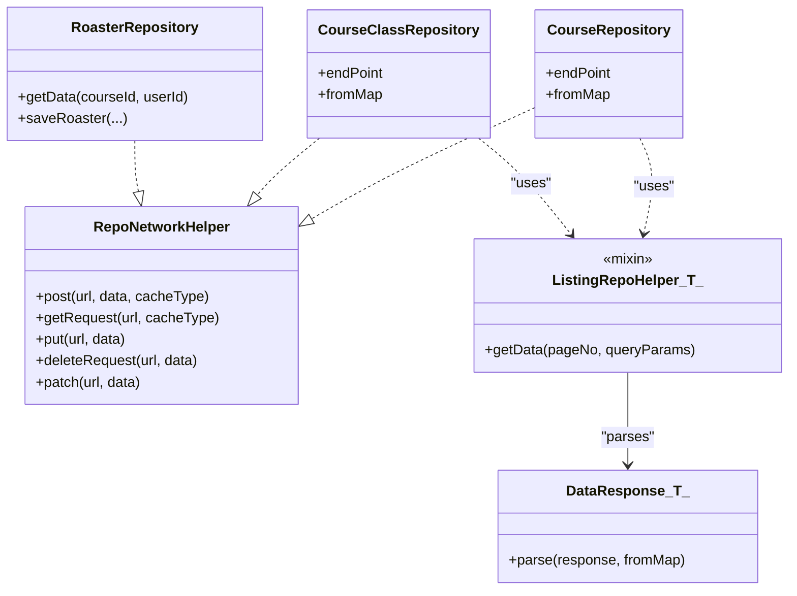
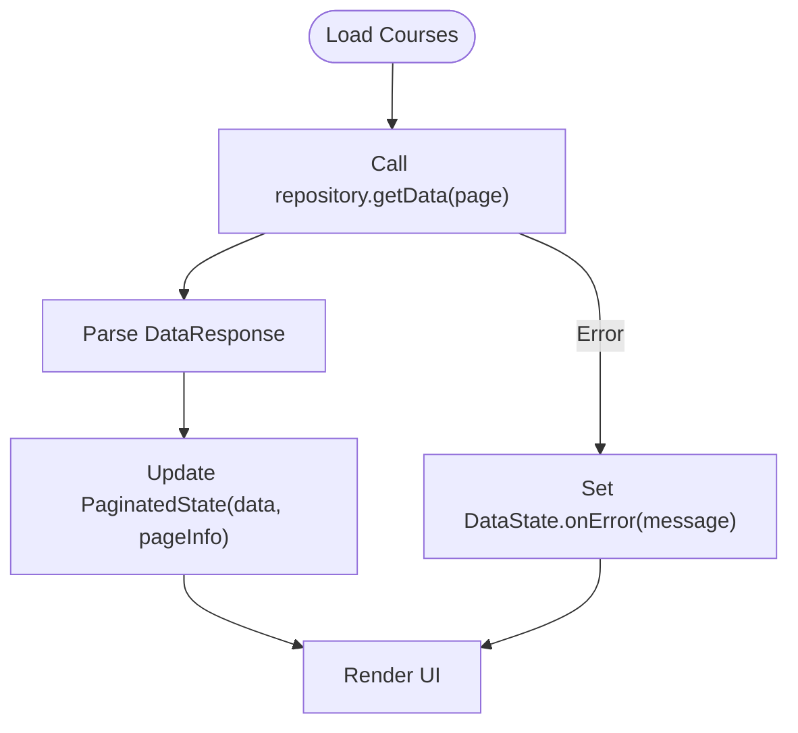
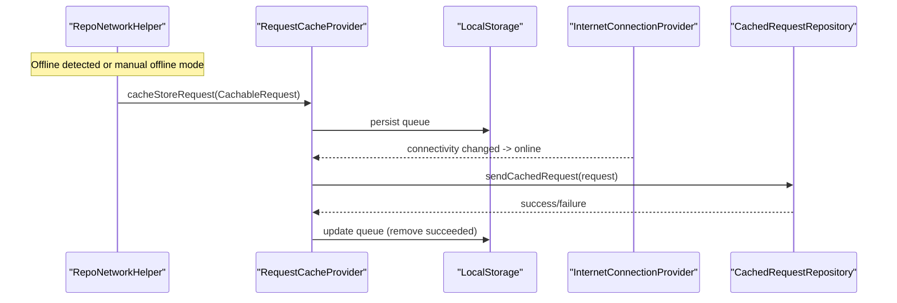
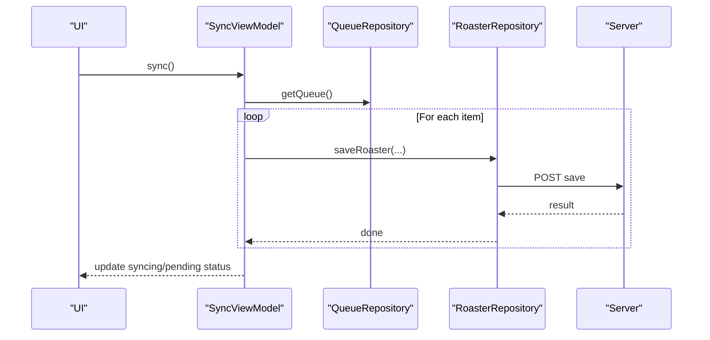
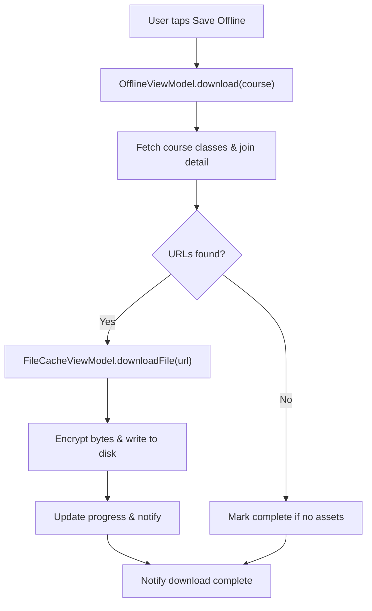
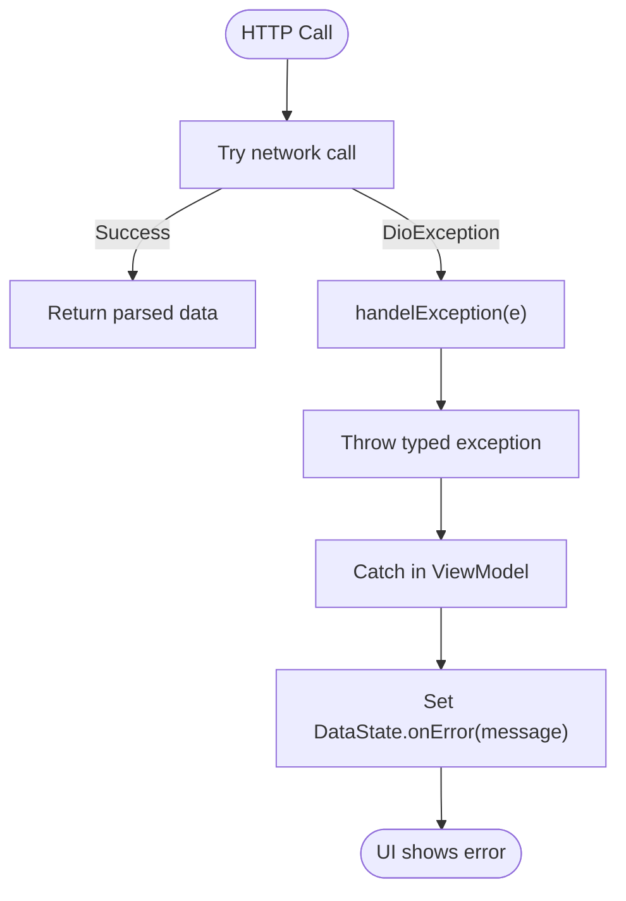
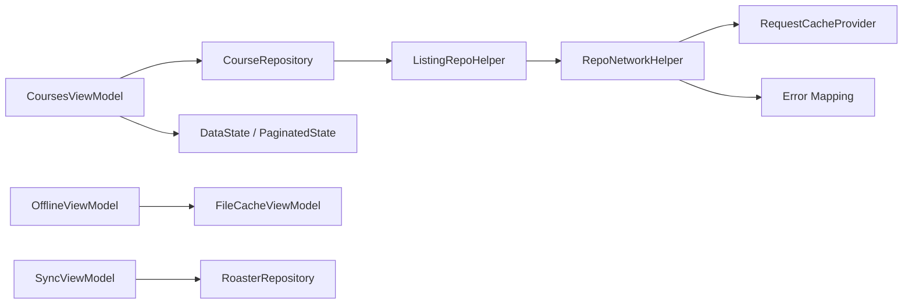

# Data Flow Patterns

<cite>
**Referenced Files in This Document**
- [main.dart](file://lib/main.dart)
- [app_module.dart](file://lib/app_module.dart)
- [repo_network_helper.dart](file://lib/app/core/logic/repository/repo_network_helper.dart)
- [cached_request_repository.dart](file://lib/app/core/logic/repository/cached_request_repository.dart)
- [request_cache_provider.dart](file://lib/app/core/provider/request_cache_provider.dart)
- [offline_mode_provider.dart](file://lib/app/core/provider/offline_mode_provider.dart)
- [error.dart](file://lib/app/core/logic/repository/error.dart)
- [data_state.dart](file://lib/app/core/logic/data_state/data_state.dart)
- [paginated_data.dart](file://lib/app/core/logic/data_state/paginated_data.dart)
- [listing_repo_helper.dart](file://lib/app/core/logic/repository/listing_repo_helper.dart)
- [data_response.dart](file://lib/app/core/model/data_response.dart)
- [course_class_repository.dart](file://lib/app/features/courses/repository/course_class_repository.dart)
- [course_repository.dart](file://lib/app/features/courses/repository/course_repository.dart)
- [roaster_repository.dart](file://lib/app/features/courses/repository/roaster_repository.dart)
- [courses_view_model.dart](file://lib/app/features/courses/viewmodel/courses_view_model.dart)
- [sync_view_model.dart](file://lib/app/features/courses/viewmodel/sync_view_model.dart)
- [offline_view_model.dart](file://lib/app/features/courses/viewmodel/offline_view_model.dart)
- [file_cache_view_model.dart](file://lib/app/features/courses/viewmodel/file_cache_view_model.dart)
</cite>

## Table of Contents
1. [Introduction](#introduction)
2. [Project Structure](#project-structure)
3. [Core Components](#core-components)
4. [Architecture Overview](#architecture-overview)
5. [Detailed Component Analysis](#detailed-component-analysis)
6. [Dependency Analysis](#dependency-analysis)
7. [Performance Considerations](#performance-considerations)
8. [Troubleshooting Guide](#troubleshooting-guide)
9. [Conclusion](#conclusion)

## Introduction
This document explains the data flow patterns and architectural decisions in the LMS application, focusing on how network APIs are consumed via repositories, transformed into view models, and rendered by UI components. It covers caching strategies, offline handling, synchronization, error handling, and performance optimizations for large datasets. The repository pattern is central to abstracting data sources and enabling easy switching between online and offline backends.

## Project Structure
The app is a Flutter application organized by features with shared core infrastructure:
- App bootstrap and routing are defined at the top level.
- Core networking, caching, state, and providers live under lib/app/core.
- Feature modules (e.g., courses) implement repositories, view models, models, and views.

**Diagram sources**
- [main.dart:16-37](file://lib/main.dart#L16-L37)
- [app_module.dart:7-19](file://lib/app_module.dart#L7-L19)
- [repo_network_helper.dart:286-394](file://lib/app/core/logic/repository/repo_network_helper.dart#L286-L394)
- [request_cache_provider.dart:9-78](file://lib/app/core/provider/request_cache_provider.dart#L9-L78)
- [offline_mode_provider.dart:11-36](file://lib/app/core/provider/offline_mode_provider.dart#L11-L36)
- [course_repository.dart:7-21](file://lib/app/features/courses/repository/course_repository.dart#L7-L21)
- [course_class_repository.dart:8-23](file://lib/app/features/courses/repository/course_class_repository.dart#L8-L23)
- [roaster_repository.dart:9-43](file://lib/app/features/courses/repository/roaster_repository.dart#L9-L43)
- [courses_view_model.dart:34-49](file://lib/app/features/courses/viewmodel/courses_view_model.dart#L34-L49)
- [sync_view_model.dart:25-70](file://lib/app/features/courses/viewmodel/sync_view_model.dart#L25-L70)
- [offline_view_model.dart:28-41](file://lib/app/features/courses/viewmodel/offline_view_model.dart#L28-L41)

**Section sources**
- [main.dart:16-37](file://lib/main.dart#L16-L37)
- [app_module.dart:7-19](file://lib/app_module.dart#L7-L19)

## Core Components
- Network helper: Centralizes HTTP calls, offline detection, request/response caching, and error mapping.
- Repositories: Per-feature implementations that define endpoints and map server payloads to domain models.
- View models: Manage UI state, orchestrate repository calls, handle pagination, and expose clean interfaces to UI.
- Providers: Manage connectivity, offline mode toggle, and persistent request queues.
- Data structures: Unified state wrappers for loading, data, and error states; paginated state containers.

Key responsibilities:
- repo_network_helper.dart: post/get/put/delete/patch, offline fallback, caching, progress, and error translation.
- listing_repo_helper.dart: reusable paginated GET logic with endpoint and mapper injection.
- data_response.dart: parses server responses into typed lists with page info.
- data_state.dart / paginated_data.dart: consistent state modeling for UI consumption.

**Section sources**
- [repo_network_helper.dart:286-480](file://lib/app/core/logic/repository/repo_network_helper.dart#L286-L480)
- [listing_repo_helper.dart:1-24](file://lib/app/core/logic/repository/listing_repo_helper.dart#L1-L24)
- [data_response.dart:1-20](file://lib/app/core/model/data_response.dart#L1-L20)
- [data_state.dart:1-22](file://lib/app/core/logic/data_state/data_state.dart#L1-L22)
- [paginated_data.dart:1-16](file://lib/app/core/logic/data_state/paginated_data.dart#L1-L16)

## Architecture Overview
The application follows a layered architecture:
- UI components consume view models.
- View models call repositories.
- Repositories use a shared network helper for HTTP operations.
- The network helper integrates caching and offline behavior via providers.
- Error handling maps low-level exceptions to user-friendly messages.

**Diagram sources**
- [courses_view_model.dart:34-49](file://lib/app/features/courses/viewmodel/courses_view_model.dart#L34-L49)
- [course_repository.dart:7-21](file://lib/app/features/courses/repository/course_repository.dart#L7-L21)
- [listing_repo_helper.dart:1-24](file://lib/app/core/logic/repository/listing_repo_helper.dart#L1-L24)
- [repo_network_helper.dart:353-394](file://lib/app/core/logic/repository/repo_network_helper.dart#L353-L394)
- [request_cache_provider.dart:34-44](file://lib/app/core/provider/request_cache_provider.dart#L34-L44)

## Detailed Component Analysis

### Repository Pattern and Data Transformation
- CourseRepository and CourseClassRepository extend ListingRepoHelper to reuse paginated GET logic. They declare endpoints and mappers to convert server payloads into domain models.
- RoasterRepository performs POST requests for roaster data and saves roaster entries, using Dio directly where caching or serialization would be problematic.
- DataResponse.parse converts raw server payloads into typed lists and extracts PageInfo for pagination.

**Diagram sources**
- [repo_network_helper.dart:286-480](file://lib/app/core/logic/repository/repo_network_helper.dart#L286-L480)
- [listing_repo_helper.dart:1-24](file://lib/app/core/logic/repository/listing_repo_helper.dart#L1-L24)
- [course_repository.dart:7-21](file://lib/app/features/courses/repository/course_repository.dart#L7-L21)
- [course_class_repository.dart:8-23](file://lib/app/features/courses/repository/course_class_repository.dart#L8-L23)
- [roaster_repository.dart:9-43](file://lib/app/features/courses/repository/roaster_repository.dart#L9-L43)
- [data_response.dart:1-20](file://lib/app/core/model/data_response.dart#L1-L20)

**Section sources**
- [course_repository.dart:7-21](file://lib/app/features/courses/repository/course_repository.dart#L7-L21)
- [course_class_repository.dart:8-23](file://lib/app/features/courses/repository/course_class_repository.dart#L8-L23)
- [roaster_repository.dart:9-43](file://lib/app/features/courses/repository/roaster_repository.dart#L9-L43)
- [listing_repo_helper.dart:1-24](file://lib/app/core/logic/repository/listing_repo_helper.dart#L1-L24)
- [data_response.dart:1-20](file://lib/app/core/model/data_response.dart#L1-L20)

### View Model Orchestration and Pagination
- CoursesViewModel orchestrates paginated fetching, aggregates all pages when needed, and updates UI state with PaginatedState.
- On failure, it preserves previously shown data to keep pagination widgets stable.

**Diagram sources**
- [courses_view_model.dart:34-49](file://lib/app/features/courses/viewmodel/courses_view_model.dart#L34-L49)
- [paginated_data.dart:1-16](file://lib/app/core/logic/data_state/paginated_data.dart#L1-L16)
- [data_state.dart:1-22](file://lib/app/core/logic/data_state/data_state.dart#L1-L22)

**Section sources**
- [courses_view_model.dart:34-49](file://lib/app/features/courses/viewmodel/courses_view_model.dart#L34-L49)

### Caching Strategy and Offline Handling
- RequestCacheProvider persists GET responses and queued POST requests to local storage. It listens for connectivity changes and retries queued POSTs when online.
- CachedRequestRepository provides a way to send cached POST requests.
- OfflineModeNotifier exposes a user-controlled offline toggle persisted locally; RepoNetworkConfig reads this flag at call time to force offline behavior without rebuilding dependencies.

**Diagram sources**
- [request_cache_provider.dart:9-78](file://lib/app/core/provider/request_cache_provider.dart#L9-L78)
- [cached_request_repository.dart:9-31](file://lib/app/core/logic/repository/cached_request_repository.dart#L9-L31)
- [offline_mode_provider.dart:11-36](file://lib/app/core/provider/offline_mode_provider.dart#L11-L36)
- [repo_network_helper.dart:286-394](file://lib/app/core/logic/repository/repo_network_helper.dart#L286-L394)

**Section sources**
- [request_cache_provider.dart:9-78](file://lib/app/core/provider/request_cache_provider.dart#L9-L78)
- [cached_request_repository.dart:9-31](file://lib/app/core/logic/repository/cached_request_repository.dart#L9-L31)
- [offline_mode_provider.dart:11-36](file://lib/app/core/provider/offline_mode_provider.dart#L11-L36)
- [repo_network_helper.dart:286-394](file://lib/app/core/logic/repository/repo_network_helper.dart#L286-L394)

### Synchronization Mechanisms
- SyncViewModel monitors connectivity and pushes queued completions to the server when online. It coordinates with a queue repository and roaster repository to save completion records.

**Diagram sources**
- [sync_view_model.dart:25-70](file://lib/app/features/courses/viewmodel/sync_view_model.dart#L25-L70)
- [roaster_repository.dart:31-43](file://lib/app/features/courses/repository/roaster_repository.dart#L31-L43)

**Section sources**
- [sync_view_model.dart:25-70](file://lib/app/features/courses/viewmodel/sync_view_model.dart#L25-L70)
- [roaster_repository.dart:31-43](file://lib/app/features/courses/repository/roaster_repository.dart#L31-L43)

### Offline Data Handling and File Caching
- OfflineViewModel manages downloading entire courses for offline access. It fetches course metadata, join-course-detail content, and downloads files (videos, PDFs, articles, recordings).
- FileCacheViewModel handles encrypted file storage and decryption on demand, supporting progress streams and cleanup.

**Diagram sources**
- [offline_view_model.dart:61-175](file://lib/app/features/courses/viewmodel/offline_view_model.dart#L61-L175)
- [file_cache_view_model.dart:187-219](file://lib/app/features/courses/viewmodel/file_cache_view_model.dart#L187-L219)
- [file_cache_view_model.dart:438-462](file://lib/app/features/courses/viewmodel/file_cache_view_model.dart#L438-L462)

**Section sources**
- [offline_view_model.dart:61-175](file://lib/app/features/courses/viewmodel/offline_view_model.dart#L61-L175)
- [file_cache_view_model.dart:187-219](file://lib/app/features/courses/viewmodel/file_cache_view_model.dart#L187-L219)
- [file_cache_view_model.dart:438-462](file://lib/app/features/courses/viewmodel/file_cache_view_model.dart#L438-L462)

### Error Handling Approach
- Error mapping centralizes DioException handling, converting network and server errors into specific exceptions (e.g., unauthorized, not found, invalid input).
- View models catch errors and set DataState.onError with user-friendly messages.

**Diagram sources**
- [error.dart:19-94](file://lib/app/core/logic/repository/error.dart#L19-L94)
- [data_state.dart:1-22](file://lib/app/core/logic/data_state/data_state.dart#L1-L22)

**Section sources**
- [error.dart:19-94](file://lib/app/core/logic/repository/error.dart#L19-L94)
- [data_state.dart:1-22](file://lib/app/core/logic/data_state/data_state.dart#L1-L22)

## Dependency Analysis
The following diagram highlights key dependencies among core components:

**Diagram sources**
- [courses_view_model.dart:34-49](file://lib/app/features/courses/viewmodel/courses_view_model.dart#L34-L49)
- [course_repository.dart:7-21](file://lib/app/features/courses/repository/course_repository.dart#L7-L21)
- [listing_repo_helper.dart:1-24](file://lib/app/core/logic/repository/listing_repo_helper.dart#L1-L24)
- [repo_network_helper.dart:286-480](file://lib/app/core/logic/repository/repo_network_helper.dart#L286-L480)
- [request_cache_provider.dart:9-78](file://lib/app/core/provider/request_cache_provider.dart#L9-L78)
- [error.dart:19-94](file://lib/app/core/logic/repository/error.dart#L19-L94)
- [offline_view_model.dart:61-175](file://lib/app/features/courses/viewmodel/offline_view_model.dart#L61-L175)
- [file_cache_view_model.dart:187-219](file://lib/app/features/courses/viewmodel/file_cache_view_model.dart#L187-L219)
- [sync_view_model.dart:25-70](file://lib/app/features/courses/viewmodel/sync_view_model.dart#L25-L70)
- [roaster_repository.dart:9-43](file://lib/app/features/courses/repository/roaster_repository.dart#L9-L43)

**Section sources**
- [courses_view_model.dart:34-49](file://lib/app/features/courses/viewmodel/courses_view_model.dart#L34-L49)
- [repo_network_helper.dart:286-480](file://lib/app/core/logic/repository/repo_network_helper.dart#L286-L480)
- [request_cache_provider.dart:9-78](file://lib/app/core/provider/request_cache_provider.dart#L9-L78)
- [error.dart:19-94](file://lib/app/core/logic/repository/error.dart#L19-L94)

## Performance Considerations
- Pagination: Use paginated endpoints and aggregate only when necessary to reduce memory footprint.
- Caching: Cache GET responses to avoid redundant network calls; leverage offline mode to serve cached data instantly.
- Large datasets: Stream progress for large downloads; consider chunked processing and lazy loading in UI.
- Request deduplication: Avoid duplicate concurrent requests by sharing repository instances through providers.
- Encryption overhead: Encrypt downloaded files in batches to minimize I/O overhead; decrypt on-demand during playback.

[No sources needed since this section provides general guidance]

## Troubleshooting Guide
Common issues and resolutions:
- Network timeouts: Check connection provider and retry with appropriate backoff; ensure timeouts are configured.
- Unauthorized or forbidden: Validate authentication token and refresh if expired.
- Not found: Verify endpoint paths and parameters; confirm resource existence.
- Invalid input: Inspect validation errors returned by the server and present them to users.
- Offline mode: Ensure offline toggle is correctly set; verify cached data availability for requested endpoints.

**Section sources**
- [error.dart:19-94](file://lib/app/core/logic/repository/error.dart#L19-L94)
- [offline_mode_provider.dart:11-36](file://lib/app/core/provider/offline_mode_provider.dart#L11-L36)

## Conclusion
The LMS application employs a clear separation of concerns: repositories encapsulate data access, view models manage UI state and orchestration, and a robust network helper provides caching, offline support, and unified error handling. This design enables flexible data source abstraction, resilient offline experiences, and scalable handling of large datasets through pagination and streaming.

[No sources needed since this section summarizes without analyzing specific files]