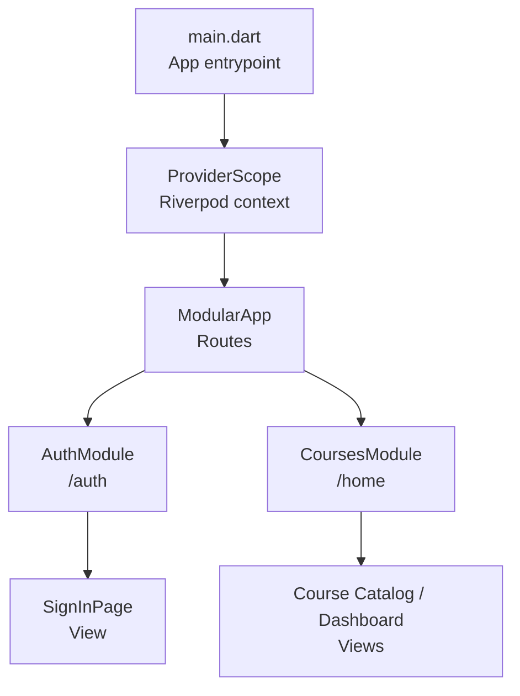
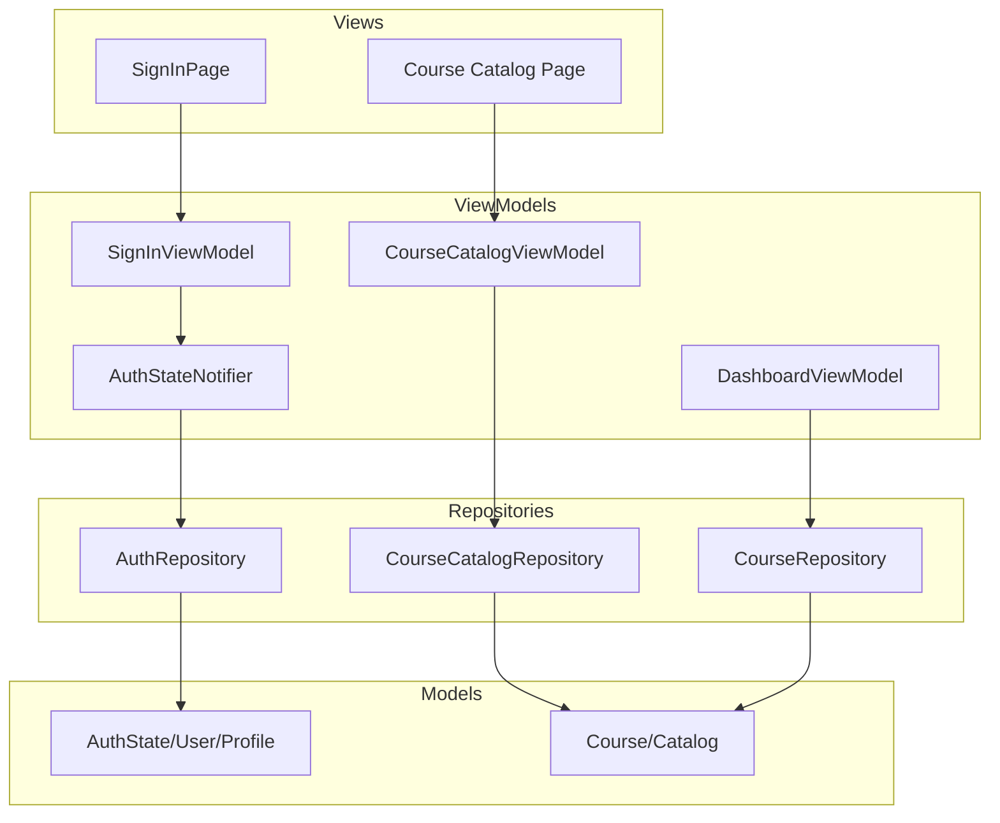
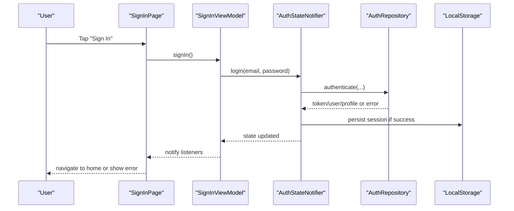
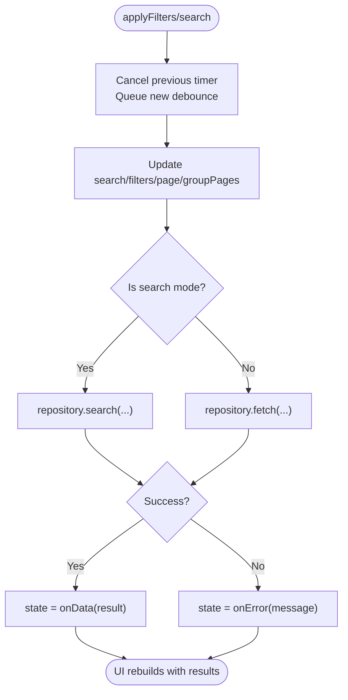
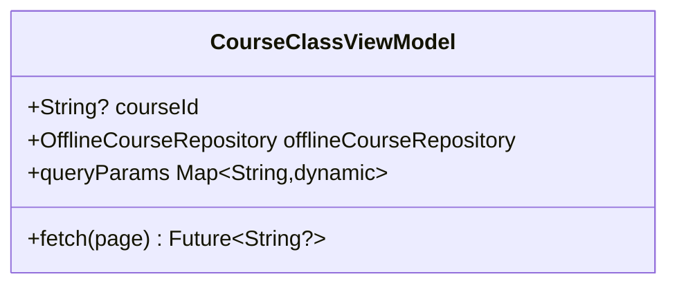
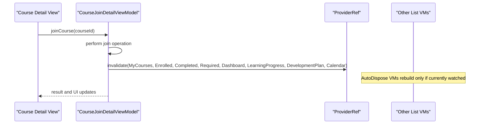
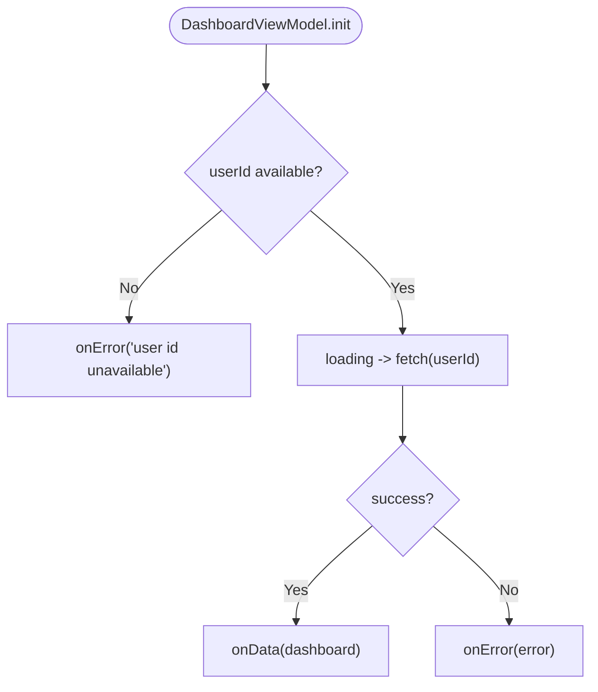
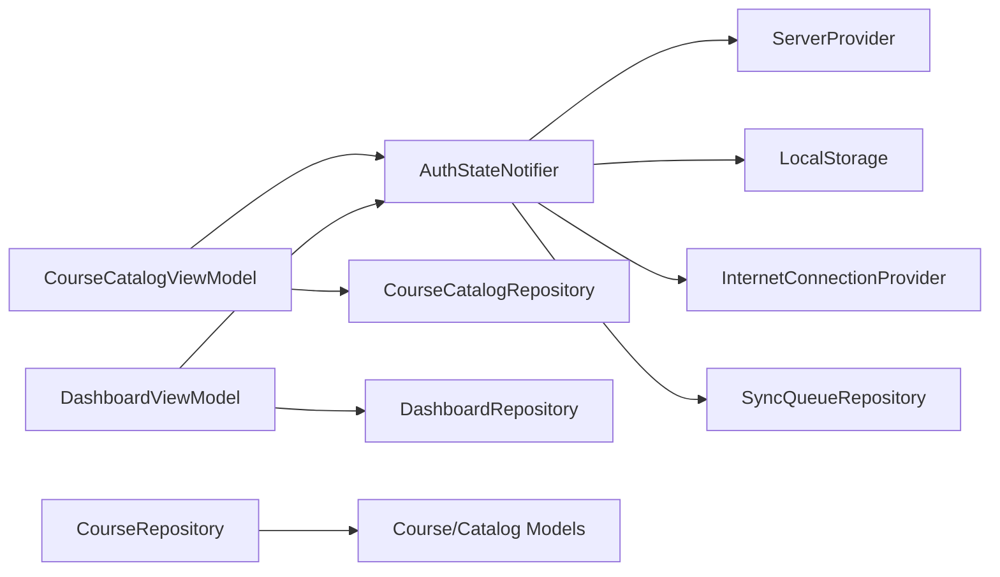

# MVVM Pattern Implementation

<cite>
**Referenced Files in This Document**
- [main.dart](file://lib/main.dart)
- [app_module.dart](file://lib/app_module.dart)
- [auth_module.dart](file://lib/app/features/authentication/module/auth_module.dart)
- [signin_viewmodel.dart](file://lib/app/features/authentication/viewmodel/signin_viewmodel.dart)
- [auth_state_provider.dart](file://lib/app/features/authentication/app_state/auth_state_provider.dart)
- [auth_state.dart](file://lib/app/features/authentication/model/auth_state.dart)
- [course_catalog_view_model.dart](file://lib/app/features/courses/viewmodel/course_catalog_view_model.dart)
- [course_class_view_model.dart](file://lib/app/features/courses/viewmodel/course_class_view_model.dart)
- [course_join_detail_view_model.dart](file://lib/app/features/courses/viewmodel/course_join_detail_view_model.dart)
- [dashboard_view_model.dart](file://lib/app/features/dashboard/viewmodel/dashboard_view_model.dart)
- [data_state.dart](file://lib/app/core/logic/data_state/data_state.dart)
- [course_repository.dart](file://lib/app/features/courses/repository/course_repository.dart)
</cite>

## Table of Contents
1. [Introduction](#introduction)
2. [Project Structure](#project-structure)
3. [Core Components](#core-components)
4. [Architecture Overview](#architecture-overview)
5. [Detailed Component Analysis](#detailed-component-analysis)
6. [Dependency Analysis](#dependency-analysis)
7. [Performance Considerations](#performance-considerations)
8. [Troubleshooting Guide](#troubleshooting-guide)
9. [Conclusion](#conclusion)
10. [Appendices](#appendices)

## Introduction
This document explains how the LMS application implements the Model-View-ViewModel (MVVM) pattern using Flutter and Riverpod. It focuses on:
- Views: UI presentation and user interactions
- ViewModels: Business logic, state management, and coordination with repositories
- Models: Data structures for authentication and course features
- Reactive state management via Riverpod providers
- End-to-end flows for authentication and course catalog operations
- Testing strategies per layer, performance considerations, and patterns for async operations and error handling

## Project Structure
The app bootstraps with Riverpod and Modular routing, then wires feature modules for Authentication and Courses. The root sets up localization, media initialization, and a global ProviderScope so all widgets can consume reactive state.

**Diagram sources**
- [main.dart:16-37](file://lib/main.dart#L16-L37)
- [app_module.dart:7-19](file://lib/app_module.dart#L7-L19)
- [auth_module.dart:5-9](file://lib/app/features/authentication/module/auth_module.dart#L5-L9)

**Section sources**
- [main.dart:16-37](file://lib/main.dart#L16-L37)
- [app_module.dart:7-19](file://lib/app_module.dart#L7-L19)

## Core Components
- Models: Strongly typed data classes for authentication (user, role, profile) and course entities. They include JSON serialization helpers and safe field accessors.
- Repositories: Network and listing helpers encapsulate API calls and mapping to models.
- ViewModels: Stateful notifiers that coordinate UI state, business rules, and repository calls. They expose methods to fetch, update, and navigate side effects.
- Views: Widgets that read providers and trigger ViewModel actions.

Key patterns observed:
- Riverpod StateNotifierProvider for complex state; ChangeNotifierProvider for form/UI state
- Centralized DataState<T> for loading/error/data transitions
- Feature-scoped modules for routing and dependency wiring

**Section sources**
- [auth_state.dart:12-93](file://lib/app/features/authentication/model/auth_state.dart#L12-L93)
- [data_state.dart:1-22](file://lib/app/core/logic/data_state/data_state.dart#L1-L22)
- [course_repository.dart:7-21](file://lib/app/features/courses/repository/course_repository.dart#L7-L21)

## Architecture Overview
The MVVM layers communicate through Riverpod providers:
- Views watch providers to render UI and call ViewModel methods on interactions
- ViewModels depend on repositories and other providers (e.g., AuthState) to perform work
- Models represent domain data and are serialized/deserialized by repositories and view models

**Diagram sources**
- [signin_viewmodel.dart:11-17](file://lib/app/features/authentication/viewmodel/signin_viewmodel.dart#L11-L17)
- [auth_state_provider.dart:15-25](file://lib/app/features/authentication/app_state/auth_state_provider.dart#L15-L25)
- [course_catalog_view_model.dart:59-79](file://lib/app/features/courses/viewmodel/course_catalog_view_model.dart#L59-L79)
- [dashboard_view_model.dart:8-23](file://lib/app/features/dashboard/viewmodel/dashboard_view_model.dart#L8-L23)
- [course_repository.dart:7-21](file://lib/app/features/courses/repository/course_repository.dart#L7-L21)
- [auth_state.dart:12-93](file://lib/app/features/authentication/model/auth_state.dart#L12-L93)

## Detailed Component Analysis

### Authentication Flow (Sign-In)
- View: SignInPage triggers sign-in action bound to SignInViewModel
- ViewModel: SignInViewModel delegates to AuthStateNotifier.login(...)
- Global Auth State: AuthStateNotifier updates AuthState (token, user, profile), persists as needed, and invalidates dependent providers
- Result: Views watching AuthState react to login success/failure and route accordingly

**Diagram sources**
- [signin_viewmodel.dart:11-17](file://lib/app/features/authentication/viewmodel/signin_viewmodel.dart#L11-L17)
- [signin_viewmodel.dart:37-45](file://lib/app/features/authentication/viewmodel/signin_viewmodel.dart#L37-L45)
- [auth_state_provider.dart:15-25](file://lib/app/features/authentication/app_state/auth_state_provider.dart#L15-L25)

**Section sources**
- [signin_viewmodel.dart:11-17](file://lib/app/features/authentication/viewmodel/signin_viewmodel.dart#L11-L17)
- [signin_viewmodel.dart:37-45](file://lib/app/features/authentication/viewmodel/signin_viewmodel.dart#L37-L45)
- [auth_state_provider.dart:15-25](file://lib/app/features/authentication/app_state/auth_state_provider.dart#L15-L25)

### Course Catalog Flow (Search, Filter, Paginate)
- View: Course Catalog page binds to CourseCatalogViewModel
- ViewModel: Maintains search text, filters, pagination, and group pages; debounces search input
- Repository: Fetches catalog data based on mode (search vs list)
- State: Uses DataState<T> to manage idle/loading/data/error states without flashing spinners during filter changes

**Diagram sources**
- [course_catalog_view_model.dart:84-133](file://lib/app/features/courses/viewmodel/course_catalog_view_model.dart#L84-L133)
- [course_catalog_view_model.dart:140-182](file://lib/app/features/courses/viewmodel/course_catalog_view_model.dart#L140-L182)
- [data_state.dart:1-22](file://lib/app/core/logic/data_state/data_state.dart#L1-L22)

**Section sources**
- [course_catalog_view_model.dart:59-79](file://lib/app/features/courses/viewmodel/course_catalog_view_model.dart#L59-L79)
- [course_catalog_view_model.dart:84-133](file://lib/app/features/courses/viewmodel/course_catalog_view_model.dart#L84-L133)
- [course_catalog_view_model.dart:140-182](file://lib/app/features/courses/viewmodel/course_catalog_view_model.dart#L140-L182)

### Class Listing and Offline Sync
- ViewModel: CourseClassViewModel extends BaseViewModel and adds offline persistence after successful fetch
- Behavior: Saves classes locally when courseId is present and data is available

**Diagram sources**
- [course_class_view_model.dart:10-44](file://lib/app/features/courses/viewmodel/course_class_view_model.dart#L10-L44)

**Section sources**
- [course_class_view_model.dart:10-44](file://lib/app/features/courses/viewmodel/course_class_view_model.dart#L10-L44)

### Joining a Course and Invalidating Dependent Lists
- ViewModel: CourseJoinDetailViewModel coordinates join action and invalidates multiple dashboard/course lists to refresh UI
- Strategy: Only invalidates providers that still exist to avoid disposal race conditions

**Diagram sources**
- [course_join_detail_view_model.dart:152-171](file://lib/app/features/courses/viewmodel/course_join_detail_view_model.dart#L152-L171)

**Section sources**
- [course_join_detail_view_model.dart:152-171](file://lib/app/features/courses/viewmodel/course_join_detail_view_model.dart#L152-L171)

### Dashboard Aggregation
- ViewModel: DashboardViewModel fetches aggregated dashboard data for the logged-in user
- Error Handling: Sets error state if userId is unavailable; otherwise loads data or errors

**Diagram sources**
- [dashboard_view_model.dart:8-42](file://lib/app/features/dashboard/viewmodel/dashboard_view_model.dart#L8-L42)

**Section sources**
- [dashboard_view_model.dart:8-42](file://lib/app/features/dashboard/viewmodel/dashboard_view_model.dart#L8-L42)

## Dependency Analysis
- Riverpod Providers:
  - AuthStateNotifier depends on ServerProvider, LocalStorage, InternetConnectionProvider, SyncQueueRepository
  - CourseCatalogViewModel depends on CourseCatalogRepository and reads AuthStateNotifier for userId
  - DashboardViewModel depends on DashboardRepository and reads AuthStateNotifier
- Repositories:
  - Use shared network/listing helpers and map responses to models
- Models:
  - AuthState includes nested User and UserProfile with robust JSON parsing and helper methods

**Diagram sources**
- [auth_state_provider.dart:15-25](file://lib/app/features/authentication/app_state/auth_state_provider.dart#L15-L25)
- [course_catalog_view_model.dart:59-79](file://lib/app/features/courses/viewmodel/course_catalog_view_model.dart#L59-L79)
- [dashboard_view_model.dart:8-23](file://lib/app/features/dashboard/viewmodel/dashboard_view_model.dart#L8-L23)
- [course_repository.dart:7-21](file://lib/app/features/courses/repository/course_repository.dart#L7-L21)

**Section sources**
- [auth_state_provider.dart:15-25](file://lib/app/features/authentication/app_state/auth_state_provider.dart#L15-L25)
- [course_catalog_view_model.dart:59-79](file://lib/app/features/courses/viewmodel/course_catalog_view_model.dart#L59-L79)
- [dashboard_view_model.dart:8-23](file://lib/app/features/dashboard/viewmodel/dashboard_view_model.dart#L8-L23)
- [course_repository.dart:7-21](file://lib/app/features/courses/repository/course_repository.dart#L7-L21)

## Performance Considerations
- Debounced search in CourseCatalogViewModel reduces unnecessary network calls and improves responsiveness
- Preserving existing data during filter changes avoids full-screen spinner flashes and maintains UX continuity
- Selective invalidation of autoDispose providers prevents redundant rebuilds and potential disposal races
- Using centralized DataState<T> ensures consistent UI state transitions and minimal rebuilds

[No sources needed since this section provides general guidance]

## Troubleshooting Guide
Common issues and resolutions:
- Login failures: Verify credentials and network; check AuthStateNotifier error propagation and local storage persistence
- Empty or stale catalog: Ensure filters and group pages are correctly applied; confirm debounced search has fired; re-run reset() to clear state
- Disposal errors when invalidating providers: Only invalidate providers that exist (ref.exists) before calling invalidate()
- Missing user ID: Dashboard and other features guard against null userId and surface an error state

**Section sources**
- [course_catalog_view_model.dart:140-182](file://lib/app/features/courses/viewmodel/course_catalog_view_model.dart#L140-L182)
- [course_join_detail_view_model.dart:152-171](file://lib/app/features/courses/viewmodel/course_join_detail_view_model.dart#L152-L171)
- [dashboard_view_model.dart:28-42](file://lib/app/features/dashboard/viewmodel/dashboard_view_model.dart#L28-L42)

## Conclusion
The LMS application follows a clean MVVM architecture powered by Riverpod:
- Views remain thin and declarative, focusing on presentation and user actions
- ViewModels encapsulate business logic, state, and asynchronous workflows
- Models provide strongly-typed, serializable data structures
- Repositories abstract networking and data mapping
This separation enables testability, maintainability, and predictable UI updates across authentication and course features.

[No sources needed since this section summarizes without analyzing specific files]

## Appendices

### Testing Strategies by Layer
- Models:
  - Test JSON serialization/deserialization round-trips and edge cases (nulls, type coercion)
  - Validate helper methods (e.g., avatarUrl composition)
- Repositories:
  - Mock network clients and assert request payloads and response mappings
  - Test error paths and retry behavior if implemented
- ViewModels:
  - Instantiate providers in tests with mock repositories
  - Assert state transitions (idle -> loading -> data/error) and method outcomes
  - For debounced search, advance timers or use testing utilities to flush timers
- Views:
  - Widget tests that pump screens, interact with inputs, and verify UI reactions to provider state changes

[No sources needed since this section provides general guidance]