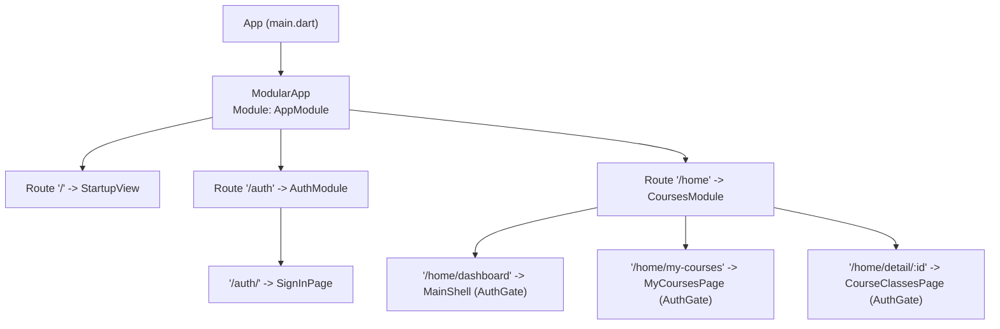
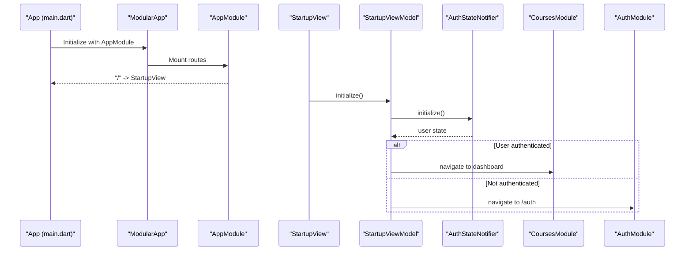
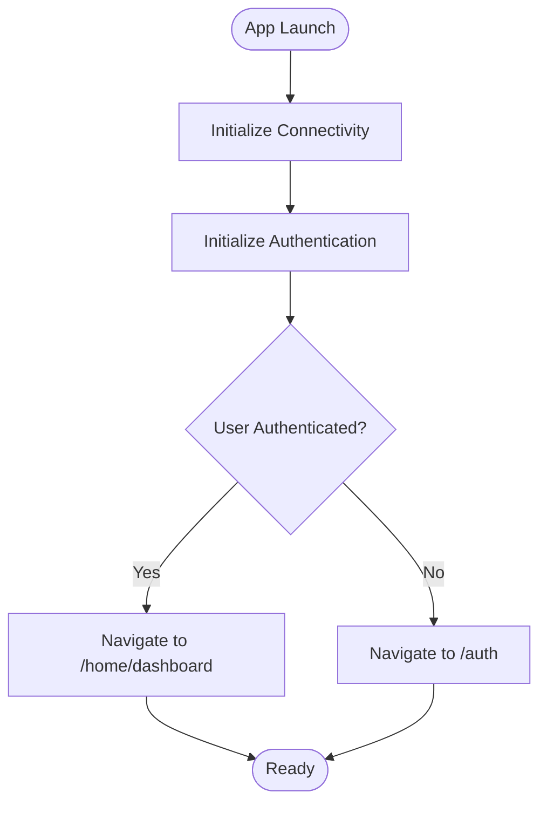
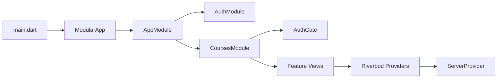

# Modular Architecture

<cite>
**Referenced Files in This Document**
- [main.dart](file://lib/main.dart)
- [app_module.dart](file://lib/app_module.dart)
- [auth_module.dart](file://lib/app/features/authentication/module/auth_module.dart)
- [courses_module.dart](file://lib/app/features/courses/module/courses_module.dart)
- [startup_view_model.dart](file://lib/app/features/startup/view_model/startup_view_model.dart)
- [auth_gate.dart](file://lib/app/features/authentication/view/auth_gate.dart)
- [safe_pop.dart](file://lib/app/core/views/elements/safe_pop.dart)
- [server_provider.dart](file://lib/app/core/provider/server_provider.dart)
- [pubspec.yaml](file://pubspec.yaml)
</cite>

## Table of Contents
1. [Introduction](#introduction)
2. [Project Structure](#project-structure)
3. [Core Components](#core-components)
4. [Architecture Overview](#architecture-overview)
5. [Detailed Component Analysis](#detailed-component-analysis)
6. [Dependency Analysis](#dependency-analysis)
7. [Performance Considerations](#performance-considerations)
8. [Troubleshooting Guide](#troubleshooting-guide)
9. [Conclusion](#conclusion)
10. [Appendices](#appendices)

## Introduction
This document explains the Flutter Modular architecture used in Leadership Edge Live LMS. It focuses on how features are organized into self-contained modules with their own routing, dependencies, and state management boundaries. You will learn how AppModule configures routes and registers feature modules, how navigation flows between modules, and how dependency injection is set up using Riverpod alongside Modular’s routing system. The guide also covers module lifecycle patterns, inter-module communication, and best practices for maintaining clean module boundaries.

## Project Structure
The application uses a feature-based structure under lib/app/features, where each feature owns its UI, models, viewmodels, repositories, and module configuration. The root AppModule wires top-level routes and delegates to feature modules. Routing is declarative via flutter_modular, while state and services are provided through flutter_riverpod.

**Diagram sources**
- [main.dart:24-37](file://lib/main.dart#L24-L37)
- [app_module.dart:7-19](file://lib/app_module.dart#L7-L19)
- [auth_module.dart:5-10](file://lib/app/features/authentication/module/auth_module.dart#L5-L10)
- [courses_module.dart:20-69](file://lib/app/features/courses/module/courses_module.dart#L20-L69)

**Section sources**
- [main.dart:24-37](file://lib/main.dart#L24-L37)
- [app_module.dart:7-19](file://lib/app_module.dart#L7-L19)
- [auth_module.dart:5-10](file://lib/app/features/authentication/module/auth_module.dart#L5-L10)
- [courses_module.dart:20-69](file://lib/app/features/courses/module/courses_module.dart#L20-L69)

## Core Components
- AppModule: Central route registry that mounts feature modules and defines top-level entry points.
- Feature Modules: Self-contained routing scopes per feature (e.g., AuthModule, CoursesModule).
- Navigation Utilities: Helpers to safely navigate or reset stacks when mixing imperative Navigator calls with Modular’s declarative stack.
- State Providers: Riverpod providers for connectivity, authentication state, and server configuration.

Key responsibilities:
- Route registration and composition at app and feature levels.
- Guarding protected routes with an authentication gate.
- Bootstrapping app state and deciding initial navigation based on auth status.
- Providing shared services (e.g., network configuration) via Riverpod.

**Section sources**
- [app_module.dart:7-19](file://lib/app_module.dart#L7-L19)
- [auth_module.dart:5-10](file://lib/app/features/authentication/module/auth_module.dart#L5-L10)
- [courses_module.dart:20-69](file://lib/app/features/courses/module/courses_module.dart#L20-L69)
- [startup_view_model.dart:20-37](file://lib/app/features/startup/view_model/startup_view_model.dart#L20-L37)
- [auth_gate.dart:27-45](file://lib/app/features/authentication/view/auth_gate.dart#L27-L45)
- [safe_pop.dart:11-28](file://lib/app/core/views/elements/safe_pop.dart#L11-L28)
- [server_provider.dart:8-25](file://lib/app/core/provider/server_provider.dart#L8-L25)

## Architecture Overview
At runtime, main initializes platform integrations and wraps the app with EasyLocalization and ProviderScope. ModularApp is configured with AppModule, which declares routes. Feature modules define nested routes and can wrap screens with guards like AuthGate. Navigation across modules uses Modular.to with typed route construction helpers to keep paths centralized and testable.

**Diagram sources**
- [main.dart:24-37](file://lib/main.dart#L24-L37)
- [app_module.dart:15-19](file://lib/app_module.dart#L15-L19)
- [startup_view_model.dart:20-37](file://lib/app/features/startup/view_model/startup_view_model.dart#L20-L37)
- [courses_module.dart:40-49](file://lib/app/features/courses/module/courses_module.dart#L40-L49)
- [auth_module.dart:7-9](file://lib/app/features/authentication/module/auth_module.dart#L7-L9)

## Detailed Component Analysis

### AppModule Configuration
- Declares top-level constants for feature route prefixes (/auth, /home).
- Registers child routes for startup and feature modules.
- Serves as the single source of truth for high-level navigation.

Benefits:
- Centralized route map makes it easy to understand app flow.
- Clear separation between root orchestration and feature-specific routing.

**Section sources**
- [app_module.dart:7-19](file://lib/app_module.dart#L7-L19)

### AuthModule
- Owns authentication-related routes under /auth.
- Exposes a simple child route for sign-in.

Best practices:
- Keep all auth screens within this module to maintain encapsulation.
- Use guards (e.g., AuthGate) in other modules to protect routes.

**Section sources**
- [auth_module.dart:5-10](file://lib/app/features/authentication/module/auth_module.dart#L5-L10)

### CoursesModule
- Defines a rich set of routes under /home, including dashboard, course lists, progress pages, and detail views.
- Provides a static construct helper to build full paths by combining the home prefix with internal paths, ensuring consistent URLs and easier testing.
- Wraps protected routes with AuthGate to enforce authentication before rendering content.

Navigation examples:
- Dashboard: /home/dashboard
- Detail with parameter: /home/detail/:id

**Section sources**
- [courses_module.dart:20-69](file://lib/app/features/courses/module/courses_module.dart#L20-L69)

### Startup Flow and Initial Navigation
- On app start, the startup view model initializes connectivity and authentication state.
- Based on the current auth state, it navigates to either the dashboard or the login screen using Modular.to.

**Diagram sources**
- [startup_view_model.dart:20-37](file://lib/app/features/startup/view_model/startup_view_model.dart#L20-L37)

**Section sources**
- [startup_view_model.dart:20-37](file://lib/app/features/startup/view_model/startup_view_model.dart#L20-L37)

### Authentication Gate
- Ensures users are authenticated before accessing protected routes.
- Initializes connectivity and auth state if needed, then redirects to login when unauthenticated.

Usage:
- Wrap protected screens inside feature modules with AuthGate to enforce access control consistently.

**Section sources**
- [auth_gate.dart:27-45](file://lib/app/features/authentication/view/auth_gate.dart#L27-L45)

### Safe Navigation Helpers
- safePop: Safely pops the navigator; if no route to pop exists, falls back to navigating to the dashboard to avoid black screens.
- resetToModularRoot: Clears any imperative Navigator.push overlays so Modular’s declarative navigation remains consistent.

When to use:
- Before calling Modular navigation from contexts that may have mixed imperative pushes.
- In back-button handlers to ensure predictable behavior.

**Section sources**
- [safe_pop.dart:11-28](file://lib/app/core/views/elements/safe_pop.dart#L11-L28)

### Dependency Injection Setup
- Riverpod provides global services such as internet connectivity, request caching, and server configuration.
- ServerProvider composes network configuration using environment variables and live references to auth token and connectivity state.

Integration with modules:
- Feature modules consume these providers via Consumer widgets or viewmodels without tight coupling to concrete implementations.
- This keeps modules focused on UI and feature logic while relying on a stable DI layer.

**Section sources**
- [server_provider.dart:8-25](file://lib/app/core/provider/server_provider.dart#L8-L25)

## Dependency Analysis
The modular design isolates concerns:
- AppModule depends on feature modules for routing composition.
- Feature modules depend on core providers for cross-cutting concerns (network, auth state).
- Navigation utilities decouple UI from low-level Navigator details.

**Diagram sources**
- [main.dart:24-37](file://lib/main.dart#L24-L37)
- [app_module.dart:15-19](file://lib/app_module.dart#L15-L19)
- [courses_module.dart:40-69](file://lib/app/features/courses/module/courses_module.dart#L40-L69)
- [auth_gate.dart:27-45](file://lib/app/features/authentication/view/auth_gate.dart#L27-L45)
- [server_provider.dart:8-25](file://lib/app/core/provider/server_provider.dart#L8-L25)

**Section sources**
- [main.dart:24-37](file://lib/main.dart#L24-L37)
- [app_module.dart:15-19](file://lib/app_module.dart#L15-L19)
- [courses_module.dart:40-69](file://lib/app/features/courses/module/courses_module.dart#L40-L69)
- [auth_gate.dart:27-45](file://lib/app/features/authentication/view/auth_gate.dart#L27-L45)
- [server_provider.dart:8-25](file://lib/app/core/provider/server_provider.dart#L8-L25)

## Performance Considerations
- Prefer declarative navigation with Modular to avoid deep imperative stacks that can cause stale entries and unexpected back behavior.
- Use AuthGate to prevent unnecessary work in protected screens until authentication is confirmed.
- Initialize only essential services during startup (connectivity and auth) to minimize launch time.
- Leverage Riverpod’s provider scoping to avoid rebuilding large trees unnecessarily.

[No sources needed since this section provides general guidance]

## Troubleshooting Guide
Common issues and resolutions:
- Black screen after back navigation: Use safePop to handle cases where there is no route to pop; it falls back to the dashboard.
- Mixed Navigator and Modular navigation causing silent taps: Call resetToModularRoot before navigating to clear imperative overlays.
- Protected routes not loading: Ensure AuthGate is wrapping the route and that authentication initialization completes successfully.

**Section sources**
- [safe_pop.dart:11-28](file://lib/app/core/views/elements/safe_pop.dart#L11-L28)
- [auth_gate.dart:27-45](file://lib/app/features/authentication/view/auth_gate.dart#L27-L45)

## Conclusion
The Flutter Modular architecture in Leadership Edge Live LMS provides a clean separation of concerns through feature modules, centralized routing, and robust dependency injection. By organizing routes per feature, guarding protected areas, and using Riverpod for shared services, the codebase remains scalable, testable, and maintainable. Following the patterns outlined here—centralized route constants, guarded routes, and safe navigation helpers—will help teams extend the app confidently while preserving module boundaries.

[No sources needed since this section summarizes without analyzing specific files]

## Appendices

### Module Lifecycle Notes
- AppModule is mounted once at app start and defines the top-level route tree.
- Feature modules are mounted when their parent routes are activated.
- Routes can be wrapped with guards (e.g., AuthGate) to enforce preconditions before rendering.

**Section sources**
- [app_module.dart:15-19](file://lib/app_module.dart#L15-L19)
- [courses_module.dart:40-69](file://lib/app/features/courses/module/courses_module.dart#L40-L69)

### Inter-Module Communication Patterns
- Navigation: Use Modular.to with typed route construction helpers (e.g., CoursesModule.construct) to navigate between modules without hardcoding strings.
- State sharing: Share data via Riverpod providers rather than direct imports between modules to reduce coupling.
- Events: For asynchronous cross-feature events, consider event streams or providers scoped to the relevant feature boundary.

**Section sources**
- [courses_module.dart:35-37](file://lib/app/features/courses/module/courses_module.dart#L35-L37)
- [startup_view_model.dart:20-37](file://lib/app/features/startup/view_model/startup_view_model.dart#L20-L37)
- [server_provider.dart:8-25](file://lib/app/core/provider/server_provider.dart#L8-L25)

### Best Practices for Clean Module Boundaries
- Keep routes, models, and business logic for a feature within its module directory.
- Use guards to enforce access control consistently across protected routes.
- Avoid importing sibling modules directly; prefer providers for shared services and navigation helpers for cross-module movement.
- Centralize route constants in each module and compose them at the root level.

**Section sources**
- [courses_module.dart:20-69](file://lib/app/features/courses/module/courses_module.dart#L20-L69)
- [auth_gate.dart:27-45](file://lib/app/features/authentication/view/auth_gate.dart#L27-L45)

### Dependencies Used
- flutter_modular for declarative routing and module composition.
- flutter_riverpod for dependency injection and state management.

**Section sources**
- [pubspec.yaml:40-42](file://pubspec.yaml#L40-L42)