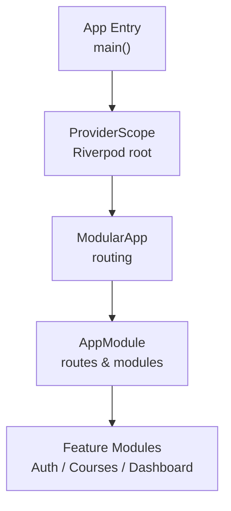
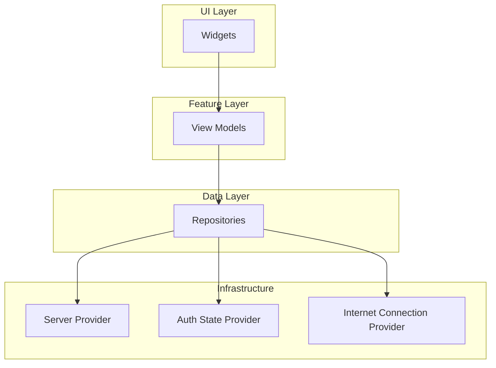
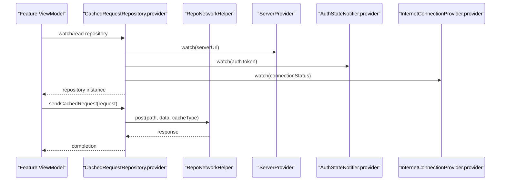
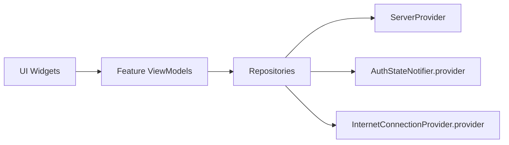

# State Management with Riverpod

<cite>
**Referenced Files in This Document**
- [main.dart](file://lib/main.dart)
- [app_module.dart](file://lib/app_module.dart)
- [data_state.dart](file://lib/app/core/logic/data_state/data_state.dart)
- [cached_request_repository.dart](file://lib/app/core/logic/repository/cached_request_repository.dart)
</cite>

## Table of Contents
1. [Introduction](#introduction)
2. [Project Structure](#project-structure)
3. [Core Components](#core-components)
4. [Architecture Overview](#architecture-overview)
5. [Detailed Component Analysis](#detailed-component-analysis)
6. [Dependency Analysis](#dependency-analysis)
7. [Performance Considerations](#performance-considerations)
8. [Troubleshooting Guide](#troubleshooting-guide)
9. [Conclusion](#conclusion)

## Introduction
This document explains how the LMS application uses Riverpod for state management and reactive UI updates. It covers the provider hierarchy, synchronization patterns between data sources and UI, and the roles of different provider types (StateProvider, FutureProvider, StreamProvider). It also provides guidance on complex scenarios such as authentication state, course progress tracking, and network state management, along with performance optimization, memory management, and debugging strategies.

## Project Structure
At app startup, the Flutter app initializes core services and wraps the widget tree with ProviderScope to enable Riverpod throughout the application. The modular routing is configured via Flutter Modular, while Riverpod manages state and dependency injection.

**Diagram sources**
- [main.dart:16-37](file://lib/main.dart#L16-L37)
- [app_module.dart:7-19](file://lib/app_module.dart#L7-L19)

**Section sources**
- [main.dart:16-37](file://lib/main.dart#L16-L37)
- [app_module.dart:7-19](file://lib/app_module.dart#L7-L19)

## Core Components
- Data state modeling: A generic DataState<T> encapsulates loading, data, error, and idle states for providers that expose asynchronous or stream-based data.
- Repository integration with Riverpod: Repositories are exposed as Providers and consume other providers (e.g., server URL, auth token, connectivity) to build requests and handle caching.

Key responsibilities:
- Centralize state shape and transitions for async operations.
- Provide a consistent interface for features to read/write state through Riverpod.
- Wire infrastructure concerns (network, cache, auth) into feature logic via providers.

**Section sources**
- [data_state.dart:1-22](file://lib/app/core/logic/data_state/data_state.dart#L1-L22)
- [cached_request_repository.dart:9-18](file://lib/app/core/logic/repository/cached_request_repository.dart#L9-L18)

## Architecture Overview
The LMS follows a layered architecture with clear separation of concerns:
- UI layer subscribes to providers to reactively rebuild when state changes.
- Feature view models manage local state and orchestrate actions.
- Repositories encapsulate data access and depend on infrastructure providers (server config, auth, connectivity).
- Infrastructure providers supply configuration and environment state (e.g., server URL, internet connection).

[No sources needed since this diagram shows conceptual architecture]

## Detailed Component Analysis

### Data State Model
A generic DataState<T> represents the lifecycle of async data:
- States: idle, loading, data, error
- Factory methods to create each state variant
- Used by providers to present a uniform contract to the UI

Complexity: O(1) creation and access; immutable snapshot semantics encourage predictable updates.

Usage pattern:
- Providers return DataState<T> so UI can branch on state and render accordingly.
- Error messages are carried alongside data for user feedback.

**Section sources**
- [data_state.dart:1-22](file://lib/app/core/logic/data_state/data_state.dart#L1-L22)

### Repository Provider Wiring
The CachedRequestRepository is exposed as a Provider and composes infrastructure dependencies:
- Reads server URL from ServerProvider
- Reads current auth token from AuthStateNotifier.provider
- Reads connectivity status from InternetConnectionProvider.provider
- Uses these to configure RepoNetworkConfig and perform cached requests

This demonstrates a typical repository provider that depends on multiple global providers to construct request context.

**Diagram sources**
- [cached_request_repository.dart:9-18](file://lib/app/core/logic/repository/cached_request_repository.dart#L9-L18)

**Section sources**
- [cached_request_repository.dart:9-18](file://lib/app/core/logic/repository/cached_request_repository.dart#L9-L18)

### Provider Types and When to Use Each
- StateProvider: For simple, synchronous state that you mutate directly (e.g., toggles, form values, small UI-only flags). Prefer when no async work is involved.
- FutureProvider: For one-shot async computations that produce a value (e.g., fetching a single resource). Ideal for initial loads or explicit triggers like “refresh”.
- StreamProvider: For ongoing streams of data (e.g., real-time updates, connectivity streams, file system watchers). Automatically handles lifecycle and backpressure.

Guidance:
- Start with the simplest provider that fits the use case.
- Combine providers using ref.watch/ref.read to compose derived state.
- Use family providers for parameterized data (e.g., per-course progress).

[No sources needed since this section provides general guidance]

### Complex Scenarios

#### Authentication State
- Use a notifier-based provider to hold authenticated user info and token.
- Expose token via a provider consumed by repositories to attach authorization headers.
- React to login/logout by updating the notifier; dependent providers automatically rebuild.

Best practices:
- Keep sensitive data in memory only; persist minimal identifiers if necessary.
- Centralize token refresh logic in the auth provider to avoid duplication.

[No sources needed since this section provides general guidance]

#### Course Progress Tracking
- Use a family FutureProvider or StreamProvider to load progress per course.
- Cache results locally to minimize network calls.
- Debounce frequent updates (e.g., marking lessons complete) to reduce writes.

[No sources needed since this section provides general guidance]

#### Network State Management
- Expose connectivity via a StreamProvider or a notifier that listens to connection events.
- Repositories should check connectivity before issuing requests and queue or retry based on policy.
- UI can show offline banners or disable actions when disconnected.

[No sources needed since this section provides general guidance]

## Dependency Analysis
Riverpod enables explicit dependency graphs:
- Feature view models depend on repository providers.
- Repository providers depend on infrastructure providers (server config, auth, connectivity).
- UI components depend on feature-level providers.

[No sources needed since this diagram shows conceptual dependencies]

**Section sources**
- [cached_request_repository.dart:9-18](file://lib/app/core/logic/repository/cached_request_repository.dart#L9-L18)

## Performance Considerations
- Prefer precise reads: watch only the specific fields you need to minimize rebuilds.
- Use family providers for parameterized data to share instances across consumers.
- Debounce/throttle frequent updates (e.g., typing, scroll position) at the provider level.
- Avoid heavy computations in build; move to providers and memoize results.
- Use FutureProvider/StreamProvider to centralize caching and deduplication.
- Be mindful of provider lifecycles: ensure long-lived providers do not retain large objects unnecessarily.

[No sources needed since this section provides general guidance]

## Troubleshooting Guide
Common issues and strategies:
- Unexpected rebuilds: Ensure you are watching only necessary parts of state; split large providers into smaller ones.
- Stale data: Verify that providers invalidate or refresh when underlying data changes; consider using StreamProvider for live updates.
- Memory leaks: Avoid holding references to widgets or contexts in providers; prefer weak references where appropriate.
- Async errors: Surface errors via DataState or provider exceptions; provide user-friendly messages and retry options.
- Connectivity problems: Gate network calls behind connectivity checks; implement retry/backoff policies.

Debugging tips:
- Use ProviderObserver to log provider reads/writes and identify unnecessary updates.
- Print provider states during development to validate flows.
- Isolate problematic providers by temporarily replacing them with test doubles.

[No sources needed since this section provides general guidance]

## Conclusion
The LMS leverages Riverpod to create a robust, scalable state management solution. By combining DataState for consistent async handling, repository providers for data access, and infrastructure providers for configuration and environment, the app achieves clear separation of concerns and reactive UI updates. Following the recommended provider types, performance techniques, and debugging strategies will help maintain high quality as the application grows.