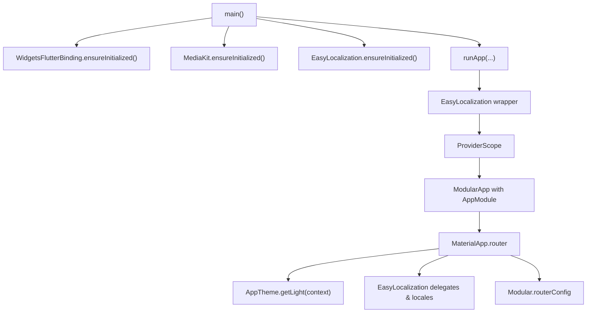
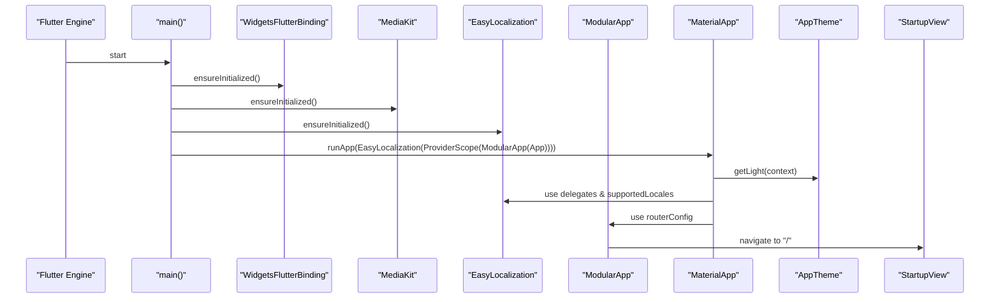
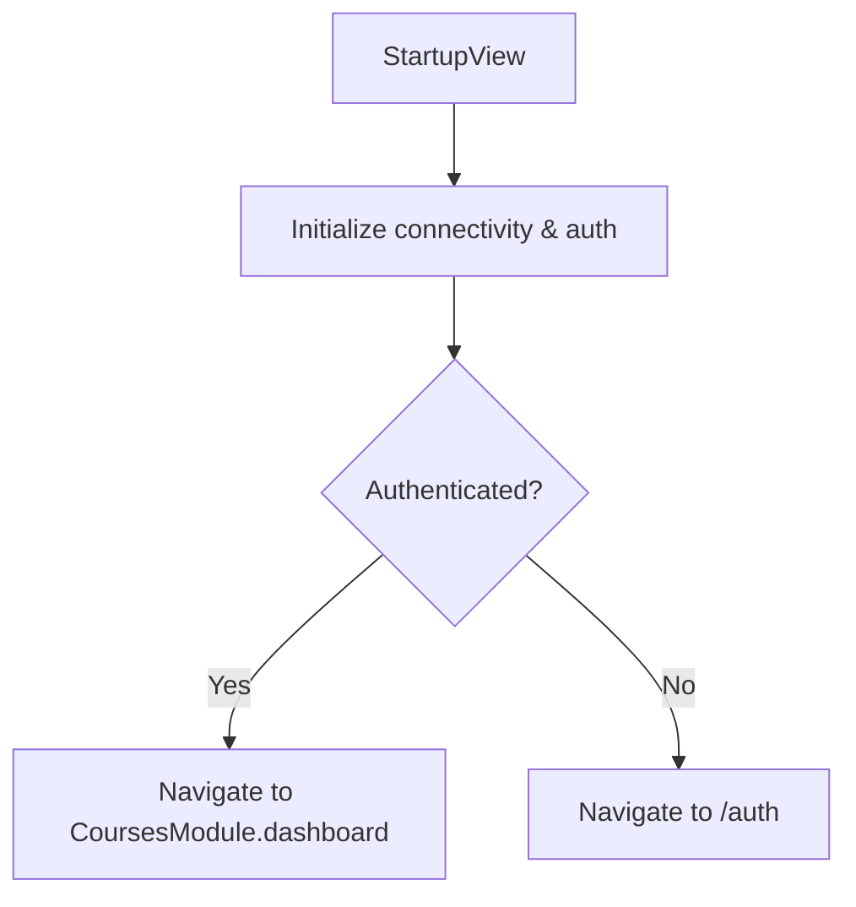
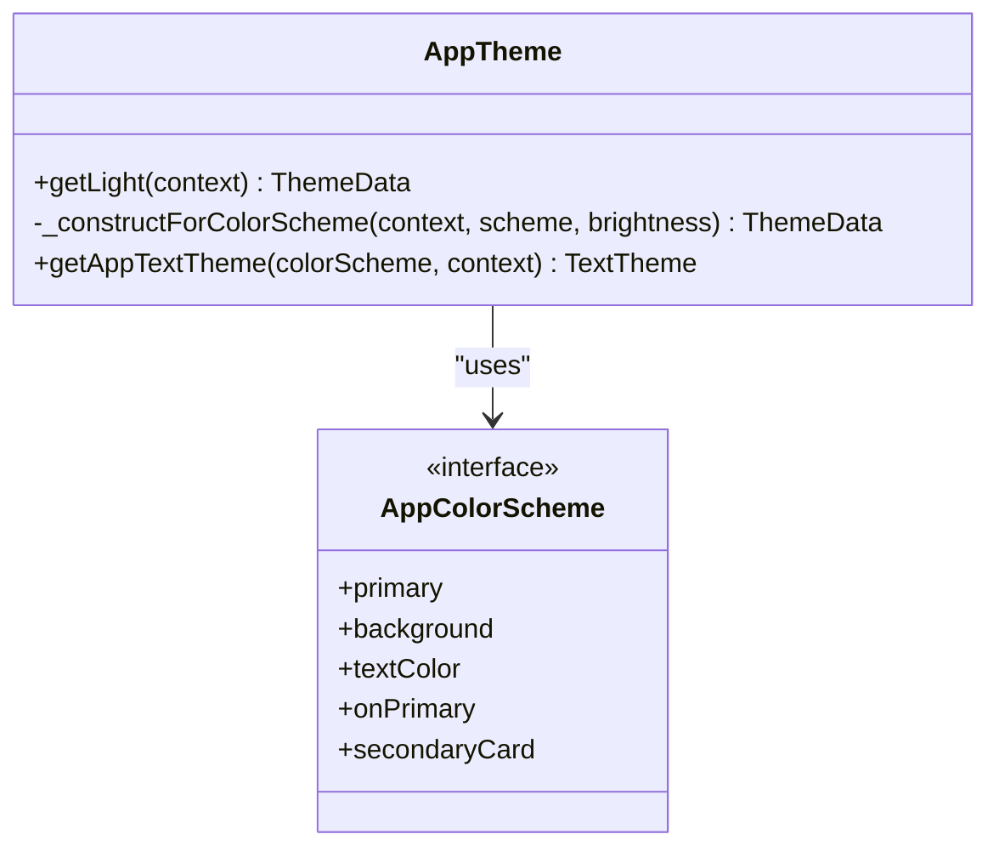
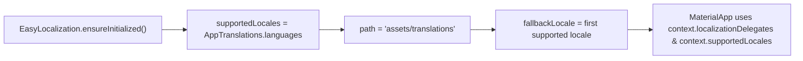
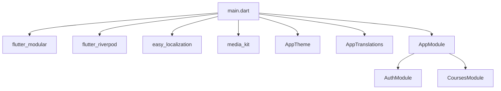

# Application Bootstrap

<cite>
**Referenced Files in This Document**
- [main.dart](file://lib/main.dart)
- [app_module.dart](file://lib/app_module.dart)
- [app_theme.dart](file://lib/app/core/design/app_theme.dart)
- [translate.dart](file://lib/app/core/localization/translate.dart)
- [startup_view_model.dart](file://lib/app/features/startup/view_model/startup_view_model.dart)
- [startup_view.dart](file://lib/app/features/startup/view/startup_view.dart)
- [auth_module.dart](file://lib/app/features/authentication/module/auth_module.dart)
- [en.json](file://assets/translations/en.json)
</cite>

## Table of Contents
1. [Introduction](#introduction)
2. [Project Structure](#project-structure)
3. [Core Components](#core-components)
4. [Architecture Overview](#architecture-overview)
5. [Detailed Component Analysis](#detailed-component-analysis)
6. [Dependency Analysis](#dependency-analysis)
7. [Performance Considerations](#performance-considerations)
8. [Troubleshooting Guide](#troubleshooting-guide)
9. [Conclusion](#conclusion)
10. [Appendices](#appendices)

## Introduction
This document explains the bootstrap process of the Leadership Edge Live LMS Flutter application. It focuses on how the app initializes core services, sets up internationalization and theming, configures dependency injection and modular routing, and navigates to the first screen. It also provides guidance for extending the bootstrap flow, adding global providers, configuring platform-specific initialization, and debugging startup issues.

## Project Structure
At runtime, the Flutter engine starts at the main entry point, which performs essential initializations before rendering the UI tree. The key files involved in bootstrap are:
- Entry point and root widget setup
- Modular routing configuration
- Theme system
- Localization configuration
- Startup view and navigation logic

**Diagram sources**
- [main.dart:16-37](file://lib/main.dart#L16-L37)
- [app_theme.dart:8-15](file://lib/app/core/design/app_theme.dart#L8-L15)
- [translate.dart:11-15](file://lib/app/core/localization/translate.dart#L11-L15)
- [app_module.dart:7-19](file://lib/app_module.dart#L7-L19)

**Section sources**
- [main.dart:16-37](file://lib/main.dart#L16-L37)
- [app_module.dart:7-19](file://lib/app_module.dart#L7-L19)

## Core Components
- WidgetsFlutterBinding ensures the Flutter binding is initialized before any platform or plugin calls.
- MediaKit ensures media playback subsystems are ready across platforms.
- EasyLocalization prepares localization resources and locale resolution.
- ProviderScope enables Riverpod state management throughout the app.
- ModularApp registers routes and modules via flutter_modular.
- MaterialApp.config uses Modular’s router and integrates EasyLocalization delegates and locales.
- AppTheme.getLight constructs the light theme using a color scheme and typography.

Practical notes:
- The app clears leftover temporary decrypted viewing files early to avoid stale data from previous runs.
- The root widget applies StyledToast with the current locale and renders a Material app configured for modular routing and localization.

**Section sources**
- [main.dart:16-37](file://lib/main.dart#L16-L37)
- [app_theme.dart:8-15](file://lib/app/core/design/app_theme.dart#L8-L15)
- [translate.dart:11-15](file://lib/app/core/localization/translate.dart#L11-L15)

## Architecture Overview
The bootstrap sequence establishes a layered foundation:
- Platform bindings and plugins (binding, media kit)
- Internationalization (EasyLocalization)
- State management (Riverpod via ProviderScope)
- Routing and modularity (flutter_modular)
- Theming (AppTheme)
- Root UI (MaterialApp with router and localizations)

**Diagram sources**
- [main.dart:16-37](file://lib/main.dart#L16-L37)
- [app_theme.dart:8-15](file://lib/app/core/design/app_theme.dart#L8-L15)
- [translate.dart:11-15](file://lib/app/core/localization/translate.dart#L11-L15)
- [app_module.dart:7-19](file://lib/app_module.dart#L7-L19)

## Detailed Component Analysis

### Entry Point Initialization Sequence
- Ensures Flutter binding is ready.
- Initializes MediaKit for cross-platform media playback.
- Initializes EasyLocalization with supported locales defined centrally.
- Performs best-effort cleanup of temporary decrypted files left by prior runs.
- Wraps the app with EasyLocalization, ProviderScope, and ModularApp, then renders the root widget.

Key behaviors:
- The root widget applies localized toast messages and configures MaterialApp with modular routing and localization delegates.
- The theme is resolved from AppTheme.getLight(context), ensuring consistent colors and typography.

**Section sources**
- [main.dart:16-37](file://lib/main.dart#L16-L37)
- [app_theme.dart:8-15](file://lib/app/core/design/app_theme.dart#L8-L15)
- [translate.dart:11-15](file://lib/app/core/localization/translate.dart#L11-L15)

### Dependency Injection and Modular Routing
- ProviderScope enables Riverpod access globally.
- ModularApp registers the AppModule, which defines:
  - Root route pointing to StartupView
  - Feature modules for authentication and courses
- Routes are declarative and composable, allowing feature-level encapsulation.

Navigation after startup:
- StartupView triggers asynchronous initialization (connectivity and auth).
- Based on authentication state, it navigates to either the dashboard or the sign-in screen.

**Diagram sources**
- [startup_view_model.dart:20-37](file://lib/app/features/startup/view_model/startup_view_model.dart#L20-L37)
- [app_module.dart:7-19](file://lib/app_module.dart#L7-L19)
- [auth_module.dart:5-9](file://lib/app/features/authentication/module/auth_module.dart#L5-L9)

**Section sources**
- [app_module.dart:7-19](file://lib/app_module.dart#L7-L19)
- [startup_view_model.dart:20-37](file://lib/app/features/startup/view_model/startup_view_model.dart#L20-L37)
- [auth_module.dart:5-9](file://lib/app/features/authentication/module/auth_module.dart#L5-L9)

### Theme System Initialization
- AppTheme.getLight(context) builds a ThemeData instance using:
  - A custom color scheme
  - Typography based on Google Fonts and responsive sizing
  - Consistent button, input, and FAB themes
- The theme is applied within MaterialApp, ensuring all widgets inherit consistent styling.

**Diagram sources**
- [app_theme.dart:8-15](file://lib/app/core/design/app_theme.dart#L8-L15)
- [app_theme.dart:17-107](file://lib/app/core/design/app_theme.dart#L17-L107)
- [app_theme.dart:109-120](file://lib/app/core/design/app_theme.dart#L109-L120)

**Section sources**
- [app_theme.dart:8-15](file://lib/app/core/design/app_theme.dart#L8-L15)
- [app_theme.dart:17-107](file://lib/app/core/design/app_theme.dart#L17-L107)
- [app_theme.dart:109-120](file://lib/app/core/design/app_theme.dart#L109-L120)

### Localization Setup
- Supported locales are centralized in AppTranslations.languages.
- EasyLocalization is configured with:
  - Path to translation assets
  - Fallback locale set to the first supported locale
- MaterialApp integrates EasyLocalization delegates and locales so translations are available throughout the UI.
- Translation strings are stored under assets/translations; an English file is present.

**Diagram sources**
- [main.dart:25-36](file://lib/main.dart#L25-L36)
- [translate.dart:11-15](file://lib/app/core/localization/translate.dart#L11-L15)
- [en.json:1-8](file://assets/translations/en.json#L1-L8)

**Section sources**
- [main.dart:25-36](file://lib/main.dart#L25-L36)
- [translate.dart:11-15](file://lib/app/core/localization/translate.dart#L11-L15)
- [en.json:1-8](file://assets/translations/en.json#L1-L8)

### Practical Examples

#### Extending the Bootstrap Process
- Add new global providers:
  - Register providers inside ProviderScope scope (e.g., in a top-level provider container or within a dedicated module) so they are available app-wide.
- Introduce additional initialization steps:
  - Insert async tasks before runApp completes if needed (e.g., analytics, crash reporting, feature flags).
  - Ensure any platform-specific initialization occurs after WidgetsFlutterBinding.ensureInitialized().

#### Adding New Global Providers
- Place provider definitions in a central location and ensure they are accessible through ProviderScope.
- Use autoDispose or keepAlive appropriately depending on lifecycle needs.

#### Configuring Platform-Specific Initialization
- Keep platform-specific code behind conditional checks or platform channels.
- For example, initialize platform features only when running on specific targets, after the Flutter binding is ready.

[No sources needed since this section provides general guidance]

## Dependency Analysis
The bootstrap layer depends on several packages and internal modules:
- Flutter framework (Widgets, Material)
- flutter_modular for routing and module composition
- flutter_riverpod for state management
- easy_localization for i18n
- media_kit for media playback
- Internal modules: AppModule, StartupView, AuthModule

**Diagram sources**
- [main.dart:1-14](file://lib/main.dart#L1-L14)
- [app_module.dart:1-19](file://lib/app_module.dart#L1-L19)
- [app_theme.dart:1-6](file://lib/app/core/design/app_theme.dart#L1-L6)
- [translate.dart:1-3](file://lib/app/core/localization/translate.dart#L1-L3)

**Section sources**
- [main.dart:1-14](file://lib/main.dart#L1-L14)
- [app_module.dart:1-19](file://lib/app_module.dart#L1-L19)

## Performance Considerations
- Defer non-critical initialization until after the first frame if possible to reduce startup time.
- Avoid heavy work in the main thread during bootstrap; use background tasks where appropriate.
- Reuse computed theme objects and avoid recreating large structures per build.
- Minimize synchronous operations in the critical path of main().

[No sources needed since this section provides general guidance]

## Troubleshooting Guide
Common startup issues and debugging techniques:
- Missing or incorrect localization files:
  - Verify that assets/translations contains the expected JSON files and that EasyLocalization path matches.
  - Confirm supportedLocales includes the intended locales.
- MediaKit not initializing:
  - Ensure MediaKit.ensureInitialized() is called before any media usage.
  - Check platform-specific plugin registration and permissions.
- Routing problems:
  - Validate that AppModule registers routes correctly and that nested modules are properly mounted.
  - Use debugMode in ModularApp to inspect route transitions.
- Provider access errors:
  - Ensure ProviderScope wraps the entire app tree and that providers are declared before being consumed.
- Navigation after startup:
  - Inspect StartupViewModel initialization to confirm connectivity and auth flows complete without fatal exceptions.

Debugging tips:
- Enable verbose logging for third-party packages during development.
- Use Flutter DevTools to inspect widget trees, providers, and network requests.
- Temporarily disable non-essential initialization steps to isolate failures.

**Section sources**
- [startup_view_model.dart:20-37](file://lib/app/features/startup/view_model/startup_view_model.dart#L20-L37)
- [main.dart:25-36](file://lib/main.dart#L25-L36)
- [app_module.dart:7-19](file://lib/app_module.dart#L7-L19)

## Conclusion
The bootstrap process establishes a robust foundation for the Leadership Edge Live LMS by initializing platform bindings, media capabilities, internationalization, state management, and modular routing. The theme and localization are integrated into the root Material app, and the startup flow navigates users based on authentication state. Following the extension and troubleshooting guidance will help maintain a clean, scalable, and debuggable startup experience.

## Appendices

### Key File Responsibilities Summary
- main.dart: Orchestrates bootstrap, wraps app with localization, providers, and modular routing, and configures the root Material app.
- app_module.dart: Declares root and feature routes.
- app_theme.dart: Provides theme construction and text styling.
- translate.dart: Centralizes supported locales and translation utilities.
- startup_view_model.dart: Initializes connectivity and authentication, then navigates accordingly.
- startup_view.dart: Displays loading UI while startup logic runs.
- auth_module.dart: Defines authentication routes.

**Section sources**
- [main.dart:16-59](file://lib/main.dart#L16-L59)
- [app_module.dart:7-19](file://lib/app_module.dart#L7-L19)
- [app_theme.dart:8-120](file://lib/app/core/design/app_theme.dart#L8-L120)
- [translate.dart:1-15](file://lib/app/core/localization/translate.dart#L1-L15)
- [startup_view_model.dart:20-37](file://lib/app/features/startup/view_model/startup_view_model.dart#L20-L37)
- [startup_view.dart:7-27](file://lib/app/features/startup/view/startup_view.dart#L7-L27)
- [auth_module.dart:5-9](file://lib/app/features/authentication/module/auth_module.dart#L5-L9)