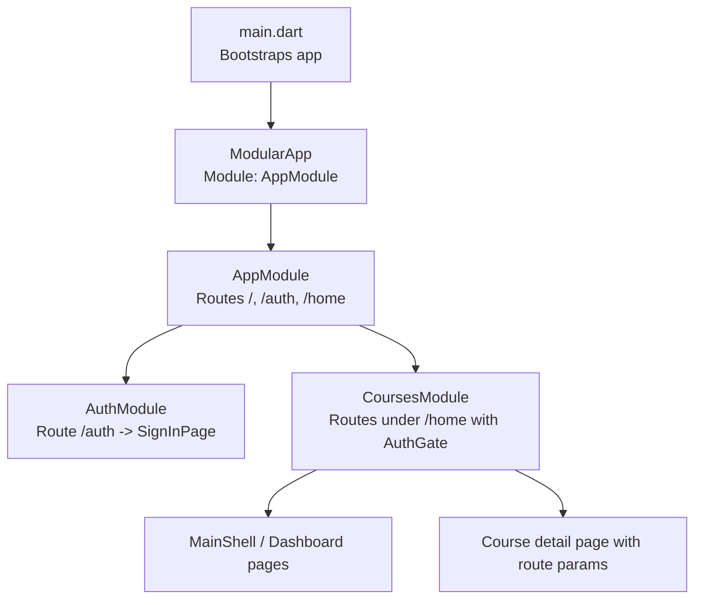
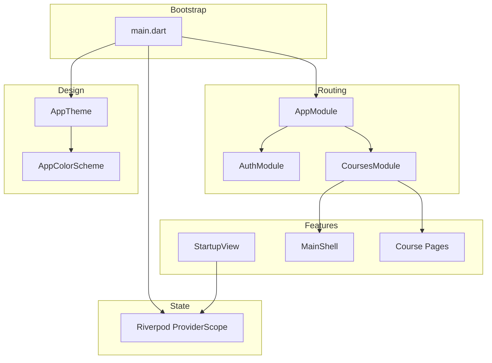
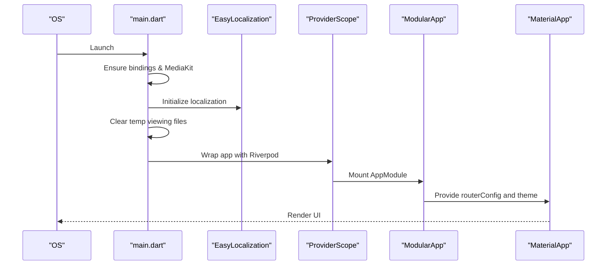
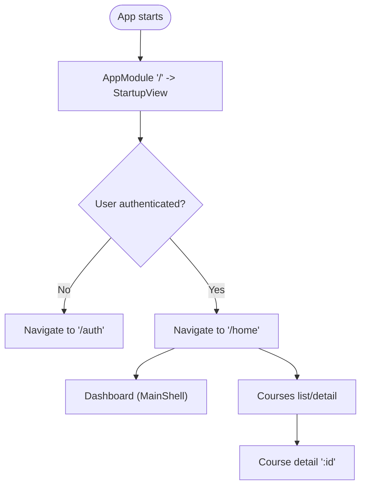
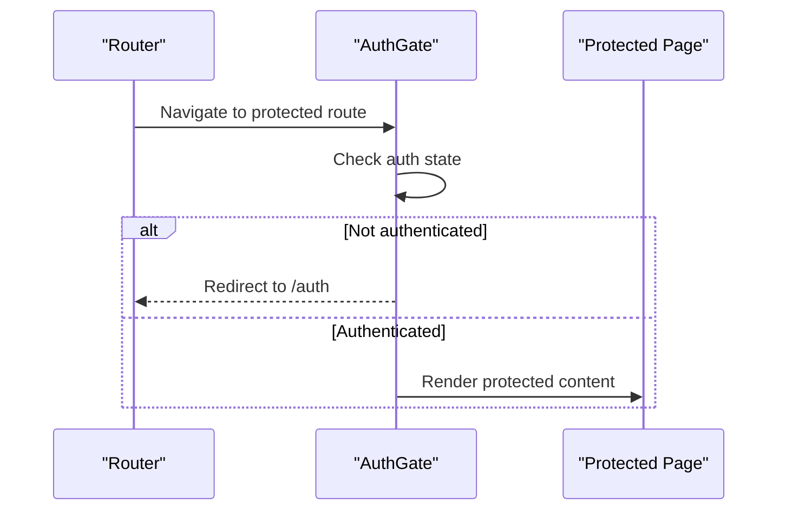
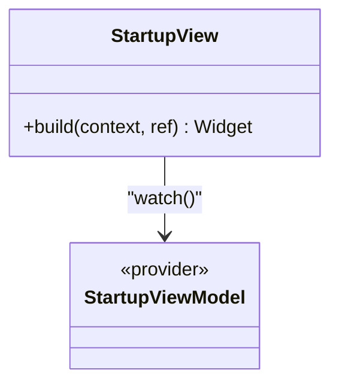
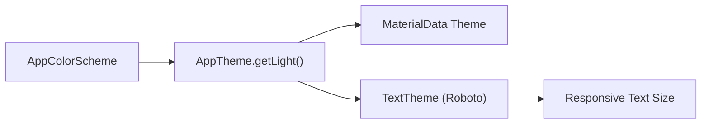
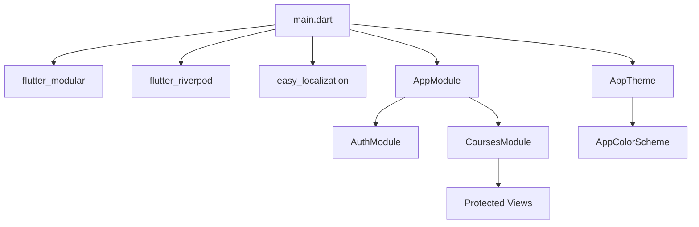

# Core System

<cite>
**Referenced Files in This Document**
- [main.dart](file://lib/main.dart)
- [app_module.dart](file://lib/app_module.dart)
- [auth_module.dart](file://lib/app/features/authentication/module/auth_module.dart)
- [courses_module.dart](file://lib/app/features/courses/module/courses_module.dart)
- [startup_view.dart](file://lib/app/features/startup/view/startup_view.dart)
- [app_theme.dart](file://lib/app/core/design/app_theme.dart)
- [app_color_scheme.dart](file://lib/app/core/design/app_color_scheme.dart)
- [translate.dart](file://lib/app/core/localization/translate.dart)
</cite>

## Table of Contents
1. [Introduction](#introduction)
2. [Project Structure](#project-structure)
3. [Core Components](#core-components)
4. [Architecture Overview](#architecture-overview)
5. [Detailed Component Analysis](#detailed-component-analysis)
6. [Dependency Analysis](#dependency-analysis)
7. [Performance Considerations](#performance-considerations)
8. [Troubleshooting Guide](#troubleshooting-guide)
9. [Conclusion](#conclusion)
10. [Appendices](#appendices)

## Introduction
This document explains the core system of Leadership Edge Live LMS, focusing on how the application boots, initializes global providers and theme, organizes routing with Flutter Modular, manages state with Riverpod, and establishes a design system foundation. It also outlines utility services and provides practical guidance for extending the system and integrating new features.

## Project Structure
The app is a Flutter application that bootstraps via main.dart, sets up localization, media, and provider scopes, then delegates navigation to Flutter Modular. The root module registers top-level routes and mounts feature modules (authentication and courses). A startup view drives initial logic using Riverpod before navigating users based on authentication state.

**Diagram sources**
- [main.dart:16-38](file://lib/main.dart#L16-L38)
- [app_module.dart:7-20](file://lib/app_module.dart#L7-L20)
- [auth_module.dart:5-10](file://lib/app/features/authentication/module/auth_module.dart#L5-L10)
- [courses_module.dart:20-69](file://lib/app/features/courses/module/courses_module.dart#L20-L69)

**Section sources**
- [main.dart:16-38](file://lib/main.dart#L16-L38)
- [app_module.dart:7-20](file://lib/app_module.dart#L7-L20)

## Core Components
- Application bootstrap: Initializes Flutter binding, media kit, localization, cleans temporary files, and runs the app with ProviderScope and ModularApp.
- Global providers: Wrapped in ProviderScope to enable Riverpod across the app.
- Routing: Root module mounts feature modules; each module defines its own routes.
- Theme: Material theme built from a custom color scheme and responsive typography.
- Localization: EasyLocalization configured with supported locales and fallback.

**Section sources**
- [main.dart:16-38](file://lib/main.dart#L16-L38)
- [app_theme.dart:8-121](file://lib/app/core/design/app_theme.dart#L8-L121)
- [app_color_scheme.dart:3-105](file://lib/app/core/design/app_color_scheme.dart#L3-L105)
- [translate.dart:1-16](file://lib/app/core/localization/translate.dart#L1-L16)

## Architecture Overview
The runtime architecture layers are:
- Bootstrap layer: main.dart initializes environment and wraps the app with providers and modular router.
- Routing layer: Flutter Modular modules define hierarchical routes and mount feature-specific sub-routers.
- Feature layer: Authentication and Courses modules encapsulate UI, state, and navigation within their scope.
- Design layer: AppTheme and AppColorScheme provide consistent theming and responsive text sizing.
- State layer: Riverpod ProviderScope enables reactive state management throughout the app.

**Diagram sources**
- [main.dart:16-38](file://lib/main.dart#L16-L38)
- [app_module.dart:7-20](file://lib/app_module.dart#L7-L20)
- [auth_module.dart:5-10](file://lib/app/features/authentication/module/auth_module.dart#L5-L10)
- [courses_module.dart:20-69](file://lib/app/features/courses/module/courses_module.dart#L20-L69)
- [startup_view.dart:7-27](file://lib/app/features/startup/view/startup_view.dart#L7-L27)
- [app_theme.dart:8-121](file://lib/app/core/design/app_theme.dart#L8-L121)
- [app_color_scheme.dart:3-105](file://lib/app/core/design/app_color_scheme.dart#L3-L105)

## Detailed Component Analysis

### Application Bootstrap and Initialization Sequence
- Ensures Flutter binding and media initialization.
- Initializes localization and clears any leftover temporary viewing files.
- Wraps the app with EasyLocalization, ProviderScope, and ModularApp.
- MaterialApp uses Modular.routerConfig for routing and applies the light theme.

**Diagram sources**
- [main.dart:16-38](file://lib/main.dart#L16-L38)

**Section sources**
- [main.dart:16-38](file://lib/main.dart#L16-L38)

### Modular Routing System
- Root module registers:
  - Home route "/" pointing to StartupView.
  - Auth module at "/auth".
  - Courses module at "/home".
- AuthModule exposes a single child route mapping to SignInPage.
- CoursesModule defines many nested routes under "/home", including dashboard and course detail with path parameters.
- Navigation pattern:
  - Use Modular.routerConfig in MaterialApp.
  - Feature modules encapsulate their own routes.
  - Protected routes are wrapped with an authentication guard component.

**Diagram sources**
- [app_module.dart:7-20](file://lib/app_module.dart#L7-L20)
- [auth_module.dart:5-10](file://lib/app/features/authentication/module/auth_module.dart#L5-L10)
- [courses_module.dart:20-69](file://lib/app/features/courses/module/courses_module.dart#L20-L69)

**Section sources**
- [app_module.dart:7-20](file://lib/app_module.dart#L7-L20)
- [auth_module.dart:5-10](file://lib/app/features/authentication/module/auth_module.dart#L5-L10)
- [courses_module.dart:20-69](file://lib/app/features/courses/module/courses_module.dart#L20-L69)

### Authentication Guards
- Protected routes in CoursesModule wrap their content with an authentication guard component to ensure only authenticated users can access dashboards and course pages.
- This pattern centralizes authorization checks per route group.

**Diagram sources**
- [courses_module.dart:40-69](file://lib/app/features/courses/module/courses_module.dart#L40-L69)

**Section sources**
- [courses_module.dart:40-69](file://lib/app/features/courses/module/courses_module.dart#L40-L69)

### State Management with Riverpod
- ProviderScope is installed at the root to make providers available globally.
- StartupView consumes a startup view model provider to drive initial logic and transitions.
- Reactive updates: Widgets rebuild when watched providers change, enabling seamless UI synchronization with state.

**Diagram sources**
- [startup_view.dart:7-27](file://lib/app/features/startup/view/startup_view.dart#L7-L27)
- [main.dart:24-35](file://lib/main.dart#L24-L35)

**Section sources**
- [startup_view.dart:7-27](file://lib/app/features/startup/view/startup_view.dart#L7-L27)
- [main.dart:24-35](file://lib/main.dart#L24-L35)

### Design System Foundation
- Color Scheme:
  - Centralized colors and status colors defined in a theme extension.
  - Light scheme currently active with background, text, primary, and card colors.
- Theme Construction:
  - Builds ThemeData with seed color, brightness, surface, and button/input themes.
  - Applies responsive text sizing and Google Fonts Roboto.
- Typography:
  - Uses responsive text size utilities to scale type across screen sizes.
- Responsive Principles:
  - Text scaling and layout adapt to device width via responsive helpers.

**Diagram sources**
- [app_color_scheme.dart:3-105](file://lib/app/core/design/app_color_scheme.dart#L3-L105)
- [app_theme.dart:8-121](file://lib/app/core/design/app_theme.dart#L8-L121)

**Section sources**
- [app_color_scheme.dart:3-105](file://lib/app/core/design/app_color_scheme.dart#L3-L105)
- [app_theme.dart:8-121](file://lib/app/core/design/app_theme.dart#L8-L121)

### Localization Setup
- EasyLocalization is initialized with supported locales and a fallback locale.
- A convenience extension allows translating strings via context.
- Currently configured with English as the supported locale.

**Section sources**
- [main.dart:25-35](file://lib/main.dart#L25-L35)
- [translate.dart:1-16](file://lib/app/core/localization/translate.dart#L1-L16)

## Dependency Analysis
High-level dependencies between core components:
- main.dart depends on Modular, Riverpod, EasyLocalization, and AppTheme.
- AppModule depends on feature modules (AuthModule, CoursesModule).
- CoursesModule depends on protected views and a shell component.
- AppTheme depends on AppColorScheme and responsive typography utilities.

**Diagram sources**
- [main.dart:1-14](file://lib/main.dart#L1-L14)
- [app_module.dart:1-20](file://lib/app_module.dart#L1-L20)
- [courses_module.dart:1-69](file://lib/app/features/courses/module/courses_module.dart#L1-L69)
- [app_theme.dart:1-121](file://lib/app/core/design/app_theme.dart#L1-L121)

**Section sources**
- [main.dart:1-14](file://lib/main.dart#L1-L14)
- [app_module.dart:1-20](file://lib/app_module.dart#L1-L20)
- [courses_module.dart:1-69](file://lib/app/features/courses/module/courses_module.dart#L1-L69)
- [app_theme.dart:1-121](file://lib/app/core/design/app_theme.dart#L1-L121)

## Performance Considerations
- Keep startup logic minimal in StartupView; offload heavy work to providers or background tasks.
- Avoid rebuilding large trees by scoping watches to specific providers.
- Reuse theme and color definitions to minimize object creation.
- Use lazy loading for routes and images where appropriate.
- Ensure media kit initialization happens once at startup to avoid redundant costs.

[No sources needed since this section provides general guidance]

## Troubleshooting Guide
- Localization not applied:
  - Verify EasyLocalization is initialized and supported locales are set.
  - Ensure MaterialApp uses context.localizationDelegates and context.supportedLocales.
- Routes not resolving:
  - Confirm Modular.routerConfig is passed to MaterialApp.
  - Check that feature modules are mounted under correct paths in AppModule.
- Auth gate redirects unexpectedly:
  - Inspect the authentication state provider used by the guard.
  - Ensure login flow updates the provider and navigates to protected routes after success.
- Theme inconsistencies:
  - Validate that AppTheme.getLight is used consistently and that color scheme values are updated centrally.

**Section sources**
- [main.dart:25-56](file://lib/main.dart#L25-L56)
- [app_module.dart:15-20](file://lib/app_module.dart#L15-L20)
- [courses_module.dart:40-69](file://lib/app/features/courses/module/courses_module.dart#L40-L69)
- [app_theme.dart:8-121](file://lib/app/core/design/app_theme.dart#L8-L121)

## Conclusion
The core system combines a clean bootstrap process, modular routing, reactive state management, and a robust design system. By following the established patterns—modular route registration, guarded navigation, provider-driven state, and centralized theming—you can extend the platform with new features while maintaining consistency and performance.

[No sources needed since this section summarizes without analyzing specific files]

## Appendices

### Practical Examples for Extending the Core System
- Add a new feature module:
  - Create a new Module class and register routes under a dedicated path in AppModule.
  - Wrap protected routes with the authentication guard to enforce access control.
- Integrate a new provider:
  - Define a Riverpod provider and watch it in your view to react to state changes.
  - Place the provider in a logical folder under the feature’s provider directory.
- Extend the design system:
  - Add new tokens to AppColorScheme and reference them in AppTheme to propagate consistently.
  - Use responsive text utilities to maintain readability across devices.
- Configure localization:
  - Add new locales to the supported list and provide translation files.
  - Use the translation extension to localize strings in views.

[No sources needed since this section provides general guidance]