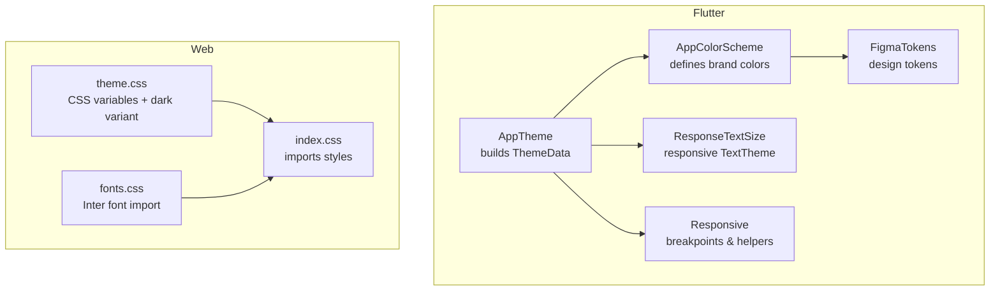
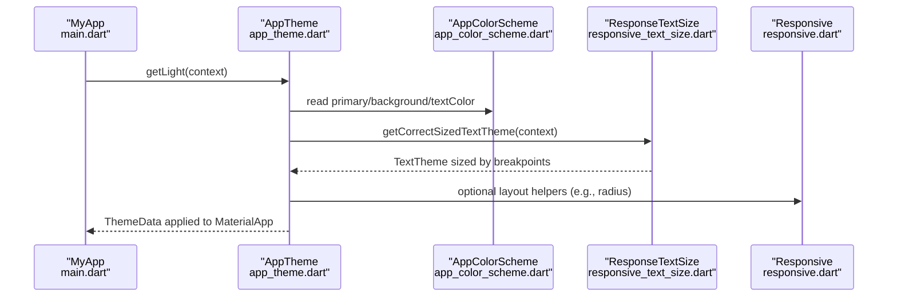
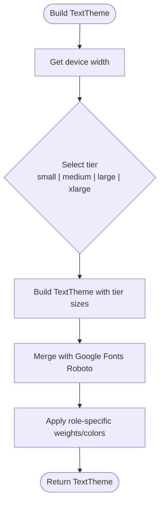
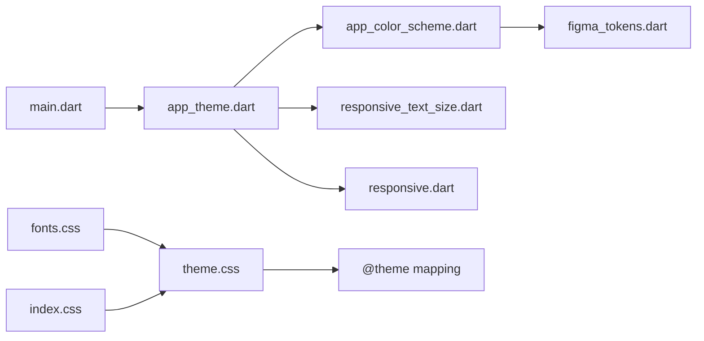

# Design System & Theming

<cite>
**Referenced Files in This Document**
- [main.dart](file://lib/main.dart)
- [app_theme.dart](file://lib/app/core/design/app_theme.dart)
- [app_color_scheme.dart](file://lib/app/core/design/app_color_scheme.dart)
- [responsive_text_size.dart](file://lib/app/core/design/responsive_text_size.dart)
- [responsive.dart](file://lib/app/core/design/responsive.dart)
- [figma_tokens.dart](file://lib/app/core/design/figma_tokens.dart)
- [theme.css](file://src/styles/theme.css)
- [fonts.css](file://src/styles/fonts.css)
- [index.css](file://src/styles/index.css)
</cite>

## Table of Contents
1. [Introduction](#introduction)
2. [Project Structure](#project-structure)
3. [Core Components](#core-components)
4. [Architecture Overview](#architecture-overview)
5. [Detailed Component Analysis](#detailed-component-analysis)
6. [Dependency Analysis](#dependency-analysis)
7. [Performance Considerations](#performance-considerations)
8. [Troubleshooting Guide](#troubleshooting-guide)
9. [Conclusion](#conclusion)
10. [Appendices](#appendices)

## Introduction
This document explains the design system and theming implementation for Leadership Edge Live LMS across both Flutter (mobile/desktop) and web (React/Tailwind). It covers:
- Color scheme architecture and tokens
- Typography system and responsive text sizing
- Light/dark mode handling
- Responsive design principles and breakpoints
- Extensibility guidelines for new colors, fonts, and components
- Accessibility considerations and cross-platform consistency
- Maintaining design tokens throughout the application

## Project Structure
The design system is split into two platforms with a shared token philosophy:
- Flutter app: centralized theme, color scheme, typography, and responsive utilities under lib/app/core/design
- Web app: CSS custom properties and Tailwind configuration under src/styles

**Diagram sources**
- [app_theme.dart:8-120](file://lib/app/core/design/app_theme.dart#L8-L120)
- [app_color_scheme.dart:3-104](file://lib/app/core/design/app_color_scheme.dart#L3-L104)
- [responsive_text_size.dart:3-145](file://lib/app/core/design/responsive_text_size.dart#L3-L145)
- [responsive.dart:6-70](file://lib/app/core/design/responsive.dart#L6-L70)
- [figma_tokens.dart:8-45](file://lib/app/core/design/figma_tokens.dart#L8-L45)
- [theme.css:3-182](file://src/styles/theme.css#L3-L182)
- [fonts.css:1-2](file://src/styles/fonts.css#L1-L2)
- [index.css:1-4](file://src/styles/index.css#L1-L4)

**Section sources**
- [main.dart:44-56](file://lib/main.dart#L44-L56)
- [app_theme.dart:8-120](file://lib/app/core/design/app_theme.dart#L8-L120)
- [theme.css:3-182](file://src/styles/theme.css#L3-L182)

## Core Components
- AppTheme: constructs Material ThemeData using a seed color and applies consistent button, input, FAB, and text themes. Integrates Google Fonts Roboto for Flutter and merges responsive text sizing.
- AppColorScheme: centralizes brand colors, gradients, status colors, and card/background tokens; currently exposes light mode via ThemeExtension.
- ResponseTextSize: provides a responsive TextTheme based on device width breakpoints to ensure readable typography across phones, tablets, and desktops.
- Responsive: shared breakpoints and helpers for layout decisions (tablet/desktop/wide) and column counts.
- FigmaTokens: single source of truth for brand colors and UI tokens aligned with the design spec.
- Web theme.css: defines CSS custom properties for light and dark modes, maps to Tailwind’s @theme, and sets base typography defaults.

**Section sources**
- [app_theme.dart:8-120](file://lib/app/core/design/app_theme.dart#L8-L120)
- [app_color_scheme.dart:3-104](file://lib/app/core/design/app_color_scheme.dart#L3-L104)
- [responsive_text_size.dart:3-145](file://lib/app/core/design/responsive_text_size.dart#L3-L145)
- [responsive.dart:6-70](file://lib/app/core/design/responsive.dart#L6-L70)
- [figma_tokens.dart:8-45](file://lib/app/core/design/figma_tokens.dart#L8-L45)
- [theme.css:3-182](file://src/styles/theme.css#L3-L182)

## Architecture Overview
The Flutter theme pipeline starts at the app entry point, which injects the light theme into MaterialApp. The theme builder composes a ColorScheme from a seed color, applies the responsive text theme, and configures component-level styling. On the web, theme.css defines CSS variables for light and dark modes and maps them to Tailwind tokens, enabling consistent styling across components.

**Diagram sources**
- [main.dart:44-56](file://lib/main.dart#L44-L56)
- [app_theme.dart:8-120](file://lib/app/core/design/app_theme.dart#L8-L120)
- [app_color_scheme.dart:3-104](file://lib/app/core/design/app_color_scheme.dart#L3-L104)
- [responsive_text_size.dart:3-145](file://lib/app/core/design/responsive_text_size.dart#L3-L145)
- [responsive.dart:6-70](file://lib/app/core/design/responsive.dart#L6-L70)

## Detailed Component Analysis

### Flutter Theme: AppTheme
- Builds ThemeData with a seed color derived from AppColorScheme.primary
- Applies responsive typography via ResponseTextSize and Google Fonts Roboto
- Configures ElevatedButton, OutlinedButton, Checkbox, InputDecoration, and FAB themes consistently
- Uses context-based radii and spacing where applicable

Key behaviors:
- Seed-based ColorScheme ensures consistent surface and tint mapping
- TextTheme overrides emphasize headings and labels while keeping body text accessible
- Button themes enforce consistent padding, elevation, and state-aware colors

**Section sources**
- [app_theme.dart:8-120](file://lib/app/core/design/app_theme.dart#L8-L120)

### Color Scheme: AppColorScheme and FigmaTokens
- AppColorScheme centralizes brand colors, gradients, status colors, and card backgrounds
- FigmaTokens mirrors the design system’s exact hex values and gradients for alignment with Figma
- Current implementation exposes light mode; dark mode placeholders exist but are not active

Extensibility:
- Add new semantic colors (e.g., info, warning) as getters
- Keep brand-aligned tokens in FigmaTokens and reference them in AppColorScheme
- For dark mode, implement a parallel scheme class and switch at runtime

**Section sources**
- [app_color_scheme.dart:3-104](file://lib/app/core/design/app_color_scheme.dart#L3-L104)
- [figma_tokens.dart:8-45](file://lib/app/core/design/figma_tokens.dart#L8-L45)

### Typography and Responsive Text Sizing
- ResponseTextSize selects a TextTheme based on device width breakpoints
- Breakpoints include small and medium ranges; larger tiers are defined for future expansion
- AppTheme merges this responsive TextTheme with Google Fonts Roboto and applies bold weights to key roles

Breakpoint logic:
- Determines current tier by comparing MediaQuery width against predefined ranges
- Returns a fully constructed TextTheme with appropriate sizes and weights per role

**Diagram sources**
- [responsive_text_size.dart:3-66](file://lib/app/core/design/responsive_text_size.dart#L3-L66)
- [responsive_text_size.dart:68-145](file://lib/app/core/design/responsive_text_size.dart#L68-L145)
- [app_theme.dart:109-120](file://lib/app/core/design/app_theme.dart#L109-L120)

**Section sources**
- [responsive_text_size.dart:3-145](file://lib/app/core/design/responsive_text_size.dart#L3-L145)
- [app_theme.dart:109-120](file://lib/app/core/design/app_theme.dart#L109-L120)

### Responsive Layout Utilities
- Responsive provides shared breakpoints (tablet, desktop, wide) and helpers like value() and columnsForWidth()
- Encourages consistent decision-making across screens for layouts and grid columns

Usage patterns:
- Use Responsive.isTablet/isDesktop to branch layout logic
- Use Responsive.value() to pick phone/tablet/desktop values for spacing, sizing, or visibility

**Section sources**
- [responsive.dart:6-70](file://lib/app/core/design/responsive.dart#L6-L70)

### Web Theming: CSS Variables and Dark Mode
- theme.css defines CSS custom properties for light and dark modes
- Uses a custom variant selector to scope dark styles
- Maps CSS variables to Tailwind’s @theme tokens for consistent usage across components
- Base layer sets default typography for HTML elements and root font size

Dark mode activation:
- Toggle a .dark class on the root element to switch CSS variables
- All components consuming these variables automatically adapt

**Section sources**
- [theme.css:1-182](file://src/styles/theme.css#L1-L182)

### Font Loading
- Web uses Inter via Google Fonts import in fonts.css
- Flutter uses Roboto via Google Fonts integration in AppTheme

Cross-platform note:
- Ensure brand alignment when selecting fonts; consider adding a brand font to both platforms if needed

**Section sources**
- [fonts.css:1-2](file://src/styles/fonts.css#L1-L2)
- [app_theme.dart:109-120](file://lib/app/core/design/app_theme.dart#L109-L120)

## Dependency Analysis

**Diagram sources**
- [main.dart:44-56](file://lib/main.dart#L44-L56)
- [app_theme.dart:8-120](file://lib/app/core/design/app_theme.dart#L8-L120)
- [app_color_scheme.dart:3-104](file://lib/app/core/design/app_color_scheme.dart#L3-L104)
- [responsive_text_size.dart:3-145](file://lib/app/core/design/responsive_text_size.dart#L3-L145)
- [responsive.dart:6-70](file://lib/app/core/design/responsive.dart#L6-L70)
- [figma_tokens.dart:8-45](file://lib/app/core/design/figma_tokens.dart#L8-L45)
- [theme.css:3-182](file://src/styles/theme.css#L3-L182)
- [fonts.css:1-2](file://src/styles/fonts.css#L1-L2)
- [index.css:1-4](file://src/styles/index.css#L1-L4)

**Section sources**
- [main.dart:44-56](file://lib/main.dart#L44-L56)
- [app_theme.dart:8-120](file://lib/app/core/design/app_theme.dart#L8-L120)
- [theme.css:3-182](file://src/styles/theme.css#L3-L182)

## Performance Considerations
- Centralize tokens to avoid redundant constants and reduce bundle size through reuse
- Prefer responsive TextTheme over ad-hoc font sizes to minimize reflows and improve readability scaling
- Use shared breakpoints to avoid duplicated logic and keep layout calculations efficient
- In web, rely on CSS variables and Tailwind’s compiled classes for minimal runtime overhead

[No sources needed since this section provides general guidance]

## Troubleshooting Guide
- Theme not applying:
  - Verify MaterialApp receives ThemeData from AppTheme.getLight(context)
  - Ensure no overriding theme is set later in the widget tree
- Colors inconsistent:
  - Confirm components use AppColorScheme or FigmaTokens rather than hardcoded colors
  - Check that seed color matches intended brand value
- Typography looks off on certain devices:
  - Validate that ResponseTextSize is used via AppTheme’s TextTheme
  - Check device width ranges and breakpoint thresholds
- Dark mode not toggling on web:
  - Ensure .dark class is applied to the root element
  - Confirm components consume CSS variables mapped via @theme

**Section sources**
- [main.dart:44-56](file://lib/main.dart#L44-L56)
- [app_theme.dart:8-120](file://lib/app/core/design/app_theme.dart#L8-L120)
- [theme.css:1-182](file://src/styles/theme.css#L1-L182)

## Conclusion
The Leadership Edge Live LMS design system centralizes colors, typography, and responsive behavior in well-defined modules. Flutter leverages a seed-based Material theme with responsive text sizing and shared breakpoints, while the web uses CSS variables and Tailwind tokens for consistent light/dark theming. By extending AppColorScheme and FigmaTokens, teams can maintain a single source of truth for design tokens and ensure cross-platform consistency.

[No sources needed since this section summarizes without analyzing specific files]

## Appendices

### How to Extend the Design System

- Add a new brand color:
  - Define it in FigmaTokens for design alignment
  - Expose a getter in AppColorScheme for Flutter usage
  - Add corresponding CSS variable in theme.css for web if needed

- Add a new font:
  - Import the font in fonts.css for web
  - Integrate via Google Fonts in AppTheme for Flutter
  - Update TextTheme roles as necessary

- Create a new component:
  - Use AppColorScheme tokens for colors
  - Use ResponseTextSize roles for typography
  - Use Responsive helpers for layout decisions
  - On web, use Tailwind classes bound to theme variables

- Implement dark mode:
  - Add a dark AppColorScheme implementation and switch at runtime
  - Ensure all CSS variables have dark variants in theme.css
  - Test contrast ratios for accessibility

[No sources needed since this section provides general guidance]