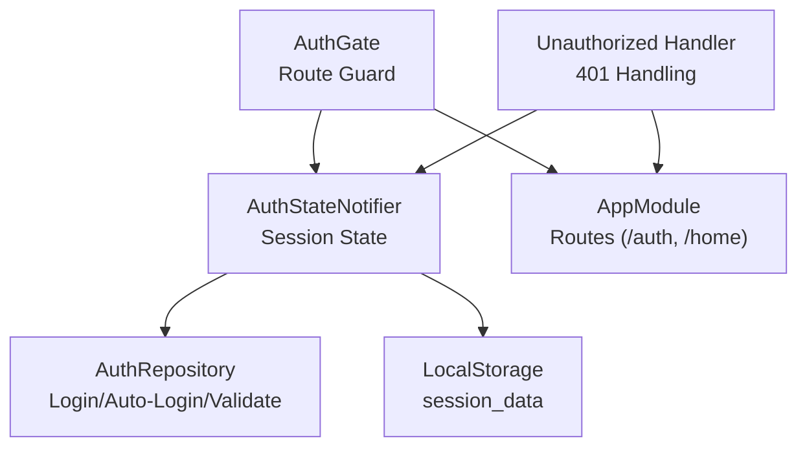
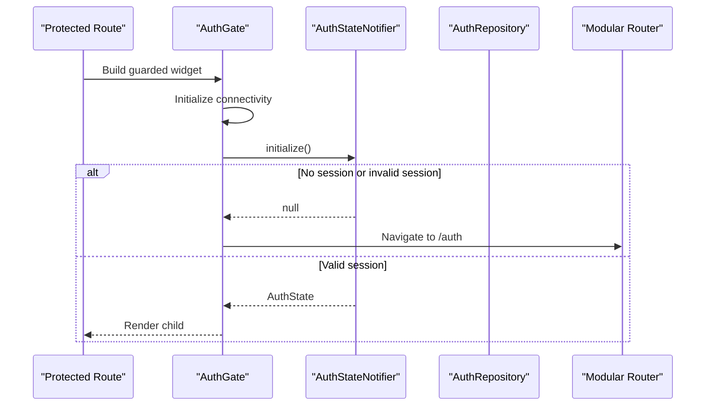
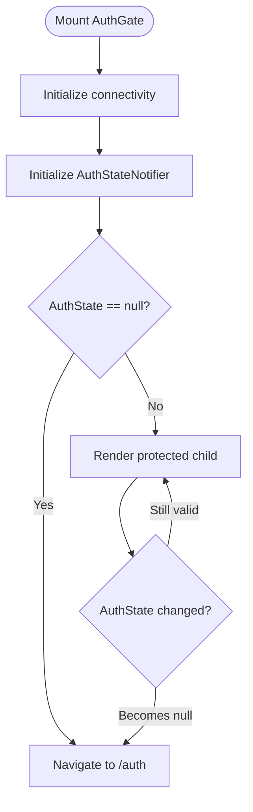
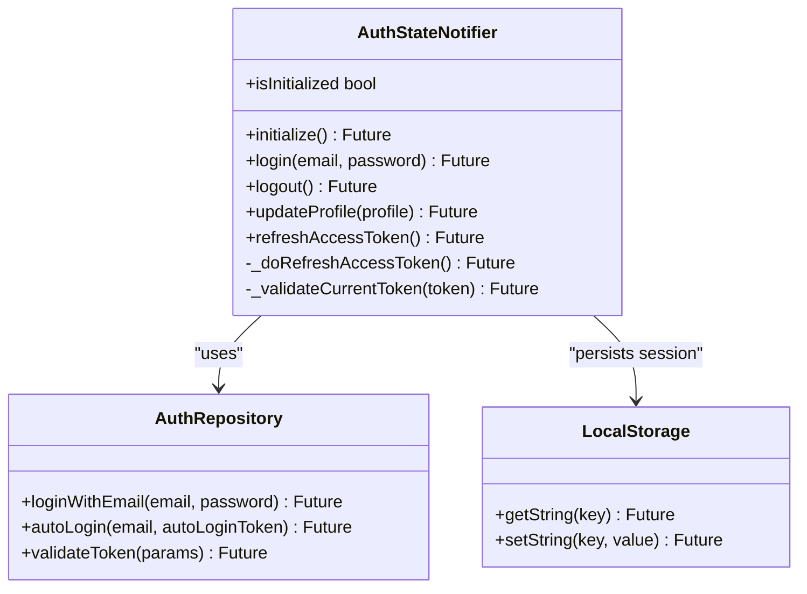
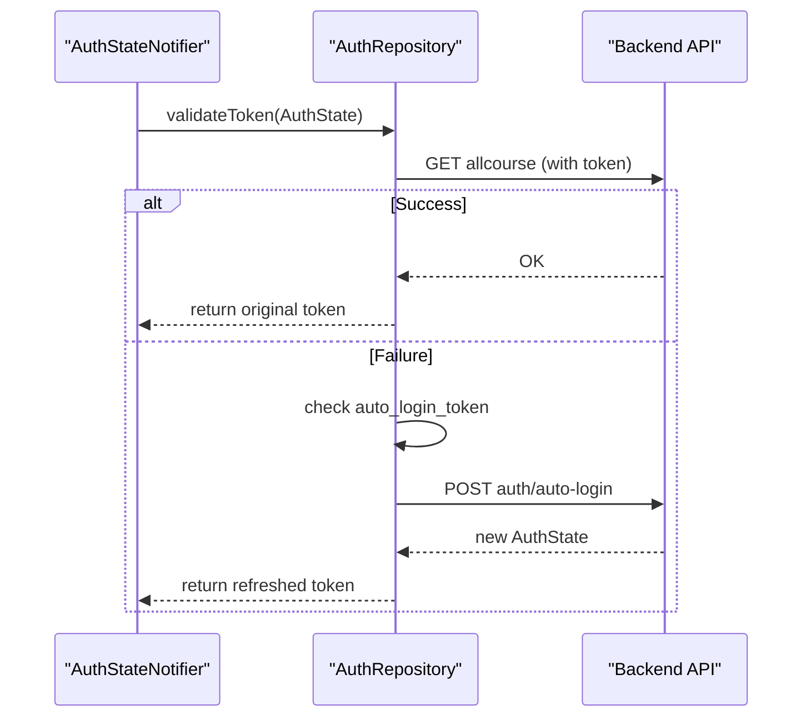
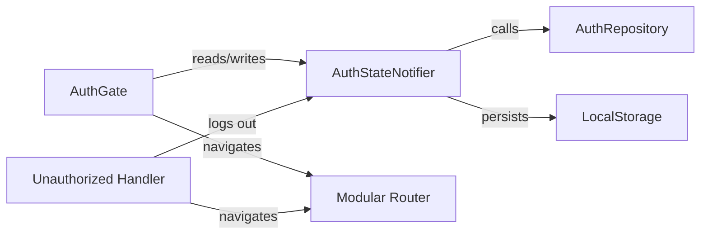

# Authentication Guards

<cite>
**Referenced Files in This Document**
- [auth_gate.dart](file://lib/app/features/authentication/view/auth_gate.dart)
- [auth_state_provider.dart](file://lib/app/features/authentication/app_state/auth_state_provider.dart)
- [auth_repository.dart](file://lib/app/features/authentication/repository/auth_repository.dart)
- [auth_state.dart](file://lib/app/features/authentication/model/auth_state.dart)
- [app_module.dart](file://lib/app_module.dart)
- [unauthorized_handler.dart](file://lib/app/core/views/elements/unauthorized_handler.dart)
</cite>

## Table of Contents
1. [Introduction](#introduction)
2. [Project Structure](#project-structure)
3. [Core Components](#core-components)
4. [Architecture Overview](#architecture-overview)
5. [Detailed Component Analysis](#detailed-component-analysis)
6. [Dependency Analysis](#dependency-analysis)
7. [Performance Considerations](#performance-considerations)
8. [Troubleshooting Guide](#troubleshooting-guide)
9. [Conclusion](#conclusion)

## Introduction
This document explains the authentication guard system that protects routes based on user session state. It focuses on how the AuthGate component intercepts navigation, checks the current authentication status via the auth_state_provider, and redirects users to the login screen when necessary. It also covers token refresh behavior during navigation, logout redirection, and guidance for implementing custom guards around protected routes.

## Project Structure
The authentication guard spans a few key areas:
- Route protection wrapper: AuthGate widget
- Session state management: AuthStateNotifier (Riverpod provider)
- Network operations for login, auto-login, and token validation: AuthRepository
- Data model for session: AuthState and related types
- App routing configuration: AppModule with /auth and /home modules
- Unauthorized handling helper for 401 responses

**Diagram sources**
- [auth_gate.dart:1-69](file://lib/app/features/authentication/view/auth_gate.dart#L1-L69)
- [auth_state_provider.dart:15-203](file://lib/app/features/authentication/app_state/auth_state_provider.dart#L15-L203)
- [auth_repository.dart:1-66](file://lib/app/features/authentication/repository/auth_repository.dart#L1-L66)
- [app_module.dart:1-21](file://lib/app_module.dart#L1-L21)
- [unauthorized_handler.dart:26-67](file://lib/app/core/views/elements/unauthorized_handler.dart#L26-L67)

**Section sources**
- [auth_gate.dart:1-69](file://lib/app/features/authentication/view/auth_gate.dart#L1-L69)
- [auth_state_provider.dart:15-203](file://lib/app/features/authentication/app_state/auth_state_provider.dart#L15-L203)
- [auth_repository.dart:1-66](file://lib/app/features/authentication/repository/auth_repository.dart#L1-L66)
- [app_module.dart:1-21](file://lib/app_module.dart#L1-L21)
- [unauthorized_handler.dart:26-67](file://lib/app/core/views/elements/unauthorized_handler.dart#L26-L67)

## Core Components
- AuthGate: A ConsumerStatefulWidget that wraps protected routes. It initializes connectivity and session state, then decides whether to render the child or redirect to login.
- AuthStateNotifier: A Riverpod StateNotifier that manages the current AuthState (or null if logged out). It persists session data, supports login, logout, profile updates, token refresh, and initialization from storage.
- AuthRepository: Performs network calls for login, auto-login, and token validation.
- AuthState and related models: Represent the authenticated session, including user, token, and profile information.
- AppModule: Declares top-level routes, including the /auth module for sign-in and /home for authenticated content.
- Unauthorized handler: Centralized response to 401 errors, prompting re-authentication and navigating to login.

**Section sources**
- [auth_gate.dart:1-69](file://lib/app/features/authentication/view/auth_gate.dart#L1-L69)
- [auth_state_provider.dart:15-203](file://lib/app/features/authentication/app_state/auth_state_provider.dart#L15-L203)
- [auth_repository.dart:1-66](file://lib/app/features/authentication/repository/auth_repository.dart#L1-L66)
- [auth_state.dart:12-93](file://lib/app/features/authentication/model/auth_state.dart#L12-L93)
- [app_module.dart:1-21](file://lib/app_module.dart#L1-L21)
- [unauthorized_handler.dart:26-67](file://lib/app/core/views/elements/unauthorized_handler.dart#L26-L67)

## Architecture Overview
The guard architecture ensures that only authenticated users can access protected routes. On startup or route entry, AuthGate initializes connectivity and session state. If no valid session exists, it navigates to the login module. When a session is present, the guarded route renders its child. Token expiration during navigation triggers auto-login where possible; otherwise, the unauthorized handler logs the user out and redirects to login.

**Diagram sources**
- [auth_gate.dart:21-69](file://lib/app/features/authentication/view/auth_gate.dart#L21-L69)
- [auth_state_provider.dart:168-201](file://lib/app/features/authentication/app_state/auth_state_provider.dart#L168-L201)
- [app_module.dart:15-19](file://lib/app_module.dart#L15-L19)

## Detailed Component Analysis

### AuthGate: Route Interception and Redirect Logic
AuthGate wraps protected routes and performs:
- Post-frame initialization of connectivity and session state
- Check of current AuthState; if null, navigate to the login route
- Show a loading indicator while checking
- Re-check after state changes to handle dynamic logout scenarios

**Diagram sources**
- [auth_gate.dart:21-69](file://lib/app/features/authentication/view/auth_gate.dart#L21-L69)

**Section sources**
- [auth_gate.dart:1-69](file://lib/app/features/authentication/view/auth_gate.dart#L1-L69)

### AuthStateNotifier: Session Management and Token Refresh
Responsibilities:
- Persist and restore session from local storage
- Validate tokens on app start (online vs offline)
- Provide login/logout/updateProfile
- Auto-refresh expired access tokens using auto_login_token
- Expose initialization completion for consumers

**Diagram sources**
- [auth_state_provider.dart:15-203](file://lib/app/features/authentication/app_state/auth_state_provider.dart#L15-L203)
- [auth_repository.dart:1-66](file://lib/app/features/authentication/repository/auth_repository.dart#L1-L66)

**Section sources**
- [auth_state_provider.dart:15-203](file://lib/app/features/authentication/app_state/auth_state_provider.dart#L15-L203)
- [auth_repository.dart:1-66](file://lib/app/features/authentication/repository/auth_repository.dart#L1-L66)

### AuthRepository: Login, Auto-Login, and Validation
- loginWithEmail: Authenticates user and returns an AuthState
- autoLogin: Exchanges auto_login_token for a fresh access token
- validateToken: Validates current token; falls back to auto-login if needed

**Diagram sources**
- [auth_repository.dart:16-64](file://lib/app/features/authentication/repository/auth_repository.dart#L16-L64)

**Section sources**
- [auth_repository.dart:1-66](file://lib/app/features/authentication/repository/auth_repository.dart#L1-L66)

### Models: AuthState and User Profile
- AuthState encapsulates user, role, token, profile, and group info
- UserProfile includes avatar URL computation and update payloads
- These models are persisted to local storage and used across the app

**Section sources**
- [auth_state.dart:12-93](file://lib/app/features/authentication/model/auth_state.dart#L12-L93)
- [auth_state.dart:382-672](file://lib/app/features/authentication/model/auth_state.dart#L382-L672)

### Routing Integration: AppModule
- Defines /auth and /home modules
- AuthGate typically wraps routes under /home to enforce authentication

**Section sources**
- [app_module.dart:1-21](file://lib/app_module.dart#L1-L21)

## Dependency Analysis
Key dependencies and relationships:
- AuthGate depends on Modular router and Riverpod providers to read/write session state
- AuthStateNotifier depends on AuthRepository for network operations and LocalStorage for persistence
- Unauthorized handler depends on AuthStateNotifier and Modular router to log out and redirect

**Diagram sources**
- [auth_gate.dart:1-69](file://lib/app/features/authentication/view/auth_gate.dart#L1-L69)
- [auth_state_provider.dart:15-203](file://lib/app/features/authentication/app_state/auth_state_provider.dart#L15-L203)
- [auth_repository.dart:1-66](file://lib/app/features/authentication/repository/auth_repository.dart#L1-L66)
- [unauthorized_handler.dart:26-67](file://lib/app/core/views/elements/unauthorized_handler.dart#L26-L67)

**Section sources**
- [auth_gate.dart:1-69](file://lib/app/features/authentication/view/auth_gate.dart#L1-L69)
- [auth_state_provider.dart:15-203](file://lib/app/features/authentication/app_state/auth_state_provider.dart#L15-L203)
- [auth_repository.dart:1-66](file://lib/app/features/authentication/repository/auth_repository.dart#L1-L66)
- [unauthorized_handler.dart:26-67](file://lib/app/core/views/elements/unauthorized_handler.dart#L26-L67)

## Performance Considerations
- De-duplicated token refresh: Concurrent 401s share a single refresh attempt to avoid redundant network calls
- Offline-first initialization: On startup, if offline, the cached session is used immediately and validated later when connected
- Minimal rebuilds: AuthGate shows a loading indicator only while checking; once initialized, it renders the child without unnecessary rebuilds
- Avoid redundant profile updates: Profile updates compare fields to prevent infinite rebuild loops

[No sources needed since this section provides general guidance]

## Troubleshooting Guide
Common scenarios and resolutions:
- Auto-login after authentication: After successful login, ensure session_data is persisted and AuthStateNotifier.state is set. Protected routes will render their children once initialization completes.
- Logout redirection: Call logout to clear session_data and reset state. The unauthorized handler automatically logs out and navigates to /auth on 401 responses.
- Token expiration during navigation: If a request fails with 401, the unauthorized handler clears the session and redirects to login. For mid-session expiry, auto-login attempts to refresh using auto_login_token; if that fails, the user is redirected to login.
- Connectivity issues: AuthGate initializes connectivity; failures are non-fatal. If offline, the cached session is used until connectivity resumes.

**Section sources**
- [auth_gate.dart:21-69](file://lib/app/features/authentication/view/auth_gate.dart#L21-L69)
- [auth_state_provider.dart:152-201](file://lib/app/features/authentication/app_state/auth_state_provider.dart#L152-L201)
- [auth_repository.dart:29-64](file://lib/app/features/authentication/repository/auth_repository.dart#L29-L64)
- [unauthorized_handler.dart:26-67](file://lib/app/core/views/elements/unauthorized_handler.dart#L26-L67)

## Conclusion
The authentication guard system centers on AuthGate and AuthStateNotifier to protect routes based on session state. AuthGate ensures users are authenticated before accessing protected content, while AuthStateNotifier manages login, logout, token refresh, and persistence. Unauthorized responses trigger a consistent flow to log out and redirect to login. By wrapping protected routes with AuthGate and leveraging the provided utilities, you can implement robust authentication guards tailored to your application’s needs.

[No sources needed since this section summarizes without analyzing specific files]