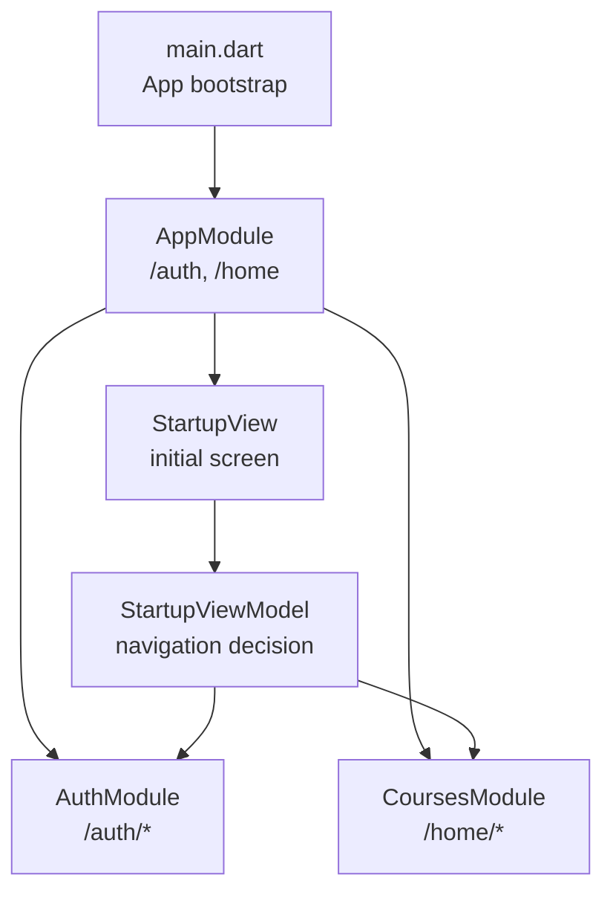
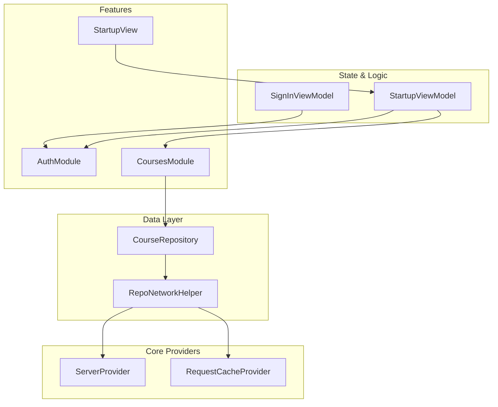
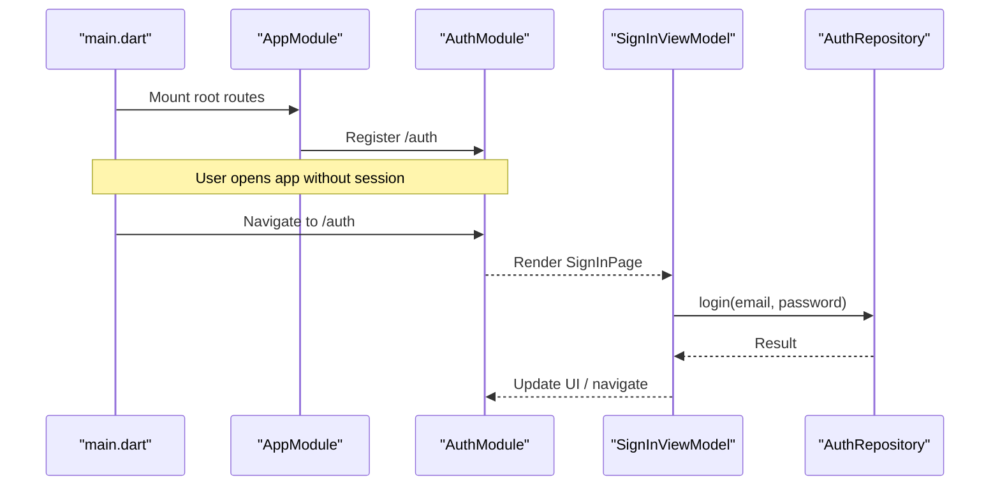
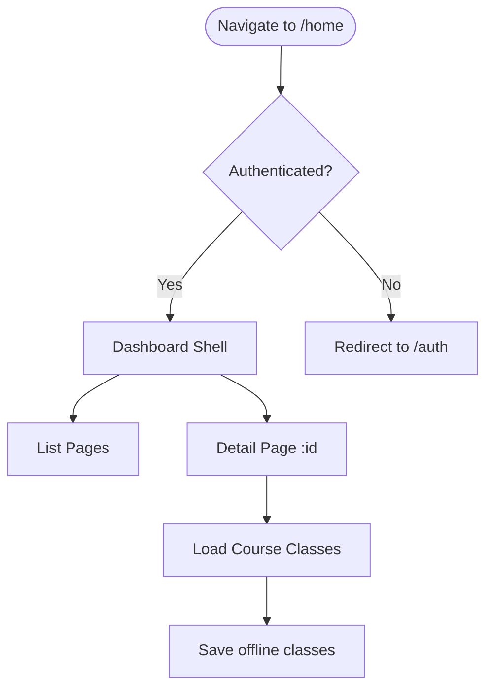
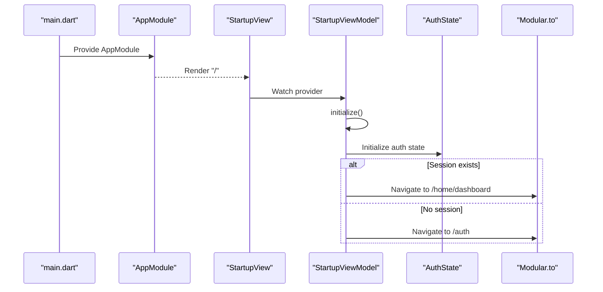
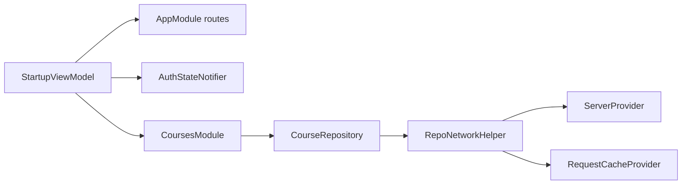

# Feature Modules

<cite>
**Referenced Files in This Document**
- [main.dart](file://lib/main.dart)
- [app_module.dart](file://lib/app_module.dart)
- [auth_module.dart](file://lib/app/features/authentication/module/auth_module.dart)
- [courses_module.dart](file://lib/app/features/courses/module/courses_module.dart)
- [startup_view.dart](file://lib/app/features/startup/view/startup_view.dart)
- [startup_view_model.dart](file://lib/app/features/startup/view_model/startup_view_model.dart)
- [signin_viewmodel.dart](file://lib/app/features/authentication/viewmodel/signin_viewmodel.dart)
- [course_repository.dart](file://lib/app/features/courses/repository/course_repository.dart)
- [repo_network_helper.dart](file://lib/app/core/logic/repository/repo_network_helper.dart)
- [server_provider.dart](file://lib/app/core/provider/server_provider.dart)
- [request_cache_provider.dart](file://lib/app/core/provider/request_cache_provider.dart)
- [reconnect_refresh.dart](file://lib/app/core/provider/reconnect_refresh.dart)
- [pubspec.yaml](file://pubspec.yaml)
</cite>

## Table of Contents
1. Introduction
2. Project Structure
3. Core Components
4. Architecture Overview
5. Detailed Component Analysis
6. Dependency Analysis
7. Performance Considerations
8. Troubleshooting Guide
9. Conclusion
10. Appendices

## Introduction
This document explains the feature-based modular architecture used in Leadership Edge Live LMS. The app is organized into isolated feature modules (authentication, courses, startup), each owning its routes, dependencies, and lifecycle. The root AppModule wires these features together using Flutter Modular for routing and Riverpod for dependency injection. This pattern improves isolation, testability, and maintainability by confining concerns to well-defined boundaries while enabling controlled communication between modules.

## Project Structure
At a high level:
- lib/main.dart bootstraps the app, initializes services, and mounts the Modular router with the root AppModule.
- lib/app_module.dart defines top-level routes and registers feature modules under /auth and /home.
- Each feature lives under lib/app/features/<feature>:
  - authentication: module, view, viewmodel, repository, and app state
  - courses: module, views, viewmodels, repositories, models
  - startup: view and viewmodel that orchestrate initial navigation
- Shared infrastructure resides under lib/app/core (providers, logic helpers, models, utilities).

**Diagram sources**
- [main.dart:16-37](file://lib/main.dart#L16-L37)
- [app_module.dart:7-19](file://lib/app_module.dart#L7-L19)
- [startup_view.dart:7-27](file://lib/app/features/startup/view/startup_view.dart#L7-L27)
- [startup_view_model.dart:9-38](file://lib/app/features/startup/view_model/startup_view_model.dart#L9-L38)

**Section sources**
- [main.dart:16-37](file://lib/main.dart#L16-L37)
- [app_module.dart:7-19](file://lib/app_module.dart#L7-L19)

## Core Components
- Root AppModule: Declares top-level routes and registers AuthModule and CoursesModule. It also exposes static route constants for cross-module navigation.
- AuthModule: Owns authentication routes and renders the sign-in page.
- CoursesModule: Owns all course-related routes, wraps protected screens with an auth gate, and provides a helper to construct absolute paths within its namespace.
- Startup flow: StartupView shows a loading indicator; StartupViewModel initializes connectivity and authentication state, then navigates to either the authenticated dashboard or the sign-in screen.

Key responsibilities:
- Routing isolation: Each feature controls its own routes via Module classes.
- Dependency injection: Riverpod providers are used inside features and shared core components.
- Lifecycle management: StartupViewModel orchestrates initialization and navigation decisions.

**Section sources**
- [app_module.dart:7-19](file://lib/app_module.dart#L7-L19)
- [auth_module.dart:5-10](file://lib/app/features/authentication/module/auth_module.dart#L5-L10)
- [courses_module.dart:20-69](file://lib/app/features/courses/module/courses_module.dart#L20-L69)
- [startup_view.dart:7-27](file://lib/app/features/startup/view/startup_view.dart#L7-L27)
- [startup_view_model.dart:9-38](file://lib/app/features/startup/view_model/startup_view_model.dart#L9-L38)

## Architecture Overview
The app uses a layered approach:
- Presentation: Views and widgets within each feature module.
- State and logic: ViewModels and Riverpod providers per feature.
- Data access: Repositories that use shared networking helpers and providers.
- Cross-cutting: Server configuration, caching, and connectivity managed in core providers.

**Diagram sources**
- [courses_module.dart:20-69](file://lib/app/features/courses/module/courses_module.dart#L20-L69)
- [auth_module.dart:5-10](file://lib/app/features/authentication/module/auth_module.dart#L5-L10)
- [startup_view_model.dart:9-38](file://lib/app/features/startup/view_model/startup_view_model.dart#L9-L38)
- [signin_viewmodel.dart:9-49](file://lib/app/features/authentication/viewmodel/signin_viewmodel.dart#L9-L49)
- [course_repository.dart:7-21](file://lib/app/features/courses/repository/course_repository.dart#L7-L21)
- [repo_network_helper.dart:31-43](file://lib/app/core/logic/repository/repo_network_helper.dart#L31-L43)
- [server_provider.dart:8-25](file://lib/app/core/provider/server_provider.dart#L8-L25)
- [request_cache_provider.dart:40-83](file://lib/app/core/provider/request_cache_provider.dart#L40-L83)

## Detailed Component Analysis

### Authentication Module
- Route definition: AuthModule maps "/" to the sign-in page.
- Dependencies: SignInViewModel depends on AuthRepository and AuthStateNotifier to perform login.
- Navigation integration: StartupViewModel navigates to this module when no user session exists.

**Diagram sources**
- [app_module.dart:15-19](file://lib/app_module.dart#L15-L19)
- [auth_module.dart:5-10](file://lib/app/features/authentication/module/auth_module.dart#L5-L10)
- [signin_viewmodel.dart:9-49](file://lib/app/features/authentication/viewmodel/signin_viewmodel.dart#L9-L49)

**Section sources**
- [auth_module.dart:5-10](file://lib/app/features/authentication/module/auth_module.dart#L5-L10)
- [signin_viewmodel.dart:9-49](file://lib/app/features/authentication/viewmodel/signin_viewmodel.dart#L9-L49)

### Courses Module
- Route definition: CoursesModule declares multiple routes (dashboard, detail/:id, lists) and constructs absolute paths via a helper that composes with AppModule.home.
- Protection: Most routes wrap content with an auth gate to ensure only authenticated users can access them.
- Data layer: CourseRepository uses shared networking helpers and server configuration to fetch data.

**Diagram sources**
- [courses_module.dart:20-69](file://lib/app/features/courses/module/courses_module.dart#L20-L69)
- [course_repository.dart:7-21](file://lib/app/features/courses/repository/course_repository.dart#L7-L21)

**Section sources**
- [courses_module.dart:20-69](file://lib/app/features/courses/module/courses_module.dart#L20-L69)
- [course_repository.dart:7-21](file://lib/app/features/courses/repository/course_repository.dart#L7-L21)

### Startup Flow and Navigation
- StartupView displays a loading indicator and observes the StartupViewModel.
- StartupViewModel initializes connectivity and authentication state, then navigates to either the authenticated dashboard or the sign-in screen.

**Diagram sources**
- [main.dart:16-37](file://lib/main.dart#L16-L37)
- [startup_view.dart:7-27](file://lib/app/features/startup/view/startup_view.dart#L7-L27)
- [startup_view_model.dart:9-38](file://lib/app/features/startup/view_model/startup_view_model.dart#L9-L38)

**Section sources**
- [startup_view.dart:7-27](file://lib/app/features/startup/view/startup_view.dart#L7-L27)
- [startup_view_model.dart:9-38](file://lib/app/features/startup/view_model/startup_view_model.dart#L9-L38)

### Creating a New Feature Module (Step-by-Step)
1. Create a new folder under lib/app/features/<your_feature>.
2. Add a module file defining routes and any local bindings.
3. Register the module in AppModule.routes by adding r.module(...) with a path constant.
4. If needed, add a route constant in AppModule for cross-module navigation.
5. Use Riverpod providers inside the feature for state and dependencies.
6. For protected routes, wrap views with an auth gate where appropriate.
7. Test the module independently using its own providers and mock repositories if necessary.

[No sources needed since this section provides general guidance]

### Establishing Communication Between Modules
- Use AppModule route constants to navigate from one module to another (e.g., from startup to auth or courses).
- Share state via Riverpod providers at the app scope when necessary (e.g., authentication state).
- Avoid direct imports between feature modules; prefer routing and shared providers for loose coupling.

**Section sources**
- [app_module.dart:7-19](file://lib/app_module.dart#L7-L19)
- [startup_view_model.dart:9-38](file://lib/app/features/startup/view_model/startup_view_model.dart#L9-L38)

## Dependency Analysis
Feature modules depend on shared core providers for networking, caching, and configuration. Repositories encapsulate API calls and leverage helpers for consistent behavior.

**Diagram sources**
- [startup_view_model.dart:9-38](file://lib/app/features/startup/view_model/startup_view_model.dart#L9-L38)
- [courses_module.dart:20-69](file://lib/app/features/courses/module/courses_module.dart#L20-L69)
- [course_repository.dart:7-21](file://lib/app/features/courses/repository/course_repository.dart#L7-L21)
- [repo_network_helper.dart:31-43](file://lib/app/core/logic/repository/repo_network_helper.dart#L31-L43)
- [server_provider.dart:8-25](file://lib/app/core/provider/server_provider.dart#L8-L25)
- [request_cache_provider.dart:40-83](file://lib/app/core/provider/request_cache_provider.dart#L40-L83)

**Section sources**
- [pubspec.yaml:30-42](file://pubspec.yaml#L30-L42)
- [server_provider.dart:8-25](file://lib/app/core/provider/server_provider.dart#L8-L25)

## Performance Considerations
- Use autoDispose Riverpod providers for short-lived state to avoid memory leaks.
- Prefer lazy loading of heavy features behind routes to reduce startup time.
- Leverage request caching and offline mode through RepoNetworkConfig to minimize network calls.
- Invalidate only existing providers on connectivity changes to avoid unnecessary rebuilds.

[No sources needed since this section provides general guidance]

## Troubleshooting Guide
- Connectivity issues: Ensure InternetConnectionProvider is initialized during startup; failures are non-fatal and should proceed offline.
- Authentication errors: If auth initialization fails, treat as logged-out and redirect to /auth.
- Offline sync: RequestCacheProvider queues store requests and retries on reconnection; verify cached requests are cleared after successful sync.
- Provider invalidation: On reconnect, invalidate relevant providers safely by checking existence before invalidating to prevent mid-teardown crashes.

**Section sources**
- [startup_view_model.dart:20-30](file://lib/app/features/startup/view_model/startup_view_model.dart#L20-L30)
- [request_cache_provider.dart:63-78](file://lib/app/core/provider/request_cache_provider.dart#L63-L78)
- [reconnect_refresh.dart:53-77](file://lib/app/core/provider/reconnect_refresh.dart#L53-L77)

## Conclusion
Leadership Edge Live LMS uses a clean feature-based modular architecture with Flutter Modular for routing and Riverpod for dependency injection. Each feature owns its routes, state, and data access, while shared core services provide consistent networking, caching, and configuration. This design enables strong isolation, easier testing, and scalable growth as new features are added.

## Appendices

### Module Isolation Benefits
- Encapsulation: Features manage their own routes, state, and data without leaking implementation details.
- Testability: Each module can be tested in isolation with mocked providers and repositories.
- Maintainability: Changes in one feature rarely impact others due to clear boundaries.

[No sources needed since this section provides general guidance]

### Testing Strategies for Modular Components
- Unit tests for ViewModels: Mock repositories and providers to validate business logic.
- Widget tests for Views: Build feature-specific widgets with required providers and assert interactions.
- Integration tests for flows: Use the app’s router to navigate through feature modules and verify end-to-end scenarios.

[No sources needed since this section provides general guidance]