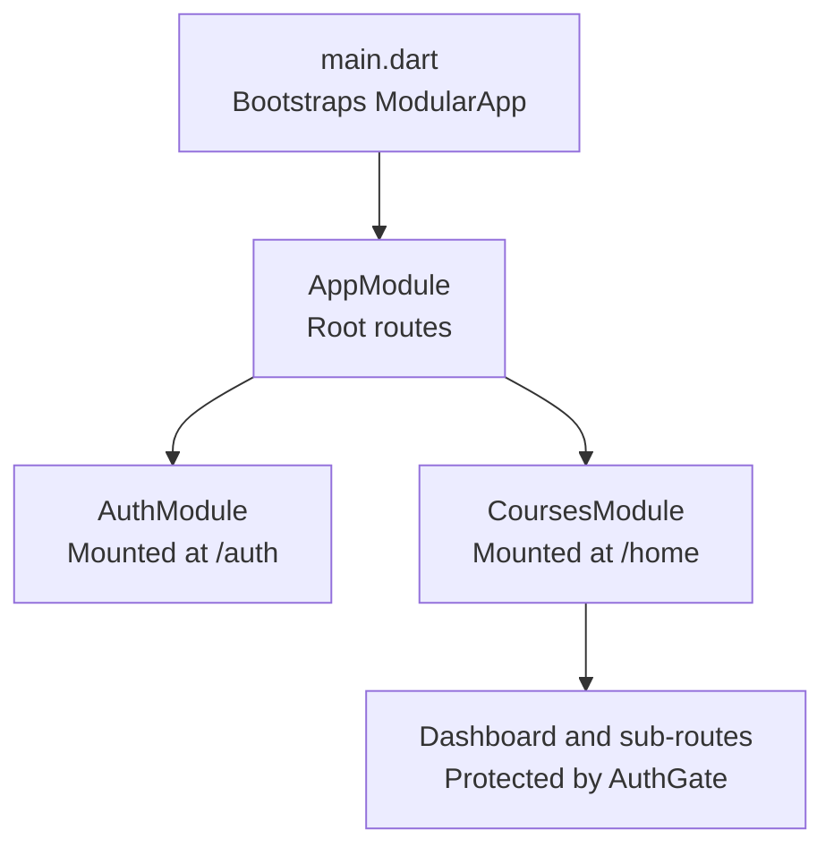
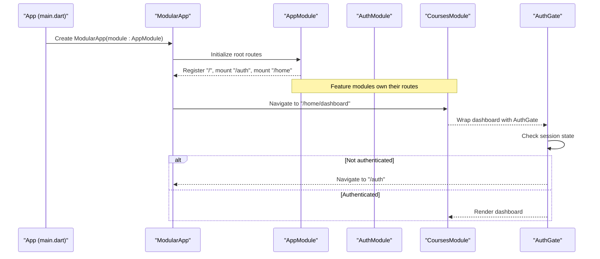
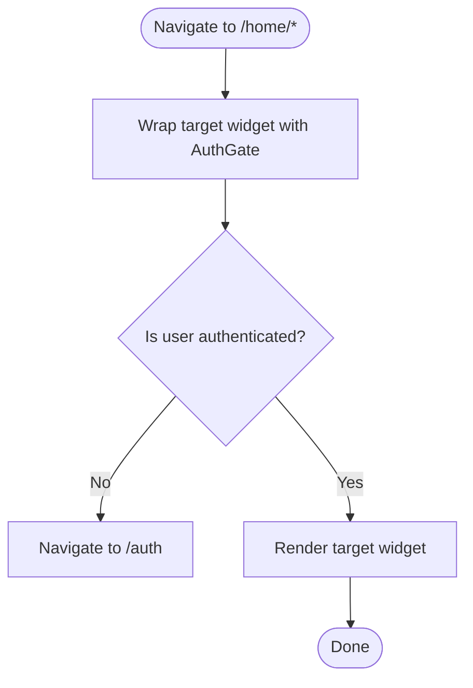
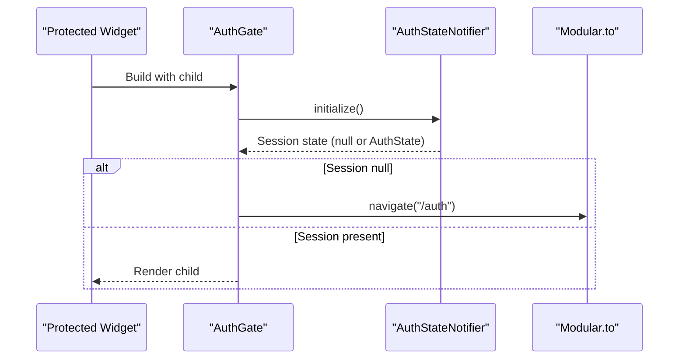
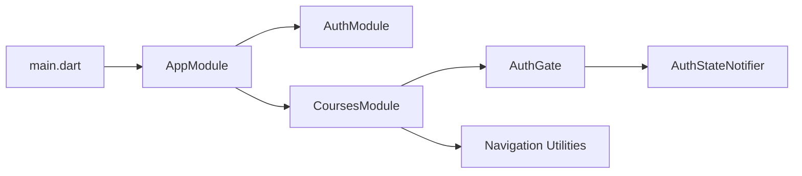

# Modular Routing System

<cite>
**Referenced Files in This Document**
- [main.dart](file://lib/main.dart)
- [app_module.dart](file://lib/app_module.dart)
- [auth_module.dart](file://lib/app/features/authentication/module/auth_module.dart)
- [courses_module.dart](file://lib/app/features/courses/module/courses_module.dart)
- [auth_gate.dart](file://lib/app/features/authentication/view/auth_gate.dart)
- [auth_state_provider.dart](file://lib/app/features/authentication/app_state/auth_state_provider.dart)
- [safe_pop.dart](file://lib/app/core/views/elements/safe_pop.dart)
- [tablet_nav_bar.dart](file://lib/app/core/views/elements/tablet_nav_bar.dart)
- [startup_view.dart](file://lib/app/features/startup/view/startup_view.dart)
- [unauthorized_handler.dart](file://lib/app/core/views/elements/unauthorized_handler.dart)
</cite>

## Table of Contents
1. [Introduction](#introduction)
2. [Project Structure](#project-structure)
3. [Core Components](#core-components)
4. [Architecture Overview](#architecture-overview)
5. [Detailed Component Analysis](#detailed-component-analysis)
6. [Dependency Analysis](#dependency-analysis)
7. [Performance Considerations](#performance-considerations)
8. [Troubleshooting Guide](#troubleshooting-guide)
9. [Conclusion](#conclusion)
10. [Appendices](#appendices)

## Introduction
This document explains the Flutter Modular routing system used in Leadership Edge Live LMS. It covers how the root module wires feature modules, how routes are registered per feature, and how an authentication gate protects protected screens based on user session state. It also describes navigation patterns, parameter passing, deep linking considerations, and debugging tips for routing issues.

## Project Structure
At app startup, the application initializes localization and media, then boots a ModularApp that uses AppModule as its root. The root module registers:
- A startup route at "/"
- An authentication module mounted under "/auth"
- A courses module mounted under "/home"

The courses module defines many child routes (dashboard, course lists, progress pages, badges, etc.) and exposes a helper to construct full paths under "/home". Protected routes wrap their widgets with an authentication gate that ensures a valid session before rendering content.

**Diagram sources**
- [main.dart:24-37](file://lib/main.dart#L24-L37)
- [app_module.dart:7-19](file://lib/app_module.dart#L7-L19)
- [courses_module.dart:20-68](file://lib/app/features/courses/module/courses_module.dart#L20-L68)

**Section sources**
- [main.dart:16-37](file://lib/main.dart#L16-L37)
- [app_module.dart:7-19](file://lib/app_module.dart#L7-L19)

## Core Components
- Root module (AppModule): Declares top-level routes and mounts feature modules.
- Authentication module (AuthModule): Defines sign-in flow routes.
- Courses module (CoursesModule): Declares dashboard and feature routes; provides path construction helpers.
- Authentication gate (AuthGate): Guards protected routes by checking session state and redirecting to login when needed.
- Navigation utilities: Safe pop and reset helpers to keep declarative and imperative navigation stacks consistent.

Key responsibilities:
- Route registration is centralized per feature via Module classes.
- Session checks are enforced via AuthGate around protected widgets.
- Path construction avoids hard-coded strings by using module constants and a helper.

**Section sources**
- [app_module.dart:7-19](file://lib/app_module.dart#L7-L19)
- [auth_module.dart:5-10](file://lib/app/features/authentication/module/auth_module.dart#L5-L10)
- [courses_module.dart:20-68](file://lib/app/features/courses/module/courses_module.dart#L20-L68)
- [auth_gate.dart:8-68](file://lib/app/features/authentication/view/auth_gate.dart#L8-L68)
- [safe_pop.dart:11-28](file://lib/app/core/views/elements/safe_pop.dart#L11-L28)

## Architecture Overview
The routing architecture follows a modular pattern:
- AppModule mounts feature modules under distinct prefixes.
- Each feature module owns its routes and can encapsulate dependencies and lifecycle.
- Protected routes use AuthGate to enforce authentication before rendering.
- Navigation uses Modular.to for declarative routing and Navigator for modal/imperative flows where appropriate.

**Diagram sources**
- [main.dart:24-37](file://lib/main.dart#L24-L37)
- [app_module.dart:14-19](file://lib/app_module.dart#L14-L19)
- [courses_module.dart:40-68](file://lib/app/features/courses/module/courses_module.dart#L40-L68)
- [auth_gate.dart:27-68](file://lib/app/features/authentication/view/auth_gate.dart#L27-L68)

## Detailed Component Analysis

### AppModule: Root Configuration and Route Registration
- Registers a startup screen at "/"
- Mounts AuthModule at "/auth"
- Mounts CoursesModule at "/home"
- Provides static route constants for easy reference across the app

This centralizes entry points and keeps feature boundaries clear.

**Section sources**
- [app_module.dart:7-19](file://lib/app_module.dart#L7-L19)

### AuthModule: Authentication Routes
- Exposes a single child route at "/" which renders the sign-in page
- Mounted under "/auth" by AppModule, making the full path "/auth"

This isolates authentication UI and logic within its own module.

**Section sources**
- [auth_module.dart:5-10](file://lib/app/features/authentication/module/auth_module.dart#L5-L10)

### CoursesModule: Feature Routes and Path Construction
- Defines constants for all feature routes under "/home"
- Provides a helper to construct absolute paths under "/home"
- Wraps protected routes with AuthGate to ensure session validity
- Supports dynamic parameters (e.g., course detail by id)

**Diagram sources**
- [courses_module.dart:20-68](file://lib/app/features/courses/module/courses_module.dart#L20-L68)
- [auth_gate.dart:27-68](file://lib/app/features/authentication/view/auth_gate.dart#L27-L68)

**Section sources**
- [courses_module.dart:20-68](file://lib/app/features/courses/module/courses_module.dart#L20-L68)

### AuthGate: Authentication Gate Mechanism
- On first frame, initializes connectivity and auth state
- If no active session, navigates to "/auth"
- While checking or if unauthenticated, shows a loading indicator
- Once authenticated, renders the wrapped child

**Diagram sources**
- [auth_gate.dart:17-68](file://lib/app/features/authentication/view/auth_gate.dart#L17-L68)
- [auth_state_provider.dart:168-184](file://lib/app/features/authentication/app_state/auth_state_provider.dart#L168-L184)

**Section sources**
- [auth_gate.dart:8-68](file://lib/app/features/authentication/view/auth_gate.dart#L8-L68)
- [auth_state_provider.dart:168-184](file://lib/app/features/authentication/app_state/auth_state_provider.dart#L168-L184)

### Navigation Utilities: Safe Pop and Reset
- safePop: Safely pops the navigator stack; if nothing to pop, navigates to the dashboard to avoid a black screen
- resetToModularRoot: Pops imperative pages so subsequent declarative navigation works reliably

These utilities help maintain consistency between Navigator and Modular routing stacks.

**Section sources**
- [safe_pop.dart:11-28](file://lib/app/core/views/elements/safe_pop.dart#L11-L28)

### Tablet Navigation Integration
- Uses resetToModularRoot before navigating to ensure clean state
- Navigates to constructed routes under "/home" via Modular.to

**Section sources**
- [tablet_nav_bar.dart:128-133](file://lib/app/core/views/elements/tablet_nav_bar.dart#L128-L133)

### Startup Flow
- The root "/" route renders a startup view that initializes necessary services and then transitions to the appropriate destination once ready.

**Section sources**
- [startup_view.dart:7-27](file://lib/app/features/startup/view/startup_view.dart#L7-L27)

## Dependency Analysis
- main.dart depends on flutter_modular to wire the app shell and router configuration.
- AppModule depends on feature modules to register routes.
- CoursesModule depends on AuthGate to protect routes and on shared views.
- AuthGate depends on Riverpod providers for connectivity and auth state.
- Unauthorized handling utility triggers logout and redirects to login on session expiry.

**Diagram sources**
- [main.dart:24-37](file://lib/main.dart#L24-L37)
- [app_module.dart:14-19](file://lib/app_module.dart#L14-L19)
- [courses_module.dart:40-68](file://lib/app/features/courses/module/courses_module.dart#L40-L68)
- [auth_gate.dart:27-68](file://lib/app/features/authentication/view/auth_gate.dart#L27-L68)
- [auth_state_provider.dart:168-184](file://lib/app/features/authentication/app_state/auth_state_provider.dart#L168-L184)

**Section sources**
- [main.dart:24-37](file://lib/main.dart#L24-L37)
- [app_module.dart:14-19](file://lib/app_module.dart#L14-L19)
- [courses_module.dart:40-68](file://lib/app/features/courses/module/courses_module.dart#L40-L68)
- [auth_gate.dart:27-68](file://lib/app/features/authentication/view/auth_gate.dart#L27-L68)
- [auth_state_provider.dart:168-184](file://lib/app/features/authentication/app_state/auth_state_provider.dart#L168-L184)

## Performance Considerations
- Keep route guards lightweight: AuthGate performs minimal work (connectivity and auth initialization) and defers heavy operations to providers.
- Avoid unnecessary rebuilds by reading state via providers rather than recomputing inside builds.
- Use constructed route helpers to prevent string duplication and reduce maintenance overhead.
- Be mindful of mixing imperative Navigator pushes with declarative Modular routes; use reset helpers to keep stacks consistent.

[No sources needed since this section provides general guidance]

## Troubleshooting Guide
Common routing issues and resolutions:
- Black screen after back press: Use safePop to ensure there is always a valid route in the stack; otherwise it falls back to the dashboard.
- Navigation not working while modal pages are open: Call resetToModularRoot before switching routes to clear imperative pages from the stack.
- Session expired mid-flow: Use the unauthorized handler to show a friendly message, log out, and navigate to the login screen.
- Deep links landing on protected screens: Ensure AuthGate runs before rendering; if the session is invalid, it will redirect to login automatically.

Operational references:
- Safe pop behavior and fallback to dashboard
- Resetting to modular root before navigation
- Unauthorized handling and redirect to login

**Section sources**
- [safe_pop.dart:11-28](file://lib/app/core/views/elements/safe_pop.dart#L11-L28)
- [unauthorized_handler.dart:26-67](file://lib/app/core/views/elements/unauthorized_handler.dart#L26-L67)

## Conclusion
The LMS uses a clean, modular routing setup with Flutter Modular. AppModule mounts feature modules, each owning its routes and dependencies. AuthGate enforces authentication consistently across protected features. Navigation utilities maintain stack integrity when mixing imperative and declarative navigation. This design supports scalability, testability, and clear separation of concerns.

[No sources needed since this section summarizes without analyzing specific files]

## Appendices

### Creating a New Feature Module
Steps:
- Create a new Module class under a feature folder and define routes using RouteManager.
- Mount the module in AppModule under a unique prefix.
- Wrap protected routes with AuthGate to enforce authentication.
- Use the module’s path constants or a helper to construct full paths.

References:
- Module mounting in root
- Example of a feature module with multiple routes and path helper

**Section sources**
- [app_module.dart:14-19](file://lib/app_module.dart#L14-L19)
- [courses_module.dart:20-68](file://lib/app/features/courses/module/courses_module.dart#L20-L68)

### Implementing Route Guards
- Wrap any route that requires authentication with AuthGate.
- Ensure the underlying provider initializes correctly so the gate can determine session state.
- For global session expiration handling, integrate with the unauthorized handler to log out and redirect.

**Section sources**
- [auth_gate.dart:27-68](file://lib/app/features/authentication/view/auth_gate.dart#L27-L68)
- [unauthorized_handler.dart:26-67](file://lib/app/core/views/elements/unauthorized_handler.dart#L26-L67)

### Handling Deep Linking
- Ensure your target route is registered in the appropriate module.
- If the route is protected, AuthGate will validate the session and redirect to login if needed.
- Use safePop and resetToModularRoot to handle edge cases where deep links land directly on protected screens.

**Section sources**
- [courses_module.dart:40-68](file://lib/app/features/courses/module/courses_module.dart#L40-L68)
- [auth_gate.dart:27-68](file://lib/app/features/authentication/view/auth_gate.dart#L27-L68)
- [safe_pop.dart:11-28](file://lib/app/core/views/elements/safe_pop.dart#L11-L28)

### Passing Parameters Between Routes
- Use route parameters defined in the route definition (for example, a dynamic id segment).
- Access parameters through the current route’s arguments provided by the framework.

**Section sources**
- [courses_module.dart:61-67](file://lib/app/features/courses/module/courses_module.dart#L61-L67)