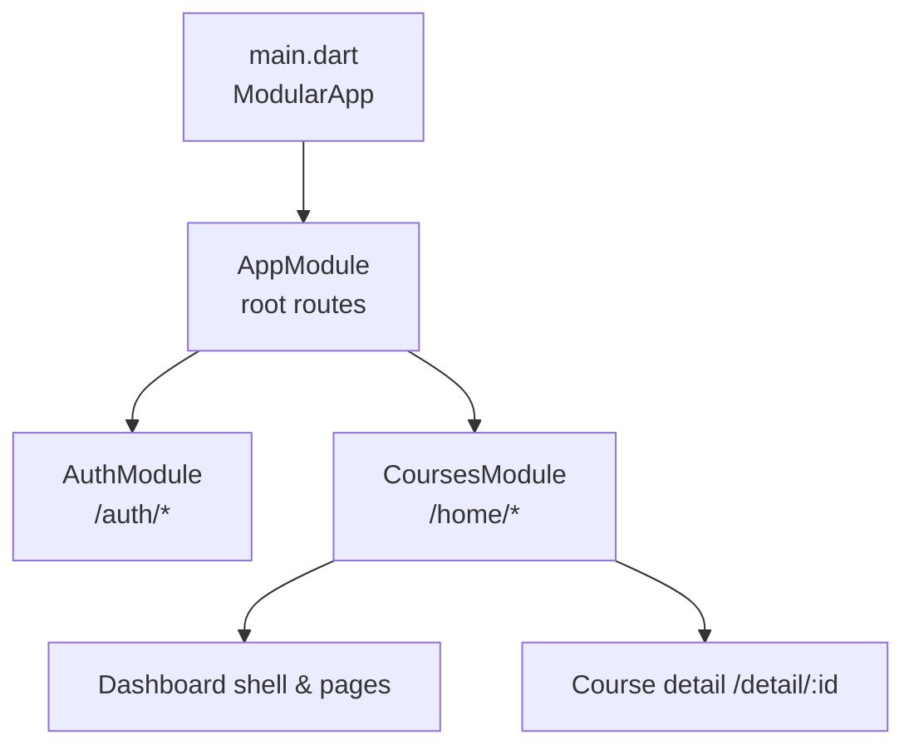
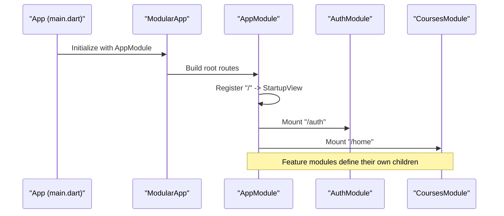
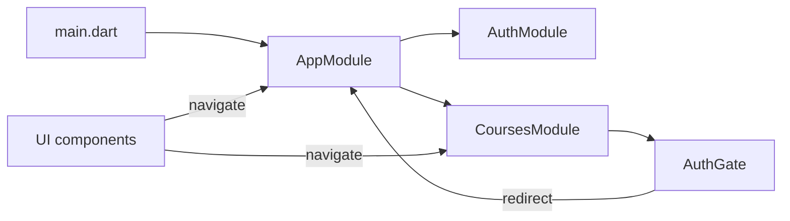

# Route Configuration

<cite>
**Referenced Files in This Document**
- [app_module.dart](file://lib/app_module.dart)
- [main.dart](file://lib/main.dart)
- [auth_module.dart](file://lib/app/features/authentication/module/auth_module.dart)
- [courses_module.dart](file://lib/app/features/courses/module/courses_module.dart)
- [auth_gate.dart](file://lib/app/features/authentication/view/auth_gate.dart)
- [safe_pop.dart](file://lib/app/core/views/elements/safe_pop.dart)
- [tablet_nav_bar.dart](file://lib/app/core/views/elements/tablet_nav_bar.dart)
</cite>

## Table of Contents
1. [Introduction](#introduction)
2. [Project Structure](#project-structure)
3. [Core Components](#core-components)
4. [Architecture Overview](#architecture-overview)
5. [Detailed Component Analysis](#detailed-component-analysis)
6. [Dependency Analysis](#dependency-analysis)
7. [Performance Considerations](#performance-considerations)
8. [Troubleshooting Guide](#troubleshooting-guide)
9. [Conclusion](#conclusion)
10. [Appendices](#appendices)

## Introduction
This document explains the Flutter Modular route configuration system used in Leadership Edge Live LMS. It focuses on how AppModule acts as the root module that registers top-level routes and delegates to feature-specific modules, how direct child routes and nested feature modules are registered, and how static route constants are defined and consumed across the app. It also provides guidance for adding new routes, configuring parameters, building nested hierarchies, and aligning with modular architecture best practices.

## Project Structure
At a high level:
- The application bootstraps with a ModularApp that uses AppModule as its root module.
- AppModule defines top-level routes and mounts feature modules under dedicated path prefixes.
- Feature modules encapsulate their own sub-routes and expose static constants for internal navigation.
- Navigation is performed via Modular.to.navigate using these centralized constants.

**Diagram sources**
- [main.dart:24-37](file://lib/main.dart#L24-L37)
- [app_module.dart:7-19](file://lib/app_module.dart#L7-L19)
- [auth_module.dart:5-9](file://lib/app/features/authentication/module/auth_module.dart#L5-L9)
- [courses_module.dart:20-68](file://lib/app/features/courses/module/courses_module.dart#L20-L68)

**Section sources**
- [main.dart:24-37](file://lib/main.dart#L24-L37)
- [app_module.dart:7-19](file://lib/app_module.dart#L7-L19)

## Core Components
- AppModule: Root module defining top-level paths and mounting feature modules.
- AuthModule: Feature module for authentication screens under /auth.
- CoursesModule: Feature module for course-related screens under /home, including dashboard, lists, and parameterized detail routes.
- AuthGate: Widget that guards protected routes and redirects unauthenticated users to login.
- Navigation helpers: Utilities that use Modular.to.navigate and safe back behavior.

Key responsibilities:
- Centralize route constants to avoid string duplication and ensure consistent paths.
- Encapsulate per-feature routing inside feature modules for cohesion.
- Protect sensitive areas with an auth gate before rendering content.

**Section sources**
- [app_module.dart:7-19](file://lib/app_module.dart#L7-L19)
- [auth_module.dart:5-9](file://lib/app/features/authentication/module/auth_module.dart#L5-L9)
- [courses_module.dart:20-68](file://lib/app/features/courses/module/courses_module.dart#L20-L68)
- [auth_gate.dart:17-67](file://lib/app/features/authentication/view/auth_gate.dart#L17-L67)

## Architecture Overview
The routing architecture follows a modular pattern:
- AppModule registers top-level routes and delegates to feature modules.
- Each feature module owns its subroutes and exposes static constants for constructing full paths.
- Navigation throughout the app uses Modular.to.navigate with these constants, ensuring consistency and maintainability.

**Diagram sources**
- [main.dart:24-37](file://lib/main.dart#L24-L37)
- [app_module.dart:14-19](file://lib/app_module.dart#L14-L19)
- [auth_module.dart:5-9](file://lib/app/features/authentication/module/auth_module.dart#L5-L9)
- [courses_module.dart:39-68](file://lib/app/features/courses/module/courses_module.dart#L39-L68)

## Detailed Component Analysis

### AppModule: Root Module and Top-Level Routes
- Defines static route constants for top-level features:
  - auth: "/auth"
  - home: "/home"
- Registers:
  - Direct child route at "/" for startup view.
  - Nested modules for authentication and courses.

Patterns:
- Use r.child() for direct screen routes.
- Use r.module() to mount feature modules and delegate routing to them.

Best practices:
- Keep AppModule minimal; it should only declare top-level mounts and entry points.
- Centralize path strings in static constants to avoid typos and enable refactoring.

**Section sources**
- [app_module.dart:7-19](file://lib/app_module.dart#L7-L19)

### AuthModule: Authentication Routes
- Mounted under /auth by AppModule.
- Registers a single child route at "/" which renders the sign-in page.

Usage:
- Unauthenticated access to protected routes triggers redirection to this module.

**Section sources**
- [auth_module.dart:5-9](file://lib/app/features/authentication/module/auth_module.dart#L5-L9)
- [auth_gate.dart:47-51](file://lib/app/features/authentication/view/auth_gate.dart#L47-L51)

### CoursesModule: Feature Routes and Parameters
- Mounted under /home by AppModule.
- Declares many static constants for subroutes (dashboard, my-courses, enrolled-courses, etc.).
- Provides a helper construct(path) to build full paths by combining AppModule.home with the feature path.
- Registers:
  - Dashboard shell and multiple list/detail views.
  - Parameterized route /detail/:id to render course details and consume route parameters.

Parameter handling:
- Reads route parameters from the current route context and passes them to the target widget.

Navigation patterns:
- Uses Modular.to.navigate with constructed paths for consistent routing.

**Section sources**
- [courses_module.dart:20-68](file://lib/app/features/courses/module/courses_module.dart#L20-L68)

### AuthGate: Protected Routes and Redirects
- Wraps protected widgets and checks authentication state.
- If not authenticated, navigates to the login route using the static constant from AppModule.
- Ensures connectivity and auth initialization before deciding redirect.

Integration:
- Used extensively in CoursesModule to guard dashboards and feature pages.

**Section sources**
- [auth_gate.dart:17-67](file://lib/app/features/authentication/view/auth_gate.dart#L17-L67)
- [courses_module.dart:40-68](file://lib/app/features/courses/module/courses_module.dart#L40-L68)

### Navigation Helpers and UI Integration
- Safe pop utility:
  - Pops when possible; otherwise navigates to the dashboard using the constructed route.
- Tablet navigation bar:
  - Navigates to feature routes using Modular.to.navigate with constructed paths.
  - Resets imperative Navigator stack before switching to ensure declarative stack consistency.

These utilities demonstrate how to navigate consistently using centralized constants and Modular’s router.

**Section sources**
- [safe_pop.dart:11-29](file://lib/app/core/views/elements/safe_pop.dart#L11-L29)
- [tablet_nav_bar.dart:121-133](file://lib/app/core/views/elements/tablet_nav_bar.dart#L121-L133)

## Dependency Analysis
The following diagram shows how modules depend on each other and how navigation flows through Modular:

**Diagram sources**
- [main.dart:24-37](file://lib/main.dart#L24-L37)
- [app_module.dart:7-19](file://lib/app_module.dart#L7-L19)
- [auth_module.dart:5-9](file://lib/app/features/authentication/module/auth_module.dart#L5-L9)
- [courses_module.dart:20-68](file://lib/app/features/courses/module/courses_module.dart#L20-L68)
- [auth_gate.dart:47-51](file://lib/app/features/authentication/view/auth_gate.dart#L47-L51)

**Section sources**
- [app_module.dart:7-19](file://lib/app_module.dart#L7-L19)
- [courses_module.dart:20-68](file://lib/app/features/courses/module/courses_module.dart#L20-L68)
- [auth_gate.dart:47-51](file://lib/app/features/authentication/view/auth_gate.dart#L47-L51)

## Performance Considerations
- Prefer r.module() for feature boundaries to keep route trees organized and lazy-loadable where supported by your setup.
- Avoid deep nesting beyond what is necessary; group related routes within a feature module.
- Use static constants for all paths to prevent runtime string concatenation errors and enable dead-code elimination.
- Guard heavy or sensitive screens with AuthGate to minimize unnecessary work until authentication is confirmed.
- When mixing imperative Navigator pushes with Modular routes, reset the stack before navigating to avoid stale entries (see safe_pop and tablet nav bar).

[No sources needed since this section provides general guidance]

## Troubleshooting Guide
Common issues and resolutions:
- Blank screen after back press:
  - Use the safe pop utility to fall back to the dashboard when there is nothing to pop.
- Navigation does nothing while modal or imperative pages are open:
  - Clear the imperative stack before calling Modular navigation to ensure the declarative stack updates correctly.
- Redirect loops or unexpected logouts:
  - Ensure AuthGate initializes connectivity and auth state before checking credentials and redirecting.
- Deep links landing on a screen without history:
  - Rely on safe pop logic to navigate to a known root when no previous route exists.

**Section sources**
- [safe_pop.dart:11-29](file://lib/app/core/views/elements/safe_pop.dart#L11-L29)
- [auth_gate.dart:27-51](file://lib/app/features/authentication/view/auth_gate.dart#L27-L51)

## Conclusion
The LMS uses a clean, modular routing strategy centered around AppModule, which mounts feature modules and defines top-level paths. Feature modules encapsulate their own routes and expose static constants for consistent navigation. AuthGate protects sensitive areas and redirects to the login module when needed. By centralizing route definitions and using Modular’s navigation APIs, the app maintains a scalable and maintainable routing structure.

[No sources needed since this section summarizes without analyzing specific files]

## Appendices

### Adding a New Route
Steps:
1. Decide whether the route belongs to an existing feature module or requires a new one.
2. Add a static constant for the new path in the relevant module.
3. Register the route using r.child() for direct screens or r.module() for nested features.
4. If the route requires parameters, include them in the path and read them from the route context.
5. Navigate to the route using Modular.to.navigate with the constructed path from the module’s helper.

Examples based on existing patterns:
- Direct child route under a feature: register a child with a path and a builder returning the target widget.
- Parameterized route: add a path segment like ":id" and read the value from the route parameters.

**Section sources**
- [courses_module.dart:39-68](file://lib/app/features/courses/module/courses_module.dart#L39-L68)
- [auth_module.dart:5-9](file://lib/app/features/authentication/module/auth_module.dart#L5-L9)

### Configuring Route Parameters
- Define the parameter placeholder in the route path.
- Read the parameter from the current route context and pass it to the target widget.
- Validate inputs if necessary before rendering.

**Section sources**
- [courses_module.dart:61-67](file://lib/app/features/courses/module/courses_module.dart#L61-L67)

### Setting Up Nested Routing Hierarchies
- Use r.module() in AppModule to mount feature modules.
- Inside each feature module, define its own hierarchy with r.child() for screens and further r.module() calls for deeper nesting if needed.
- Keep each module focused on a single domain to improve cohesion.

**Section sources**
- [app_module.dart:14-19](file://lib/app_module.dart#L14-L19)
- [courses_module.dart:39-68](file://lib/app/features/courses/module/courses_module.dart#L39-L68)

### Route Naming Conventions and Path Structure Best Practices
- Use kebab-case for multi-word segments (e.g., my-courses, in-progress-courses).
- Keep paths short, readable, and meaningful.
- Centralize all path strings in static constants within the owning module.
- Construct full paths using module helpers to avoid hardcoding base prefixes elsewhere.
- Group related routes within a single feature module to maintain clear boundaries.

**Section sources**
- [courses_module.dart:20-37](file://lib/app/features/courses/module/courses_module.dart#L20-L37)
- [app_module.dart:7-19](file://lib/app_module.dart#L7-L19)

### Integrating Routes with Modular Architecture
- Always navigate via Modular.to.navigate using centralized constants.
- Wrap protected routes with AuthGate to enforce authentication.
- Use safe navigation helpers to handle edge cases like empty stacks or modal overlays.

**Section sources**
- [tablet_nav_bar.dart:121-133](file://lib/app/core/views/elements/tablet_nav_bar.dart#L121-L133)
- [safe_pop.dart:11-29](file://lib/app/core/views/elements/safe_pop.dart#L11-L29)
- [auth_gate.dart:47-51](file://lib/app/features/authentication/view/auth_gate.dart#L47-L51)