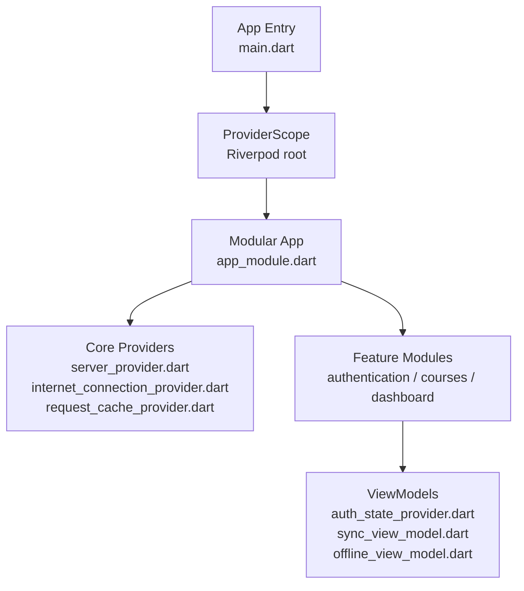
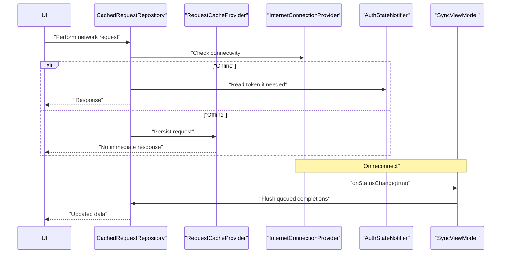
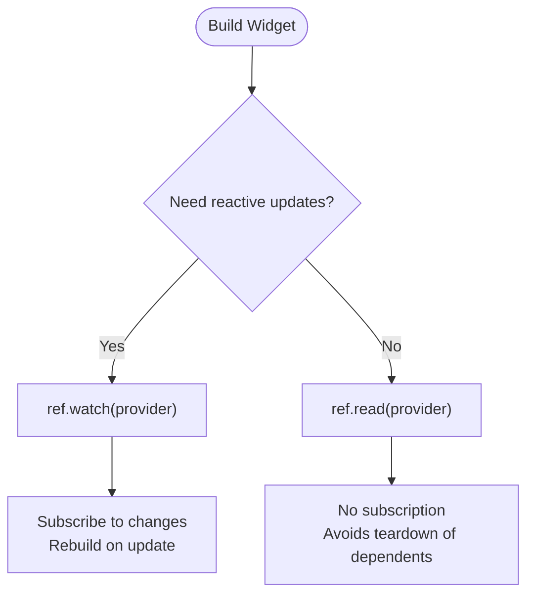
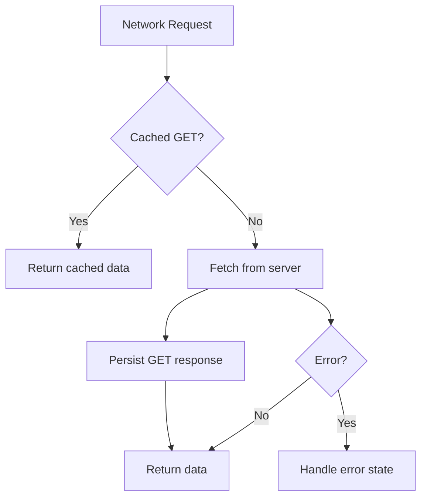
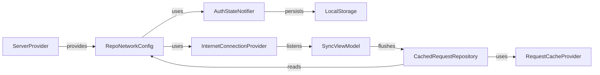

# Performance Optimization & Best Practices

<cite>
**Referenced Files in This Document**
- [main.dart](file://lib/main.dart)
- [app_module.dart](file://lib/app_module.dart)
- [server_provider.dart](file://lib/app/core/provider/server_provider.dart)
- [internet_connection_provider.dart](file://lib/app/core/provider/internet_connection_provider.dart)
- [request_cache_provider.dart](file://lib/app/core/provider/request_cache_provider.dart)
- [cached_request_repository.dart](file://lib/app/core/logic/repository/cached_request_repository.dart)
- [auth_state_provider.dart](file://lib/app/features/authentication/app_state/auth_state_provider.dart)
- [sync_view_model.dart](file://lib/app/features/courses/viewmodel/sync_view_model.dart)
- [offline_view_model.dart](file://lib/app/features/courses/viewmodel/offline_view_model.dart)
- [data_state.dart](file://lib/app/core/logic/data_state/data_state.dart)
- [dev_image_proxy.dart](file://lib/app/core/utils/dev_image_proxy.dart)
</cite>

## Table of Contents
1. Introduction
2. Project Structure
3. Core Components
4. Architecture Overview
5. Detailed Component Analysis
6. Dependency Analysis
7. Performance Considerations
8. Troubleshooting Guide
9. Conclusion

## Introduction
This document provides performance optimization techniques and best practices for Riverpod-based state management in the LMS application. It focuses on provider scoping, selective rebuilding with ref.watch vs ref.read, memory management, caching strategies, lazy loading patterns, efficient state updates to minimize rebuilds, debugging with Flutter DevTools, profiling, and identifying bottlenecks in state management. It also includes guidance for optimizing large state trees, implementing virtual scrolling with state, and reducing provider dependencies.

## Project Structure
The app bootstraps with a ProviderScope at the root, enabling Riverpod across the entire widget tree. Modular routing is used to organize features, while core providers encapsulate cross-cutting concerns such as server configuration, connectivity, and request caching. ViewModels manage feature-specific state and orchestrate data fetching and offline sync.

**Diagram sources**
- [main.dart:16-37](file://lib/main.dart#L16-L37)
- [app_module.dart:7-19](file://lib/app_module.dart#L7-L19)
- [server_provider.dart:8-39](file://lib/app/core/provider/server_provider.dart#L8-L39)
- [internet_connection_provider.dart:9-36](file://lib/app/core/provider/internet_connection_provider.dart#L9-L36)
- [request_cache_provider.dart:9-16](file://lib/app/core/provider/request_cache_provider.dart#L9-L16)
- [auth_state_provider.dart:15-25](file://lib/app/features/authentication/app_state/auth_state_provider.dart#L15-L25)
- [sync_view_model.dart:18-26](file://lib/app/features/courses/viewmodel/sync_view_model.dart#L18-L26)
- [offline_view_model.dart:307-319](file://lib/app/features/courses/viewmodel/offline_view_model.dart#L307-L319)

**Section sources**
- [main.dart:16-37](file://lib/main.dart#L16-L37)
- [app_module.dart:7-19](file://lib/app_module.dart#L7-L19)

## Core Components
- ProviderScope at app startup enables global access to providers and ensures proper disposal.
- ServerProvider centralizes API URL and network configuration, using ref.read for dynamic toggles to avoid unnecessary provider teardown.
- InternetConnectionProvider monitors connectivity with idempotent initialization and listener deduplication to prevent redundant refreshes.
- RequestCacheProvider persists GET/POST requests locally and replays them when connectivity returns.
- AuthStateNotifier manages authentication state, token refresh, and profile updates with careful equality checks to avoid infinite rebuild loops.
- SyncViewModel orchestrates offline queue synchronization and triggers full re-fetch on reconnect via microtask deferral.
- OfflineViewModel loads cached course data and exposes availability helpers for UI.

Key performance implications:
- Use ref.read for transient or frequently changing values (e.g., offline mode toggle) to avoid tearing down dependent providers.
- Defer side effects that modify other providers until after initialization completes (microtask).
- Minimize rebuilds by updating immutable state carefully and avoiding unnecessary object identity changes.

**Section sources**
- [main.dart:16-37](file://lib/main.dart#L16-L37)
- [server_provider.dart:19-39](file://lib/app/core/provider/server_provider.dart#L19-L39)
- [internet_connection_provider.dart:51-79](file://lib/app/core/provider/internet_connection_provider.dart#L51-L79)
- [request_cache_provider.dart:34-78](file://lib/app/core/provider/request_cache_provider.dart#L34-L78)
- [auth_state_provider.dart:79-112](file://lib/app/features/authentication/app_state/auth_state_provider.dart#L79-L112)
- [sync_view_model.dart:57-84](file://lib/app/features/courses/viewmodel/sync_view_model.dart#L57-L84)
- [offline_view_model.dart:307-319](file://lib/app/features/courses/viewmodel/offline_view_model.dart#L307-L319)

## Architecture Overview
The following diagram shows how providers interact during a typical data flow: connectivity detection influences caching and re-fetching; authenticated requests use tokens from auth state; offline queues are flushed when online.

**Diagram sources**
- [internet_connection_provider.dart:55-79](file://lib/app/core/provider/internet_connection_provider.dart#L55-L79)
- [sync_view_model.dart:91-126](file://lib/app/features/courses/viewmodel/sync_view_model.dart#L91-L126)
- [cached_request_repository.dart:9-31](file://lib/app/core/logic/repository/cached_request_repository.dart#L9-L31)
- [request_cache_provider.dart:63-78](file://lib/app/core/provider/request_cache_provider.dart#L63-L78)
- [auth_state_provider.dart:114-149](file://lib/app/features/authentication/app_state/auth_state_provider.dart#L114-L149)

## Detailed Component Analysis

### Provider Scoping Strategies
- Global scope: ProviderScope wraps the entire app, allowing any widget to read/write providers without passing context manually.
- Feature modules: Modular routes isolate feature modules; each module can define its own providers scoped to route lifecycle.
- Selective scoping: Keep long-lived providers (connectivity, auth, server config) at the root; keep screen-scoped providers inside feature modules to reduce lifetime and memory footprint.

Best practices:
- Prefer ScopedProvider or family providers for per-route or per-list-item state to limit rebuilds.
- Avoid placing heavy computation in top-level providers unless necessary; move it into smaller, targeted providers.

**Section sources**
- [main.dart:24-37](file://lib/main.dart#L24-L37)
- [app_module.dart:14-19](file://lib/app_module.dart#L14-L19)

### Selective Rebuilding: ref.watch vs ref.read
- Use ref.watch when a widget needs to react to provider changes (e.g., displaying data or loading states).
- Use ref.read for one-off reads or when you want to avoid subscribing to changes (e.g., reading an offline toggle inside a closure to prevent tearing down dependent providers).

Examples in codebase:
- ServerProvider uses ref.read for isManualOffline and refreshToken closures to avoid recreating repository/viewmodel providers when the toggle flips.
- AuthGate watches auth state to guard routes but avoids unnecessary rebuilds by gating navigation logic.

**Diagram sources**
- [server_provider.dart:24-37](file://lib/app/core/provider/server_provider.dart#L24-L37)
- [auth_state_provider.dart:15-25](file://lib/app/features/authentication/app_state/auth_state_provider.dart#L15-L25)

**Section sources**
- [server_provider.dart:24-37](file://lib/app/core/provider/server_provider.dart#L24-L37)

### Memory Management Considerations
- Ensure listeners are removed in dispose to prevent leaks (e.g., connection provider listeners).
- Avoid holding references to large objects in providers longer than needed.
- Use immutable state updates and equality checks to prevent unnecessary rebuilds and memory churn.

Observed patterns:
- InternetConnectionProvider removes listeners in cleanup paths and guards against duplicate subscriptions.
- AuthStateNotifier compares profiles before replacing state to avoid infinite rebuild cycles.

**Section sources**
- [internet_connection_provider.dart:81-89](file://lib/app/core/provider/internet_connection_provider.dart#L81-L89)
- [auth_state_provider.dart:79-112](file://lib/app/features/authentication/app_state/auth_state_provider.dart#L79-L112)

### Caching Strategies
- Local storage-backed request cache persists GET and store requests; on reconnect, cached requests are replayed.
- Offline view model loads cached courses and timestamps to render content without network.

Optimization tips:
- Limit cache size and implement eviction policies for large datasets.
- Use DataState to represent loading/error/data transitions consistently, minimizing UI rebuilds.

**Diagram sources**
- [request_cache_provider.dart:34-61](file://lib/app/core/provider/request_cache_provider.dart#L34-L61)
- [offline_view_model.dart:307-319](file://lib/app/features/courses/viewmodel/offline_view_model.dart#L307-L319)
- [data_state.dart:1-22](file://lib/app/core/logic/data_state/data_state.dart#L1-L22)

**Section sources**
- [request_cache_provider.dart:34-78](file://lib/app/core/provider/request_cache_provider.dart#L34-L78)
- [offline_view_model.dart:307-319](file://lib/app/features/courses/viewmodel/offline_view_model.dart#L307-L319)
- [data_state.dart:1-22](file://lib/app/core/logic/data_state/data_state.dart#L1-L22)

### Lazy Loading Patterns
- Load data only when needed (e.g., on demand search or pull-to-refresh).
- Defer heavy operations until connectivity is available or user action occurs.
- Use microtasks to defer provider modifications that must not run during initialization.

Observed pattern:
- SyncViewModel defers sync and refreshAllOnReconnect to a microtask to avoid modifying other providers during their initialization.

**Section sources**
- [sync_view_model.dart:91-126](file://lib/app/features/courses/viewmodel/sync_view_model.dart#L91-L126)

### Efficient State Updates to Minimize Rebuilds
- Update state immutably and ensure equality checks prevent unnecessary replacements.
- Separate UI-only state from shared state to reduce cross-widget rebuilds.
- Use small, focused providers to limit the scope of changes.

Observed pattern:
- AuthStateNotifier compares profile fields before replacing state to break potential rebuild loops.

**Section sources**
- [auth_state_provider.dart:79-112](file://lib/app/features/authentication/app_state/auth_state_provider.dart#L79-L112)

### Optimizing Large State Trees
- Split large state into multiple providers (e.g., separate lists, filters, pagination).
- Use family providers for list items to isolate updates per item.
- Apply virtualization at the UI layer (e.g., ListView.builder) and pair with paginated data providers.

Guidance:
- Keep computed derived state in providers that depend only on minimal inputs.
- Debounce or throttle frequent updates (e.g., search input) before triggering provider updates.

[No sources needed since this section provides general guidance]

### Implementing Virtual Scrolling with State
- Pair virtualized lists with paginated providers to load chunks of data.
- Maintain scroll position and selection state in local widget state, not in global providers.
- Avoid rebuilding entire lists by isolating item widgets and using stable keys.

[No sources needed since this section provides general guidance]

### Reducing Provider Dependencies
- Use ref.read for transient values to avoid creating tight coupling between providers.
- Extract common logic into helper repositories and inject them via providers.
- Prefer composition over inheritance to keep dependency graphs shallow.

Observed pattern:
- ServerProvider composes network config with refs to auth and connectivity, using closures for dynamic reads.

**Section sources**
- [server_provider.dart:19-39](file://lib/app/core/provider/server_provider.dart#L19-L39)

## Dependency Analysis
The following diagram maps key provider relationships and highlights where ref.watch vs ref.read is used to control rebuild behavior.

**Diagram sources**
- [server_provider.dart:19-39](file://lib/app/core/provider/server_provider.dart#L19-L39)
- [internet_connection_provider.dart:9-36](file://lib/app/core/provider/internet_connection_provider.dart#L9-L36)
- [cached_request_repository.dart:9-31](file://lib/app/core/logic/repository/cached_request_repository.dart#L9-L31)
- [request_cache_provider.dart:9-16](file://lib/app/core/provider/request_cache_provider.dart#L9-L16)
- [auth_state_provider.dart:15-25](file://lib/app/features/authentication/app_state/auth_state_provider.dart#L15-L25)
- [sync_view_model.dart:18-26](file://lib/app/features/courses/viewmodel/sync_view_model.dart#L18-L26)

**Section sources**
- [server_provider.dart:19-39](file://lib/app/core/provider/server_provider.dart#L19-L39)
- [internet_connection_provider.dart:9-36](file://lib/app/core/provider/internet_connection_provider.dart#L9-L36)
- [cached_request_repository.dart:9-31](file://lib/app/core/logic/repository/cached_request_repository.dart#L9-L31)
- [request_cache_provider.dart:9-16](file://lib/app/core/provider/request_cache_provider.dart#L9-L16)
- [auth_state_provider.dart:15-25](file://lib/app/features/authentication/app_state/auth_state_provider.dart#L15-L25)
- [sync_view_model.dart:18-26](file://lib/app/features/courses/viewmodel/sync_view_model.dart#L18-L26)

## Performance Considerations
- Connectivity-aware caching: Persist requests and replay on reconnect to reduce network calls and improve perceived performance.
- Avoid provider teardown on toggle flips: Use ref.read for toggles like offline mode to prevent wiping already-loaded screens.
- Idempotent initialization: Ensure connectivity checks and listeners are initialized once to prevent duplicate work.
- Microtask deferral: Defer provider modifications that occur during initialization to avoid hard constraints in Riverpod.
- Equality checks: Compare complex objects before replacing state to prevent unnecessary rebuilds.
- Image loading: In web debug builds, route images through a proxy to avoid CORS errors; in production, rely on native image handling.

[No sources needed since this section provides general guidance]

## Troubleshooting Guide
Common issues and resolutions:
- Infinite rebuild loops:
  - Symptom: A provider repeatedly recomputes or triggers another provider’s fetch.
  - Resolution: Add equality checks before state replacement; use ref.read for transient reads; split state into smaller providers.
  - Reference: Profile comparison logic in auth state updates.

- Excessive rebuilds on connectivity changes:
  - Symptom: Screens reset or refetch unexpectedly when connectivity status changes.
  - Resolution: Ensure connectivity listeners notify only on actual state changes; defer refresh actions to microtasks.
  - Reference: Connection change handler and sync deferral.

- Stale or missing cached data:
  - Symptom: Cached requests not replayed or stale data shown.
  - Resolution: Verify cache persistence and replay logic; check connectivity listener activation.
  - Reference: Request cache provider and repository integration.

- Token refresh storms:
  - Symptom: Multiple concurrent auto-login attempts.
  - Resolution: Dedupe refresh calls with an in-flight guard.
  - Reference: Auth state notifier refresh guard.

Debugging techniques:
- Use Flutter DevTools:
  - Widgets Inspector: Identify unnecessary rebuilds and widget trees.
  - Performance Overlay: Monitor frame times and jank.
  - Memory Profiler: Detect retained objects and potential leaks.
- Network tab: Inspect request caching and replay behavior.
- Logging: Add structured logs around provider updates and network calls to trace flows.

**Section sources**
- [auth_state_provider.dart:79-112](file://lib/app/features/authentication/app_state/auth_state_provider.dart#L79-L112)
- [internet_connection_provider.dart:55-79](file://lib/app/core/provider/internet_connection_provider.dart#L55-L79)
- [sync_view_model.dart:91-126](file://lib/app/features/courses/viewmodel/sync_view_model.dart#L91-L126)
- [request_cache_provider.dart:63-78](file://lib/app/core/provider/request_cache_provider.dart#L63-L78)
- [dev_image_proxy.dart:1-17](file://lib/app/core/utils/dev_image_proxy.dart#L1-L17)

## Conclusion
By applying provider scoping strategies, selective rebuilding with ref.watch vs ref.read, robust caching, lazy loading, and careful state updates, the LMS app achieves responsive performance even under large state trees and fluctuating connectivity. The observed patterns—idempotent initialization, microtask deferral, equality checks, and request caching—form a solid foundation for scalable state management. Combine these techniques with Flutter DevTools for continuous profiling and optimization to maintain high performance as the app evolves.