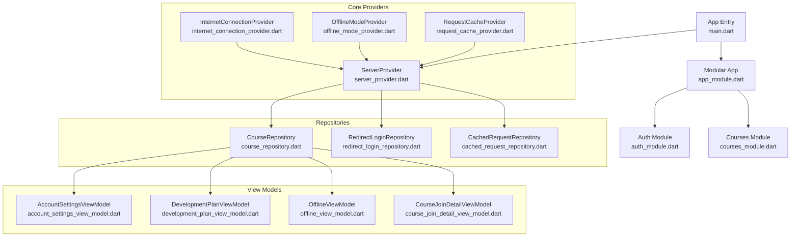
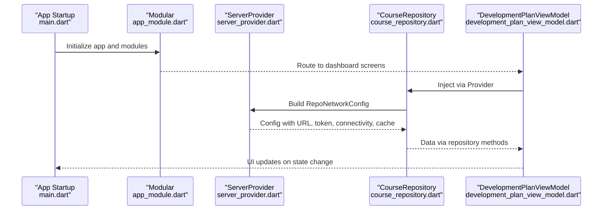
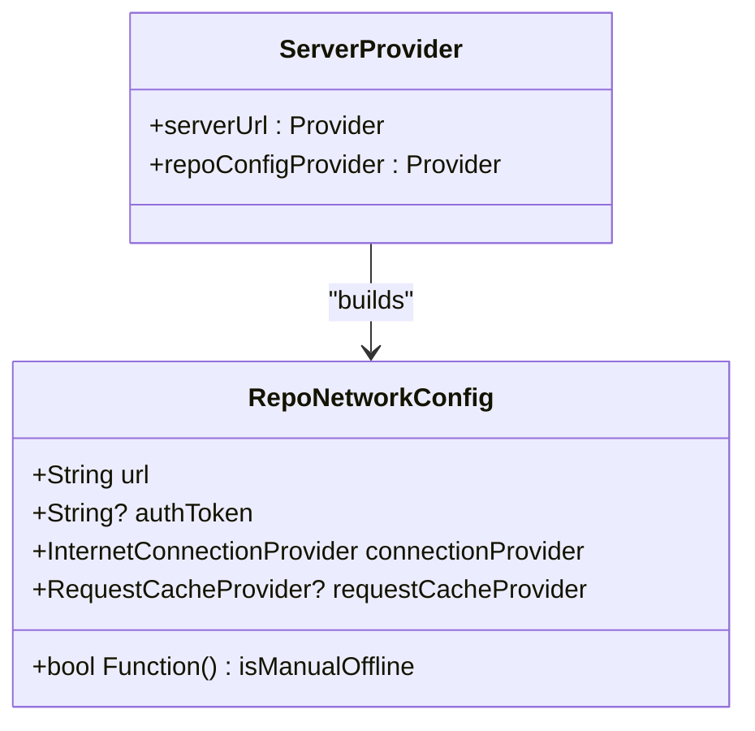
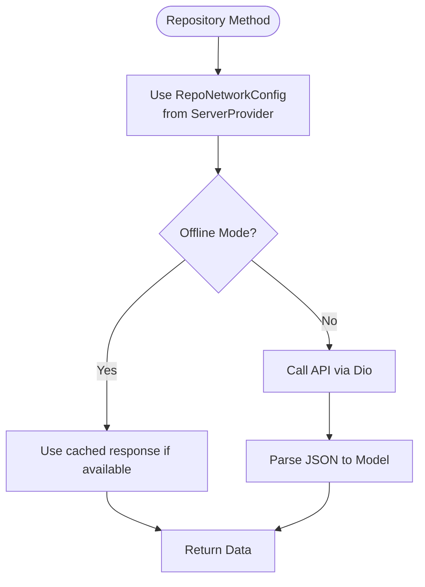
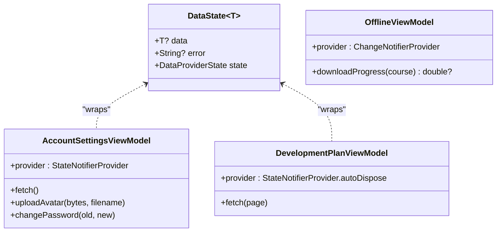
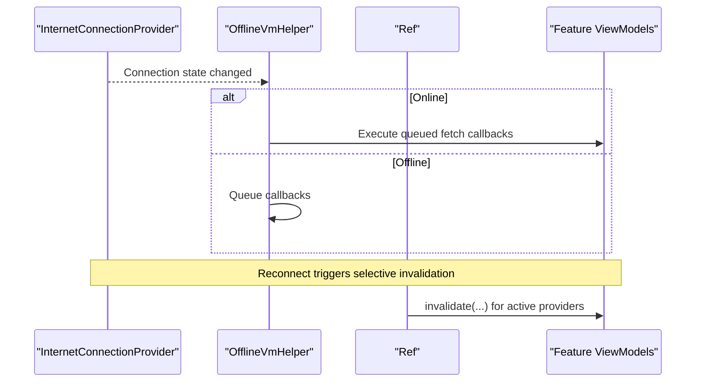
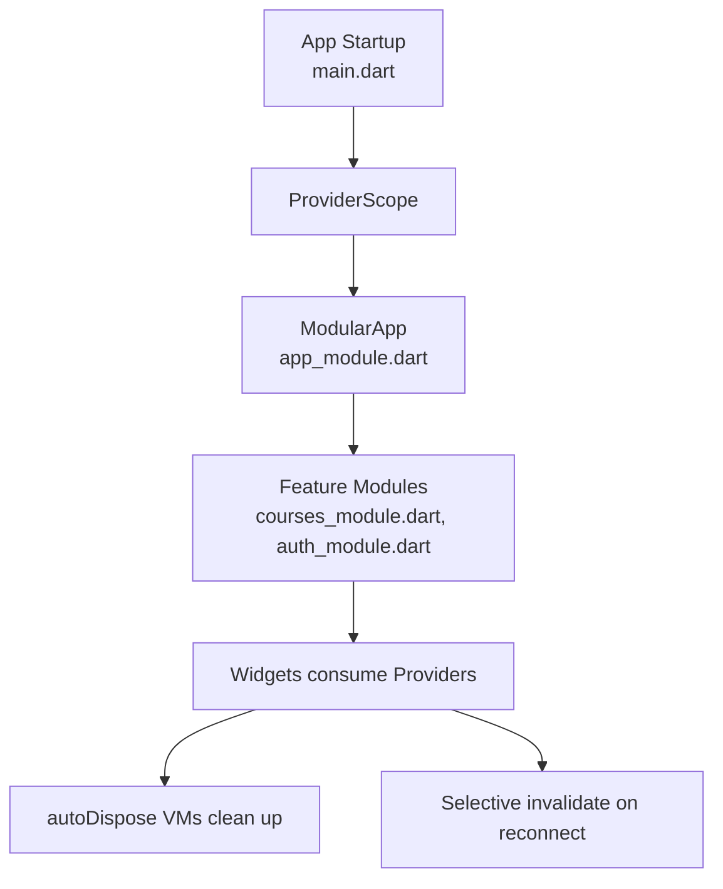
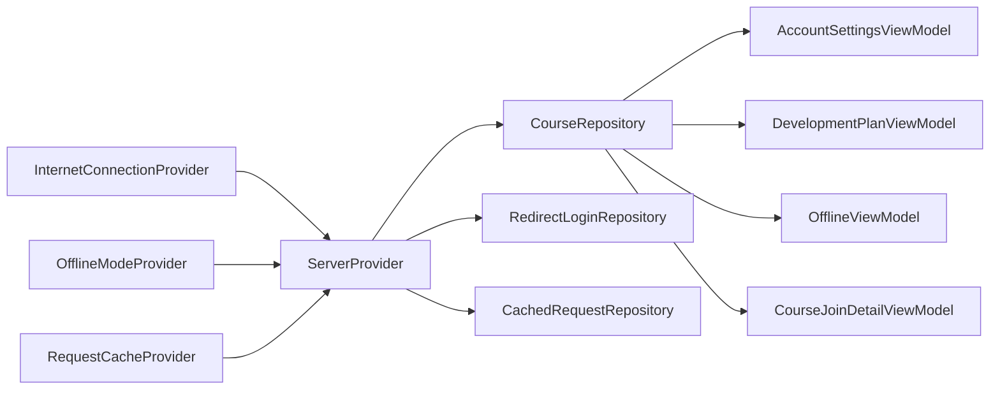

# Provider Architecture & Organization

<cite>
**Referenced Files in This Document**
- [main.dart](file://lib/main.dart)
- [app_module.dart](file://lib/app_module.dart)
- [courses_module.dart](file://lib/app/features/courses/module/courses_module.dart)
- [auth_module.dart](file://lib/app/features/authentication/module/auth_module.dart)
- [server_provider.dart](file://lib/app/core/provider/server_provider.dart)
- [internet_connection_provider.dart](file://lib/app/core/provider/internet_connection_provider.dart)
- [offline_mode_provider.dart](file://lib/app/core/provider/offline_mode_provider.dart)
- [request_cache_provider.dart](file://lib/app/core/provider/request_cache_provider.dart)
- [reconnect_refresh.dart](file://lib/app/core/provider/reconnect_refresh.dart)
- [repo_network_helper.dart](file://lib/app/core/logic/repository/repo_network_helper.dart)
- [cached_request_repository.dart](file://lib/app/core/logic/repository/cached_request_repository.dart)
- [course_repository.dart](file://lib/app/features/courses/repository/course_repository.dart)
- [redirect_login_repository.dart](file://lib/app/features/courses/repository/redirect_login_repository.dart)
- [data_state.dart](file://lib/app/core/logic/data_state/data_state.dart)
- [account_settings_view_model.dart](file://lib/app/features/dashboard/viewmodel/account_settings_view_model.dart)
- [development_plan_view_model.dart](file://lib/app/features/dashboard/viewmodel/development_plan_view_model.dart)
- [offline_view_model.dart](file://lib/app/features/courses/viewmodel/offline_view_model.dart)
- [course_join_detail_view_model.dart](file://lib/app/features/courses/viewmodel/course_join_detail_view_model.dart)
- [offline_vm_helper.dart](file://lib/app/core/logic/vm_helper/offline_vm_helper.dart)
</cite>

## Table of Contents
1. Introduction
2. Project Structure
3. Core Components
4. Architecture Overview
5. Detailed Component Analysis
6. Dependency Analysis
7. Performance Considerations
8. Troubleshooting Guide
9. Conclusion

## Introduction
This document explains the Riverpod provider architecture and organization patterns used in Leadership Edge Live LMS. It covers hierarchical provider structure, dependency injection, provider scoping strategies, feature-based organization, global state management, registration and lifecycle management, and performance optimization through memoization and proper scoping. The goal is to help developers understand how providers are structured across shared services, feature modules, and global state, and how to create custom providers that integrate cleanly with the existing system.

## Project Structure
The application uses Flutter Modular for routing and module boundaries, while Riverpod provides dependency injection and reactive state. Providers are organized into:
- Global/shared providers under lib/app/core/provider (e.g., server configuration, connectivity, caching, offline mode).
- Feature-specific repositories and view models under lib/app/features/<feature>.
- Module definitions under lib/app/features/*/module that wire routes and gate navigation.

**Diagram sources**
- [main.dart:16-37](file://lib/main.dart#L16-L37)
- [app_module.dart:7-19](file://lib/app_module.dart#L7-L19)
- [courses_module.dart:20-69](file://lib/app/features/courses/module/courses_module.dart#L20-L69)
- [auth_module.dart:5-10](file://lib/app/features/authentication/module/auth_module.dart#L5-L10)
- [server_provider.dart:8-25](file://lib/app/core/provider/server_provider.dart#L8-L25)
- [course_repository.dart:7-21](file://lib/app/features/courses/repository/course_repository.dart#L7-L21)
- [redirect_login_repository.dart:5-37](file://lib/app/features/courses/repository/redirect_login_repository.dart#L5-L37)
- [cached_request_repository.dart:9-31](file://lib/app/core/logic/repository/cached_request_repository.dart#L9-L31)
- [account_settings_view_model.dart:9-28](file://lib/app/features/dashboard/viewmodel/account_settings_view_model.dart#L9-L28)
- [development_plan_view_model.dart:50-65](file://lib/app/features/dashboard/viewmodel/development_plan_view_model.dart#L50-L65)
- [offline_view_model.dart:28-58](file://lib/app/features/courses/viewmodel/offline_view_model.dart#L28-L58)
- [course_join_detail_view_model.dart:152-171](file://lib/app/features/courses/viewmodel/course_join_detail_view_model.dart#L152-L171)

**Section sources**
- [main.dart:16-37](file://lib/main.dart#L16-L37)
- [app_module.dart:7-19](file://lib/app_module.dart#L7-L19)
- [courses_module.dart:20-69](file://lib/app/features/courses/module/courses_module.dart#L20-L69)
- [auth_module.dart:5-10](file://lib/app/features/authentication/module/auth_module.dart#L5-L10)

## Core Components
- ServerProvider: Centralizes API base URL and builds RepoNetworkConfig using auth token, connectivity, and cache providers.
- InternetConnectionProvider: Streams connectivity changes; used by network helpers and VMs to react to online/offline transitions.
- OfflineModeProvider: Toggles app-level offline behavior without tearing down dependent providers.
- RequestCacheProvider: Supplies request caching strategy to repositories.
- Repositories: Encapsulate network calls via RepoNetworkHelper and expose a Riverpod Provider for DI.
- View Models: State containers (StateNotifier/ChangeNotifier) exposing data and actions; each exposes a static Provider for consumption.

Key responsibilities:
- Global configuration and environment: ServerProvider.
- Connectivity and offline behavior: InternetConnectionProvider, OfflineModeProvider.
- Data access: Repositories with RepoNetworkHelper.
- UI state: Feature-specific ViewModels.

**Section sources**
- [server_provider.dart:8-25](file://lib/app/core/provider/server_provider.dart#L8-L25)
- [repo_network_helper.dart:31-43](file://lib/app/core/logic/repository/repo_network_helper.dart#L31-L43)
- [course_repository.dart:7-21](file://lib/app/features/courses/repository/course_repository.dart#L7-L21)
- [redirect_login_repository.dart:5-37](file://lib/app/features/courses/repository/redirect_login_repository.dart#L5-L37)
- [cached_request_repository.dart:9-31](file://lib/app/core/logic/repository/cached_request_repository.dart#L9-L31)
- [account_settings_view_model.dart:9-28](file://lib/app/features/dashboard/viewmodel/account_settings_view_model.dart#L9-L28)
- [development_plan_view_model.dart:50-65](file://lib/app/features/dashboard/viewmodel/development_plan_view_model.dart#L50-L65)
- [offline_view_model.dart:28-58](file://lib/app/features/courses/viewmodel/offline_view_model.dart#L28-L58)

## Architecture Overview
Riverpod is initialized at app startup and scoped globally. Modular manages routes and feature modules. Providers are consumed by repositories and view models, which encapsulate business logic and UI state. Connectivity and offline toggles influence network behavior without rebuilding heavy components.

**Diagram sources**
- [main.dart:16-37](file://lib/main.dart#L16-L37)
- [app_module.dart:7-19](file://lib/app_module.dart#L7-L19)
- [server_provider.dart:8-25](file://lib/app/core/provider/server_provider.dart#L8-L25)
- [course_repository.dart:7-21](file://lib/app/features/courses/repository/course_repository.dart#L7-L21)
- [development_plan_view_model.dart:50-65](file://lib/app/features/dashboard/viewmodel/development_plan_view_model.dart#L50-L65)

## Detailed Component Analysis

### Global Configuration and Network Layer
- ServerProvider constructs RepoNetworkConfig using:
  - Environment-based or default server URL.
  - Auth token from authentication state.
  - Connectivity provider for real-time connection status.
  - Optional request cache provider.
- RepoNetworkConfig includes an isManualOffline getter to honor user-driven offline mode without rebuilding dependencies.

**Diagram sources**
- [server_provider.dart:8-25](file://lib/app/core/provider/server_provider.dart#L8-L25)
- [repo_network_helper.dart:31-43](file://lib/app/core/logic/repository/repo_network_helper.dart#L31-L43)

**Section sources**
- [server_provider.dart:8-25](file://lib/app/core/provider/server_provider.dart#L8-L25)
- [repo_network_helper.dart:31-43](file://lib/app/core/logic/repository/repo_network_helper.dart#L31-L43)

### Repository Pattern with Riverpod
- Each repository defines a static Provider that depends on ServerProvider.repoConfigProvider and mixes in RepoNetworkHelper for HTTP operations.
- Repositories implement domain-specific endpoints and mapping functions.

Examples:
- CourseRepository: Provides course roster endpoint and JSON mapping.
- RedirectLoginRepository: Generates authenticated redirect links for in-app WebView sessions.
- CachedRequestRepository: Wraps POST requests with explicit cache control.

**Diagram sources**
- [course_repository.dart:7-21](file://lib/app/features/courses/repository/course_repository.dart#L7-L21)
- [redirect_login_repository.dart:5-37](file://lib/app/features/courses/repository/redirect_login_repository.dart#L5-L37)
- [cached_request_repository.dart:9-31](file://lib/app/core/logic/repository/cached_request_repository.dart#L9-L31)
- [repo_network_helper.dart:31-43](file://lib/app/core/logic/repository/repo_network_helper.dart#L31-L43)

**Section sources**
- [course_repository.dart:7-21](file://lib/app/features/courses/repository/course_repository.dart#L7-L21)
- [redirect_login_repository.dart:5-37](file://lib/app/features/courses/repository/redirect_login_repository.dart#L5-L37)
- [cached_request_repository.dart:9-31](file://lib/app/core/logic/repository/cached_request_repository.dart#L9-L31)

### View Models and State Management
- View Models use StateNotifier or ChangeNotifier and expose a static Provider for DI.
- They manage DataState<T> to represent loading, data, and error states consistently.
- Examples:
  - AccountSettingsViewModel: Fetches profile, uploads avatar, updates auth state carefully to avoid infinite rebuild loops.
  - DevelopmentPlanViewModel: Uses autoDispose to prevent leaks when navigating away.
  - OfflineViewModel: Tracks per-course download progress and integrates with connectivity streams.

**Diagram sources**
- [data_state.dart:1-22](file://lib/app/core/logic/data_state/data_state.dart#L1-L22)
- [account_settings_view_model.dart:9-28](file://lib/app/features/dashboard/viewmodel/account_settings_view_model.dart#L9-L28)
- [development_plan_view_model.dart:50-65](file://lib/app/features/dashboard/viewmodel/development_plan_view_model.dart#L50-L65)
- [offline_view_model.dart:28-58](file://lib/app/features/courses/viewmodel/offline_view_model.dart#L28-L58)

**Section sources**
- [data_state.dart:1-22](file://lib/app/core/logic/data_state/data_state.dart#L1-L22)
- [account_settings_view_model.dart:9-28](file://lib/app/features/dashboard/viewmodel/account_settings_view_model.dart#L9-L28)
- [development_plan_view_model.dart:50-65](file://lib/app/features/dashboard/viewmodel/development_plan_view_model.dart#L50-L65)
- [offline_view_model.dart:28-58](file://lib/app/features/courses/viewmodel/offline_view_model.dart#L28-L58)

### Connectivity and Reconnection Strategy
- InternetConnectionProvider streams connectivity changes.
- OfflineVmHelper listens to connection events and schedules fetch callbacks when back online.
- Reconnect refresh logic invalidates relevant providers when connectivity resumes, ensuring UI reflects latest data.

**Diagram sources**
- [offline_vm_helper.dart:5-34](file://lib/app/core/logic/vm_helper/offline_vm_helper.dart#L5-L34)
- [reconnect_refresh.dart:36-77](file://lib/app/core/provider/reconnect_refresh.dart#L36-L77)

**Section sources**
- [offline_vm_helper.dart:5-34](file://lib/app/core/logic/vm_helper/offline_vm_helper.dart#L5-L34)
- [reconnect_refresh.dart:36-77](file://lib/app/core/provider/reconnect_refresh.dart#L36-L77)

### Provider Registration and Lifecycle
- Application bootstrap wraps the widget tree with ProviderScope to enable Riverpod globally.
- Modular registers route modules; features can define their own modules for routing and gating.
- View Models commonly use autoDispose to ensure cleanup when no longer watched.
- Selective invalidation avoids unnecessary rebuilds and prevents “disposed” errors during rapid navigation or connectivity flaps.

**Diagram sources**
- [main.dart:16-37](file://lib/main.dart#L16-L37)
- [app_module.dart:7-19](file://lib/app_module.dart#L7-L19)
- [courses_module.dart:20-69](file://lib/app/features/courses/module/courses_module.dart#L20-L69)
- [auth_module.dart:5-10](file://lib/app/features/authentication/module/auth_module.dart#L5-L10)
- [reconnect_refresh.dart:36-77](file://lib/app/core/provider/reconnect_refresh.dart#L36-L77)

**Section sources**
- [main.dart:16-37](file://lib/main.dart#L16-L37)
- [app_module.dart:7-19](file://lib/app_module.dart#L7-L19)
- [courses_module.dart:20-69](file://lib/app/features/courses/module/courses_module.dart#L20-L69)
- [auth_module.dart:5-10](file://lib/app/features/authentication/module/auth_module.dart#L5-L10)
- [reconnect_refresh.dart:36-77](file://lib/app/core/provider/reconnect_refresh.dart#L36-L77)

## Dependency Analysis
Providers form a layered dependency graph:
- Global providers (ServerProvider, InternetConnectionProvider, OfflineModeProvider, RequestCacheProvider) supply configuration and capabilities.
- Repositories depend on ServerProvider and network helpers to perform I/O.
- View Models depend on repositories and may also read authentication state.
- Connectivity events trigger selective invalidation to refresh dependent providers safely.

**Diagram sources**
- [server_provider.dart:8-25](file://lib/app/core/provider/server_provider.dart#L8-L25)
- [course_repository.dart:7-21](file://lib/app/features/courses/repository/course_repository.dart#L7-L21)
- [redirect_login_repository.dart:5-37](file://lib/app/features/courses/repository/redirect_login_repository.dart#L5-L37)
- [cached_request_repository.dart:9-31](file://lib/app/core/logic/repository/cached_request_repository.dart#L9-L31)
- [account_settings_view_model.dart:9-28](file://lib/app/features/dashboard/viewmodel/account_settings_view_model.dart#L9-L28)
- [development_plan_view_model.dart:50-65](file://lib/app/features/dashboard/viewmodel/development_plan_view_model.dart#L50-L65)
- [offline_view_model.dart:28-58](file://lib/app/features/courses/viewmodel/offline_view_model.dart#L28-L58)
- [course_join_detail_view_model.dart:152-171](file://lib/app/features/courses/viewmodel/course_join_detail_view_model.dart#L152-L171)

**Section sources**
- [server_provider.dart:8-25](file://lib/app/core/provider/server_provider.dart#L8-L25)
- [course_repository.dart:7-21](file://lib/app/features/courses/repository/course_repository.dart#L7-L21)
- [redirect_login_repository.dart:5-37](file://lib/app/features/courses/repository/redirect_login_repository.dart#L5-L37)
- [cached_request_repository.dart:9-31](file://lib/app/core/logic/repository/cached_request_repository.dart#L9-L31)
- [account_settings_view_model.dart:9-28](file://lib/app/features/dashboard/viewmodel/account_settings_view_model.dart#L9-L28)
- [development_plan_view_model.dart:50-65](file://lib/app/features/dashboard/viewmodel/development_plan_view_model.dart#L50-L65)
- [offline_view_model.dart:28-58](file://lib/app/features/courses/viewmodel/offline_view_model.dart#L28-L58)
- [course_join_detail_view_model.dart:152-171](file://lib/app/features/courses/viewmodel/course_join_detail_view_model.dart#L152-L171)

## Performance Considerations
- Prefer autoDispose for view models tied to screens to avoid memory leaks and unnecessary work after navigation.
- Use ref.read instead of ref.watch where appropriate to avoid triggering rebuilds due to side effects (e.g., updating auth state inside a constructor).
- Leverage selective invalidation on connectivity changes to minimize rebuilds and avoid “disposed” errors.
- Keep RepoNetworkConfig immutable except for live getters like isManualOffline to reduce rebuild churn.
- Cache responses where possible via RequestCacheProvider to reduce network load.

[No sources needed since this section provides general guidance]

## Troubleshooting Guide
Common issues and resolutions:
- Infinite rebuild loops when updating authentication state inside a provider’s constructor:
  - Use ref.read to avoid watching changing providers during construction.
  - Ensure updateProfile does not trigger the same provider to rebuild immediately.
- “Bad state: Tried to use X after dispose was called”:
  - Guard invalidations with ref.exists before calling invalidate on family or non-existent providers.
  - Avoid invalidating providers that are not currently being watched.
- Offline mode not taking effect:
  - Verify isManualOffline is checked at call time in RepoNetworkConfig and that connectivity streams are properly listened to.

**Section sources**
- [account_settings_view_model.dart:182-216](file://lib/app/features/dashboard/viewmodel/account_settings_view_model.dart#L182-L216)
- [course_join_detail_view_model.dart:152-171](file://lib/app/features/courses/viewmodel/course_join_detail_view_model.dart#L152-L171)
- [reconnect_refresh.dart:36-77](file://lib/app/core/provider/reconnect_refresh.dart#L36-L77)
- [repo_network_helper.dart:31-43](file://lib/app/core/logic/repository/repo_network_helper.dart#L31-L43)

## Conclusion
The LMS leverages Riverpod for robust dependency injection and reactive state management, organized around global configuration, feature-based repositories, and screen-scoped view models. Provider scoping, autoDispose, and selective invalidation ensure efficient lifecycles and resilience against connectivity changes. By following these patterns—centralized configuration, clear separation of concerns, and careful dependency handling—you can extend the system with new features while maintaining performance and stability.

[No sources needed since this section summarizes without analyzing specific files]