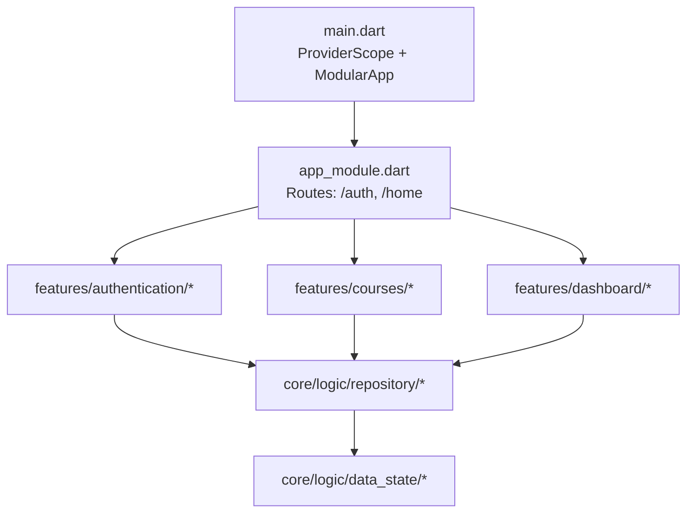
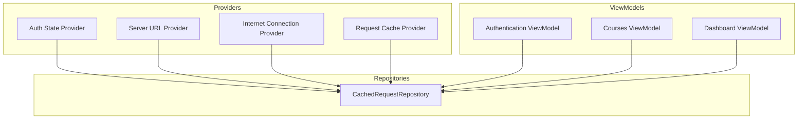
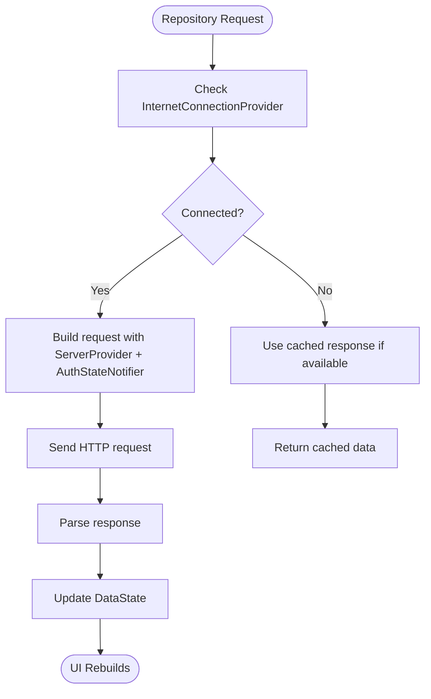
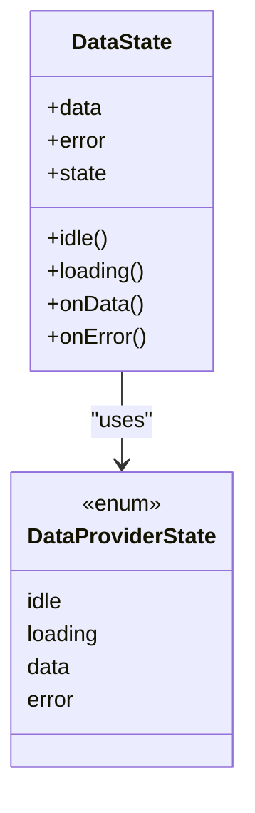
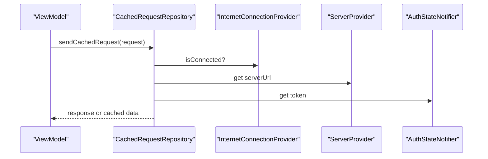

# State Management with Riverpod

<cite>
**Referenced Files in This Document**
- [main.dart](file://lib/main.dart)
- [app_module.dart](file://lib/app_module.dart)
- [pubspec.yaml](file://pubspec.yaml)
- [cached_request_repository.dart](file://lib/app/core/logic/repository/cached_request_repository.dart)
- [repo_network_helper.dart](file://lib/app/core/logic/repository/repo_network_helper.dart)
- [data_state.dart](file://lib/app/core/logic/data_state/data_state.dart)
- [base_view_model.dart](file://lib/app/core/logic/vm_helper/base_view_model.dart)
</cite>

## Table of Contents
1. [Introduction](#introduction)
2. [Project Structure](#project-structure)
3. [Core Components](#core-components)
4. [Architecture Overview](#architecture-overview)
5. [Detailed Component Analysis](#detailed-component-analysis)
6. [Dependency Analysis](#dependency-analysis)
7. [Performance Considerations](#performance-considerations)
8. [Troubleshooting Guide](#troubleshooting-guide)
9. [Conclusion](#conclusion)
10. [Appendices](#appendices)

## Introduction
This document explains how Riverpod is used for state management in Leadership Edge Live LMS. It covers the provider organization pattern across authentication, courses, and dashboard features; reactive state updates; provider dependencies; and MVVM-style ViewModels that encapsulate business logic and expose state via providers. It also provides guidance on creating new providers, handling asynchronous operations, optimizing performance through proper scoping, debugging techniques, and migration strategies from other state management solutions.

## Project Structure
The application bootstraps Riverpod at the root and integrates it with a modular routing system. Providers are organized under feature folders (authentication, courses, dashboard) and shared core utilities live under lib/app/core. The app initializes localization, media kit, and a cleanup routine before rendering the UI tree inside ProviderScope.

**Diagram sources**
- [main.dart:16-37](file://lib/main.dart#L16-L37)
- [app_module.dart:7-19](file://lib/app_module.dart#L7-L19)

**Section sources**
- [main.dart:16-37](file://lib/main.dart#L16-L37)
- [app_module.dart:7-19](file://lib/app_module.dart#L7-L19)
- [pubspec.yaml:30-44](file://pubspec.yaml#L30-L44)

## Core Components
- Provider scope and integration: The app wraps its widget tree with ProviderScope to enable Riverpod throughout the app.
- Feature modules: Authentication, Courses, and Dashboard each contain their own viewmodels, repositories, models, and providers.
- Shared data state: A generic DataState type standardizes loading, data, and error states across features.
- Repository layer: Network requests and caching are handled by repository classes that depend on Riverpod providers for configuration and connectivity.

Key responsibilities:
- ViewModels manage business logic and expose state via providers.
- Repositories encapsulate network calls, caching, and offline behavior using Riverpod-injected dependencies.
- DataState unifies UI state representation for consistent UX.

**Section sources**
- [main.dart:16-37](file://lib/main.dart#L16-L37)
- [data_state.dart:1-22](file://lib/app/core/logic/data_state/data_state.dart#L1-L22)
- [cached_request_repository.dart:1-32](file://lib/app/core/logic/repository/cached_request_repository.dart#L1-L32)

## Architecture Overview
Riverpod powers reactive state across features. Providers are declared per feature and composed into higher-level providers or ViewModels. Repositories consume providers for server URL, auth token, and connectivity, enabling automatic reactivity when these values change.

**Diagram sources**
- [cached_request_repository.dart:10-18](file://lib/app/core/logic/repository/cached_request_repository.dart#L10-L18)
- [repo_network_helper.dart:34-56](file://lib/app/core/logic/repository/repo_network_helper.dart#L34-L56)

## Detailed Component Analysis

### Authentication State Providers
- Purpose: Manage user session, tokens, and login/logout flows.
- Organization: Typically implemented as a Notifier-based provider exposing current auth state and actions (login, logout).
- Reactive updates: When token or user profile changes, dependent widgets rebuild automatically.
- Dependencies: May depend on server URL and internet connection providers to perform network calls.

Best practices:
- Keep UI-only flags separate from persistent state.
- Use asyncNotifier when dealing with long-running auth flows.
- Expose methods to mutate state rather than direct field access.

[No sources needed since this section doesn't analyze specific source files]

### Course View Models
- Purpose: Encapsulate course listing, details, progress, and content playback state.
- Organization: One ViewModel per major screen or logical unit; uses providers to fetch and cache data.
- Reactive updates: Watches repository providers; UI reacts to loading, data, and error transitions.
- Dependencies: Depends on CachedRequestRepository and possibly local cache providers.

Optimization tips:
- Scope providers to the smallest necessary subtree to avoid unnecessary rebuilds.
- Debounce rapid inputs (e.g., search) within the ViewModel.
- Use select to subscribe only to relevant fields.

[No sources needed since this section doesn't analyze specific source files]

### Dashboard State Management
- Purpose: Aggregate metrics, notifications, and quick actions for the dashboard.
- Organization: A dashboard ViewModel composes multiple feature providers to present a unified view.
- Synchronization: Ensures consistency between remote data and local caches; handles offline fallbacks.
- Error handling: Presents user-friendly messages and retry options.

[No sources needed since this section doesn't analyze specific source files]

### MVVM Pattern Implementation
- ViewModels own business logic and expose state via providers.
- Views read providers and trigger actions exposed by ViewModels.
- Repositories handle I/O and are injected via providers for testability and reactivity.

Benefits:
- Clear separation of concerns.
- Predictable state updates.
- Easy testing with provider overrides.

[No sources needed since this section doesn't analyze specific source files]

### Creating New Providers
Guidelines:
- Start with a small, focused provider (state or computed).
- For complex state, use Notifier or AsyncNotifier.
- Compose providers to build larger abstractions (e.g., feature-specific ViewModels).
- Prefer scoped providers near the UI that needs them to minimize rebuilds.

[No sources needed since this section doesn't analyze specific source files]

### Handling Asynchronous Operations
Patterns:
- Use AsyncNotifier for background tasks like fetching lists or uploading files.
- Handle loading, data, and error states consistently using DataState.
- Ensure cancellation or debouncing where appropriate to avoid race conditions.

[No sources needed since this section doesn't analyze specific source files]

### Optimizing Performance with Provider Scoping
- Wrap subtrees with ProviderScope when you need isolated state lifecycles.
- Use family providers for parameterized instances (e.g., per-course state).
- Select only watched fields to reduce rebuilds.

[No sources needed since this section doesn't analyze specific source files]

### Common State Management Patterns
- Single source of truth per domain (e.g., auth, courses).
- Unidirectional data flow: UI -> ViewModel -> Repository -> API/Cache -> State -> UI.
- Centralized error handling and retry mechanisms.

[No sources needed since this section doesn't analyze specific source files]

### Debugging Techniques
- Use Flutter DevTools to inspect provider states and rebuild counts.
- Add logging around provider reads/writes during development.
- Write unit tests that override providers to isolate logic.

[No sources needed since this section doesn't analyze specific source files]

### Migration Strategies from Other Solutions
- Identify existing state holders and map them to Notifier/AsyncNotifier providers.
- Replace global singletons with scoped providers.
- Gradually migrate screens to read from providers while keeping backward compatibility.
- Validate behavior with tests after each migration step.

[No sources needed since this section doesn't analyze specific source files]

## Dependency Analysis
The repository layer depends on Riverpod providers for configuration and connectivity. This enables automatic reactivity when server URL, auth token, or connection status changes.

**Diagram sources**
- [cached_request_repository.dart:10-18](file://lib/app/core/logic/repository/cached_request_repository.dart#L10-L18)
- [repo_network_helper.dart:34-56](file://lib/app/core/logic/repository/repo_network_helper.dart#L34-L56)

**Section sources**
- [cached_request_repository.dart:10-18](file://lib/app/core/logic/repository/cached_request_repository.dart#L10-L18)
- [repo_network_helper.dart:34-56](file://lib/app/core/logic/repository/repo_network_helper.dart#L34-L56)

## Performance Considerations
- Scope providers close to usage to limit rebuilds.
- Avoid watching large objects; prefer selecting specific fields.
- Debounce frequent writes (e.g., typing) in ViewModels.
- Use immutable data structures where possible to aid equality checks.
- Leverage caching at the repository level to reduce network calls.

[No sources needed since this section provides general guidance]

## Troubleshooting Guide
Common issues and resolutions:
- Unexpected rebuilds: Check if providers are too broad; refine selectors or scope.
- Stale data: Ensure repositories update state correctly and invalidate caches when needed.
- Offline behavior: Verify connection provider integration and fallback logic.
- Memory leaks: Confirm providers are not holding references beyond their lifecycle.

Debugging steps:
- Inspect provider dependencies and watch chains.
- Log state transitions in ViewModels.
- Use provider overrides in tests to simulate edge cases.

[No sources needed since this section provides general guidance]

## Conclusion
Riverpod provides a robust, scalable foundation for state management in the LMS. By organizing providers per feature, encapsulating business logic in ViewModels, and standardizing data states, the app achieves clear separation of concerns, predictable updates, and high testability. Proper scoping and selective watching ensure performance remains optimal as the app grows.

[No sources needed since this section summarizes without analyzing specific files]

## Appendices

### Data State Model
A standardized model for representing loading, data, and error states across features ensures consistent UI behavior and simplifies error handling.

**Diagram sources**
- [data_state.dart:1-22](file://lib/app/core/logic/data_state/data_state.dart#L1-L22)

**Section sources**
- [data_state.dart:1-22](file://lib/app/core/logic/data_state/data_state.dart#L1-L22)

### Repository Provider Composition
The repository composes configuration from multiple providers to build requests and handle connectivity.

**Diagram sources**
- [cached_request_repository.dart:10-18](file://lib/app/core/logic/repository/cached_request_repository.dart#L10-L18)
- [repo_network_helper.dart:34-56](file://lib/app/core/logic/repository/repo_network_helper.dart#L34-L56)

**Section sources**
- [cached_request_repository.dart:10-18](file://lib/app/core/logic/repository/cached_request_repository.dart#L10-L18)
- [repo_network_helper.dart:34-56](file://lib/app/core/logic/repository/repo_network_helper.dart#L34-L56)