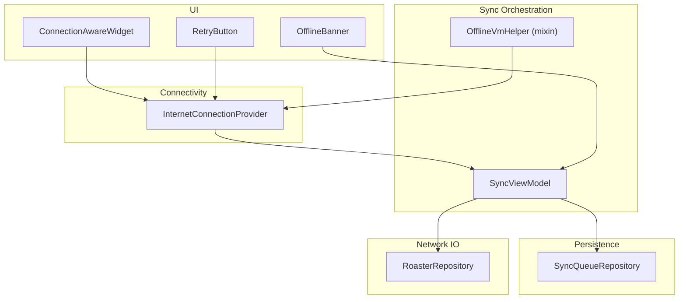
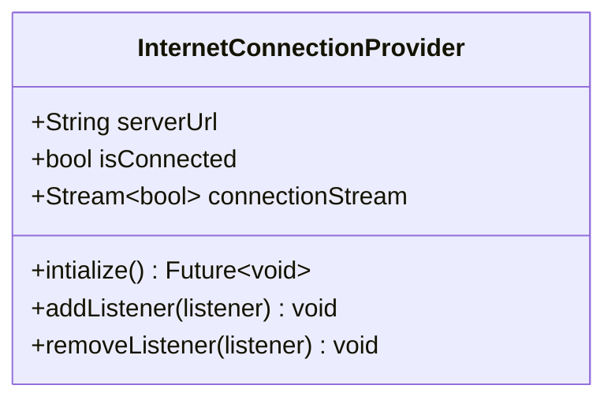
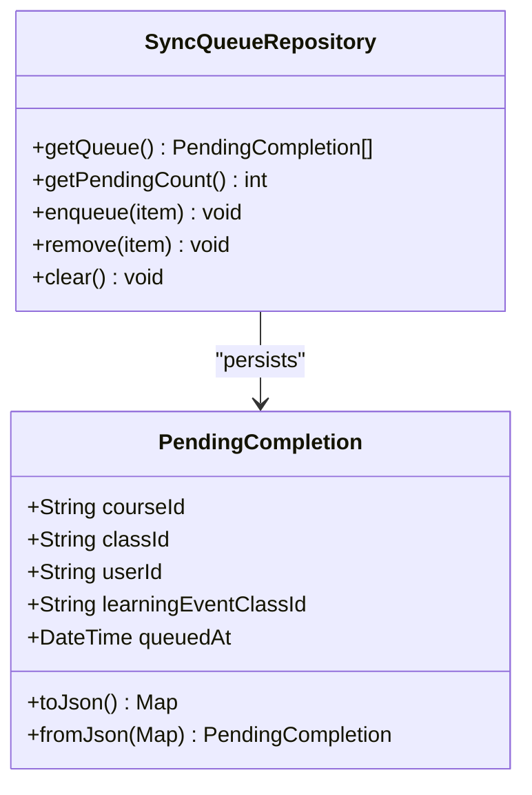
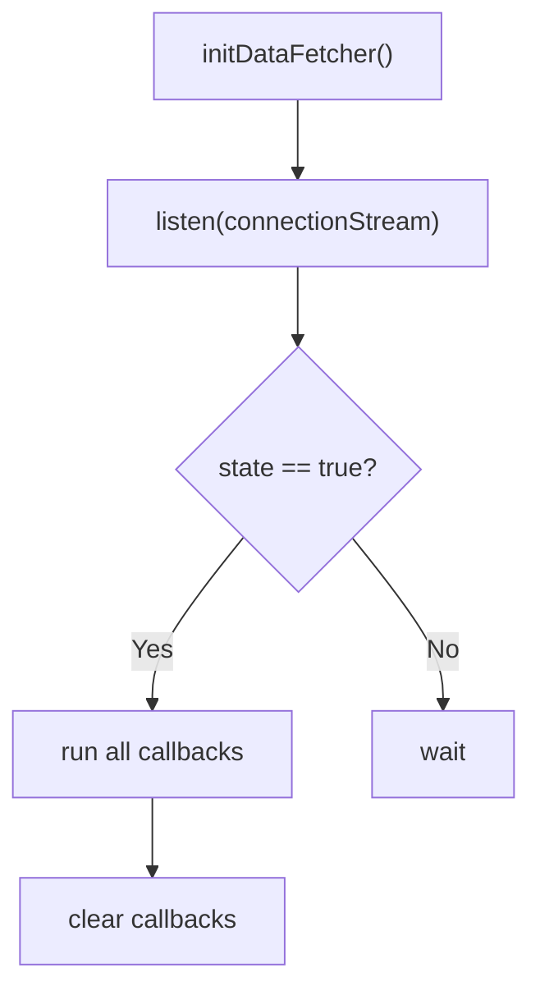
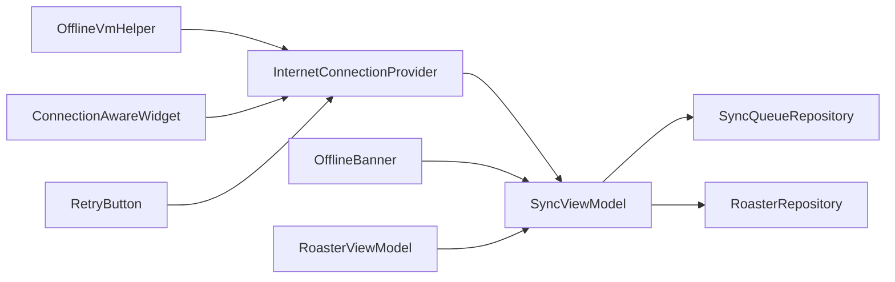

# Offline-First Synchronization Strategy

<cite>
**Referenced Files in This Document**
- [offline_vm_helper.dart](file://lib/app/core/logic/vm_helper/offline_vm_helper.dart)
- [internet_connection_provider.dart](file://lib/app/core/provider/internet_connection_provider.dart)
- [sync_view_model.dart](file://lib/app/features/courses/viewmodel/sync_view_model.dart)
- [sync_queue_repository.dart](file://lib/app/features/courses/repository/sync_queue_repository.dart)
- [roaster_repository.dart](file://lib/app/features/courses/repository/roaster_repository.dart)
- [offline_mode_provider.dart](file://lib/app/core/provider/offline_mode_provider.dart)
- [offline_banner.dart](file://lib/app/core/views/elements/offline_banner.dart)
- [connection_aware_widget.dart](file://lib/app/core/views/elements/connection_aware_widget.dart)
- [retry_button.dart](file://lib/app/core/views/elements/retry_button.dart)
- [roaster_view_model.dart](file://lib/app/features/courses/viewmodel/roaster_view_model.dart)
</cite>

## Table of Contents
1. Introduction
2. Project Structure
3. Core Components
4. Architecture Overview
5. Detailed Component Analysis
6. Dependency Analysis
7. Performance Considerations
8. Troubleshooting Guide
9. Conclusion

## Introduction
This document explains the offline-first synchronization strategy implemented in the application. It focuses on how background sync is triggered when connectivity is restored, how operations are queued while offline, and how real-time connectivity updates drive consistent UI and data behavior. The documentation covers:
- The OfflineVmHelper mixin for registering callbacks that run when connectivity returns
- The SyncQueueRepository for persisting and processing queued operations
- The InternetConnectionProvider for monitoring network status and broadcasting changes
- Integration points with view models and UI to handle transitions and retries
- Conflict resolution strategies, consistency guarantees, and performance considerations for large datasets

## Project Structure
The offline-first strategy spans providers, repositories, view models, and UI components:
- Connectivity provider monitors network state and exposes a stream/listeners
- View models coordinate syncing and refresh flows on connection changes
- Repositories persist pending operations locally and perform network calls
- UI components reflect effective offline/online states and offer retry actions



**Diagram sources**
- [internet_connection_provider.dart:9-99](file://lib/app/core/provider/internet_connection_provider.dart#L9-L99)
- [sync_view_model.dart:18-138](file://lib/app/features/courses/viewmodel/sync_view_model.dart#L18-L138)
- [offline_vm_helper.dart:5-34](file://lib/app/core/logic/vm_helper/offline_vm_helper.dart#L5-L34)
- [sync_queue_repository.dart:43-105](file://lib/app/features/courses/repository/sync_queue_repository.dart#L43-L105)
- [roaster_repository.dart:9-57](file://lib/app/features/courses/repository/roaster_repository.dart#L9-L57)
- [offline_banner.dart:12-94](file://lib/app/core/views/elements/offline_banner.dart#L12-L94)
- [connection_aware_widget.dart:16-35](file://lib/app/core/views/elements/connection_aware_widget.dart#L16-L35)
- [retry_button.dart:22-55](file://lib/app/core/views/elements/retry_button.dart#L22-L55)

**Section sources**
- [internet_connection_provider.dart:9-99](file://lib/app/core/provider/internet_connection_provider.dart#L9-L99)
- [sync_view_model.dart:18-138](file://lib/app/features/courses/viewmodel/sync_view_model.dart#L18-L138)
- [offline_vm_helper.dart:5-34](file://lib/app/core/logic/vm_helper/offline_vm_helper.dart#L5-L34)
- [sync_queue_repository.dart:43-105](file://lib/app/features/courses/repository/sync_queue_repository.dart#L43-L105)
- [roaster_repository.dart:9-57](file://lib/app/features/courses/repository/roaster_repository.dart#L9-L57)
- [offline_banner.dart:12-94](file://lib/app/core/views/elements/offline_banner.dart#L12-L94)
- [connection_aware_widget.dart:16-35](file://lib/app/core/views/elements/connection_aware_widget.dart#L16-L35)
- [retry_button.dart:22-55](file://lib/app/core/views/elements/retry_button.dart#L22-L55)

## Core Components
- InternetConnectionProvider: Monitors connectivity using app server endpoint plus a reliable fallback; broadcasts only genuine state transitions; exposes current state and a broadcast stream.
- SyncViewModel: Orchestrates background sync of queued completions when online; auto-syncs on reconnect; exposes pending count and syncing state; triggers global refetches on reconnect.
- SyncQueueRepository: Persists PendingCompletion items locally; supports enqueue, remove, clear, and read operations; used by SyncViewModel to flush queue when online.
- OfflineVmHelper: Mixin enabling registration of callbacks that execute once connectivity becomes available; useful for deferred fetches or retries.
- OfflineModeNotifier: User-controlled offline mode toggle persisted locally; combined with physical connectivity to determine “effective” offline state.
- UI Components: OfflineBanner shows offline status and offers re-sync; ConnectionAwareWidget switches UI based on effective offline/online; RetryButton adapts behavior when offline or unauthorized.

**Section sources**
- [internet_connection_provider.dart:9-99](file://lib/app/core/provider/internet_connection_provider.dart#L9-L99)
- [sync_view_model.dart:18-138](file://lib/app/features/courses/viewmodel/sync_view_model.dart#L18-L138)
- [sync_queue_repository.dart:43-105](file://lib/app/features/courses/repository/sync_queue_repository.dart#L43-L105)
- [offline_vm_helper.dart:5-34](file://lib/app/core/logic/vm_helper/offline_vm_helper.dart#L5-L34)
- [offline_mode_provider.dart:1-36](file://lib/app/core/provider/offline_mode_provider.dart#L1-L36)
- [offline_banner.dart:12-94](file://lib/app/core/views/elements/offline_banner.dart#L12-L94)
- [connection_aware_widget.dart:16-35](file://lib/app/core/views/elements/connection_aware_widget.dart#L16-L35)
- [retry_button.dart:22-55](file://lib/app/core/views/elements/retry_button.dart#L22-L55)

## Architecture Overview
The system ensures that user actions are never lost during outages. When offline, operations are enqueued locally. When connectivity is restored, SyncViewModel processes the queue and updates local state accordingly. UI reflects effective offline/online status and provides explicit controls to retry or wait for automatic sync.

```mermaid
sequenceDiagram
participant U as "User Action"
participant VM as "SyncViewModel"
participant Q as "SyncQueueRepository"
participant R as "RoasterRepository"
participant C as "InternetConnectionProvider"
participant UI as "OfflineBanner / Views"
U->>VM : Attempt save (e.g., mark completion)
alt Online
VM->>R : saveRoaster(...)
R-->>VM : success/failure
opt failure
VM->>Q : enqueue(PendingCompletion)
else success
VM->>UI : update optimistic/local state
end
else Offline
VM->>Q : enqueue(PendingCompletion)
Q-->>VM : persisted
VM->>UI : show offline banner / pending badge
end
Note over C : Network status changes detected
C-->>VM : isConnected = true
VM->>Q : getQueue()
loop For each item
VM->>R : saveRoaster(...)
alt success
VM->>Q : remove(item)
else failure
VM->>VM : keep item in queue
end
end
VM->>UI : refreshAllOnReconnect()
```

**Diagram sources**
- [sync_view_model.dart:57-117](file://lib/app/features/courses/viewmodel/sync_view_model.dart#L57-L117)
- [sync_queue_repository.dart:55-97](file://lib/app/features/courses/repository/sync_queue_repository.dart#L55-L97)
- [roaster_repository.dart:31-57](file://lib/app/features/courses/repository/roaster_repository.dart#L31-L57)
- [internet_connection_provider.dart:55-79](file://lib/app/core/provider/internet_connection_provider.dart#L55-L79)
- [offline_banner.dart:17-28](file://lib/app/core/views/elements/offline_banner.dart#L17-L28)

## Detailed Component Analysis

### InternetConnectionProvider
- Purpose: Provide a single source of truth for connectivity, combining an app-specific endpoint check with a robust fallback. Emits only genuine state transitions to avoid noisy refreshes.
- Key behaviors:
  - Idempotent initialization to prevent duplicate listeners
  - Broadcast stream for reactive consumers
  - Listener list for imperative consumers
  - Debounced notifications to ignore periodic heartbeats



**Diagram sources**
- [internet_connection_provider.dart:9-99](file://lib/app/core/provider/internet_connection_provider.dart#L9-L99)

**Section sources**
- [internet_connection_provider.dart:9-99](file://lib/app/core/provider/internet_connection_provider.dart#L9-L99)

### SyncViewModel
- Purpose: Coordinate background sync of queued completions and trigger global refetches on reconnect.
- Responsibilities:
  - Expose pendingCount and isSyncing for UI
  - Run sync only when online and not already syncing
  - Iterate queue, call RoasterRepository.saveRoaster, remove on success
  - Auto-sync on reconnect via listener
  - Trigger refreshAllOnReconnect after successful sync cycle

```mermaid
flowchart TD
Start([sync()]) --> CheckOnline{"isConnected?"}
CheckOnline --> |No| End([Exit])
CheckOnline --> |Yes| SetSyncing["_isSyncing = true"]
SetSyncing --> LoadQueue["getQueue()"]
LoadQueue --> Loop{"For each item"}
Loop --> |Next| Save["saveRoaster(...)"]
Save --> SaveOk{"success?"}
SaveOk --> |Yes| Remove["remove(item)"]
Remove --> Loop
SaveOk --> |No| Keep["keep item in queue"]
Keep --> Loop
Loop --> |Done| UpdateTime["_lastSyncTime = now"]
UpdateTime --> Done([Exit])
```

**Diagram sources**
- [sync_view_model.dart:57-84](file://lib/app/features/courses/viewmodel/sync_view_model.dart#L57-L84)

**Section sources**
- [sync_view_model.dart:18-138](file://lib/app/features/courses/viewmodel/sync_view_model.dart#L18-L138)

### SyncQueueRepository
- Purpose: Persist PendingCompletion items locally until they can be successfully synced.
- Operations:
  - enqueue: append to local list and persist
  - remove: delete by matching key fields
  - clear: wipe entire queue
  - getQueue/getPendingCount: read and count



**Diagram sources**
- [sync_queue_repository.dart:10-41](file://lib/app/features/courses/repository/sync_queue_repository.dart#L10-L41)
- [sync_queue_repository.dart:43-105](file://lib/app/features/courses/repository/sync_queue_repository.dart#L43-L105)

**Section sources**
- [sync_queue_repository.dart:10-105](file://lib/app/features/courses/repository/sync_queue_repository.dart#L10-L105)

### OfflineVmHelper
- Purpose: Allow any component to register callbacks that will run exactly once when connectivity becomes available.
- Behavior:
  - Subscribes to connection stream
  - Executes all registered callbacks upon online transition
  - Clears callbacks after execution to avoid repeated runs



**Diagram sources**
- [offline_vm_helper.dart:11-29](file://lib/app/core/logic/vm_helper/offline_vm_helper.dart#L11-L29)

**Section sources**
- [offline_vm_helper.dart:5-34](file://lib/app/core/logic/vm_helper/offline_vm_helper.dart#L5-L34)

### RoasterRepository
- Purpose: Perform network calls for saving roaster records and marking learning event completion.
- Notes:
  - Uses Dio directly for save operations to avoid caching issues
  - Throws on failure so SyncViewModel can retain items in queue

**Section sources**
- [roaster_repository.dart:9-57](file://lib/app/features/courses/repository/roaster_repository.dart#L9-L57)

### Offline Mode and UI Integration
- OfflineModeNotifier: Persistent user toggle to force offline behavior even if connected.
- OfflineBanner: Shows effective offline state, pending count, and allows manual sync when possible.
- ConnectionAwareWidget: Switches UI based on effective offline/online state.
- RetryButton: Adapts behavior for offline or unauthorized errors.

**Section sources**
- [offline_mode_provider.dart:1-36](file://lib/app/core/provider/offline_mode_provider.dart#L1-L36)
- [offline_banner.dart:12-94](file://lib/app/core/views/elements/offline_banner.dart#L12-L94)
- [connection_aware_widget.dart:16-35](file://lib/app/core/views/elements/connection_aware_widget.dart#L16-L35)
- [retry_button.dart:22-55](file://lib/app/core/views/elements/retry_button.dart#L22-L55)

## Dependency Analysis
- SyncViewModel depends on:
  - SyncQueueRepository for queue persistence
  - RoasterRepository for network calls
  - InternetConnectionProvider for connectivity events
- OfflineVmHelper depends on InternetConnectionProvider for connection events
- UI components depend on InternetConnectionProvider and OfflineModeNotifier to compute effective offline state
- RoasterViewModel integrates with SyncViewModel to refetch data after sync completes



**Diagram sources**
- [sync_view_model.dart:18-138](file://lib/app/features/courses/viewmodel/sync_view_model.dart#L18-L138)
- [sync_queue_repository.dart:43-105](file://lib/app/features/courses/repository/sync_queue_repository.dart#L43-L105)
- [roaster_repository.dart:9-57](file://lib/app/features/courses/repository/roaster_repository.dart#L9-L57)
- [offline_vm_helper.dart:5-34](file://lib/app/core/logic/vm_helper/offline_vm_helper.dart#L5-L34)
- [offline_banner.dart:12-94](file://lib/app/core/views/elements/offline_banner.dart#L12-L94)
- [connection_aware_widget.dart:16-35](file://lib/app/core/views/elements/connection_aware_widget.dart#L16-L35)
- [retry_button.dart:22-55](file://lib/app/core/views/elements/retry_button.dart#L22-L55)
- [roaster_view_model.dart:13-54](file://lib/app/features/courses/viewmodel/roaster_view_model.dart#L13-L54)

**Section sources**
- [sync_view_model.dart:18-138](file://lib/app/features/courses/viewmodel/sync_view_model.dart#L18-L138)
- [sync_queue_repository.dart:43-105](file://lib/app/features/courses/repository/sync_queue_repository.dart#L43-L105)
- [roaster_repository.dart:9-57](file://lib/app/features/courses/repository/roaster_repository.dart#L9-L57)
- [offline_vm_helper.dart:5-34](file://lib/app/core/logic/vm_helper/offline_vm_helper.dart#L5-L34)
- [offline_banner.dart:12-94](file://lib/app/core/views/elements/offline_banner.dart#L12-L94)
- [connection_aware_widget.dart:16-35](file://lib/app/core/views/elements/connection_aware_widget.dart#L16-L35)
- [retry_button.dart:22-55](file://lib/app/core/views/elements/retry_button.dart#L22-L55)
- [roaster_view_model.dart:13-54](file://lib/app/features/courses/viewmodel/roaster_view_model.dart#L13-L54)

## Performance Considerations
- Queue persistence:
  - Entire queue is serialized to JSON and stored under a single key; for very large queues this may become heavy. Consider chunked storage or incremental writes if queue size grows significantly.
- Sync loop:
  - Sequential processing per item ensures idempotency and simplifies error handling; consider batching or concurrency limits if API rate limits exist.
- Connectivity checks:
  - Provider uses two endpoints with non-strict mode to reduce false negatives; heartbeat events are filtered to avoid unnecessary refreshes.
- UI rebuilds:
  - Broadcast stream and listeners minimize redundant work; ensure consumers unsubscribe appropriately to avoid leaks.
- Optimistic updates:
  - RoasterViewModel applies optimistic state changes to improve perceived responsiveness; ensure conflicts are resolved on subsequent refetches.

[No sources needed since this section provides general guidance]

## Troubleshooting Guide
Common scenarios and resolutions:
- No sync occurs on reconnect:
  - Verify InternetConnectionProvider listeners are active and that _onConnectionChange is invoked on connect.
  - Ensure SyncViewModel is constructed and has added its listener.
- Items remain in queue after reconnect:
  - Check RoasterRepository.saveRoaster for failures; failed items are intentionally retained.
  - Inspect network logs and server responses for validation or auth errors.
- UI still shows offline despite connectivity:
  - Confirm effective offline state considers both InternetConnectionProvider and OfflineModeNotifier.
  - Validate that OfflineBanner and ConnectionAwareWidget are watching the correct providers.
- Manual offline toggle behavior:
  - Toggling off should trigger sync and refetch; verify SyncViewModel.onManualOnline is called where appropriate.

**Section sources**
- [sync_view_model.dart:91-126](file://lib/app/features/courses/viewmodel/sync_view_model.dart#L91-L126)
- [sync_queue_repository.dart:75-97](file://lib/app/features/courses/repository/sync_queue_repository.dart#L75-L97)
- [roaster_repository.dart:31-57](file://lib/app/features/courses/repository/roaster_repository.dart#L31-L57)
- [offline_mode_provider.dart:17-35](file://lib/app/core/provider/offline_mode_provider.dart#L17-L35)
- [offline_banner.dart:17-28](file://lib/app/core/views/elements/offline_banner.dart#L17-L28)
- [connection_aware_widget.dart:26-34](file://lib/app/core/views/elements/connection_aware_widget.dart#L26-L34)

## Conclusion
The offline-first synchronization strategy combines robust connectivity monitoring, persistent queuing, and coordinated view model logic to ensure data integrity and a responsive user experience. Operations are safely queued when offline and automatically flushed when connectivity returns, with UI reflecting effective offline/online states and offering manual controls. By leveraging broadcast streams, careful listener management, and optimistic updates, the system balances reliability and performance while providing clear paths for conflict resolution and troubleshooting.

[No sources needed since this section summarizes without analyzing specific files]