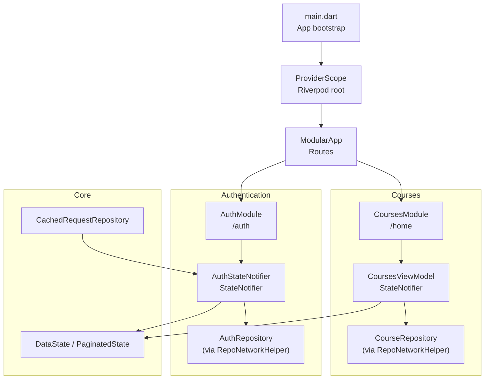
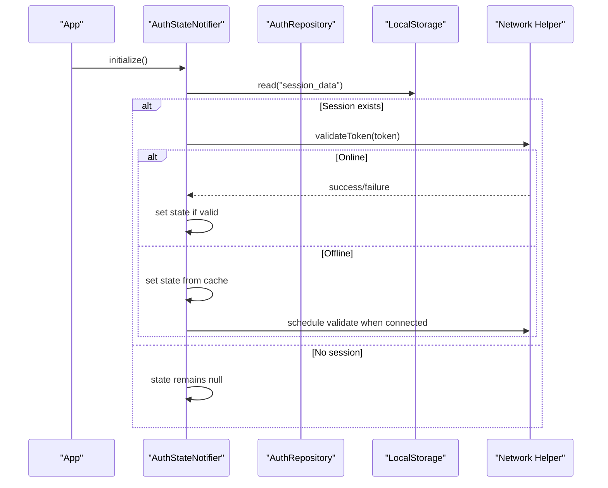
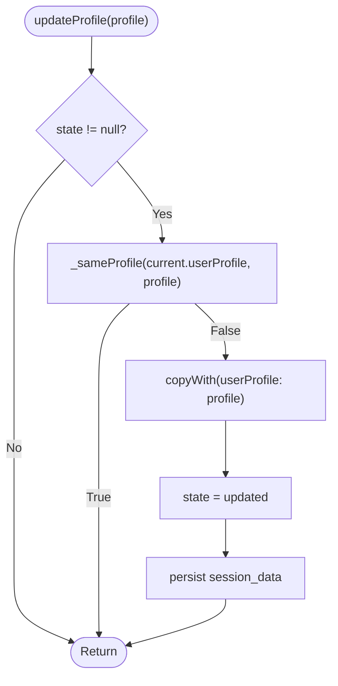
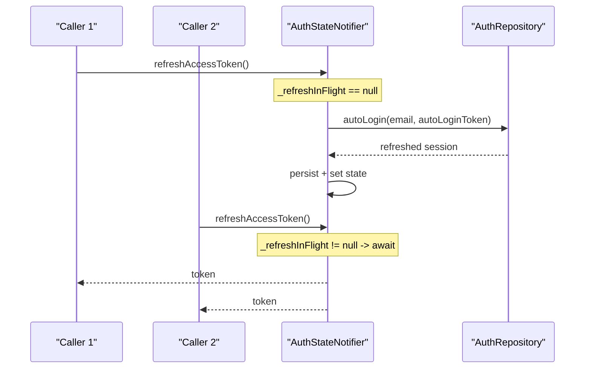
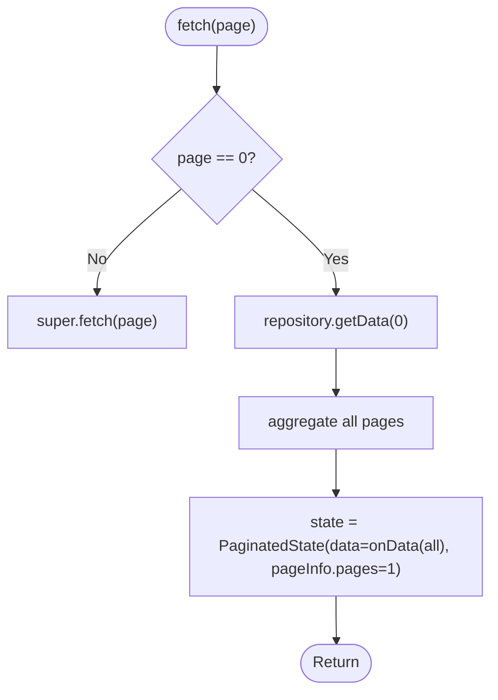
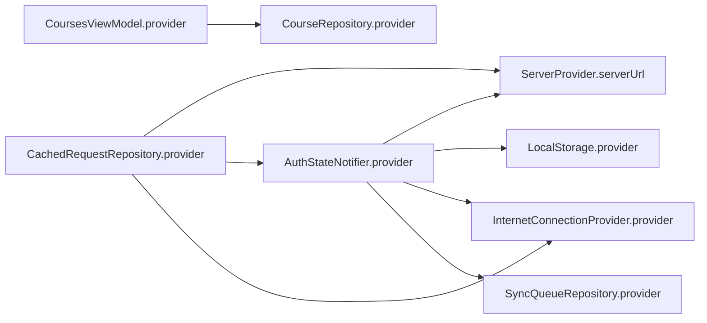

# Reactive State Updates & Change Detection

<cite>
**Referenced Files in This Document**
- [main.dart](file://lib/main.dart)
- [app_module.dart](file://lib/app_module.dart)
- [auth_state_provider.dart](file://lib/app/features/authentication/app_state/auth_state_provider.dart)
- [auth_state.dart](file://lib/app/features/authentication/model/auth_state.dart)
- [courses_view_model.dart](file://lib/app/features/courses/viewmodel/courses_view_model.dart)
- [cached_request_repository.dart](file://lib/app/core/logic/repository/cached_request_repository.dart)
- [data_state.dart](file://lib/app/core/logic/data_state/data_state.dart)
- [pubspec.yaml](file://pubspec.yaml)
</cite>

## Table of Contents
1. Introduction
2. Project Structure
3. Core Components
4. Architecture Overview
5. Detailed Component Analysis
6. Dependency Analysis
7. Performance Considerations
8. Troubleshooting Guide
9. Conclusion

## Introduction
This document explains reactive state update mechanisms using Riverpod’s StateNotifier pattern as implemented in the project. It focuses on change detection algorithms, efficient UI re-rendering strategies, and selective provider updates. It documents the AuthStateNotifier implementation with profile update optimization, concurrent request deduplication, and memory-safe lifecycle handling. It also covers courses view model patterns for course data management and progress tracking, provides guidance on custom providers, optimizing rebuild performance, debugging state changes, and addresses common pitfalls such as unnecessary rebuilds, circular dependencies, and memory management in long-running applications.

## Project Structure
The application is a Flutter app that uses Riverpod via ProviderScope to manage global state, Modular for routing, and feature-based modules for authentication and courses. The core state logic lives under lib/app/features and shared utilities under lib/app/core.

**Diagram sources**
- [main.dart:16-38](file://lib/main.dart#L16-L38)
- [app_module.dart:7-19](file://lib/app_module.dart#L7-L19)
- [auth_state_provider.dart:15-25](file://lib/app/features/authentication/app_state/auth_state_provider.dart#L15-L25)
- [courses_view_model.dart:9-15](file://lib/app/features/courses/viewmodel/courses_view_model.dart#L9-L15)
- [cached_request_repository.dart:9-18](file://lib/app/core/logic/repository/cached_request_repository.dart#L9-L18)
- [data_state.dart:1-22](file://lib/app/core/logic/data_state/data_state.dart#L1-L22)

**Section sources**
- [main.dart:16-38](file://lib/main.dart#L16-L38)
- [app_module.dart:7-19](file://lib/app_module.dart#L7-L19)
- [pubspec.yaml:30-44](file://pubspec.yaml#L30-L44)

## Core Components
- AuthStateNotifier: Manages authenticated session, profile caching, token refresh, and initialization. Implements profile equality checks to avoid redundant state replacements and deduplicates concurrent auto-login attempts.
- CoursesViewModel: Manages paginated course data, with an optimized initial fetch that aggregates all pages for filtering capabilities.
- DataState/PaginatedState: Standardized state containers used by view models to represent loading, data, and error states.
- CachedRequestRepository: Provides network helpers with optional caching and integrates with Riverpod providers for configuration and auth tokens.

Key responsibilities:
- Change detection: Use of copyWith and explicit equality checks to minimize state churn.
- Selective updates: Profile updates only when fields actually changed; token refresh only when necessary.
- Efficient UI re-renders: Avoid unnecessary rebuilds by returning early when no meaningful change occurs.

**Section sources**
- [auth_state_provider.dart:15-203](file://lib/app/features/authentication/app_state/auth_state_provider.dart#L15-L203)
- [courses_view_model.dart:9-49](file://lib/app/features/courses/viewmodel/courses_view_model.dart#L9-L49)
- [data_state.dart:1-22](file://lib/app/core/logic/data_state/data_state.dart#L1-L22)
- [cached_request_repository.dart:9-32](file://lib/app/core/logic/repository/cached_request_repository.dart#L9-L32)

## Architecture Overview
Riverpod’s ProviderScope wraps the app to enable reactive state. Feature modules register their own providers (e.g., AuthStateNotifier.provider, CoursesViewModel.provider). View models depend on repositories which use network helpers and may leverage cached requests. Authentication state is persisted and restored at startup, with validation against the server when online.

**Diagram sources**
- [auth_state_provider.dart:164-201](file://lib/app/features/authentication/app_state/auth_state_provider.dart#L164-L201)

## Detailed Component Analysis

### AuthStateNotifier: Reactive Authentication State
Responsibilities:
- Login with email/password or restore session from storage.
- Keep app-wide profile in sync with edits made elsewhere.
- Deduplicate concurrent token refresh calls.
- Initialize and validate sessions on startup.

Change detection and efficiency:
- Profile updates are guarded by a field-level equality check to prevent unnecessary state replacement when nothing has changed. This avoids infinite rebuild loops caused by downstream watchers triggering repeated fetches.
- Token refresh is wrapped in an in-flight guard to coalesce concurrent 401-driven refresh attempts into a single request.

Memory safety:
- Uses mounted checks before setting state to avoid updating after disposal.
- Clears queued offline completions on logout to prevent cross-session leakage.

**Diagram sources**
- [auth_state_provider.dart:79-112](file://lib/app/features/authentication/app_state/auth_state_provider.dart#L79-L112)

Concurrent refresh deduplication:
- A single in-flight promise is stored while refreshing; subsequent callers await the same promise until completion.

**Diagram sources**
- [auth_state_provider.dart:114-150](file://lib/app/features/authentication/app_state/auth_state_provider.dart#L114-L150)

**Section sources**
- [auth_state_provider.dart:15-203](file://lib/app/features/authentication/app_state/auth_state_provider.dart#L15-L203)
- [auth_state.dart:12-93](file://lib/app/features/authentication/model/auth_state.dart#L12-L93)

### CoursesViewModel: Course Data Management and Progress Tracking
Responsibilities:
- Fetch and aggregate course data across pages for full-list filtering.
- Maintain paginated state with loading/error/data variants.

Optimization strategy:
- On page 0, fetch all pages sequentially and merge results into a single list, then present it as a single-page dataset to simplify filtering and progress tracking.
- Subsequent pages delegate to base behavior for incremental loading.

**Diagram sources**
- [courses_view_model.dart:19-47](file://lib/app/features/courses/viewmodel/courses_view_model.dart#L19-L47)

**Section sources**
- [courses_view_model.dart:9-49](file://lib/app/features/courses/viewmodel/courses_view_model.dart#L9-L49)
- [data_state.dart:1-22](file://lib/app/core/logic/data_state/data_state.dart#L1-L22)

### Custom Providers and Selective Updates
- AuthStateNotifier.provider: A StateNotifierProvider that wires dependencies (server URL, local storage, internet connection, sync queue) and returns a configured notifier instance.
- CoursesViewModel.provider: A StateNotifierProvider that injects the repository and returns the view model.
- CachedRequestRepository.provider: A Provider that configures network helper with current server URL, auth token, and connectivity status.

Selective updates:
- Prefer ref.read for one-time reads where appropriate to avoid rebuilding when the watched value changes.
- Guard state mutations with equality checks to prevent unnecessary notifications.

**Section sources**
- [auth_state_provider.dart:15-25](file://lib/app/features/authentication/app_state/auth_state_provider.dart#L15-L25)
- [courses_view_model.dart:9-15](file://lib/app/features/courses/viewmodel/courses_view_model.dart#L9-L15)
- [cached_request_repository.dart:9-18](file://lib/app/core/logic/repository/cached_request_repository.dart#L9-L18)

## Dependency Analysis
Riverpod manages dependency injection and lifecycle. Providers declare their dependencies via ref.watch/ref.read, enabling fine-grained reactivity.

**Diagram sources**
- [auth_state_provider.dart:15-25](file://lib/app/features/authentication/app_state/auth_state_provider.dart#L15-L25)
- [courses_view_model.dart:9-15](file://lib/app/features/courses/viewmodel/courses_view_model.dart#L9-L15)
- [cached_request_repository.dart:9-18](file://lib/app/core/logic/repository/cached_request_repository.dart#L9-L18)

**Section sources**
- [auth_state_provider.dart:15-25](file://lib/app/features/authentication/app_state/auth_state_provider.dart#L15-L25)
- [courses_view_model.dart:9-15](file://lib/app/features/courses/viewmodel/courses_view_model.dart#L9-L15)
- [cached_request_repository.dart:9-18](file://lib/app/core/logic/repository/cached_request_repository.dart#L9-L18)

## Performance Considerations
- Minimize state churn: Use equality checks before replacing state to avoid unnecessary rebuilds.
- Coalesce concurrent operations: Deduplicate token refresh to reduce network load and contention.
- Aggregate data efficiently: For lists requiring full visibility (e.g., My Courses), fetch once and merge to simplify client-side filtering.
- Prefer ref.read for non-reactive reads to break rebuild chains.
- Avoid heavy computations inside build methods; move to providers or memoized values.

[No sources needed since this section provides general guidance]

## Troubleshooting Guide
Common issues and remedies:
- Unnecessary rebuild loops: Ensure equality checks before state replacement (e.g., profile updates). If a watcher triggers repeated fetches, switch to ref.read where suitable.
- Concurrent refresh storms: Rely on in-flight guards to coalesce multiple refresh attempts into one.
- Memory leaks: Always check mounted before setting state; clear queues on logout to avoid cross-session contamination.
- Circular dependencies: Break cycles by reading providers with ref.read instead of ref.watch where possible, and by structuring providers to avoid mutual watches.

Debugging tips:
- Log state transitions around key methods (login, updateProfile, fetch).
- Use Riverpod DevTools to inspect provider dependencies and rebuild counts.
- Isolate problematic rebuilds by temporarily switching to ref.read to confirm whether a watch is causing cascading updates.

**Section sources**
- [auth_state_provider.dart:79-112](file://lib/app/features/authentication/app_state/auth_state_provider.dart#L79-L112)
- [auth_state_provider.dart:114-150](file://lib/app/features/authentication/app_state/auth_state_provider.dart#L114-L150)
- [auth_state_provider.dart:152-162](file://lib/app/features/authentication/app_state/auth_state_provider.dart#L152-L162)

## Conclusion
The application leverages Riverpod’s StateNotifier pattern to implement robust, efficient reactive state management. AuthStateNotifier ensures safe, minimal updates with profile equality checks and concurrent refresh deduplication. CoursesViewModel optimizes data fetching for full-list scenarios. By combining careful change detection, selective provider updates, and disciplined lifecycle handling, the system achieves responsive UIs and predictable state behavior even in long-running applications.

[No sources needed since this section summarizes without analyzing specific files]