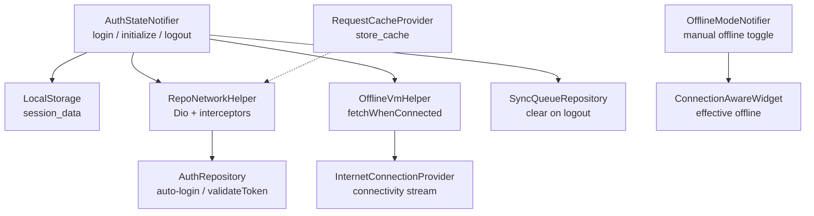
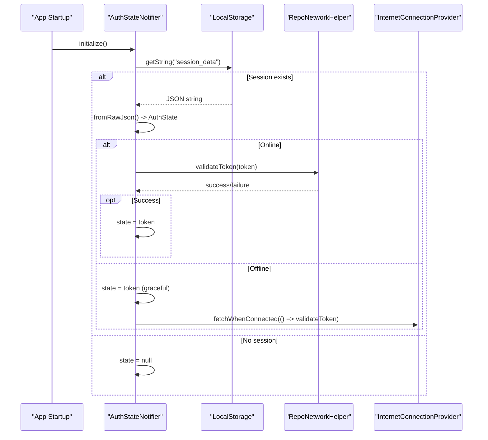
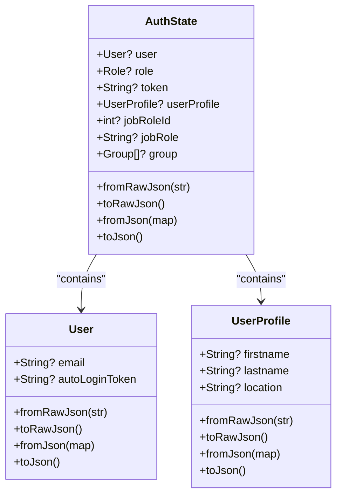
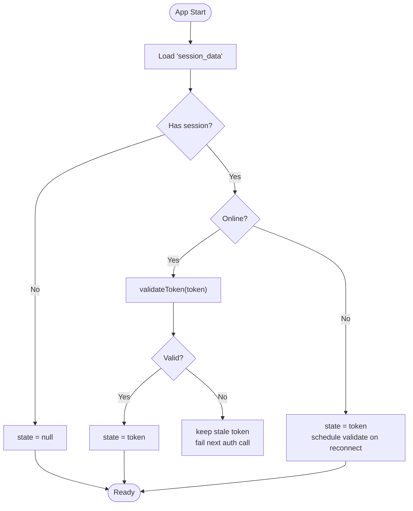
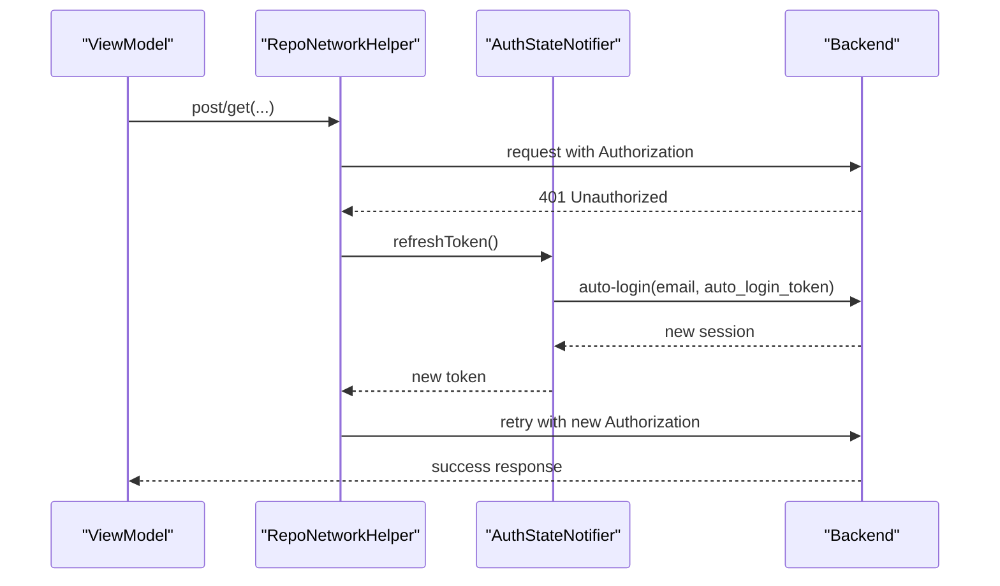
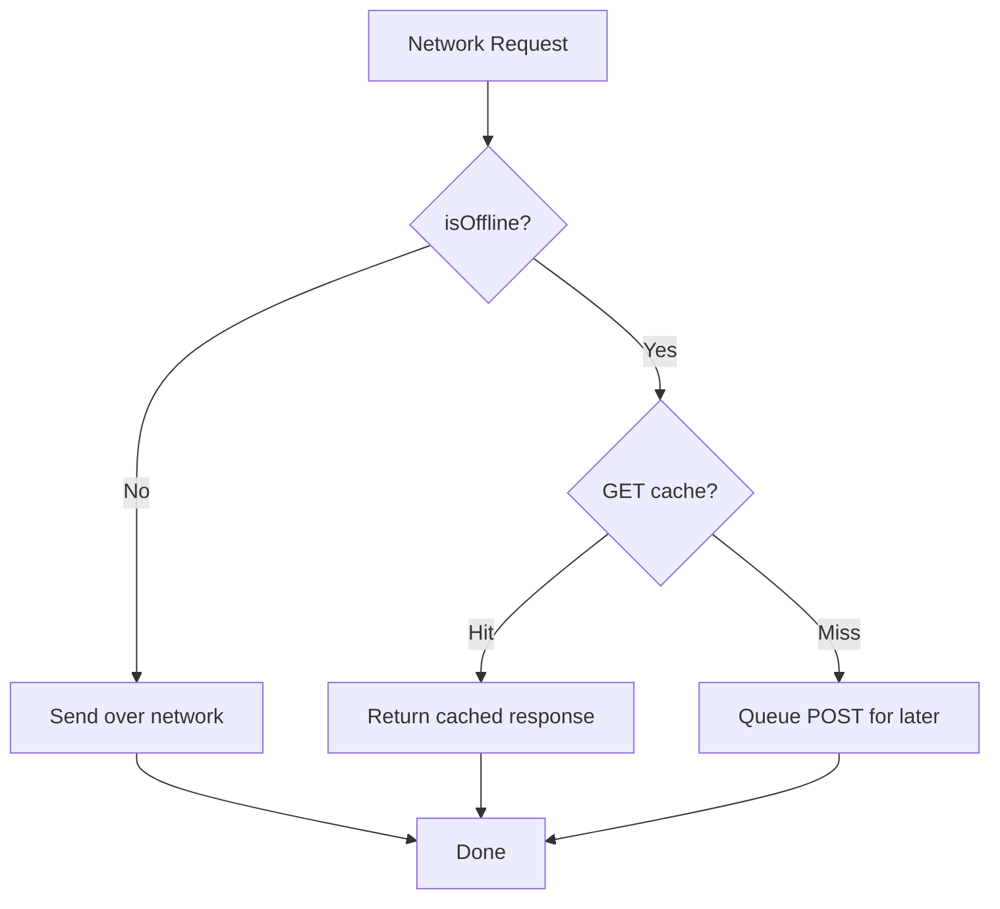
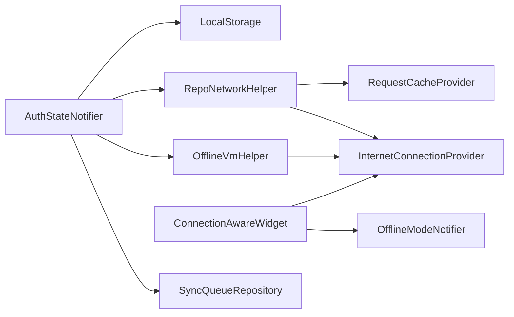

# State Persistence & Recovery

<cite>
**Referenced Files in This Document**
- [auth_state_provider.dart](file://lib/app/features/authentication/app_state/auth_state_provider.dart)
- [auth_state.dart](file://lib/app/features/authentication/model/auth_state.dart)
- [local_storage_provider.dart](file://lib/app/core/provider/local_storage_provider.dart)
- [repo_network_helper.dart](file://lib/app/core/logic/repository/repo_network_helper.dart)
- [internet_connection_provider.dart](file://lib/app/core/provider/internet_connection_provider.dart)
- [offline_vm_helper.dart](file://lib/app/core/logic/vm_helper/offline_vm_helper.dart)
- [offline_mode_provider.dart](file://lib/app/core/provider/offline_mode_provider.dart)
- [connection_aware_widget.dart](file://lib/app/core/views/elements/connection_aware_widget.dart)
- [request_cache_provider.dart](file://lib/app/core/provider/request_cache_provider.dart)
- [sync_queue_repository.dart](file://lib/app/features/courses/repository/sync_queue_repository.dart)
</cite>

## Table of Contents
1. Introduction
2. Project Structure
3. Core Components
4. Architecture Overview
5. Detailed Component Analysis
6. Dependency Analysis
7. Performance Considerations
8. Troubleshooting Guide
9. Conclusion
10. Appendices

## Introduction
This document explains how the application persists and recovers authentication state across app restarts, manages sessions, handles offline scenarios, and refreshes tokens automatically. It covers JSON serialization of AuthState, LocalStorage abstraction for cross-platform persistence, token validation and auto-refresh logic, graceful degradation when offline, and guidance for implementing custom state persistence, migrations, data integrity, security considerations, and backup/restore strategies.

## Project Structure
The state persistence and recovery system spans several layers:
- Authentication state model and serialization (AuthState, User, UserProfile)
- State management and lifecycle (AuthStateNotifier)
- Cross-platform storage (LocalStorage via Hive)
- Network layer with offline support and token refresh (RepoNetworkHelper)
- Connectivity detection and manual offline mode (InternetConnectionProvider, OfflineModeNotifier)
- UI integration for connectivity-aware rendering (ConnectionAwareWidget)
- Request caching and sync queue for offline operations (RequestCacheProvider, SyncQueueRepository)

**Diagram sources**
- [auth_state_provider.dart:42-69](file://lib/app/features/authentication/app_state/auth_state_provider.dart#L42-L69)
- [auth_state_provider.dart:168-201](file://lib/app/features/authentication/app_state/auth_state_provider.dart#L168-L201)
- [local_storage_provider.dart:13-28](file://lib/app/core/provider/local_storage_provider.dart#L13-L28)
- [repo_network_helper.dart:79-126](file://lib/app/core/logic/repository/repo_network_helper.dart#L79-L126)
- [internet_connection_provider.dart:18-36](file://lib/app/core/provider/internet_connection_provider.dart#L18-L36)
- [offline_vm_helper.dart:11-29](file://lib/app/core/logic/vm_helper/offline_vm_helper.dart#L11-L29)
- [offline_mode_provider.dart:11-35](file://lib/app/core/provider/offline_mode_provider.dart#L11-L35)
- [connection_aware_widget.dart:25-34](file://lib/app/core/views/elements/connection_aware_widget.dart#L25-L34)
- [request_cache_provider.dart:46-78](file://lib/app/core/provider/request_cache_provider.dart#L46-L78)

**Section sources**
- [auth_state_provider.dart:42-69](file://lib/app/features/authentication/app_state/auth_state_provider.dart#L42-L69)
- [auth_state_provider.dart:168-201](file://lib/app/features/authentication/app_state/auth_state_provider.dart#L168-L201)
- [local_storage_provider.dart:13-28](file://lib/app/core/provider/local_storage_provider.dart#L13-L28)
- [repo_network_helper.dart:79-126](file://lib/app/core/logic/repository/repo_network_helper.dart#L79-L126)
- [internet_connection_provider.dart:18-36](file://lib/app/core/provider/internet_connection_provider.dart#L18-L36)
- [offline_vm_helper.dart:11-29](file://lib/app/core/logic/vm_helper/offline_vm_helper.dart#L11-L29)
- [offline_mode_provider.dart:11-35](file://lib/app/core/provider/offline_mode_provider.dart#L11-L35)
- [connection_aware_widget.dart:25-34](file://lib/app/core/views/elements/connection_aware_widget.dart#L25-L34)
- [request_cache_provider.dart:46-78](file://lib/app/core/provider/request_cache_provider.dart#L46-L78)

## Core Components
- AuthState model: Defines serializable structures for user session data including tokens and profile, with robust JSON parsing that tolerates multiple field names and nulls.
- AuthStateNotifier: Manages login, logout, initialization, token refresh, and profile updates; persists session to LocalStorage and validates tokens on startup or reconnect.
- LocalStorage: A cross-platform key-value store backed by Hive, initialized per platform and opened as a named box for consistent data isolation.
- RepoNetworkHelper: HTTP client wrapper with Dio, timeouts, offline gating, request caching hooks, and automatic 401 retry using a provided refresh callback.
- InternetConnectionProvider: Detects connectivity by probing the app server and a reliable DNS endpoint; exposes a stream and debounced change notifications.
- OfflineVmHelper: Registers callbacks to run when connectivity is restored, enabling deferred validation or sync after reconnection.
- OfflineModeNotifier: Persists a user-controlled “Go Offline” toggle that forces offline behavior even if the network is available.
- ConnectionAwareWidget: Renders different UI based on effective offline state (physical or manual).
- RequestCacheProvider: Stores GET/POST requests and responses locally to serve or replay them when offline.
- SyncQueueRepository: Queues background tasks and is cleared on logout to prevent cross-user contamination.

**Section sources**
- [auth_state.dart:12-93](file://lib/app/features/authentication/model/auth_state.dart#L12-L93)
- [auth_state_provider.dart:15-69](file://lib/app/features/authentication/app_state/auth_state_provider.dart#L15-L69)
- [local_storage_provider.dart:6-48](file://lib/app/core/provider/local_storage_provider.dart#L6-L48)
- [repo_network_helper.dart:31-126](file://lib/app/core/logic/repository/repo_network_helper.dart#L31-L126)
- [internet_connection_provider.dart:9-36](file://lib/app/core/provider/internet_connection_provider.dart#L9-L36)
- [offline_vm_helper.dart:5-29](file://lib/app/core/logic/vm_helper/offline_vm_helper.dart#L5-L29)
- [offline_mode_provider.dart:11-35](file://lib/app/core/provider/offline_mode_provider.dart#L11-L35)
- [connection_aware_widget.dart:16-34](file://lib/app/core/views/elements/connection_aware_widget.dart#L16-L34)
- [request_cache_provider.dart:46-78](file://lib/app/core/provider/request_cache_provider.dart#L46-L78)
- [sync_queue_repository.dart:1-200](file://lib/app/features/courses/repository/sync_queue_repository.dart#L1-L200)

## Architecture Overview
The system combines persistent session storage, connectivity awareness, and resilient networking to ensure seamless recovery after restarts and offline periods.

**Diagram sources**
- [auth_state_provider.dart:168-201](file://lib/app/features/authentication/app_state/auth_state_provider.dart#L168-L201)
- [auth_state.dart:53-56](file://lib/app/features/authentication/model/auth_state.dart#L53-L56)
- [repo_network_helper.dart:353-394](file://lib/app/core/logic/repository/repo_network_helper.dart#L353-L394)
- [internet_connection_provider.dart:51-61](file://lib/app/core/provider/internet_connection_provider.dart#L51-L61)

## Detailed Component Analysis

### AuthState Serialization and Deserialization
- The AuthState model provides toJson/fromJson and raw JSON helpers to persist and restore the full session, including nested objects like User and UserProfile.
- Parsing is tolerant to alternate field names and missing values, improving resilience against API changes.
- copyWith enables immutable updates while preserving identity semantics for Riverpod state.

**Diagram sources**
- [auth_state.dart:12-93](file://lib/app/features/authentication/model/auth_state.dart#L12-L93)
- [auth_state.dart:132-380](file://lib/app/features/authentication/model/auth_state.dart#L132-L380)
- [auth_state.dart:382-672](file://lib/app/features/authentication/model/auth_state.dart#L382-L672)

**Section sources**
- [auth_state.dart:53-93](file://lib/app/features/authentication/model/auth_state.dart#L53-L93)
- [auth_state.dart:295-380](file://lib/app/features/authentication/model/auth_state.dart#L295-L380)
- [auth_state.dart:550-672](file://lib/app/features/authentication/model/auth_state.dart#L550-L672)

### Session Management and App Lifecycle Handling
- On login, the authenticated session is persisted under a stable key and applied to state.
- On app start, initialize loads any stored session, applies it immediately when offline, and validates it when online or upon reconnection.
- Logout clears the stored session and any queued offline completions to avoid leaking state between users.

**Diagram sources**
- [auth_state_provider.dart:168-201](file://lib/app/features/authentication/app_state/auth_state_provider.dart#L168-L201)
- [offline_vm_helper.dart:11-29](file://lib/app/core/logic/vm_helper/offline_vm_helper.dart#L11-L29)

**Section sources**
- [auth_state_provider.dart:42-69](file://lib/app/features/authentication/app_state/auth_state_provider.dart#L42-L69)
- [auth_state_provider.dart:152-162](file://lib/app/features/authentication/app_state/auth_state_provider.dart#L152-L162)
- [auth_state_provider.dart:168-201](file://lib/app/features/authentication/app_state/auth_state_provider.dart#L168-L201)

### Token Validation and Auto-Refresh Logic
- When a network request receives a 401, RepoNetworkHelper invokes the provided refreshToken callback once per request to obtain a new access token and retries the original request with updated headers.
- AuthStateNotifier.refreshAccessToken uses the stored auto_login_token to call the backend’s auto-login endpoint, then persists and applies the refreshed session.
- On startup, _validateCurrentToken attempts to validate the stored token; if invalid, it leaves the stale token in place so subsequent authenticated calls surface the expected error flow.

**Diagram sources**
- [repo_network_helper.dart:88-126](file://lib/app/core/logic/repository/repo_network_helper.dart#L88-L126)
- [auth_state_provider.dart:114-150](file://lib/app/features/authentication/app_state/auth_state_provider.dart#L114-L150)

**Section sources**
- [repo_network_helper.dart:88-126](file://lib/app/core/logic/repository/repo_network_helper.dart#L88-L126)
- [auth_state_provider.dart:114-150](file://lib/app/features/authentication/app_state/auth_state_provider.dart#L114-L150)
- [auth_state_provider.dart:186-201](file://lib/app/features/authentication/app_state/auth_state_provider.dart#L186-L201)

### Offline Graceful Degradation
- Effective offline state considers both physical connectivity and the manual “Go Offline” toggle.
- Network methods short-circuit to cached GET responses or queue POST requests when offline; they resume on reconnect.
- AuthStateNotifier defers token validation until connectivity returns, keeping the UI responsive.

**Diagram sources**
- [repo_network_helper.dart:257-350](file://lib/app/core/logic/repository/repo_network_helper.dart#L257-L350)
- [request_cache_provider.dart:46-78](file://lib/app/core/provider/request_cache_provider.dart#L46-L78)
- [connection_aware_widget.dart:25-34](file://lib/app/core/views/elements/connection_aware_widget.dart#L25-L34)

**Section sources**
- [repo_network_helper.dart:257-350](file://lib/app/core/logic/repository/repo_network_helper.dart#L257-L350)
- [request_cache_provider.dart:46-78](file://lib/app/core/provider/request_cache_provider.dart#L46-L78)
- [connection_aware_widget.dart:25-34](file://lib/app/core/views/elements/connection_aware_widget.dart#L25-L34)

### LocalStorage Provider Abstraction
- Provides a simple key-value interface backed by Hive with platform-specific initialization.
- Ensures the box is open before reads/writes and supports arbitrary keys such as session_data and store_cache.

**Section sources**
- [local_storage_provider.dart:6-48](file://lib/app/core/provider/local_storage_provider.dart#L6-L48)

### Custom State Persistence Implementation
To implement a custom persistence strategy:
- Replace LocalStorage with your own implementation exposing the same async getString/setString contract.
- Ensure keys remain stable (e.g., "session_data", "store_cache") or migrate consumers to new keys.
- For encryption, wrap the provider to encrypt/decrypt values at read/write boundaries.
- For migration, detect version changes and transform stored JSON into the current schema before use.

[No sources needed since this section provides general guidance]

### Migration Scenarios and Data Integrity
- Use versioned keys or a metadata entry to track schema versions.
- On load, attempt to parse stored JSON; on failure, fallback to safe defaults and clear corrupted entries.
- Validate tokens on startup; if invalid, keep stale state only long enough for the next authenticated call to fail gracefully.

**Section sources**
- [auth_state_provider.dart:168-201](file://lib/app/features/authentication/app_state/auth_state_provider.dart#L168-L201)
- [auth_state_provider.dart:42-69](file://lib/app/features/authentication/app_state/auth_state_provider.dart#L42-L69)

### Security Considerations and Backup/Restore
- Sensitive data (tokens, auto_login_token) are stored in plain text in Hive. For enhanced security:
  - Encrypt values at rest using a secure key derivation and store ciphertext instead of plaintext.
  - Limit exposure by clearing sensitive fields on logout and ensuring logs do not print tokens.
- Backup/restore:
  - Export/import the Hive box contents or specific keys to enable user-driven backups.
  - Validate integrity on restore and handle partial or corrupted backups gracefully.

[No sources needed since this section provides general guidance]

## Dependency Analysis
The following diagram shows how components depend on each other to achieve persistence and recovery.

**Diagram sources**
- [auth_state_provider.dart:15-37](file://lib/app/features/authentication/app_state/auth_state_provider.dart#L15-L37)
- [local_storage_provider.dart:6-48](file://lib/app/core/provider/local_storage_provider.dart#L6-L48)
- [repo_network_helper.dart:72-126](file://lib/app/core/logic/repository/repo_network_helper.dart#L72-L126)
- [internet_connection_provider.dart:9-36](file://lib/app/core/provider/internet_connection_provider.dart#L9-L36)
- [offline_vm_helper.dart:5-29](file://lib/app/core/logic/vm_helper/offline_vm_helper.dart#L5-L29)
- [connection_aware_widget.dart:16-34](file://lib/app/core/views/elements/connection_aware_widget.dart#L16-L34)
- [offline_mode_provider.dart:11-35](file://lib/app/core/provider/offline_mode_provider.dart#L11-L35)
- [request_cache_provider.dart:46-78](file://lib/app/core/provider/request_cache_provider.dart#L46-L78)
- [sync_queue_repository.dart:1-200](file://lib/app/features/courses/repository/sync_queue_repository.dart#L1-L200)

**Section sources**
- [auth_state_provider.dart:15-37](file://lib/app/features/authentication/app_state/auth_state_provider.dart#L15-L37)
- [repo_network_helper.dart:72-126](file://lib/app/core/logic/repository/repo_network_helper.dart#L72-L126)
- [internet_connection_provider.dart:9-36](file://lib/app/core/provider/internet_connection_provider.dart#L9-L36)
- [offline_vm_helper.dart:5-29](file://lib/app/core/logic/vm_helper/offline_vm_helper.dart#L5-L29)
- [connection_aware_widget.dart:16-34](file://lib/app/core/views/elements/connection_aware_widget.dart#L16-L34)
- [offline_mode_provider.dart:11-35](file://lib/app/core/provider/offline_mode_provider.dart#L11-L35)
- [request_cache_provider.dart:46-78](file://lib/app/core/provider/request_cache_provider.dart#L46-L78)
- [sync_queue_repository.dart:1-200](file://lib/app/features/courses/repository/sync_queue_repository.dart#L1-L200)

## Performance Considerations
- Token refresh is deduplicated in-flight to avoid redundant network calls during concurrent 401 events.
- Connectivity checks are idempotent and avoid duplicate listeners to prevent excessive probing.
- Timeouts are set on the HTTP client to prevent indefinite hangs.
- Offline mode avoids unnecessary network calls and serves cached data where possible.

[No sources needed since this section provides general guidance]

## Troubleshooting Guide
Common issues and resolutions:
- Stale session after restart:
  - Verify initialize runs and loads session_data; check that validateToken is called when online or on reconnect.
- Repeated 401 loops:
  - Ensure refreshToken callback is provided and returns a valid token; confirm interceptor marks retried requests to prevent infinite retries.
- Offline features not working:
  - Confirm isManualOffline and isConnected are correctly combined; verify cache population and flush on reconnect.
- Profile not updating globally:
  - Ensure updateProfile is called and persisted; check equality logic to avoid unnecessary rebuilds.

**Section sources**
- [auth_state_provider.dart:168-201](file://lib/app/features/authentication/app_state/auth_state_provider.dart#L168-L201)
- [repo_network_helper.dart:88-126](file://lib/app/core/logic/repository/repo_network_helper.dart#L88-L126)
- [connection_aware_widget.dart:25-34](file://lib/app/core/views/elements/connection_aware_widget.dart#L25-L34)
- [auth_state_provider.dart:71-99](file://lib/app/features/authentication/app_state/auth_state_provider.dart#L71-L99)

## Conclusion
The application implements a robust state persistence and recovery system centered around JSON-serialized AuthState, a cross-platform LocalStorage abstraction, and a resilient network layer with automatic token refresh and offline support. By combining connectivity awareness, deferred validation, and careful cleanup on logout, the app maintains a consistent user experience across restarts and network conditions. For production hardening, consider encrypting sensitive data, adding versioned migrations, and implementing backup/restore workflows.

## Appendices

### Example Workflows

#### Implementing Custom State Persistence
- Create a provider that mirrors LocalStorage’s async getString/setString interface.
- Integrate encryption at read/write boundaries.
- Add version checks and migration logic to transform legacy formats.

[No sources needed since this section provides general guidance]

#### Handling Migration Scenarios
- Detect schema version from stored metadata or key naming conventions.
- Attempt to parse existing data; on failure, reset to safe defaults and log migration events.
- Validate tokens after migration to ensure consistency.

[No sources needed since this section provides general guidance]

#### Ensuring Data Integrity Across Restarts
- Always validate persisted tokens on startup when online.
- Defer validation on offline until connectivity returns.
- Clear sensitive queues on logout to prevent cross-user leakage.

**Section sources**
- [auth_state_provider.dart:168-201](file://lib/app/features/authentication/app_state/auth_state_provider.dart#L168-L201)
- [auth_state_provider.dart:152-162](file://lib/app/features/authentication/app_state/auth_state_provider.dart#L152-L162)