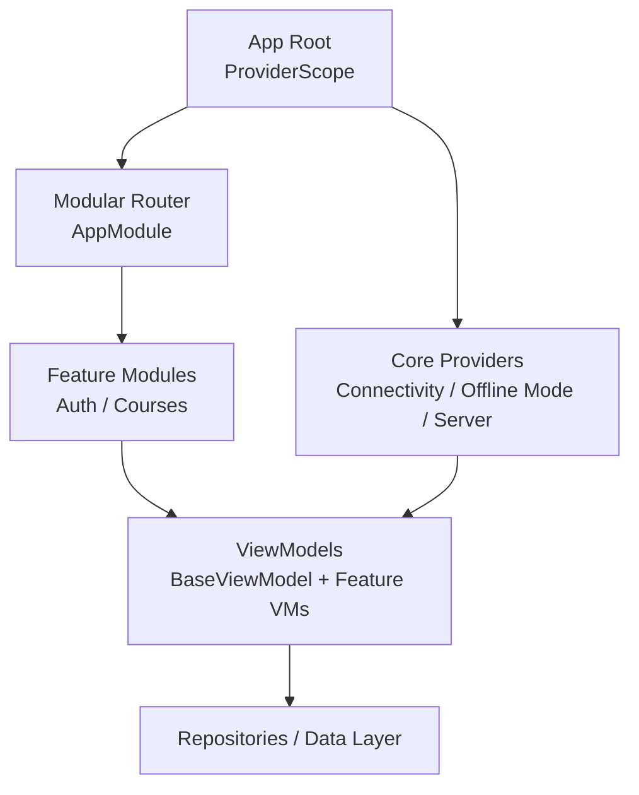
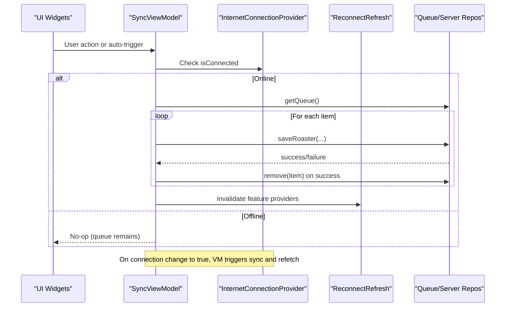
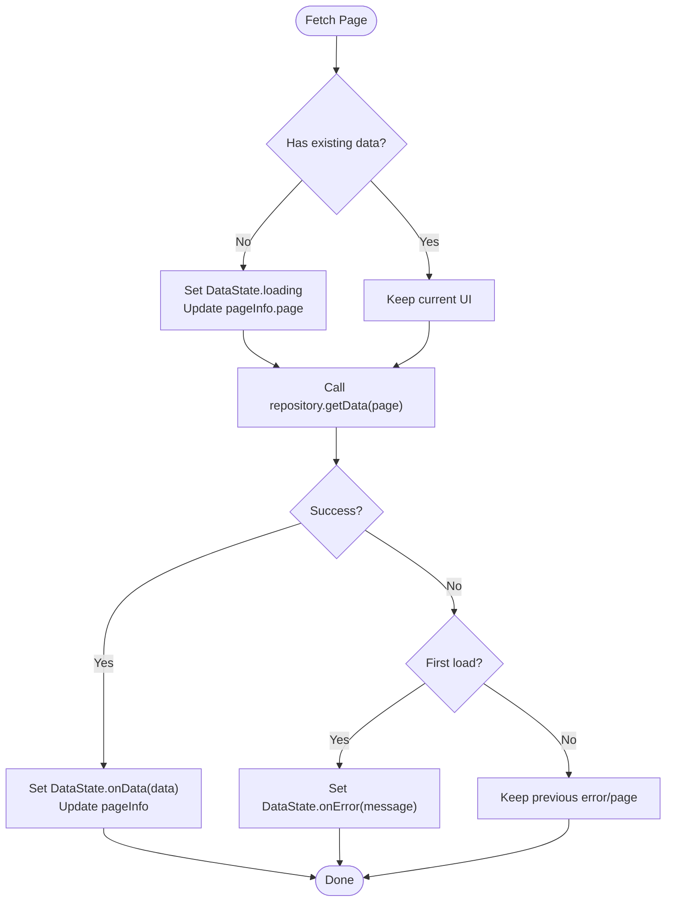
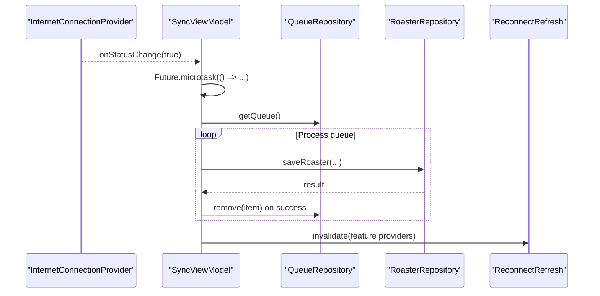
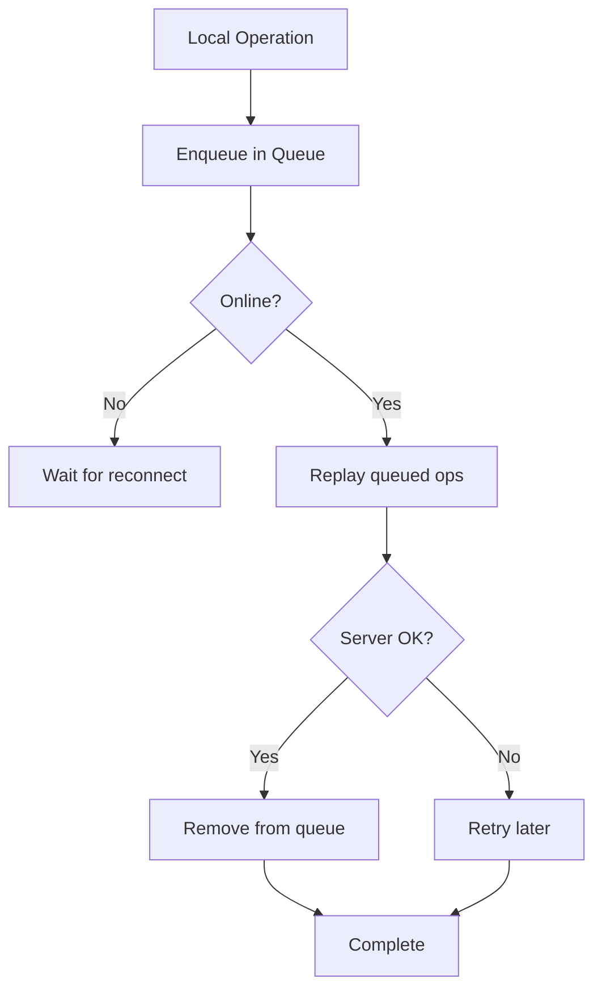
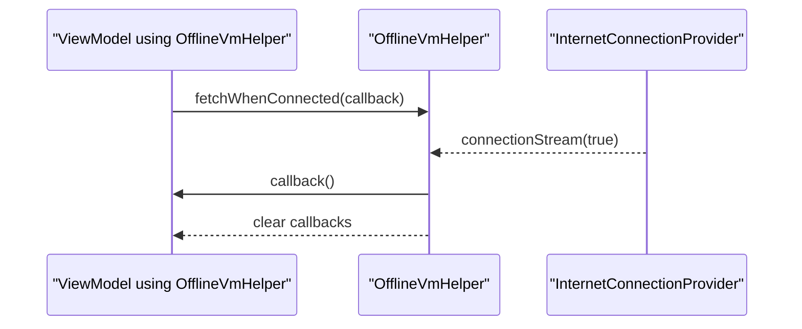
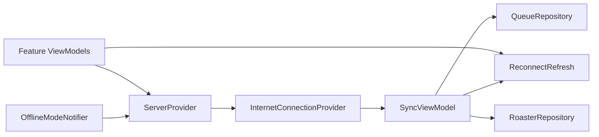

# State Synchronization & Updates

<cite>
**Referenced Files in This Document**
- [main.dart](file://lib/main.dart)
- [app_module.dart](file://lib/app_module.dart)
- [pubspec.yaml](file://pubspec.yaml)
- [internet_connection_provider.dart](file://lib/app/core/provider/internet_connection_provider.dart)
- [offline_mode_provider.dart](file://lib/app/core/provider/offline_mode_provider.dart)
- [server_provider.dart](file://lib/app/core/provider/server_provider.dart)
- [reconnect_refresh.dart](file://lib/app/core/provider/reconnect_refresh.dart)
- [base_view_model.dart](file://lib/app/core/logic/vm_helper/base_view_model.dart)
- [offline_vm_helper.dart](file://lib/app/core/logic/vm_helper/offline_vm_helper.dart)
- [data_state.dart](file://lib/app/core/logic/data_state/data_state.dart)
- [sync_view_model.dart](file://lib/app/features/courses/viewmodel/sync_view_model.dart)
- [flat_app_bar.dart](file://lib/app/core/views/elements/flat_app_bar.dart)
- [notifications_page.dart](file://lib/app/features/dashboard/view/notifications_page.dart)
- [notifications_view_model.dart](file://lib/app/features/dashboard/viewmodel/notifications_view_model.dart)
</cite>

## Table of Contents
1. [Introduction](#introduction)
2. [Project Structure](#project-structure)
3. [Core Components](#core-components)
4. [Architecture Overview](#architecture-overview)
5. [Detailed Component Analysis](#detailed-component-analysis)
6. [Dependency Analysis](#dependency-analysis)
7. [Performance Considerations](#performance-considerations)
8. [Troubleshooting Guide](#troubleshooting-guide)
9. [Conclusion](#conclusion)

## Introduction
This document explains how state synchronization and updates are implemented using Riverpod in this Flutter application. It covers reactive state updates, change detection, UI reactivity patterns, offline-first synchronization, conflict resolution strategies, data consistency across providers, integration with OfflineVmHelper for background sync, network connectivity handling, and state persistence. It also provides practical guidance for real-time updates, debouncing state changes, and optimizing re-render performance.

## Project Structure
The app uses Riverpod via ProviderScope at the root to enable reactive state throughout the widget tree. Modular routing is used to organize features, while core providers encapsulate cross-cutting concerns such as connectivity, offline mode, server configuration, and reconnect behavior. ViewModels implement business logic and expose state to the UI.

**Section sources**
- [main.dart:16-37](file://lib/main.dart#L16-L37)
- [app_module.dart:7-20](file://lib/app_module.dart#L7-L20)

## Core Components
- Connectivity provider: Tracks device connectivity with a robust check strategy and notifies listeners only on genuine state changes.
- Offline mode provider: Allows manual offline mode; influences request behavior and triggers sync when returning online.
- Server provider: Supplies runtime server configuration and integrates with offline mode and token refresh.
- Reconnect refresh: Invalidates multiple feature providers on reconnect to ensure fresh data.
- Base view model: Provides paginated state management with loading/data/error states and safe pagination UX.
- Offline VM helper: Queues callbacks to run when connectivity returns.
- Sync view model: Orchestrates queue-based sync and automatic refetch on reconnect.
- UI elements: Offline banner and header toggle integrate with sync and offline mode.

**Section sources**
- [internet_connection_provider.dart:9-99](file://lib/app/core/provider/internet_connection_provider.dart#L9-L99)
- [offline_mode_provider.dart:1-200](file://lib/app/core/provider/offline_mode_provider.dart)
- [server_provider.dart:24-39](file://lib/app/core/provider/server_provider.dart#L24-L39)
- [reconnect_refresh.dart:58-77](file://lib/app/core/provider/reconnect_refresh.dart#L58-L77)
- [base_view_model.dart:7-48](file://lib/app/core/logic/vm_helper/base_view_model.dart#L7-L48)
- [offline_vm_helper.dart:5-34](file://lib/app/core/logic/vm_helper/offline_vm_helper.dart#L5-L34)
- [sync_view_model.dart:28-138](file://lib/app/features/courses/viewmodel/sync_view_model.dart#L28-L138)
- [flat_app_bar.dart:91-125](file://lib/app/core/views/elements/flat_app_bar.dart#L91-L125)

## Architecture Overview
Riverpod drives reactive UI by watching providers that encapsulate state and side effects. Connectivity and offline mode are central to ensuring consistent data flow between local cache, queued operations, and the server. On reconnect, the system invalidates relevant providers to trigger refetches and flushes queued work.

**Diagram sources**
- [sync_view_model.dart:57-117](file://lib/app/features/courses/viewmodel/sync_view_model.dart#L57-L117)
- [internet_connection_provider.dart:55-79](file://lib/app/core/provider/internet_connection_provider.dart#L55-L79)
- [reconnect_refresh.dart:58-77](file://lib/app/core/provider/reconnect_refresh.dart#L58-L77)

## Detailed Component Analysis

### Reactive State Updates and Change Detection
- BaseViewModel wraps paginated data with DataState and PageInfo, preserving existing content during fetches and surfacing loading/error states only when appropriate.
- DataState enumerates lifecycle states (idle/loading/data/error), enabling precise UI reactions without unnecessary rebuilds.
- InternetConnectionProvider emits connection events and notifies listeners only on actual transitions, preventing spurious refreshes.

**Diagram sources**
- [base_view_model.dart:15-45](file://lib/app/core/logic/vm_helper/base_view_model.dart#L15-L45)
- [data_state.dart:1-22](file://lib/app/core/logic/data_state/data_state.dart#L1-L22)

**Section sources**
- [base_view_model.dart:7-48](file://lib/app/core/logic/vm_helper/base_view_model.dart#L7-L48)
- [data_state.dart:1-22](file://lib/app/core/logic/data_state/data_state.dart#L1-L22)
- [internet_connection_provider.dart:55-79](file://lib/app/core/provider/internet_connection_provider.dart#L55-L79)

### Offline-First State Synchronization
- SyncViewModel maintains a queue of pending operations and flushes them when online. It tracks syncing state, pending count, and last sync time.
- On connection restore, it defers sync and provider invalidation to a microtask to avoid modifying other providers during initialization.
- Manual offline mode can be toggled from the UI; switching back online triggers immediate sync and refetch.

**Diagram sources**
- [sync_view_model.dart:57-117](file://lib/app/features/courses/viewmodel/sync_view_model.dart#L57-L117)
- [reconnect_refresh.dart:58-77](file://lib/app/core/provider/reconnect_refresh.dart#L58-L77)

**Section sources**
- [sync_view_model.dart:28-138](file://lib/app/features/courses/viewmodel/sync_view_model.dart#L28-L138)
- [flat_app_bar.dart:91-125](file://lib/app/core/views/elements/flat_app_bar.dart#L91-L125)

### Conflict Resolution Strategies
- Queue-based approach: Each operation is enqueued locally and replayed until successful; failures keep items in the queue for retry.
- Idempotent client-side updates: Local notifications and lists are updated optimistically before persisting to the backend; if persistence fails, errors are surfaced without breaking UX.
- Reconnect invalidation: On reconnect, key providers are invalidated to reconcile local state with the latest server state.

**Diagram sources**
- [sync_view_model.dart:57-84](file://lib/app/features/courses/viewmodel/sync_view_model.dart#L57-L84)
- [notifications_view_model.dart:111-146](file://lib/app/features/dashboard/viewmodel/notifications_view_model.dart#L111-L146)

**Section sources**
- [sync_view_model.dart:57-84](file://lib/app/features/courses/viewmodel/sync_view_model.dart#L57-L84)
- [notifications_view_model.dart:111-146](file://lib/app/features/dashboard/viewmodel/notifications_view_model.dart#L111-L146)
- [reconnect_refresh.dart:58-77](file://lib/app/core/provider/reconnect_refresh.dart#L58-L77)

### Data Consistency Across Multiple Providers
- Centralized invalidation: On reconnect, a curated list of feature providers is invalidated to ensure all screens reflect fresh data.
- Family providers: Some providers use families; invalidation targets specific instances where needed.
- Server provider integration: Requests consult offline mode and token refresh closures to maintain consistent behavior across providers.

**Section sources**
- [reconnect_refresh.dart:58-77](file://lib/app/core/provider/reconnect_refresh.dart#L58-L77)
- [server_provider.dart:24-39](file://lib/app/core/provider/server_provider.dart#L24-L39)

### Integration with OfflineVmHelper
- OfflineVmHelper subscribes to connectivity changes and executes registered callbacks when the device comes online.
- ViewModels can register deferred fetches to run automatically after reconnect, simplifying background sync flows.

**Diagram sources**
- [offline_vm_helper.dart:5-34](file://lib/app/core/logic/vm_helper/offline_vm_helper.dart#L5-L34)
- [internet_connection_provider.dart:95-99](file://lib/app/core/provider/internet_connection_provider.dart#L95-L99)

**Section sources**
- [offline_vm_helper.dart:5-34](file://lib/app/core/logic/vm_helper/offline_vm_helper.dart#L5-L34)

### Network Connectivity Handling
- Connectivity checks target the app’s own server endpoint with a reliable fallback, avoiding false negatives during server outages.
- Listeners are notified only on genuine connectivity flips to prevent unnecessary refresh cycles.
- The provider initializes once and exposes both listener and stream APIs for flexible consumption.

**Section sources**
- [internet_connection_provider.dart:18-36](file://lib/app/core/provider/internet_connection_provider.dart#L18-L36)
- [internet_connection_provider.dart:55-79](file://lib/app/core/provider/internet_connection_provider.dart#L55-L79)
- [internet_connection_provider.dart:95-99](file://lib/app/core/provider/internet_connection_provider.dart#L95-L99)

### State Persistence and UI Reactivity
- Paginated state preserves user context during fetches, improving perceived performance.
- Notifications update local state immediately and then persist to the backend, providing responsive UI with eventual consistency.
- UI components react to provider changes through Riverpod watchers, ensuring minimal rebuilds.

**Section sources**
- [base_view_model.dart:15-45](file://lib/app/core/logic/vm_helper/base_view_model.dart#L15-L45)
- [notifications_view_model.dart:111-146](file://lib/app/features/dashboard/viewmodel/notifications_view_model.dart#L111-L146)
- [notifications_page.dart:29-50](file://lib/app/features/dashboard/view/notifications_page.dart#L29-L50)

## Dependency Analysis
Riverpod ties together connectivity, offline mode, server config, and feature providers. ViewModels depend on repositories and core providers to coordinate state and side effects.

**Diagram sources**
- [internet_connection_provider.dart:9-12](file://lib/app/core/provider/internet_connection_provider.dart#L9-L12)
- [server_provider.dart:24-39](file://lib/app/core/provider/server_provider.dart#L24-L39)
- [sync_view_model.dart:28-42](file://lib/app/features/courses/viewmodel/sync_view_model.dart#L28-L42)
- [reconnect_refresh.dart:58-77](file://lib/app/core/provider/reconnect_refresh.dart#L58-L77)

**Section sources**
- [internet_connection_provider.dart:9-12](file://lib/app/core/provider/internet_connection_provider.dart#L9-L12)
- [server_provider.dart:24-39](file://lib/app/core/provider/server_provider.dart#L24-L39)
- [sync_view_model.dart:28-42](file://lib/app/features/courses/viewmodel/sync_view_model.dart#L28-L42)
- [reconnect_refresh.dart:58-77](file://lib/app/core/provider/reconnect_refresh.dart#L58-L77)

## Performance Considerations
- Debounce rapid connectivity flaps: The connectivity provider already filters repeated status changes; pair with debounced refetch calls in high-frequency scenarios.
- Avoid rebuilding entire trees: Use selective watchers in widgets and split large providers into smaller ones to limit rebuild scope.
- Preserve UI during fetches: BaseViewModel keeps existing data visible while fetching, reducing jank.
- Batch invalidations: ReconnectRefresh invalidates only necessary providers to minimize unnecessary recomputations.
- Prefer streaming for frequent updates: Use streams for live updates (e.g., connectivity) instead of polling.

[No sources needed since this section provides general guidance]

## Troubleshooting Guide
- Spurious refreshes on stable connections: Ensure listeners are attached once and rely on the connectivity provider’s deduplication of status changes.
- Stale data after reconnect: Verify that reconnect invalidation includes all affected providers and that feature screens support pull-to-refresh or auto-refetch.
- Sync not starting: Confirm that the manual offline toggle is off and that the connectivity provider reports connected; check that SyncViewModel has access to queue and server repos.
- Errors during optimistic updates: Inspect local state updates and backend calls; handle failures gracefully and surface actionable messages.

**Section sources**
- [internet_connection_provider.dart:55-79](file://lib/app/core/provider/internet_connection_provider.dart#L55-L79)
- [reconnect_refresh.dart:58-77](file://lib/app/core/provider/reconnect_refresh.dart#L58-L77)
- [sync_view_model.dart:57-117](file://lib/app/features/courses/viewmodel/sync_view_model.dart#L57-L117)
- [notifications_view_model.dart:111-146](file://lib/app/features/dashboard/viewmodel/notifications_view_model.dart#L111-L146)

## Conclusion
This implementation leverages Riverpod to create a responsive, offline-first architecture. Connectivity-aware providers drive synchronized state updates, while queue-based sync ensures reliability under intermittent networks. BaseViewModels provide predictable paginated state, and centralized invalidation guarantees consistency across the app. Following the patterns outlined here will help you implement real-time updates, debounce frequent changes, and optimize re-render performance effectively.