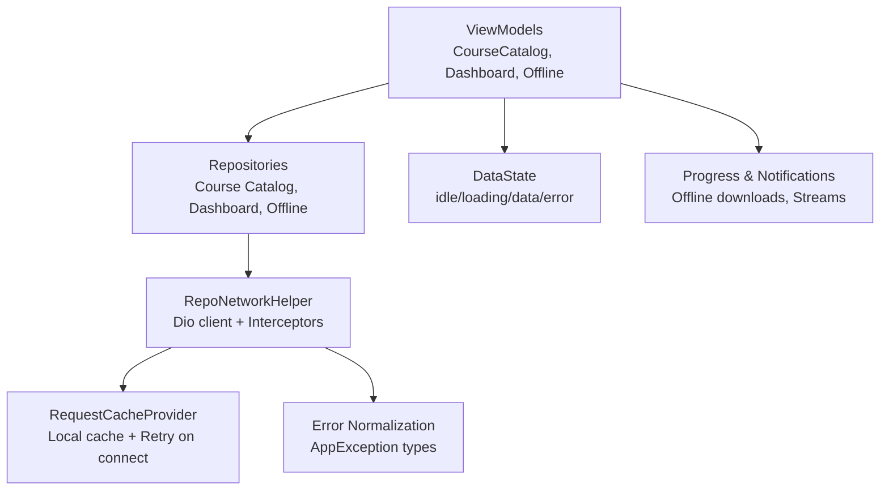
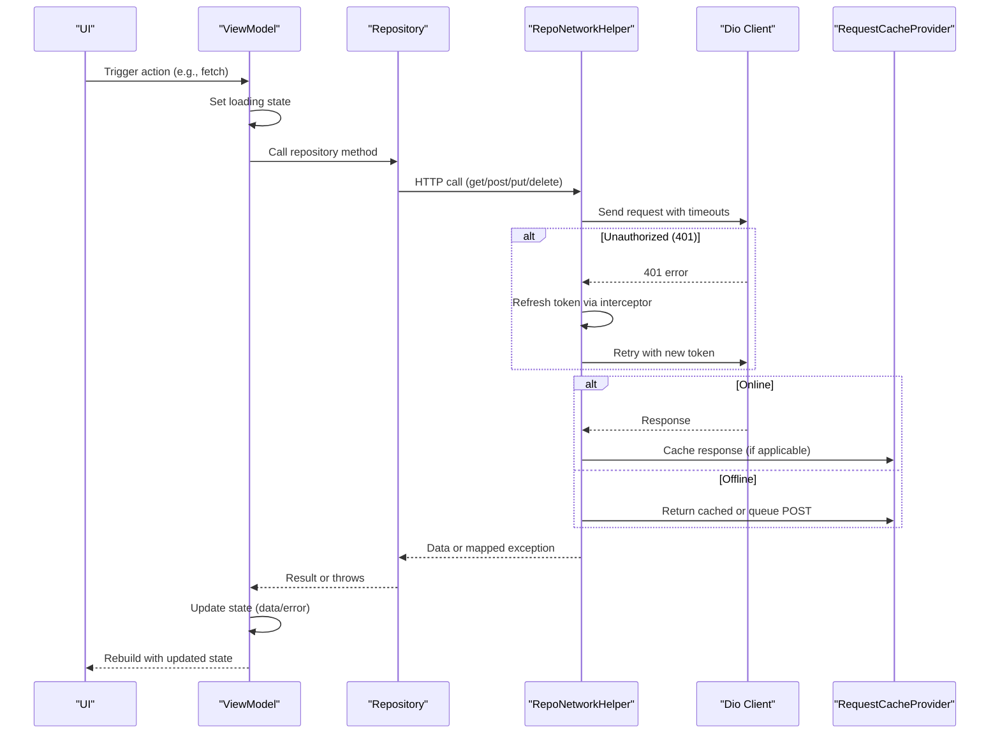
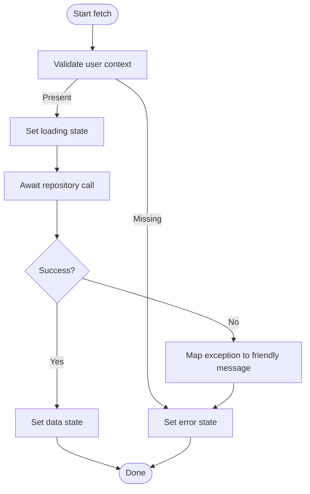
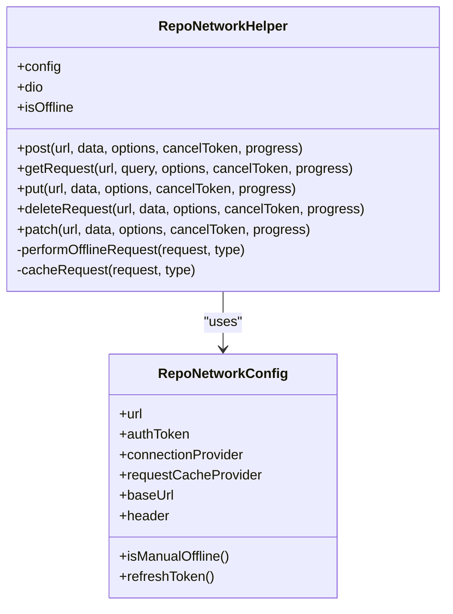
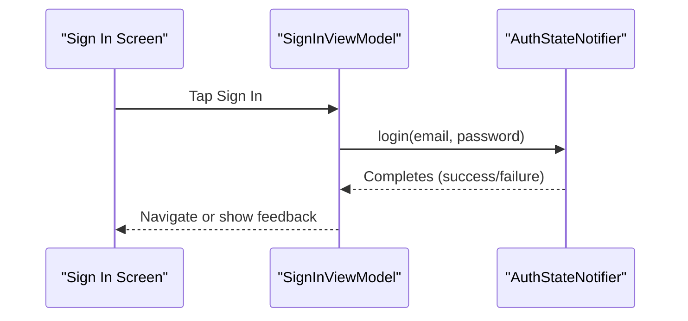
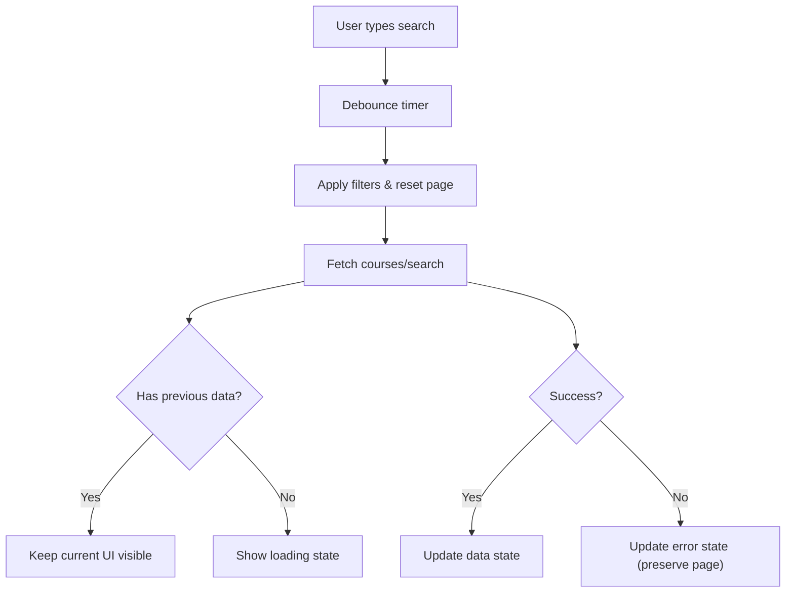
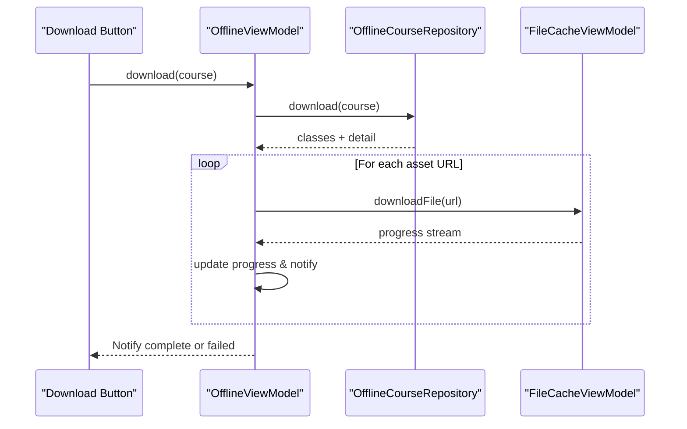
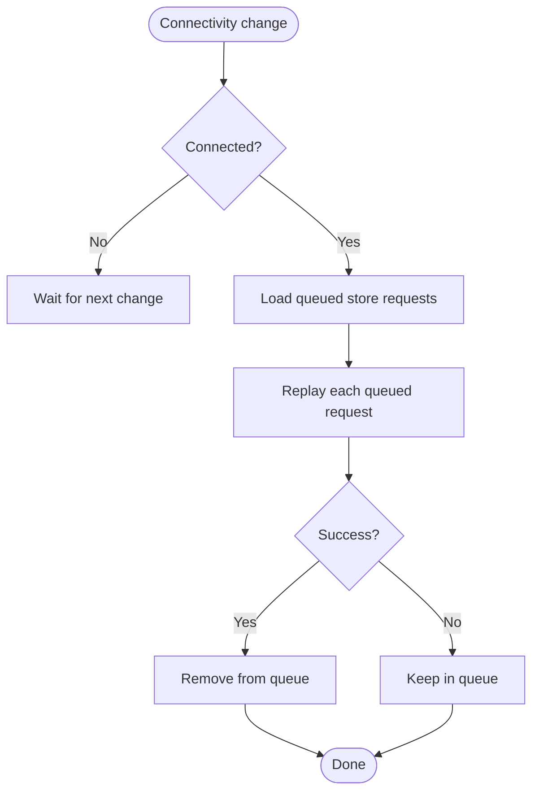
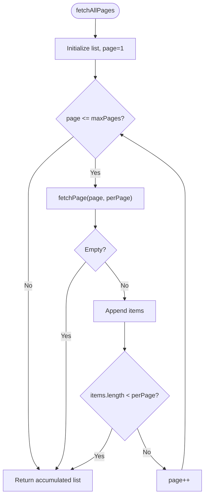
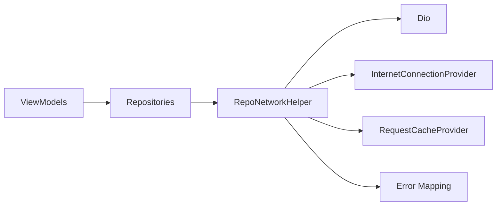

# Asynchronous Operations & Error Handling

<cite>
**Referenced Files in This Document**
- [data_state.dart](file://lib/app/core/logic/data_state/data_state.dart)
- [repo_network_helper.dart](file://lib/app/core/logic/repository/repo_network_helper.dart)
- [error.dart](file://lib/app/core/logic/repository/error.dart)
- [app_exception.dart](file://lib/app/core/logic/repository/app_exception.dart)
- [signin_viewmodel.dart](file://lib/app/features/authentication/viewmodel/signin_viewmodel.dart)
- [dashboard_view_model.dart](file://lib/app/features/dashboard/viewmodel/dashboard_view_model.dart)
- [course_catalog_view_model.dart](file://lib/app/features/courses/viewmodel/course_catalog_view_model.dart)
- [offline_view_model.dart](file://lib/app/features/courses/viewmodel/offline_view_model.dart)
- [request_cache_provider.dart](file://lib/app/core/provider/request_cache_provider.dart)
- [paginated_fetch.dart](file://lib/app/core/logic/repository/paginated_fetch.dart)
- [sync_queue_repository.dart](file://lib/app/features/courses/repository/sync_queue_repository.dart)
- [download_button.dart](file://lib/app/features/courses/view/widgets/download_button.dart)
</cite>

## Table of Contents
1. [Introduction](#introduction)
2. [Project Structure](#project-structure)
3. [Core Components](#core-components)
4. [Architecture Overview](#architecture-overview)
5. [Detailed Component Analysis](#detailed-component-analysis)
6. [Dependency Analysis](#dependency-analysis)
7. [Performance Considerations](#performance-considerations)
8. [Troubleshooting Guide](#troubleshooting-guide)
9. [Conclusion](#conclusion)

## Introduction
This document explains how asynchronous operations are handled within ViewModels and supporting layers in the project. It covers async/await patterns, error handling strategies, loading states, progress tracking, concurrent operations, network failure handling, retry logic, timeouts, cancellation, and performance best practices to keep the UI responsive during background processing.

## Project Structure
The codebase uses a layered approach:
- ViewModels manage UI state and orchestrate business flows using async methods.
- Repositories encapsulate data access and network calls.
- A shared network helper configures HTTP clients, interceptors, caching, offline behavior, and error normalization.
- A generic DataState model represents idle/loading/data/error states for UI binding.
- Providers handle connectivity changes and request caching/retry on reconnect.

**Diagram sources**
- [course_catalog_view_model.dart:59-133](file://lib/app/features/courses/viewmodel/course_catalog_view_model.dart#L59-L133)
- [dashboard_view_model.dart:8-42](file://lib/app/features/dashboard/viewmodel/dashboard_view_model.dart#L8-L42)
- [offline_view_model.dart:27-174](file://lib/app/features/courses/viewmodel/offline_view_model.dart#L27-L174)
- [repo_network_helper.dart:72-126](file://lib/app/core/logic/repository/repo_network_helper.dart#L72-L126)
- [request_cache_provider.dart:40-83](file://lib/app/core/provider/request_cache_provider.dart#L40-L83)
- [error.dart:19-94](file://lib/app/core/logic/repository/error.dart#L19-L94)
- [data_state.dart:1-22](file://lib/app/core/logic/data_state/data_state.dart#L1-L22)

**Section sources**
- [course_catalog_view_model.dart:59-133](file://lib/app/features/courses/viewmodel/course_catalog_view_model.dart#L59-L133)
- [dashboard_view_model.dart:8-42](file://lib/app/features/dashboard/viewmodel/dashboard_view_model.dart#L8-L42)
- [repo_network_helper.dart:72-126](file://lib/app/core/logic/repository/repo_network_helper.dart#L72-L126)
- [data_state.dart:1-22](file://lib/app/core/logic/data_state/data_state.dart#L1-L22)

## Core Components
- DataState<T>: A unified state container with idle/loading/data/error variants used by ViewModels to drive UI updates.
- RepoNetworkHelper: Centralizes Dio configuration, timeouts, token refresh interceptor, offline detection, request caching, and exception mapping.
- Error mapping: Converts Dio exceptions into typed AppException subclasses for consistent handling across the app.
- RequestCacheProvider: Persists GET responses and queued POST requests; retries failed requests when connectivity returns.
- Paginated fetch utility: Safely paginates through endpoints with a max page cap to avoid infinite loops.
- Offline download flow: Orchestrates multi-step downloads with per-item progress and user notifications.

**Section sources**
- [data_state.dart:1-22](file://lib/app/core/logic/data_state/data_state.dart#L1-L22)
- [repo_network_helper.dart:72-126](file://lib/app/core/logic/repository/repo_network_helper.dart#L72-L126)
- [error.dart:19-94](file://lib/app/core/logic/repository/error.dart#L19-L94)
- [request_cache_provider.dart:40-83](file://lib/app/core/provider/request_cache_provider.dart#L40-L83)
- [paginated_fetch.dart:1-18](file://lib/app/core/logic/repository/paginated_fetch.dart#L1-L18)
- [offline_view_model.dart:27-174](file://lib/app/features/courses/viewmodel/offline_view_model.dart#L27-L174)

## Architecture Overview
The typical async flow from ViewModel to network and back:

**Diagram sources**
- [repo_network_helper.dart:72-126](file://lib/app/core/logic/repository/repo_network_helper.dart#L72-L126)
- [repo_network_helper.dart:286-394](file://lib/app/core/logic/repository/repo_network_helper.dart#L286-L394)
- [request_cache_provider.dart:40-83](file://lib/app/core/provider/request_cache_provider.dart#L40-L83)
- [error.dart:19-94](file://lib/app/core/logic/repository/error.dart#L19-L94)
- [course_catalog_view_model.dart:84-133](file://lib/app/features/courses/viewmodel/course_catalog_view_model.dart#L84-L133)
- [dashboard_view_model.dart:28-42](file://lib/app/features/dashboard/viewmodel/dashboard_view_model.dart#L28-L42)

## Detailed Component Analysis

### DataState and Loading/Error Patterns
- Use DataState to represent lifecycle: idle -> loading -> data/error.
- ViewModels set loading before awaiting network calls and update to data or error after completion.
- Preserve existing data on transient failures to avoid flicker during pagination/filtering.

**Diagram sources**
- [course_catalog_view_model.dart:84-133](file://lib/app/features/courses/viewmodel/course_catalog_view_model.dart#L84-L133)
- [dashboard_view_model.dart:28-42](file://lib/app/features/dashboard/viewmodel/dashboard_view_model.dart#L28-L42)
- [data_state.dart:1-22](file://lib/app/core/logic/data_state/data_state.dart#L1-L22)

**Section sources**
- [course_catalog_view_model.dart:84-133](file://lib/app/features/courses/viewmodel/course_catalog_view_model.dart#L84-L133)
- [dashboard_view_model.dart:28-42](file://lib/app/features/dashboard/viewmodel/dashboard_view_model.dart#L28-L42)
- [data_state.dart:1-22](file://lib/app/core/logic/data_state/data_state.dart#L1-L22)

### Network Helper: Timeouts, Token Refresh, Caching, Offline
- Timeouts: Connect/receive/send timeouts configured to prevent indefinite hangs.
- Token refresh: On 401, attempts to obtain a fresh token once per request; marks retried requests to avoid loops.
- Offline handling: Detects manual offline mode or connectivity loss; serves cached GETs or queues POSTs for later sync.
- Exception mapping: Converts Dio errors into typed exceptions for consistent handling.

**Diagram sources**
- [repo_network_helper.dart:31-70](file://lib/app/core/logic/repository/repo_network_helper.dart#L31-L70)
- [repo_network_helper.dart:72-126](file://lib/app/core/logic/repository/repo_network_helper.dart#L72-L126)
- [repo_network_helper.dart:239-283](file://lib/app/core/logic/repository/repo_network_helper.dart#L239-L283)
- [repo_network_helper.dart:286-478](file://lib/app/core/logic/repository/repo_network_helper.dart#L286-L478)

**Section sources**
- [repo_network_helper.dart:72-126](file://lib/app/core/logic/repository/repo_network_helper.dart#L72-L126)
- [repo_network_helper.dart:286-394](file://lib/app/core/logic/repository/repo_network_helper.dart#L286-L394)
- [error.dart:19-94](file://lib/app/core/logic/repository/error.dart#L19-L94)

### Authentication Flow: Async Login via ViewModel
- The SignIn ViewModel delegates authentication to an auth state provider, keeping the ViewModel thin and focused on UI concerns.
- Errors and loading are managed centrally by the auth state provider; the ViewModel triggers the operation and returns control to the UI.

**Diagram sources**
- [signin_viewmodel.dart:9-43](file://lib/app/features/authentication/viewmodel/signin_viewmodel.dart#L9-L43)

**Section sources**
- [signin_viewmodel.dart:9-43](file://lib/app/features/authentication/viewmodel/signin_viewmodel.dart#L9-L43)

### Course Catalog: Debounced Search, Pagination, and Resilient Loading
- Debounces search input to reduce network churn while typing.
- Preserves existing data during filter/page changes to avoid full-screen spinners.
- Uses DataState to reflect loading and error states consistently.

**Diagram sources**
- [course_catalog_view_model.dart:140-182](file://lib/app/features/courses/viewmodel/course_catalog_view_model.dart#L140-L182)
- [course_catalog_view_model.dart:84-133](file://lib/app/features/courses/viewmodel/course_catalog_view_model.dart#L84-L133)

**Section sources**
- [course_catalog_view_model.dart:84-133](file://lib/app/features/courses/viewmodel/course_catalog_view_model.dart#L84-L133)
- [course_catalog_view_model.dart:140-182](file://lib/app/features/courses/viewmodel/course_catalog_view_model.dart#L140-L182)

### Offline Downloads: Multi-step, Progress Tracking, and User Feedback
- Orchestrates fetching metadata, then downloading multiple assets with per-item progress.
- Updates UI via ChangeNotifier and streams for real-time progress.
- Emits local notifications to inform users about success/failure.

**Diagram sources**
- [offline_view_model.dart:60-174](file://lib/app/features/courses/viewmodel/offline_view_model.dart#L60-L174)
- [download_button.dart:119-254](file://lib/app/features/courses/view/widgets/download_button.dart#L119-L254)

**Section sources**
- [offline_view_model.dart:60-174](file://lib/app/features/courses/viewmodel/offline_view_model.dart#L60-L174)
- [download_button.dart:119-254](file://lib/app/features/courses/view/widgets/download_button.dart#L119-L254)

### Connectivity-aware Queuing and Retry
- When offline, GET requests return cached data if available; POST requests are queued locally.
- On connectivity restoration, queued requests are replayed; failed ones remain queued for later retry.

**Diagram sources**
- [request_cache_provider.dart:40-83](file://lib/app/core/provider/request_cache_provider.dart#L40-L83)

**Section sources**
- [request_cache_provider.dart:40-83](file://lib/app/core/provider/request_cache_provider.dart#L40-L83)

### Paginated Fetch Utility
- Safely iterates pages until fewer items than expected or empty page is returned.
- Includes a maxPages guard to prevent infinite loops.

**Diagram sources**
- [paginated_fetch.dart:1-18](file://lib/app/core/logic/repository/paginated_fetch.dart#L1-L18)

**Section sources**
- [paginated_fetch.dart:1-18](file://lib/app/core/logic/repository/paginated_fetch.dart#L1-L18)

## Dependency Analysis
Key dependencies and relationships:
- ViewModels depend on repositories for data access and use DataState to reflect UI state.
- Repositories rely on RepoNetworkHelper for HTTP operations, caching, and error mapping.
- RepoNetworkHelper depends on Dio, connection provider, and optional token refresh callback.
- RequestCacheProvider persists and replays requests based on connectivity events.

**Diagram sources**
- [repo_network_helper.dart:72-126](file://lib/app/core/logic/repository/repo_network_helper.dart#L72-L126)
- [request_cache_provider.dart:40-83](file://lib/app/core/provider/request_cache_provider.dart#L40-L83)
- [error.dart:19-94](file://lib/app/core/logic/repository/error.dart#L19-L94)

**Section sources**
- [repo_network_helper.dart:72-126](file://lib/app/core/logic/repository/repo_network_helper.dart#L72-L126)
- [request_cache_provider.dart:40-83](file://lib/app/core/provider/request_cache_provider.dart#L40-L83)
- [error.dart:19-94](file://lib/app/core/logic/repository/error.dart#L19-L94)

## Performance Considerations
- Timeouts: Configure connect/receive/send timeouts to fail fast and free resources.
- Debouncing: Debounce frequent inputs (search) to minimize redundant requests.
- Caching: Serve cached GET responses offline; queue POSTs for later sync.
- Pagination: Use bounded pagination utilities to avoid excessive memory usage.
- Concurrency: Prefer sequential steps where order matters (e.g., metadata first, then assets); otherwise, parallelize independent downloads carefully and track progress.
- UI responsiveness: Keep UI threads unblocked by offloading work to async methods and updating state incrementally.

[No sources needed since this section provides general guidance]

## Troubleshooting Guide
Common issues and remedies:
- Indefinite loading: Ensure timeouts are set and errors are surfaced; verify that loading states are cleared on both success and failure paths.
- 401 loops: The interceptor retries only once per request; ensure token refresh succeeds or propagate the original 401 to trigger logout flows.
- Offline behavior: Confirm offline detection and caching strategy; verify queued requests are replayed on reconnection.
- Friendly messages: Map exceptions to user-friendly messages; preserve critical prefixes like “Unauthorized” for automated handlers.

**Section sources**
- [repo_network_helper.dart:72-126](file://lib/app/core/logic/repository/repo_network_helper.dart#L72-L126)
- [error.dart:19-94](file://lib/app/core/logic/repository/error.dart#L19-L94)
- [request_cache_provider.dart:40-83](file://lib/app/core/provider/request_cache_provider.dart#L40-L83)
- [dashboard_view_model.dart:28-42](file://lib/app/features/dashboard/viewmodel/dashboard_view_model.dart#L28-L42)

## Conclusion
The application implements robust asynchronous workflows in ViewModels backed by a centralized network layer with timeouts, token refresh, caching, and offline support. Consistent DataState modeling ensures predictable UI states, while progress streams and notifications provide clear user feedback. Following these patterns yields resilient, responsive experiences even under poor connectivity or long-running tasks.