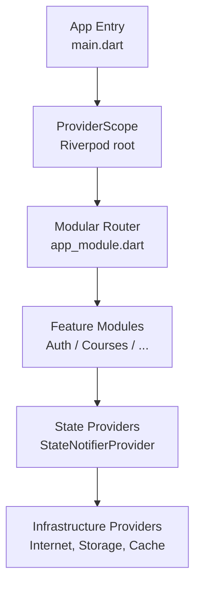
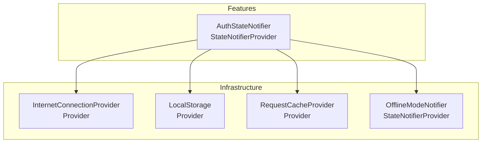
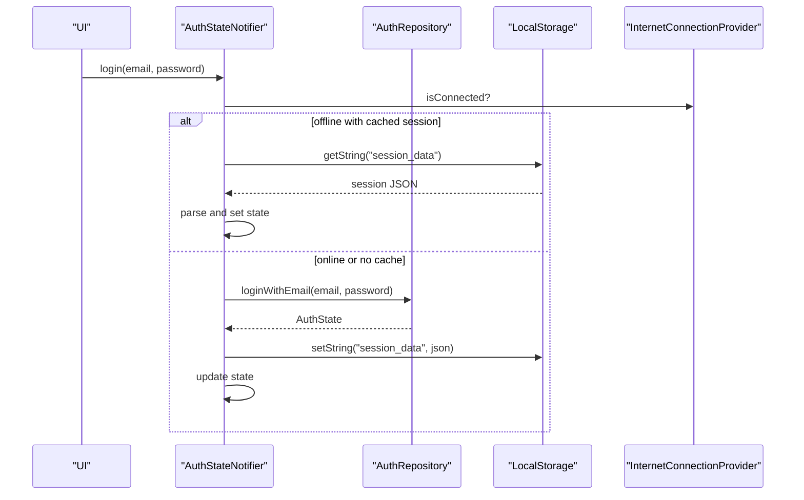
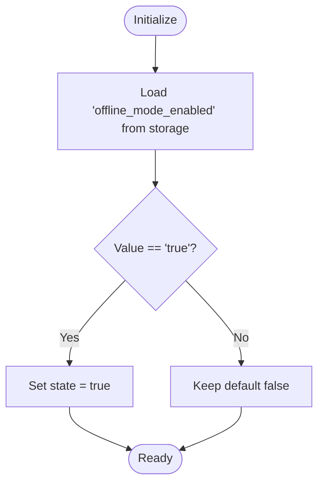
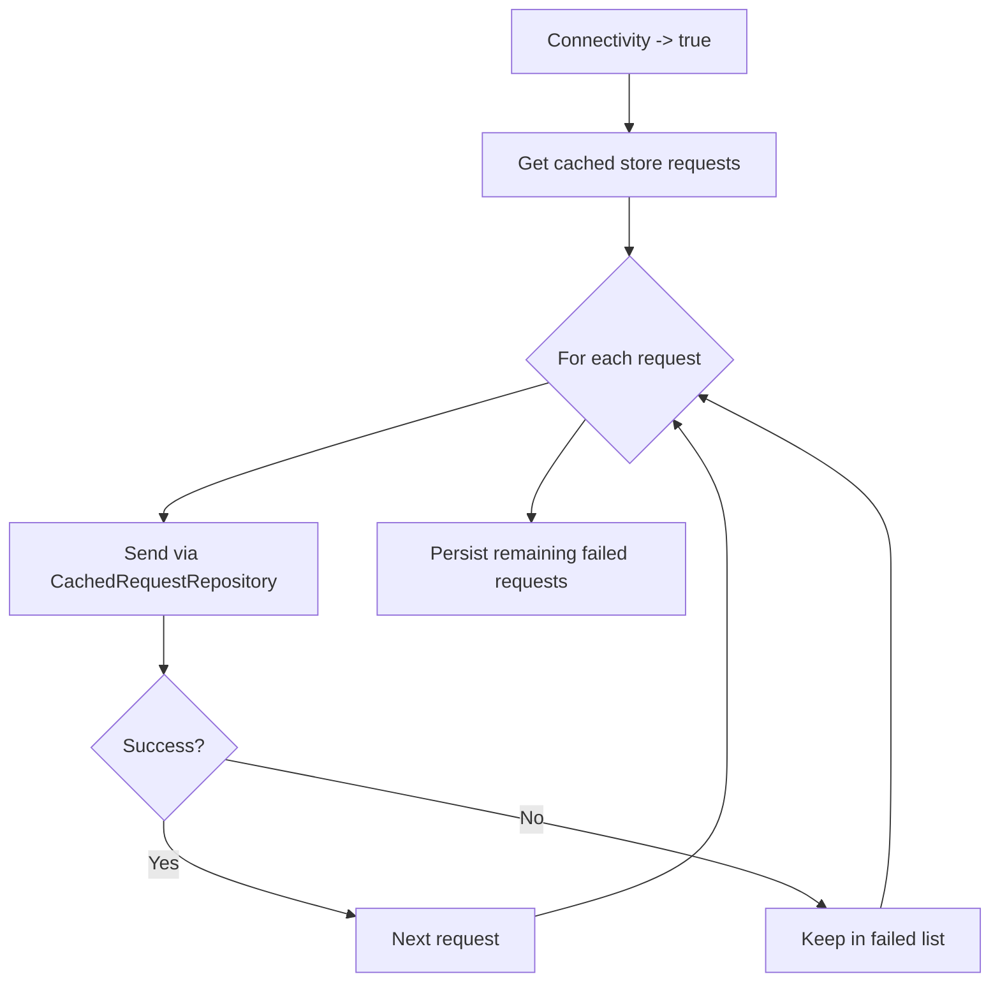
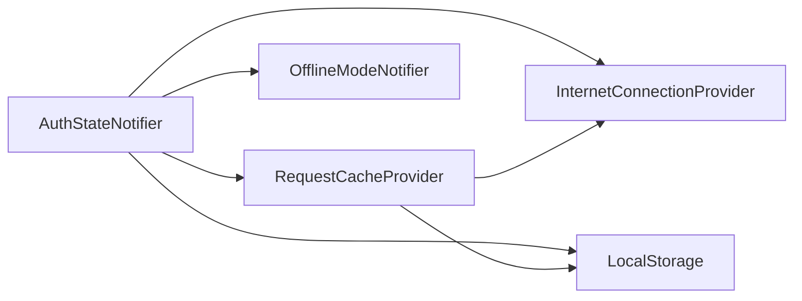

# State Management Patterns with Riverpod

<cite>
**Referenced Files in This Document**
- [main.dart](file://lib/main.dart)
- [app_module.dart](file://lib/app_module.dart)
- [pubspec.yaml](file://pubspec.yaml)
- [auth_state_provider.dart](file://lib/app/features/authentication/app_state/auth_state_provider.dart)
- [offline_mode_provider.dart](file://lib/app/core/provider/offline_mode_provider.dart)
- [internet_connection_provider.dart](file://lib/app/core/provider/internet_connection_provider.dart)
- [local_storage_provider.dart](file://lib/app/core/provider/local_storage_provider.dart)
- [request_cache_provider.dart](file://lib/app/core/provider/request_cache_provider.dart)
- [data_state.dart](file://lib/app/core/logic/data_state/data_state.dart)
</cite>

## Table of Contents
1. [Introduction](#introduction)
2. [Project Structure](#project-structure)
3. [Core Components](#core-components)
4. [Architecture Overview](#architecture-overview)
5. [Detailed Component Analysis](#detailed-component-analysis)
6. [Dependency Analysis](#dependency-analysis)
7. [Performance Considerations](#performance-considerations)
8. [Troubleshooting Guide](#troubleshooting-guide)
9. [Conclusion](#conclusion)
10. [Appendices](#appendices)

## Introduction
This document explains state management patterns using Riverpod’s StateNotifierProvider within the application. It focuses on how ViewModels expose state through providers, manage reactive updates, and handle complex state transitions. It also covers provider composition, dependency injection into ViewModels, testing strategies for stateful components, creating reusable state providers, managing nested state structures, optimizing performance via selective state updates, and best practices for scalable state management.

## Project Structure
The app initializes a global ProviderScope to enable Riverpod across the widget tree and integrates modular routing. Core providers encapsulate infrastructure concerns (network connectivity, local storage, offline mode, request caching), while feature-level providers (e.g., authentication) compose these dependencies to manage domain state.



**Diagram sources**
- [main.dart:16-37](file://lib/main.dart#L16-L37)
- [app_module.dart:7-19](file://lib/app_module.dart#L7-L19)

**Section sources**
- [main.dart:16-37](file://lib/main.dart#L16-L37)
- [app_module.dart:7-19](file://lib/app_module.dart#L7-L19)
- [pubspec.yaml:30-44](file://pubspec.yaml#L30-L44)

## Core Components
- Authentication state provider: Manages user session, profile updates, token refresh, logout, and initialization with offline support.
- Offline mode provider: User-controlled toggle persisted to local storage; influences behavior globally.
- Internet connection provider: Monitors connectivity and exposes streams/listeners for reactive updates.
- Local storage provider: Encapsulates Hive-based key-value persistence.
- Request cache provider: Persists and replays network requests when connectivity changes.
- Data state model: Generic wrapper for loading/data/error states used by repositories and UI.

These components demonstrate how Riverpod providers can be composed to build robust, testable, and scalable state management.

**Section sources**
- [auth_state_provider.dart:15-203](file://lib/app/features/authentication/app_state/auth_state_provider.dart#L15-L203)
- [offline_mode_provider.dart:11-36](file://lib/app/core/provider/offline_mode_provider.dart#L11-L36)
- [internet_connection_provider.dart:9-99](file://lib/app/core/provider/internet_connection_provider.dart#L9-L99)
- [local_storage_provider.dart:6-48](file://lib/app/core/provider/local_storage_provider.dart#L6-L48)
- [request_cache_provider.dart:9-119](file://lib/app/core/provider/request_cache_provider.dart#L9-L119)
- [data_state.dart:1-22](file://lib/app/core/logic/data_state/data_state.dart#L1-L22)

## Architecture Overview
The architecture centers around Riverpod providers that encapsulate state and side effects. Feature ViewModels depend on infrastructure providers to perform I/O and persist state. Connectivity and offline toggles influence behavior without tightly coupling features to implementation details.



**Diagram sources**
- [auth_state_provider.dart:15-25](file://lib/app/features/authentication/app_state/auth_state_provider.dart#L15-L25)
- [internet_connection_provider.dart:9-16](file://lib/app/core/provider/internet_connection_provider.dart#L9-L16)
- [local_storage_provider.dart:6-8](file://lib/app/core/provider/local_storage_provider.dart#L6-L8)
- [request_cache_provider.dart:9-16](file://lib/app/core/provider/request_cache_provider.dart#L9-L16)
- [offline_mode_provider.dart:11-15](file://lib/app/core/provider/offline_mode_provider.dart#L11-L15)

## Detailed Component Analysis

### Authentication State Provider (AuthStateNotifier)
Responsibilities:
- Exposes authenticated session state via a StateNotifierProvider.
- Handles login, profile updates, token refresh, logout, and initialization.
- Integrates with offline mode and connectivity to maintain consistent UX.
- Persists session data to local storage and clears queues on logout.

Key behaviors:
- Login flow checks offline cached session first; otherwise authenticates via repository and persists session.
- Profile updates avoid unnecessary rebuilds by comparing existing profile fields before replacing state.
- Token refresh is deduplicated with an in-flight guard to prevent concurrent auto-login calls.
- Initialization loads persisted session and validates token online or defers validation until connectivity returns.



**Diagram sources**
- [auth_state_provider.dart:42-69](file://lib/app/features/authentication/app_state/auth_state_provider.dart#L42-L69)
- [local_storage_provider.dart:13-28](file://lib/app/core/provider/local_storage_provider.dart#L13-L28)
- [internet_connection_provider.dart:91-93](file://lib/app/core/provider/internet_connection_provider.dart#L91-L93)

**Section sources**
- [auth_state_provider.dart:15-203](file://lib/app/features/authentication/app_state/auth_state_provider.dart#L15-L203)

### Offline Mode Provider (OfflineModeNotifier)
Responsibilities:
- Provides a boolean state indicating whether the app should behave offline.
- Persists the preference to local storage and restores it on startup.
- Offers methods to toggle or explicitly set the mode.

Usage pattern:
- Composed via a StateNotifierProvider and injected into other providers that need to respect user intent to go offline.



**Diagram sources**
- [offline_mode_provider.dart:11-36](file://lib/app/core/provider/offline_mode_provider.dart#L11-L36)

**Section sources**
- [offline_mode_provider.dart:11-36](file://lib/app/core/provider/offline_mode_provider.dart#L11-L36)

### Internet Connection Provider
Responsibilities:
- Maintains current connectivity status and exposes a broadcast stream plus listener API.
- Uses a custom check against the app server with a reliable fallback endpoint.
- Ensures idempotent initialization and avoids duplicate listeners.

Reactive integration:
- Other providers listen to connectivity changes to trigger retries or queue handling.

```mermaid
sequenceDiagram
participant Init as "InternetConnectionProvider"
participant Net as "InternetConnection"
participant Listeners as "Listeners"
Init->>Net : hasInternetAccess
Net-->>Init : initial status
Init->>Init : _onConnectionChange(status)
Init->>Listeners : notify if changed
Net.onStatusChange.listen((event)=>{
Init->>Net : hasInternetAccess
Init->>Init : _onConnectionChange(new)
Init->>Listeners : notify if changed
})
```

**Diagram sources**
- [internet_connection_provider.dart:18-79](file://lib/app/core/provider/internet_connection_provider.dart#L18-L79)

**Section sources**
- [internet_connection_provider.dart:9-99](file://lib/app/core/provider/internet_connection_provider.dart#L9-L99)

### Local Storage Provider
Responsibilities:
- Initializes Hive appropriately per platform and opens a named box.
- Provides simple string get/set operations with lazy initialization.

Integration:
- Used by multiple providers to persist preferences and session data.

**Section sources**
- [local_storage_provider.dart:6-48](file://lib/app/core/provider/local_storage_provider.dart#L6-L48)

### Request Cache Provider
Responsibilities:
- Caches GET and store requests locally and replays them when connectivity returns.
- Subscribes to connectivity changes and uses a repository to send queued requests.

Flow:
- On reconnect, iterates cached store requests, attempts to send, and persists only failures back to storage.



**Diagram sources**
- [request_cache_provider.dart:63-78](file://lib/app/core/provider/request_cache_provider.dart#L63-L78)

**Section sources**
- [request_cache_provider.dart:9-119](file://lib/app/core/provider/request_cache_provider.dart#L9-L119)

### Data State Model
Purpose:
- Generic container representing idle/loading/data/error states for asynchronous operations.

Usage:
- Typically consumed by repositories and UI layers to render consistent feedback during async flows.

**Section sources**
- [data_state.dart:1-22](file://lib/app/core/logic/data_state/data_state.dart#L1-L22)

## Dependency Analysis
Provider composition demonstrates clear separation of concerns:
- Feature state depends on infrastructure providers via constructor injection and ref.watch.
- Infrastructure providers are independent and reusable across features.
- Connectivity and offline mode act as cross-cutting concerns influencing behavior throughout the app.



**Diagram sources**
- [auth_state_provider.dart:15-25](file://lib/app/features/authentication/app_state/auth_state_provider.dart#L15-L25)
- [request_cache_provider.dart:9-16](file://lib/app/core/provider/request_cache_provider.dart#L9-L16)
- [internet_connection_provider.dart:9-16](file://lib/app/core/provider/internet_connection_provider.dart#L9-L16)
- [local_storage_provider.dart:6-8](file://lib/app/core/provider/local_storage_provider.dart#L6-L8)
- [offline_mode_provider.dart:11-15](file://lib/app/core/provider/offline_mode_provider.dart#L11-L15)

**Section sources**
- [auth_state_provider.dart:15-25](file://lib/app/features/authentication/app_state/auth_state_provider.dart#L15-L25)
- [request_cache_provider.dart:9-16](file://lib/app/core/provider/request_cache_provider.dart#L9-L16)

## Performance Considerations
- Selective state updates: Avoid replacing entire state objects when unchanged; compare relevant fields before assignment to minimize rebuilds.
- Deduplication: Use in-flight guards for expensive or sensitive operations like token refresh to prevent redundant work.
- Listener management: Ensure connectivity listeners are added once and removed appropriately to avoid memory leaks and excessive polling.
- Lazy initialization: Defer heavy setup until needed (e.g., Hive initialization on first access).
- Offloading I/O: Keep providers focused on state and orchestration; delegate network and storage to repositories and infrastructure providers.

[No sources needed since this section provides general guidance]

## Troubleshooting Guide
Common issues and remedies:
- Duplicate connectivity listeners causing spurious refreshes: Ensure initialization runs once and only notifies on actual state changes.
- Unnecessary rebuild loops due to object identity: Compare nested fields before assigning new state instances.
- Stale sessions after logout: Clear persisted session and any queued offline completions to prevent leakage between users.
- Network errors masked by offline mode: Respect offline toggle but surface meaningful errors when online.

**Section sources**
- [internet_connection_provider.dart:51-79](file://lib/app/core/provider/internet_connection_provider.dart#L51-L79)
- [auth_state_provider.dart:79-112](file://lib/app/features/authentication/app_state/auth_state_provider.dart#L79-L112)
- [auth_state_provider.dart:152-162](file://lib/app/features/authentication/app_state/auth_state_provider.dart#L152-L162)

## Conclusion
By composing Riverpod providers—using StateNotifierProvider for feature state and Provider for infrastructure—you achieve a clean, testable, and scalable state management architecture. The patterns demonstrated here include:
- Reactive updates driven by connectivity and user toggles
- Robust lifecycle handling for initialization, token refresh, and cleanup
- Persistent state with safe defaults and offline resilience
- Performance-conscious updates and deduplication

Adopting these practices will help you build maintainable applications where state logic is explicit, isolated, and easy to test.

[No sources needed since this section summarizes without analyzing specific files]

## Appendices

### Provider Composition and Dependency Injection
- Feature providers receive infrastructure dependencies via constructor parameters resolved through ref.watch or ref.read.
- This approach enables deterministic testing by substituting mocks for storage, networking, and connectivity.

**Section sources**
- [auth_state_provider.dart:15-25](file://lib/app/features/authentication/app_state/auth_state_provider.dart#L15-L25)
- [request_cache_provider.dart:9-16](file://lib/app/core/provider/request_cache_provider.dart#L9-L16)

### Testing Strategies for Stateful Components
- Instantiate the StateNotifier directly with mocked dependencies to assert state transitions.
- Use provider containers in tests to simulate ref behavior when necessary.
- Verify persistence interactions by mocking storage and asserting calls.
- Validate connectivity-driven behaviors by controlling the connectivity provider’s state and listeners.

[No sources needed since this section provides general guidance]