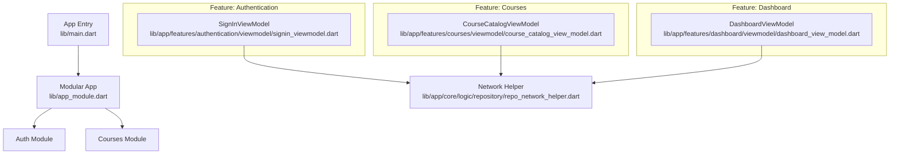
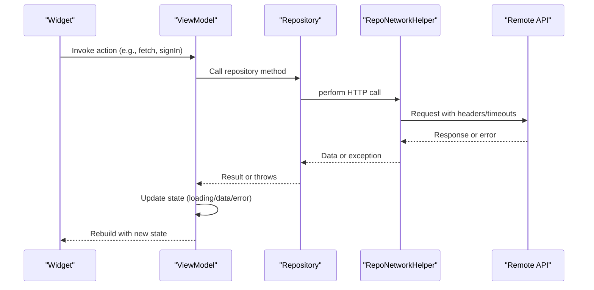
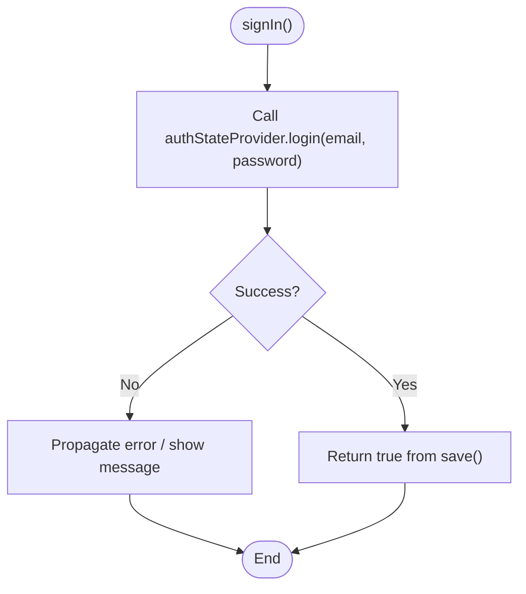
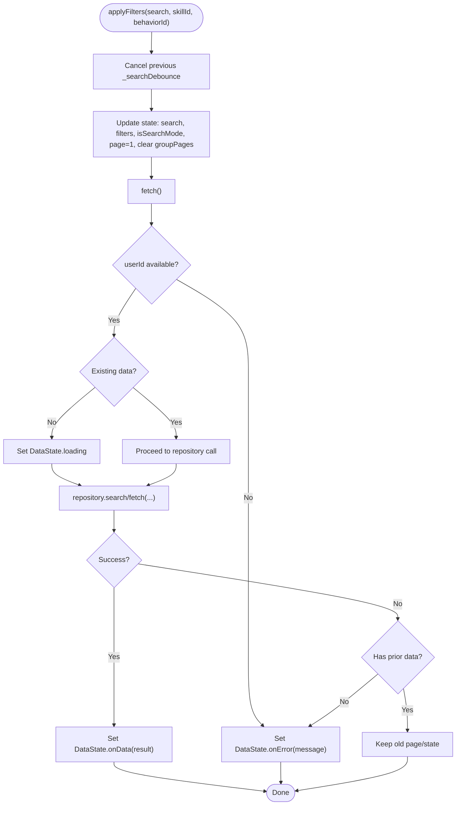
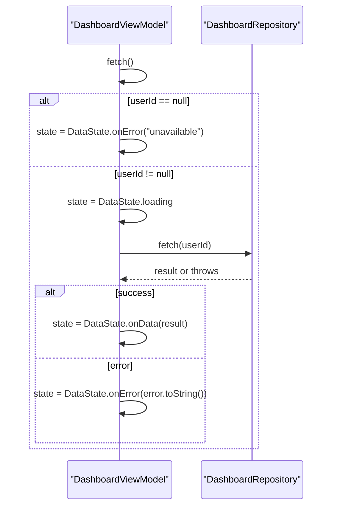
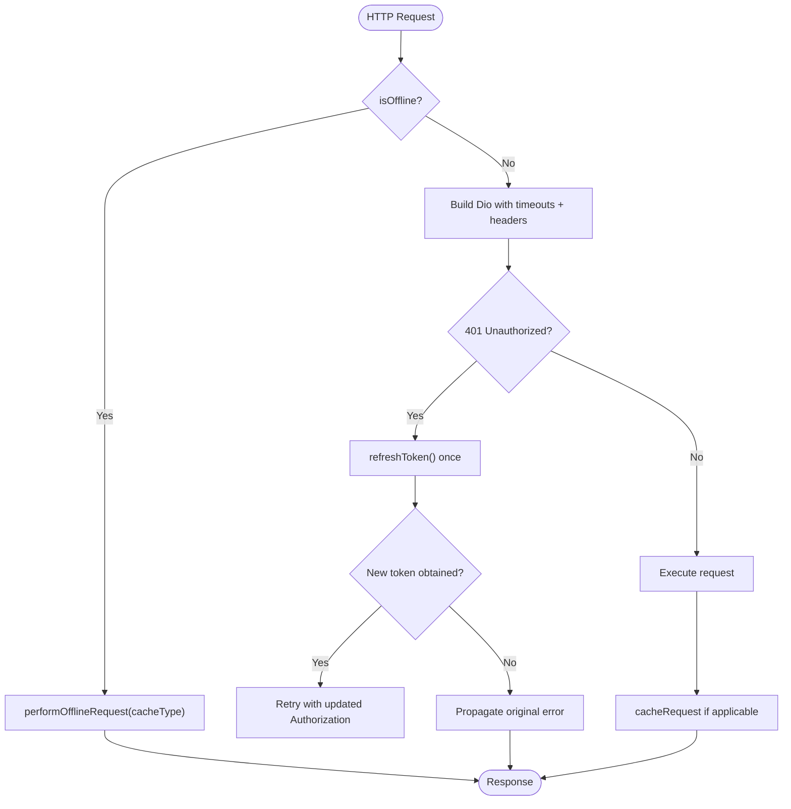
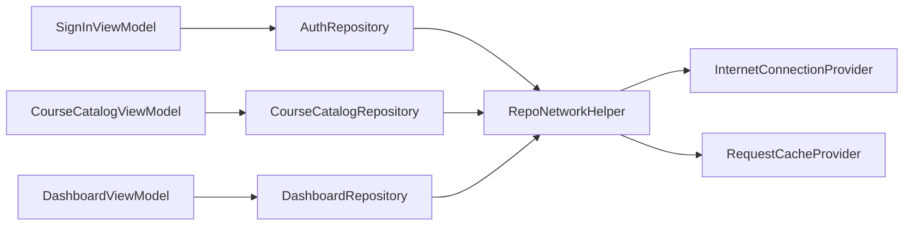

# Testing ViewModels & Business Logic

<cite>
**Referenced Files in This Document**
- [pubspec.yaml](file://pubspec.yaml)
- [main.dart](file://lib/main.dart)
- [app_module.dart](file://lib/app_module.dart)
- [signin_viewmodel.dart](file://lib/app/features/authentication/viewmodel/signin_viewmodel.dart)
- [course_catalog_view_model.dart](file://lib/app/features/courses/viewmodel/course_catalog_view_model.dart)
- [dashboard_view_model.dart](file://lib/app/features/dashboard/viewmodel/dashboard_view_model.dart)
- [repo_network_helper.dart](file://lib/app/core/logic/repository/repo_network_helper.dart)
- [widget_test.dart](file://test/widget_test.dart)
- [purchase_record_test.dart](file://test/payment/purchase_record_test.dart)
</cite>

## Table of Contents
1. Introduction
2. Project Structure
3. Core Components
4. Architecture Overview
5. Detailed Component Analysis
6. Dependency Analysis
7. Performance Considerations
8. Troubleshooting Guide
9. Conclusion
10. Appendices

## Introduction
This document provides a comprehensive testing strategy for ViewModels and business logic in the application. It covers unit testing approaches for ViewModels, mocking repositories and dependencies, testing asynchronous operations, verifying state changes, handling error scenarios and edge cases, and organizing tests effectively. It also includes guidance for widget tests that verify ViewModel behavior, integration tests for complete workflows, performance testing considerations, best practices, and continuous integration setup to ensure reliable test coverage.

## Project Structure
The project is a Flutter application using Riverpod for state management and modular routing via Flutter Modular. The core app bootstraps providers and modules, while features are organized under lib/app/features with viewmodels and repositories co-located per feature. Tests live under test/, including a basic widget smoke test and model-level tests.

**Diagram sources**
- [main.dart:16-37](file://lib/main.dart#L16-L37)
- [app_module.dart:7-19](file://lib/app_module.dart#L7-L19)
- [signin_viewmodel.dart:9-19](file://lib/app/features/authentication/viewmodel/signin_viewmodel.dart#L9-L19)
- [course_catalog_view_model.dart:59-83](file://lib/app/features/courses/viewmodel/course_catalog_view_model.dart#L59-L83)
- [dashboard_view_model.dart:8-26](file://lib/app/features/dashboard/viewmodel/dashboard_view_model.dart#L8-L26)
- [repo_network_helper.dart:72-128](file://lib/app/core/logic/repository/repo_network_helper.dart#L72-L128)

**Section sources**
- [main.dart:16-37](file://lib/main.dart#L16-L37)
- [app_module.dart:7-19](file://lib/app_module.dart#L7-L19)

## Core Components
Key components relevant to testing include:
- SignInViewModel: Handles sign-in flow by delegating to an authentication repository and updating global auth state.
- CourseCatalogViewModel: Manages catalog state (loading/data/error), search/filtering, pagination, and debounced search.
- DashboardViewModel: Fetches dashboard data based on logged-in user context and updates DataState.
- RepoNetworkHelper: Provides HTTP client configuration, offline mode handling, token refresh interception, and request caching helpers used by repositories.

Testing focus areas:
- Unit tests for ViewModels: isolate business logic, mock repositories, assert state transitions.
- Widget tests: render UI driven by ViewModels and verify interactions.
- Integration tests: validate end-to-end flows across ViewModels and repositories.
- Error and edge case coverage: network failures, offline mode, empty states, invalid inputs.

**Section sources**
- [signin_viewmodel.dart:9-49](file://lib/app/features/authentication/viewmodel/signin_viewmodel.dart#L9-L49)
- [course_catalog_view_model.dart:10-194](file://lib/app/features/courses/viewmodel/course_catalog_view_model.dart#L10-L194)
- [dashboard_view_model.dart:8-48](file://lib/app/features/dashboard/viewmodel/dashboard_view_model.dart#L8-L48)
- [repo_network_helper.dart:31-128](file://lib/app/core/logic/repository/repo_network_helper.dart#L31-L128)

## Architecture Overview
The architecture layers are:
- Presentation: Widgets consume ViewModels via Riverpod providers.
- State: ViewModels encapsulate business logic and expose state through Riverpod StateNotifier or ChangeNotifier.
- Domain/Repositories: Repositories abstract data sources (network, cache).
- Infrastructure: RepoNetworkHelper configures Dio, handles timeouts, offline mode, and token refresh.

**Diagram sources**
- [course_catalog_view_model.dart:84-133](file://lib/app/features/courses/viewmodel/course_catalog_view_model.dart#L84-L133)
- [dashboard_view_model.dart:28-42](file://lib/app/features/dashboard/viewmodel/dashboard_view_model.dart#L28-L42)
- [repo_network_helper.dart:79-128](file://lib/app/core/logic/repository/repo_network_helper.dart#L79-L128)

## Detailed Component Analysis

### SignInViewModel Testing Strategy
- Responsibilities: Validate input, trigger login via AuthRepository, update AuthStateNotifier, manage UI state like password visibility and remember me.
- Unit testing approach:
  - Mock AuthRepository and AuthStateNotifier.
  - Assert that signIn calls the underlying login with correct parameters.
  - Verify UI state toggles (password visibility, remember me) trigger listeners.
- Asynchronous testing: Use flutter_test’s async helpers to await Future<void> methods and assert side effects.
- Error scenarios: Simulate repository exceptions and verify state updates or error propagation.

**Diagram sources**
- [signin_viewmodel.dart:35-43](file://lib/app/features/authentication/viewmodel/signin_viewmodel.dart#L35-L43)

**Section sources**
- [signin_viewmodel.dart:9-49](file://lib/app/features/authentication/viewmodel/signin_viewmodel.dart#L9-L49)

### CourseCatalogViewModel Testing Strategy
- Responsibilities: Manage catalog state (search, filters, pagination), debounce search, fetch data, handle errors without losing existing page data.
- Unit testing approach:
  - Provide a mocked CourseCatalogRepository.
  - Test initial state and fetch behavior when userId is present/absent.
  - Verify applyFilters updates state flags and triggers fetch.
  - Validate changeGroupPage updates groupPages and refetches.
  - Confirm reset restores initial state and re-fetches.
  - Debounce queueSearch: simulate timers and assert delayed applyFilters execution.
- Asynchronous testing: Await fetch and filter methods; use fake_async or test timers for debounce.
- Error scenarios: Ensure onError state preserves previously shown data and pagination highlights.

**Diagram sources**
- [course_catalog_view_model.dart:140-182](file://lib/app/features/courses/viewmodel/course_catalog_view_model.dart#L140-L182)
- [course_catalog_view_model.dart:84-133](file://lib/app/features/courses/viewmodel/course_catalog_view_model.dart#L84-L133)

**Section sources**
- [course_catalog_view_model.dart:10-194](file://lib/app/features/courses/viewmodel/course_catalog_view_model.dart#L10-L194)

### DashboardViewModel Testing Strategy
- Responsibilities: Fetch dashboard data based on userId, update DataState with loading/data/error.
- Unit testing approach:
  - Mock DashboardRepository.
  - Test fetch with valid userId: expect loading then data.
  - Test fetch with null userId: expect immediate error state.
  - Simulate repository exceptions: expect error state.
- Asynchronous testing: Await fetch and assert state transitions.

**Diagram sources**
- [dashboard_view_model.dart:28-42](file://lib/app/features/dashboard/viewmodel/dashboard_view_model.dart#L28-L42)

**Section sources**
- [dashboard_view_model.dart:8-48](file://lib/app/features/dashboard/viewmodel/dashboard_view_model.dart#L8-L48)

### Network Helper Testing Strategy
- Responsibilities: Configure Dio with timeouts, interceptors for token refresh, offline mode detection, request caching, and FormData handling.
- Unit testing approach:
  - Mock InternetConnectionProvider and RequestCacheProvider.
  - Test isOffline behavior with manual offline flag and connectivity status.
  - Verify token refresh interceptor retries once on 401 and updates Authorization header.
  - Validate optionsFor ensures multipart content type for FormData.
  - Test cacheRequest and performOfflineRequest paths for GET/POST.
- Asynchronous testing: Await network calls and interceptor callbacks; simulate timeouts and errors.

**Diagram sources**
- [repo_network_helper.dart:79-128](file://lib/app/core/logic/repository/repo_network_helper.dart#L79-L128)
- [repo_network_helper.dart:239-283](file://lib/app/core/logic/repository/repo_network_helper.dart#L239-L283)
- [repo_network_helper.dart:286-394](file://lib/app/core/logic/repository/repo_network_helper.dart#L286-L394)

**Section sources**
- [repo_network_helper.dart:31-128](file://lib/app/core/logic/repository/repo_network_helper.dart#L31-L128)
- [repo_network_helper.dart:239-394](file://lib/app/core/logic/repository/repo_network_helper.dart#L239-L394)

## Dependency Analysis
- ViewModels depend on repositories via dependency injection (Riverpod providers).
- Repositories rely on RepoNetworkHelper for HTTP operations and caching.
- Network helper depends on connection and cache providers to determine offline behavior and caching strategies.
- Tests should isolate ViewModels by providing mocks for repositories and providers.

**Diagram sources**
- [signin_viewmodel.dart:9-19](file://lib/app/features/authentication/viewmodel/signin_viewmodel.dart#L9-L19)
- [course_catalog_view_model.dart:59-83](file://lib/app/features/courses/viewmodel/course_catalog_view_model.dart#L59-L83)
- [dashboard_view_model.dart:8-26](file://lib/app/features/dashboard/viewmodel/dashboard_view_model.dart#L8-L26)
- [repo_network_helper.dart:31-70](file://lib/app/core/logic/repository/repo_network_helper.dart#L31-L70)

**Section sources**
- [pubspec.yaml:107-121](file://pubspec.yaml#L107-L121)

## Performance Considerations
- Debounced search in CourseCatalogViewModel reduces unnecessary network calls during rapid typing; ensure tests cover debounce timing and cancellation.
- Timeouts in RepoNetworkHelper prevent indefinite loading; tests should verify error states on timeout.
- Token refresh interceptor retries only once to avoid loops; tests must confirm single retry behavior.
- Pagination and group pages preserve existing data on failure; tests should assert UI stability during errors.
- Avoid heavy computations in ViewModels; offload to repositories or background tasks where appropriate.

[No sources needed since this section provides general guidance]

## Troubleshooting Guide
Common issues and how to address them in tests:
- Unhandled exceptions in ViewModels: Wrap repository calls in try/catch and assert error state transitions.
- Offline mode misbehavior: Mock connectivity provider to toggle online/offline; verify requests are cached or rejected appropriately.
- Stale tokens causing repeated 401s: Ensure token refresh returns a valid token; test interceptor retry path and error propagation when refresh fails.
- Form validation errors: For SignInViewModel, assert that save() delegates correctly and UI reflects validation results.

**Section sources**
- [repo_network_helper.dart:79-128](file://lib/app/core/logic/repository/repo_network_helper.dart#L79-L128)
- [signin_viewmodel.dart:35-43](file://lib/app/features/authentication/viewmodel/signin_viewmodel.dart#L35-L43)

## Conclusion
A robust testing strategy for ViewModels and business logic involves isolating stateful components with mocks, validating asynchronous flows, covering error and edge cases, and ensuring UI consistency. By leveraging Riverpod providers, mocking repositories, and exercising network helper behaviors, you can achieve high confidence in correctness and reliability. Organize tests by feature, maintain clear naming conventions, and integrate automated testing into CI to catch regressions early.

[No sources needed since this section summarizes without analyzing specific files]

## Appendices

### Existing Tests and Patterns
- Widget smoke test demonstrates basic Flutter widget testing patterns using flutter_test.
- Model tests illustrate serialization/deserialization verification and list round-trips for domain models.

**Section sources**
- [widget_test.dart:13-29](file://test/widget_test.dart#L13-L29)
- [purchase_record_test.dart:23-140](file://test/payment/purchase_record_test.dart#L23-L140)

### Recommended Test Organization
- Place unit tests under test/<feature>/viewmodel_tests.dart aligned with feature folders.
- Group tests by functionality using describe/test groups for readability.
- Use fixtures for common data and mocks for external dependencies.
- Maintain separate integration tests under test/integration for end-to-end workflows.

[No sources needed since this section provides general guidance]

### Continuous Integration Setup
- Add test scripts to CI pipeline to run unit and widget tests on each commit.
- Enforce code coverage thresholds to ensure critical paths are tested.
- Cache dependencies to speed up builds and parallelize test runs.
- Report failures promptly with logs and artifacts for debugging.

[No sources needed since this section provides general guidance]