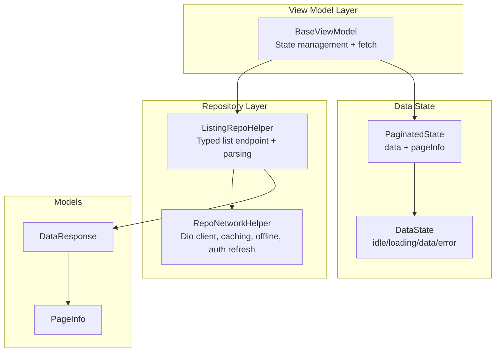
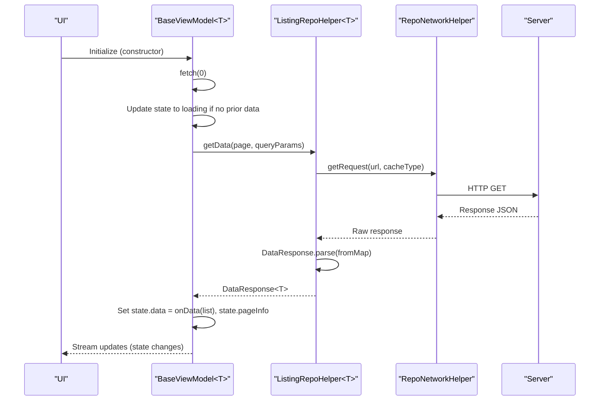
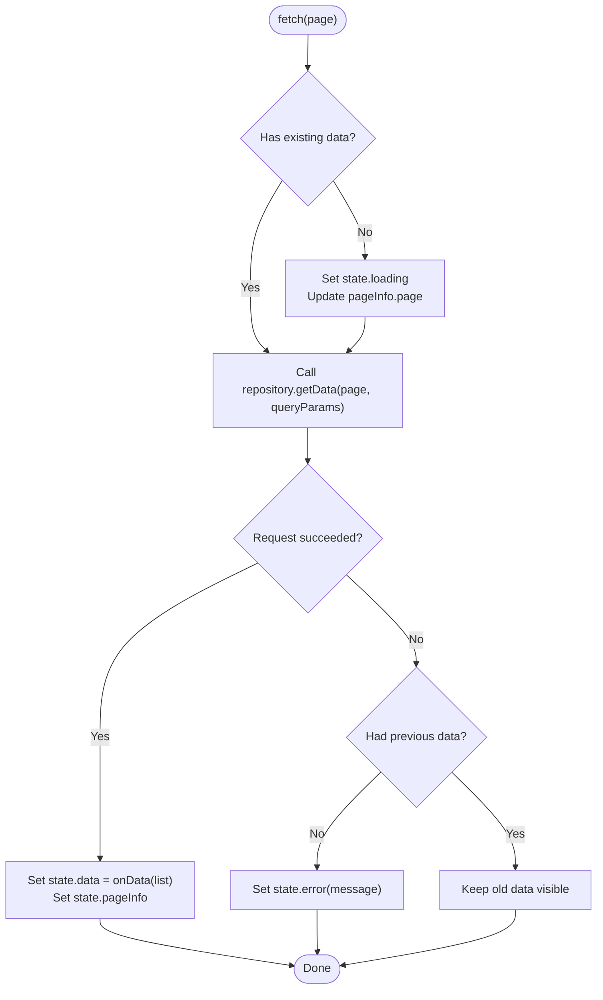
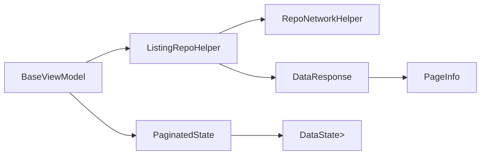

# ViewModel Architecture & Base Classes

<cite>
**Referenced Files in This Document**
- [base_view_model.dart](file://lib/app/core/logic/vm_helper/base_view_model.dart)
- [data_state.dart](file://lib/app/core/logic/data_state/data_state.dart)
- [paginated_data.dart](file://lib/app/core/logic/data_state/paginated_data.dart)
- [listing_repo_helper.dart](file://lib/app/core/logic/repository/listing_repo_helper.dart)
- [repo_network_helper.dart](file://lib/app/core/logic/repository/repo_network_helper.dart)
- [paginated_fetch.dart](file://lib/app/core/logic/repository/paginated_fetch.dart)
- [page_info.dart](file://lib/app/core/model/page_info.dart)
- [data_response.dart](file://lib/app/core/model/data_response.dart)
- [error.dart](file://lib/app/core/logic/repository/error.dart)
- [app_exception.dart](file://lib/app/core/logic/repository/app_exception.dart)
</cite>

## Table of Contents
1. Introduction
2. Project Structure
3. Core Components
4. Architecture Overview
5. Detailed Component Analysis
6. Dependency Analysis
7. Performance Considerations
8. Troubleshooting Guide
9. Conclusion
10. Appendices

## Introduction
This document explains the ViewModel architecture and base class implementation used to manage state, errors, and repository integration across the application. The core pattern is a generic BaseViewModel that encapsulates common behaviors such as loading states, error handling, pagination, and data fetching via a typed repository helper. It enables consistent, reusable view models while keeping business logic cleanly separated from UI concerns.

## Project Structure
The relevant parts of the codebase for this architecture are organized under lib/app/core:
- View model base and helpers: vm_helper
- Data state modeling: logic/data_state
- Repository abstractions and network layer: logic/repository
- Shared models: model

**Diagram sources**
- [base_view_model.dart:7-48](file://lib/app/core/logic/vm_helper/base_view_model.dart#L7-L48)
- [listing_repo_helper.dart:4-24](file://lib/app/core/logic/repository/listing_repo_helper.dart#L4-L24)
- [repo_network_helper.dart:72-126](file://lib/app/core/logic/repository/repo_network_helper.dart#L72-L126)
- [data_state.dart:1-23](file://lib/app/core/logic/data_state/data_state.dart#L1-L23)
- [paginated_data.dart:4-16](file://lib/app/core/logic/data_state/paginated_data.dart#L4-L16)
- [page_info.dart:3-32](file://lib/app/core/model/page_info.dart#L3-L32)
- [data_response.dart:3-19](file://lib/app/core/model/data_response.dart#L3-L19)

**Section sources**
- [base_view_model.dart:7-48](file://lib/app/core/logic/vm_helper/base_view_model.dart#L7-L48)
- [listing_repo_helper.dart:4-24](file://lib/app/core/logic/repository/listing_repo_helper.dart#L4-L24)
- [repo_network_helper.dart:72-126](file://lib/app/core/logic/repository/repo_network_helper.dart#L72-L126)
- [data_state.dart:1-23](file://lib/app/core/logic/data_state/data_state.dart#L1-L23)
- [paginated_data.dart:4-16](file://lib/app/core/logic/data_state/paginated_data.dart#L4-L16)
- [page_info.dart:3-32](file://lib/app/core/model/page_info.dart#L3-L32)
- [data_response.dart:3-19](file://lib/app/core/model/data_response.dart#L3-L19)

## Core Components
- BaseViewModel<T>: A generic stateful view model that manages PaginatedState<T>, performs page-based data fetching, and centralizes error handling. It integrates with a ListingRepoHelper<T> to fetch typed lists and exposes queryParams for filtering or sorting.
- DataState<T>: Represents lifecycle states (idle, loading, data, error) for any payload type.
- PaginatedState<T>: Holds a list payload wrapped in DataState along with PageInfo for pagination controls.
- ListingRepoHelper<T>: A typed repository mixin that builds paginated GET requests, applies caching strategies, and parses responses into DataResponse<T>.
- RepoNetworkHelper: Provides a configured Dio client with timeouts, automatic token refresh on 401, offline mode support, request caching, and uniform exception mapping.
- PageInfo and DataResponse<T>: Models for pagination metadata and parsed server payloads.

Key responsibilities:
- BaseViewModel handles UI-friendly state transitions and preserves existing data during page changes to avoid flashing spinners.
- ListingRepoHelper enforces consistent endpoint construction and response parsing.
- RepoNetworkHelper centralizes networking, caching, and error handling.

**Section sources**
- [base_view_model.dart:7-48](file://lib/app/core/logic/vm_helper/base_view_model.dart#L7-L48)
- [data_state.dart:1-23](file://lib/app/core/logic/data_state/data_state.dart#L1-L23)
- [paginated_data.dart:4-16](file://lib/app/core/logic/data_state/paginated_data.dart#L4-L16)
- [listing_repo_helper.dart:4-24](file://lib/app/core/logic/repository/listing_repo_helper.dart#L4-L24)
- [repo_network_helper.dart:72-126](file://lib/app/core/logic/repository/repo_network_helper.dart#L72-L126)
- [page_info.dart:3-32](file://lib/app/core/model/page_info.dart#L3-L32)
- [data_response.dart:3-19](file://lib/app/core/model/data_response.dart#L3-L19)

## Architecture Overview
The architecture follows a layered approach:
- View Model Layer: BaseViewModel<T> orchestrates state and delegates data operations to repositories.
- Repository Layer: ListingRepoHelper<T> composes network calls and parsing; RepoNetworkHelper provides shared HTTP capabilities.
- Data State: DataState<T> and PaginatedState<T> provide predictable, serializable state for UI consumption.
- Models: PageInfo and DataResponse<T> standardize pagination and payload structures.

**Diagram sources**
- [base_view_model.dart:7-48](file://lib/app/core/logic/vm_helper/base_view_model.dart#L7-L48)
- [listing_repo_helper.dart:4-24](file://lib/app/core/logic/repository/listing_repo_helper.dart#L4-L24)
- [repo_network_helper.dart:353-394](file://lib/app/core/logic/repository/repo_network_helper.dart#L353-L394)
- [data_response.dart:3-19](file://lib/app/core/model/data_response.dart#L3-L19)

## Detailed Component Analysis

### BaseViewModel<T>
Purpose:
- Provide a generic base for all view models with built-in pagination, loading/error states, and repository integration.
- Preserve user-visible data during page transitions to avoid spinner flashes.

Key behaviors:
- Constructor initializes state with idle data and triggers an initial fetch.
- fetch(int page) sets loading only when there is no existing data, then calls repository.getData with page and queryParams.
- On success, updates PaginatedState with parsed data and PageInfo.
- On error, sets error state only if there was no prior data, preserving previously shown content.

Extensibility:
- Override queryParams to add filters/sorting per feature.
- Subclass to add domain-specific methods while reusing fetch and state management.

**Diagram sources**
- [base_view_model.dart:15-45](file://lib/app/core/logic/vm_helper/base_view_model.dart#L15-L45)

**Section sources**
- [base_view_model.dart:7-48](file://lib/app/core/logic/vm_helper/base_view_model.dart#L7-L48)

### DataState<T> and PaginatedState<T>
Purpose:
- DataState<T> abstracts lifecycle states for any payload type.
- PaginatedState<T> couples a list payload with PageInfo for UI pagination widgets.

Usage:
- BaseViewModel emits PaginatedState<T> updates to subscribers.
- UI reads state.data.state to decide whether to show loading, data, or error.

**Section sources**
- [data_state.dart:1-23](file://lib/app/core/logic/data_state/data_state.dart#L1-L23)
- [paginated_data.dart:4-16](file://lib/app/core/logic/data_state/paginated_data.dart#L4-L16)

### ListingRepoHelper<T>
Purpose:
- Build paginated GET requests by appending page parameter and calling the network layer.
- Parse server responses into DataResponse<T> using a provided fromMap function.

Key points:
- Combines query parameters with page number.
- Uses RequestCacheType.fetch for list endpoints to enable caching where configured.
- Requires implementing endPoint and fromMap in concrete repositories.

**Section sources**
- [listing_repo_helper.dart:4-24](file://lib/app/core/logic/repository/listing_repo_helper.dart#L4-L24)

### RepoNetworkHelper
Purpose:
- Centralize HTTP configuration, timeouts, authentication headers, offline behavior, caching, and error mapping.
- Provide typed methods for GET/POST/PUT/PATCH/DELETE with optional caching and progress callbacks.

Highlights:
- Automatic token refresh on 401 via interceptor when configured.
- Offline mode detection and fallback to cached responses for fetch-type requests.
- Uniform exception mapping to AppException subclasses for consistent error handling.

**Section sources**
- [repo_network_helper.dart:72-126](file://lib/app/core/logic/repository/repo_network_helper.dart#L72-L126)
- [repo_network_helper.dart:286-394](file://lib/app/core/logic/repository/repo_network_helper.dart#L286-L394)
- [repo_network_helper.dart:397-479](file://lib/app/core/logic/repository/repo_network_helper.dart#L397-L479)
- [error.dart:19-94](file://lib/app/core/logic/repository/error.dart#L19-L94)
- [app_exception.dart:6-54](file://lib/app/core/logic/repository/app_exception.dart#L6-L54)

### Pagination Utilities
Purpose:
- PaginatedState and PageInfo provide structured pagination metadata for UI components.
- fetchAllPages utility supports bulk fetching across pages until fewer items are returned or maxPages reached.

Usage:
- Use PaginatedState in view models for interactive pagination.
- Use fetchAllPages for background sync or export scenarios where you need all records.

**Section sources**
- [paginated_data.dart:4-16](file://lib/app/core/logic/data_state/paginated_data.dart#L4-L16)
- [page_info.dart:3-32](file://lib/app/core/model/page_info.dart#L3-L32)
- [paginated_fetch.dart:1-19](file://lib/app/core/logic/repository/paginated_fetch.dart#L1-L19)

## Dependency Analysis
High-level dependencies:
- BaseViewModel depends on ListingRepoHelper<T> and emits PaginatedState<T>.
- ListingRepoHelper<T> depends on RepoNetworkHelper for HTTP and uses DataResponse<T> for parsing.
- RepoNetworkHelper depends on Dio and optional providers for connectivity and caching.
- DataResponse<T> depends on PageInfo for pagination metadata.

**Diagram sources**
- [base_view_model.dart:7-48](file://lib/app/core/logic/vm_helper/base_view_model.dart#L7-L48)
- [listing_repo_helper.dart:4-24](file://lib/app/core/logic/repository/listing_repo_helper.dart#L4-L24)
- [repo_network_helper.dart:72-126](file://lib/app/core/logic/repository/repo_network_helper.dart#L72-L126)
- [data_response.dart:3-19](file://lib/app/core/model/data_response.dart#L3-L19)
- [page_info.dart:3-32](file://lib/app/core/model/page_info.dart#L3-L32)
- [paginated_data.dart:4-16](file://lib/app/core/logic/data_state/paginated_data.dart#L4-L16)
- [data_state.dart:1-23](file://lib/app/core/logic/data_state/data_state.dart#L1-L23)

**Section sources**
- [base_view_model.dart:7-48](file://lib/app/core/logic/vm_helper/base_view_model.dart#L7-L48)
- [listing_repo_helper.dart:4-24](file://lib/app/core/logic/repository/listing_repo_helper.dart#L4-L24)
- [repo_network_helper.dart:72-126](file://lib/app/core/logic/repository/repo_network_helper.dart#L72-L126)
- [data_response.dart:3-19](file://lib/app/core/model/data_response.dart#L3-L19)
- [page_info.dart:3-32](file://lib/app/core/model/page_info.dart#L3-L32)
- [paginated_data.dart:4-16](file://lib/app/core/logic/data_state/paginated_data.dart#L4-L16)
- [data_state.dart:1-23](file://lib/app/core/logic/data_state/data_state.dart#L1-L23)

## Performance Considerations
- Avoid unnecessary loading indicators: BaseViewModel only shows loading when there is no existing data, improving perceived performance during pagination.
- Caching strategy: ListingRepoHelper uses fetch-type caching for list endpoints; configure caching provider to reduce network load.
- Timeouts: RepoNetworkHelper configures connect/send/receive timeouts to fail fast on slow networks.
- Token refresh: Automatic retry on 401 reduces manual error handling and improves resilience.
- Bulk fetching: Use fetchAllPages for batch operations to minimize UI churn and simplify background tasks.

[No sources needed since this section provides general guidance]

## Troubleshooting Guide
Common issues and resolutions:
- Network errors: RepoNetworkHelper maps Dio exceptions to specific AppException types (e.g., InternetException, BadRequestException, UnauthorizedException). Handle these at the UI or higher layers to present meaningful messages.
- Offline mode: When offline, fetch-type requests return cached responses if available; otherwise, an exception is thrown. Ensure your UI handles offline states gracefully.
- Invalid server responses: DataResponse.parse validates structure and throws descriptive errors; ensure your fromMap aligns with server schema.
- Token expiration: If configured, 401 responses trigger token refresh and retry; if refresh fails, the original error propagates for session recovery flows.

**Section sources**
- [error.dart:19-94](file://lib/app/core/logic/repository/error.dart#L19-L94)
- [repo_network_helper.dart:286-394](file://lib/app/core/logic/repository/repo_network_helper.dart#L286-L394)
- [data_response.dart:3-19](file://lib/app/core/model/data_response.dart#L3-L19)

## Conclusion
The BaseViewModel pattern provides a robust foundation for managing state, errors, and data fetching across features. By leveraging generic typing, standardized data states, and a unified repository layer, teams can implement feature-specific view models quickly while maintaining consistency, testability, and separation of concerns. Pagination utilities and network helpers further streamline complex workflows like infinite scrolling and bulk data retrieval.

[No sources needed since this section summarizes without analyzing specific files]

## Appendices

### How to Extend BaseViewModel for Specific Features
- Create a subclass of BaseViewModel<T> and inject a concrete ListingRepoHelper<T> that implements endPoint and fromMap for your domain model.
- Override queryParams to include filters, sorting, or search terms.
- Add domain-specific methods that mutate state or call additional repositories as needed.

**Section sources**
- [base_view_model.dart:7-48](file://lib/app/core/logic/vm_helper/base_view_model.dart#L7-L48)
- [listing_repo_helper.dart:4-24](file://lib/app/core/logic/repository/listing_repo_helper.dart#L4-L24)

### Implementing Generic Type Support
- BaseViewModel<T> and ListingRepoHelper<T> use generics to ensure type safety for payloads and parsers.
- Provide a fromMap function in your repository to convert raw maps into your domain objects.

**Section sources**
- [listing_repo_helper.dart:4-24](file://lib/app/core/logic/repository/listing_repo_helper.dart#L4-L24)
- [data_response.dart:3-19](file://lib/app/core/model/data_response.dart#L3-L19)

### Leveraging Built-in Pagination and Data Loading Patterns
- Use BaseViewModel’s fetch method to navigate pages; it maintains current data and updates pageInfo.
- For full-data exports or background sync, use fetchAllPages to iterate through pages until completion.

**Section sources**
- [base_view_model.dart:15-45](file://lib/app/core/logic/vm_helper/base_view_model.dart#L15-L45)
- [paginated_fetch.dart:1-19](file://lib/app/core/logic/repository/paginated_fetch.dart#L1-L19)

### Managing Complex Business Logic While Maintaining Separation of Concerns
- Keep UI-related state in BaseViewModel-derived classes.
- Encapsulate business rules in repository methods or separate service classes.
- Use DataState and PaginatedState to communicate outcomes to the UI without leaking implementation details.

**Section sources**
- [data_state.dart:1-23](file://lib/app/core/logic/data_state/data_state.dart#L1-L23)
- [paginated_data.dart:4-16](file://lib/app/core/logic/data_state/paginated_data.dart#L4-L16)