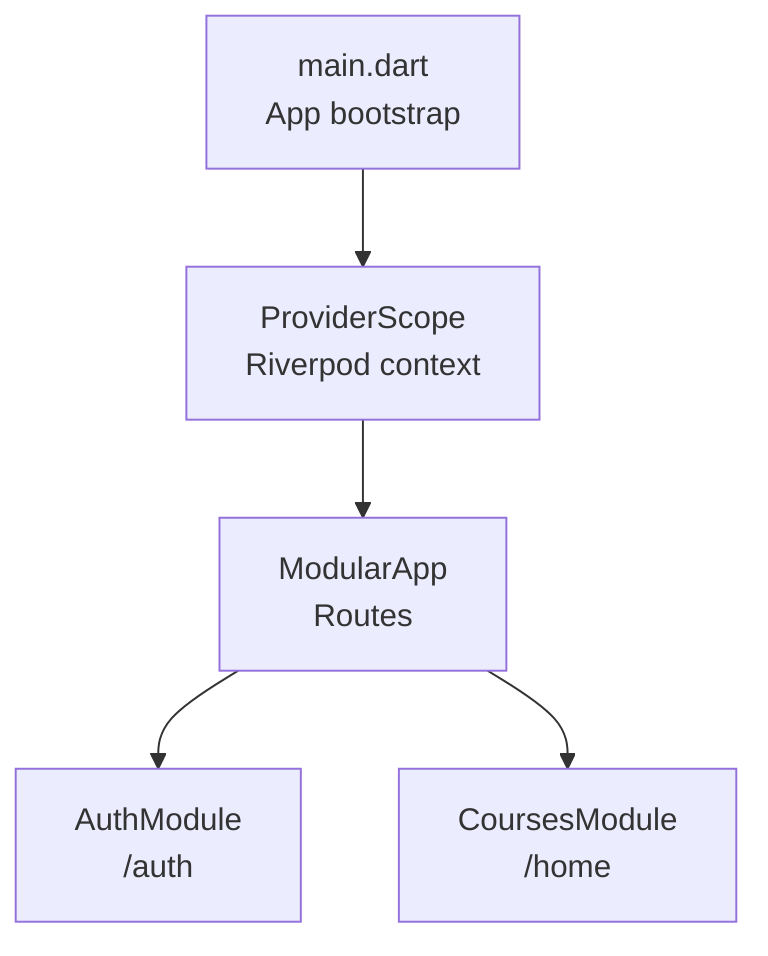
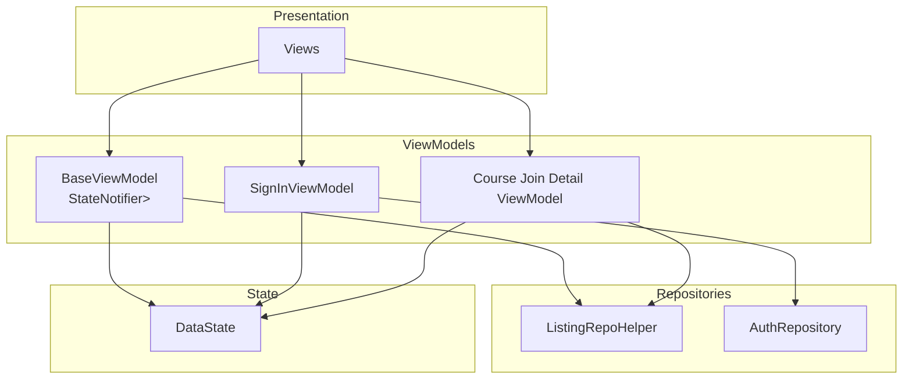
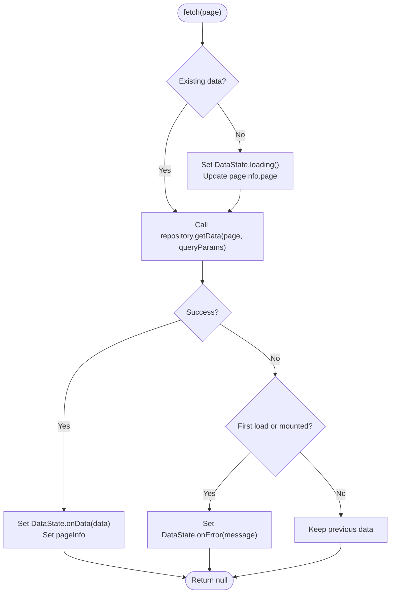
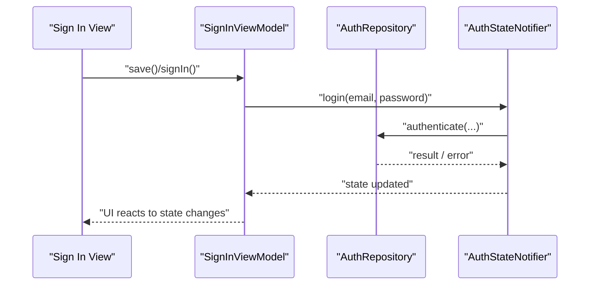
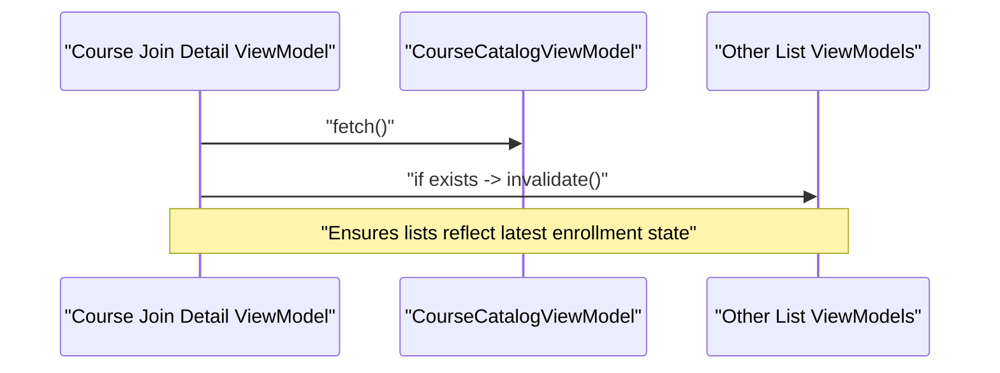
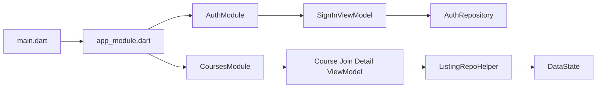

# ViewModel Patterns & Business Logic

<cite>
**Referenced Files in This Document**
- [main.dart](file://lib/main.dart)
- [app_module.dart](file://lib/app_module.dart)
- [pubspec.yaml](file://pubspec.yaml)
- [base_view_model.dart](file://lib/app/core/logic/vm_helper/base_view_model.dart)
- [data_state.dart](file://lib/app/core/logic/data_state/data_state.dart)
- [listing_repo_helper.dart](file://lib/app/core/logic/repository/listing_repo_helper.dart)
- [signin_viewmodel.dart](file://lib/app/features/authentication/viewmodel/signin_viewmodel.dart)
- [course_join_detail_view_model.dart](file://lib/app/features/courses/viewmodel/course_join_detail_view_model.dart)
</cite>

## Table of Contents
1. Introduction
2. Project Structure
3. Core Components
4. Architecture Overview
5. Detailed Component Analysis
6. Dependency Analysis
7. Performance Considerations
8. Troubleshooting Guide
9. Conclusion

## Introduction
This document explains how the application implements MVVM with Riverpod StateNotifier to organize business logic in ViewModels, expose state through providers, and keep presentation separate from domain logic. It covers view model composition, dependency injection, asynchronous operations, error handling, state transitions, reusable patterns, testing strategies, and performance optimization techniques grounded in the codebase.

## Project Structure
The app is a Flutter application that uses Riverpod for state management and modular routing via Flutter Modular. The entry point initializes localization, media, and wraps the app with ProviderScope so Riverpod can manage providers throughout the widget tree. Routing modules are registered at startup, and feature modules (authentication, courses, etc.) encapsulate their own routes and dependencies.

**Diagram sources**
- [main.dart:16-37](file://lib/main.dart#L16-L37)
- [app_module.dart:7-20](file://lib/app_module.dart#L7-L20)

**Section sources**
- [main.dart:16-37](file://lib/main.dart#L16-L37)
- [app_module.dart:7-20](file://lib/app_module.dart#L7-L20)
- [pubspec.yaml:30-44](file://pubspec.yaml#L30-L44)

## Core Components
- BaseViewModel: A generic StateNotifier-based view model for paginated data fetching, error handling, and UI-friendly loading states.
- DataState: A typed state wrapper representing idle/loading/data/error phases for async results.
- ListingRepoHelper: A repository mixin that standardizes paginated network requests and response parsing.
- Feature ViewModels: Concrete implementations such as SignInViewModel and Course join/detail view models that compose repositories and other providers.

Key responsibilities:
- Encapsulate business logic in ViewModels.
- Expose state via Riverpod providers.
- Centralize async operation handling and error mapping.
- Provide reusable pagination behavior.

**Section sources**
- [base_view_model.dart:7-48](file://lib/app/core/logic/vm_helper/base_view_model.dart#L7-L48)
- [data_state.dart:1-22](file://lib/app/core/logic/data_state/data_state.dart#L1-L22)
- [listing_repo_helper.dart:4-24](file://lib/app/core/logic/repository/listing_repo_helper.dart#L4-L24)

## Architecture Overview
The MVVM architecture separates concerns as follows:
- Presentation layer (Views): Read-only access to provider state; no business logic.
- ViewModel layer: StateNotifier instances that coordinate repositories and other services; emit state changes.
- Repository layer: Network and caching abstractions; parse responses into domain models.
- Providers: Riverpod-managed singletons or scoped instances that wire ViewModels and dependencies.

**Diagram sources**
- [base_view_model.dart:7-48](file://lib/app/core/logic/vm_helper/base_view_model.dart#L7-L48)
- [data_state.dart:1-22](file://lib/app/core/logic/data_state/data_state.dart#L1-L22)
- [listing_repo_helper.dart:4-24](file://lib/app/core/logic/repository/listing_repo_helper.dart#L4-L24)
- [signin_viewmodel.dart:9-50](file://lib/app/features/authentication/viewmodel/signin_viewmodel.dart#L9-L50)
- [course_join_detail_view_model.dart:152-171](file://lib/app/features/courses/viewmodel/course_join_detail_view_model.dart#L152-L171)

## Detailed Component Analysis

### BaseViewModel: Paginated State Management
BaseViewModel extends StateNotifier with a paginated state shape. It:
- Starts with an idle state and triggers initial fetch.
- Preserves existing data during page changes to avoid full-screen spinners when data already exists.
- Updates state to loading only on first load or after errors.
- Wraps repository calls and maps success/failure into DataState.
- Provides a queryParams getter for derived classes to extend query parameters.

**Diagram sources**
- [base_view_model.dart:15-45](file://lib/app/core/logic/vm_helper/base_view_model.dart#L15-L45)

**Section sources**
- [base_view_model.dart:7-48](file://lib/app/core/logic/vm_helper/base_view_model.dart#L7-L48)

### DataState: Typed Async State Representation
DataState encapsulates three fields:
- data: optional payload
- error: optional message
- state: enum indicating current phase (idle, loading, data, error)

Factory methods provide immutable creation of common states, enabling consistent UI branching and predictable updates.

**Section sources**
- [data_state.dart:1-22](file://lib/app/core/logic/data_state/data_state.dart#L1-L22)

### ListingRepoHelper: Standardized Pagination and Parsing
ListingRepoHelper adds pagination to network helpers by:
- Injecting page into query parameters.
- Building a URI with endpoint and query parameters.
- Performing a GET request with a specified cache type.
- Parsing the response into a typed DataResponse using a provided mapper.

This abstraction ensures consistent API consumption across ViewModels.

**Section sources**
- [listing_repo_helper.dart:4-24](file://lib/app/core/logic/repository/listing_repo_helper.dart#L4-L24)

### SignInViewModel: Composition and Dependency Injection
SignInViewModel demonstrates:
- Composition of multiple dependencies: AuthRepository and AuthStateNotifier.
- Use of ChangeNotifierProvider to expose the ViewModel as a Riverpod provider.
- Delegation of authentication flow to AuthStateNotifier while managing local form state and UI toggles.
- Integration with a form handler mixin to centralize validation and submission.

**Diagram sources**
- [signin_viewmodel.dart:9-50](file://lib/app/features/authentication/viewmodel/signin_viewmodel.dart#L9-L50)

**Section sources**
- [signin_viewmodel.dart:9-50](file://lib/app/features/authentication/viewmodel/signin_viewmodel.dart#L9-L50)

### Course Join Detail ViewModel: Cross-ViewModel Coordination
This ViewModel coordinates multiple related ViewModels by invalidating them after a significant action (e.g., joining a course). It:
- Triggers a refresh on the course catalog.
- Safely invalidates other auto-disposed providers only if they exist to avoid post-disposal usage.
- Exposes helper utilities for error classification (e.g., not found) used by views.

**Diagram sources**
- [course_join_detail_view_model.dart:152-171](file://lib/app/features/courses/viewmodel/course_join_detail_view_model.dart#L152-L171)

**Section sources**
- [course_join_detail_view_model.dart:152-186](file://lib/app/features/courses/viewmodel/course_join_detail_view_model.dart#L152-L186)

## Dependency Analysis
- Application bootstraps Riverpod via ProviderScope and integrates with Modular routing.
- Feature ViewModels depend on repositories and global state providers.
- BaseViewModel depends on ListingRepoHelper and DataState for consistent async handling.
- Providers enable dependency injection and lifecycle management.

**Diagram sources**
- [main.dart:16-37](file://lib/main.dart#L16-L37)
- [app_module.dart:7-20](file://lib/app_module.dart#L7-L20)
- [signin_viewmodel.dart:9-50](file://lib/app/features/authentication/viewmodel/signin_viewmodel.dart#L9-L50)
- [course_join_detail_view_model.dart:152-171](file://lib/app/features/courses/viewmodel/course_join_detail_view_model.dart#L152-L171)
- [listing_repo_helper.dart:4-24](file://lib/app/core/logic/repository/listing_repo_helper.dart#L4-L24)
- [data_state.dart:1-22](file://lib/app/core/logic/data_state/data_state.dart#L1-L22)

**Section sources**
- [pubspec.yaml:30-44](file://pubspec.yaml#L30-L44)
- [main.dart:16-37](file://lib/main.dart#L16-L37)
- [app_module.dart:7-20](file://lib/app_module.dart#L7-L20)

## Performance Considerations
- Preserve existing data during pagination: BaseViewModel avoids showing a full-screen spinner when data already exists, improving perceived performance.
- Conditional invalidation: Course Join Detail ViewModel checks ref.exists before invalidating providers to prevent unnecessary rebuilds and post-disposal errors.
- AutoDispose pattern: Using auto-disposed providers ensures memory is reclaimed when not watched, reducing overhead.
- Efficient state updates: DataState provides immutable snapshots, minimizing rebuild scope in the UI.

[No sources needed since this section provides general guidance]

## Troubleshooting Guide
Common issues and resolutions:
- Post-disposal usage: When invalidating providers, ensure they still exist to avoid “Bad state: Tried to use X after dispose was called.” See conditional invalidation in the course join detail ViewModel.
- First-load error handling: BaseViewModel sets error state only when there is no prior data, preserving user’s last successful view.
- Authentication failures: SignInViewModel delegates to AuthStateNotifier; ensure error propagation reaches the view for user feedback.

**Section sources**
- [course_join_detail_view_model.dart:152-171](file://lib/app/features/courses/viewmodel/course_join_detail_view_model.dart#L152-L171)
- [base_view_model.dart:15-45](file://lib/app/core/logic/vm_helper/base_view_model.dart#L15-L45)
- [signin_viewmodel.dart:35-43](file://lib/app/features/authentication/viewmodel/signin_viewmodel.dart#L35-L43)

## Conclusion
The application adopts a clean MVVM architecture with Riverpod StateNotifier to encapsulate business logic in ViewModels, expose state through providers, and maintain separation between presentation and domain layers. BaseViewModel standardizes pagination and async state handling, while feature-specific ViewModels compose repositories and coordinate cross-feature state updates. This approach yields testable, maintainable, and performant code with clear boundaries and predictable state transitions.