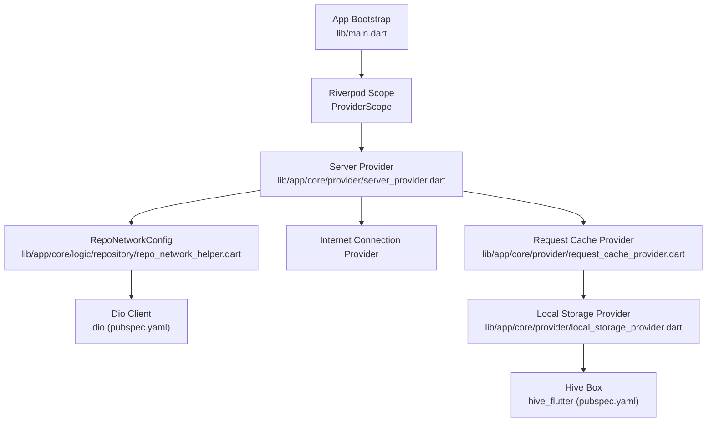
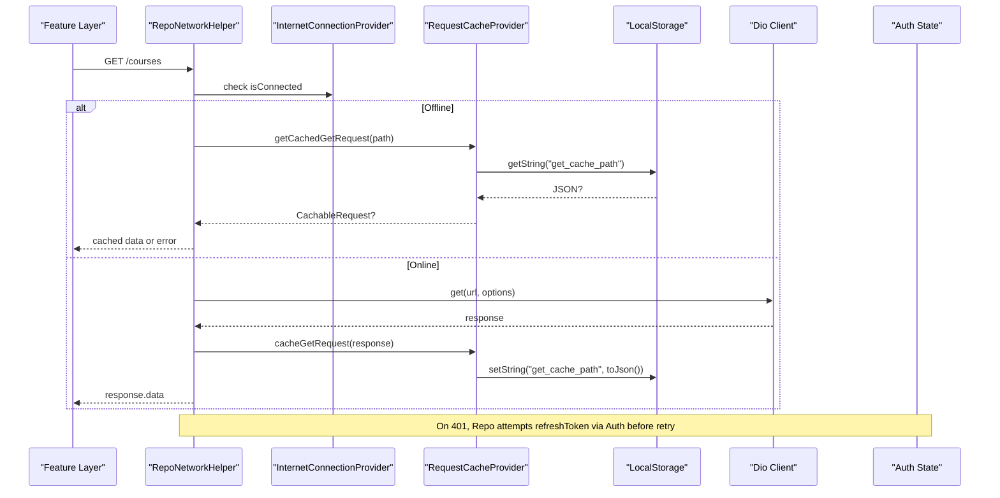
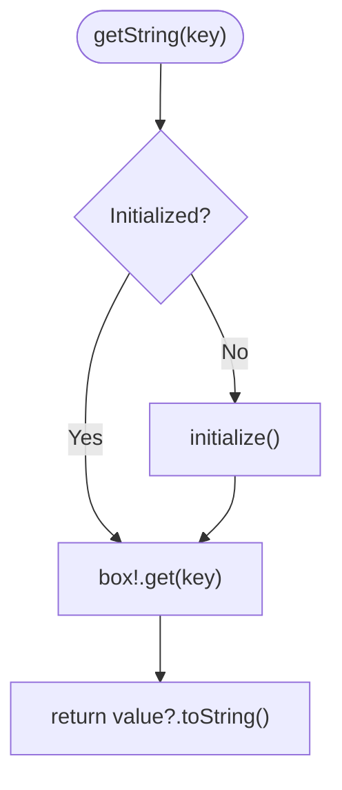
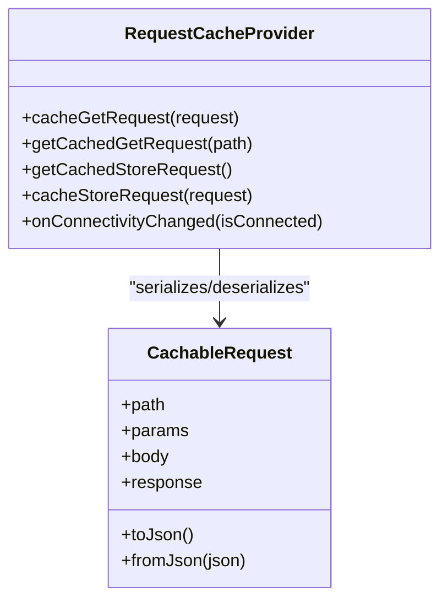
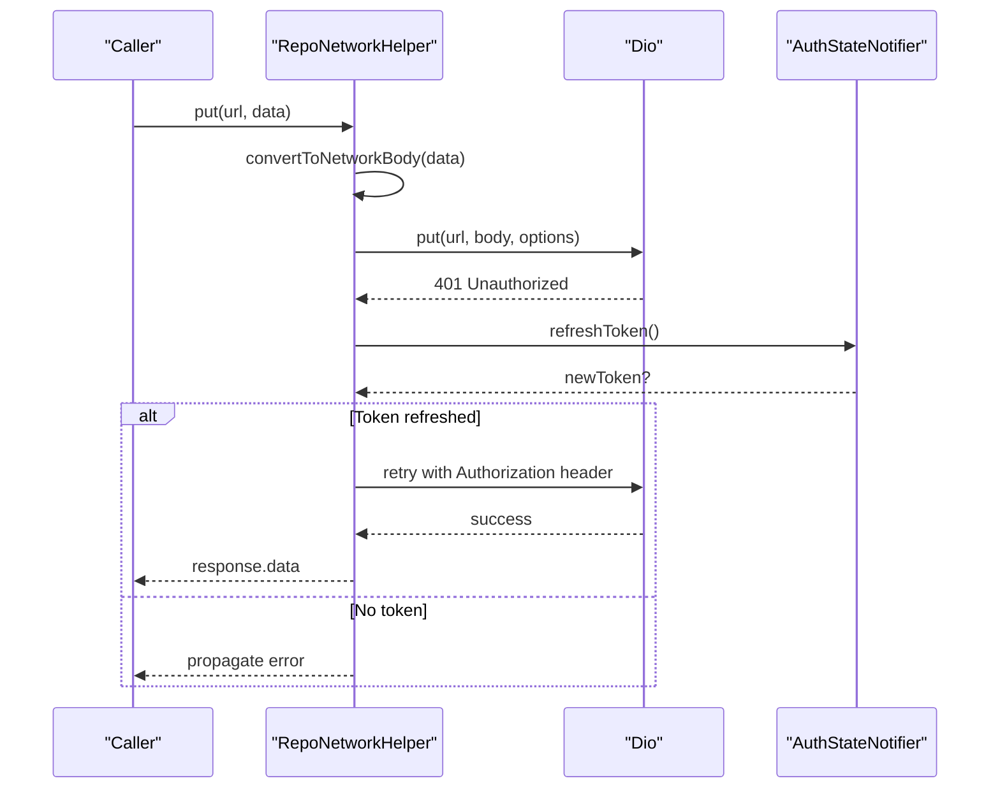
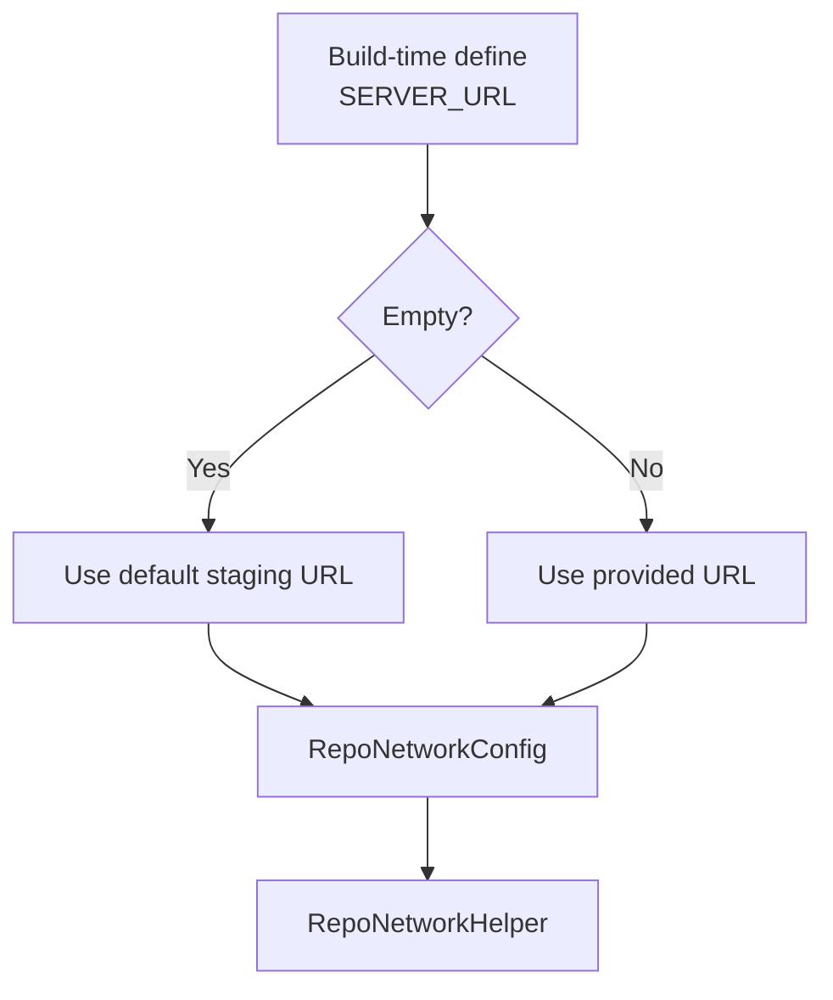
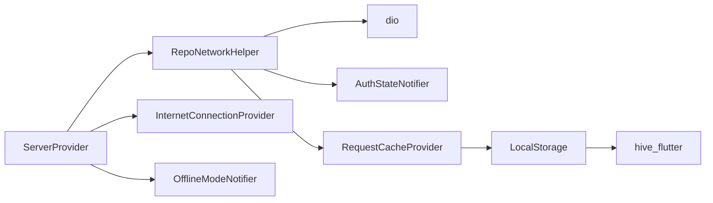

# Utility Services & Helpers

<cite>
**Referenced Files in This Document**
- [main.dart](file://lib/main.dart)
- [pubspec.yaml](file://pubspec.yaml)
- [core.dart](file://lib/app/core/core.dart)
- [server_provider.dart](file://lib/app/core/provider/server_provider.dart)
- [local_storage_provider.dart](file://lib/app/core/provider/local_storage_provider.dart)
- [request_cache_provider.dart](file://lib/app/core/provider/request_cache_provider.dart)
- [repo_network_helper.dart](file://lib/app/core/logic/repository/repo_network_helper.dart)
</cite>

## Table of Contents
1. [Introduction](#introduction)
2. [Project Structure](#project-structure)
3. [Core Components](#core-components)
4. [Architecture Overview](#architecture-overview)
5. [Detailed Component Analysis](#detailed-component-analysis)
6. [Dependency Analysis](#dependency-analysis)
7. [Performance Considerations](#performance-considerations)
8. [Troubleshooting Guide](#troubleshooting-guide)
9. [Conclusion](#conclusion)
10. [Appendices](#appendices)

## Introduction
This document explains the utility services and helper functions that power data persistence, network communication, configuration management, caching, error handling, serialization, logging, validation, and common business logic abstractions in Leadership Edge Live LMS. It focuses on:
- Local storage utility for persistent key-value data
- Network helper for API communication with retry, offline support, and token refresh
- Server provider for environment-based configuration
- Caching strategies for GET requests and queued store requests
- Error handling patterns and data serialization utilities
- Logging mechanisms, validation helpers, and reusable business logic
- Extensibility patterns, performance optimization, memory management, and testing strategies

## Project Structure
The utility layer is organized under lib/app/core and integrates with providers and repositories:
- Providers expose configuration and shared services via Riverpod
- Repositories encapsulate network calls and caching
- Utilities provide formatting, debouncing, theme, and size helpers
- The app bootstrap initializes media, localization, and cleanup tasks

**Diagram sources**
- [main.dart:16-37](file://lib/main.dart#L16-L37)
- [server_provider.dart:15-38](file://lib/app/core/provider/server_provider.dart#L15-L38)
- [repo_network_helper.dart:103-126](file://lib/app/core/logic/repository/repo_network_helper.dart#L103-L126)
- [request_cache_provider.dart:9-28](file://lib/app/core/provider/request_cache_provider.dart#L9-L28)
- [local_storage_provider.dart:6-47](file://lib/app/core/provider/local_storage_provider.dart#L6-L47)
- [pubspec.yaml:40-44](file://pubspec.yaml#L40-L44)

**Section sources**
- [main.dart:16-37](file://lib/main.dart#L16-L37)
- [pubspec.yaml:40-44](file://pubspec.yaml#L40-L44)

## Core Components
- LocalStorage: A Hive-backed key-value store with lazy initialization and cross-platform path resolution.
- RequestCacheProvider: Manages cached GET responses and queued POST/PUT/PATCH/DELETE requests; resynchronizes on connectivity changes.
- RepoNetworkHelper: Centralized HTTP client with token refresh, offline fallback, request conversion to JSON or FormData, progress callbacks, and cache integration.
- ServerProvider: Provides runtime server URL and a RepoNetworkConfig wired to auth state, connection status, and manual offline mode.

Key responsibilities:
- Persistence: LocalStorage persists small payloads and caches metadata.
- Networking: RepoNetworkHelper abstracts Dio usage, headers, retries, and error handling.
- Configuration: ServerProvider centralizes environment-specific URLs and config injection.
- Caching: RequestCacheProvider serializes requests/responses and handles sync when online.

**Section sources**
- [local_storage_provider.dart:6-47](file://lib/app/core/provider/local_storage_provider.dart#L6-L47)
- [request_cache_provider.dart:9-119](file://lib/app/core/provider/request_cache_provider.dart#L9-L119)
- [repo_network_helper.dart:103-126](file://lib/app/core/logic/repository/repo_network_helper.dart#L103-L126)
- [server_provider.dart:15-38](file://lib/app/core/provider/server_provider.dart#L15-L38)

## Architecture Overview
The system composes providers and repositories to deliver resilient networking and reliable local persistence:
- ServerProvider supplies RepoNetworkConfig with dynamic server URL, auth token, connection state, and manual offline flag.
- RepoNetworkHelper uses Dio with interceptors to handle token refresh and errors, and integrates with RequestCacheProvider for offline-first behavior.
- RequestCacheProvider persists GET responses and queues write operations until connectivity resumes.
- LocalStorage provides a simple key-value interface backed by Hive.

**Diagram sources**
- [repo_network_helper.dart:103-126](file://lib/app/core/logic/repository/repo_network_helper.dart#L103-L126)
- [repo_network_helper.dart:353-394](file://lib/app/core/logic/repository/repo_network_helper.dart#L353-L394)
- [request_cache_provider.dart:34-44](file://lib/app/core/provider/request_cache_provider.dart#L34-L44)
- [local_storage_provider.dart:13-28](file://lib/app/core/provider/local_storage_provider.dart#L13-L28)
- [server_provider.dart:19-38](file://lib/app/core/provider/server_provider.dart#L19-L38)

## Detailed Component Analysis

### LocalStorage (Local Data Persistence)
- Purpose: Provide a typed string key-value store with automatic Hive initialization per platform.
- Initialization: Lazily opens a named box; on web uses Hive.initFlutter; on native resolves application support directory.
- API surface: getString/setString with async semantics; box reference retained after init.

**Diagram sources**
- [local_storage_provider.dart:13-28](file://lib/app/core/provider/local_storage_provider.dart#L13-L28)
- [local_storage_provider.dart:34-47](file://lib/app/core/provider/local_storage_provider.dart#L34-L47)

**Section sources**
- [local_storage_provider.dart:6-47](file://lib/app/core/provider/local_storage_provider.dart#L6-L47)

### RequestCacheProvider (Caching & Queueing)
- GET caching: Stores serialized CachableRequest for GET endpoints keyed by path.
- Store queue: Maintains a list of write requests; on connectivity restored, replays them via CachedRequestRepository and updates persisted queue.
- Serialization: Uses jsonEncode/jsonDecode to persist complex objects.

**Diagram sources**
- [request_cache_provider.dart:9-79](file://lib/app/core/provider/request_cache_provider.dart#L9-L79)
- [request_cache_provider.dart:81-119](file://lib/app/core/provider/request_cache_provider.dart#L81-L119)

**Section sources**
- [request_cache_provider.dart:9-119](file://lib/app/core/provider/request_cache_provider.dart#L9-L119)

### RepoNetworkHelper (API Communication)
- Token refresh: Intercepts 401 responses, attempts refresh via AuthStateNotifier, then retries the original request once.
- Offline detection: Checks manual offline mode and connection provider; routes to offline flow if needed.
- Body conversion: Serializes to network format; detects FormData needs and wraps accordingly.
- HTTP methods: Unified GET/PUT/DELETE/PATCH with optional cache types and progress callbacks.
- Error handling: Centralized exception handler; rethrows after processing.

**Diagram sources**
- [repo_network_helper.dart:103-126](file://lib/app/core/logic/repository/repo_network_helper.dart#L103-L126)
- [repo_network_helper.dart:127-140](file://lib/app/core/logic/repository/repo_network_helper.dart#L127-L140)
- [repo_network_helper.dart:396-423](file://lib/app/core/logic/repository/repo_network_helper.dart#L396-L423)

**Section sources**
- [repo_network_helper.dart:103-140](file://lib/app/core/logic/repository/repo_network_helper.dart#L103-L140)
- [repo_network_helper.dart:353-479](file://lib/app/core/logic/repository/repo_network_helper.dart#L353-L479)

### ServerProvider (Configuration Management)
- Environment URL: Reads SERVER_URL from build-time defines; falls back to staging URL.
- Config composition: Builds RepoNetworkConfig with live references to auth token, connection state, manual offline toggle, and token refresh function.
- Dependency wiring: Uses Riverpod ref.watch/ref.read to avoid unnecessary rebuilds while keeping behavior current.

**Diagram sources**
- [server_provider.dart:8-17](file://lib/app/core/provider/server_provider.dart#L8-L17)
- [server_provider.dart:19-38](file://lib/app/core/provider/server_provider.dart#L19-L38)

**Section sources**
- [server_provider.dart:8-38](file://lib/app/core/provider/server_provider.dart#L8-L38)

### App Bootstrap Integration
- Initializes MediaKit, EasyLocalization, and performs best-effort cleanup of temporary viewing files at startup.
- Wraps the app in ProviderScope and ModularApp for dependency injection and routing.

**Section sources**
- [main.dart:16-37](file://lib/main.dart#L16-L37)

## Dependency Analysis
- External libraries:
  - dio: HTTP client used by RepoNetworkHelper
  - hive_flutter: Local storage backend for LocalStorage and cache persistence
  - flutter_riverpod: Provider model for ServerProvider and related services
  - internet_connection_checker_plus: Connectivity monitoring
  - flutter_cache_manager: Used elsewhere in the app for file/media caching
- Internal coupling:
  - ServerProvider depends on InternetConnectionProvider, OfflineModeNotifier, AuthStateNotifier, and RequestCacheProvider
  - RepoNetworkHelper depends on Dio, AuthStateNotifier, and RequestCacheProvider
  - RequestCacheProvider depends on LocalStorage and InternetConnectionProvider

**Diagram sources**
- [repo_network_helper.dart:103-126](file://lib/app/core/logic/repository/repo_network_helper.dart#L103-L126)
- [request_cache_provider.dart:9-28](file://lib/app/core/provider/request_cache_provider.dart#L9-L28)
- [local_storage_provider.dart:6-47](file://lib/app/core/provider/local_storage_provider.dart#L6-L47)
- [server_provider.dart:19-38](file://lib/app/core/provider/server_provider.dart#L19-L38)
- [pubspec.yaml:40-44](file://pubspec.yaml#L40-L44)

**Section sources**
- [pubspec.yaml:40-44](file://pubspec.yaml#L40-L44)
- [server_provider.dart:19-38](file://lib/app/core/provider/server_provider.dart#L19-L38)

## Performance Considerations
- Lazy initialization: LocalStorage defers Hive setup until first access to reduce startup cost.
- Minimal rebuilds: ServerProvider uses ref.read for toggles and refresh functions to prevent unnecessary provider recreation.
- Selective caching: GET responses are cached by path; write operations are queued and replayed only when connectivity returns.
- Memory hygiene: Ensure providers are disposed where applicable; avoid retaining large objects in cache keys or bodies.
- Network efficiency: Use progress callbacks for uploads/downloads; leverage Dio’s built-in cancellation tokens to abort stale requests.
- Serialization overhead: Keep cached payloads compact; consider TTL or invalidation policies for frequently changing data.

[No sources needed since this section provides general guidance]

## Troubleshooting Guide
- Offline behavior: If requests fail unexpectedly, verify manual offline mode and connectivity provider state; ensure RequestCacheProvider listeners are active.
- Token refresh failures: When 401 occurs repeatedly, confirm AuthStateNotifier.refreshAccessToken succeeds and that Authorization header is updated on retry.
- Cache inconsistencies: Validate that cache keys match endpoint paths exactly; inspect stored JSON for malformed entries.
- Storage issues: Confirm Hive box name and initialization path; on web, ensure Hive.initFlutter is called before use.
- Build-time config: Verify SERVER_URL dart-define is correctly passed to run/build commands; fall back to default URL if empty.

**Section sources**
- [repo_network_helper.dart:103-126](file://lib/app/core/logic/repository/repo_network_helper.dart#L103-L126)
- [request_cache_provider.dart:63-78](file://lib/app/core/provider/request_cache_provider.dart#L63-L78)
- [local_storage_provider.dart:34-47](file://lib/app/core/provider/local_storage_provider.dart#L34-L47)
- [server_provider.dart:8-17](file://lib/app/core/provider/server_provider.dart#L8-L17)

## Conclusion
The utility layer in Leadership Edge Live LMS provides a robust foundation for persistence, networking, configuration, and caching. By combining Riverpod providers, a centralized network helper, and a flexible caching strategy, the app supports both online and offline experiences with minimal friction. Extending these utilities involves adding new validators, custom serializers, or additional cache policies while preserving the established patterns for error handling and dependency injection.

[No sources needed since this section summarizes without analyzing specific files]

## Appendices

### Extending Utility Services
- Add a new validator: Create a dedicated validator class and integrate it into form controllers or repository input checks.
- Implement custom serializers: Extend conversion logic in RepoNetworkHelper.convertToNetworkBody to support new content types or payload shapes.
- Integrate third-party libraries: Register new providers in ServerProvider or feature modules; wire dependencies through Riverpod to maintain testability.

[No sources needed since this section provides general guidance]

### Testing Strategies
- Unit tests: Mock LocalStorage and RequestCacheProvider to validate caching and queueing logic; assert JSON serialization correctness.
- Network tests: Stub Dio responses and simulate 401 flows to verify token refresh and retry behavior.
- Provider tests: Use Riverpod’s testing utilities to assert ServerProvider config values and dependency wiring.
- Integration tests: Exercise full flows from UI to network with mocked connectivity and storage to ensure end-to-end reliability.

[No sources needed since this section provides general guidance]