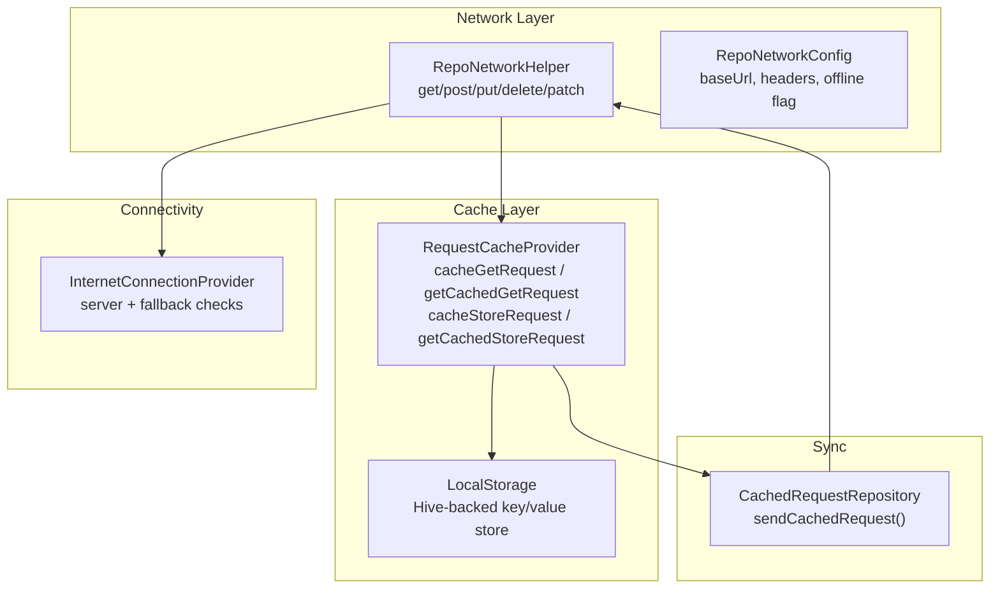
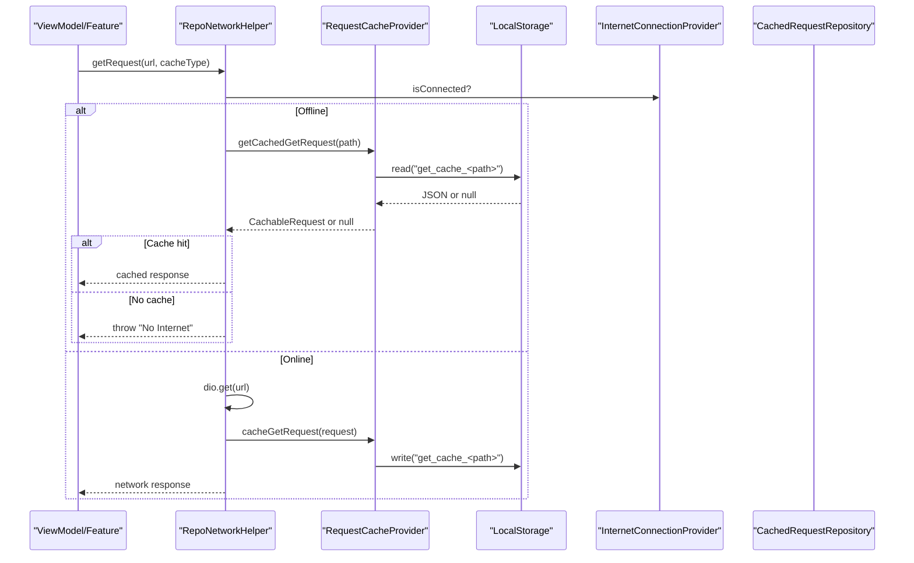
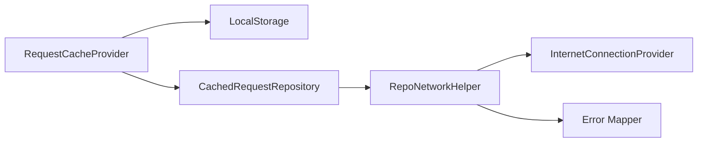
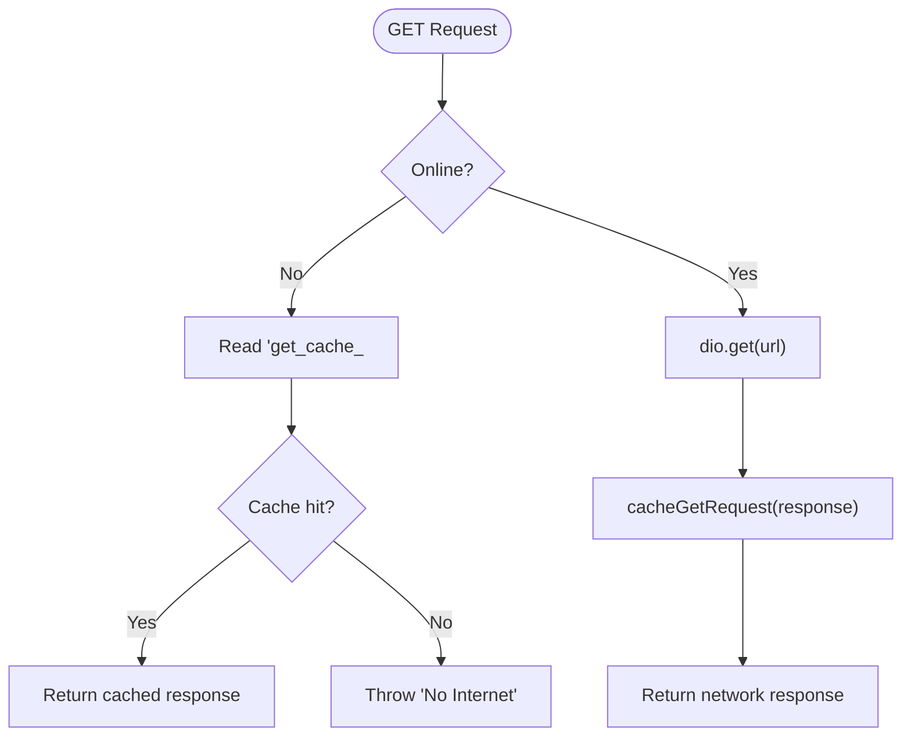
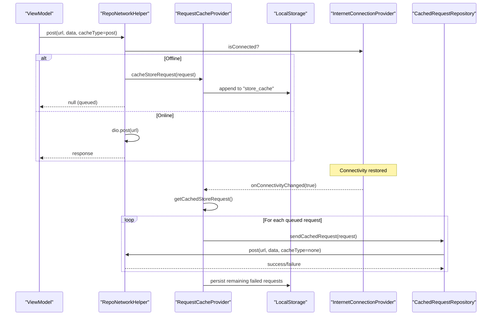

# Caching Strategy

<cite>
**Referenced Files in This Document**
- [repo_network_helper.dart](file://lib/app/core/logic/repository/repo_network_helper.dart)
- [request_cache_provider.dart](file://lib/app/core/provider/request_cache_provider.dart)
- [cached_request_repository.dart](file://lib/app/core/logic/repository/cached_request_repository.dart)
- [internet_connection_provider.dart](file://lib/app/core/provider/internet_connection_provider.dart)
- [local_storage_provider.dart](file://lib/app/core/provider/local_storage_provider.dart)
- [error.dart](file://lib/app/core/logic/repository/error.dart)
- [offline_vm_helper.dart](file://lib/app/core/logic/vm_helper/offline_vm_helper.dart)
</cite>

## Table of Contents
1. [Introduction](#introduction)
2. [Project Structure](#project-structure)
3. [Core Components](#core-components)
4. [Architecture Overview](#architecture-overview)
5. [Detailed Component Analysis](#detailed-component-analysis)
6. [Dependency Analysis](#dependency-analysis)
7. [Performance Considerations](#performance-considerations)
8. [Troubleshooting Guide](#troubleshooting-guide)
9. [Conclusion](#conclusion)
10. [Appendices](#appendices)

## Introduction
This document explains the offline-first caching strategy implemented in the application. It covers how network requests are cached, how offline behavior is handled with a queue for failed writes, and how connectivity restoration triggers synchronization. It also outlines current limitations (such as missing TTL and size management) and provides guidance for extending the system to support advanced policies like time-to-live, cache invalidation, conflict resolution, and cache warming.

## Project Structure
The caching strategy spans several layers:
- Network layer: A mixin that wraps HTTP calls, detects offline state, and integrates with a cache provider.
- Cache provider: Persists GET responses and queues POST requests using local storage.
- Connectivity provider: Monitors device/server connectivity and notifies listeners on changes.
- Synchronization: On reconnect, queued POST requests are replayed via a dedicated repository.

**Diagram sources**
- [repo_network_helper.dart:72-128](file://lib/app/core/logic/repository/repo_network_helper.dart#L72-L128)
- [request_cache_provider.dart:9-79](file://lib/app/core/provider/request_cache_provider.dart#L9-L79)
- [internet_connection_provider.dart:9-99](file://lib/app/core/provider/internet_connection_provider.dart#L9-L99)
- [cached_request_repository.dart:9-31](file://lib/app/core/logic/repository/cached_request_repository.dart#L9-L31)
- [local_storage_provider.dart:6-48](file://lib/app/core/provider/local_storage_provider.dart#L6-L48)

**Section sources**
- [repo_network_helper.dart:72-128](file://lib/app/core/logic/repository/repo_network_helper.dart#L72-L128)
- [request_cache_provider.dart:9-79](file://lib/app/core/provider/request_cache_provider.dart#L9-L79)
- [internet_connection_provider.dart:9-99](file://lib/app/core/provider/internet_connection_provider.dart#L9-L99)
- [cached_request_repository.dart:9-31](file://lib/app/core/logic/repository/cached_request_repository.dart#L9-L31)
- [local_storage_provider.dart:6-48](file://lib/app/core/provider/local_storage_provider.dart#L6-L48)

## Core Components
- RepoNetworkHelper: Provides HTTP methods with offline detection and optional caching. It decides whether to serve from cache or queue writes when offline.
- RequestCacheProvider: Persists GET responses and queues POST requests using LocalStorage. Listens to connectivity changes to replay queued POSTs.
- InternetConnectionProvider: Checks connectivity against the app server with a fallback endpoint; emits connection status changes.
- CachedRequestRepository: Replays queued POST requests over the network using the same network helper.
- LocalStorage: Hive-backed persistent storage used by the cache provider.

Key behaviors:
- Offline detection combines manual offline mode and connectivity status.
- GET requests can be served from cache when offline if a response exists.
- POST requests are queued when offline and replayed when connectivity returns.
- Errors are normalized into typed exceptions for consistent handling.

**Section sources**
- [repo_network_helper.dart:239-394](file://lib/app/core/logic/repository/repo_network_helper.dart#L239-L394)
- [request_cache_provider.dart:34-79](file://lib/app/core/provider/request_cache_provider.dart#L34-L79)
- [internet_connection_provider.dart:18-79](file://lib/app/core/provider/internet_connection_provider.dart#L18-L79)
- [cached_request_repository.dart:24-31](file://lib/app/core/logic/repository/cached_request_repository.dart#L24-L31)
- [error.dart:19-94](file://lib/app/core/logic/repository/error.dart#L19-L94)

## Architecture Overview
The request flow adapts based on connectivity and cache availability:

**Diagram sources**
- [repo_network_helper.dart:353-394](file://lib/app/core/logic/repository/repo_network_helper.dart#L353-L394)
- [request_cache_provider.dart:34-44](file://lib/app/core/provider/request_cache_provider.dart#L34-L44)
- [internet_connection_provider.dart:18-79](file://lib/app/core/provider/internet_connection_provider.dart#L18-L79)

## Detailed Component Analysis

### RequestCacheProvider
Responsibilities:
- Persist GET responses keyed by path for offline reads.
- Maintain a list of queued POST requests under a single key.
- Replay queued POST requests when connectivity is restored.

Data model:
- CachableRequest stores path, params, body, and response for serialization.

Connectivity sync:
- Subscribes to connectivity changes and replays queued POSTs via CachedRequestRepository. Failed attempts remain in the queue.

Limitations:
- No TTL or expiration policy for cached GET responses.
- No size limit or eviction strategy for the POST queue.
- Queue persistence uses a single JSON array string; large payloads may impact performance.

**Section sources**
- [request_cache_provider.dart:9-79](file://lib/app/core/provider/request_cache_provider.dart#L9-L79)
- [request_cache_provider.dart:81-118](file://lib/app/core/provider/request_cache_provider.dart#L81-L118)

### RepoNetworkHelper
Responsibilities:
- Provide HTTP methods (get/post/put/delete/patch).
- Detect offline state and route to cache or queue accordingly.
- Serialize bodies, handle FormData, and set appropriate content types.
- Integrate token refresh interceptor for 401 responses.

Caching integration:
- After successful network calls, caches responses or queues writes depending on cacheType.
- When offline, serves cached GET responses or queues POST requests.

Error handling:
- Normalizes Dio errors into domain-specific exceptions.

**Section sources**
- [repo_network_helper.dart:72-128](file://lib/app/core/logic/repository/repo_network_helper.dart#L72-L128)
- [repo_network_helper.dart:239-394](file://lib/app/core/logic/repository/repo_network_helper.dart#L239-L394)
- [error.dart:19-94](file://lib/app/core/logic/repository/error.dart#L19-L94)

### CachedRequestRepository
Responsibilities:
- Replay queued POST requests using the shared network helper without re-caching.

Behavior:
- Uses post(..., cacheType: none) to avoid recursive caching during sync.

**Section sources**
- [cached_request_repository.dart:9-31](file://lib/app/core/logic/repository/cached_request_repository.dart#L9-L31)

### InternetConnectionProvider
Responsibilities:
- Monitor connectivity using the app server endpoint with a reliable fallback.
- Emit connection status changes only on actual transitions to avoid redundant refreshes.

Usage:
- Used by RepoNetworkHelper to determine offline state.
- Used by RequestCacheProvider to trigger sync on reconnect.

**Section sources**
- [internet_connection_provider.dart:9-99](file://lib/app/core/provider/internet_connection_provider.dart#L9-L99)

### LocalStorage
Responsibilities:
- Provide persistent key-value storage backed by Hive.
- Initialize once per platform and open a named box.

Usage:
- Stores serialized GET cache entries and the POST queue.

**Section sources**
- [local_storage_provider.dart:6-48](file://lib/app/core/provider/local_storage_provider.dart#L6-L48)

### Offline ViewModel Helper
Responsibilities:
- Allow features to register callbacks that run when connectivity returns.

Usage:
- Complements the global cache sync by enabling feature-specific re-fetch logic.

**Section sources**
- [offline_vm_helper.dart:1-34](file://lib/app/core/logic/vm_helper/offline_vm_helper.dart#L1-L34)

## Dependency Analysis

**Diagram sources**
- [request_cache_provider.dart:9-79](file://lib/app/core/provider/request_cache_provider.dart#L9-L79)
- [cached_request_repository.dart:9-31](file://lib/app/core/logic/repository/cached_request_repository.dart#L9-L31)
- [repo_network_helper.dart:72-128](file://lib/app/core/logic/repository/repo_network_helper.dart#L72-L128)
- [internet_connection_provider.dart:9-99](file://lib/app/core/provider/internet_connection_provider.dart#L9-L99)
- [error.dart:19-94](file://lib/app/core/logic/repository/error.dart#L19-L94)

**Section sources**
- [request_cache_provider.dart:9-79](file://lib/app/core/provider/request_cache_provider.dart#L9-L79)
- [cached_request_repository.dart:9-31](file://lib/app/core/logic/repository/cached_request_repository.dart#L9-L31)
- [repo_network_helper.dart:72-128](file://lib/app/core/logic/repository/repo_network_helper.dart#L72-L128)
- [internet_connection_provider.dart:9-99](file://lib/app/core/provider/internet_connection_provider.dart#L9-L99)
- [error.dart:19-94](file://lib/app/core/logic/repository/error.dart#L19-L94)

## Performance Considerations
- Storage layout: The POST queue is stored as a single JSON array string. For high-volume writes, consider chunking or sharding to reduce read/write overhead.
- Serialization cost: Each GET cache entry serializes the full response. For large payloads, consider compressing or limiting cache depth.
- Connectivity polling: The connectivity provider avoids duplicate notifications but still performs periodic checks; ensure endpoints are lightweight.
- Token refresh: The 401 retry is limited to one attempt to prevent loops; tune timeouts and retry strategies if needed.
- Memory usage: Avoid retaining large objects in memory; rely on LocalStorage for persistence and clear stale data proactively.

[No sources needed since this section provides general guidance]

## Troubleshooting Guide
Common issues and resolutions:
- “No Internet” thrown on GET while offline: Ensure a prior successful GET was cached; otherwise, the cache will not have a response to return.
- POST not syncing after reconnect: Verify that connectivity change listener is active and that CachedRequestRepository.sendCachedRequest is invoked. Check for silent failures in the loop and inspect the persisted queue.
- 401 Unauthorized: The network helper retries once with a refreshed token; if it fails again, the error propagates to UI for login flow.
- Large uploads: FormData bodies are not cached; ensure uploads are retried online or use resumable upload strategies.

**Section sources**
- [repo_network_helper.dart:257-394](file://lib/app/core/logic/repository/repo_network_helper.dart#L257-L394)
- [request_cache_provider.dart:63-79](file://lib/app/core/provider/request_cache_provider.dart#L63-L79)
- [error.dart:19-94](file://lib/app/core/logic/repository/error.dart#L19-L94)

## Conclusion
The current implementation provides a solid foundation for offline-first behavior:
- GET responses are cached for offline reads.
- POST requests are queued and replayed on reconnect.
- Connectivity is monitored with robust checks and minimal noise.

To enhance the system:
- Add TTL and invalidation for GET cache entries.
- Implement size limits and eviction policies for both GET cache and POST queue.
- Add conflict resolution for concurrent updates.
- Support cache warming for critical endpoints at app start or on reconnect.
- Expose metrics and monitoring for cache hit rates, queue sizes, and sync outcomes.

[No sources needed since this section summarizes without analyzing specific files]

## Appendices

### A. Current Cache Policies Summary
- GET cache: Keyed by path; no TTL; no size limit; overwritten on each successful GET.
- POST queue: Single list persisted under one key; no deduplication; no size limit; replayed on reconnect.

**Section sources**
- [request_cache_provider.dart:34-79](file://lib/app/core/provider/request_cache_provider.dart#L34-L79)

### B. Extending with Custom Cache Provider
To implement a custom cache provider:
- Create a class implementing the same interface used by RepoNetworkHelper (methods to cache GET, retrieve GET, cache POST, retrieve POST queue).
- Inject it into RepoNetworkConfig so RepoNetworkHelper can call your provider.
- Optionally integrate with a database or encrypted storage for sensitive data.

Reference points:
- Where RepoNetworkHelper expects a cache provider: [repo_network_helper.dart:31-70](file://lib/app/core/logic/repository/repo_network_helper.dart#L31-L70)
- How cache operations are invoked: [repo_network_helper.dart:239-283](file://lib/app/core/logic/repository/repo_network_helper.dart#L239-L283)

**Section sources**
- [repo_network_helper.dart:31-70](file://lib/app/core/logic/repository/repo_network_helper.dart#L31-L70)
- [repo_network_helper.dart:239-283](file://lib/app/core/logic/repository/repo_network_helper.dart#L239-L283)

### C. Configuring Cache Behavior Per Endpoint
- Use cacheType parameter on network calls:
  - RequestCacheType.fetch: Cache GET responses for offline reuse.
  - RequestCacheType.post: Queue POST requests for later sync.
  - RequestCacheType.none: No caching or queuing.

Examples of usage patterns:
- Read-only lists: Call with cacheType = fetch to enable offline reads.
- Mutations: Call with cacheType = post to queue offline mutations.
- Real-time or sensitive data: Call with cacheType = none to bypass cache.

**Section sources**
- [repo_network_helper.dart:239-283](file://lib/app/core/logic/repository/repo_network_helper.dart#L239-L283)
- [repo_network_helper.dart:353-394](file://lib/app/core/logic/repository/repo_network_helper.dart#L353-L394)

### D. Data Flow Diagrams

#### Offline GET Flow

**Diagram sources**
- [repo_network_helper.dart:257-394](file://lib/app/core/logic/repository/repo_network_helper.dart#L257-L394)
- [request_cache_provider.dart:34-44](file://lib/app/core/provider/request_cache_provider.dart#L34-L44)

#### Offline POST and Sync Flow

**Diagram sources**
- [repo_network_helper.dart:286-350](file://lib/app/core/logic/repository/repo_network_helper.dart#L286-L350)
- [request_cache_provider.dart:55-79](file://lib/app/core/provider/request_cache_provider.dart#L55-L79)
- [cached_request_repository.dart:24-31](file://lib/app/core/logic/repository/cached_request_repository.dart#L24-L31)