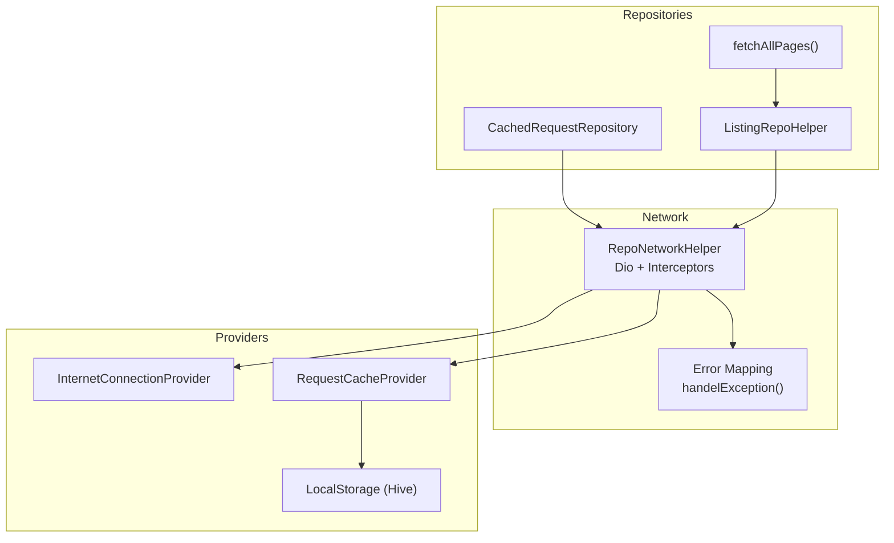
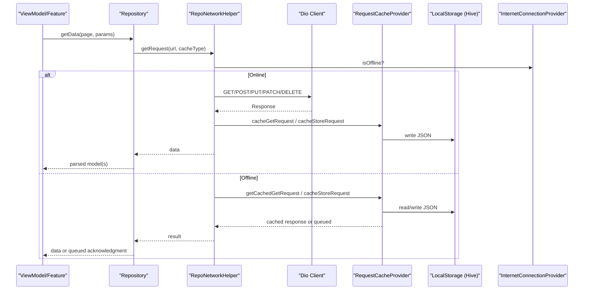
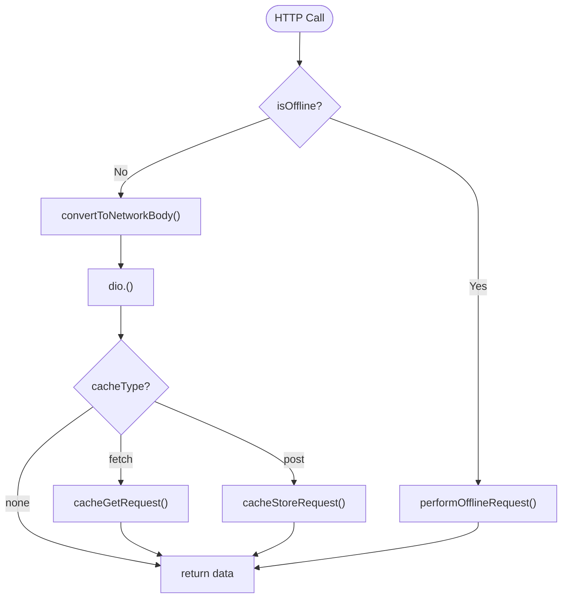
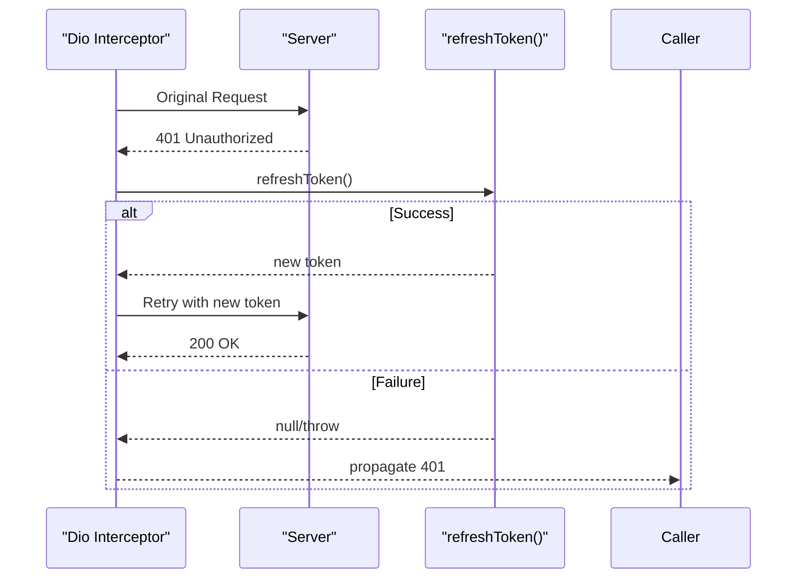
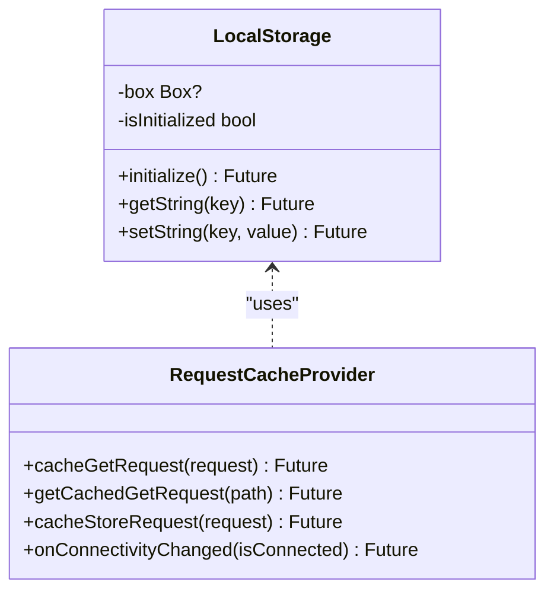
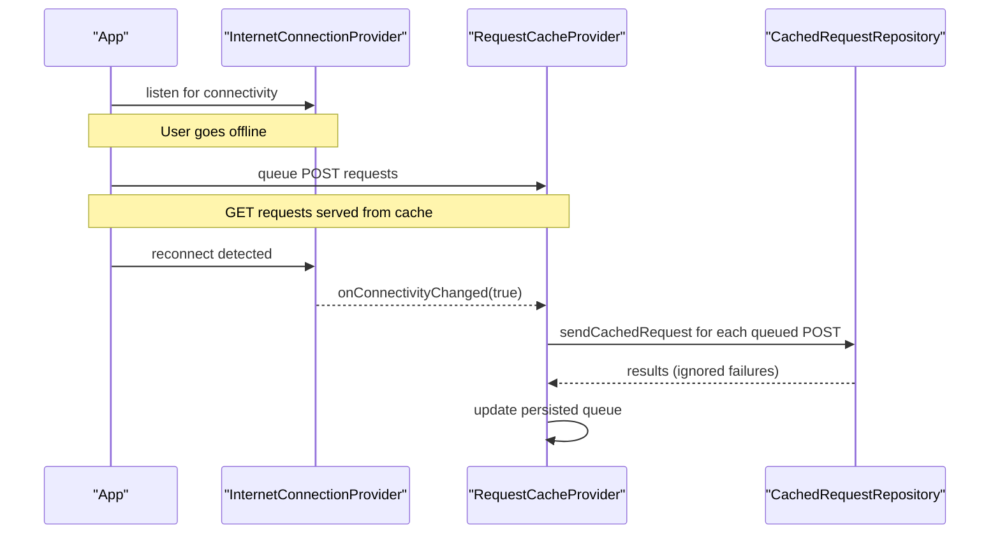
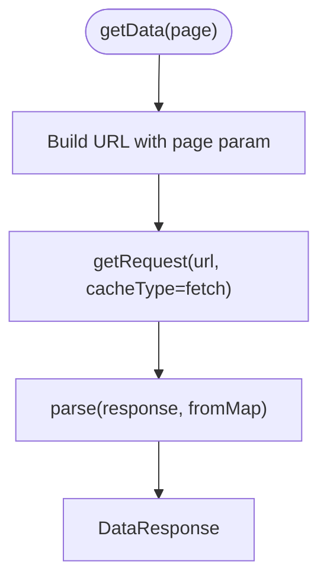
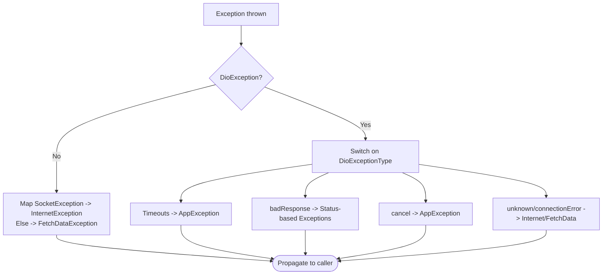
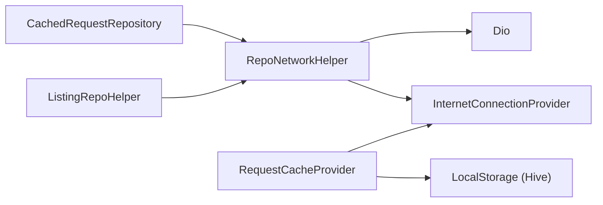

# Data Layer

<cite>
**Referenced Files in This Document**
- [repo_network_helper.dart](file://lib/app/core/logic/repository/repo_network_helper.dart)
- [cached_request_repository.dart](file://lib/app/core/logic/repository/cached_request_repository.dart)
- [request_cache_provider.dart](file://lib/app/core/provider/request_cache_provider.dart)
- [internet_connection_provider.dart](file://lib/app/core/provider/internet_connection_provider.dart)
- [local_storage_provider.dart](file://lib/app/core/provider/local_storage_provider.dart)
- [error.dart](file://lib/app/core/logic/repository/error.dart)
- [paginated_fetch.dart](file://lib/app/core/logic/repository/paginated_fetch.dart)
- [listing_repo_helper.dart](file://lib/app/core/logic/repository/listing_repo_helper.dart)
- [data_state.dart](file://lib/app/core/logic/data_state/data_state.dart)
- [offline_course_repository.dart](file://lib/app/features/courses/repository/offline_course_repository.dart)
</cite>

## Table of Contents
1. [Introduction](#introduction)
2. [Project Structure](#project-structure)
3. [Core Components](#core-components)
4. [Architecture Overview](#architecture-overview)
5. [Detailed Component Analysis](#detailed-component-analysis)
6. [Dependency Analysis](#dependency-analysis)
7. [Performance Considerations](#performance-considerations)
8. [Troubleshooting Guide](#troubleshooting-guide)
9. [Conclusion](#conclusion)
10. [Appendices](#appendices)

## Introduction
This document explains the data layer architecture for Leadership Edge Live LMS. It focuses on:
- Repository pattern that abstracts REST APIs and local storage
- Network layer built with Dio, including interceptors for authentication retry, timeouts, and error mapping
- Local storage strategy using Hive via a typed provider
- Caching strategies for offline support, synchronization on reconnect, and consistency
- Error handling patterns, retry logic, and recovery flows
- Guidance to implement custom repositories and integrate new data sources

## Project Structure
The data layer is organized around reusable helpers and providers:
- Network helper provides a unified HTTP client with caching hooks and offline fallback
- Providers encapsulate connectivity state and persistent storage
- Repositories compose these building blocks to expose domain-friendly APIs
- Offline features persist requests and responses for later sync

**Diagram sources**
- [repo_network_helper.dart:72-126](file://lib/app/core/logic/repository/repo_network_helper.dart#L72-L126)
- [internet_connection_provider.dart:9-36](file://lib/app/core/provider/internet_connection_provider.dart#L9-L36)
- [local_storage_provider.dart:6-48](file://lib/app/core/provider/local_storage_provider.dart#L6-L48)
- [request_cache_provider.dart:9-79](file://lib/app/core/provider/request_cache_provider.dart#L9-L79)
- [cached_request_repository.dart:9-31](file://lib/app/core/logic/repository/cached_request_repository.dart#L9-L31)
- [listing_repo_helper.dart:4-24](file://lib/app/core/logic/repository/listing_repo_helper.dart#L4-L24)
- [paginated_fetch.dart:5-18](file://lib/app/core/logic/repository/paginated_fetch.dart#L5-L18)

**Section sources**
- [repo_network_helper.dart:72-126](file://lib/app/core/logic/repository/repo_network_helper.dart#L72-L126)
- [internet_connection_provider.dart:9-36](file://lib/app/core/provider/internet_connection_provider.dart#L9-L36)
- [local_storage_provider.dart:6-48](file://lib/app/core/provider/local_storage_provider.dart#L6-L48)
- [request_cache_provider.dart:9-79](file://lib/app/core/provider/request_cache_provider.dart#L9-L79)
- [cached_request_repository.dart:9-31](file://lib/app/core/logic/repository/cached_request_repository.dart#L9-L31)
- [listing_repo_helper.dart:4-24](file://lib/app/core/logic/repository/listing_repo_helper.dart#L4-L24)
- [paginated_fetch.dart:5-18](file://lib/app/core/logic/repository/paginated_fetch.dart#L5-L18)

## Core Components
- RepoNetworkConfig: Central configuration for base URL, auth token, connection provider, optional cache provider, manual offline toggle, and token refresh callback.
- RepoNetworkHelper: Mixin providing Dio client setup, headers, timeouts, request methods (GET/POST/PUT/PATCH/DELETE), offline fallback, caching hooks, and error mapping.
- RequestCacheProvider: Persists GET responses and queued POST requests using LocalStorage; re-synchronizes on reconnect.
- InternetConnectionProvider: Monitors connectivity by probing the app server and a reliable DNS endpoint; notifies listeners only on real transitions.
- LocalStorage: Thin wrapper over Hive box for string key-value persistence.
- CachedRequestRepository: Concrete repository using RepoNetworkHelper to send cached POST requests when back online.
- ListingRepoHelper<T>: Reusable paginated fetcher that builds query strings and parses responses into typed models.
- fetchAllPages<T>: Utility to paginate through all pages until completion or maxPages cap.
- DataState: Simple state container for UI layers to render idle/loading/data/error states.

**Section sources**
- [repo_network_helper.dart:31-70](file://lib/app/core/logic/repository/repo_network_helper.dart#L31-L70)
- [repo_network_helper.dart:72-126](file://lib/app/core/logic/repository/repo_network_helper.dart#L72-L126)
- [request_cache_provider.dart:9-79](file://lib/app/core/provider/request_cache_provider.dart#L9-L79)
- [internet_connection_provider.dart:9-36](file://lib/app/core/provider/internet_connection_provider.dart#L9-L36)
- [local_storage_provider.dart:6-48](file://lib/app/core/provider/local_storage_provider.dart#L6-L48)
- [cached_request_repository.dart:9-31](file://lib/app/core/logic/repository/cached_request_repository.dart#L9-L31)
- [listing_repo_helper.dart:4-24](file://lib/app/core/logic/repository/listing_repo_helper.dart#L4-L24)
- [paginated_fetch.dart:5-18](file://lib/app/core/logic/repository/paginated_fetch.dart#L5-L18)
- [data_state.dart:1-23](file://lib/app/core/logic/data_state/data_state.dart#L1-L23)

## Architecture Overview
The data layer follows a layered approach:
- Repositories call RepoNetworkHelper for network operations
- RepoNetworkHelper decides between online requests and offline fallback based on connectivity and manual offline mode
- On offline, GET requests return cached responses; POST requests are queued for later sync
- On reconnect, RequestCacheProvider retries queued POST requests via CachedRequestRepository
- Errors are normalized into typed exceptions for consistent handling across the app

**Diagram sources**
- [repo_network_helper.dart:239-394](file://lib/app/core/logic/repository/repo_network_helper.dart#L239-L394)
- [request_cache_provider.dart:34-79](file://lib/app/core/provider/request_cache_provider.dart#L34-L79)
- [local_storage_provider.dart:13-28](file://lib/app/core/provider/local_storage_provider.dart#L13-L28)
- [internet_connection_provider.dart:51-79](file://lib/app/core/provider/internet_connection_provider.dart#L51-L79)

## Detailed Component Analysis

### Network Layer: RepoNetworkHelper
Responsibilities:
- Build Dio client with base URL, headers, and timeouts
- Attach an interceptor that retries once on 401 using a provided refreshToken callback
- Provide HTTP verbs with unified options and progress callbacks
- Serialize bodies, detect FormData, and set correct content-type
- Handle offline mode by returning cached GET responses or queuing POST requests
- Cache successful responses or queued requests via RequestCacheProvider
- Map Dio errors to application-specific exceptions

Key behaviors:
- Timeouts: connect 20s, receive 20s, send 30s
- Auth header injection from config
- Manual offline override via config.isManualOffline
- Retry-on-401 with extra flag to prevent loops

**Diagram sources**
- [repo_network_helper.dart:79-126](file://lib/app/core/logic/repository/repo_network_helper.dart#L79-L126)
- [repo_network_helper.dart:130-237](file://lib/app/core/logic/repository/repo_network_helper.dart#L130-L237)
- [repo_network_helper.dart:239-394](file://lib/app/core/logic/repository/repo_network_helper.dart#L239-L394)

**Section sources**
- [repo_network_helper.dart:72-126](file://lib/app/core/logic/repository/repo_network_helper.dart#L72-L126)
- [repo_network_helper.dart:130-237](file://lib/app/core/logic/repository/repo_network_helper.dart#L130-L237)
- [repo_network_helper.dart:239-394](file://lib/app/core/logic/repository/repo_network_helper.dart#L239-L394)

### Authentication and Token Refresh
- The Dio interceptor checks for 401 responses
- If a refreshToken callback is configured, it attempts to obtain a new token
- On success, it updates the Authorization header and retries the original request once
- If refresh fails or the retry also returns 401, the original error propagates

**Diagram sources**
- [repo_network_helper.dart:88-123](file://lib/app/core/logic/repository/repo_network_helper.dart#L88-L123)

**Section sources**
- [repo_network_helper.dart:88-123](file://lib/app/core/logic/repository/repo_network_helper.dart#L88-L123)

### Local Storage Strategy with Hive
- LocalStorage initializes Hive per platform and opens a named box
- Provides getString/setString for simple key-value persistence
- Used by RequestCacheProvider to store:
  - Cached GET responses keyed by path
  - A list of queued POST requests under a single key
- OfflineCourseRepository demonstrates feature-level use of LocalStorage for offline assets and metadata

**Diagram sources**
- [local_storage_provider.dart:6-48](file://lib/app/core/provider/local_storage_provider.dart#L6-L48)
- [request_cache_provider.dart:9-79](file://lib/app/core/provider/request_cache_provider.dart#L9-L79)

**Section sources**
- [local_storage_provider.dart:6-48](file://lib/app/core/provider/local_storage_provider.dart#L6-L48)
- [request_cache_provider.dart:34-79](file://lib/app/core/provider/request_cache_provider.dart#L34-L79)
- [offline_course_repository.dart:12-37](file://lib/app/features/courses/repository/offline_course_repository.dart#L12-L37)

### Caching Strategies and Offline Support
- GET caching: Successful GET responses are stored by path; offline reads return cached data if available
- POST queuing: POST requests are serialized and queued; on reconnect, they are replayed via CachedRequestRepository
- Connectivity detection: Probes the app’s own server and a reliable DNS endpoint; notifies listeners only on real state changes
- Manual offline mode: Configurable override to force offline behavior without changing actual connectivity

**Diagram sources**
- [internet_connection_provider.dart:51-79](file://lib/app/core/provider/internet_connection_provider.dart#L51-L79)
- [request_cache_provider.dart:63-79](file://lib/app/core/provider/request_cache_provider.dart#L63-L79)
- [cached_request_repository.dart:24-30](file://lib/app/core/logic/repository/cached_request_repository.dart#L24-L30)

**Section sources**
- [internet_connection_provider.dart:51-79](file://lib/app/core/provider/internet_connection_provider.dart#L51-L79)
- [request_cache_provider.dart:63-79](file://lib/app/core/provider/request_cache_provider.dart#L63-L79)
- [cached_request_repository.dart:24-30](file://lib/app/core/logic/repository/cached_request_repository.dart#L24-L30)

### Pagination and Data Parsing
- ListingRepoHelper<T> constructs paginated URLs with page parameter and caches GET responses
- Uses a generic fromMap function to parse responses into typed models
- fetchAllPages<T> repeatedly calls a page fetcher until fewer items than perPage are returned or maxPages reached

**Diagram sources**
- [listing_repo_helper.dart:4-24](file://lib/app/core/logic/repository/listing_repo_helper.dart#L4-L24)
- [paginated_fetch.dart:5-18](file://lib/app/core/logic/repository/paginated_fetch.dart#L5-L18)

**Section sources**
- [listing_repo_helper.dart:4-24](file://lib/app/core/logic/repository/listing_repo_helper.dart#L4-L24)
- [paginated_fetch.dart:5-18](file://lib/app/core/logic/repository/paginated_fetch.dart#L5-L18)

### Error Handling Patterns
- handelException maps Dio errors to typed exceptions:
  - Connection/send/receive timeouts
  - Bad responses (400, 401/403, 404, 413, 422, 429, 500)
  - Cancelled requests, unknown errors, bad certificates, connection errors
- Extracts user-friendly messages from varied server payloads (Map, List, String)

**Diagram sources**
- [error.dart:19-94](file://lib/app/core/logic/repository/error.dart#L19-L94)

**Section sources**
- [error.dart:19-94](file://lib/app/core/logic/repository/error.dart#L19-L94)

### Implementing Custom Repositories
Steps:
1. Create a repository class that mixes in RepoNetworkHelper
2. Provide RepoNetworkConfig with url, authToken, connectionProvider, and optional refreshToken
3. Use getRequest/post/put/patch/delete with appropriate cacheType
4. For lists, consider mixing in ListingRepoHelper<T> and implementing endPoint and fromMap
5. For pagination beyond a single page, use fetchAllPages<T>

Example integration points:
- Add a new endpoint by calling repo.getRequest or repo.post with cacheType set to fetch or post as needed
- Integrate with Riverpod providers to inject dependencies like ServerProvider and AuthStateNotifier

**Section sources**
- [repo_network_helper.dart:72-126](file://lib/app/core/logic/repository/repo_network_helper.dart#L72-L126)
- [listing_repo_helper.dart:4-24](file://lib/app/core/logic/repository/listing_repo_helper.dart#L4-L24)
- [paginated_fetch.dart:5-18](file://lib/app/core/logic/repository/paginated_fetch.dart#L5-L18)
- [cached_request_repository.dart:9-31](file://lib/app/core/logic/repository/cached_request_repository.dart#L9-L31)

## Dependency Analysis
High-level dependencies:
- RepoNetworkHelper depends on Dio and InternetConnectionProvider
- RequestCacheProvider depends on LocalStorage and InternetConnectionProvider
- CachedRequestRepository depends on RepoNetworkHelper and providers for server URL and auth token
- Feature repositories depend on RepoNetworkHelper and optionally ListingRepoHelper

**Diagram sources**
- [repo_network_helper.dart:72-126](file://lib/app/core/logic/repository/repo_network_helper.dart#L72-L126)
- [request_cache_provider.dart:9-79](file://lib/app/core/provider/request_cache_provider.dart#L9-L79)
- [internet_connection_provider.dart:9-36](file://lib/app/core/provider/internet_connection_provider.dart#L9-L36)
- [local_storage_provider.dart:6-48](file://lib/app/core/provider/local_storage_provider.dart#L6-L48)
- [cached_request_repository.dart:9-31](file://lib/app/core/logic/repository/cached_request_repository.dart#L9-L31)
- [listing_repo_helper.dart:4-24](file://lib/app/core/logic/repository/listing_repo_helper.dart#L4-L24)

**Section sources**
- [repo_network_helper.dart:72-126](file://lib/app/core/logic/repository/repo_network_helper.dart#L72-L126)
- [request_cache_provider.dart:9-79](file://lib/app/core/provider/request_cache_provider.dart#L9-L79)
- [internet_connection_provider.dart:9-36](file://lib/app/core/provider/internet_connection_provider.dart#L9-L36)
- [local_storage_provider.dart:6-48](file://lib/app/core/provider/local_storage_provider.dart#L6-L48)
- [cached_request_repository.dart:9-31](file://lib/app/core/logic/repository/cached_request_repository.dart#L9-L31)
- [listing_repo_helper.dart:4-24](file://lib/app/core/logic/repository/listing_repo_helper.dart#L4-L24)

## Performance Considerations
- Timeouts: Explicit connect/receive/send timeouts prevent indefinite hangs
- Caching: GET responses cached locally reduce network usage and improve perceived performance
- Offline queue: POST requests queued and retried on reconnect minimize data loss
- Connectivity checks: Dual probes (app server + DNS) balance accuracy and availability
- Serialization: Type serializers convert DateTime to ISO strings efficiently
- Pagination: fetchAllPages caps iterations to avoid infinite loops

[No sources needed since this section provides general guidance]

## Troubleshooting Guide
Common issues and resolutions:
- 401 Unauthorized: Ensure refreshToken callback is configured; verify token refresh flow
- No Internet: Check InternetConnectionProvider initialization and listener registration
- Stuck loading: Verify timeouts and ensure errors are propagated via handelException
- Multipart uploads failing: Confirm FormData detection and contentType override in optionsFor
- Cache not updating: Validate cacheType selection and ensure keys are unique per path

**Section sources**
- [repo_network_helper.dart:88-123](file://lib/app/core/logic/repository/repo_network_helper.dart#L88-L123)
- [internet_connection_provider.dart:51-79](file://lib/app/core/provider/internet_connection_provider.dart#L51-L79)
- [error.dart:19-94](file://lib/app/core/logic/repository/error.dart#L19-L94)
- [repo_network_helper.dart:151-157](file://lib/app/core/logic/repository/repo_network_helper.dart#L151-L157)

## Conclusion
The data layer provides a robust, testable abstraction over network and storage concerns:
- Unified HTTP client with authentication retry and comprehensive error mapping
- Flexible caching and offline-first behavior with automatic sync on reconnect
- Typed local storage via Hive for efficient persistence
- Reusable pagination utilities and clear extension points for new repositories

[No sources needed since this section summarizes without analyzing specific files]

## Appendices

### Data State Model
A simple state container used by UI layers to represent loading, data, and error states.

**Section sources**
- [data_state.dart:1-23](file://lib/app/core/logic/data_state/data_state.dart#L1-L23)