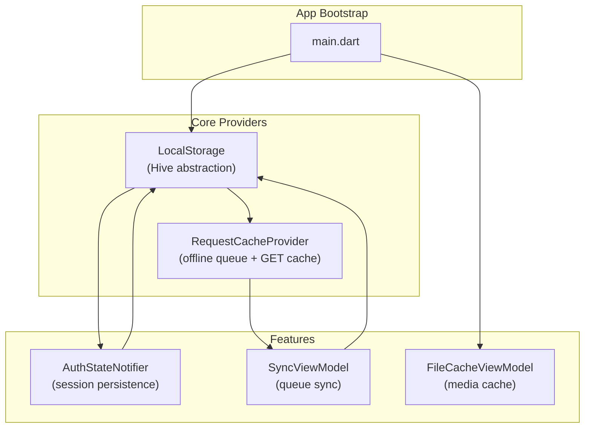
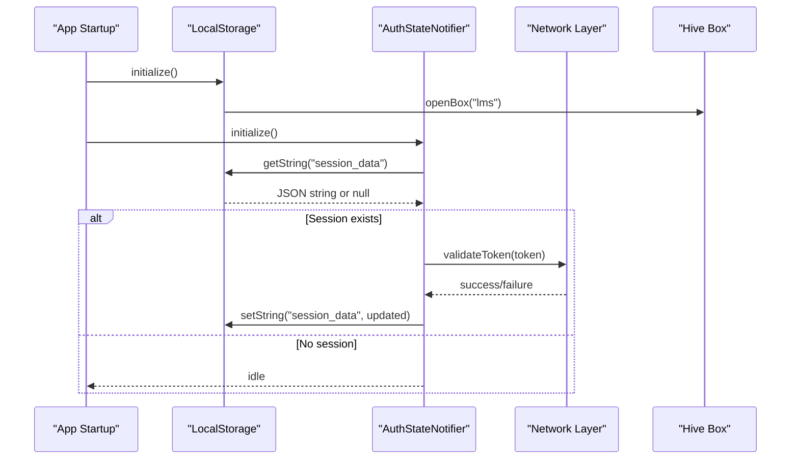
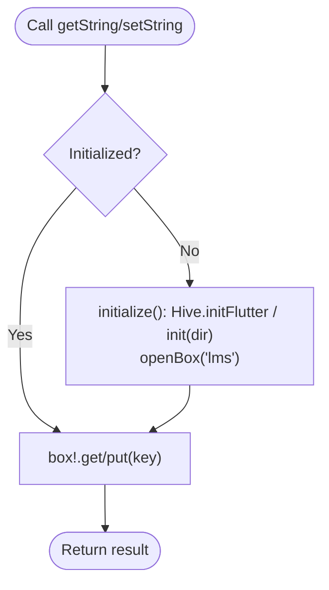
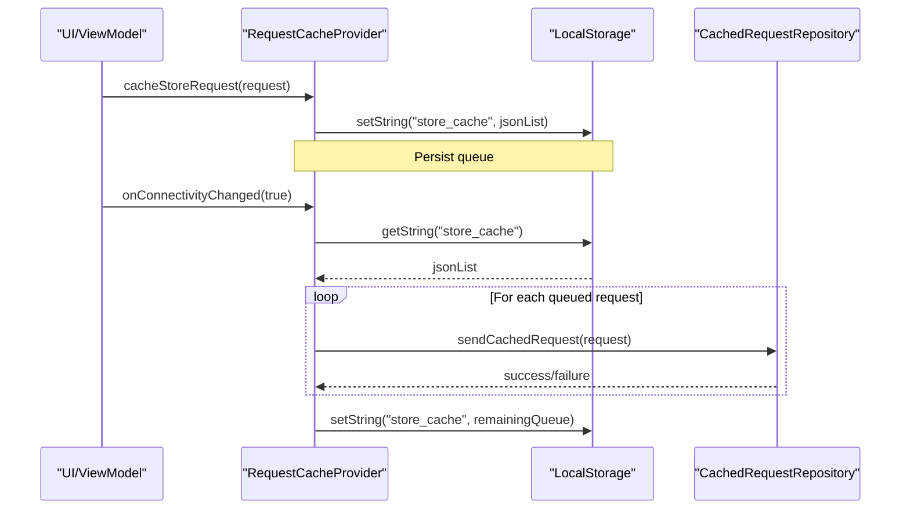
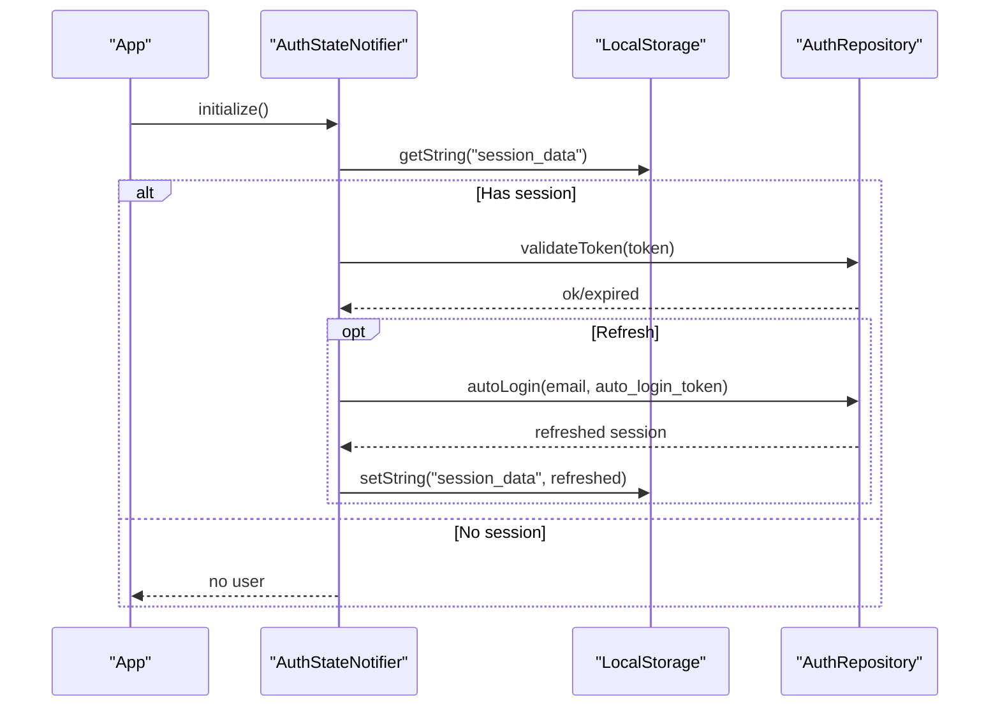
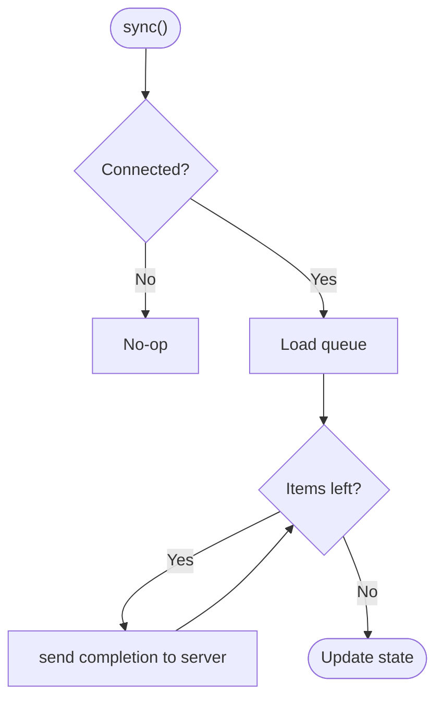
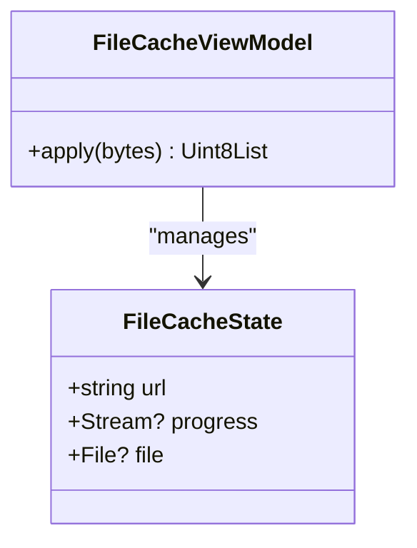
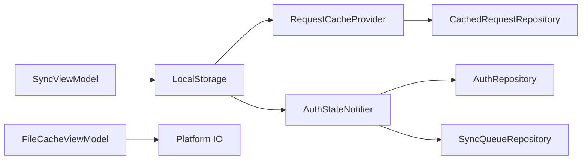

# Local Storage

<cite>
**Referenced Files in This Document**
- [pubspec.yaml](file://pubspec.yaml)
- [main.dart](file://lib/main.dart)
- [local_storage_provider.dart](file://lib/app/core/provider/local_storage_provider.dart)
- [request_cache_provider.dart](file://lib/app/core/provider/request_cache_provider.dart)
- [auth_state_provider.dart](file://lib/app/features/authentication/app_state/auth_state_provider.dart)
- [sync_view_model.dart](file://lib/app/features/courses/viewmodel/sync_view_model.dart)
- [file_cache_view_model.dart](file://lib/app/features/courses/viewmodel/file_cache_view_model.dart)
</cite>

## Table of Contents
1. [Introduction](#introduction)
2. [Project Structure](#project-structure)
3. [Core Components](#core-components)
4. [Architecture Overview](#architecture-overview)
5. [Detailed Component Analysis](#detailed-component-analysis)
6. [Dependency Analysis](#dependency-analysis)
7. [Performance Considerations](#performance-considerations)
8. [Troubleshooting Guide](#troubleshooting-guide)
9. [Conclusion](#conclusion)
10. [Appendices](#appendices)

## Introduction
This document explains the local storage implementation for the application, focusing on efficient data persistence using Hive and related providers. It covers:
- A storage utility that abstracts Hive operations (read, write, delete via null values, and query-like retrieval).
- Data model serialization/deserialization patterns used to persist session state and cached requests.
- Session management for authentication tokens and user preferences.
- Synchronization strategies between local storage and remote APIs, including offline queuing and retry on connectivity restoration.
- Caching strategies for courses, user progress, and frequently accessed data.
- Performance optimization techniques, migration considerations, and storage cleanup procedures.
- Examples of storing complex objects, implementing custom type adapters, and querying cached data efficiently.

## Project Structure
The project uses Flutter with Riverpod for state management and Hive for local storage. The key storage-related components are located under lib/app/core/provider and feature-specific modules handle domain logic such as authentication and course synchronization.

**Diagram sources**
- [main.dart:16-37](file://lib/main.dart#L16-L37)
- [local_storage_provider.dart:6-47](file://lib/app/core/provider/local_storage_provider.dart#L6-L47)
- [request_cache_provider.dart:9-79](file://lib/app/core/provider/request_cache_provider.dart#L9-L79)
- [auth_state_provider.dart:15-203](file://lib/app/features/authentication/app_state/auth_state_provider.dart#L15-L203)
- [sync_view_model.dart:28-70](file://lib/app/features/courses/viewmodel/sync_view_model.dart#L28-L70)
- [file_cache_view_model.dart:438-462](file://lib/app/features/courses/viewmodel/file_cache_view_model.dart#L438-L462)

**Section sources**
- [pubspec.yaml:30-44](file://pubspec.yaml#L30-L44)
- [main.dart:16-37](file://lib/main.dart#L16-L37)

## Core Components
- LocalStorage: A thin wrapper around Hive that initializes the Hive instance per platform and opens a named box. It exposes simple string-based get/set operations and lazy initialization.
- RequestCacheProvider: Manages caching of GET requests and an offline queue for POST/PUT operations. It persists serialized request payloads and retries them when connectivity is restored.
- AuthStateNotifier: Persists and restores the authenticated session (tokens and profile) across app restarts. It also handles token refresh and logout cleanup.
- SyncViewModel: Orchestrates syncing queued completion events to the server when online and tracks sync status.
- FileCacheViewModel: Handles media file caching and includes a simple XOR-based obfuscation helper for stored bytes.

Key responsibilities:
- Abstraction over Hive for simple key-value persistence.
- JSON-based serialization for complex models (sessions, requests).
- Offline-first behavior with automatic retry on reconnection.
- Centralized session lifecycle management.

**Section sources**
- [local_storage_provider.dart:6-47](file://lib/app/core/provider/local_storage_provider.dart#L6-L47)
- [request_cache_provider.dart:9-83](file://lib/app/core/provider/request_cache_provider.dart#L9-L83)
- [auth_state_provider.dart:15-203](file://lib/app/features/authentication/app_state/auth_state_provider.dart#L15-L203)
- [sync_view_model.dart:28-70](file://lib/app/features/courses/viewmodel/sync_view_model.dart#L28-L70)
- [file_cache_view_model.dart:438-462](file://lib/app/features/courses/viewmodel/file_cache_view_model.dart#L438-L462)

## Architecture Overview
The storage architecture centers on a small Hive-backed key-value store and higher-level providers that serialize application models into strings for persistence. Authentication state is persisted as a JSON string, while network requests are cached or queued based on connectivity. Media files are cached separately with optional obfuscation.

**Diagram sources**
- [local_storage_provider.dart:34-47](file://lib/app/core/provider/local_storage_provider.dart#L34-L47)
- [auth_state_provider.dart:168-201](file://lib/app/features/authentication/app_state/auth_state_provider.dart#L168-L201)

## Detailed Component Analysis

### LocalStorage (Hive Abstraction)
- Purpose: Provide a simple, lazily initialized key-value store backed by Hive.
- Initialization: Detects web vs. mobile/desktop and sets up Hive accordingly; opens a named box once.
- Operations:
  - Read: getString(key) returns String?
  - Write: setString(key, value?) supports deletion by passing null
  - Query: Not directly supported; use composite keys or list-based caches for queries
- Notes:
  - Uses a single default box name ("lms").
  - On web, Hive is initialized via Hive.initFlutter(); on other platforms, it uses the application support directory.

**Diagram sources**
- [local_storage_provider.dart:13-47](file://lib/app/core/provider/local_storage_provider.dart#L13-L47)

**Section sources**
- [local_storage_provider.dart:6-47](file://lib/app/core/provider/local_storage_provider.dart#L6-L47)

### RequestCacheProvider (GET Cache and Offline Queue)
- Purpose: Cache GET responses and queue failed POST/PUT requests until connectivity is restored.
- Persistence: Stores JSON-encoded representations of requests in Hive via LocalStorage.
- Behavior:
  - cacheGetRequest/getCachedGetRequest: keyed by path
  - cacheStoreRequest/getCachedStoreRequest: maintains a list of queued requests
  - onConnectivityChanged: retries queued requests and updates the persisted queue

**Diagram sources**
- [request_cache_provider.dart:34-79](file://lib/app/core/provider/request_cache_provider.dart#L34-L79)

**Section sources**
- [request_cache_provider.dart:9-83](file://lib/app/core/provider/request_cache_provider.dart#L9-L83)

### AuthStateNotifier (Session Management)
- Purpose: Manage authentication lifecycle, persisting session data and handling token refresh.
- Persistence: Stores the entire session as a JSON string under a fixed key.
- Key flows:
  - Login: authenticate remotely, then persist session and update state
  - Initialize: restore session from storage; validate token if online; otherwise defer validation until connected
  - UpdateProfile: keep profile consistent across the app and persist changes
  - Logout: clear session and offline queue; preserve downloaded content

**Diagram sources**
- [auth_state_provider.dart:42-69](file://lib/app/features/authentication/app_state/auth_state_provider.dart#L42-L69)
- [auth_state_provider.dart:119-150](file://lib/app/features/authentication/app_state/auth_state_provider.dart#L119-L150)
- [auth_state_provider.dart:168-201](file://lib/app/features/authentication/app_state/auth_state_provider.dart#L168-L201)

**Section sources**
- [auth_state_provider.dart:15-203](file://lib/app/features/authentication/app_state/auth_state_provider.dart#L15-L203)

### SyncViewModel (Offline Completion Sync)
- Purpose: Push queued learning event completions to the server when online.
- Behavior:
  - Reads queue from repository
  - Iterates and attempts to save each completion
  - Tracks sync state and pending count

**Diagram sources**
- [sync_view_model.dart:55-70](file://lib/app/features/courses/viewmodel/sync_view_model.dart#L55-L70)

**Section sources**
- [sync_view_model.dart:28-70](file://lib/app/features/courses/viewmodel/sync_view_model.dart#L28-L70)

### FileCacheViewModel (Media Cache and Obfuscation)
- Purpose: Manage cached media files and provide a simple XOR-based transformation for stored bytes.
- Highlights:
  - Contains a static transform method that applies a repeating key XOR to byte arrays
  - Maintains state for download progress and file references

**Diagram sources**
- [file_cache_view_model.dart:438-462](file://lib/app/features/courses/viewmodel/file_cache_view_model.dart#L438-L462)

**Section sources**
- [file_cache_view_model.dart:438-462](file://lib/app/features/courses/viewmodel/file_cache_view_model.dart#L438-L462)

## Dependency Analysis
- LocalStorage depends on Hive and platform-specific path resolution.
- RequestCacheProvider depends on LocalStorage and InternetConnectionProvider; interacts with CachedRequestRepository to send queued requests.
- AuthStateNotifier depends on LocalStorage, InternetConnectionProvider, and AuthRepository; coordinates with SyncQueueRepository during logout.
- SyncViewModel depends on connection provider and repositories to perform background sync.
- FileCacheViewModel is self-contained for media caching and transformation.

**Diagram sources**
- [local_storage_provider.dart:6-47](file://lib/app/core/provider/local_storage_provider.dart#L6-L47)
- [request_cache_provider.dart:9-79](file://lib/app/core/provider/request_cache_provider.dart#L9-L79)
- [auth_state_provider.dart:15-203](file://lib/app/features/authentication/app_state/auth_state_provider.dart#L15-L203)
- [sync_view_model.dart:28-70](file://lib/app/features/courses/viewmodel/sync_view_model.dart#L28-L70)
- [file_cache_view_model.dart:438-462](file://lib/app/features/courses/viewmodel/file_cache_view_model.dart#L438-L462)

**Section sources**
- [pubspec.yaml:30-44](file://pubspec.yaml#L30-L44)
- [local_storage_provider.dart:6-47](file://lib/app/core/provider/local_storage_provider.dart#L6-L47)
- [request_cache_provider.dart:9-83](file://lib/app/core/provider/request_cache_provider.dart#L9-L83)
- [auth_state_provider.dart:15-203](file://lib/app/features/authentication/app_state/auth_state_provider.dart#L15-L203)
- [sync_view_model.dart:28-70](file://lib/app/features/courses/viewmodel/sync_view_model.dart#L28-L70)
- [file_cache_view_model.dart:438-462](file://lib/app/features/courses/viewmodel/file_cache_view_model.dart#L438-L462)

## Performance Considerations
- Use a single Hive box for simple key-value data to reduce overhead; avoid opening multiple boxes unless necessary.
- Prefer JSON serialization for complex objects to keep storage lightweight and portable.
- Batch updates where possible (e.g., updating the offline queue as a list rather than many small writes).
- Avoid unnecessary reads by caching results in memory within providers and only falling back to storage when needed.
- Defer heavy operations (like token validation) until connectivity is available to minimize blocking startup.
- For large media files, consider chunked downloads and streaming playback; ensure cleanup of temporary decrypted copies on crash or exit.

[No sources needed since this section provides general guidance]

## Troubleshooting Guide
- Hive not initialized: Ensure LocalStorage.initialize() runs before any read/write; on web, Hive.initFlutter() is required.
- Stale session after restart: Verify that session data is persisted on login and restored during initialization; check token validation flow.
- Offline queue not clearing: Confirm that onConnectivityChanged retries all items and updates the persisted queue; verify error handling does not swallow failures silently.
- Memory leaks or excessive rebuilds: Avoid replacing state unnecessarily; compare profiles before updating to prevent infinite rebuild loops.
- Cleanup after crash: Use provided utilities to remove leftover temporary viewing files to free disk space.

**Section sources**
- [local_storage_provider.dart:34-47](file://lib/app/core/provider/local_storage_provider.dart#L34-L47)
- [auth_state_provider.dart:152-162](file://lib/app/features/authentication/app_state/auth_state_provider.dart#L152-L162)
- [request_cache_provider.dart:63-79](file://lib/app/core/provider/request_cache_provider.dart#L63-L79)
- [main.dart:20-23](file://lib/main.dart#L20-L23)

## Conclusion
The application implements a pragmatic local storage strategy using Hive for simple key-value persistence and JSON serialization for complex models. Session management, offline queuing, and media caching are layered on top of this foundation to deliver a resilient offline-first experience. By centralizing storage access through LocalStorage and building feature-specific providers on top, the codebase remains maintainable and testable. Future enhancements can include typed adapters for stronger type safety and more sophisticated cache eviction policies.

[No sources needed since this section summarizes without analyzing specific files]

## Appendices

### Data Model Serialization and Deserialization
- Sessions: Stored as JSON strings; deserialized into domain models on load and re-persisted on updates.
- Requests: Serialized into JSON lists for the offline queue; deserialized per item for retry.
- Profiles: Updated incrementally and persisted to keep app-wide state consistent.

**Section sources**
- [auth_state_provider.dart:42-69](file://lib/app/features/authentication/app_state/auth_state_provider.dart#L42-L69)
- [auth_state_provider.dart:79-99](file://lib/app/features/authentication/app_state/auth_state_provider.dart#L79-L99)
- [request_cache_provider.dart:34-61](file://lib/app/core/provider/request_cache_provider.dart#L34-L61)

### Caching Strategies
- GET requests: Cached by path; retrieved before network calls to improve responsiveness.
- POST/PUT requests: Queued locally and retried when connectivity is restored.
- Media files: Cached on disk with optional obfuscation; temporary decrypted copies are cleaned up.

**Section sources**
- [request_cache_provider.dart:34-79](file://lib/app/core/provider/request_cache_provider.dart#L34-L79)
- [file_cache_view_model.dart:438-462](file://lib/app/features/courses/viewmodel/file_cache_view_model.dart#L438-L462)

### Migration Approaches
- Versioned keys: Prefix keys with version numbers to support schema evolution.
- Migration scripts: On app start, detect version and migrate old keys to new formats.
- Backward compatibility: Gracefully handle missing or malformed entries by falling back to defaults.

[No sources needed since this section provides general guidance]

### Storage Cleanup Procedures
- Clear temporary viewing files at startup to avoid disk bloat after crashes.
- On logout, clear session and offline queue; leave downloaded media intact for reuse.
- Periodically prune expired caches based on size or age policies.

**Section sources**
- [main.dart:20-23](file://lib/main.dart#L20-L23)
- [auth_state_provider.dart:152-162](file://lib/app/features/authentication/app_state/auth_state_provider.dart#L152-L162)