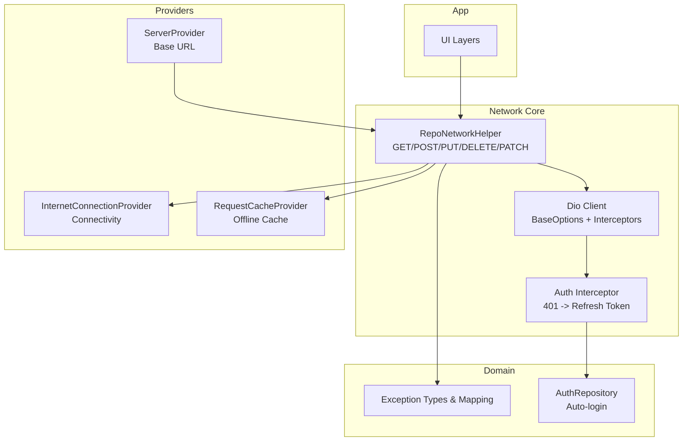
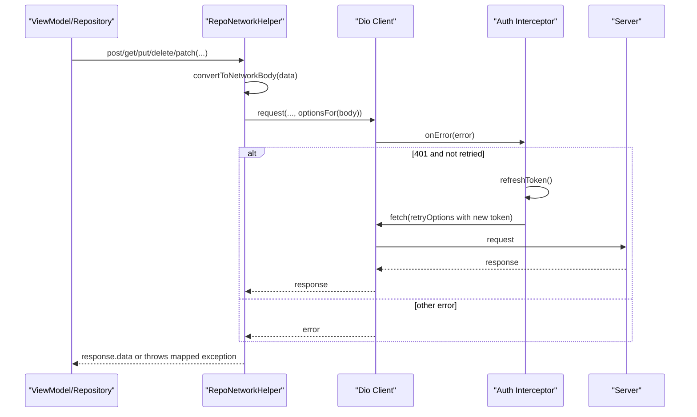
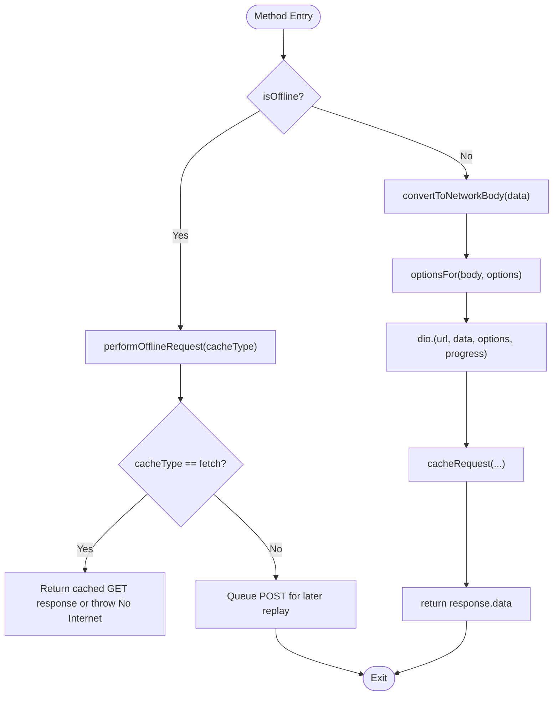
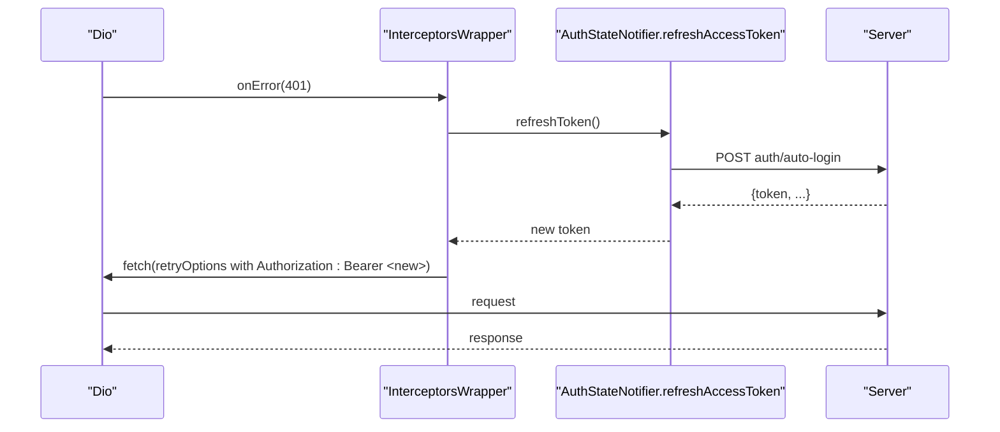
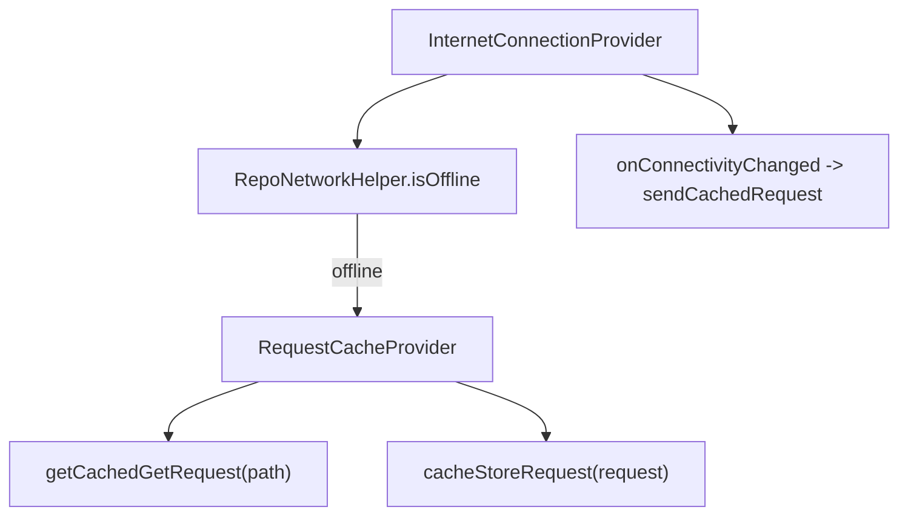
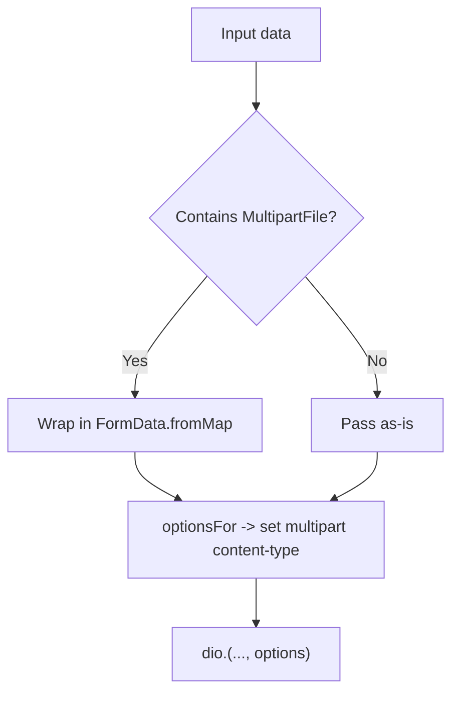
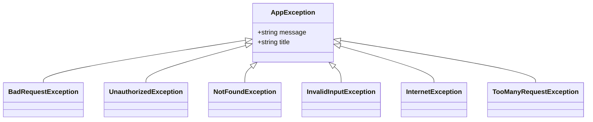
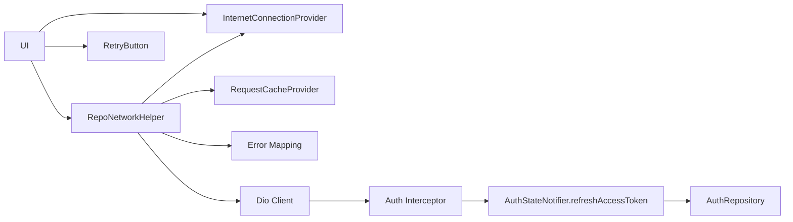

# Network Layer

<cite>
**Referenced Files in This Document**
- [repo_network_helper.dart](file://lib/app/core/logic/repository/repo_network_helper.dart)
- [internet_connection_provider.dart](file://lib/app/core/provider/internet_connection_provider.dart)
- [request_cache_provider.dart](file://lib/app/core/provider/request_cache_provider.dart)
- [server_provider.dart](file://lib/app/core/provider/server_provider.dart)
- [app_exception.dart](file://lib/app/core/logic/repository/app_exception.dart)
- [error.dart](file://lib/app/core/logic/repository/error.dart)
- [auth_state_provider.dart](file://lib/app/features/authentication/app_state/auth_state_provider.dart)
- [auth_repository.dart](file://lib/app/features/authentication/repository/auth_repository.dart)
- [cached_request_repository.dart](file://lib/app/core/logic/repository/cached_request_repository.dart)
- [listing_repo_helper.dart](file://lib/app/core/logic/repository/listing_repo_helper.dart)
- [flat_app_bar.dart](file://lib/app/core/views/elements/flat_app_bar.dart)
- [retry_button.dart](file://lib/app/core/views/elements/retry_button.dart)
- [course_join_detail_view_model.dart](file://lib/app/features/courses/viewmodel/course_join_detail_view_model.dart)
</cite>

## Table of Contents
1. [Introduction](#introduction)
2. [Project Structure](#project-structure)
3. [Core Components](#core-components)
4. [Architecture Overview](#architecture-overview)
5. [Detailed Component Analysis](#detailed-component-analysis)
6. [Dependency Analysis](#dependency-analysis)
7. [Performance Considerations](#performance-considerations)
8. [Troubleshooting Guide](#troubleshooting-guide)
9. [Conclusion](#conclusion)
10. [Appendices](#appendices)

## Introduction
This document explains the network layer built on Dio with a centralized RepoNetworkHelper mixin that standardizes HTTP operations, authentication handling, offline support, caching, and error management. It covers request/response lifecycle, automatic token refresh on 401 responses, offline mode with intelligent caching and fallbacks, file uploads via FormData, timeouts, progress callbacks for large downloads/uploads, and connection monitoring. It also provides guidance for making API calls, handling errors, and adding custom interceptors for logging or analytics.

## Project Structure
The network layer is centered around:
- A Dio client configured with base URL, headers, timeouts, and an optional token-refresh interceptor.
- A RepoNetworkHelper mixin providing GET, POST, PUT, DELETE, PATCH with unified options, body conversion (including multipart), offline checks, and caching hooks.
- Providers for server configuration, connectivity monitoring, and request caching.
- Exception types and error mapping to domain-specific exceptions.
- UI elements that reflect connectivity state and offer retry flows.

**Diagram sources**
- [repo_network_helper.dart:72-126](file://lib/app/core/logic/repository/repo_network_helper.dart#L72-L126)
- [internet_connection_provider.dart:18-36](file://lib/app/core/provider/internet_connection_provider.dart#L18-L36)
- [request_cache_provider.dart:9-28](file://lib/app/core/provider/request_cache_provider.dart#L9-L28)
- [server_provider.dart:8-25](file://lib/app/core/provider/server_provider.dart#L8-L25)
- [app_exception.dart:6-54](file://lib/app/core/logic/repository/app_exception.dart#L6-L54)
- [error.dart:36-71](file://lib/app/core/logic/repository/error.dart#L36-L71)
- [auth_state_provider.dart:114-150](file://lib/app/features/authentication/app_state/auth_state_provider.dart#L114-L150)
- [auth_repository.dart:36-65](file://lib/app/features/authentication/repository/auth_repository.dart#L36-L65)

**Section sources**
- [repo_network_helper.dart:72-126](file://lib/app/core/logic/repository/repo_network_helper.dart#L72-L126)
- [internet_connection_provider.dart:18-36](file://lib/app/core/provider/internet_connection_provider.dart#L18-L36)
- [request_cache_provider.dart:9-28](file://lib/app/core/provider/request_cache_provider.dart#L9-L28)
- [server_provider.dart:8-25](file://lib/app/core/provider/server_provider.dart#L8-L25)

## Core Components
- RepoNetworkConfig: Holds base URL, optional auth token, connectivity provider, optional cache provider, manual offline toggle, and token refresh callback.
- RepoNetworkHelper mixin: Centralized HTTP methods, body serialization, FormData detection, options builder, offline behavior, and caching integration.
- InternetConnectionProvider: Monitors connectivity using app server endpoint plus Cloudflare DNS fallback; exposes stream and listeners.
- RequestCacheProvider: Caches GET responses and queues POST requests when offline; replays queued requests on reconnect.
- Error mapping: Converts Dio errors into domain exceptions (e.g., UnauthorizedException, BadRequestException).
- Auth flow: Automatic token refresh on 401 via provided refreshToken callback; de-duplicates concurrent refresh attempts.

**Section sources**
- [repo_network_helper.dart:31-70](file://lib/app/core/logic/repository/repo_network_helper.dart#L31-L70)
- [repo_network_helper.dart:72-126](file://lib/app/core/logic/repository/repo_network_helper.dart#L72-L126)
- [internet_connection_provider.dart:18-36](file://lib/app/core/provider/internet_connection_provider.dart#L18-L36)
- [request_cache_provider.dart:9-28](file://lib/app/core/provider/request_cache_provider.dart#L9-L28)
- [error.dart:36-71](file://lib/app/core/logic/repository/error.dart#L36-L71)
- [auth_state_provider.dart:114-150](file://lib/app/features/authentication/app_state/auth_state_provider.dart#L114-L150)

## Architecture Overview
The network layer composes a Dio client with:
- BaseOptions: baseUrl from ServerProvider, default headers including Authorization when available, and explicit timeouts.
- Optional Interceptors: An onError handler that detects 401 responses, invokes the provided refreshToken callback once per request, updates Authorization header, and retries the original request exactly once to avoid loops.
- Offline/Caching: Each method checks connectivity and either performs the request or consults the cache provider to return cached data or queue mutations.
- Body Handling: Automatic conversion to FormData when files are present; correct multipart content-type set per request.
- Progress Callbacks: Support for send/receive progress on all mutating methods and receive progress on GET.

**Diagram sources**
- [repo_network_helper.dart:79-126](file://lib/app/core/logic/repository/repo_network_helper.dart#L79-L126)
- [repo_network_helper.dart:129-157](file://lib/app/core/logic/repository/repo_network_helper.dart#L129-L157)
- [auth_state_provider.dart:114-150](file://lib/app/features/authentication/app_state/auth_state_provider.dart#L114-L150)

## Detailed Component Analysis

### RepoNetworkHelper: Centralized Network Operations
Responsibilities:
- Provides GET, POST, PUT, DELETE, PATCH with consistent parameters: url, data, queryParameters, Options, CancelToken, progress callbacks, and cacheType.
- Handles offline detection and delegates to performOfflineRequest based on RequestCacheType.
- Serializes bodies, auto-wraps in FormData when files are detected, and sets correct multipart content-type per request.
- Integrates caching by storing GET responses or queuing POST requests depending on cacheType.
- Maps errors via handelException to domain exceptions.

Key behaviors:
- Timeouts: connectTimeout, receiveTimeout, sendTimeout configured on Dio instance.
- Authentication: If refreshToken is provided, an interceptor handles 401 by refreshing token once and retrying.
- Offline: When offline, returns cached GET data if available or queues POST requests for later replay.

**Diagram sources**
- [repo_network_helper.dart:285-350](file://lib/app/core/logic/repository/repo_network_helper.dart#L285-L350)
- [repo_network_helper.dart:352-394](file://lib/app/core/logic/repository/repo_network_helper.dart#L352-L394)
- [repo_network_helper.dart:397-479](file://lib/app/core/logic/repository/repo_network_helper.dart#L397-L479)
- [repo_network_helper.dart:257-283](file://lib/app/core/logic/repository/repo_network_helper.dart#L257-L283)

**Section sources**
- [repo_network_helper.dart:72-126](file://lib/app/core/logic/repository/repo_network_helper.dart#L72-L126)
- [repo_network_helper.dart:129-193](file://lib/app/core/logic/repository/repo_network_helper.dart#L129-L193)
- [repo_network_helper.dart:239-283](file://lib/app/core/logic/repository/repo_network_helper.dart#L239-L283)
- [repo_network_helper.dart:285-479](file://lib/app/core/logic/repository/repo_network_helper.dart#L285-L479)

### Authentication Interceptor and Token Refresh
- The Dio client adds an InterceptorsWrapper.onError when a refreshToken callback is supplied.
- On 401, it checks if the request was already retried after token refresh to prevent infinite loops.
- Calls refreshToken(), which is implemented in the authentication state provider to call the auto-login endpoint and persist updated session data.
- Updates Authorization header with the new token and retries the original request once.

**Diagram sources**
- [repo_network_helper.dart:88-123](file://lib/app/core/logic/repository/repo_network_helper.dart#L88-L123)
- [auth_state_provider.dart:114-150](file://lib/app/features/authentication/app_state/auth_state_provider.dart#L114-L150)
- [auth_repository.dart:36-65](file://lib/app/features/authentication/repository/auth_repository.dart#L36-L65)

**Section sources**
- [repo_network_helper.dart:88-123](file://lib/app/core/logic/repository/repo_network_helper.dart#L88-L123)
- [auth_state_provider.dart:114-150](file://lib/app/features/authentication/app_state/auth_state_provider.dart#L114-L150)
- [auth_repository.dart:36-65](file://lib/app/features/authentication/repository/auth_repository.dart#L36-L65)

### Offline Mode and Intelligent Caching
- Connectivity is monitored by InternetConnectionProvider using the app’s own server endpoint and a reliable DNS fallback.
- RepoNetworkHelper.isOffline combines manual offline mode and real connectivity status.
- For GET requests with cacheType.fetch, cached responses are returned when offline; for POST with cacheType.post, requests are queued and replayed on reconnect.
- RequestCacheProvider persists cached GET responses and queued POST requests to local storage and replays them when connectivity changes to online.

**Diagram sources**
- [internet_connection_provider.dart:18-36](file://lib/app/core/provider/internet_connection_provider.dart#L18-L36)
- [repo_network_helper.dart:127-128](file://lib/app/core/logic/repository/repo_network_helper.dart#L127-L128)
- [request_cache_provider.dart:34-78](file://lib/app/core/provider/request_cache_provider.dart#L34-L78)
- [cached_request_repository.dart:9-31](file://lib/app/core/logic/repository/cached_request_repository.dart#L9-L31)

**Section sources**
- [internet_connection_provider.dart:18-36](file://lib/app/core/provider/internet_connection_provider.dart#L18-L36)
- [request_cache_provider.dart:34-78](file://lib/app/core/provider/request_cache_provider.dart#L34-L78)
- [repo_network_helper.dart:257-283](file://lib/app/core/logic/repository/repo_network_helper.dart#L257-L283)

### File Uploads with FormData and Multipart Requests
- convertToNetworkBody serializes data and detects presence of files via shouldUseFormData.
- When files are present, prepareFormData flattens iterables and wraps data in FormData.
- optionsFor ensures the correct multipart content-type boundary is set per request to avoid conflicts with the global JSON content-type.
- POST, PUT, PATCH, DELETE accept FormData bodies and pass through progress callbacks for upload/download tracking.

**Diagram sources**
- [repo_network_helper.dart:129-157](file://lib/app/core/logic/repository/repo_network_helper.dart#L129-L157)
- [repo_network_helper.dart:159-193](file://lib/app/core/logic/repository/repo_network_helper.dart#L159-L193)

**Section sources**
- [repo_network_helper.dart:129-193](file://lib/app/core/logic/repository/repo_network_helper.dart#L129-L193)
- [repo_network_helper.dart:285-350](file://lib/app/core/logic/repository/repo_network_helper.dart#L285-L350)

### Timeouts, Progress Callbacks, and Connection Monitoring
- Timeouts: connectTimeout, receiveTimeout, sendTimeout are explicitly set on Dio BaseOptions to prevent hanging requests.
- Progress: All mutating methods and GET accept onSendProgress/onReceiveProgress callbacks for large transfers.
- Connection monitoring: InternetConnectionProvider uses multiple checks (app server endpoint and Cloudflare DNS) and emits connectivity changes only on actual transitions to avoid noisy reflows.

**Section sources**
- [repo_network_helper.dart:79-86](file://lib/app/core/logic/repository/repo_network_helper.dart#L79-L86)
- [repo_network_helper.dart:285-350](file://lib/app/core/logic/repository/repo_network_helper.dart#L285-L350)
- [repo_network_helper.dart:352-394](file://lib/app/core/logic/repository/repo_network_helper.dart#L352-L394)
- [internet_connection_provider.dart:18-36](file://lib/app/core/provider/internet_connection_provider.dart#L18-L36)

### Error Handling Strategies
- Errors thrown by Dio are mapped to domain exceptions via error mapping logic, covering bad requests, unauthorized, not found, too large files, validation errors, and rate limiting.
- UI components provide friendly messages and retry actions based on error types and connectivity state.
- RetryButton adapts behavior for offline vs online states and redirects to login for unauthorized errors.

**Diagram sources**
- [app_exception.dart:6-54](file://lib/app/core/logic/repository/app_exception.dart#L6-L54)

**Section sources**
- [error.dart:36-71](file://lib/app/core/logic/repository/error.dart#L36-L71)
- [app_exception.dart:6-54](file://lib/app/core/logic/repository/app_exception.dart#L6-L54)
- [course_join_detail_view_model.dart:183-209](file://lib/app/features/courses/viewmodel/course_join_detail_view_model.dart#L183-L209)
- [retry_button.dart:22-65](file://lib/app/core/views/elements/retry_button.dart#L22-L65)

### Usage Examples and Patterns

#### Making API Calls
- Use RepoNetworkHelper methods directly in repositories or viewmodels:
  - GET: getRequest(url, queryParameters, options, cancelToken, onReceiveProgress, cacheType)
  - POST: post(url, data, queryParameters, options, cancelToken, onSendProgress, onReceiveProgress, cacheType)
  - PUT/DELETE/PATCH: similar signatures with appropriate parameters
- For paginated lists, use ListingRepoHelper.getData to build page queries and parse responses.

**Section sources**
- [repo_network_helper.dart:285-479](file://lib/app/core/logic/repository/repo_network_helper.dart#L285-L479)
- [listing_repo_helper.dart:4-24](file://lib/app/core/logic/repository/listing_repo_helper.dart#L4-L24)

#### Handling Errors
- Catch domain exceptions thrown by repository methods to display user-friendly messages and trigger retries or navigation.
- Use RetryButton to offer context-aware retry actions based on connectivity and error type.

**Section sources**
- [error.dart:36-71](file://lib/app/core/logic/repository/error.dart#L36-L71)
- [retry_button.dart:22-65](file://lib/app/core/views/elements/retry_button.dart#L22-L65)

#### Implementing Custom Interceptors
- To add logging or analytics, extend the Dio client used by RepoNetworkHelper:
  - Add interceptors before the auth interceptor if needed, or wrap the existing client.
  - Ensure your interceptor respects the retry mechanism and does not interfere with the 401 refresh flow.
  - For analytics, log request paths, payloads (sanitized), and response statuses in onRequest/onResponse.

Note: The current implementation attaches the auth interceptor conditionally when refreshToken is provided. You can integrate additional interceptors at the same stage to observe requests/responses without disrupting the retry logic.

**Section sources**
- [repo_network_helper.dart:88-123](file://lib/app/core/logic/repository/repo_network_helper.dart#L88-L123)

## Dependency Analysis
- RepoNetworkHelper depends on:
  - InternetConnectionProvider for connectivity checks.
  - RequestCacheProvider for offline caching and replay.
  - Dio client configured with BaseOptions and optional auth interceptor.
  - Error mapping utilities to convert Dio errors to domain exceptions.
- Auth flow depends on:
  - AuthStateNotifier.refreshAccessToken to obtain a new token via auto-login.
  - AuthRepository endpoints for auto-login and token validation.
- UI depends on:
  - InternetConnectionProvider to show offline indicators.
  - RetryButton to handle user-initiated retries.

**Diagram sources**
- [repo_network_helper.dart:72-126](file://lib/app/core/logic/repository/repo_network_helper.dart#L72-L126)
- [internet_connection_provider.dart:18-36](file://lib/app/core/provider/internet_connection_provider.dart#L18-L36)
- [request_cache_provider.dart:9-28](file://lib/app/core/provider/request_cache_provider.dart#L9-L28)
- [error.dart:36-71](file://lib/app/core/logic/repository/error.dart#L36-L71)
- [auth_state_provider.dart:114-150](file://lib/app/features/authentication/app_state/auth_state_provider.dart#L114-L150)
- [auth_repository.dart:36-65](file://lib/app/features/authentication/repository/auth_repository.dart#L36-L65)
- [retry_button.dart:22-65](file://lib/app/core/views/elements/retry_button.dart#L22-L65)

**Section sources**
- [repo_network_helper.dart:72-126](file://lib/app/core/logic/repository/repo_network_helper.dart#L72-L126)
- [internet_connection_provider.dart:18-36](file://lib/app/core/provider/internet_connection_provider.dart#L18-L36)
- [request_cache_provider.dart:9-28](file://lib/app/core/provider/request_cache_provider.dart#L9-L28)
- [error.dart:36-71](file://lib/app/core/logic/repository/error.dart#L36-L71)
- [auth_state_provider.dart:114-150](file://lib/app/features/authentication/app_state/auth_state_provider.dart#L114-L150)
- [auth_repository.dart:36-65](file://lib/app/features/authentication/repository/auth_repository.dart#L36-L65)
- [retry_button.dart:22-65](file://lib/app/core/views/elements/retry_button.dart#L22-L65)

## Performance Considerations
- Timeouts: Explicit connect/receive/send timeouts prevent indefinite hangs and improve responsiveness.
- Caching: GET caching reduces redundant network calls; POST queuing avoids data loss during outages.
- Connectivity checks: Using both app server endpoint and DNS fallback improves accuracy while avoiding false negatives during server maintenance.
- Multipart handling: Per-request content-type prevents transformer conflicts and reduces unnecessary processing overhead.
- De-duplicated token refresh: Concurrent 401s share a single refresh attempt to minimize redundant network calls.

[No sources needed since this section provides general guidance]

## Troubleshooting Guide
Common issues and resolutions:
- Hanging requests: Verify timeout configuration and ensure onCancelToken is used appropriately for long-running operations.
- 401 loops: Confirm that refreshToken callback is provided and returns a valid token; check that retry flag prevents repeated retries.
- Offline behavior: Ensure RequestCacheProvider is initialized and connectivity listener is active; verify cached GET responses exist for expected endpoints.
- Upload failures: Validate that FormData contains files and that optionsFor sets multipart content-type correctly.
- UI stuck offline: Check InternetConnectionProvider initialization and ensure listeners are added only once to avoid duplicate probes.

**Section sources**
- [repo_network_helper.dart:79-86](file://lib/app/core/logic/repository/repo_network_helper.dart#L79-L86)
- [repo_network_helper.dart:88-123](file://lib/app/core/logic/repository/repo_network_helper.dart#L88-L123)
- [request_cache_provider.dart:63-78](file://lib/app/core/provider/request_cache_provider.dart#L63-L78)
- [internet_connection_provider.dart:51-61](file://lib/app/core/provider/internet_connection_provider.dart#L51-L61)

## Conclusion
The network layer provides a robust, centralized approach to HTTP communication using Dio with advanced interceptors, comprehensive error handling, offline support with intelligent caching, and seamless file uploads. The RepoNetworkHelper mixin standardizes API calls across the application, while providers manage connectivity and caching. Authentication is handled transparently with automatic token refresh on 401 responses. Developers can extend the system with custom interceptors for logging and analytics while preserving the reliability and performance characteristics of the core network stack.

[No sources needed since this section summarizes without analyzing specific files]

## Appendices

### Configuration Reference
- Base URL: Provided by ServerProvider; can be overridden via environment defines.
- Headers: Default content-type is JSON; Authorization header included when token is present.
- Timeouts: Connect, receive, and send timeouts configured on Dio instance.
- Offline Mode: Manual offline toggle combined with real connectivity status determines offline behavior.

**Section sources**
- [server_provider.dart:8-25](file://lib/app/core/provider/server_provider.dart#L8-L25)
- [repo_network_helper.dart:61-69](file://lib/app/core/logic/repository/repo_network_helper.dart#L61-L69)
- [repo_network_helper.dart:79-86](file://lib/app/core/logic/repository/repo_network_helper.dart#L79-L86)

### Example Workflows

#### GET with Caching
- Call getRequest with cacheType.fetch to enable caching.
- On offline, return cached response if available; otherwise throw “No Internet”.

**Section sources**
- [repo_network_helper.dart:352-394](file://lib/app/core/logic/repository/repo_network_helper.dart#L352-L394)
- [repo_network_helper.dart:257-283](file://lib/app/core/logic/repository/repo_network_helper.dart#L257-L283)

#### POST with File Upload
- Pass data containing MultipartFile; convertToNetworkBody will wrap in FormData.
- optionsFor sets multipart content-type; progress callbacks track upload progress.

**Section sources**
- [repo_network_helper.dart:129-193](file://lib/app/core/logic/repository/repo_network_helper.dart#L129-L193)
- [repo_network_helper.dart:285-350](file://lib/app/core/logic/repository/repo_network_helper.dart#L285-L350)

#### Handling 401 with Auto-Login
- Provide refreshToken callback in RepoNetworkConfig.
- On 401, interceptor calls refreshAccessToken, updates Authorization header, and retries once.

**Section sources**
- [repo_network_helper.dart:88-123](file://lib/app/core/logic/repository/repo_network_helper.dart#L88-L123)
- [auth_state_provider.dart:114-150](file://lib/app/features/authentication/app_state/auth_state_provider.dart#L114-L150)
- [auth_repository.dart:36-65](file://lib/app/features/authentication/repository/auth_repository.dart#L36-L65)