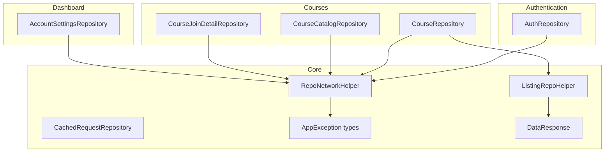
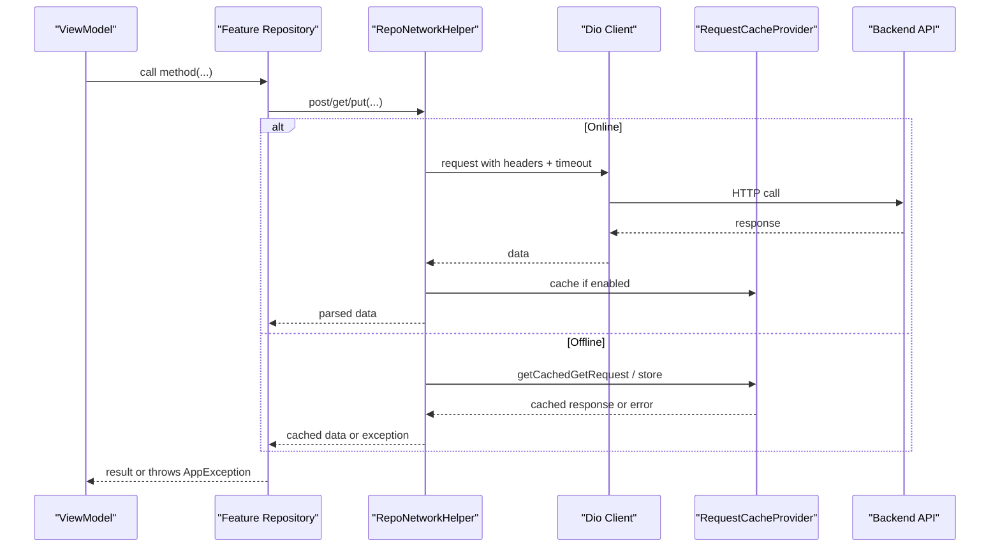
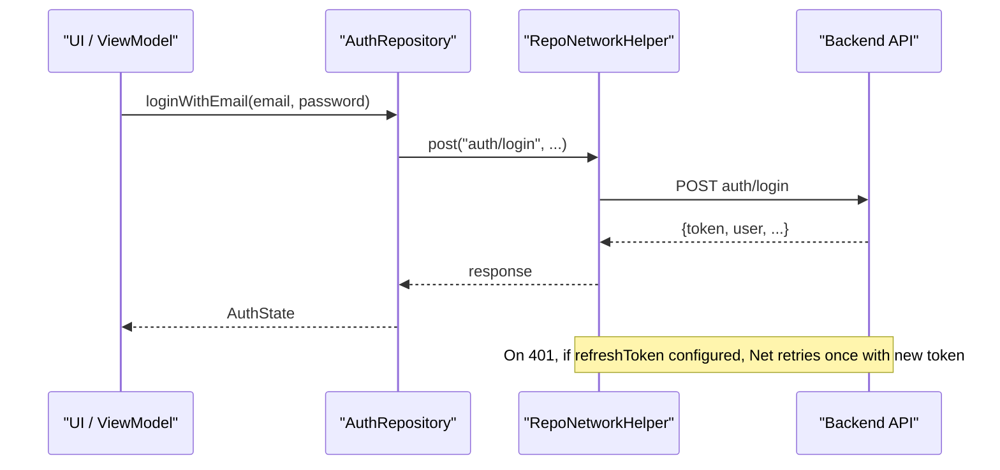
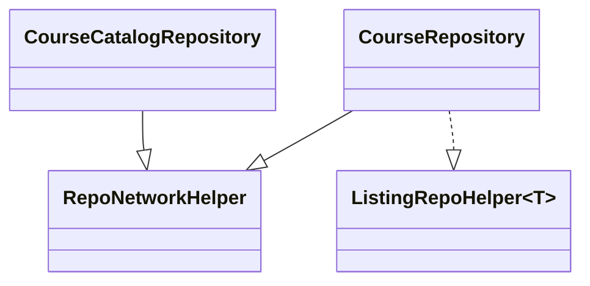
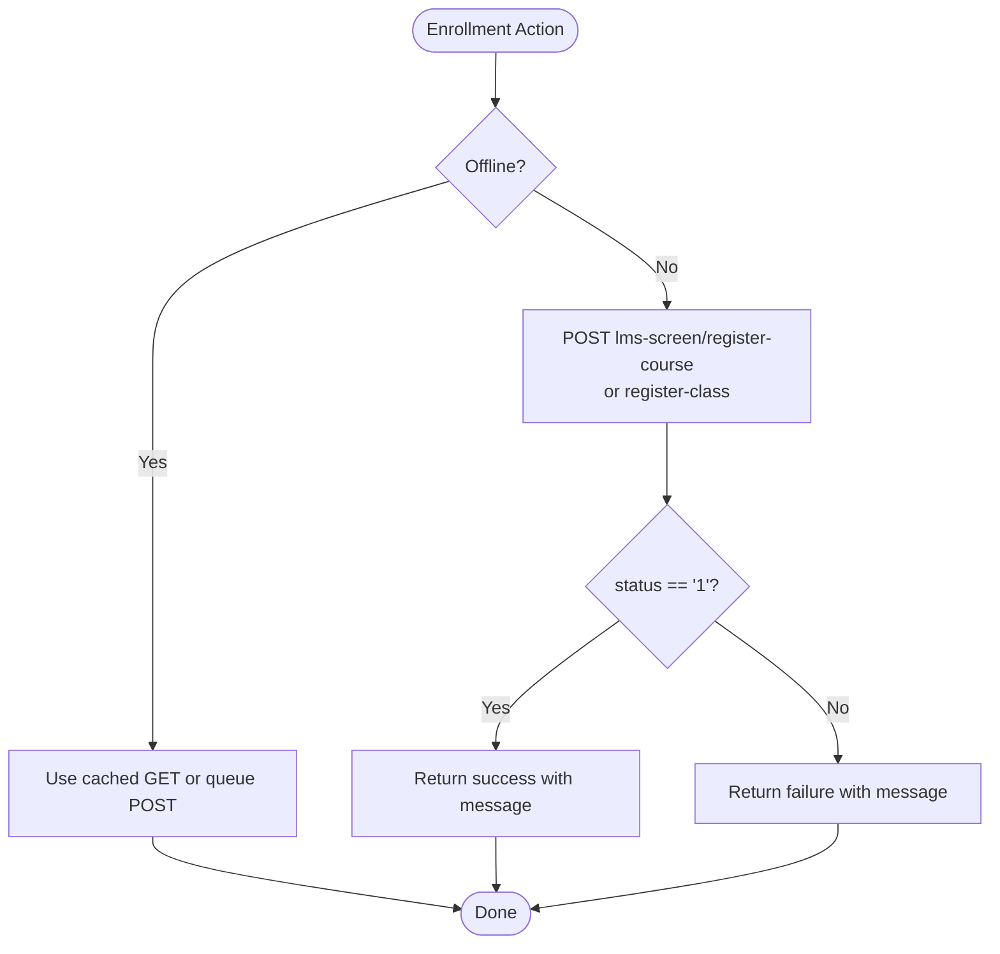
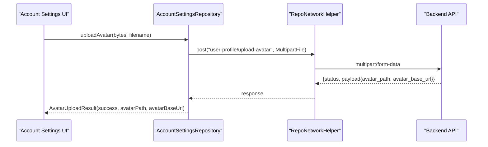
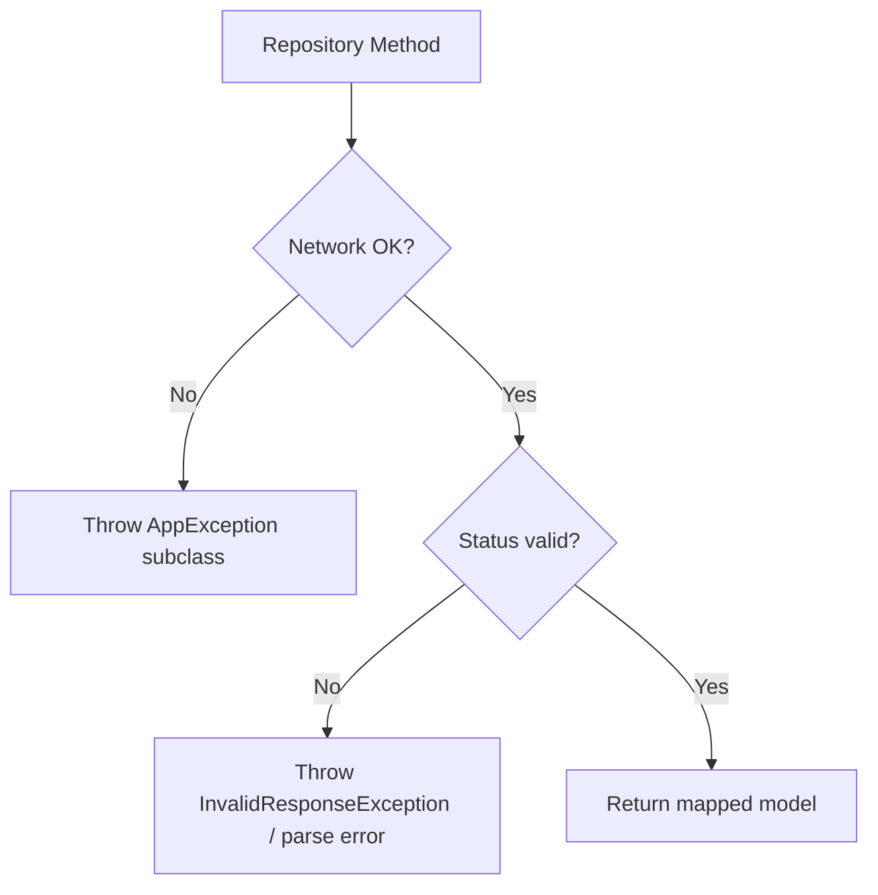
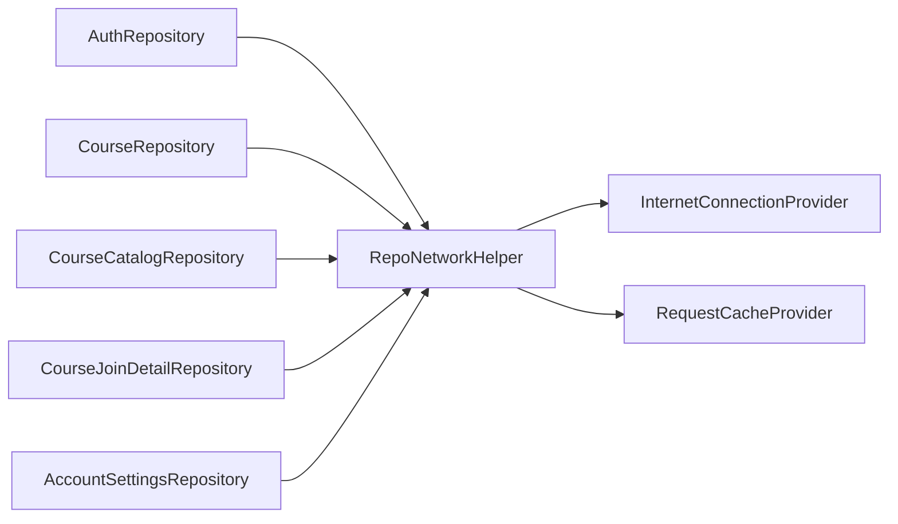

# Repository Pattern

<cite>
**Referenced Files in This Document**
- [repo_network_helper.dart](file://lib/app/core/logic/repository/repo_network_helper.dart)
- [listing_repo_helper.dart](file://lib/app/core/logic/repository/listing_repo_helper.dart)
- [cached_request_repository.dart](file://lib/app/core/logic/repository/cached_request_repository.dart)
- [app_exception.dart](file://lib/app/core/logic/repository/app_exception.dart)
- [data_response.dart](file://lib/app/core/model/data_response.dart)
- [auth_repository.dart](file://lib/app/features/authentication/repository/auth_repository.dart)
- [course_repository.dart](file://lib/app/features/courses/repository/course_repository.dart)
- [course_catalog_repository.dart](file://lib/app/features/courses/repository/course_catalog_repository.dart)
- [course_join_detail_repository.dart](file://lib/app/features/courses/repository/course_join_detail_repository.dart)
- [account_settings_repository.dart](file://lib/app/features/dashboard/repository/account_settings_repository.dart)
- [auth_state_provider.dart](file://lib/app/features/authentication/app_state/auth_state_provider.dart)
</cite>

## Table of Contents
1. [Introduction](#introduction)
2. [Project Structure](#project-structure)
3. [Core Components](#core-components)
4. [Architecture Overview](#architecture-overview)
5. [Detailed Component Analysis](#detailed-component-analysis)
6. [Dependency Analysis](#dependency-analysis)
7. [Performance Considerations](#performance-considerations)
8. [Troubleshooting Guide](#troubleshooting-guide)
9. [Conclusion](#conclusion)
10. [Appendices](#appendices)

## Introduction
This document explains the repository pattern implementation in Leadership Edge Live LMS. Repositories abstract data sources behind a clean interface so business logic can access data without knowing about underlying storage mechanisms (HTTP APIs, local cache, or offline queues). The core provides a shared networking helper with token refresh, offline handling, and caching; feature-specific repositories implement domain operations such as authentication, course catalog browsing, enrollment, progress tracking, and profile management.

## Project Structure
The repository layer is organized into:
- Core base utilities for network requests, error handling, pagination helpers, and caching
- Feature-specific repositories for Authentication, Courses, and Dashboard features
- Shared models for responses and page metadata

**Diagram sources**
- [repo_network_helper.dart:72-479](file://lib/app/core/logic/repository/repo_network_helper.dart#L72-L479)
- [listing_repo_helper.dart:4-24](file://lib/app/core/logic/repository/listing_repo_helper.dart#L4-L24)
- [cached_request_repository.dart:9-31](file://lib/app/core/logic/repository/cached_request_repository.dart#L9-L31)
- [app_exception.dart:6-54](file://lib/app/core/logic/repository/app_exception.dart#L6-L54)
- [data_response.dart:3-19](file://lib/app/core/model/data_response.dart#L3-L19)
- [auth_repository.dart:7-65](file://lib/app/features/authentication/repository/auth_repository.dart#L7-L65)
- [course_repository.dart:7-21](file://lib/app/features/courses/repository/course_repository.dart#L7-L21)
- [course_catalog_repository.dart:6-77](file://lib/app/features/courses/repository/course_catalog_repository.dart#L6-L77)
- [course_join_detail_repository.dart:96-180](file://lib/app/features/courses/repository/course_join_detail_repository.dart#L96-L180)
- [account_settings_repository.dart:33-165](file://lib/app/features/dashboard/repository/account_settings_repository.dart#L33-L165)

**Section sources**
- [repo_network_helper.dart:72-479](file://lib/app/core/logic/repository/repo_network_helper.dart#L72-L479)
- [listing_repo_helper.dart:4-24](file://lib/app/core/logic/repository/listing_repo_helper.dart#L4-L24)
- [cached_request_repository.dart:9-31](file://lib/app/core/logic/repository/cached_request_repository.dart#L9-L31)
- [app_exception.dart:6-54](file://lib/app/core/logic/repository/app_exception.dart#L6-L54)
- [data_response.dart:3-19](file://lib/app/core/model/data_response.dart#L3-L19)
- [auth_repository.dart:7-65](file://lib/app/features/authentication/repository/auth_repository.dart#L7-L65)
- [course_repository.dart:7-21](file://lib/app/features/courses/repository/course_repository.dart#L7-L21)
- [course_catalog_repository.dart:6-77](file://lib/app/features/courses/repository/course_catalog_repository.dart#L6-L77)
- [course_join_detail_repository.dart:96-180](file://lib/app/features/courses/repository/course_join_detail_repository.dart#L96-L180)
- [account_settings_repository.dart:33-165](file://lib/app/features/dashboard/repository/account_settings_repository.dart#L33-L165)

## Core Components
- RepoNetworkHelper: Provides HTTP methods (get/post/put/delete/patch), automatic token refresh on 401, offline mode detection, request serialization, FormData support, and optional caching via RequestCacheProvider. It also defines timeouts and headers.
- ListingRepoHelper<T>: Adds paginated listing capability by appending page parameters and parsing responses into DataResponse<T>.
- CachedRequestRepository: A thin repository that reuses RepoNetworkHelper to send queued cached requests back to the server.
- AppException hierarchy: Uniform error types (e.g., UnauthorizedException, InternetException) thrown from repositories to standardize error handling across features.
- DataResponse<T>: Standardized wrapper for list payloads with PageInfo for pagination.

Key responsibilities:
- Centralize network configuration and transport details
- Abstract data source differences from business logic
- Provide consistent error semantics and retry behavior
- Support offline-first flows with caching and queueing

**Section sources**
- [repo_network_helper.dart:31-129](file://lib/app/core/logic/repository/repo_network_helper.dart#L31-L129)
- [repo_network_helper.dart:239-283](file://lib/app/core/logic/repository/repo_network_helper.dart#L239-L283)
- [repo_network_helper.dart:286-479](file://lib/app/core/logic/repository/repo_network_helper.dart#L286-L479)
- [listing_repo_helper.dart:4-24](file://lib/app/core/logic/repository/listing_repo_helper.dart#L4-L24)
- [cached_request_repository.dart:9-31](file://lib/app/core/logic/repository/cached_request_repository.dart#L9-L31)
- [app_exception.dart:6-54](file://lib/app/core/logic/repository/app_exception.dart#L6-L54)
- [data_response.dart:3-19](file://lib/app/core/model/data_response.dart#L3-L19)

## Architecture Overview
Repositories compose a common networking layer with feature-specific endpoints and response mapping. Token refresh is handled centrally when configured, and offline behavior is transparent to callers.

**Diagram sources**
- [repo_network_helper.dart:72-129](file://lib/app/core/logic/repository/repo_network_helper.dart#L72-L129)
- [repo_network_helper.dart:239-283](file://lib/app/core/logic/repository/repo_network_helper.dart#L239-L283)
- [repo_network_helper.dart:286-479](file://lib/app/core/logic/repository/repo_network_helper.dart#L286-L479)

## Detailed Component Analysis

### Authentication Repository
Responsibilities:
- Login with email/password
- Auto-login using stored auto_login_token to obtain a fresh access token
- Validate current session by probing an endpoint or refreshing via auto-login

Token refresh integration:
- RepoNetworkConfig.refreshToken triggers automatic retry on 401 responses
- AuthStateNotifier coordinates in-flight deduplication and persistence of refreshed tokens

**Diagram sources**
- [auth_repository.dart:16-43](file://lib/app/features/authentication/repository/auth_repository.dart#L16-L43)
- [repo_network_helper.dart:72-129](file://lib/app/core/logic/repository/repo_network_helper.dart#L72-L129)

**Section sources**
- [auth_repository.dart:7-65](file://lib/app/features/authentication/repository/auth_repository.dart#L7-L65)
- [auth_state_provider.dart:94-126](file://lib/app/features/authentication/app_state/auth_state_provider.dart#L94-L126)
- [repo_network_helper.dart:72-129](file://lib/app/core/logic/repository/repo_network_helper.dart#L72-L129)

### Course Repository (Catalog and Listings)
Responsibilities:
- Paginated course listings using ListingRepoHelper
- Catalog fetch and search with filtering and grouping
- Enrollment and registration flows

**Diagram sources**
- [course_repository.dart:7-21](file://lib/app/features/courses/repository/course_repository.dart#L7-L21)
- [listing_repo_helper.dart:4-24](file://lib/app/core/logic/repository/listing_repo_helper.dart#L4-L24)
- [course_catalog_repository.dart:6-77](file://lib/app/features/courses/repository/course_catalog_repository.dart#L6-L77)

**Section sources**
- [course_repository.dart:7-21](file://lib/app/features/courses/repository/course_repository.dart#L7-L21)
- [course_catalog_repository.dart:18-76](file://lib/app/features/courses/repository/course_catalog_repository.dart#L18-L76)
- [listing_repo_helper.dart:4-24](file://lib/app/core/logic/repository/listing_repo_helper.dart#L4-L24)
- [data_response.dart:3-19](file://lib/app/core/model/data_response.dart#L3-L19)

### Course Enrollment and Registration
Responsibilities:
- Enroll in courses
- Register for specific classes (including single-class mode)
- Cancel registrations

**Diagram sources**
- [course_join_detail_repository.dart:96-180](file://lib/app/features/courses/repository/course_join_detail_repository.dart#L96-L180)
- [repo_network_helper.dart:239-283](file://lib/app/core/logic/repository/repo_network_helper.dart#L239-L283)

**Section sources**
- [course_join_detail_repository.dart:96-180](file://lib/app/features/courses/repository/course_join_detail_repository.dart#L96-L180)

### Account Settings Repository
Responsibilities:
- Fetch user profile details
- Update profile fields
- Upload avatar (multipart/form-data)
- Change password

**Diagram sources**
- [account_settings_repository.dart:95-132](file://lib/app/features/dashboard/repository/account_settings_repository.dart#L95-L132)
- [repo_network_helper.dart:151-157](file://lib/app/core/logic/repository/repo_network_helper.dart#L151-L157)

**Section sources**
- [account_settings_repository.dart:43-165](file://lib/app/features/dashboard/repository/account_settings_repository.dart#L43-L165)

### Error Handling Strategy
- Repositories throw typed exceptions from AppException hierarchy for consistent error classification
- Network errors, invalid responses, unauthorized states, and connectivity issues are uniformly represented
- ViewModels can map these exceptions to user-friendly messages

**Diagram sources**
- [app_exception.dart:6-54](file://lib/app/core/logic/repository/app_exception.dart#L6-L54)
- [repo_network_helper.dart:346-393](file://lib/app/core/logic/repository/repo_network_helper.dart#L346-L393)

**Section sources**
- [app_exception.dart:6-54](file://lib/app/core/logic/repository/app_exception.dart#L6-L54)
- [repo_network_helper.dart:346-393](file://lib/app/core/logic/repository/repo_network_helper.dart#L346-L393)

### Data Transformation and Parsing
- ListingRepoHelper uses DataResponse.parse to convert raw JSON lists into strongly-typed collections with PageInfo
- Feature repositories map responses to domain models (e.g., Course, CourseCatalogResponse, UserProfileDetail)

**Section sources**
- [listing_repo_helper.dart:4-24](file://lib/app/core/logic/repository/listing_repo_helper.dart#L4-L24)
- [data_response.dart:3-19](file://lib/app/core/model/data_response.dart#L3-L19)
- [course_repository.dart:16-20](file://lib/app/features/courses/repository/course_repository.dart#L16-L20)
- [course_catalog_repository.dart:18-46](file://lib/app/features/courses/repository/course_catalog_repository.dart#L18-L46)
- [account_settings_repository.dart:43-55](file://lib/app/features/dashboard/repository/account_settings_repository.dart#L43-L55)

### Caching Integration
- RepoNetworkHelper integrates with RequestCacheProvider for GET caching and POST queuing
- Offline mode checks manual toggle and connection state; cached responses are returned when available
- CachedRequestRepository sends queued POST requests when connectivity resumes

**Section sources**
- [repo_network_helper.dart:239-283](file://lib/app/core/logic/repository/repo_network_helper.dart#L239-L283)
- [repo_network_helper.dart:286-393](file://lib/app/core/logic/repository/repo_network_helper.dart#L286-L393)
- [cached_request_repository.dart:9-31](file://lib/app/core/logic/repository/cached_request_repository.dart#L9-L31)

## Dependency Analysis
Repositories depend on:
- RepoNetworkHelper for HTTP, token refresh, and offline handling
- Feature models for input/output contracts
- Providers for configuration (server URL, auth token, connection status)

**Diagram sources**
- [auth_repository.dart:7-15](file://lib/app/features/authentication/repository/auth_repository.dart#L7-L15)
- [course_repository.dart:7-14](file://lib/app/features/courses/repository/course_repository.dart#L7-L14)
- [course_catalog_repository.dart:6-16](file://lib/app/features/courses/repository/course_catalog_repository.dart#L6-L16)
- [course_join_detail_repository.dart:96-180](file://lib/app/features/courses/repository/course_join_detail_repository.dart#L96-L180)
- [account_settings_repository.dart:33-41](file://lib/app/features/dashboard/repository/account_settings_repository.dart#L33-L41)
- [repo_network_helper.dart:31-70](file://lib/app/core/logic/repository/repo_network_helper.dart#L31-L70)

**Section sources**
- [repo_network_helper.dart:31-70](file://lib/app/core/logic/repository/repo_network_helper.dart#L31-L70)
- [auth_repository.dart:7-15](file://lib/app/features/authentication/repository/auth_repository.dart#L7-L15)
- [course_repository.dart:7-14](file://lib/app/features/courses/repository/course_repository.dart#L7-L14)
- [course_catalog_repository.dart:6-16](file://lib/app/features/courses/repository/course_catalog_repository.dart#L6-L16)
- [account_settings_repository.dart:33-41](file://lib/app/features/dashboard/repository/account_settings_repository.dart#L33-L41)

## Performance Considerations
- Timeouts: Dio client enforces connect/receive/send timeouts to prevent indefinite loading states
- Token refresh: Automatic retry on 401 reduces redundant login flows and improves UX
- Pagination: ListingRepoHelper centralizes page parameter handling and response parsing
- Offline-first: Caching GETs and queuing POSTs minimizes network usage and improves responsiveness
- FormData handling: Proper content-type ensures efficient uploads without extra encoding overhead

[No sources needed since this section provides general guidance]

## Troubleshooting Guide
Common issues and strategies:
- Session expired: UnauthorizedException indicates token expiry; ensure RepoNetworkConfig.refreshToken is configured and AuthStateNotifier handles refresh
- No internet: InternetException or explicit offline exceptions; rely on cached responses or prompt user to enable connectivity
- Invalid server response: InvalidResponseException or generic exceptions when status != expected; check endpoint contracts and payload mapping
- Upload failures: Ensure FormData is used for file uploads; verify content-type handling in optionsFor

**Section sources**
- [app_exception.dart:20-54](file://lib/app/core/logic/repository/app_exception.dart#L20-L54)
- [repo_network_helper.dart:346-393](file://lib/app/core/logic/repository/repo_network_helper.dart#L346-L393)
- [account_settings_repository.dart:95-132](file://lib/app/features/dashboard/repository/account_settings_repository.dart#L95-L132)

## Conclusion
The repository pattern in Leadership Edge Live LMS cleanly separates business logic from data access. RepoNetworkHelper centralizes networking, token refresh, and offline behavior, while feature repositories encapsulate domain operations like authentication, course catalog browsing, enrollment, and profile management. Typed exceptions and standardized response wrappers provide consistent error handling and data transformation. This design enables easy extension with custom repositories and integration with different data sources.

[No sources needed since this section summarizes without analyzing specific files]

## Appendices

### Implementing a Custom Repository
Steps:
- Create a repository class mixing RepoNetworkHelper
- Inject RepoNetworkConfig via a Provider (use ServerProvider.repoConfigProvider)
- Implement methods using post/get/put/delete/patch
- Map responses to domain models; use ListingRepoHelper for paginated lists
- Handle errors by throwing appropriate AppException subclasses or returning structured results

Example patterns:
- Simple GET with parsing: see course catalog fetch
- Paginated listing: see course repository with ListingRepoHelper
- Multipart upload: see account settings avatar upload
- Enrollment flow: see course join detail repository

**Section sources**
- [course_repository.dart:7-21](file://lib/app/features/courses/repository/course_repository.dart#L7-L21)
- [course_catalog_repository.dart:18-76](file://lib/app/features/courses/repository/course_catalog_repository.dart#L18-L76)
- [account_settings_repository.dart:95-132](file://lib/app/features/dashboard/repository/account_settings_repository.dart#L95-L132)
- [course_join_detail_repository.dart:96-180](file://lib/app/features/courses/repository/course_join_detail_repository.dart#L96-L180)