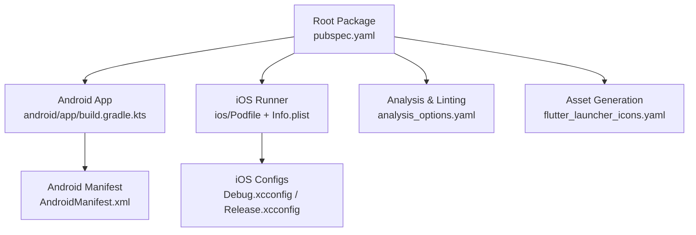
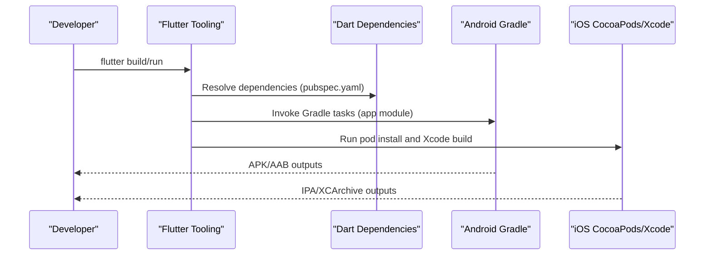
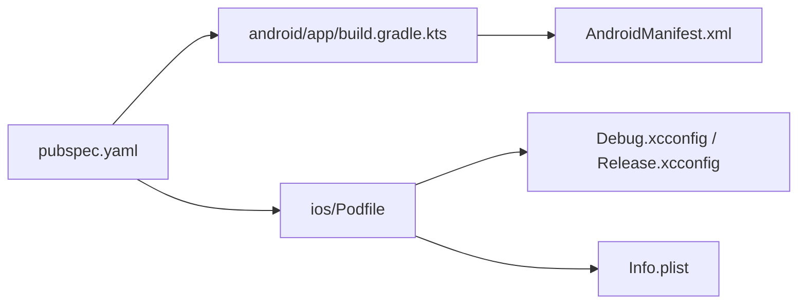

# Build Configuration

<cite>
**Referenced Files in This Document**
- [pubspec.yaml](file://pubspec.yaml)
- [analysis_options.yaml](file://analysis_options.yaml)
- [android/build.gradle.kts](file://android/build.gradle.kts)
- [android/app/build.gradle.kts](file://android/app/build.gradle.kts)
- [android/gradle.properties](file://android/gradle.properties)
- [android/gradle/wrapper/gradle-wrapper.properties](file://android/gradle/wrapper/gradle-wrapper.properties)
- [android/local.properties](file://android/local.properties)
- [android/app/src/main/AndroidManifest.xml](file://android/app/src/main/AndroidManifest.xml)
- [ios/Podfile](file://ios/Podfile)
- [ios/Flutter/Debug.xcconfig](file://ios/Flutter/Debug.xcconfig)
- [ios/Flutter/Release.xcconfig](file://ios/Flutter/Release.xcconfig)
- [ios/Runner/Info.plist](file://ios/Runner/Info.plist)
- [flutter_launcher_icons.yaml](file://flutter_launcher_icons.yaml)
</cite>

## Table of Contents
1. Introduction
2. Project Structure
3. Core Components
4. Architecture Overview
5. Detailed Component Analysis
6. Dependency Analysis
7. Performance Considerations
8. Troubleshooting Guide
9. Conclusion

## Introduction
This document explains the build configuration for the Leadership Edge Live LMS Flutter project. It covers the Flutter project structure, dependency management via pubspec.yaml, and platform-specific build configurations for Android (Gradle) and iOS (CocoaPods). It also documents analysis options and linting rules, environment-specific settings, custom build scripts, and optimization techniques to accelerate development cycles.

## Project Structure
The repository follows a standard Flutter multi-platform layout:
- Root-level Dart package configuration and tooling files define dependencies, assets, code generation, and analysis rules.
- android/ contains Gradle-based native build configuration for Android.
- ios/ contains CocoaPods-based native build configuration for iOS.
- Platform folders for web, linux, macos, windows are present with their respective build systems.

**Diagram sources**
- [pubspec.yaml:1-171](file://pubspec.yaml#L1-L171)
- [android/app/build.gradle.kts:1-45](file://android/app/build.gradle.kts#L1-L45)
- [ios/Podfile:1-44](file://ios/Podfile#L1-L44)
- [analysis_options.yaml:1-38](file://analysis_options.yaml#L1-L38)
- [flutter_launcher_icons.yaml:1-35](file://flutter_launcher_icons.yaml#L1-L35)
- [android/app/src/main/AndroidManifest.xml:1-46](file://android/app/src/main/AndroidManifest.xml#L1-L46)
- [ios/Flutter/Debug.xcconfig:1-3](file://ios/Flutter/Debug.xcconfig#L1-L3)
- [ios/Flutter/Release.xcconfig:1-3](file://ios/Flutter/Release.xcconfig#L1-L3)

**Section sources**
- [pubspec.yaml:1-171](file://pubspec.yaml#L1-L171)
- [android/app/build.gradle.kts:1-45](file://android/app/build.gradle.kts#L1-L45)
- [ios/Podfile:1-44](file://ios/Podfile#L1-L44)
- [analysis_options.yaml:1-38](file://analysis_options.yaml#L1-L38)
- [flutter_launcher_icons.yaml:1-35](file://flutter_launcher_icons.yaml#L1-L35)

## Core Components
- Flutter package manifest and assets:
  - Defines application name, version, SDK constraints, dependencies, dev_dependencies, and Flutter-specific sections including assets and code generation output paths.
- Android Gradle setup:
  - Application plugin, Kotlin, and Flutter Gradle plugin; compile/target Java versions; default config sourced from Flutter tooling; build types; namespace and applicationId.
- iOS CocoaPods setup:
  - Minimum platform version; target mapping; Flutter pod helper integration; test target inheritance; post-install build settings injection.
- Static analysis and linting:
  - Analyzer excludes generated/platform directories; includes Flutter recommended lints; optional rule customization.
- Asset and icon generation:
  - Launcher icons configured for Android, iOS, Web, Windows, macOS with image source and platform-specific options.

**Section sources**
- [pubspec.yaml:1-171](file://pubspec.yaml#L1-L171)
- [android/app/build.gradle.kts:1-45](file://android/app/build.gradle.kts#L1-L45)
- [ios/Podfile:1-44](file://ios/Podfile#L1-L44)
- [analysis_options.yaml:1-38](file://analysis_options.yaml#L1-L38)
- [flutter_launcher_icons.yaml:1-35](file://flutter_launcher_icons.yaml#L1-L35)

## Architecture Overview
High-level build flow across platforms:
- Flutter tooling reads pubspec.yaml to resolve Dart dependencies and assets.
- Android builds use Gradle to compile Kotlin/Java and bundle Flutter artifacts, applying signing and build type settings.
- iOS builds use CocoaPods to install native dependencies and configure Xcode targets with Flutter-provided settings.

**Diagram sources**
- [pubspec.yaml:1-171](file://pubspec.yaml#L1-L171)
- [android/app/build.gradle.kts:1-45](file://android/app/build.gradle.kts#L1-L45)
- [ios/Podfile:1-44](file://ios/Podfile#L1-L44)

## Detailed Component Analysis

### Flutter Package and Assets (pubspec.yaml)
- Versioning and environment:
  - Application version and build metadata are defined at the package level.
  - SDK constraint ensures compatible Dart runtime.
- Dependencies:
  - Runtime dependencies include state management, networking, caching, media playback, WebView, localization, and UI libraries.
- Dev dependencies:
  - Testing, mocking, code generation, linting, launcher icons, and package renaming tools.
- Flutter section:
  - Material design usage enabled.
  - Assets directories declared for images and translations.
  - Code generation output path configured for generated assets.

Key responsibilities:
- Centralizes dependency versions and asset inclusion.
- Drives code generation and resource availability at build time.

**Section sources**
- [pubspec.yaml:1-171](file://pubspec.yaml#L1-L171)

### Android Build Configuration (Gradle)
- Top-level Gradle:
  - Repositories set to Google and Maven Central.
  - Build directory centralized under root build folder.
  - Subprojects evaluated against the app module; clean task configured to remove build outputs.
- App module Gradle:
  - Plugins: Android application, Kotlin, and Flutter Gradle plugin applied in correct order.
  - Compile options: Java 11 compatibility for both source and target.
  - Kotlin options: JVM target set to Java 11.
  - Default config: Namespace, compileSdk, ndkVersion, minSdk, targetSdk, versionCode, versionName sourced from Flutter tooling.
  - Build types: Release build type exists; currently uses debug signing placeholder.
- Android Manifest:
  - Declares main activity, theme metadata, embedding version, and queries for text processing.

Build variants and signing:
- Variants: Debug (default), Profile, Release are supported by Flutter’s Gradle integration.
- Signing: Release build currently references debug signing; production requires a dedicated release keystore and signingConfig.

Optimization notes:
- Ensure Java/Kotlin 11 is available on the build machine.
- Centralized build directories simplify CI cache strategies.

**Section sources**
- [android/build.gradle.kts:1-22](file://android/build.gradle.kts#L1-L22)
- [android/app/build.gradle.kts:1-45](file://android/app/build.gradle.kts#L1-L45)
- [android/app/src/main/AndroidManifest.xml:1-46](file://android/app/src/main/AndroidManifest.xml#L1-L46)

### Android Gradle Wrapper and Properties
- Wrapper:
  - Uses a specific Gradle distribution URL to ensure reproducible builds.
- Properties:
  - JVM arguments allocate memory for faster builds and prevent OOM errors.
  - AndroidX enabled; Jetifier enabled for legacy support.
- Local properties:
  - Points to local Flutter SDK path for tooling resolution.

**Section sources**
- [android/gradle/wrapper/gradle-wrapper.properties:1-6](file://android/gradle/wrapper/gradle-wrapper.properties#L1-L6)
- [android/gradle.properties:1-4](file://android/gradle.properties#L1-L4)
- [android/local.properties:1-1](file://android/local.properties#L1-L1)

### iOS Build Configuration (CocoaPods and Xcode)
- Podfile:
  - Sets minimum iOS platform version.
  - Disables CocoaPods analytics to reduce build latency.
  - Maps Xcode build configurations (Debug, Profile, Release) to appropriate modes.
  - Locates Flutter root via Generated.xcconfig and requires Flutter podhelper.
  - Installs all Flutter iOS pods and sets up the Runner target; tests inherit search paths.
  - Post-install hook applies additional Flutter iOS build settings to all targets.
- Xcode configs:
  - Debug and Release xcconfigs include generated settings and Pods support files.
- Info.plist:
  - Defines display name, bundle identifiers, version strings driven by Flutter build variables, supported orientations, and privacy-related keys.

Environment-specific behavior:
- Debug vs Release profiles are mapped explicitly in the Podfile.
- Environment variables and generated configs propagate Flutter build metadata into the iOS build.

**Section sources**
- [ios/Podfile:1-44](file://ios/Podfile#L1-L44)
- [ios/Flutter/Debug.xcconfig:1-3](file://ios/Flutter/Debug.xcconfig#L1-L3)
- [ios/Flutter/Release.xcconfig:1-3](file://ios/Flutter/Release.xcconfig#L1-L3)
- [ios/Runner/Info.plist:1-78](file://ios/Runner/Info.plist#L1-L78)

### Analysis Options and Linting
- Analyzer configuration:
  - Excludes generated and platform-specific directories from static analysis.
  - Includes Flutter recommended lints for consistent code quality.
- Customization:
  - Rules can be toggled or extended as needed; comments indicate examples for enabling/disabling rules.

Best practices:
- Keep analyzer excludes minimal to avoid missing issues in generated code if necessary.
- Adopt stricter rules over time to improve code quality.

**Section sources**
- [analysis_options.yaml:1-38](file://analysis_options.yaml#L1-L38)

### Asset and Icon Generation
- Launcher icons:
  - Single source image used to generate platform-specific icons for Android, iOS, Web, Windows, and macOS.
  - Platform-specific options such as minimum Android SDK, alpha removal for iOS, and background/theme colors for Web.

Workflow:
- Run the launcher icons generator to update app icons across platforms after changing the source image.

**Section sources**
- [flutter_launcher_icons.yaml:1-35](file://flutter_launcher_icons.yaml#L1-L35)

## Dependency Analysis
Dependency relationships between build components:
- pubspec.yaml drives Dart dependencies and asset generation.
- Android Gradle depends on Flutter tooling for SDK and NDK versions and integrates with Kotlin and Android plugins.
- iOS CocoaPods depends on Flutter-generated settings and installs Flutter-required pods.

**Diagram sources**
- [pubspec.yaml:1-171](file://pubspec.yaml#L1-L171)
- [android/app/build.gradle.kts:1-45](file://android/app/build.gradle.kts#L1-L45)
- [android/app/src/main/AndroidManifest.xml:1-46](file://android/app/src/main/AndroidManifest.xml#L1-L46)
- [ios/Podfile:1-44](file://ios/Podfile#L1-L44)
- [ios/Flutter/Debug.xcconfig:1-3](file://ios/Flutter/Debug.xcconfig#L1-L3)
- [ios/Flutter/Release.xcconfig:1-3](file://ios/Flutter/Release.xcconfig#L1-L3)
- [ios/Runner/Info.plist:1-78](file://ios/Runner/Info.plist#L1-L78)

**Section sources**
- [pubspec.yaml:1-171](file://pubspec.yaml#L1-L171)
- [android/app/build.gradle.kts:1-45](file://android/app/build.gradle.kts#L1-L45)
- [ios/Podfile:1-44](file://ios/Podfile#L1-L44)

## Performance Considerations
- Android:
  - Use a stable Gradle wrapper version to ensure consistent performance across environments.
  - Allocate sufficient JVM memory via Gradle properties to avoid slowdowns during large builds.
  - Centralize build directories to improve cache locality and CI artifact handling.
  - Configure proper release signing to enable optimized packaging and store submission workflows.
- iOS:
  - Disable CocoaPods analytics to reduce network overhead during pod install.
  - Ensure minimum iOS platform matches your deployment target to avoid unnecessary rebuilds.
  - Leverage Xcode build caches and parallel jobs where possible.
- Cross-platform:
  - Keep dependencies updated to benefit from performance improvements in underlying libraries.
  - Use profile builds to measure runtime performance and identify bottlenecks before release.

[No sources needed since this section provides general guidance]

## Troubleshooting Guide
Common issues and resolutions:
- Missing Flutter SDK path on Android:
  - Ensure local.properties points to a valid Flutter SDK installation.
- CocoaPods cannot find Flutter root:
  - Run flutter pub get to regenerate required Flutter files before running pod install.
- iOS build configuration mismatch:
  - Verify that Debug/Profile/Release mappings in Podfile align with Xcode schemes.
- Android signing errors in release builds:
  - Replace debug signing with a proper release keystore and configure signingConfig accordingly.
- Slow builds:
  - Increase Gradle JVM heap size; disable CocoaPods analytics; ensure Gradle wrapper is pinned to a known-good version.

**Section sources**
- [android/local.properties:1-1](file://android/local.properties#L1-L1)
- [ios/Podfile:13-24](file://ios/Podfile#L13-L24)
- [ios/Podfile:7-11](file://ios/Podfile#L7-L11)
- [android/app/build.gradle.kts:33-39](file://android/app/build.gradle.kts#L33-L39)
- [android/gradle.properties:1-4](file://android/gradle.properties#L1-L4)
- [android/gradle/wrapper/gradle-wrapper.properties:1-6](file://android/gradle/wrapper/gradle-wrapper.properties#L1-L6)

## Conclusion
The Leadership Edge Live LMS build configuration centers around a well-structured Flutter package manifest and platform-specific Gradle and CocoaPods setups. Android relies on Gradle with clear compile options and build types, while iOS uses CocoaPods with explicit configuration mappings and generated Flutter settings. Static analysis and linting enforce code quality, and asset generation streamlines cross-platform icon creation. Applying the optimization and troubleshooting guidance will help maintain fast, reliable builds across development and production environments.