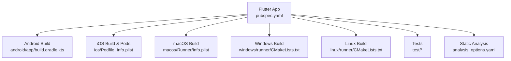
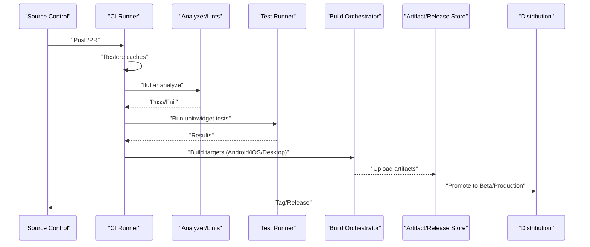
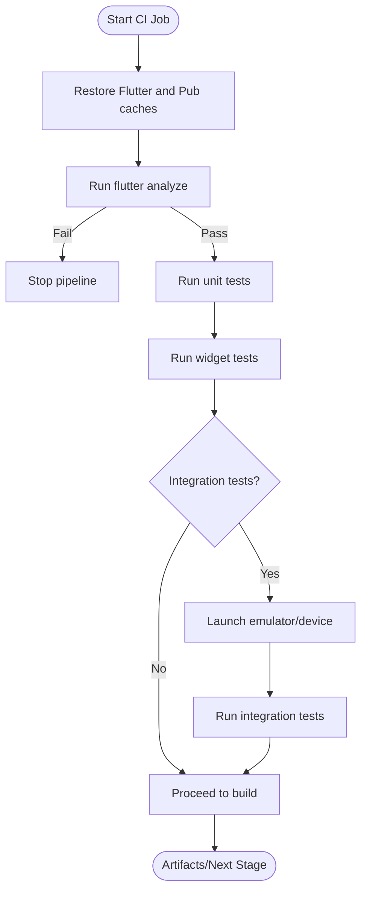
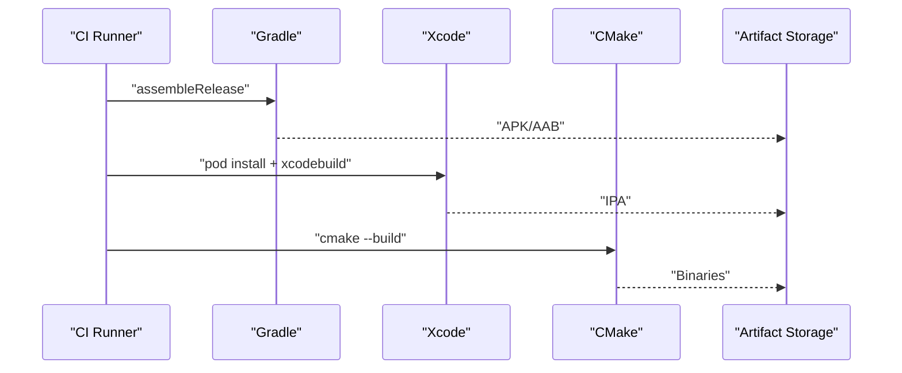
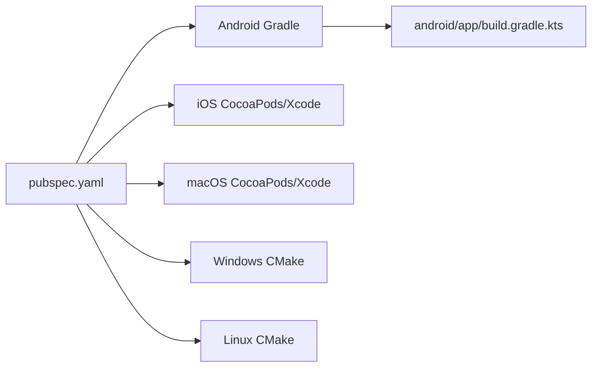

# CI/CD Pipeline

<cite>
**Referenced Files in This Document**
- [pubspec.yaml](file://pubspec.yaml)
- [analysis_options.yaml](file://analysis_options.yaml)
- [android/app/build.gradle.kts](file://android/app/build.gradle.kts)
- [android/build.gradle.kts](file://android/build.gradle.kts)
- [ios/Runner/Info.plist](file://ios/Runner/Info.plist)
- [ios/Podfile](file://ios/Podfile)
- [macos/Runner/Info.plist](file://macos/Runner/Info.plist)
- [windows/runner/CMakeLists.txt](file://windows/runner/CMakeLists.txt)
- [linux/runner/CMakeLists.txt](file://linux/runner/CMakeLists.txt)
- [test/widget_test.dart](file://test/widget_test.dart)
- [test/payment/iap_repository_test.dart](file://test/payment/iap_repository_test.dart)
- [test/payment/iap_viewmodel_test.dart](file://test/payment/iap_viewmodel_test.dart)
- [test/payment/purchase_record_test.dart](file://test/payment/purchase_record_test.dart)
</cite>

## Table of Contents
1. Introduction
2. Project Structure
3. Core Components
4. Architecture Overview
5. Detailed Component Analysis
6. Dependency Analysis
7. Performance Considerations
8. Troubleshooting Guide
9. Conclusion

## Introduction
This document defines a complete continuous integration and deployment (CI/CD) strategy for the Leadership Edge Live LMS Flutter application. It covers automated testing, multi-platform builds, artifact management, versioning, release automation, beta distribution, production deployments, caching strategies, performance monitoring, rollback procedures, deployment validation, and debugging failed builds. The guidance is tailored to this repository’s structure and configuration files.

## Project Structure
The project is a Flutter app with native modules for Android, iOS, macOS, Windows, and Linux. Tests are organized under test/, including widget tests and unit tests for payment features. Platform-specific build configurations exist in android/, ios/, macos/, windows/, and linux/. Versioning and dependencies are declared in pubspec.yaml. Static analysis rules are defined in analysis_options.yaml.

**Diagram sources**
- [pubspec.yaml:1-171](file://pubspec.yaml#L1-L171)
- [android/app/build.gradle.kts:1-45](file://android/app/build.gradle.kts#L1-L45)
- [ios/Podfile:1-200](file://ios/Podfile)
- [ios/Runner/Info.plist:1-200](file://ios/Runner/Info.plist)
- [macos/Runner/Info.plist:1-200](file://macos/Runner/Info.plist)
- [windows/runner/CMakeLists.txt:1-200](file://windows/runner/CMakeLists.txt)
- [linux/runner/CMakeLists.txt:1-200](file://linux/runner/CMakeLists.txt)
- [test/widget_test.dart:1-31](file://test/widget_test.dart#L1-L31)
- [analysis_options.yaml:1-38](file://analysis_options.yaml#L1-L38)

**Section sources**
- [pubspec.yaml:1-171](file://pubspec.yaml#L1-L171)
- [analysis_options.yaml:1-38](file://analysis_options.yaml#L1-L38)
- [android/app/build.gradle.kts:1-45](file://android/app/build.gradle.kts#L1-L45)

## Core Components
- Version and dependency management: Centralized in pubspec.yaml, including SDK constraints and dependencies used across platforms.
- Static analysis: Configured via analysis_options.yaml to enforce linting and analyzer settings.
- Android build: Gradle plugin integration and signing configuration in android/app/build.gradle.kts; shared build directory in android/build.gradle.kts.
- iOS/macOS builds: Podfile and platform Info.plist files drive CocoaPods and bundle metadata.
- Desktop builds: CMake-based configurations for Windows and Linux.
- Tests: Widget tests and unit tests under test/ provide coverage for UI and business logic.

**Section sources**
- [pubspec.yaml:1-171](file://pubspec.yaml#L1-L171)
- [analysis_options.yaml:1-38](file://analysis_options.yaml#L1-L38)
- [android/app/build.gradle.kts:1-45](file://android/app/build.gradle.kts#L1-L45)
- [android/build.gradle.kts:1-22](file://android/build.gradle.kts#L1-L22)
- [ios/Podfile:1-200](file://ios/Podfile)
- [ios/Runner/Info.plist:1-200](file://ios/Runner/Info.plist)
- [macos/Runner/Info.plist:1-200](file://macos/Runner/Info.plist)
- [windows/runner/CMakeLists.txt:1-200](file://windows/runner/CMakeLists.txt)
- [linux/runner/CMakeLists.txt:1-200](file://linux/runner/CMakeLists.txt)
- [test/widget_test.dart:1-31](file://test/widget_test.dart#L1-L31)
- [test/payment/iap_repository_test.dart:1-2](file://test/payment/iap_repository_test.dart#L1-L2)
- [test/payment/iap_viewmodel_test.dart:1-200](file://test/payment/iap_viewmodel_test.dart)
- [test/payment/purchase_record_test.dart:1-200](file://test/payment/purchase_record_test.dart)

## Architecture Overview
The CI/CD pipeline stages include:
- Checkout and cache restoration
- Environment setup (Flutter/Dart/SDKs)
- Static analysis and dependency resolution
- Unit and widget tests execution
- Multi-platform builds and packaging
- Artifact upload and release publishing
- Deployment to stores or internal distribution channels

[No sources needed since this diagram shows conceptual workflow, not actual code structure]

## Detailed Component Analysis

### Automated Testing Strategy
- Unit tests: Execute Dart unit tests for domain logic and repositories. Include existing payment-related tests where applicable.
- Widget tests: Run UI smoke tests using flutter_test to validate critical user flows.
- Integration tests: Add end-to-end tests that launch the app on emulators/devices and verify key scenarios against backend services.

Recommended CI steps:
- Install dependencies and generate code if required by the project.
- Run flutter analyze to fail fast on static issues.
- Execute unit tests and widget tests in parallel where possible.
- For integration tests, provision emulator/device images per target platform and run tests headlessly.

[No sources needed since this diagram shows conceptual workflow, not actual code structure]

**Section sources**
- [test/widget_test.dart:1-31](file://test/widget_test.dart#L1-L31)
- [test/payment/iap_repository_test.dart:1-2](file://test/payment/iap_repository_test.dart#L1-L2)
- [test/payment/iap_viewmodel_test.dart:1-200](file://test/payment/iap_viewmodel_test.dart)
- [test/payment/purchase_record_test.dart:1-200](file://test/payment/purchase_record_test.dart)

### Automated Builds and Artifacts
- Android: Use Gradle to assemble debug and release APK/AAB. Configure signing for release builds in android/app/build.gradle.kts.
- iOS: Resolve pods and build IPA using Xcode toolchain. Ensure provisioning profiles and certificates are available in CI.
- Desktop: Build executables for Windows and Linux using CMake-based targets.

Artifact generation:
- Android: APK/AAB with version metadata from pubspec.yaml.
- iOS: IPA signed with appropriate entitlements and Info.plist metadata.
- Desktop: Platform binaries packaged for distribution.

Version management:
- Read version from pubspec.yaml and propagate to platform manifests during build.
- Tag releases and set build numbers consistently across platforms.

**Diagram sources**
- [android/app/build.gradle.kts:1-45](file://android/app/build.gradle.kts#L1-L45)
- [pubspec.yaml:1-171](file://pubspec.yaml#L1-L171)

**Section sources**
- [android/app/build.gradle.kts:1-45](file://android/app/build.gradle.kts#L1-L45)
- [pubspec.yaml:1-171](file://pubspec.yaml#L1-L171)
- [ios/Podfile:1-200](file://ios/Podfile)
- [ios/Runner/Info.plist:1-200](file://ios/Runner/Info.plist)
- [macos/Runner/Info.plist:1-200](file://macos/Runner/Info.plist)
- [windows/runner/CMakeLists.txt:1-200](file://windows/runner/CMakeLists.txt)
- [linux/runner/CMakeLists.txt:1-200](file://linux/runner/CMakeLists.txt)

### Release Automation and Distribution
- Internal beta distribution: Publish Android AAB/IPA to internal distribution channels (e.g., Firebase App Distribution, TestFlight).
- Production releases: Promote verified builds to Google Play Store and Apple App Store Connect.
- Version tagging: Create semantic version tags and attach release notes generated from commit history.

Validation gates before promotion:
- All tests pass
- Static analysis clean
- Security scans (dependency vulnerabilities)
- Smoke tests on representative devices/emulators

**Section sources**
- [pubspec.yaml:1-171](file://pubspec.yaml#L1-L171)
- [android/app/build.gradle.kts:1-45](file://android/app/build.gradle.kts#L1-L45)
- [ios/Podfile:1-200](file://ios/Podfile)
- [ios/Runner/Info.plist:1-200](file://ios/Runner/Info.plist)

### Caching Strategies for Faster Builds
- Cache Flutter SDK and pub cache to reduce dependency resolution time.
- Cache CocoaPods and derived data for iOS builds.
- Cache Gradle wrapper and build cache for Android.
- Cache desktop build outputs when feasible.

Benefits:
- Reduced build times
- Lower cloud compute costs
- Faster feedback loops for developers

[No sources needed since this section provides general guidance]

### Monitoring Pipeline Performance
- Track build duration per stage and overall pipeline time.
- Monitor cache hit rates to optimize caching policies.
- Alert on flaky tests and frequent failures.
- Record resource usage (CPU/memory) to right-size runners.

[No sources needed since this section provides general guidance]

### Rollback Procedures
- Maintain previous stable artifacts in storage.
- For store-managed releases, use staged rollouts and revert to prior versions when necessary.
- For desktop builds, publish updated installers and notify users to update.

[No sources needed since this section provides general guidance]

### Deployment Validation
- Post-deployment smoke tests on staging environments.
- Verify app version and build metadata match expectations.
- Check analytics and crash reporting for anomalies after release.

[No sources needed since this section provides general guidance]

### Debugging Failed Builds
- Inspect logs for failing stages (analyze, test, build).
- Reproduce locally with same environment versions.
- Validate signing and provisioning for iOS/macOS.
- Ensure platform SDKs and tools are up-to-date in CI.

[No sources needed since this section provides general guidance]

## Dependency Analysis
The CI/CD pipeline depends on:
- Flutter/Dart SDK constrained by pubspec.yaml
- Android Gradle plugin and NDK configured in android/app/build.gradle.kts
- CocoaPods and Xcode toolchain for iOS/macOS
- CMake and compilers for Windows/Linux

**Diagram sources**
- [pubspec.yaml:1-171](file://pubspec.yaml#L1-L171)
- [android/app/build.gradle.kts:1-45](file://android/app/build.gradle.kts#L1-L45)

**Section sources**
- [pubspec.yaml:1-171](file://pubspec.yaml#L1-L171)
- [android/app/build.gradle.kts:1-45](file://android/app/build.gradle.kts#L1-L45)
- [ios/Podfile:1-200](file://ios/Podfile)
- [windows/runner/CMakeLists.txt:1-200](file://windows/runner/CMakeLists.txt)
- [linux/runner/CMakeLists.txt:1-200](file://linux/runner/CMakeLists.txt)

## Performance Considerations
- Parallelize independent jobs (analyze, test, build per platform).
- Use containerized runners with pinned OS and tool versions.
- Minimize network calls by caching dependencies aggressively.
- Split large test suites into smaller groups for faster feedback.

[No sources needed since this section provides general guidance]

## Troubleshooting Guide
Common issues and resolutions:
- Static analysis failures: Fix lints reported by flutter analyze; ensure analysis_options.yaml excludes are intentional.
- Test failures: Isolate failing tests, add retries for flaky tests, and ensure deterministic mocks.
- Android build errors: Validate Java/Kotlin versions and NDK compatibility; check signing configs.
- iOS build errors: Verify pod installation, provisioning profiles, and certificate validity.
- Desktop build errors: Confirm CMake and compiler toolchains are installed and accessible.

**Section sources**
- [analysis_options.yaml:1-38](file://analysis_options.yaml#L1-L38)
- [android/app/build.gradle.kts:1-45](file://android/app/build.gradle.kts#L1-L45)
- [ios/Podfile:1-200](file://ios/Podfile)
- [windows/runner/CMakeLists.txt:1-200](file://windows/runner/CMakeLists.txt)
- [linux/runner/CMakeLists.txt:1-200](file://linux/runner/CMakeLists.txt)

## Conclusion
This CI/CD strategy ensures reliable, repeatable builds and deployments for the Leadership Edge Live LMS across all supported platforms. By automating testing, enforcing static analysis, standardizing versioning, and implementing robust caching and monitoring, teams can deliver high-quality updates quickly and safely. Adopting the recommended rollout and rollback practices further reduces risk during production releases.