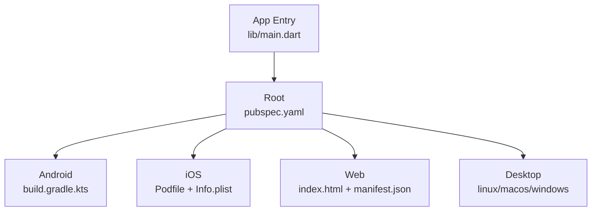
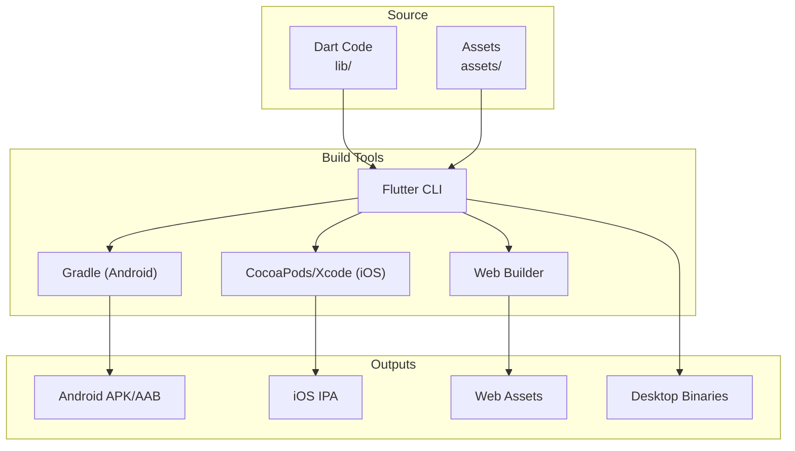
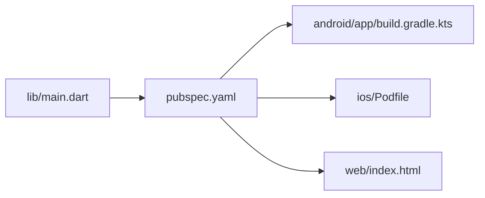

# Deployment & Distribution

<cite>
**Referenced Files in This Document**
- [pubspec.yaml](file://pubspec.yaml)
- [android/app/build.gradle.kts](file://android/app/build.gradle.kts)
- [android/gradle.properties](file://android/gradle.properties)
- [ios/Runner/Info.plist](file://ios/Runner/Info.plist)
- [ios/Podfile](file://ios/Podfile)
- [web/index.html](file://web/index.html)
- [web/manifest.json](file://web/manifest.json)
- [lib/main.dart](file://lib/main.dart)
- [flutter_launcher_icons.yaml](file://flutter_launcher_icons.yaml)
</cite>

## Table of Contents
1. [Introduction](#introduction)
2. [Project Structure](#project-structure)
3. [Core Components](#core-components)
4. [Architecture Overview](#architecture-overview)
5. [Detailed Component Analysis](#detailed-component-analysis)
6. [Dependency Analysis](#dependency-analysis)
7. [Performance Considerations](#performance-considerations)
8. [Troubleshooting Guide](#troubleshooting-guide)
9. [Conclusion](#conclusion)
10. [Appendices](#appendices)

## Introduction
This document provides a complete guide to building, configuring, and distributing the Leadership Edge Live LMS across Android, iOS, Web, and Desktop platforms. It covers build commands, environment configuration, secrets handling, app store submission workflows (Google Play Store and Apple App Store), web deployment options, performance optimization for production, CI/CD pipeline setup, automated testing, and release management strategies.

## Project Structure
The project is a Flutter application with platform-specific directories for Android, iOS, Web, Linux, macOS, and Windows. Build and distribution configurations are primarily located in:
- Android: Gradle scripts and properties
- iOS: Xcode project settings and CocoaPods configuration
- Web: HTML entry point and PWA manifest
- Root: pubspec.yaml for dependencies and versioning; flutter_launcher_icons.yaml for asset generation

**Diagram sources**
- [pubspec.yaml:1-171](file://pubspec.yaml#L1-L171)
- [android/app/build.gradle.kts:1-45](file://android/app/build.gradle.kts#L1-L45)
- [ios/Podfile:1-44](file://ios/Podfile#L1-L44)
- [ios/Runner/Info.plist:1-78](file://ios/Runner/Info.plist#L1-L78)
- [web/index.html:1-39](file://web/index.html#L1-L39)
- [web/manifest.json:1-35](file://web/manifest.json#L1-L35)
- [lib/main.dart:1-60](file://lib/main.dart#L1-L60)

**Section sources**
- [pubspec.yaml:1-171](file://pubspec.yaml#L1-L171)
- [android/app/build.gradle.kts:1-45](file://android/app/build.gradle.kts#L1-L45)
- [ios/Runner/Info.plist:1-78](file://ios/Runner/Info.plist#L1-L78)
- [ios/Podfile:1-44](file://ios/Podfile#L1-L44)
- [web/index.html:1-39](file://web/index.html#L1-L39)
- [web/manifest.json:1-35](file://web/manifest.json#L1-L35)
- [lib/main.dart:1-60](file://lib/main.dart#L1-L60)

## Core Components
- Application entrypoint initializes localization, media engine, and modular routing before launching the UI.
- Versioning and metadata are defined centrally in the package manifest and propagated to platform manifests during builds.
- Asset generation tooling configures icons for all supported platforms.

Key responsibilities:
- Initialize services and ensure clean state at startup
- Configure localization assets and fallback locales
- Wire up dependency injection and routing modules

**Section sources**
- [lib/main.dart:16-38](file://lib/main.dart#L16-L38)
- [pubspec.yaml:1-171](file://pubspec.yaml#L1-L171)
- [flutter_launcher_icons.yaml:1-35](file://flutter_launcher_icons.yaml#L1-L35)

## Architecture Overview
The build system orchestrates platform-specific outputs from shared Dart code:
- Android: Gradle plugin integrates with Flutter to produce APK/AAB
- iOS: CocoaPods and Xcode produce IPA via Archive
- Web: Static site generated by Flutter’s web build
- Desktop: Platform-specific binaries built via Flutter toolchain

[No sources needed since this diagram shows conceptual workflow, not actual code structure]

## Detailed Component Analysis

### Android Build and Distribution
- Package name and namespace are configured in the Android module.
- Versioning is driven by Flutter’s version and build number, mapped to Android versionName/versionCode.
- Release signing is currently using debug keys; production requires a dedicated keystore and signing config.

Recommended steps:
- Generate a release keystore and configure signing in the Android module.
- Build variants:
  - Debug: fast iteration
  - Release: optimized binary
  - Profile: performance profiling
- Outputs:
  - APK for sideloading/testing
  - AAB for Google Play Store upload

Environment notes:
- JVM memory and AndroidX/Jetifier flags are set in Gradle properties.

**Section sources**
- [android/app/build.gradle.kts:8-40](file://android/app/build.gradle.kts#L8-L40)
- [android/gradle.properties:1-4](file://android/gradle.properties#L1-L4)

### iOS Build and Distribution
- Minimum iOS version is declared in the Podfile.
- App metadata such as display name, bundle identifier, and version strings are sourced from Xcode project variables and Flutter build inputs.
- Privacy manifest is present for modern privacy requirements.

Recommended steps:
- Ensure CocoaPods dependencies are installed.
- Create an Archive in Xcode or use command-line tools to produce an IPA.
- Configure provisioning profiles and code signing for Release builds.
- Prepare App Store Connect metadata and submit via Transporter/App Store Connect.

**Section sources**
- [ios/Podfile:1-44](file://ios/Podfile#L1-L44)
- [ios/Runner/Info.plist:1-78](file://ios/Runner/Info.plist#L1-L78)

### Web Build and Deployment
- The web entry point uses a base href placeholder replaced at build time.
- PWA manifest defines app name, icons, and behavior for standalone mode.

Deployment options:
- Host static assets on any HTTP server (e.g., Nginx, Apache, CDN).
- Use caching headers and compression for performance.
- Optionally serve under a non-root path by adjusting base href at build time.

**Section sources**
- [web/index.html:1-39](file://web/index.html#L1-L39)
- [web/manifest.json:1-35](file://web/manifest.json#L1-L35)

### Desktop Builds (Linux, macOS, Windows)
- Desktop targets are included in the project structure and can be built using Flutter’s desktop toolchain.
- No additional desktop-specific build scripts were found; rely on Flutter’s default desktop build process.

**Section sources**
- [pubspec.yaml:1-171](file://pubspec.yaml#L1-L171)

### Environment Configuration and Secrets Handling
- Localization assets are loaded from a translations directory and used at runtime.
- No explicit environment files or secret managers were detected in the repository.
- For production, externalize sensitive values (API endpoints, tokens) via secure environment variables injected at build time or runtime, depending on platform capabilities.

Best practices:
- Avoid committing secrets to version control.
- Use CI/CD secret stores to inject environment variables into builds.
- Validate required configuration at startup and fail fast if missing.

**Section sources**
- [lib/main.dart:24-37](file://lib/main.dart#L24-L37)

### App Store Submission Processes

#### Google Play Store
- Prepare a signed release AAB.
- Upload to Google Play Console and complete store listing, ratings, and privacy policy.
- Manage internal/closed/open tracks for staged rollouts.

#### Apple App Store
- Produce a signed IPA via Xcode Archive.
- Attach provisioning profile and certificate appropriate for App Store distribution.
- Submit via Transporter or Xcode to App Store Connect; complete metadata, screenshots, and review information.

[No sources needed since this section provides general guidance]

### Build-Time Customization
- Versioning is centralized in the package manifest and propagated to platform manifests during builds.
- Icons and PWA assets are generated via the launcher icons configuration.

**Section sources**
- [pubspec.yaml:7-19](file://pubspec.yaml#L7-L19)
- [flutter_launcher_icons.yaml:1-35](file://flutter_launcher_icons.yaml#L1-L35)

## Dependency Analysis
The root manifest declares core dependencies and dev dependencies that influence build size and capabilities. Key categories include state management, networking, media playback, and UI components. Dev dependencies include linting, mocking, and asset generation tools.

**Diagram sources**
- [pubspec.yaml:1-171](file://pubspec.yaml#L1-L171)
- [android/app/build.gradle.kts:1-45](file://android/app/build.gradle.kts#L1-L45)
- [ios/Podfile:1-44](file://ios/Podfile#L1-L44)
- [web/index.html:1-39](file://web/index.html#L1-L39)
- [lib/main.dart:1-60](file://lib/main.dart#L1-L60)

**Section sources**
- [pubspec.yaml:1-171](file://pubspec.yaml#L1-L171)

## Performance Considerations
- Enable compression and caching on your web host for faster load times.
- Use platform-appropriate image formats and sizes; leverage generated icons for consistent branding.
- Profile Android/iOS builds using Flutter’s profile mode to identify bottlenecks.
- Minimize initial payload by lazy-loading heavy features where possible.

[No sources needed since this section provides general guidance]

## Troubleshooting Guide
Common issues and resolutions:
- Android release signing errors: ensure a proper keystore is configured and referenced in the Android module.
- iOS build failures due to missing pods: run pod install after fetching Flutter dependencies.
- Web base path misconfiguration: verify base href replacement during build when serving under a subpath.
- Missing permissions or privacy manifests on iOS: confirm required keys and privacy descriptions are present.

**Section sources**
- [android/app/build.gradle.kts:33-39](file://android/app/build.gradle.kts#L33-L39)
- [ios/Podfile:13-28](file://ios/Podfile#L13-L28)
- [web/index.html:4-17](file://web/index.html#L4-L17)
- [ios/Runner/Info.plist:29-35](file://ios/Runner/Info.plist#L29-L35)

## Conclusion
This guide outlines how to build and distribute the Leadership Edge Live LMS across all target platforms using the existing Flutter project structure. By configuring signing, environment variables, and CI/CD pipelines appropriately, you can automate releases to app stores and web hosting while maintaining security and performance best practices.

[No sources needed since this section summarizes without analyzing specific files]

## Appendices

### Build Commands Reference
- Android:
  - Debug APK: standard debug build
  - Release APK/AAB: release build with signing configured
- iOS:
  - Archive IPA: create archive with correct provisioning and signing
- Web:
  - Build static assets for deployment
- Desktop:
  - Build binaries for Linux, macOS, Windows

[No sources needed since this section provides general guidance]

### CI/CD Pipeline Setup
- Stages:
  - Install dependencies (Flutter, Android SDK, iOS toolchain)
  - Run tests and lints
  - Build artifacts per platform
  - Sign artifacts (Android keystore, iOS certificates/profiles)
  - Publish artifacts (Play Store, App Store Connect, web hosting)
- Secrets management:
  - Store API keys, signing credentials, and tokens in CI secret stores
  - Inject secrets at runtime or build-time as needed

[No sources needed since this section provides general guidance]

### Automated Testing
- Unit and widget tests are available under the test directory.
- Integrate test execution into CI to validate changes before release.

**Section sources**
- [pubspec.yaml:107-122](file://pubspec.yaml#L107-L122)