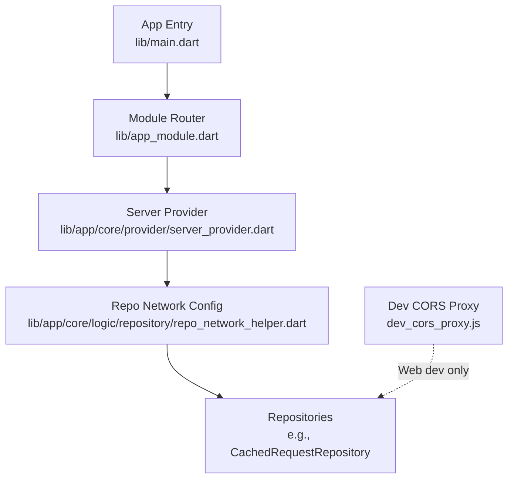
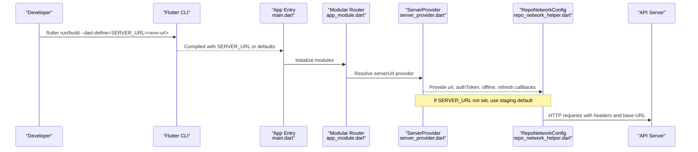
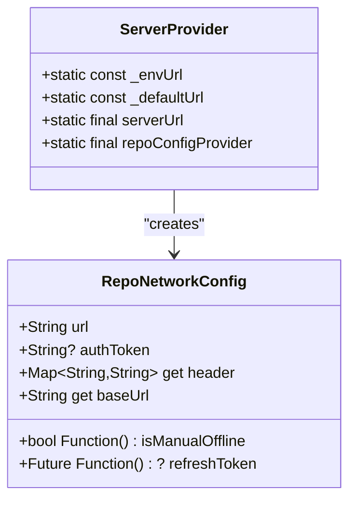
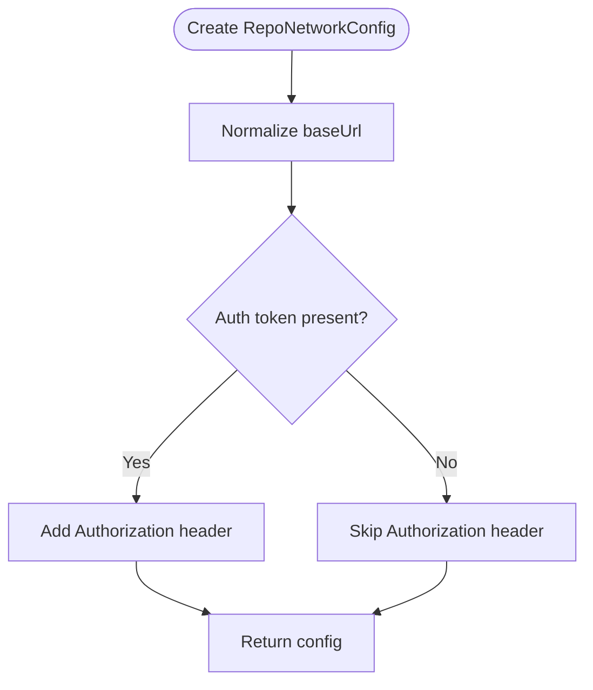
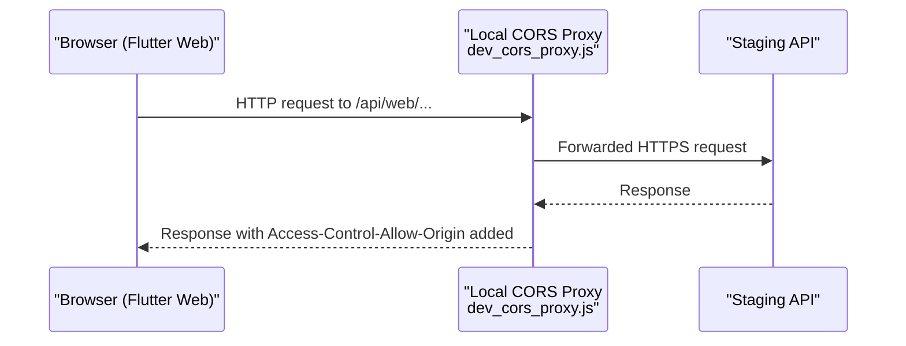

# Environment Management

<cite>
**Referenced Files in This Document**
- [pubspec.yaml](file://pubspec.yaml)
- [main.dart](file://lib/main.dart)
- [app_module.dart](file://lib/app_module.dart)
- [server_provider.dart](file://lib/app/core/provider/server_provider.dart)
- [repo_network_helper.dart](file://lib/app/core/logic/repository/repo_network_helper.dart)
- [cached_request_repository.dart](file://lib/app/core/logic/repository/cached_request_repository.dart)
- [dev_cors_proxy.js](file://dev_cors_proxy.js)
- [flutter_native_integration.env (iOS)](file://ios/Flutter/ephemeral/flutter_native_integration.env)
- [flutter_native_integration.env (macOS)](file://macos/Flutter/ephemeral/flutter_native_integration.env)
- [generated_config.cmake (Windows)](file://windows/flutter/ephemeral/generated_config.cmake)
</cite>

## Table of Contents
1. [Introduction](#introduction)
2. [Project Structure](#project-structure)
3. [Core Components](#core-components)
4. [Architecture Overview](#architecture-overview)
5. [Detailed Component Analysis](#detailed-component-analysis)
6. [Dependency Analysis](#dependency-analysis)
7. [Performance Considerations](#performance-considerations)
8. [Troubleshooting Guide](#troubleshooting-guide)
9. [Conclusion](#conclusion)
10. [Appendices](#appendices)

## Introduction
This document explains how the Leadership Edge Live LMS manages environment configuration across development, staging, and production. It covers:
- How to configure different API endpoints per environment using build-time overrides
- How feature flags and runtime toggles are handled
- How secrets and sensitive values are injected securely
- How the app detects environments and loads configuration at runtime
- Best practices for managing API keys and credentials across environments

The application uses Flutter’s build-time defines and a central provider to select the correct API base URL and network behavior. A local CORS proxy is provided for web development against staging APIs that lack CORS headers.

## Project Structure
Environment-related configuration is primarily centralized in:
- A server provider that reads a build-time define for the API origin and exposes it via Riverpod
- Network helpers that attach authentication headers and manage offline behavior
- A development-only CORS proxy for web debugging
- Platform ephemeral files that reflect build-time settings during native builds

**Diagram sources**
- [main.dart:16-37](file://lib/main.dart#L16-L37)
- [app_module.dart:7-19](file://lib/app_module.dart#L7-L19)
- [server_provider.dart:8-39](file://lib/app/core/provider/server_provider.dart#L8-L39)
- [repo_network_helper.dart:31-76](file://lib/app/core/logic/repository/repo_network_helper.dart#L31-L76)
- [cached_request_repository.dart:9-31](file://lib/app/core/logic/repository/cached_request_repository.dart#L9-L31)
- [dev_cors_proxy.js:1-75](file://dev_cors_proxy.js#L1-L75)

**Section sources**
- [main.dart:16-37](file://lib/main.dart#L16-L37)
- [app_module.dart:7-19](file://lib/app_module.dart#L7-L19)
- [server_provider.dart:8-39](file://lib/app/core/provider/server_provider.dart#L8-L39)
- [repo_network_helper.dart:31-76](file://lib/app/core/logic/repository/repo_network_helper.dart#L31-L76)
- [cached_request_repository.dart:9-31](file://lib/app/core/logic/repository/cached_request_repository.dart#L9-L31)
- [dev_cors_proxy.js:1-75](file://dev_cors_proxy.js#L1-L75)

## Core Components
- ServerProvider: Reads a build-time define for the API origin and provides a default staging endpoint when not overridden. Exposes a Riverpod provider for the resolved URL and a repository network configuration.
- RepoNetworkConfig: Holds the base URL, optional auth token, connection and caching providers, manual offline toggle, and token refresh callback. Builds request headers with Authorization when available.
- Repositories: Use RepoNetworkHelper to perform network calls with consistent headers and base URLs.
- Dev CORS Proxy: A Node script that forwards requests to staging while adding CORS headers for local web development.

Key behaviors:
- Build-time override via --dart-define=SERVER_URL allows switching environments without code changes
- Runtime fallback to a staging URL if no override is present
- Auth token injection into request headers from current auth state
- Offline mode support via a manual toggle read at call time

**Section sources**
- [server_provider.dart:8-39](file://lib/app/core/provider/server_provider.dart#L8-L39)
- [repo_network_helper.dart:31-76](file://lib/app/core/logic/repository/repo_network_helper.dart#L31-L76)
- [cached_request_repository.dart:9-31](file://lib/app/core/logic/repository/cached_request_repository.dart#L9-L31)
- [dev_cors_proxy.js:1-75](file://dev_cors_proxy.js#L1-L75)

## Architecture Overview
The environment configuration flows from build-time defines into a single source of truth used by all network calls.

**Diagram sources**
- [main.dart:16-37](file://lib/main.dart#L16-L37)
- [app_module.dart:7-19](file://lib/app_module.dart#L7-L19)
- [server_provider.dart:8-39](file://lib/app/core/provider/server_provider.dart#L8-L39)
- [repo_network_helper.dart:31-76](file://lib/app/core/logic/repository/repo_network_helper.dart#L31-L76)

## Detailed Component Analysis

### ServerProvider: Centralized API Origin Resolution
- Reads SERVER_URL from build-time environment via String.fromEnvironment
- Falls back to a staging URL when not provided
- Exposes a Riverpod provider for the resolved URL
- Provides a RepoNetworkConfig that wires in auth token, connectivity, caching, offline mode, and token refresh

**Diagram sources**
- [server_provider.dart:8-39](file://lib/app/core/provider/server_provider.dart#L8-L39)
- [repo_network_helper.dart:31-76](file://lib/app/core/logic/repository/repo_network_helper.dart#L31-L76)

**Section sources**
- [server_provider.dart:8-39](file://lib/app/core/provider/server_provider.dart#L8-L39)

### RepoNetworkConfig: Request Headers and Base URL Handling
- Normalizes base URL to ensure trailing slash
- Adds Authorization header when an auth token is present
- Integrates with connectivity and caching providers
- Supports manual offline mode via a callable flag to avoid tearing down providers on toggle

**Diagram sources**
- [repo_network_helper.dart:31-76](file://lib/app/core/logic/repository/repo_network_helper.dart#L31-L76)

**Section sources**
- [repo_network_helper.dart:31-76](file://lib/app/core/logic/repository/repo_network_helper.dart#L31-L76)

### Development CORS Proxy: Web Debugging Aid
- Runs locally to forward requests to staging while injecting CORS headers
- Allows running Flutter web against staging without browser security flags
- Usage involves starting the proxy and pointing the app to localhost via SERVER_URL

**Diagram sources**
- [dev_cors_proxy.js:1-75](file://dev_cors_proxy.js#L1-L75)

**Section sources**
- [dev_cors_proxy.js:1-75](file://dev_cors_proxy.js#L1-L75)

### Platform Build-Time Context
- iOS/macOS ephemeral env files show Flutter build metadata such as version and build number
- Windows generated config includes Dart defines passed through the build pipeline
- These files confirm that build-time variables flow into native tooling but do not directly affect runtime SERVER_URL resolution

**Section sources**
- [flutter_native_integration.env (iOS):1-13](file://ios/Flutter/ephemeral/flutter_native_integration.env#L1-L13)
- [flutter_native_integration.env (macOS):1-12](file://macos/Flutter/ephemeral/flutter_native_integration.env#L1-L12)
- [generated_config.cmake (Windows):1-24](file://windows/flutter/ephemeral/generated_config.cmake#L1-L24)

## Dependency Analysis
Environment configuration dependencies:
- main.dart initializes the app and passes debugMode based on platform build type
- app_module.dart sets up routing; environment-specific behavior is not tied here
- server_provider.dart is the single source of truth for API origin and network configuration
- repo_network_helper.dart consumes the configured URL and injects auth headers
- cached_request_repository.dart demonstrates a concrete consumer wired to the server provider

**Diagram sources**
- [main.dart:16-37](file://lib/main.dart#L16-L37)
- [app_module.dart:7-19](file://lib/app_module.dart#L7-L19)
- [server_provider.dart:8-39](file://lib/app/core/provider/server_provider.dart#L8-L39)
- [repo_network_helper.dart:31-76](file://lib/app/core/logic/repository/repo_network_helper.dart#L31-L76)
- [cached_request_repository.dart:9-31](file://lib/app/core/logic/repository/cached_request_repository.dart#L9-L31)

**Section sources**
- [main.dart:16-37](file://lib/main.dart#L16-L37)
- [app_module.dart:7-19](file://lib/app_module.dart#L7-L19)
- [server_provider.dart:8-39](file://lib/app/core/provider/server_provider.dart#L8-L39)
- [repo_network_helper.dart:31-76](file://lib/app/core/logic/repository/repo_network_helper.dart#L31-L76)
- [cached_request_repository.dart:9-31](file://lib/app/core/logic/repository/cached_request_repository.dart#L9-L31)

## Performance Considerations
- Using a single provider for the API origin avoids repeated string lookups and ensures consistent base URLs
- Reading manual offline mode via a closure prevents unnecessary provider rebuilds when toggling offline mode
- Keeping auth token retrieval dynamic ensures headers always reflect the latest session state without recreating repositories

[No sources needed since this section provides general guidance]

## Troubleshooting Guide
Common issues and resolutions:
- Web requests blocked by CORS when calling staging:
  - Start the local CORS proxy and set SERVER_URL to point at localhost during development
- Wrong API endpoint selected:
  - Ensure SERVER_URL is passed via --dart-define at build/run time
  - Verify that no override is accidentally omitted in CI or release builds
- Authentication failures:
  - Confirm that the auth token is present in the current auth state and being attached to headers
- Unexpected default endpoint usage:
  - Check that SERVER_URL is empty or not set; the app falls back to staging by design

**Section sources**
- [dev_cors_proxy.js:1-75](file://dev_cors_proxy.js#L1-L75)
- [server_provider.dart:8-39](file://lib/app/core/provider/server_provider.dart#L8-L39)
- [repo_network_helper.dart:31-76](file://lib/app/core/logic/repository/repo_network_helper.dart#L31-L76)

## Conclusion
The LMS uses a clean, centralized approach to environment configuration:
- Build-time defines control the API origin, enabling distinct environments without code changes
- A default staging URL ensures safe operation when no override is provided
- Network helpers consistently apply authentication and offline behavior
- A development CORS proxy simplifies web debugging against staging

Adopting these patterns keeps environment management simple, secure, and maintainable across platforms.

[No sources needed since this section summarizes without analyzing specific files]

## Appendices

### Environment-Specific Setup Examples
- Development (web):
  - Run the local CORS proxy
  - Launch the app with SERVER_URL pointing to the proxy
- Staging:
  - No override required; the app defaults to staging
- Production:
  - Pass SERVER_URL via --dart-define to target the production API

**Section sources**
- [dev_cors_proxy.js:1-75](file://dev_cors_proxy.js#L1-L75)
- [server_provider.dart:8-39](file://lib/app/core/provider/server_provider.dart#L8-L39)

### Secrets and Sensitive Data Best Practices
- Do not hardcode secrets in source code
- Inject secrets via build-time defines or platform secret stores at build time
- For mobile apps, prefer platform-native secure storage mechanisms for tokens and keys
- Avoid logging sensitive values; rely on structured logs with redaction where possible

[No sources needed since this section provides general guidance]

### Feature Flags and Runtime Toggles
- The app supports a manual offline mode toggle that affects request behavior at call time
- Additional feature flags can be introduced similarly by reading runtime state rather than freezing values at startup

**Section sources**
- [repo_network_helper.dart:31-76](file://lib/app/core/logic/repository/repo_network_helper.dart#L31-L76)