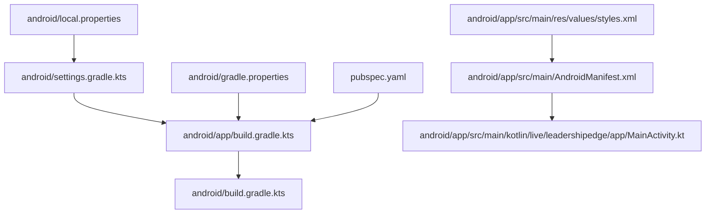
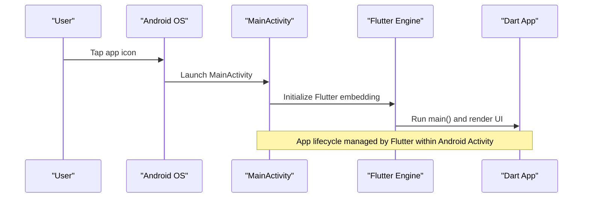
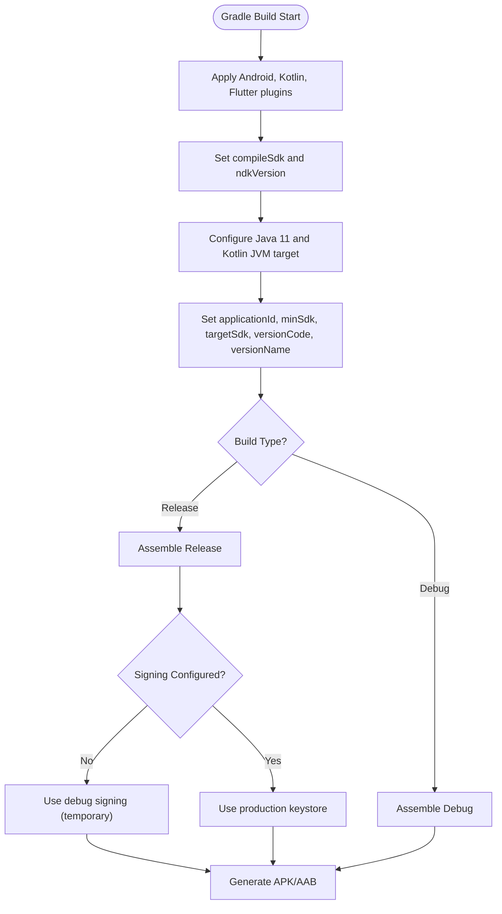
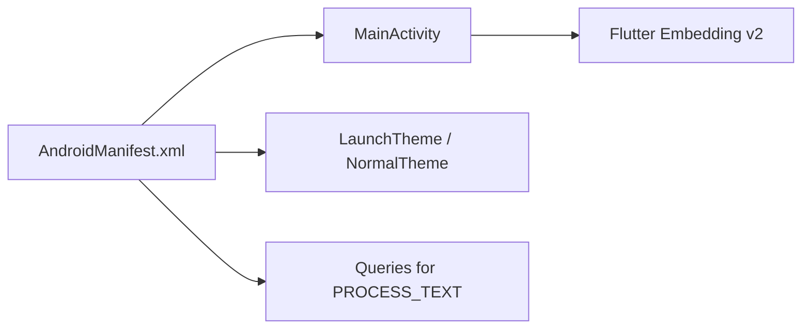
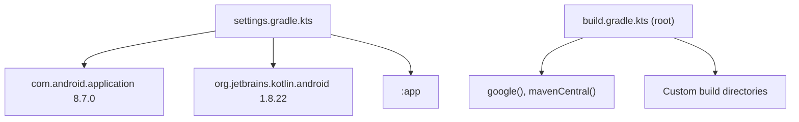

# Android Deployment

<cite>
**Referenced Files in This Document**
- [build.gradle.kts](file://android/app/build.gradle.kts)
- [build.gradle.kts (root)](file://android/build.gradle.kts)
- [settings.gradle.kts](file://android/settings.gradle.kts)
- [gradle.properties](file://android/gradle.properties)
- [local.properties](file://android/local.properties)
- [AndroidManifest.xml](file://android/app/src/main/AndroidManifest.xml)
- [MainActivity.kt](file://android/app/src/main/kotlin/live/leadershipedge/app/MainActivity.kt)
- [styles.xml](file://android/app/src/main/res/values/styles.xml)
- [pubspec.yaml](file://pubspec.yaml)
</cite>

## Table of Contents
1. [Introduction](#introduction)
2. [Project Structure](#project-structure)
3. [Core Components](#core-components)
4. [Architecture Overview](#architecture-overview)
5. [Detailed Component Analysis](#detailed-component-analysis)
6. [Dependency Analysis](#dependency-analysis)
7. [Performance Considerations](#performance-considerations)
8. [Troubleshooting Guide](#troubleshooting-guide)
9. [Conclusion](#conclusion)
10. [Appendices](#appendices)

## Introduction
This document provides comprehensive Android deployment guidance for the Leadership Edge Live LMS Flutter application. It covers building APK and App Bundle outputs using Gradle, signing configurations for release builds, Google Play Store submission workflow, platform-specific Android configuration, troubleshooting common build issues, performance optimization techniques, and post-deployment monitoring strategies.

## Project Structure
The Android module is a standard Flutter Android project with Gradle-based builds:
- Application-level Gradle script defines compile options, default config, and build types.
- Root Gradle script centralizes repositories and custom build directory layout.
- Settings script configures plugin management and includes the app module.
- Android manifest declares the main activity, theme metadata, and queries required by the Flutter engine.
- Kotlin entry point extends FlutterActivity to host the Flutter UI.
- Styles define launch and normal themes used during startup.

**Diagram sources**
- [build.gradle.kts:1-45](file://android/app/build.gradle.kts#L1-L45)
- [build.gradle.kts (root):1-22](file://android/build.gradle.kts#L1-L22)
- [settings.gradle.kts:1-26](file://android/settings.gradle.kts#L1-L26)
- [AndroidManifest.xml:1-46](file://android/app/src/main/AndroidManifest.xml#L1-L46)
- [MainActivity.kt:1-6](file://android/app/src/main/kotlin/live/leadershipedge/app/MainActivity.kt#L1-L6)
- [styles.xml:1-19](file://android/app/src/main/res/values/styles.xml#L1-L19)
- [gradle.properties:1-4](file://android/gradle.properties#L1-L4)
- [local.properties:1-1](file://android/local.properties#L1-L1)
- [pubspec.yaml:1-171](file://pubspec.yaml#L1-L171)

**Section sources**
- [build.gradle.kts:1-45](file://android/app/build.gradle.kts#L1-L45)
- [build.gradle.kts (root):1-22](file://android/build.gradle.kts#L1-L22)
- [settings.gradle.kts:1-26](file://android/settings.gradle.kts#L1-L26)
- [AndroidManifest.xml:1-46](file://android/app/src/main/AndroidManifest.xml#L1-L46)
- [MainActivity.kt:1-6](file://android/app/src/main/kotlin/live/leadershipedge/app/MainActivity.kt#L1-L6)
- [styles.xml:1-19](file://android/app/src/main/res/values/styles.xml#L1-L19)
- [gradle.properties:1-4](file://android/gradle.properties#L1-L4)
- [local.properties:1-1](file://android/local.properties#L1-L1)
- [pubspec.yaml:1-171](file://pubspec.yaml#L1-L171)

## Core Components
- Build configuration: Defines namespace, SDK versions, Java/Kotlin targets, defaultConfig values, and buildTypes for release.
- Versioning: versionCode and versionName are sourced from Flutter’s pubspec metadata.
- Signing: Release build currently uses debug signing; must be replaced with a proper keystore for production.
- Platform integration: Manifest declares MainActivity as exported launcher, sets embedding metadata, and includes queries for text processing.
- Entry point: MainActivity extends FlutterActivity to run the Flutter engine.
- Themes: LaunchTheme and NormalTheme control initial window appearance and background.

**Section sources**
- [build.gradle.kts:8-40](file://android/app/build.gradle.kts#L8-L40)
- [pubspec.yaml:7-19](file://pubspec.yaml#L7-L19)
- [AndroidManifest.xml:1-46](file://android/app/src/main/AndroidManifest.xml#L1-L46)
- [MainActivity.kt:1-6](file://android/app/src/main/kotlin/live/leadershipedge/app/MainActivity.kt#L1-L6)
- [styles.xml:1-19](file://android/app/src/main/res/values/styles.xml#L1-L19)

## Architecture Overview
The Android layer hosts the Flutter engine via a single Activity and delegates rendering to Dart code. Gradle orchestrates compilation, packaging, and signing. The manifest wires the Activity as the app entry point and declares necessary metadata and queries.

**Diagram sources**
- [AndroidManifest.xml:6-27](file://android/app/src/main/AndroidManifest.xml#L6-L27)
- [MainActivity.kt:1-6](file://android/app/src/main/kotlin/live/leadershipedge/app/MainActivity.kt#L1-L6)

## Detailed Component Analysis

### Gradle Build Configuration
- Plugins: Android application, Kotlin Android, and Flutter Gradle plugin are applied in order.
- Compile options: Java 11 compatibility and JVM target set for both Java and Kotlin.
- Default config: Namespace, minSdk/targetSdk, and versionCode/versionName derived from Flutter tooling.
- Build types: Release type exists but currently references debug signing; must be updated for production.

**Diagram sources**
- [build.gradle.kts:1-45](file://android/app/build.gradle.kts#L1-L45)

**Section sources**
- [build.gradle.kts:1-45](file://android/app/build.gradle.kts#L1-L45)

### Android Manifest Configuration
- Application label and icon are defined; application name uses a placeholder resolved at build time.
- MainActivity is declared as exported with singleTop launch mode and handles configuration changes.
- Theme metadata points to LaunchTheme and NormalTheme resources.
- Intent filter marks MainActivity as the LAUNCHER entry point.
- Embedding metadata indicates Flutter V2 embedding.
- Queries section allows text processing intents required by the Flutter engine.

**Diagram sources**
- [AndroidManifest.xml:1-46](file://android/app/src/main/AndroidManifest.xml#L1-L46)
- [styles.xml:1-19](file://android/app/src/main/res/values/styles.xml#L1-L19)

**Section sources**
- [AndroidManifest.xml:1-46](file://android/app/src/main/AndroidManifest.xml#L1-L46)
- [styles.xml:1-19](file://android/app/src/main/res/values/styles.xml#L1-L19)

### Kotlin Entry Point
- MainActivity extends FlutterActivity, enabling Flutter UI hosting on Android.
- No additional overrides are present; Flutter manages lifecycle and rendering.

**Section sources**
- [MainActivity.kt:1-6](file://android/app/src/main/kotlin/live/leadershipedge/app/MainActivity.kt#L1-L6)

### Version Management
- Flutter package version and build number are defined in pubspec.yaml.
- Android defaultConfig maps these to versionName and versionCode respectively.
- Ensure increments follow semantic versioning and maintain monotonic versionCode for updates.

**Section sources**
- [pubspec.yaml:7-19](file://pubspec.yaml#L7-L19)
- [build.gradle.kts:22-31](file://android/app/build.gradle.kts#L22-L31)

## Dependency Analysis
- Repository sources: Google and Maven Central are configured at root level.
- Plugin management: Flutter plugin loader, Android application plugin, and Kotlin Android plugin versions are pinned in settings.
- Evaluation: Subprojects evaluate the app module to ensure consistent dependency resolution.
- Build directory: Custom root and subproject build directories consolidate artifacts.

**Diagram sources**
- [settings.gradle.kts:1-26](file://android/settings.gradle.kts#L1-L26)
- [build.gradle.kts (root):1-22](file://android/build.gradle.kts#L1-L22)

**Section sources**
- [settings.gradle.kts:1-26](file://android/settings.gradle.kts#L1-L26)
- [build.gradle.kts (root):1-22](file://android/build.gradle.kts#L1-L22)

## Performance Considerations
- Gradle memory: Increase JVM heap and metaspace if builds fail due to out-of-memory errors. Current settings allocate significant memory to improve stability.
- Build caching: Leverage Gradle daemon and local cache; consider enabling build cache for faster incremental builds.
- Artifact size: Prefer App Bundle for distribution to reduce download size; enable resource shrinking and obfuscation in release builds once signed.
- ProGuard/R8: Enable minification and obfuscation in release builds to reduce APK/AAB size and improve security.
- Asset optimization: Compress images and limit asset sizes; use appropriate densities and formats.

**Section sources**
- [gradle.properties:1-4](file://android/gradle.properties#L1-L4)

## Troubleshooting Guide
Common issues and resolutions:
- OutOfMemoryError during build: Adjust Gradle JVM args in gradle.properties to increase heap and metaspace.
- Missing flutter.sdk: Ensure local.properties contains a valid path to the Flutter SDK.
- Signing failures: Replace debug signing with a production keystore for release builds; store credentials securely and avoid committing secrets.
- Plugin or repository resolution: Verify internet access and that google() and mavenCentral() are reachable; update plugin versions if needed.
- Manifest conflicts: Ensure only one launcher activity is declared and intent filters are correct.

**Section sources**
- [gradle.properties:1-4](file://android/gradle.properties#L1-L4)
- [local.properties:1-1](file://android/local.properties#L1-L1)
- [build.gradle.kts:33-39](file://android/app/build.gradle.kts#L33-L39)
- [AndroidManifest.xml:6-27](file://android/app/src/main/AndroidManifest.xml#L6-L27)

## Conclusion
The Android module is configured for Flutter-based builds with clear separation between development and release concerns. To prepare for production:
- Configure a secure keystore and update the release signing configuration.
- Enable minification and obfuscation for release builds.
- Generate an App Bundle for Google Play Store distribution.
- Validate manifest permissions and queries, and ensure versioning aligns with pubspec.
- Monitor build performance and artifact size, and adopt best practices for ongoing maintenance.

## Appendices

### Build Commands Reference
- Clean build:
  - Remove previous artifacts to ensure a clean state.
- Assemble APK (debug/release):
  - Generate APK for testing or sideloading.
- Assemble App Bundle (release):
  - Generate AAB for Google Play Store upload.

Note: Use Flutter tooling or Gradle tasks as appropriate for your environment.

**Section sources**
- [build.gradle.kts:1-45](file://android/app/build.gradle.kts#L1-L45)
- [build.gradle.kts (root):19-22](file://android/build.gradle.kts#L19-L22)

### Signing Setup Checklist
- Create a keystore file and keep it secure.
- Define signing config in Gradle and reference it in release buildType.
- Store passwords in environment variables or secure credential stores.
- Test signing with a local install before uploading to Play Store.

**Section sources**
- [build.gradle.kts:33-39](file://android/app/build.gradle.kts#L33-L39)

### Google Play Store Submission Workflow
- Prepare store listing: title, description, screenshots, and category.
- Generate App Bundle (release) and verify signatures.
- Upload bundle to Google Play Console and configure rollout strategy.
- Manage versions: increment versionCode and versionName per release policy.

**Section sources**
- [pubspec.yaml:7-19](file://pubspec.yaml#L7-L19)
- [build.gradle.kts:22-31](file://android/app/build.gradle.kts#L22-L31)