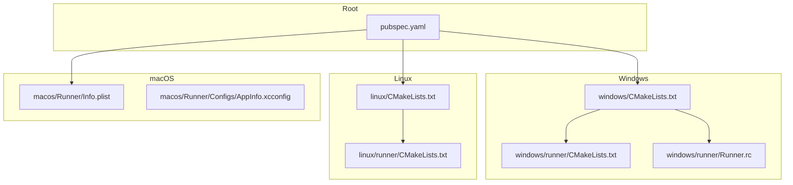
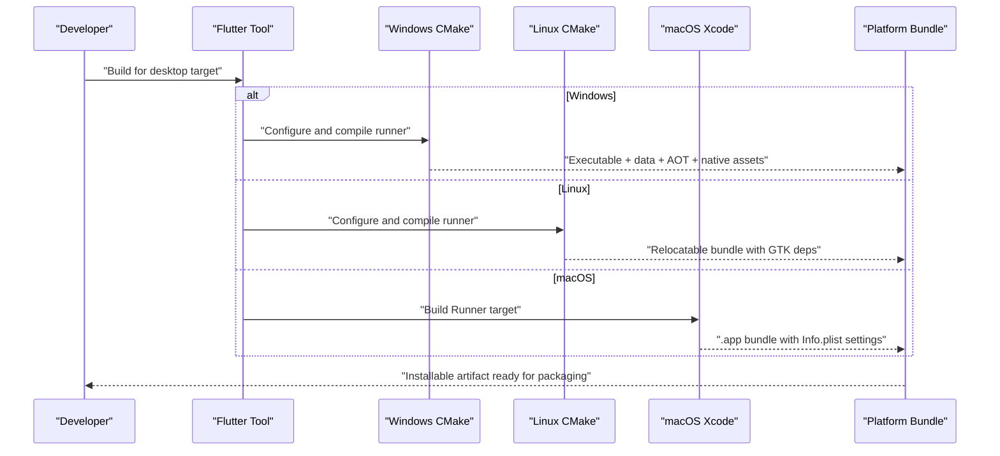
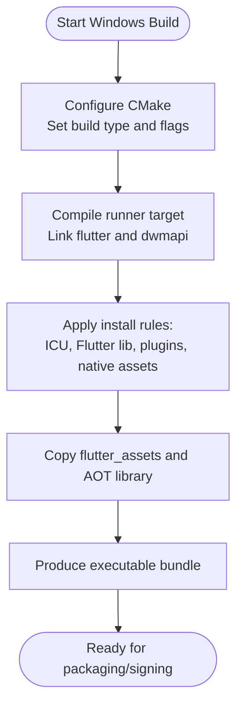
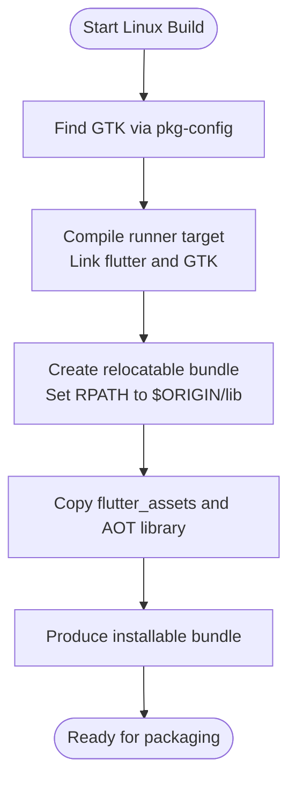
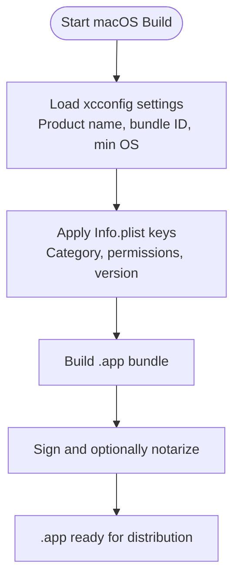
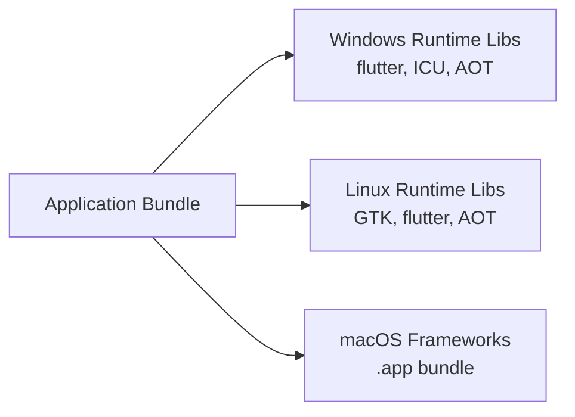

# Desktop Deployment

<cite>
**Referenced Files in This Document**
- [pubspec.yaml](file://pubspec.yaml)
- [windows/CMakeLists.txt](file://windows/CMakeLists.txt)
- [windows/runner/CMakeLists.txt](file://windows/runner/CMakeLists.txt)
- [windows/runner/Runner.rc](file://windows/runner/Runner.rc)
- [linux/CMakeLists.txt](file://linux/CMakeLists.txt)
- [linux/runner/CMakeLists.txt](file://linux/runner/CMakeLists.txt)
- [macos/Runner/Info.plist](file://macos/Runner/Info.plist)
- [macos/Runner/Configs/AppInfo.xcconfig](file://macos/Runner/Configs/AppInfo.xcconfig)
</cite>

## Table of Contents
1. Introduction
2. Project Structure
3. Core Components
4. Architecture Overview
5. Detailed Component Analysis
6. Dependency Analysis
7. Performance Considerations
8. Troubleshooting Guide
9. Conclusion

## Introduction
This document provides desktop deployment guidance for the Leadership Edge Live LMS across Windows, macOS, and Linux. It explains how the project is structured for native builds using CMake (Windows/Linux) and Xcode configuration (macOS), how to produce installable artifacts, and how to package and distribute each platform. It also covers system requirements, compatibility notes, troubleshooting, and performance tuning strategies tailored to each operating system.

## Project Structure
The repository follows a standard Flutter multi-platform layout with dedicated directories for each desktop target:
- windows: CMake-based build producing an executable bundle with data and AOT assets
- linux: CMake-based build producing a relocatable bundle with GTK dependencies
- macos: Xcode workspace and Runner target configured via xcconfig and Info.plist
- Root pubspec.yaml defines versioning and assets used by all platforms

**Diagram sources**
- [pubspec.yaml:1-19](file://pubspec.yaml#L1-L19)
- [windows/CMakeLists.txt:1-109](file://windows/CMakeLists.txt#L1-L109)
- [windows/runner/CMakeLists.txt:1-41](file://windows/runner/CMakeLists.txt#L1-L41)
- [windows/runner/Runner.rc:1-122](file://windows/runner/Runner.rc#L1-L122)
- [linux/CMakeLists.txt:1-129](file://linux/CMakeLists.txt#L1-L129)
- [linux/runner/CMakeLists.txt:1-27](file://linux/runner/CMakeLists.txt#L1-L27)
- [macos/Runner/Info.plist:1-37](file://macos/Runner/Info.plist#L1-L37)
- [macos/Runner/Configs/AppInfo.xcconfig:1-15](file://macos/Runner/Configs/AppInfo.xcconfig#L1-L15)

**Section sources**
- [pubspec.yaml:1-19](file://pubspec.yaml#L1-L19)
- [windows/CMakeLists.txt:1-109](file://windows/CMakeLists.txt#L1-L109)
- [linux/CMakeLists.txt:1-129](file://linux/CMakeLists.txt#L1-L129)
- [macos/Runner/Info.plist:1-37](file://macos/Runner/Info.plist#L1-L37)
- [macos/Runner/Configs/AppInfo.xcconfig:1-15](file://macos/Runner/Configs/AppInfo.xcconfig#L1-L15)

## Core Components
- Versioning and assets are defined centrally in the root package manifest, which drives metadata and bundled resources on all desktop targets.
- Windows uses CMake to configure compilation flags, link libraries, and install rules that assemble a runnable bundle next to the executable.
- Linux uses CMake with GTK as the UI toolkit and produces a relocatable bundle with runtime paths set for shared libraries.
- macOS uses Xcode workspace configuration and Info.plist to define bundle identity, category, minimum OS version, and permissions.

Key responsibilities:
- Build configuration and toolchain selection per platform
- Asset bundling and AOT library inclusion for optimized runs
- Installation steps that ensure required runtime files are colocated with the binary

**Section sources**
- [pubspec.yaml:1-19](file://pubspec.yaml#L1-L19)
- [windows/CMakeLists.txt:14-109](file://windows/CMakeLists.txt#L14-L109)
- [linux/CMakeLists.txt:29-129](file://linux/CMakeLists.txt#L29-L129)
- [macos/Runner/Info.plist:5-35](file://macos/Runner/Info.plist#L5-L35)
- [macos/Runner/Configs/AppInfo.xcconfig:7-15](file://macos/Runner/Configs/AppInfo.xcconfig#L7-L15)

## Architecture Overview
The desktop build pipeline integrates Dart/Flutter code with native runners and platform-specific packaging:

**Diagram sources**
- [windows/CMakeLists.txt:48-109](file://windows/CMakeLists.txt#L48-L109)
- [linux/CMakeLists.txt:49-129](file://linux/CMakeLists.txt#L49-L129)
- [macos/Runner/Info.plist:5-35](file://macos/Runner/Info.plist#L5-L35)
- [macos/Runner/Configs/AppInfo.xcconfig:7-15](file://macos/Runner/Configs/AppInfo.xcconfig#L7-L15)

## Detailed Component Analysis

### Windows Build and Packaging
- CMake configures the executable name, build types (Debug/Profile/Release), Unicode definitions, and standard compiler options.
- The runner target links against the Flutter app wrapper and DWM API, and includes generated plugin registration and resource files.
- Installation rules copy ICU data, Flutter library, plugin libraries, native assets, and flutter_assets into a data directory next to the executable. AOT library is included for non-Debug builds.
- Resource script embeds version info and application icon.

**Diagram sources**
- [windows/CMakeLists.txt:14-109](file://windows/CMakeLists.txt#L14-L109)
- [windows/runner/CMakeLists.txt:9-41](file://windows/runner/CMakeLists.txt#L9-L41)
- [windows/runner/Runner.rc:48-108](file://windows/runner/Runner.rc#L48-L108)

Packaging and distribution notes:
- Executable creation: The CMake install step places the executable alongside required runtime files; this forms the distributable folder.
- Installer generation: Use a Windows installer tool (for example, WiX or Inno Setup) to create a setup package from the installed bundle. Configure shortcuts, uninstaller, and file associations as needed.
- Digital signing: Sign the executable and any DLLs with a valid code-signing certificate. For Microsoft Store distribution, use MSIX packaging and sign with a store-appropriate certificate. Ensure version metadata aligns with the embedded version info.

System requirements and compatibility:
- Requires a supported Windows version compatible with the Flutter engine and linked libraries.
- Ensure Visual Studio build tools and CMake are available during CI builds.

Performance considerations:
- Profile and Release builds include AOT optimization; prefer these for distribution.
- Keep flutter_assets minimal and avoid large unneeded media to reduce startup time.

**Section sources**
- [windows/CMakeLists.txt:14-109](file://windows/CMakeLists.txt#L14-L109)
- [windows/runner/CMakeLists.txt:9-41](file://windows/runner/CMakeLists.txt#L9-L41)
- [windows/runner/Runner.rc:48-108](file://windows/runner/Runner.rc#L48-L108)

### Linux Build and Packaging
- CMake sets the application ID, enforces modern policies, and configures RPATH so the app can find bundled libraries at runtime.
- GTK is discovered via pkg-config and linked into the runner target.
- Installation produces a relocatable bundle under a configurable prefix, copying ICU data, Flutter library, plugin libraries, native assets, and flutter_assets. AOT library is included for non-Debug builds.

**Diagram sources**
- [linux/CMakeLists.txt:16-129](file://linux/CMakeLists.txt#L16-L129)
- [linux/runner/CMakeLists.txt:9-27](file://linux/runner/CMakeLists.txt#L9-L27)

Packaging and distribution notes:
- Executable creation: The install step creates a self-contained bundle suitable for distribution.
- Package generation: Create a .deb or .rpm using your distro’s packaging tools (e.g., dpkg/debian control or rpmbuild). Include desktop integration files (desktop entry, icons) and declare GTK dependencies.
- AppImage or Flatpak: Alternatively, package as AppImage or Flatpak to simplify distribution across distributions without requiring system packages.

System requirements and compatibility:
- Requires GTK 3 and related system libraries present on the target system unless bundled.
- Ensure the RPATH resolves correctly when running outside the install prefix.

Performance considerations:
- Use Profile/Release builds to enable optimizations and include the AOT library.
- Minimize asset size and consider lazy-loading heavy content to improve startup.

**Section sources**
- [linux/CMakeLists.txt:16-129](file://linux/CMakeLists.txt#L16-L129)
- [linux/runner/CMakeLists.txt:9-27](file://linux/runner/CMakeLists.txt#L9-L27)

### macOS Build and Packaging
- The Xcode workspace references the Runner target and Pods. Application metadata is configured via xcconfig and Info.plist, including product name, bundle identifier, copyright, and minimum system version.
- Info.plist defines bundle type, category, and permission descriptions (e.g., photo library access).

**Diagram sources**
- [macos/Runner/Configs/AppInfo.xcconfig:7-15](file://macos/Runner/Configs/AppInfo.xcconfig#L7-L15)
- [macos/Runner/Info.plist:5-35](file://macos/Runner/Info.plist#L5-L35)

Packaging and distribution notes:
- Executable creation: The Xcode build produces a .app bundle containing the executable and resources.
- Installer generation: Use Product Archive to create a .dmg installer or package as a standalone .app for direct download.
- Digital signing: Sign the app and its frameworks with a developer certificate. Notarization is recommended for distribution outside the Mac App Store.
- Mac App Store: Submit a signed and notarized archive via Transporter or Xcode. Ensure entitlements and privacy manifests meet store requirements.

System requirements and compatibility:
- Minimum system version is controlled by the plist setting; ensure it matches your deployment target.
- Verify that required frameworks and permissions are declared.

Performance considerations:
- Build with Release configuration to enable optimizations and include AOT output where applicable.
- Optimize images and assets to reduce launch time and memory usage.

**Section sources**
- [macos/Runner/Configs/AppInfo.xcconfig:7-15](file://macos/Runner/Configs/AppInfo.xcconfig#L7-L15)
- [macos/Runner/Info.plist:5-35](file://macos/Runner/Info.plist#L5-L35)

## Dependency Analysis
The desktop targets depend on Flutter-managed components and platform libraries:
- Windows: Links flutter_wrapper_app and dwmapi; installs ICU data and AOT library for optimized runs.
- Linux: Links GTK via pkg-config; sets RPATH for bundled libs; installs AOT library for non-Debug builds.
- macOS: Uses Xcode workspace and CocoaPods; Info.plist controls runtime behavior and permissions.

**Diagram sources**
- [windows/CMakeLists.txt:75-109](file://windows/CMakeLists.txt#L75-L109)
- [linux/CMakeLists.txt:94-129](file://linux/CMakeLists.txt#L94-L129)
- [macos/Runner/Info.plist:5-35](file://macos/Runner/Info.plist#L5-L35)

**Section sources**
- [windows/CMakeLists.txt:75-109](file://windows/CMakeLists.txt#L75-L109)
- [linux/CMakeLists.txt:94-129](file://linux/CMakeLists.txt#L94-L129)
- [macos/Runner/Info.plist:5-35](file://macos/Runner/Info.plist#L5-L35)

## Performance Considerations
- Prefer Profile or Release builds for distribution to include AOT optimizations and reduced overhead.
- Keep flutter_assets lean; compress images and remove unused translations or media.
- On Linux, verify RPATH resolution and ensure GTK dependencies are available or bundled appropriately.
- On Windows, ensure all required DLLs are present next to the executable and that the AOT library is included.
- On macOS, confirm minimum OS version and entitlements are correct; optimize launch-time workloads.

[No sources needed since this section provides general guidance]

## Troubleshooting Guide
Common issues and resolutions:
- Missing runtime libraries on Linux:
  - Symptom: Application fails to start due to unresolved GTK symbols.
  - Resolution: Install required GTK 3 packages or bundle them and ensure RPATH points to the lib directory.
- Stale assets after rebuilds:
  - Symptom: Old assets appear in the bundle.
  - Resolution: The install steps explicitly remove and re-copy flutter_assets; ensure you run the full install process rather than running the intermediate binary directly.
- macOS permission prompts not appearing:
  - Symptom: Access to photo library is denied.
  - Resolution: Confirm Info.plist contains the appropriate usage description and that the app is signed/notarized if distributed.
- Windows version metadata mismatch:
  - Symptom: File properties show incorrect version.
  - Resolution: Align Flutter build version with resource script version fields and ensure the build injects version macros.

**Section sources**
- [linux/CMakeLists.txt:16-18](file://linux/CMakeLists.txt#L16-L18)
- [linux/CMakeLists.txt:115-122](file://linux/CMakeLists.txt#L115-L122)
- [windows/CMakeLists.txt:96-103](file://windows/CMakeLists.txt#L96-L103)
- [macos/Runner/Info.plist:31-35](file://macos/Runner/Info.plist#L31-L35)
- [windows/runner/Runner.rc:63-100](file://windows/runner/Runner.rc#L63-L100)

## Conclusion
The repository provides a solid foundation for building and distributing the Leadership Edge Live LMS on Windows, macOS, and Linux. CMake configurations handle Windows and Linux builds with clear installation rules and AOT inclusion, while macOS leverages Xcode and Info.plist for bundle identity and permissions. By following the packaging and distribution steps outlined here—creating executables, generating installers, and applying digital signatures—you can deliver reliable desktop applications across all three platforms. Adopt the performance and troubleshooting recommendations to ensure smooth user experiences and maintainable release pipelines.

[No sources needed since this section summarizes without analyzing specific files]