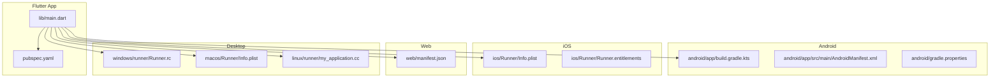
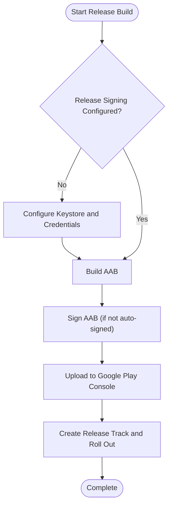
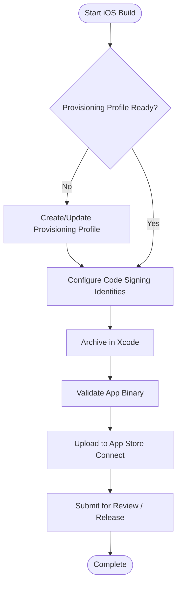
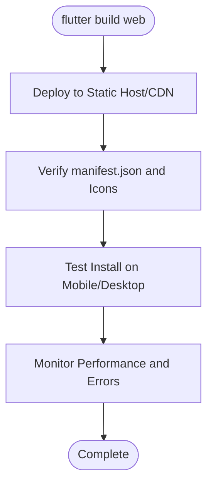
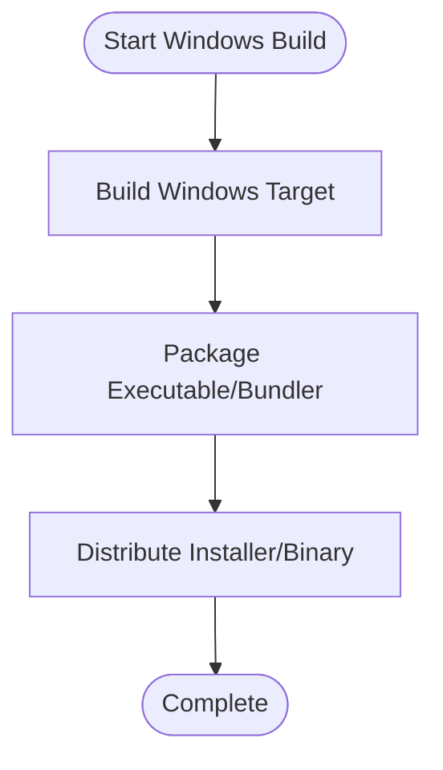
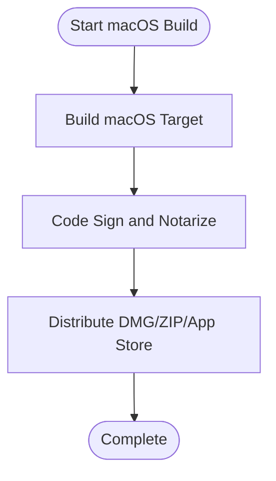
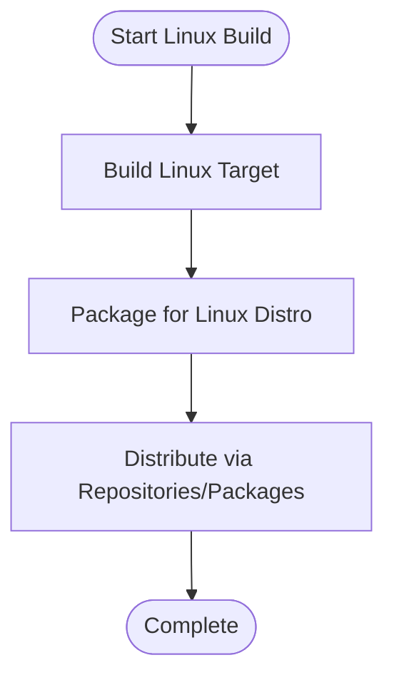
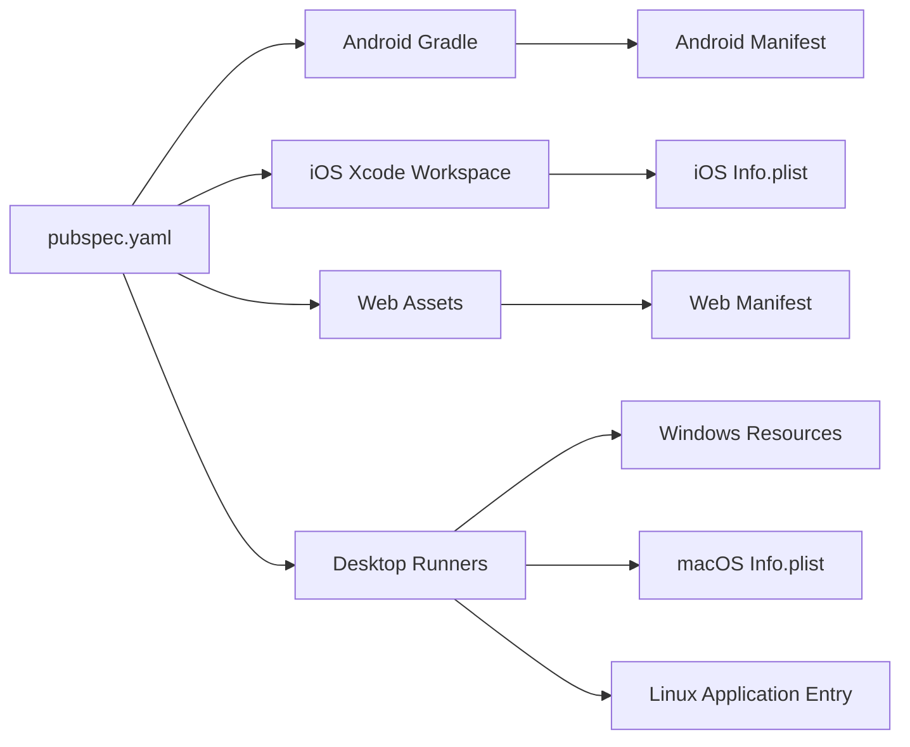

# Platform Deployment

<cite>
**Referenced Files in This Document**
- [pubspec.yaml](file://pubspec.yaml)
- [android/app/build.gradle.kts](file://android/app/build.gradle.kts)
- [android/app/src/main/AndroidManifest.xml](file://android/app/src/main/AndroidManifest.xml)
- [android/gradle.properties](file://android/gradle.properties)
- [ios/Runner/Info.plist](file://ios/Runner/Info.plist)
- [ios/Runner/Runner.entitlements](file://ios/Runner/Runner.entitlements)
- [web/manifest.json](file://web/manifest.json)
- [macos/Runner/Info.plist](file://macos/Runner/Info.plist)
- [linux/runner/my_application.cc](file://linux/runner/my_application.cc)
- [windows/runner/Runner.rc](file://windows/runner/Runner.rc)
</cite>

## Table of Contents
1. Introduction
2. Project Structure
3. Core Components
4. Architecture Overview
5. Detailed Component Analysis
6. Dependency Analysis
7. Performance Considerations
8. Troubleshooting Guide
9. Conclusion

## Introduction
This document provides a complete deployment guide for Leadership Edge Live LMS across Android, iOS, Web, and Desktop (Windows, macOS, Linux). It covers build outputs (APK/AAB, IPA), signing and provisioning, store submission workflows, static hosting and PWA setup, desktop packaging, platform-specific optimizations, performance tuning, and post-deployment monitoring.

## Project Structure
The project is a Flutter application with multi-platform targets:
- Android: Gradle-based app module with manifest and build types
- iOS: Xcode workspace with Info.plist and entitlements
- Web: Static assets including manifest for PWA
- Desktop: Native runners for Windows, macOS, and Linux



**Diagram sources**
- [pubspec.yaml:1-171](file://pubspec.yaml#L1-L171)
- [android/app/build.gradle.kts:1-45](file://android/app/build.gradle.kts#L1-L45)
- [android/app/src/main/AndroidManifest.xml:1-46](file://android/app/src/main/AndroidManifest.xml#L1-L46)
- [android/gradle.properties:1-4](file://android/gradle.properties#L1-L4)
- [ios/Runner/Info.plist:1-78](file://ios/Runner/Info.plist#L1-L78)
- [ios/Runner/Runner.entitlements:1-7](file://ios/Runner/Runner.entitlements#L1-L7)
- [web/manifest.json:1-35](file://web/manifest.json#L1-L35)
- [windows/runner/Runner.rc:1-122](file://windows/runner/Runner.rc#L1-L122)
- [macos/Runner/Info.plist:1-37](file://macos/Runner/Info.plist#L1-L37)
- [linux/runner/my_application.cc:1-131](file://linux/runner/my_application.cc#L1-L131)

**Section sources**
- [pubspec.yaml:1-171](file://pubspec.yaml#L1-L171)

## Core Components
- Versioning and metadata are centrally defined in the package manifest and propagated to each platform target.
- Android build configuration defines compile options, SDK versions, and release signing placeholder.
- iOS configuration includes display name, bundle identifiers, orientation support, and privacy permissions.
- Web manifest configures PWA behavior and icons.
- Desktop platforms include native metadata and entry points for packaging and distribution.

Key references:
- Package version and environment constraints
- Android compile/target SDK and release build type
- iOS Info keys for display name and capabilities
- Web manifest fields for PWA
- Desktop metadata and runtime entry points

**Section sources**
- [pubspec.yaml:7-22](file://pubspec.yaml#L7-L22)
- [android/app/build.gradle.kts:8-39](file://android/app/build.gradle.kts#L8-L39)
- [ios/Runner/Info.plist:7-33](file://ios/Runner/Info.plist#L7-L33)
- [web/manifest.json:1-35](file://web/manifest.json#L1-L35)
- [windows/runner/Runner.rc:63-106](file://windows/runner/Runner.rc#L63-L106)
- [macos/Runner/Info.plist:5-34](file://macos/Runner/Info.plist#L5-L34)
- [linux/runner/my_application.cc:17-63](file://linux/runner/my_application.cc#L17-L63)

## Architecture Overview
The deployment pipeline builds a single Flutter source tree into multiple platform artifacts. Each platform uses its native toolchain to produce distributable packages and apply signing/provisioning as required by stores or OS policies.

```mermaid
sequenceDiagram
participant Dev as "Developer"
participant CLI as "Flutter CLI"
participant And as "Android Gradle"
participant IOS as "Xcode Build"
participant WEB as "Web Assets"
participant DESK as "Desktop Bundles"
Dev->>CLI : flutter build <target> --release
alt Android
CLI->>And : assembleRelease / bundleRelease
And-->>Dev : APK / AAB (signed if configured)
else iOS
CLI->>IOS : xcodebuild archive
IOS-->>Dev : .ipa (signed with provisioning profile)
else Web
CLI->>WEB : build web
WEB-->>Dev : index.html + assets + manifest.json
else Desktop
CLI->>DESK : build windows/macos/linux
DESK-->>Dev : installer/bundle per platform
end
```

[No sources needed since this diagram shows conceptual workflow, not actual code structure]

## Detailed Component Analysis

### Android Deployment
- Build outputs:
  - APK for local testing and sideloading
  - AAB for Google Play Store distribution
- Signing:
  - Configure a release keystore and update the release build type to use it instead of debug signing
  - Ensure credentials are managed securely (e.g., via environment variables or secure gradle properties)
- Manifest and permissions:
  - The manifest declares the launcher activity and embedding version; verify labels and intent filters match your branding
- Gradle settings:
  - JVM args and AndroidX/Jetifier flags are set for stable builds

Steps overview:
1. Generate or obtain a release keystore
2. Update the release build type to reference the keystore
3. Build AAB for Play Store and APK for internal testing
4. Upload AAB to Google Play Console and follow store rollout procedures



**Section sources**
- [android/app/build.gradle.kts:22-39](file://android/app/build.gradle.kts#L22-L39)
- [android/app/src/main/AndroidManifest.xml:1-46](file://android/app/src/main/AndroidManifest.xml#L1-L46)
- [android/gradle.properties:1-4](file://android/gradle.properties#L1-L4)

### iOS Deployment
- Build output:
  - IPA created via Xcode archive process
- Provisioning and signing:
  - Ensure a valid provisioning profile and code signing identity are selected in the workspace
  - Entitlements file exists; add any required entitlements for your features
- App metadata:
  - Display name, bundle identifier, and version strings are defined in Info.plist
- Submission:
  - Archive in Xcode, validate, and upload via Transporter or Application Loader
  - Submit to App Store Connect and manage testflight/staging/release tracks



**Section sources**
- [ios/Runner/Info.plist:7-33](file://ios/Runner/Info.plist#L7-L33)
- [ios/Runner/Runner.entitlements:1-7](file://ios/Runner/Runner.entitlements#L1-L7)

### Web Deployment
- Static hosting:
  - The web build produces an index.html and asset bundle; serve these files from any static host or CDN
- PWA setup:
  - The manifest defines app name, start URL, display mode, theme colors, and icons for installability
- CDN configuration:
  - Enable caching headers for assets and configure HTTPS for secure delivery
  - Use service worker strategies appropriate for your content updates



**Section sources**
- [web/manifest.json:1-35](file://web/manifest.json#L1-L35)

### Desktop Deployment

#### Windows
- Packaging:
  - Build produces a Windows executable and resources; ensure version metadata is correct
- Distribution:
  - Package into an installer or distribute the compiled bundle according to your policy
- Metadata:
  - Version and product info are embedded via the resource script



**Section sources**
- [windows/runner/Runner.rc:63-106](file://windows/runner/Runner.rc#L63-L106)

#### macOS
- Packaging:
  - Build produces an app bundle; sign and notarize as required for distribution
- Metadata:
  - Bundle identifiers, version strings, and category are defined in Info.plist
- Distribution:
  - Use standard macOS distribution mechanisms (DMG, zip, or App Store)



**Section sources**
- [macos/Runner/Info.plist:5-34](file://macos/Runner/Info.plist#L5-L34)

#### Linux
- Packaging:
  - Build produces a GTK-based application; package using your distro’s packaging tools (e.g., AppImage, Flatpak, or native packages)
- Runtime:
  - Ensure required system libraries are available at runtime



**Section sources**
- [linux/runner/my_application.cc:17-63](file://linux/runner/my_application.cc#L17-L63)

## Dependency Analysis
- Centralized versioning and environment constraints in the package manifest propagate to all platform builds
- Android Gradle plugin integrates with Flutter and applies Java/Kotlin settings
- iOS and macOS rely on Xcode toolchains and CocoaPods integration through workspaces
- Web and Desktop targets consume shared Dart/Flutter assets and platform-specific configurations



**Diagram sources**
- [pubspec.yaml:1-171](file://pubspec.yaml#L1-L171)
- [android/app/build.gradle.kts:1-45](file://android/app/build.gradle.kts#L1-L45)
- [android/app/src/main/AndroidManifest.xml:1-46](file://android/app/src/main/AndroidManifest.xml#L1-L46)
- [ios/Runner/Info.plist:1-78](file://ios/Runner/Info.plist#L1-L78)
- [web/manifest.json:1-35](file://web/manifest.json#L1-L35)
- [windows/runner/Runner.rc:1-122](file://windows/runner/Runner.rc#L1-L122)
- [macos/Runner/Info.plist:1-37](file://macos/Runner/Info.plist#L1-L37)
- [linux/runner/my_application.cc:1-131](file://linux/runner/my_application.cc#L1-L131)

**Section sources**
- [pubspec.yaml:1-171](file://pubspec.yaml#L1-L171)

## Performance Considerations
- Android:
  - Use AAB to reduce app size and leverage dynamic feature delivery where applicable
  - Ensure release builds enable R8/ProGuard shrinking and obfuscation via Gradle configuration
  - Tune JVM arguments for CI stability when building large projects
- iOS:
  - Optimize images and assets; enable bitcode if required by your distribution channel
  - Use device-specific assets and minimize binary size by removing unused frameworks
- Web:
  - Serve compressed assets over HTTPS with proper cache headers
  - Use CDN edge caching and consider lazy loading for heavy media
  - Validate PWA installability and offline behavior
- Desktop:
  - Package only necessary dependencies; avoid bundling redundant libraries
  - For macOS, ensure code signing and notarization do not introduce runtime overhead
  - For Linux, provide minimal runtime requirements and use efficient packaging formats

[No sources needed since this section provides general guidance]

## Troubleshooting Guide
- Android signing issues:
  - If release builds fail due to missing signing config, update the release build type to point to your keystore and ensure credentials are correctly referenced
  - Verify minSdk/targetSdk compatibility with your device/emulator matrix
- iOS provisioning errors:
  - Confirm that the provisioning profile matches the bundle identifier and team
  - Ensure code signing identities are installed and selected in the workspace
- Web PWA not installing:
  - Verify manifest.json contains required fields and icons; confirm HTTPS and correct MIME types
  - Check browser console for service worker registration errors
- Desktop runtime failures:
  - Windows: Validate embedded version metadata and ensure required Visual C++ redistributables are present
  - macOS: Re-sign and notarize if sandbox or entitlements change
  - Linux: Ensure GTK and related libraries are installed on target systems

**Section sources**
- [android/app/build.gradle.kts:33-39](file://android/app/build.gradle.kts#L33-L39)
- [android/app/src/main/AndroidManifest.xml:1-46](file://android/app/src/main/AndroidManifest.xml#L1-L46)
- [ios/Runner/Info.plist:7-33](file://ios/Runner/Info.plist#L7-L33)
- [web/manifest.json:1-35](file://web/manifest.json#L1-L35)
- [windows/runner/Runner.rc:63-106](file://windows/runner/Runner.rc#L63-L106)
- [macos/Runner/Info.plist:5-34](file://macos/Runner/Info.plist#L5-L34)
- [linux/runner/my_application.cc:17-63](file://linux/runner/my_application.cc#L17-L63)

## Conclusion
Leadership Edge Live LMS supports a comprehensive multi-platform deployment strategy using Flutter’s unified codebase. By configuring platform-specific signing, provisioning, and packaging steps, you can deliver optimized binaries to Android, iOS, Web, and Desktop environments. Follow the platform sections above to generate release artifacts, submit to stores, and monitor performance post-deployment.

[No sources needed since this section summarizes without analyzing specific files]