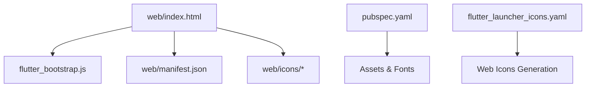
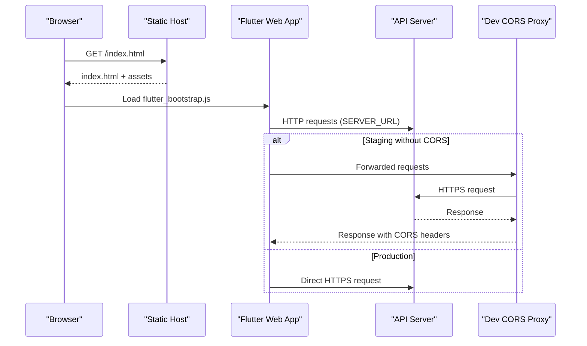
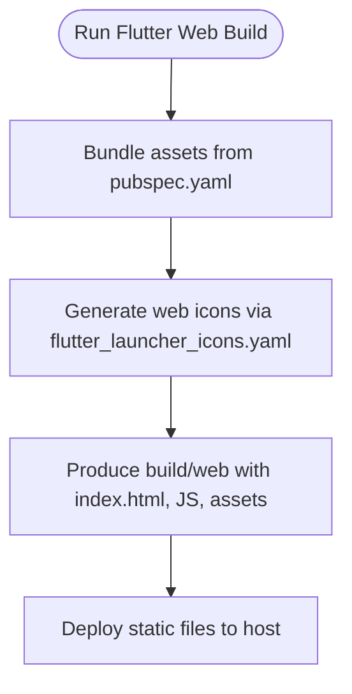
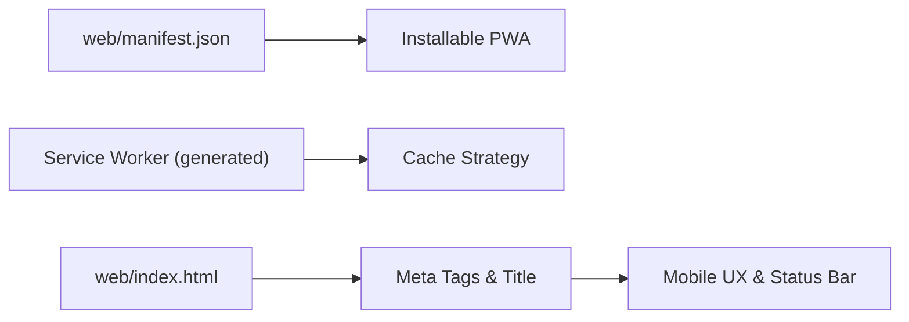
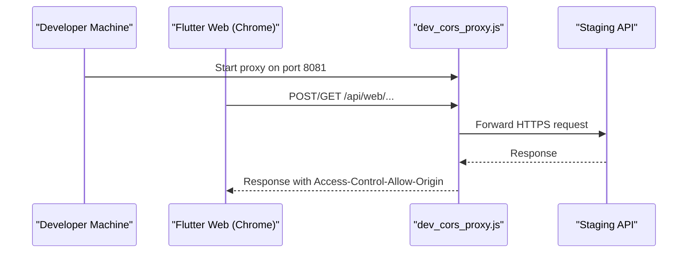
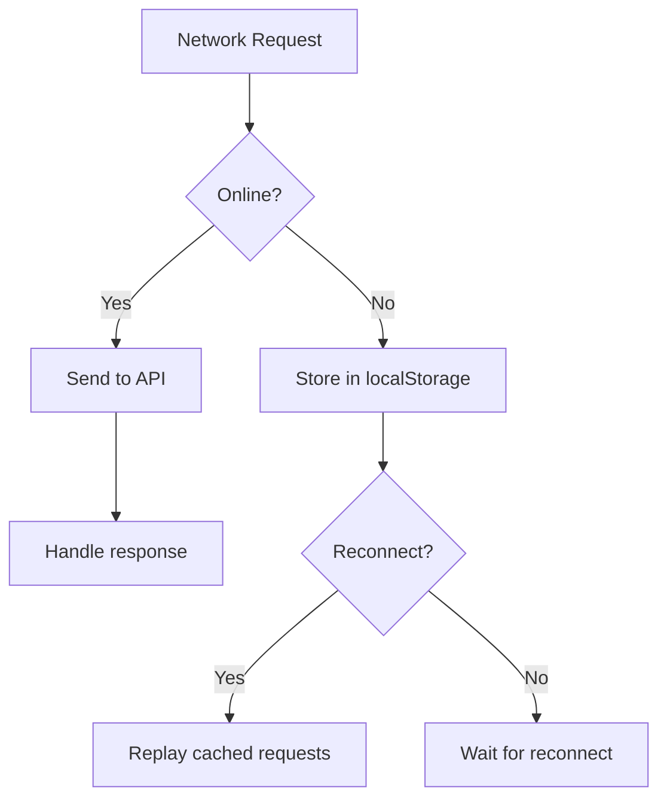
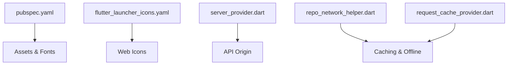

# Web Deployment

<cite>
**Referenced Files in This Document**
- [web/index.html](file://web/index.html)
- [web/manifest.json](file://web/manifest.json)
- [pubspec.yaml](file://pubspec.yaml)
- [flutter_launcher_icons.yaml](file://flutter_launcher_icons.yaml)
- [dev_cors_proxy.js](file://dev_cors_proxy.js)
- [run_chrome_dev.bat](file://run_chrome_dev.bat)
- [lib/app/core/provider/server_provider.dart](file://lib/app/core/provider/server_provider.dart)
- [lib/app/core/provider/request_cache_provider.dart](file://lib/app/core/provider/request_cache_provider.dart)
- [lib/app/core/logic/repository/repo_network_helper.dart](file://lib/app/core/logic/repository/repo_network_helper.dart)
</cite>

## Table of Contents
1. Introduction
2. Project Structure
3. Core Components
4. Architecture Overview
5. Detailed Component Analysis
6. Dependency Analysis
7. Performance Considerations
8. Troubleshooting Guide
9. Conclusion

## Introduction
This document provides comprehensive web deployment guidance for the Leadership Edge Live LMS Flutter application. It covers building the Flutter web output, configuring progressive web app (PWA) features via manifest and service worker, hosting options (Firebase Hosting, AWS S3, Netlify, Vercel), CDN integration, caching strategies, domain and SSL configuration, cross-browser compatibility, SEO optimization, analytics integration, and performance monitoring.

## Project Structure
The Flutter web build produces a static site under the web directory. The entry point is index.html, which loads the generated Flutter bootstrap script and references the PWA manifest. Assets such as icons are included under web/icons. Build-time configuration can be controlled through pubspec.yaml and flutter_launcher_icons.yaml.

**Diagram sources**
- [web/index.html:1-39](file://web/index.html#L1-L39)
- [web/manifest.json:1-35](file://web/manifest.json#L1-L35)
- [pubspec.yaml:127-171](file://pubspec.yaml#L127-L171)
- [flutter_launcher_icons.yaml:21-26](file://flutter_launcher_icons.yaml#L21-L26)

**Section sources**
- [web/index.html:1-39](file://web/index.html#L1-L39)
- [web/manifest.json:1-35](file://web/manifest.json#L1-L35)
- [pubspec.yaml:127-171](file://pubspec.yaml#L127-L171)
- [flutter_launcher_icons.yaml:21-26](file://flutter_launcher_icons.yaml#L21-L26)

## Core Components
- Web entrypoint and metadata: index.html defines base href placeholder, meta tags, favicon, title, and links to the PWA manifest and Flutter bootstrap script.
- PWA manifest: manifest.json configures app name, display mode, theme colors, orientation, and icon assets for installability and standalone behavior.
- Asset bundling: pubspec.yaml declares asset directories and fonts; flutter_launcher_icons.yaml enables web icon generation with background and theme colors.
- API origin configuration: server_provider.dart reads SERVER_URL from environment at build/run time and supplies it to network helpers.
- Offline and request caching: request_cache_provider.dart and repo_network_helper.dart implement local storage-based caching and offline retry logic for web.

**Section sources**
- [web/index.html:1-39](file://web/index.html#L1-L39)
- [web/manifest.json:1-35](file://web/manifest.json#L1-L35)
- [pubspec.yaml:127-171](file://pubspec.yaml#L127-L171)
- [flutter_launcher_icons.yaml:21-26](file://flutter_launcher_icons.yaml#L21-L26)
- [lib/app/core/provider/server_provider.dart:8-17](file://lib/app/core/provider/server_provider.dart#L8-L17)
- [lib/app/core/provider/request_cache_provider.dart:40-78](file://lib/app/core/provider/request_cache_provider.dart#L40-L78)
- [lib/app/core/logic/repository/repo_network_helper.dart:239-283](file://lib/app/core/logic/repository/repo_network_helper.dart#L239-L283)

## Architecture Overview
The Flutter web app runs entirely in the browser after being built into static files. It loads index.html, which initializes the Flutter engine via flutter_bootstrap.js. The app fetches data from an API whose origin is configured at build time. For development, a CORS proxy can be used to bypass missing CORS headers on staging APIs.

**Diagram sources**
- [web/index.html:17-36](file://web/index.html#L17-L36)
- [lib/app/core/provider/server_provider.dart:8-17](file://lib/app/core/provider/server_provider.dart#L8-L17)
- [dev_cors_proxy.js:1-75](file://dev_cors_proxy.js#L1-L75)

## Detailed Component Analysis

### Flutter Web Build Process and Static Assets
- Build command: Use Flutter’s standard web build to generate optimized static assets under the build/web directory. Base path handling is controlled by --base-href, which replaces the placeholder in index.html.
- Assets: Declare images and translations in pubspec.yaml so they are bundled into the web build.
- Icons: Enable web icon generation via flutter_launcher_icons.yaml to produce required icon sizes and set background/theme colors for PWA appearance.

**Diagram sources**
- [pubspec.yaml:127-171](file://pubspec.yaml#L127-L171)
- [flutter_launcher_icons.yaml:21-26](file://flutter_launcher_icons.yaml#L21-L26)
- [web/index.html:17-36](file://web/index.html#L17-L36)

**Section sources**
- [pubspec.yaml:127-171](file://pubspec.yaml#L127-L171)
- [flutter_launcher_icons.yaml:21-26](file://flutter_launcher_icons.yaml#L21-L26)
- [web/index.html:17-36](file://web/index.html#L17-L36)

### Progressive Web App Configuration
- Manifest: Configure name, short_name, start_url, display, theme/background colors, orientation, and icons in manifest.json to enable add-to-home-screen and standalone mode.
- Service Worker: Flutter web builds include a service worker file that should be served alongside your static assets to enable caching and offline capabilities. Ensure your hosting platform serves this file with correct MIME types and does not intercept or rewrite it.
- iOS Safari support: Include appropriate meta tags and apple-touch-icon in index.html for better mobile experience.

**Diagram sources**
- [web/manifest.json:1-35](file://web/manifest.json#L1-L35)
- [web/index.html:19-33](file://web/index.html#L19-L33)

**Section sources**
- [web/manifest.json:1-35](file://web/manifest.json#L1-L35)
- [web/index.html:19-33](file://web/index.html#L19-L33)

### API Origin and Development CORS Proxy
- API origin: Set SERVER_URL at build or run time using --dart-define to direct the app to the correct backend.
- Development proxy: For environments where the API lacks CORS headers, use the provided Node.js CORS proxy to forward requests and inject necessary headers. Run the proxy locally and configure the app to target it during development.

**Diagram sources**
- [lib/app/core/provider/server_provider.dart:8-17](file://lib/app/core/provider/server_provider.dart#L8-L17)
- [dev_cors_proxy.js:1-75](file://dev_cors_proxy.js#L1-L75)
- [run_chrome_dev.bat:1-4](file://run_chrome_dev.bat#L1-L4)

**Section sources**
- [lib/app/core/provider/server_provider.dart:8-17](file://lib/app/core/provider/server_provider.dart#L8-L17)
- [dev_cors_proxy.js:1-75](file://dev_cors_proxy.js#L1-L75)
- [run_chrome_dev.bat:1-4](file://run_chrome_dev.bat#L1-L4)

### Offline and Request Caching on the Web
- Local storage cache: The app caches certain requests in localStorage to support offline scenarios and retries when connectivity returns.
- Network helper integration: Requests are wrapped to detect offline state, store pending operations, and replay them upon reconnection.

**Diagram sources**
- [lib/app/core/provider/request_cache_provider.dart:40-78](file://lib/app/core/provider/request_cache_provider.dart#L40-L78)
- [lib/app/core/logic/repository/repo_network_helper.dart:239-283](file://lib/app/core/logic/repository/repo_network_helper.dart#L239-L283)

**Section sources**
- [lib/app/core/provider/request_cache_provider.dart:40-78](file://lib/app/core/provider/request_cache_provider.dart#L40-L78)
- [lib/app/core/logic/repository/repo_network_helper.dart:239-283](file://lib/app/core/logic/repository/repo_network_helper.dart#L239-L283)

## Dependency Analysis
- Build-time dependencies: pubspec.yaml controls asset inclusion and font definitions that affect bundle size and load performance.
- Runtime dependencies: The app depends on the configured API origin and may rely on a CORS proxy only during development.
- Hosting dependencies: Static hosting platforms must serve index.html, manifest.json, generated service worker, and all assets with proper caching headers.

**Diagram sources**
- [pubspec.yaml:127-171](file://pubspec.yaml#L127-L171)
- [flutter_launcher_icons.yaml:21-26](file://flutter_launcher_icons.yaml#L21-L26)
- [lib/app/core/provider/server_provider.dart:8-17](file://lib/app/core/provider/server_provider.dart#L8-L17)
- [lib/app/core/logic/repository/repo_network_helper.dart:239-283](file://lib/app/core/logic/repository/repo_network_helper.dart#L239-L283)
- [lib/app/core/provider/request_cache_provider.dart:40-78](file://lib/app/core/provider/request_cache_provider.dart#L40-L78)

**Section sources**
- [pubspec.yaml:127-171](file://pubspec.yaml#L127-L171)
- [flutter_launcher_icons.yaml:21-26](file://flutter_launcher_icons.yaml#L21-L26)
- [lib/app/core/provider/server_provider.dart:8-17](file://lib/app/core/provider/server_provider.dart#L8-L17)
- [lib/app/core/logic/repository/repo_network_helper.dart:239-283](file://lib/app/core/logic/repository/repo_network_helper.dart#L239-L283)
- [lib/app/core/provider/request_cache_provider.dart:40-78](file://lib/app/core/provider/request_cache_provider.dart#L40-L78)

## Performance Considerations
- Minimize payload: Keep assets lean; avoid embedding large media directly. Use lazy loading and code splitting where possible.
- Caching strategy: Configure long-term caching for immutable assets (hashed filenames) and shorter TTLs for dynamic content. Ensure the service worker uses efficient caching policies.
- CDN usage: Serve static assets via a CDN to reduce latency and improve global delivery.
- Compression: Enable gzip or Brotli compression on your hosting or CDN.
- Image optimization: Provide appropriately sized images and consider modern formats.
- Monitoring: Integrate performance monitoring and error tracking to measure real-world performance and catch regressions early.

[No sources needed since this section provides general guidance]

## Troubleshooting Guide
- Missing CORS headers in development: Use the provided dev CORS proxy to forward requests and inject headers. Launch the proxy and point the app to it via dart-define.
- Incorrect base path: If serving under a subpath, ensure --base-href is set correctly so index.html resolves assets properly.
- PWA not installing: Verify manifest.json contains required fields and icons exist at referenced paths. Confirm the service worker is served and registered.
- Offline issues: Check localStorage cache entries and reconnection logic to ensure cached requests are retried when connectivity returns.

**Section sources**
- [dev_cors_proxy.js:1-75](file://dev_cors_proxy.js#L1-L75)
- [web/index.html:17-36](file://web/index.html#L17-L36)
- [web/manifest.json:1-35](file://web/manifest.json#L1-L35)
- [lib/app/core/provider/request_cache_provider.dart:40-78](file://lib/app/core/provider/request_cache_provider.dart#L40-L78)

## Conclusion
The Leadership Edge Live LMS Flutter web app is designed for straightforward static hosting with robust PWA support, configurable API origins, and development-time CORS handling. By following the build, hosting, and optimization steps outlined here, you can deploy a fast, reliable, and installable web application across major browsers and hosting platforms.

[No sources needed since this section summarizes without analyzing specific files]