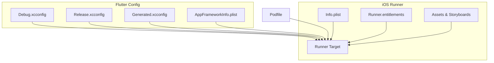
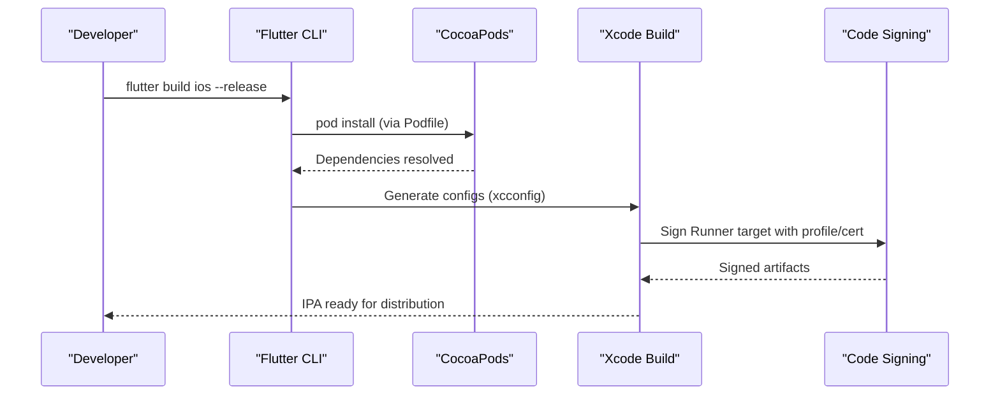
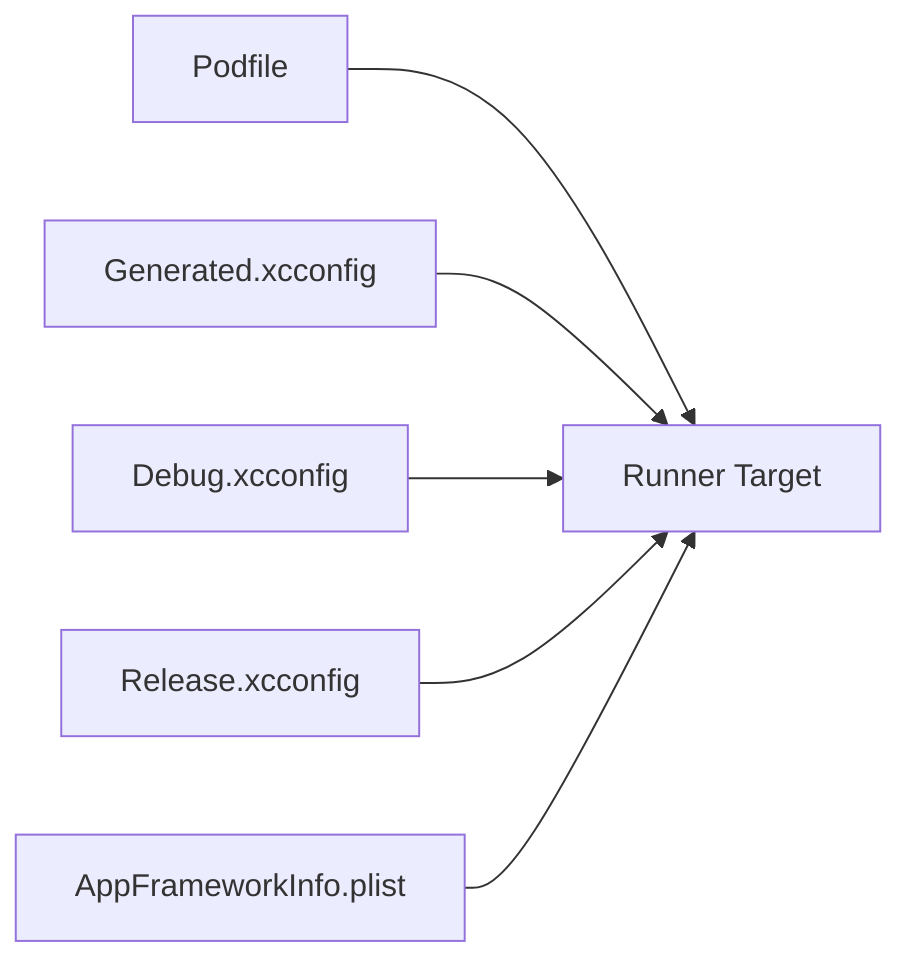

# iOS Deployment

<cite>
**Referenced Files in This Document**
- [Podfile](file://ios/Podfile)
- [Info.plist](file://ios/Runner/Info.plist)
- [Runner.entitlements](file://ios/Runner/Runner.entitlements)
- [Debug.xcconfig](file://ios/Flutter/Debug.xcconfig)
- [Release.xcconfig](file://ios/Flutter/Release.xcconfig)
- [Generated.xcconfig](file://ios/Flutter/Generated.xcconfig)
- [AppFrameworkInfo.plist](file://ios/Flutter/AppFrameworkInfo.plist)
- [AppDelegate.swift](file://ios/Runner/AppDelegate.swift)
- [pubspec.yaml](file://pubspec.yaml)
</cite>

## Table of Contents
1. [Introduction](#introduction)
2. [Project Structure](#project-structure)
3. [Core Components](#core-components)
4. [Architecture Overview](#architecture-overview)
5. [Detailed Component Analysis](#detailed-component-analysis)
6. [Dependency Analysis](#dependency-analysis)
7. [Performance Considerations](#performance-considerations)
8. [Troubleshooting Guide](#troubleshooting-guide)
9. [Conclusion](#conclusion)
10. [Appendices](#appendices)

## Introduction
This document provides a complete iOS deployment guide for the Leadership Edge Live LMS Flutter application. It covers building and packaging an IPA, configuring the Xcode project via Flutter’s generated settings, managing CocoaPods dependencies with Podfile, code signing with provisioning profiles and certificates, entitlements configuration, App Store Connect submission workflow (metadata, screenshots, review compliance), platform-specific Info.plist settings, debugging techniques, performance profiling, and post-release maintenance.

## Project Structure
The iOS side is a standard Flutter Runner setup:
- ios/Runner contains the app target, Info.plist, launch storyboards, assets, and entitlements.
- ios/Flutter holds build configurations (Debug.xcconfig, Release.xcconfig, Generated.xcconfig) and the Flutter framework metadata (AppFrameworkInfo.plist).
- ios/Podfile configures CocoaPods integration and plugin installation.
- pubspec.yaml defines Flutter-level versioning that maps to iOS bundle identifiers and versions.

**Diagram sources**
- [Podfile:7-11](file://ios/Podfile#L7-L11)
- [Debug.xcconfig:1-3](file://ios/Flutter/Debug.xcconfig#L1-L3)
- [Release.xcconfig:1-3](file://ios/Flutter/Release.xcconfig#L1-L3)
- [Generated.xcconfig:1-15](file://ios/Flutter/Generated.xcconfig#L1-L15)
- [AppFrameworkInfo.plist:1-25](file://ios/Flutter/AppFrameworkInfo.plist#L1-L25)
- [Info.plist:1-78](file://ios/Runner/Info.plist#L1-L78)
- [Runner.entitlements:1-7](file://ios/Runner/Runner.entitlements#L1-L7)

**Section sources**
- [Podfile:1-44](file://ios/Podfile#L1-L44)
- [Info.plist:1-78](file://ios/Runner/Info.plist#L1-L78)
- [Runner.entitlements:1-7](file://ios/Runner/Runner.entitlements#L1-L7)
- [Debug.xcconfig:1-3](file://ios/Flutter/Debug.xcconfig#L1-L3)
- [Release.xcconfig:1-3](file://ios/Flutter/Release.xcconfig#L1-L3)
- [Generated.xcconfig:1-15](file://ios/Flutter/Generated.xcconfig#L1-L15)
- [AppFrameworkInfo.plist:1-25](file://ios/Flutter/AppFrameworkInfo.plist#L1-L25)
- [pubspec.yaml:7-19](file://pubspec.yaml#L7-L19)

## Core Components
- CocoaPods integration: The Podfile sets the minimum iOS platform, disables analytics during install, targets the Runner project, includes Flutter helper scripts, installs all Flutter plugins, and applies additional build settings per target.
- Build configurations: Debug.xcconfig and Release.xcconfig include generated Pods xcconfigs and Flutter-generated settings. Generated.xcconfig carries Flutter root, target, build name/number, architecture exclusions, obfuscation flags, and widget tracking options.
- App metadata and behavior: Info.plist defines display name, bundle identifier placeholder, version placeholders, ATS media allowance, photo library usage description, scene manifest, supported orientations, and launch/main storyboard references.
- Entitlements: Runner.entitlements is present and empty by default; add required capabilities here as needed.
- Versioning: pubspec.yaml version maps to CFBundleShortVersionString and CFBundleVersion on iOS via Flutter’s generated settings.

**Section sources**
- [Podfile:1-44](file://ios/Podfile#L1-L44)
- [Debug.xcconfig:1-3](file://ios/Flutter/Debug.xcconfig#L1-L3)
- [Release.xcconfig:1-3](file://ios/Flutter/Release.xcconfig#L1-L3)
- [Generated.xcconfig:1-15](file://ios/Flutter/Generated.xcconfig#L1-L15)
- [Info.plist:1-78](file://ios/Runner/Info.plist#L1-L78)
- [Runner.entitlements:1-7](file://ios/Runner/Runner.entitlements#L1-L7)
- [pubspec.yaml:7-19](file://pubspec.yaml#L7-L19)

## Architecture Overview
The iOS build pipeline integrates Flutter tooling, CocoaPods, and Xcode:
- Flutter generates xcconfig files and environment variables for builds.
- CocoaPods resolves and installs plugins defined by Flutter dependencies.
- Xcode compiles Swift/ObjC components and links the Flutter engine and plugins into the final binary.
- Code signing uses the Runner target’s signing settings and entitlements.

**Diagram sources**
- [Podfile:26-33](file://ios/Podfile#L26-L33)
- [Debug.xcconfig:1-3](file://ios/Flutter/Debug.xcconfig#L1-L3)
- [Release.xcconfig:1-3](file://ios/Flutter/Release.xcconfig#L1-L3)
- [Generated.xcconfig:1-15](file://ios/Flutter/Generated.xcconfig#L1-L15)

## Detailed Component Analysis

### CocoaPods Dependency Management (Podfile)
- Minimum iOS platform is set to ensure compatibility across devices.
- Analytics are disabled during install to reduce network latency.
- The Runner target is explicitly configured with Debug/Profile/Release schemes.
- Flutter helper functions integrate plugin pods and apply additional build settings per target.
- Post-install hook ensures consistent build settings for all pods.

Operational notes:
- Always run flutter pub get before pod install to ensure Generated.xcconfig exists.
- Use use_frameworks! to support modern plugin architectures.
- Keep Podfile.lock under version control to pin dependency versions.

**Section sources**
- [Podfile:1-44](file://ios/Podfile#L1-L44)

### Xcode Project Configuration (xcconfig and Generated Settings)
- Debug.xcconfig and Release.xcconfig include generated Pods xcconfigs and Flutter-generated settings.
- Generated.xcconfig defines:
  - Flutter root and application path
  - Target Dart entrypoint
  - Build directory
  - Build name and number mapping to iOS bundle versions
  - Architecture exclusions for simulator and device
  - Obfuscation and widget creation tracking flags
  - Package config location

Build-time implications:
- Ensure COCOAPODS_PARALLEL_CODE_SIGN is enabled for faster builds.
- Adjust EXCLUDED_ARCHS if adding custom native libraries or third-party frameworks.
- Toggle DART_OBFUSCATION and TRACK_WIDGET_CREATION based on release vs debug needs.

**Section sources**
- [Debug.xcconfig:1-3](file://ios/Flutter/Debug.xcconfig#L1-L3)
- [Release.xcconfig:1-3](file://ios/Flutter/Release.xcconfig#L1-L3)
- [Generated.xcconfig:1-15](file://ios/Flutter/Generated.xcconfig#L1-L15)

### App Metadata and Behavior (Info.plist)
Key entries:
- Display name and bundle identifier placeholders are used by Flutter to inject values at build time.
- Short version and build number are sourced from Flutter’s build-name and build-number.
- ATS allows arbitrary loads for media resources when necessary.
- Photo library usage description is provided for image picker functionality.
- Scene manifest configures single-scene mode and delegates to Flutter scene delegate.
- Supported interface orientations define portrait and landscape modes for iPhone and iPad.

Permissions and privacy:
- If your app accesses camera, microphone, contacts, location, or background modes, add corresponding keys and descriptions here.
- For background tasks or specific capabilities, configure them in Xcode Capabilities and/or entitlements.

**Section sources**
- [Info.plist:1-78](file://ios/Runner/Info.plist#L1-L78)

### Entitlements Configuration (Runner.entitlements)
- The file is currently empty. Add entitlements only when required by your app’s features (e.g., iCloud, Keychain access groups, App Groups, Background Modes).
- Each entitlement must match the capabilities enabled in Xcode and the provisioning profile.

Best practices:
- Keep entitlements minimal and scoped to actual needs.
- Validate entitlements against the provisioning profile to avoid signing errors.

**Section sources**
- [Runner.entitlements:1-7](file://ios/Runner/Runner.entitlements#L1-L7)

### Code Signing and Provisioning Profiles
- The Runner target must be signed with a valid Apple Developer certificate and matching provisioning profile for both development and distribution.
- Bundle Identifier should be unique and registered in your Apple Developer account.
- Ensure the selected provisioning profile includes all required entitlements and capabilities.
- For CI/CD, store signing credentials securely and automate profile selection by scheme or configuration.

Common issues:
- Mismatched bundle ID and provisioning profile
- Missing or expired certificates
- Incorrect team or signing identity selection
- Entitlements not included in the provisioning profile

**Section sources**
- [Generated.xcconfig:1-15](file://ios/Flutter/Generated.xcconfig#L1-L15)
- [Info.plist:1-78](file://ios/Runner/Info.plist#L1-L78)

### App Store Connect Submission Workflow
Preparation:
- Set CFBundleShortVersionString and CFBundleVersion via Flutter’s build-name and build-number in pubspec.yaml or command-line flags.
- Prepare app metadata in App Store Connect: app name, description, keywords, category, support URL, and marketing URL.
- Upload screenshots for all required device sizes and orientations.
- Complete App Privacy section with data collection disclosures.

Review guidelines highlights:
- Provide clear permission prompts with human-readable reasons.
- Avoid runtime crashes and ensure accessibility labels where applicable.
- Comply with content policies and regional restrictions.

Distribution:
- Archive the app using Xcode or Flutter build commands.
- Validate the archive to catch missing icons, bitcode issues, or API mismatches.
- Submit via Xcode Organizer or Transporter to App Store Connect.
- Monitor review status and respond to feedback promptly.

**Section sources**
- [pubspec.yaml:7-19](file://pubspec.yaml#L7-L19)
- [Info.plist:1-78](file://ios/Runner/Info.plist#L1-L78)

### Platform-Specific Configurations in Info.plist
- ATS media loading: If your app streams media from non-HTTPS sources, ensure NSAllowsArbitraryLoadsForMedia is set appropriately and justified for review.
- Orientation support: Configure UISupportedInterfaceOrientations for iPhone and iPad separately to match UX requirements.
- Launch screens: Ensure LaunchScreen.storyboard and Main.storyboard are correctly referenced.
- Scene configuration: Single-scene apps should keep UIApplicationSupportsMultipleScenes false unless multi-window is intentionally supported.

**Section sources**
- [Info.plist:1-78](file://ios/Runner/Info.plist#L1-L78)

### Debugging Techniques
- Use Xcode console logs and Flutter devtools for runtime diagnostics.
- Enable verbose logging in networking layers and cache managers to trace failures.
- Verify permissions and capability requests at runtime to ensure user consent flows work as expected.
- Test on real devices for performance-sensitive features like video playback and WebView rendering.

**Section sources**
- [Generated.xcconfig:1-15](file://ios/Flutter/Generated.xcconfig#L1-L15)

### Performance Profiling
- Profile CPU, memory, and GPU usage using Xcode Instruments.
- Measure startup time and optimize lazy initialization paths.
- Validate media decoding performance on device; consider hardware acceleration where available.
- Reduce payload sizes and defer heavy operations until after first paint.

[No sources needed since this section provides general guidance]

### Post-Release Maintenance
- Monitor crash reports and analytics to identify regressions.
- Update dependencies regularly and retest critical flows.
- Maintain separate build configurations for beta and production releases.
- Keep entitlements and permissions aligned with evolving OS requirements.

[No sources needed since this section provides general guidance]

## Dependency Analysis
Flutter plugins and native integrations are managed through CocoaPods:
- Podfile declares the platform, project targets, and Flutter helpers to install all required pods.
- Generated.xcconfig influences build behavior such as architecture exclusions and obfuscation.
- AppFrameworkInfo.plist defines the Flutter framework bundle metadata.

**Diagram sources**
- [Podfile:7-11](file://ios/Podfile#L7-L11)
- [Debug.xcconfig:1-3](file://ios/Flutter/Debug.xcconfig#L1-L3)
- [Release.xcconfig:1-3](file://ios/Flutter/Release.xcconfig#L1-L3)
- [Generated.xcconfig:1-15](file://ios/Flutter/Generated.xcconfig#L1-L15)
- [AppFrameworkInfo.plist:1-25](file://ios/Flutter/AppFrameworkInfo.plist#L1-L25)

**Section sources**
- [Podfile:1-44](file://ios/Podfile#L1-L44)
- [Generated.xcconfig:1-15](file://ios/Flutter/Generated.xcconfig#L1-L15)
- [AppFrameworkInfo.plist:1-25](file://ios/Flutter/AppFrameworkInfo.plist#L1-L25)

## Performance Considerations
- Prefer Release builds for performance testing; Debug builds include extra instrumentation.
- Disable unnecessary features in production builds to reduce binary size and startup overhead.
- Optimize media handling and WebView usage for smoother playback and navigation.
- Use incremental builds and parallel code signing to speed up iteration.

[No sources needed since this section provides general guidance]

## Troubleshooting Guide
Common issues and resolutions:
- Missing Generated.xcconfig: Run flutter pub get to regenerate Flutter build settings.
- CocoaPods resolution failures: Clean DerivedData, remove Pods folder, and reinstall pods.
- Code signing errors: Verify certificate validity, provisioning profile inclusion of entitlements, and correct team selection.
- Permission denied at runtime: Ensure Info.plist contains appropriate usage descriptions and that users grant permissions.
- Media loading blocked by ATS: Confirm NSAllowsArbitraryLoadsForMedia is justified and documented for review.

**Section sources**
- [Generated.xcconfig:1-15](file://ios/Flutter/Generated.xcconfig#L1-L15)
- [Info.plist:1-78](file://ios/Runner/Info.plist#L1-L78)

## Conclusion
This guide outlined the end-to-end iOS deployment process for the Leadership Edge Live LMS, covering CocoaPods management, Xcode configuration via Flutter’s generated settings, code signing and entitlements, App Store Connect submission, Info.plist platform specifics, debugging, performance profiling, and maintenance. Following these steps will help you produce reliable, compliant, and performant iOS releases.

[No sources needed since this section summarizes without analyzing specific files]

## Appendices

### Build and Packaging Checklist
- Ensure Flutter SDK and tools are installed and updated.
- Run flutter pub get and verify Generated.xcconfig exists.
- Install CocoaPods dependencies via Podfile.
- Configure signing identities and provisioning profiles in Xcode.
- Set build name and number in pubspec.yaml or via build flags.
- Archive and validate the build.
- Submit to App Store Connect with complete metadata and screenshots.

[No sources needed since this section provides general guidance]