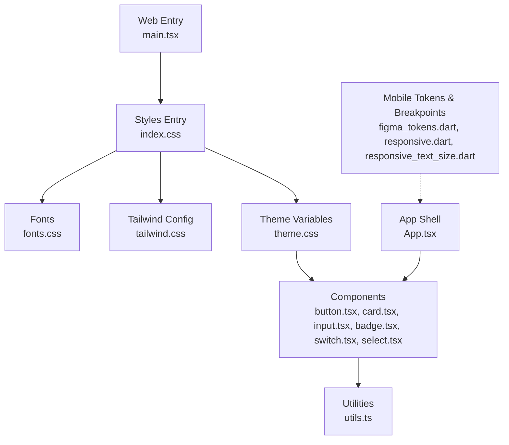
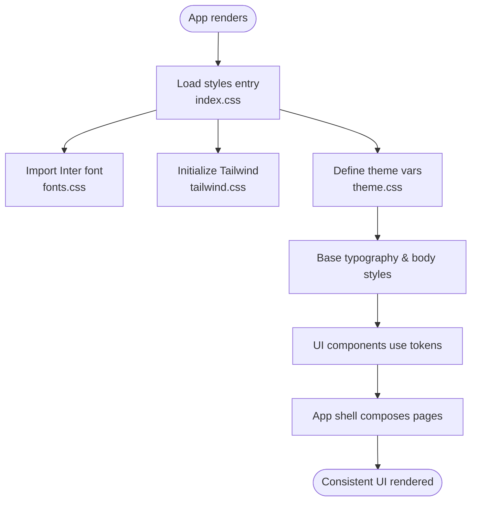
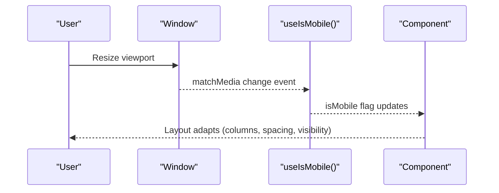
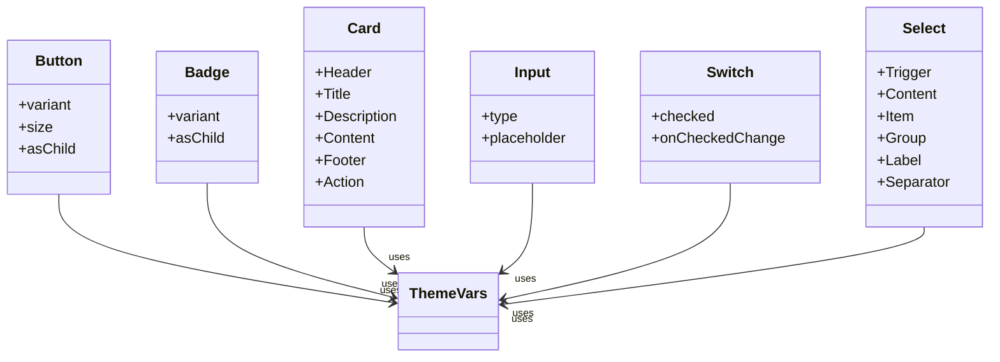
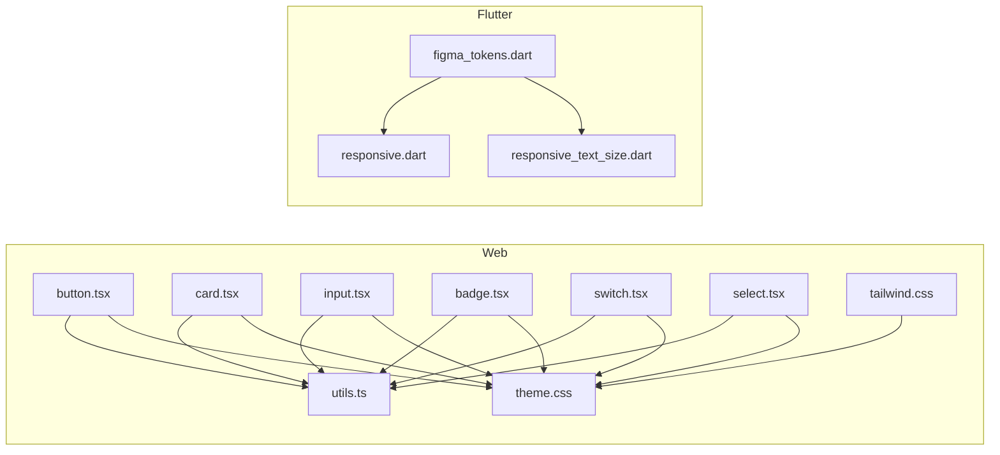
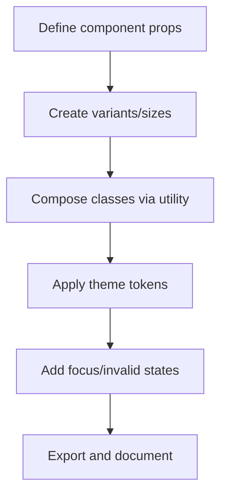
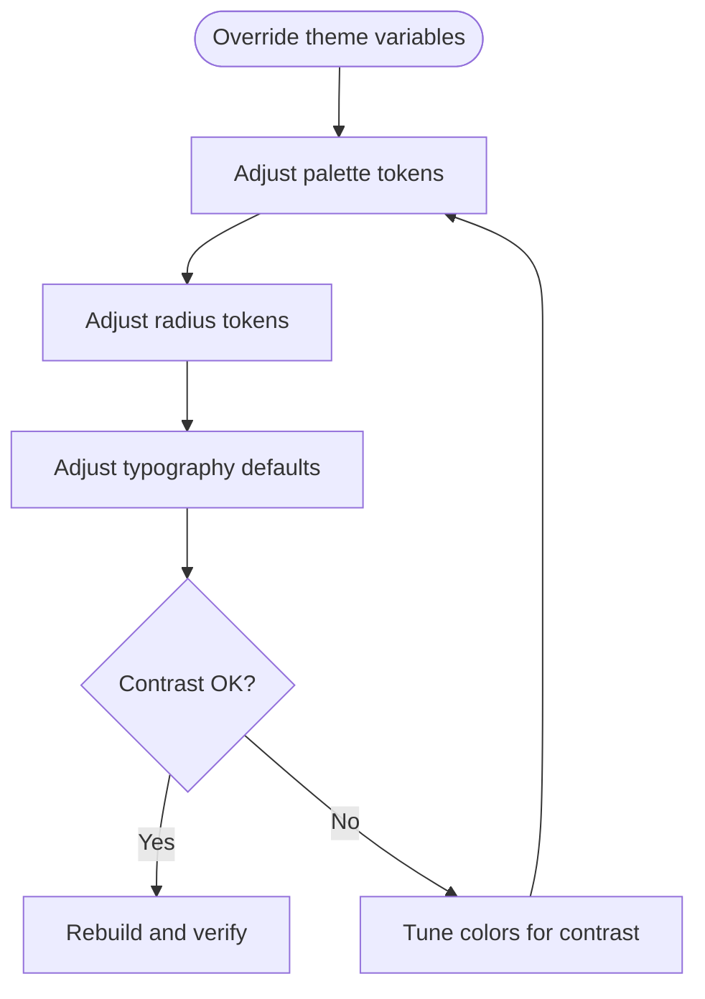

# Design System

<cite>
**Referenced Files in This Document**
- [theme.css](file://src/styles/theme.css)
- [tailwind.css](file://src/styles/tailwind.css)
- [fonts.css](file://src/styles/fonts.css)
- [index.css](file://src/styles/index.css)
- [utils.ts](file://src/app/components/ui/utils.ts)
- [button.tsx](file://src/app/components/ui/button.tsx)
- [card.tsx](file://src/app/components/ui/card.tsx)
- [input.tsx](file://src/app/components/ui/input.tsx)
- [badge.tsx](file://src/app/components/ui/badge.tsx)
- [switch.tsx](file://src/app/components/ui/switch.tsx)
- [select.tsx](file://src/app/components/ui/select.tsx)
- [use-mobile.ts](file://src/app/components/ui/use-mobile.ts)
- [App.tsx](file://src/app/App.tsx)
- [main.tsx](file://src/main.tsx)
- [responsive.dart](file://lib/app/core/design/responsive.dart)
- [figma_tokens.dart](file://lib/app/core/design/figma_tokens.dart)
- [responsive_text_size.dart](file://lib/app/core/design/responsive_text_size.dart)
</cite>

## Table of Contents
1. Introduction
2. Project Structure
3. Core Components
4. Architecture Overview
5. Detailed Component Analysis
6. Dependency Analysis
7. Performance Considerations
8. Troubleshooting Guide
9. Conclusion
10. Appendices

## Introduction
This document describes the Leadership Edge Live LMS design system with a focus on theming, typography, spacing, component styling patterns, responsive design, and accessibility. It explains how CSS custom properties and Tailwind utilities form the foundation of the web UI layer, while Flutter tokens and responsive utilities provide consistent behavior across mobile and desktop platforms. The guide also shows how to extend the system with new components and customize themes for different branding contexts.

## Project Structure
The design system spans two layers:
- Web (React + Tailwind): Centralized theme variables, typography defaults, and reusable UI components built with class composition and variants.
- Mobile/Desktop (Flutter): Shared design tokens, breakpoints, and responsive text sizing to keep native screens aligned with the visual system.



**Diagram sources**
- [main.tsx:1-7](file://src/main.tsx#L1-L7)
- [index.css:1-4](file://src/styles/index.css#L1-L4)
- [fonts.css:1-2](file://src/styles/fonts.css#L1-L2)
- [tailwind.css:1-5](file://src/styles/tailwind.css#L1-L5)
- [theme.css:1-182](file://src/styles/theme.css#L1-L182)
- [button.tsx:1-59](file://src/app/components/ui/button.tsx#L1-L59)
- [card.tsx:1-93](file://src/app/components/ui/card.tsx#L1-L93)
- [input.tsx:1-22](file://src/app/components/ui/input.tsx#L1-L22)
- [badge.tsx:1-47](file://src/app/components/ui/badge.tsx#L1-L47)
- [switch.tsx:1-32](file://src/app/components/ui/switch.tsx#L1-L32)
- [select.tsx:1-190](file://src/app/components/ui/select.tsx#L1-L190)
- [utils.ts:1-7](file://src/app/components/ui/utils.ts#L1-L7)
- [App.tsx:1-767](file://src/app/App.tsx#L1-L767)
- [responsive.dart:1-70](file://lib/app/core/design/responsive.dart#L1-L70)
- [figma_tokens.dart:1-45](file://lib/app/core/design/figma_tokens.dart#L1-L45)
- [responsive_text_size.dart:35-145](file://lib/app/core/design/responsive_text_size.dart#L35-L145)

**Section sources**
- [main.tsx:1-7](file://src/main.tsx#L1-L7)
- [index.css:1-4](file://src/styles/index.css#L1-L4)
- [theme.css:1-182](file://src/styles/theme.css#L1-L182)
- [responsive.dart:1-70](file://lib/app/core/design/responsive.dart#L1-L70)
- [figma_tokens.dart:1-45](file://lib/app/core/design/figma_tokens.dart#L1-L45)

## Core Components
The UI library provides accessible, theme-aware primitives that compose into complex surfaces. Each component uses shared utilities and CSS variables so they adapt automatically to light/dark modes and brand changes.

- Button: Variant-driven styling (default, secondary, outline, ghost, link, destructive) with sizes and focus states. Uses class composition via a utility function to merge classes deterministically.
- Card: Semantic parts (Header, Title, Description, Content, Footer, Action) with consistent spacing and borders.
- Input: Accessible form control with focus rings, invalid states, and platform-specific file input handling.
- Badge: Status indicators with multiple semantic variants and keyboard focus support.
- Switch: Toggle control with stateful visuals and focus management.
- Select: Full-featured selection widget with grouped items, labels, separators, and scrollable content.

All components rely on:
- Theme variables for colors, radii, and typography scales.
- A class merging utility to avoid conflicts and ensure predictable output.
- Consistent data attributes for testing and styling hooks.

**Section sources**
- [button.tsx:1-59](file://src/app/components/ui/button.tsx#L1-L59)
- [card.tsx:1-93](file://src/app/components/ui/card.tsx#L1-L93)
- [input.tsx:1-22](file://src/app/components/ui/input.tsx#L1-L22)
- [badge.tsx:1-47](file://src/app/components/ui/badge.tsx#L1-L47)
- [switch.tsx:1-32](file://src/app/components/ui/switch.tsx#L1-L32)
- [select.tsx:1-190](file://src/app/components/ui/select.tsx#L1-L190)
- [utils.ts:1-7](file://src/app/components/ui/utils.ts#L1-L7)

## Architecture Overview
The theming architecture is driven by CSS custom properties and Tailwind’s theme mapping. The base layer sets global defaults for typography and color usage, while dark mode is enabled via a modifier class. Components consume these tokens through semantic color names and radius values, ensuring consistency across the app.



**Diagram sources**
- [index.css:1-4](file://src/styles/index.css#L1-L4)
- [fonts.css:1-2](file://src/styles/fonts.css#L1-L2)
- [tailwind.css:1-5](file://src/styles/tailwind.css#L1-L5)
- [theme.css:1-182](file://src/styles/theme.css#L1-L182)
- [App.tsx:1-767](file://src/app/App.tsx#L1-L767)

## Detailed Component Analysis

### Theming and Typography
- Color tokens: Light and dark palettes are defined as CSS variables and mapped to semantic names used by components.
- Typography: Base HTML elements receive consistent type scales; headings and form controls inherit weights and line heights from the base layer.
- Radius: A single radius variable drives consistent corner treatment across components.

```mermaid
classDiagram
class ThemeVars {
"+background"
"+foreground"
"+primary"
"+secondary"
"+muted"
"+accent"
"+destructive"
"+border"
"+ring"
"+radius"
}
class BaseTypography {
"+html font-size"
"+h1..h4 scales"
"+label/button/input defaults"
}
ThemeVars <.. BaseTypography : "applied via CSS vars"
```

**Diagram sources**
- [theme.css:1-182](file://src/styles/theme.css#L1-L182)

**Section sources**
- [theme.css:1-182](file://src/styles/theme.css#L1-L182)

### Responsive Design
- Web: A React hook detects mobile widths using matchMedia to conditionally render or adjust layouts.
- Flutter: Shared breakpoints define phone/tablet/desktop tiers and helper methods to compute column counts and values per width.
- Text scaling: A token-based scale maps device size categories to readable type sizes.



**Diagram sources**
- [use-mobile.ts:1-21](file://src/app/components/ui/use-mobile.ts#L1-L21)
- [responsive.dart:1-70](file://lib/app/core/design/responsive.dart#L1-L70)
- [responsive_text_size.dart:35-145](file://lib/app/core/design/responsive_text_size.dart#L35-L145)

**Section sources**
- [use-mobile.ts:1-21](file://src/app/components/ui/use-mobile.ts#L1-L21)
- [responsive.dart:1-70](file://lib/app/core/design/responsive.dart#L1-L70)
- [responsive_text_size.dart:35-145](file://lib/app/core/design/responsive_text_size.dart#L35-L145)

### Reusable UI Components Library
- Composition pattern: Components accept className and forward props, enabling flexible composition and overrides.
- Variants: Buttons and badges expose variant and size options to reduce duplication and enforce consistency.
- Accessibility: Focus rings, aria-invalid states, and keyboard navigation are included in components.



**Diagram sources**
- [button.tsx:1-59](file://src/app/components/ui/button.tsx#L1-L59)
- [badge.tsx:1-47](file://src/app/components/ui/badge.tsx#L1-L47)
- [card.tsx:1-93](file://src/app/components/ui/card.tsx#L1-L93)
- [input.tsx:1-22](file://src/app/components/ui/input.tsx#L1-L22)
- [switch.tsx:1-32](file://src/app/components/ui/switch.tsx#L1-L32)
- [select.tsx:1-190](file://src/app/components/ui/select.tsx#L1-L190)
- [theme.css:1-182](file://src/styles/theme.css#L1-L182)

**Section sources**
- [button.tsx:1-59](file://src/app/components/ui/button.tsx#L1-L59)
- [badge.tsx:1-47](file://src/app/components/ui/badge.tsx#L1-L47)
- [card.tsx:1-93](file://src/app/components/ui/card.tsx#L1-L93)
- [input.tsx:1-22](file://src/app/components/ui/input.tsx#L1-L22)
- [switch.tsx:1-32](file://src/app/components/ui/switch.tsx#L1-L32)
- [select.tsx:1-190](file://src/app/components/ui/select.tsx#L1-L190)

### Visual Design Principles and Brand Guidelines
- Colors: Use semantic tokens (primary, secondary, muted, accent, destructive) rather than hardcoded hex values to maintain contrast and brand alignment.
- Typography: Follow the base type scale; prefer heading levels for hierarchy and consistent line-heights for readability.
- Spacing: Rely on Tailwind spacing utilities and component paddings/margins to keep rhythm consistent.
- Brand accents: Flutter tokens mirror key brand colors and gradients to keep native screens visually aligned with the web experience.

**Section sources**
- [theme.css:1-182](file://src/styles/theme.css#L1-L182)
- [figma_tokens.dart:1-45](file://lib/app/core/design/figma_tokens.dart#L1-L45)

### Extending the Design System
To add a new component:
- Define variants and sizes using the same pattern as existing components.
- Compose classes via the shared utility to ensure deterministic merging.
- Reference theme tokens for colors, radii, and typography.
- Add focus and invalid states for accessibility.

To customize themes:
- Override CSS variables in the theme file to rebrand colors, radii, and typography scales.
- For dark mode, update the corresponding variable set to preserve contrast ratios.
- On Flutter, update tokens in the shared tokens file to keep native and web aligned.

**Section sources**
- [utils.ts:1-7](file://src/app/components/ui/utils.ts#L1-L7)
- [theme.css:1-182](file://src/styles/theme.css#L1-L182)
- [figma_tokens.dart:1-45](file://lib/app/core/design/figma_tokens.dart#L1-L45)

## Dependency Analysis
The web layer depends on Tailwind utilities and theme variables; components depend on a small utility for class merging. The Flutter layer depends on shared tokens and responsive helpers.



**Diagram sources**
- [theme.css:1-182](file://src/styles/theme.css#L1-L182)
- [tailwind.css:1-5](file://src/styles/tailwind.css#L1-L5)
- [utils.ts:1-7](file://src/app/components/ui/utils.ts#L1-L7)
- [button.tsx:1-59](file://src/app/components/ui/button.tsx#L1-L59)
- [card.tsx:1-93](file://src/app/components/ui/card.tsx#L1-L93)
- [input.tsx:1-22](file://src/app/components/ui/input.tsx#L1-L22)
- [badge.tsx:1-47](file://src/app/components/ui/badge.tsx#L1-L47)
- [switch.tsx:1-32](file://src/app/components/ui/switch.tsx#L1-L32)
- [select.tsx:1-190](file://src/app/components/ui/select.tsx#L1-L190)
- [figma_tokens.dart:1-45](file://lib/app/core/design/figma_tokens.dart#L1-L45)
- [responsive.dart:1-70](file://lib/app/core/design/responsive.dart#L1-L70)
- [responsive_text_size.dart:35-145](file://lib/app/core/design/responsive_text_size.dart#L35-L145)

**Section sources**
- [theme.css:1-182](file://src/styles/theme.css#L1-L182)
- [tailwind.css:1-5](file://src/styles/tailwind.css#L1-L5)
- [utils.ts:1-7](file://src/app/components/ui/utils.ts#L1-L7)
- [figma_tokens.dart:1-45](file://lib/app/core/design/figma_tokens.dart#L1-L45)
- [responsive.dart:1-70](file://lib/app/core/design/responsive.dart#L1-L70)

## Performance Considerations
- Prefer semantic tokens over inline styles to leverage CSS caching and reduce runtime computation.
- Use variant-based components to minimize duplicated style logic.
- Debounce or limit expensive layout recalculations when responding to resize events.
- Keep component trees shallow where possible; leverage composition to reuse common patterns.

[No sources needed since this section provides general guidance]

## Troubleshooting Guide
Common issues and resolutions:
- Dark mode not applying: Ensure the dark modifier class is present on the root element so CSS variables switch correctly.
- Inconsistent spacing or colors: Verify components are using theme tokens and not hardcoded values.
- Form validation visuals: Confirm aria-invalid is set appropriately so ring and border states reflect errors.
- Responsive breaks: Check breakpoint constants and ensure media queries or hooks are active.

**Section sources**
- [theme.css:1-182](file://src/styles/theme.css#L1-L182)
- [input.tsx:1-22](file://src/app/components/ui/input.tsx#L1-L22)
- [use-mobile.ts:1-21](file://src/app/components/ui/use-mobile.ts#L1-L21)

## Conclusion
The Leadership Edge Live LMS design system combines a robust CSS variable–based theme with Tailwind utilities and a cohesive set of accessible components. Flutter tokens and responsive utilities align native experiences with the web design language. By extending components through variants and composing them with shared utilities, teams can scale the system consistently across features and brands.

[No sources needed since this section summarizes without analyzing specific files]

## Appendices

### Appendix A: Token Reference (Web)
- Colors: background, foreground, primary, secondary, muted, accent, destructive, border, ring, chart series, sidebar tokens.
- Radii: sm, md, lg, xl derived from a base radius.
- Typography: base font size and default styles for headings, labels, buttons, inputs.

**Section sources**
- [theme.css:1-182](file://src/styles/theme.css#L1-L182)

### Appendix B: Token Reference (Flutter)
- Brand colors and gradients aligned with web tokens.
- Page backgrounds, card surfaces, top bar, and status colors.
- Responsive breakpoints and text scales for consistent sizing across devices.

**Section sources**
- [figma_tokens.dart:1-45](file://lib/app/core/design/figma_tokens.dart#L1-L45)
- [responsive.dart:1-70](file://lib/app/core/design/responsive.dart#L1-L70)
- [responsive_text_size.dart:35-145](file://lib/app/core/design/responsive_text_size.dart#L35-L145)

### Appendix C: Example Workflows

#### Adding a New Component


[No sources needed since this diagram shows conceptual workflow, not actual code structure]

#### Customizing Themes


[No sources needed since this diagram shows conceptual workflow, not actual code structure]