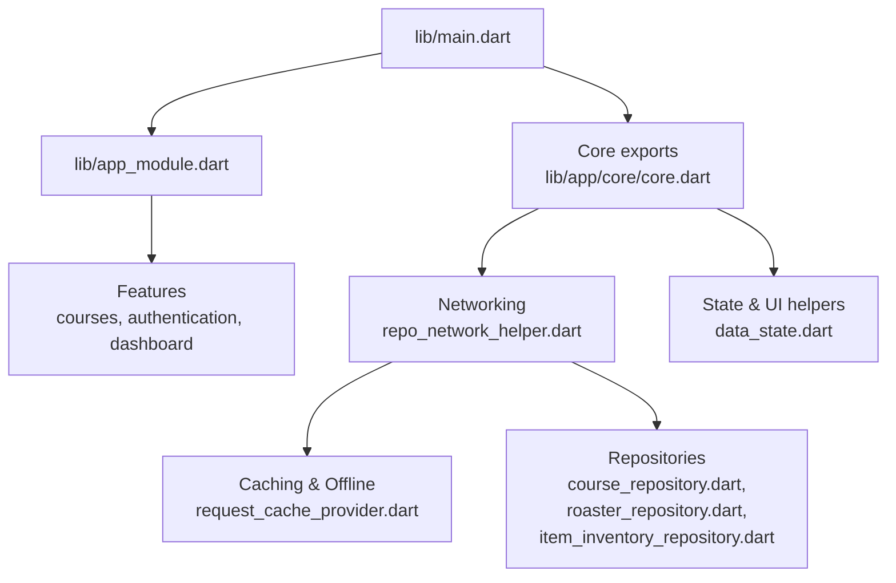
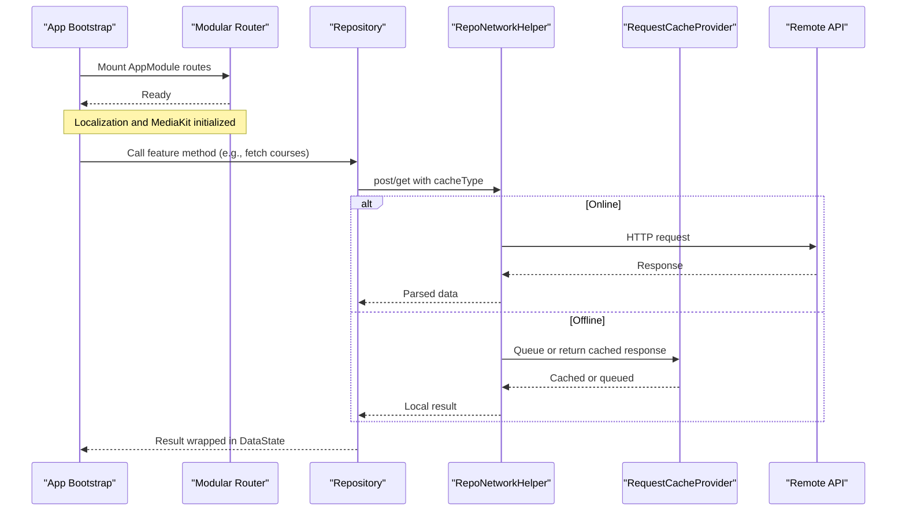
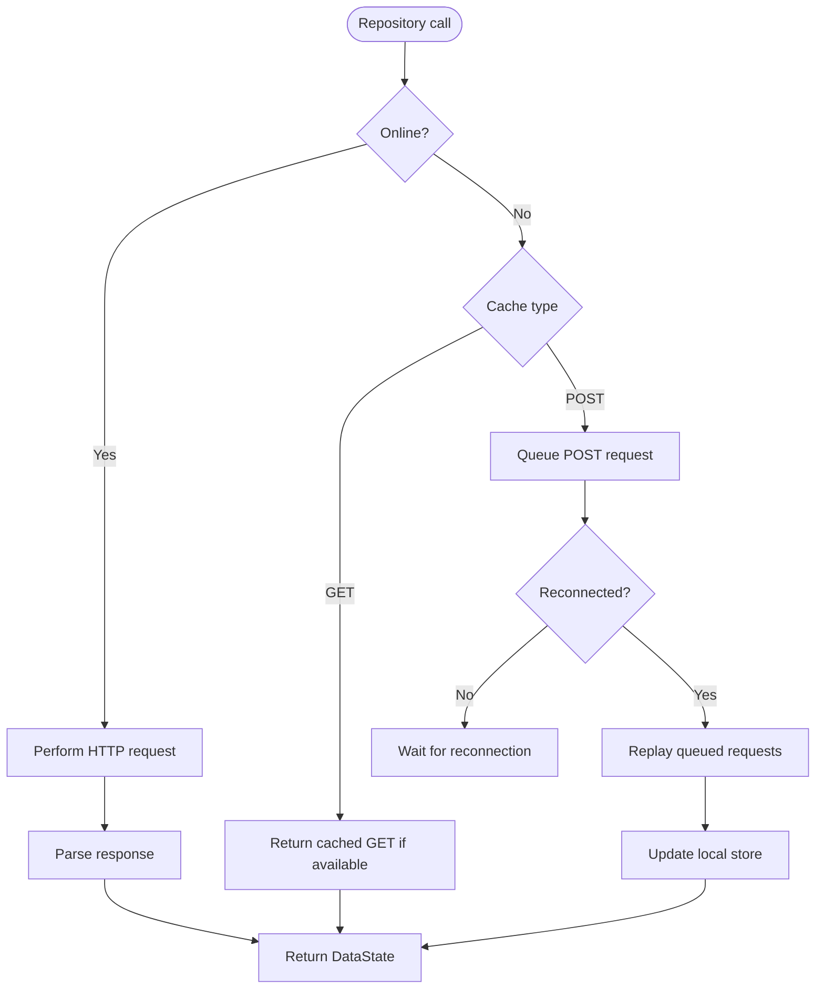
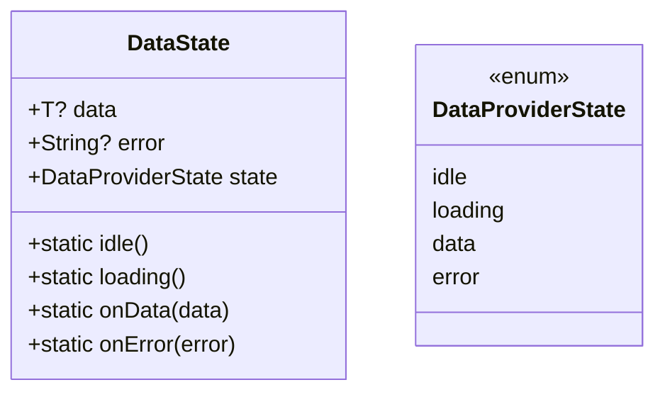
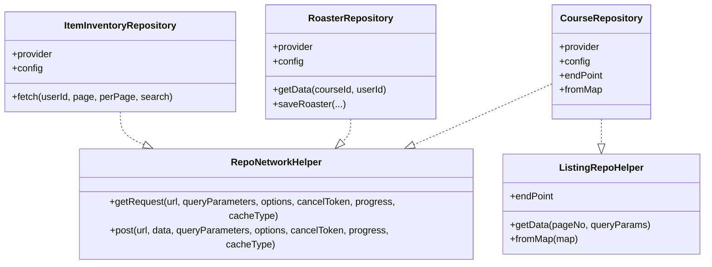
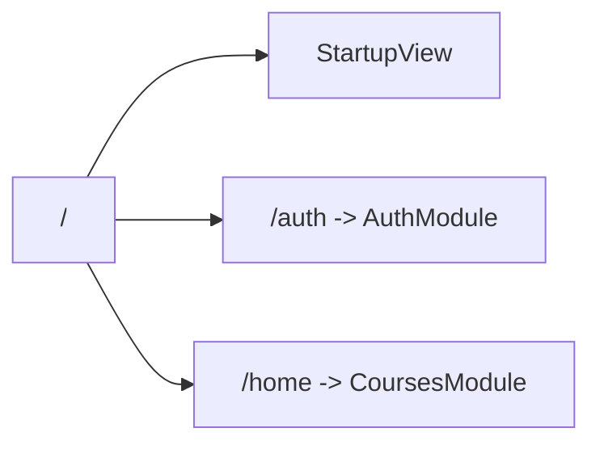
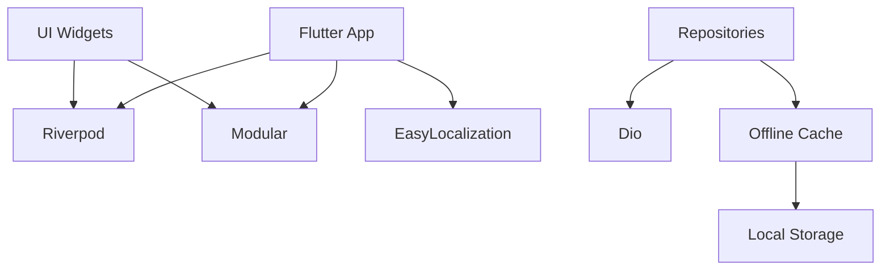

# Developer Guide

<cite>
**Referenced Files in This Document**
- [README.md](file://README.md)
- [pubspec.yaml](file://pubspec.yaml)
- [analysis_options.yaml](file://analysis_options.yaml)
- [main.dart](file://lib/main.dart)
- [app_module.dart](file://lib/app_module.dart)
- [core.dart](file://lib/app/core/core.dart)
- [data_state.dart](file://lib/app/core/logic/data_state/data_state.dart)
- [repo_network_helper.dart](file://lib/app/core/logic/repository/repo_network_helper.dart)
- [cached_request_repository.dart](file://lib/app/core/logic/repository/cached_request_repository.dart)
- [request_cache_provider.dart](file://lib/app/core/provider/request_cache_provider.dart)
- [course_repository.dart](file://lib/app/features/courses/repository/course_repository.dart)
- [roaster_repository.dart](file://lib/app/features/courses/repository/roaster_repository.dart)
- [item_inventory_repository.dart](file://lib/app/features/dashboard/repository/item_inventory_repository.dart)
- [devtools_options.yaml](file://devtools_options.yaml)
- [flutter_launcher_icons.yaml](file://flutter_launcher_icons.yaml)
- [widget_test.dart](file://test/widget_test.dart)
- [purchase_record_test.dart](file://test/payment/purchase_record_test.dart)
- [dev_cors_proxy.js](file://dev_cors_proxy.js)
</cite>

## Table of Contents
1. Introduction
2. Project Structure
3. Core Components
4. Architecture Overview
5. Detailed Component Analysis
6. Dependency Analysis
7. Performance Considerations
8. Troubleshooting Guide
9. Conclusion
10. Appendices

## Introduction
This developer guide documents the Leadership Edge Live LMS codebase with a focus on coding standards, style guidelines, best practices, development workflow, debugging and profiling, performance optimization, contribution and review processes, and how to extend the application while maintaining quality through static analysis and testing. The project is a Flutter application that uses Riverpod for state management, Dio for networking, Modular for routing, and includes offline caching and localization support.

**Section sources**
- [README.md:1-19](file://README.md#L1-L19)

## Project Structure
The repository follows a feature-based organization under lib/app with shared core utilities and providers at lib/app/core. Platform-specific configurations live under android/, ios/, web/, windows/, macos/, linux/. Tests are under test/. Configuration files include pubspec.yaml (dependencies and build settings), analysis_options.yaml (linting), devtools_options.yaml (DevTools configuration), flutter_launcher_icons.yaml (icons generation), and dev_cors_proxy.js (local CORS proxy for web development).

**Diagram sources**
- [main.dart:16-38](file://lib/main.dart#L16-L38)
- [app_module.dart:7-20](file://lib/app_module.dart#L7-L20)
- [core.dart:1-38](file://lib/app/core/core.dart#L1-L38)
- [repo_network_helper.dart:31-42](file://lib/app/core/logic/repository/repo_network_helper.dart#L31-L42)
- [request_cache_provider.dart:9-28](file://lib/app/core/provider/request_cache_provider.dart#L9-L28)
- [course_repository.dart:7-21](file://lib/app/features/courses/repository/course_repository.dart#L7-L21)
- [roaster_repository.dart:9-29](file://lib/app/features/courses/repository/roaster_repository.dart#L9-L29)
- [item_inventory_repository.dart:14-41](file://lib/app/features/dashboard/repository/item_inventory_repository.dart#L14-L41)

**Section sources**
- [pubspec.yaml:1-171](file://pubspec.yaml#L1-L171)
- [analysis_options.yaml:1-38](file://analysis_options.yaml#L1-L38)
- [devtools_options.yaml:1-4](file://devtools_options.yaml#L1-L4)
- [flutter_launcher_icons.yaml:1-35](file://flutter_launcher_icons.yaml#L1-L35)
- [dev_cors_proxy.js:1-75](file://dev_cors_proxy.js#L1-L75)

## Core Components
- Application bootstrap and modules:
  - Entry point initializes media kit, localization, and modular app with ProviderScope.
  - Routes define top-level navigation and module mounting.
- Networking and caching:
  - RepoNetworkConfig encapsulates base URL, auth token, connectivity provider, and manual offline mode toggle.
  - Request cache provider persists GET responses and queues POST requests when offline; replays queued requests on reconnection.
- Data state modeling:
  - DataState<T> represents idle/loading/data/error states for consistent UI handling.
- Repositories:
  - Feature repositories use mixins to standardize network calls, pagination, and parsing.

**Section sources**
- [main.dart:16-38](file://lib/main.dart#L16-L38)
- [app_module.dart:7-20](file://lib/app_module.dart#L7-L20)
- [repo_network_helper.dart:31-42](file://lib/app/core/logic/repository/repo_network_helper.dart#L31-L42)
- [request_cache_provider.dart:9-79](file://lib/app/core/provider/request_cache_provider.dart#L9-L79)
- [data_state.dart:1-22](file://lib/app/core/logic/data_state/data_state.dart#L1-L22)
- [course_repository.dart:7-21](file://lib/app/features/courses/repository/course_repository.dart#L7-L21)
- [roaster_repository.dart:9-29](file://lib/app/features/courses/repository/roaster_repository.dart#L9-L29)
- [item_inventory_repository.dart:14-41](file://lib/app/features/dashboard/repository/item_inventory_repository.dart#L14-L41)

## Architecture Overview
The app bootstraps with main.dart, sets up localization and media playback, then mounts Modular routes. Features register their own modules and screens. Repositories abstract API calls using a shared networking helper with offline caching and request queuing. State flows from providers to widgets via Riverpod.

**Diagram sources**
- [main.dart:16-38](file://lib/main.dart#L16-L38)
- [app_module.dart:7-20](file://lib/app_module.dart#L7-L20)
- [repo_network_helper.dart:286-312](file://lib/app/core/logic/repository/repo_network_helper.dart#L286-L312)
- [request_cache_provider.dart:63-79](file://lib/app/core/provider/request_cache_provider.dart#L63-L79)
- [course_repository.dart:7-21](file://lib/app/features/courses/repository/course_repository.dart#L7-L21)

## Detailed Component Analysis

### Networking and Offline Caching
- RepoNetworkConfig centralizes server URL, auth token, connectivity provider, and a manual offline toggle. It enables consistent behavior across repositories.
- RepoNetworkHelper provides getRequest/post methods with optional caching and offline queuing. When offline, it either returns cached GET responses or queues POST requests for later replay.
- RequestCacheProvider listens to connectivity changes and replays queued POST requests once online, updating local storage accordingly.

**Diagram sources**
- [repo_network_helper.dart:286-312](file://lib/app/core/logic/repository/repo_network_helper.dart#L286-L312)
- [request_cache_provider.dart:63-79](file://lib/app/core/provider/request_cache_provider.dart#L63-L79)

**Section sources**
- [repo_network_helper.dart:31-42](file://lib/app/core/logic/repository/repo_network_helper.dart#L31-L42)
- [repo_network_helper.dart:286-312](file://lib/app/core/logic/repository/repo_network_helper.dart#L286-L312)
- [request_cache_provider.dart:9-79](file://lib/app/core/provider/request_cache_provider.dart#L9-L79)
- [cached_request_repository.dart:9-31](file://lib/app/core/logic/repository/cached_request_repository.dart#L9-L31)

### Data State Model
- DataState<T> models lifecycle states (idle, loading, data, error) with typed data and error fields.
- Use this model consistently across features to drive UI states and error handling.

**Diagram sources**
- [data_state.dart:1-22](file://lib/app/core/logic/data_state/data_state.dart#L1-L22)

**Section sources**
- [data_state.dart:1-22](file://lib/app/core/logic/data_state/data_state.dart#L1-L22)

### Repository Patterns
- Repositories implement feature-specific endpoints using RepoNetworkHelper and ListingRepoHelper where applicable.
- Examples:
  - CourseRepository: paginated listing endpoint with mapping to Course.
  - RoasterRepository: posts user roaster data and parses into Roaster.
  - ItemInventoryRepository: fetches inventory items with search and pagination.

**Diagram sources**
- [repo_network_helper.dart:286-312](file://lib/app/core/logic/repository/repo_network_helper.dart#L286-L312)
- [listing_repo_helper.dart:1-24](file://lib/app/core/logic/repository/listing_repo_helper.dart#L1-L24)
- [course_repository.dart:7-21](file://lib/app/features/courses/repository/course_repository.dart#L7-L21)
- [roaster_repository.dart:9-43](file://lib/app/features/courses/repository/roaster_repository.dart#L9-L43)
- [item_inventory_repository.dart:14-41](file://lib/app/features/dashboard/repository/item_inventory_repository.dart#L14-L41)

**Section sources**
- [course_repository.dart:7-21](file://lib/app/features/courses/repository/course_repository.dart#L7-L21)
- [roaster_repository.dart:9-43](file://lib/app/features/courses/repository/roaster_repository.dart#L9-L43)
- [item_inventory_repository.dart:14-41](file://lib/app/features/dashboard/repository/item_inventory_repository.dart#L14-L41)

### Routing and Module Organization
- AppModule defines root route and mounts feature modules for authentication and courses.
- Keep each feature self-contained with its own module, views, viewmodels, and repositories.

**Diagram sources**
- [app_module.dart:7-20](file://lib/app_module.dart#L7-L20)

**Section sources**
- [app_module.dart:7-20](file://lib/app_module.dart#L7-L20)

## Dependency Analysis
Key dependencies and their roles:
- flutter_riverpod: state management and dependency injection.
- dio: HTTP client used by RepoNetworkHelper.
- flutter_modular: routing and module composition.
- easy_localization: i18n setup in main.dart.
- flutter_inappwebview: in-app WebView for sessions.
- media_kit: cross-platform media playback.
- hive_flutter: local storage (via LocalStorage provider referenced in cache logic).
- flutter_cache_manager: asset/media caching.
- form_validator, table_calendar, url_launcher: UI and utility features.

**Diagram sources**
- [pubspec.yaml:30-121](file://pubspec.yaml#L30-L121)
- [main.dart:16-38](file://lib/main.dart#L16-L38)
- [repo_network_helper.dart:286-312](file://lib/app/core/logic/repository/repo_network_helper.dart#L286-L312)
- [request_cache_provider.dart:9-28](file://lib/app/core/provider/request_cache_provider.dart#L9-L28)

**Section sources**
- [pubspec.yaml:30-121](file://pubspec.yaml#L30-L121)

## Performance Considerations
- Prefer minimal rebuilds by scoping Riverpod providers and avoiding unnecessary widget rebuilds.
- Use caching for read-heavy endpoints via RequestCacheProvider to reduce network overhead.
- Leverage media_kit for efficient cross-platform media playback.
- Avoid heavy synchronous operations on the UI thread; offload work to isolates or background tasks where appropriate.
- Use pagination in repositories to limit payload sizes and improve responsiveness.

[No sources needed since this section provides general guidance]

## Troubleshooting Guide
- Web CORS issues during development:
  - Use the provided Node.js CORS proxy to forward requests to staging and inject required headers.
  - Run the proxy and configure your app’s SERVER_URL to point to localhost:8081/api/web/.
- Offline behavior:
  - Verify RequestCacheProvider listeners are active and that queued POST requests are replayed upon reconnection.
  - Ensure LocalStorage provider is correctly configured for persistence.
- Media playback:
  - Confirm MediaKit.ensureInitialized() is called before runApp.
- Static analysis and linting:
  - Run flutter analyze to catch issues early; customize rules in analysis_options.yaml as needed.

**Section sources**
- [dev_cors_proxy.js:1-75](file://dev_cors_proxy.js#L1-L75)
- [request_cache_provider.dart:63-79](file://lib/app/core/provider/request_cache_provider.dart#L63-L79)
- [main.dart:16-23](file://lib/main.dart#L16-L23)
- [analysis_options.yaml:1-38](file://analysis_options.yaml#L1-L38)

## Conclusion
This guide outlined the architecture, coding standards, and workflows for extending and maintaining the Leadership Edge Live LMS. By following the established patterns—using DataState for UI states, repositories with RepoNetworkHelper for networking, and RequestCacheProvider for offline resilience—you can add features consistently and maintain high code quality. Use DevTools, static analysis, and tests to ensure reliability and performance.

[No sources needed since this section summarizes without analyzing specific files]

## Appendices

### Coding Standards and Style Guidelines
- Use Riverpod providers for state and dependency injection; keep providers focused and composable.
- Wrap all network responses in DataState to unify loading and error handling in UI.
- Follow feature-based folder structure: features/<feature>/... with module, viewmodel, repository, and model co-located.
- Name conventions:
  - Providers: PascalCase classes with .provider static field.
  - Repositories: PascalCase ending with Repository.
  - Models: PascalCase with fromJson/toJson methods.
- Linting:
  - Enforce flutter_lints via analysis_options.yaml; run flutter analyze regularly.

**Section sources**
- [analysis_options.yaml:1-38](file://analysis_options.yaml#L1-L38)
- [data_state.dart:1-22](file://lib/app/core/logic/data_state/data_state.dart#L1-L22)
- [core.dart:1-38](file://lib/app/core/core.dart#L1-L38)

### Development Workflow
- Setup:
  - Install dependencies with flutter pub get.
  - Configure environment variables (e.g., SERVER_URL) for local or staging environments.
- Running:
  - Mobile: flutter run -d <device>.
  - Web: flutter run -d chrome; optionally start dev_cors_proxy.js and set SERVER_URL to http://localhost:8081/api/web/.
- Building:
  - Generate icons with flutter pub run flutter_launcher_icons.
  - Build platforms using flutter build commands.

**Section sources**
- [pubspec.yaml:127-171](file://pubspec.yaml#L127-L171)
- [flutter_launcher_icons.yaml:1-35](file://flutter_launcher_icons.yaml#L1-L35)
- [dev_cors_proxy.js:10-13](file://dev_cors_proxy.js#L10-L13)

### Debugging and Profiling
- Use Flutter DevTools for performance profiling, memory inspection, and widget tree exploration.
- Enable logging in debug builds; avoid print statements in production.
- For web CORS issues, rely on dev_cors_proxy.js during development.

**Section sources**
- [devtools_options.yaml:1-4](file://devtools_options.yaml#L1-L4)
- [dev_cors_proxy.js:1-75](file://dev_cors_proxy.js#L1-L75)

### Testing Strategy
- Unit tests:
  - Test pure Dart logic such as model serialization and business rules.
- Widget tests:
  - Validate UI interactions and state transitions using flutter_test.
- Example locations:
  - Payment domain unit tests for purchase records.
  - Basic widget smoke test for app entry.

**Section sources**
- [purchase_record_test.dart:1-22](file://test/payment/purchase_record_test.dart#L1-L22)
- [widget_test.dart:1-31](file://test/widget_test.dart#L1-L31)

### Contribution Guidelines and Pull Requests
- Branching:
  - Create feature branches from main; name them descriptively (e.g., feature/add-course-player).
- Commit messages:
  - Use conventional commits (e.g., feat:, fix:, chore:) with concise descriptions.
- Pull requests:
  - Include a clear description of changes, related issues, and screenshots/videos if UI changes.
  - Ensure tests pass and static analysis is clean before requesting review.
- Code review:
  - Focus on correctness, readability, adherence to patterns (DataState, repositories), and performance implications.

[No sources needed since this section provides general guidance]

### Extending the Application
- Add a new feature:
  - Create lib/app/features/<feature>/ with module, viewmodel, repository, and model.
  - Register routes in AppModule or within the feature module.
  - Implement repositories using RepoNetworkHelper and ListingRepoHelper where applicable.
  - Use DataState to manage UI states in views.
- Integrate new services:
  - Add dependencies in pubspec.yaml and initialize them in main.dart if necessary.
  - Expose providers for DI via Riverpod.

**Section sources**
- [app_module.dart:7-20](file://lib/app_module.dart#L7-L20)
- [repo_network_helper.dart:286-312](file://lib/app/core/logic/repository/repo_network_helper.dart#L286-L312)
- [pubspec.yaml:30-121](file://pubspec.yaml#L30-L121)