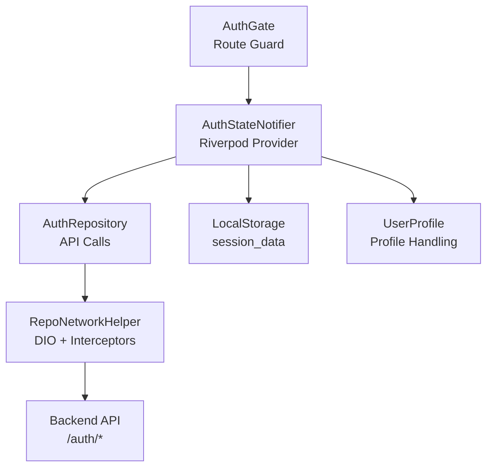
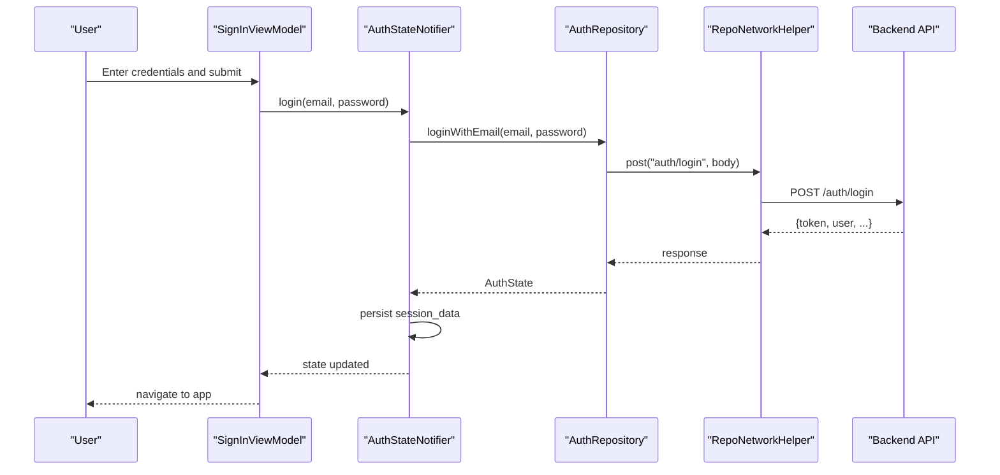
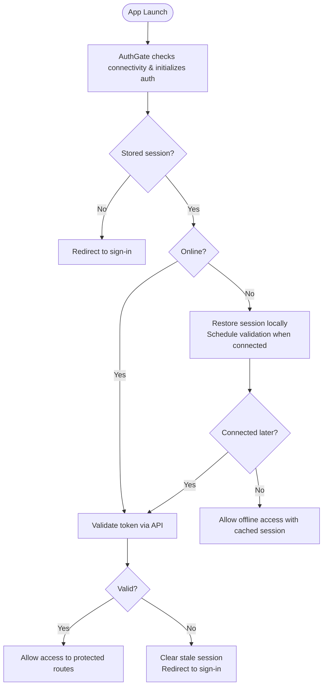
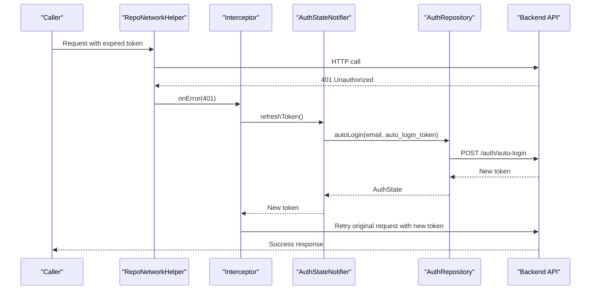
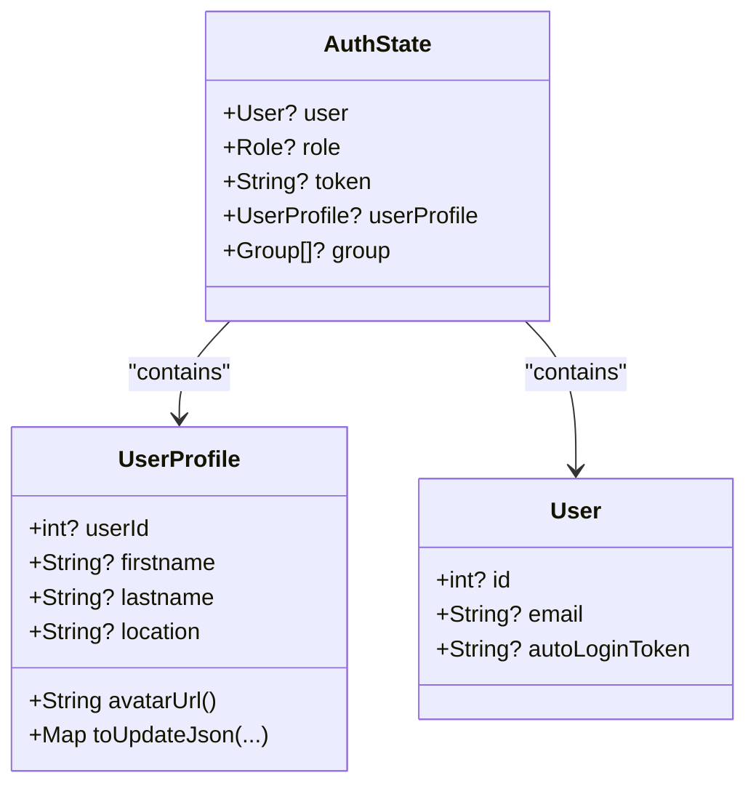
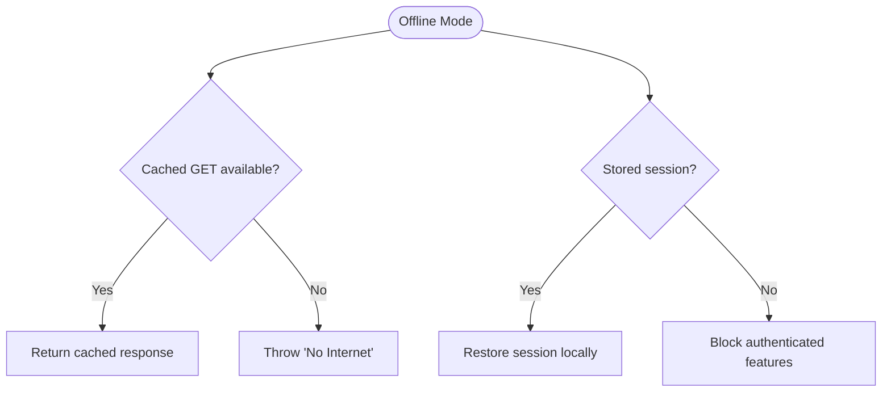
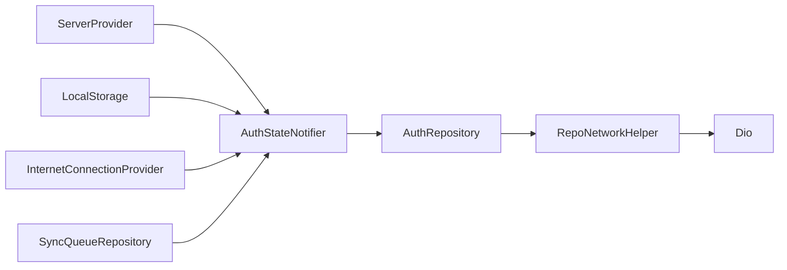

# Authentication System

<cite>
**Referenced Files in This Document**
- [auth_state_provider.dart](file://lib/app/features/authentication/app_state/auth_state_provider.dart)
- [auth_repository.dart](file://lib/app/features/authentication/repository/auth_repository.dart)
- [auth_gate.dart](file://lib/app/features/authentication/view/auth_gate.dart)
- [signin_viewmodel.dart](file://lib/app/features/authentication/viewmodel/signin_viewmodel.dart)
- [repo_network_helper.dart](file://lib/app/core/logic/repository/repo_network_helper.dart)
- [data_state_builder.dart](file://lib/app/core/views/elements/data_state_builder.dart)
- [unauthorized_handler.dart](file://lib/app/core/views/elements/unauthorized_handler.dart)
- [auth_state.dart](file://lib/app/features/authentication/model/auth_state.dart)
</cite>

## Table of Contents
1. Introduction
2. Project Structure
3. Core Components
4. Architecture Overview
5. Detailed Component Analysis
6. Dependency Analysis
7. Performance Considerations
8. Troubleshooting Guide
9. Conclusion

## Introduction
This document explains the Authentication System feature module, covering user login, session management, token refresh, profile handling, repository pattern usage, Riverpod state management, network integration, security measures, error handling, offline capabilities, authentication guards, and automatic session renewal. It is designed to be accessible to both technical and non-technical readers while remaining grounded in the actual codebase.

## Project Structure
The authentication system is organized into clear layers:
- UI and routing guard: AuthGate ensures only authenticated users access protected routes.
- State management: AuthStateNotifier (Riverpod) owns the current authentication state and persists sessions.
- Repository layer: AuthRepository encapsulates API calls for login, auto-login, and token validation.
- Network layer: RepoNetworkHelper provides HTTP transport, caching, offline behavior, and automatic token refresh on 401.
- Models: AuthState, User, Role, Group, UserProfile define data contracts and serialization helpers.

**Diagram sources**
- [auth_gate.dart:1-69](file://lib/app/features/authentication/view/auth_gate.dart#L1-L69)
- [auth_state_provider.dart:1-203](file://lib/app/features/authentication/app_state/auth_state_provider.dart#L1-L203)
- [auth_repository.dart:1-66](file://lib/app/features/authentication/repository/auth_repository.dart#L1-L66)
- [repo_network_helper.dart:31-126](file://lib/app/core/logic/repository/repo_network_helper.dart#L31-L126)
- [auth_state.dart:12-93](file://lib/app/features/authentication/model/auth_state.dart#L12-L93)

**Section sources**
- [auth_gate.dart:1-69](file://lib/app/features/authentication/view/auth_gate.dart#L1-L69)
- [auth_state_provider.dart:1-203](file://lib/app/features/authentication/app_state/auth_state_provider.dart#L1-L203)
- [auth_repository.dart:1-66](file://lib/app/features/authentication/repository/auth_repository.dart#L1-L66)
- [repo_network_helper.dart:31-126](file://lib/app/core/logic/repository/repo_network_helper.dart#L31-L126)
- [auth_state.dart:12-93](file://lib/app/features/authentication/model/auth_state.dart#L12-L93)

## Core Components
- AuthStateNotifier (Riverpod): Manages login, logout, profile updates, initialization from persisted session, and token refresh coordination. Persists session data locally and exposes a single source of truth for auth state across the app.
- AuthRepository: Encapsulates authentication endpoints (login, auto-login, validate-token). Uses RepoNetworkHelper for HTTP operations with consistent headers and caching controls.
- RepoNetworkHelper: Provides Dio-based networking, offline mode support, request caching, and an interceptor that automatically retries failed requests after refreshing tokens via a provided callback.
- AuthGate: A route guard that initializes connectivity and auth state, then redirects unauthenticated users to the sign-in screen.
- SignInViewModel: Bridges UI inputs to AuthStateNotifier.login, keeping view logic separate from state and network concerns.
- Data models: AuthState, User, Role, Group, UserProfile provide typed representations and JSON serialization utilities used throughout the flow.

**Section sources**
- [auth_state_provider.dart:15-203](file://lib/app/features/authentication/app_state/auth_state_provider.dart#L15-L203)
- [auth_repository.dart:7-66](file://lib/app/features/authentication/repository/auth_repository.dart#L7-L66)
- [repo_network_helper.dart:72-126](file://lib/app/core/logic/repository/repo_network_helper.dart#L72-L126)
- [auth_gate.dart:8-69](file://lib/app/features/authentication/view/auth_gate.dart#L8-L69)
- [signin_viewmodel.dart:11-52](file://lib/app/features/authentication/viewmodel/signin_viewmodel.dart#L11-L52)
- [auth_state.dart:12-93](file://lib/app/features/authentication/model/auth_state.dart#L12-L93)

## Architecture Overview
The authentication architecture follows a layered approach:
- UI triggers actions (sign-in, profile update, logout).
- ViewModels call into AuthStateNotifier.
- AuthStateNotifier uses AuthRepository for network calls.
- RepoNetworkHelper handles HTTP, offline behavior, and automatic token refresh on 401.
- Session persistence ensures seamless recovery across app restarts.
- AuthGate protects routes by checking the current auth state.

**Diagram sources**
- [signin_viewmodel.dart:37-45](file://lib/app/features/authentication/viewmodel/signin_viewmodel.dart#L37-L45)
- [auth_state_provider.dart:42-69](file://lib/app/features/authentication/app_state/auth_state_provider.dart#L42-L69)
- [auth_repository.dart:16-27](file://lib/app/features/authentication/repository/auth_repository.dart#L16-L27)
- [repo_network_helper.dart:286-350](file://lib/app/core/logic/repository/repo_network_helper.dart#L286-L350)

## Detailed Component Analysis

### Authentication Flow: Login and Session Initialization
- Sign-in: The sign-in view model delegates to AuthStateNotifier.login, which attempts online login or falls back to restoring a cached session when offline. On success, it persists the session and updates the global state.
- Initialization: On app start, AuthGate initializes connectivity and calls AuthStateNotifier.initialize. If a session exists, it validates the token online; if offline, it restores the session and schedules validation when connectivity returns.

**Diagram sources**
- [auth_gate.dart:27-45](file://lib/app/features/authentication/view/auth_gate.dart#L27-L45)
- [auth_state_provider.dart:168-201](file://lib/app/features/authentication/app_state/auth_state_provider.dart#L168-L201)

**Section sources**
- [signin_viewmodel.dart:37-45](file://lib/app/features/authentication/viewmodel/signin_viewmodel.dart#L37-L45)
- [auth_state_provider.dart:42-69](file://lib/app/features/authentication/app_state/auth_state_provider.dart#L42-L69)
- [auth_state_provider.dart:168-201](file://lib/app/features/authentication/app_state/auth_state_provider.dart#L168-L201)
- [auth_gate.dart:27-45](file://lib/app/features/authentication/view/auth_gate.dart#L27-L45)

### Token Refresh Mechanism and Automatic Renewal
- Auto-login: When an API call fails with 401, RepoNetworkHelper’s interceptor invokes a provided refreshToken callback. AuthStateNotifier.refreshAccessToken uses the stored auto_login_token to obtain a fresh access token without prompting the user.
- Deduplication: Concurrent 401s are deduplicated so only one refresh runs at a time; other requests await the same in-flight refresh.
- Retry: After obtaining a new token, the interceptor retries the original request once with the updated Authorization header.

**Diagram sources**
- [repo_network_helper.dart:88-126](file://lib/app/core/logic/repository/repo_network_helper.dart#L88-L126)
- [auth_state_provider.dart:114-150](file://lib/app/features/authentication/app_state/auth_state_provider.dart#L114-L150)
- [auth_repository.dart:29-43](file://lib/app/features/authentication/repository/auth_repository.dart#L29-L43)

**Section sources**
- [repo_network_helper.dart:88-126](file://lib/app/core/logic/repository/repo_network_helper.dart#L88-L126)
- [auth_state_provider.dart:114-150](file://lib/app/features/authentication/app_state/auth_state_provider.dart#L114-L150)
- [auth_repository.dart:29-43](file://lib/app/features/authentication/repository/auth_repository.dart#L29-L43)

### Profile Handling and Updates
- Profile model: UserProfile includes fields for display, contact preferences, and admin-managed restrictions. It also provides a method to build update payloads for profile edits.
- Global sync: AuthStateNotifier.updateProfile merges changes into the global auth state and persists them, ensuring the app bar and other consumers see updated profile data immediately.
- Avatar URL: UserProfile.avatarUrl safely constructs full URLs by combining base and path segments.

**Diagram sources**
- [auth_state.dart:12-93](file://lib/app/features/authentication/model/auth_state.dart#L12-L93)
- [auth_state.dart:382-671](file://lib/app/features/authentication/model/auth_state.dart#L382-L671)

**Section sources**
- [auth_state_provider.dart:71-112](file://lib/app/features/authentication/app_state/auth_state_provider.dart#L71-L112)
- [auth_state.dart:382-671](file://lib/app/features/authentication/model/auth_state.dart#L382-L671)

### Offline Authentication Capabilities
- Offline login fallback: When offline, login restores a previously saved session if available, allowing limited functionality without connectivity.
- Offline scheduling: During initialization, if offline, the app restores the session and schedules token validation when connectivity returns.
- Network helper: Requests can be cached or queued depending on cache type; offline mode throws a clear exception when no cached data is available.

**Diagram sources**
- [repo_network_helper.dart:257-283](file://lib/app/core/logic/repository/repo_network_helper.dart#L257-L283)
- [auth_state_provider.dart:168-184](file://lib/app/features/authentication/app_state/auth_state_provider.dart#L168-L184)

**Section sources**
- [repo_network_helper.dart:257-283](file://lib/app/core/logic/repository/repo_network_helper.dart#L257-L283)
- [auth_state_provider.dart:168-184](file://lib/app/features/authentication/app_state/auth_state_provider.dart#L168-L184)

### Security Measures
- Bearer token injection: All authenticated requests include an Authorization header derived from the current token.
- Token validation: On app startup, the existing token is validated against the server; invalid tokens trigger re-authentication flows.
- Auto-login token: A dedicated auto_login_token is used to refresh access tokens without exposing passwords.
- Error sanitization: Unauthorized errors are converted to user-friendly messages and prompt re-login.

**Section sources**
- [repo_network_helper.dart:63-69](file://lib/app/core/logic/repository/repo_network_helper.dart#L63-L69)
- [auth_state_provider.dart:186-201](file://lib/app/features/authentication/app_state/auth_state_provider.dart#L186-L201)
- [data_state_builder.dart:12-20](file://lib/app/core/views/elements/data_state_builder.dart#L12-L20)

### Error Handling Strategies
- Unauthorized handling: Centralized helpers detect unauthorized errors and guide users to log in again.
- Friendly messages: UI builders translate raw exceptions into concise, actionable messages.
- Logout on expiry: When a session expires, the app clears state and navigates to the sign-in screen.

**Section sources**
- [unauthorized_handler.dart:26-67](file://lib/app/core/views/elements/unauthorized_handler.dart#L26-L67)
- [data_state_builder.dart:12-20](file://lib/app/core/views/elements/data_state_builder.dart#L12-L20)

### Authentication Guards and Route Protection
- AuthGate: Ensures connectivity and auth state are initialized before rendering protected content. Redirects to sign-in if no valid session exists.
- Integration: Modular routing is used to navigate to the authentication module when needed.

**Section sources**
- [auth_gate.dart:27-69](file://lib/app/features/authentication/view/auth_gate.dart#L27-L69)
- [auth_module.dart:5-10](file://lib/app/features/authentication/module/auth_module.dart#L5-L10)

## Dependency Analysis
The authentication system composes several core dependencies:
- Riverpod providers supply configuration (server URL), storage, and connection status.
- AuthRepository depends on RepoNetworkHelper for HTTP operations.
- RepoNetworkHelper depends on Dio and optional caching/offline providers.
- AuthStateNotifier depends on AuthRepository, LocalStorage, and SyncQueueRepository to manage state and cleanup.

**Diagram sources**
- [auth_state_provider.dart:15-32](file://lib/app/features/authentication/app_state/auth_state_provider.dart#L15-L32)
- [auth_repository.dart:7-15](file://lib/app/features/authentication/repository/auth_repository.dart#L7-L15)
- [repo_network_helper.dart:72-126](file://lib/app/core/logic/repository/repo_network_helper.dart#L72-L126)

**Section sources**
- [auth_state_provider.dart:15-32](file://lib/app/features/authentication/app_state/auth_state_provider.dart#L15-L32)
- [auth_repository.dart:7-15](file://lib/app/features/authentication/repository/auth_repository.dart#L7-L15)
- [repo_network_helper.dart:72-126](file://lib/app/core/logic/repository/repo_network_helper.dart#L72-L126)

## Performance Considerations
- Token refresh deduplication prevents redundant network calls during concurrent 401 events.
- Profile update avoids unnecessary state replacements by comparing relevant fields before updating.
- Network timeouts are configured to prevent indefinite loading states.
- Offline caching reduces unnecessary network traffic for read-heavy screens.

[No sources needed since this section provides general guidance]

## Troubleshooting Guide
Common issues and resolutions:
- Session expired: Occurs when the access token is invalid. The app shows a friendly message and prompts re-login.
- No internet: Offline mode may return cached responses or throw a clear exception; ensure connectivity or rely on cached data.
- Stale profile: Ensure profile updates call the global update method to keep app-wide state synchronized.

**Section sources**
- [unauthorized_handler.dart:26-67](file://lib/app/core/views/elements/unauthorized_handler.dart#L26-L67)
- [repo_network_helper.dart:257-283](file://lib/app/core/logic/repository/repo_network_helper.dart#L257-L283)
- [auth_state_provider.dart:71-112](file://lib/app/features/authentication/app_state/auth_state_provider.dart#L71-L112)

## Conclusion
The Authentication System provides a robust, secure, and user-friendly experience through clear separation of concerns: UI, state management, repository, and network layers. It supports seamless login, automatic token refresh, offline resilience, and guarded routes. The design minimizes complexity for developers while delivering reliable behavior for end users.

[No sources needed since this section summarizes without analyzing specific files]