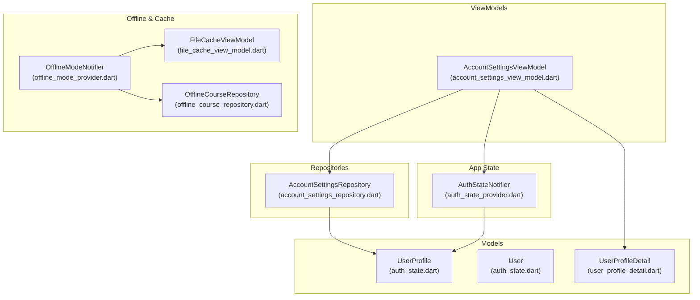
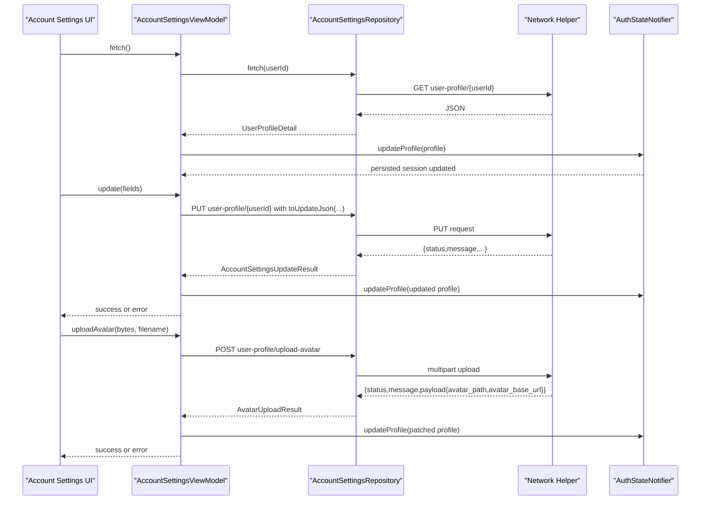
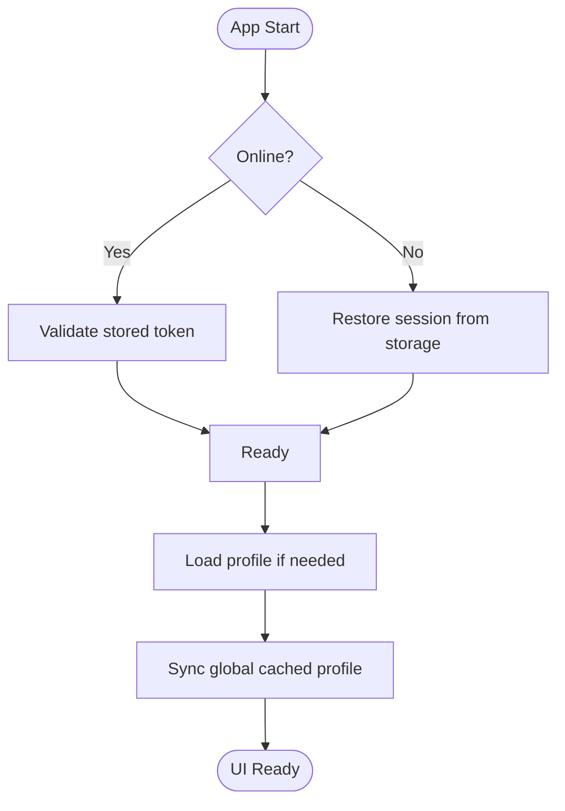
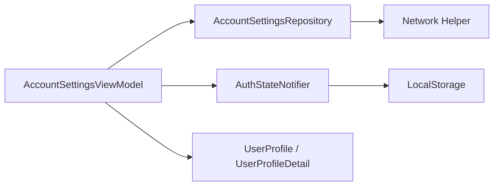
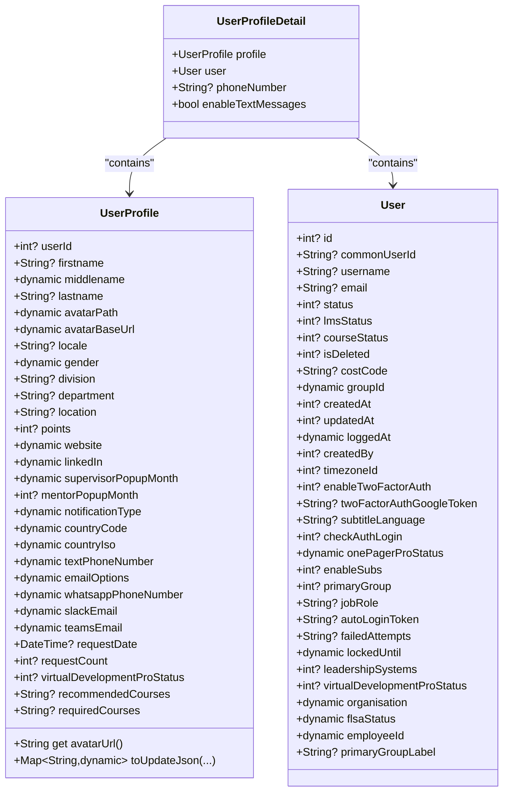

# Profile Management

<cite>
**Referenced Files in This Document**
- [auth_state.dart](file://lib/app/features/authentication/model/auth_state.dart)
- [user_profile_detail.dart](file://lib/app/features/dashboard/model/user_profile_detail.dart)
- [account_settings_view_model.dart](file://lib/app/features/dashboard/viewmodel/account_settings_view_model.dart)
- [account_settings_repository.dart](file://lib/app/features/dashboard/repository/account_settings_repository.dart)
- [auth_state_provider.dart](file://lib/app/features/authentication/app_state/auth_state_provider.dart)
- [offline_mode_provider.dart](file://lib/app/core/provider/offline_mode_provider.dart)
- [offline_course_repository.dart](file://lib/app/features/courses/repository/offline_course_repository.dart)
- [file_cache_view_model.dart](file://lib/app/features/courses/viewmodel/file_cache_view_model.dart)
</cite>

## Table of Contents
1. [Introduction](#introduction)
2. [Project Structure](#project-structure)
3. [Core Components](#core-components)
4. [Architecture Overview](#architecture-overview)
5. [Detailed Component Analysis](#detailed-component-analysis)
6. [Dependency Analysis](#dependency-analysis)
7. [Performance Considerations](#performance-considerations)
8. [Troubleshooting Guide](#troubleshooting-guide)
9. [Conclusion](#conclusion)
10. [Appendices](#appendices)

## Introduction
This document explains the Profile Management functionality implemented in the application. It covers:
- Profile data model definitions and transformations
- Validation rules and update operations
- Synchronization between local storage and server
- Repository implementation for profile CRUD and avatar upload
- UI integration patterns (display, forms, real-time sync)
- Caching strategies, offline access, and conflict resolution considerations

## Project Structure
Profile management spans several layers:
- Models define the user profile and related entities
- ViewModels orchestrate state, API calls, and UI updates
- Repositories encapsulate network requests and response mapping
- App-wide state persists and shares the current profile across screens
- Offline utilities support caching and background synchronization

**Diagram sources**
- [auth_state.dart:382-671](file://lib/app/features/authentication/model/auth_state.dart#L382-L671)
- [user_profile_detail.dart:1-30](file://lib/app/features/dashboard/model/user_profile_detail.dart#L1-L30)
- [account_settings_view_model.dart:1-239](file://lib/app/features/dashboard/viewmodel/account_settings_view_model.dart#L1-L239)
- [account_settings_repository.dart:1-165](file://lib/app/features/dashboard/repository/account_settings_repository.dart#L1-L165)
- [auth_state_provider.dart:1-203](file://lib/app/features/authentication/app_state/auth_state_provider.dart#L1-L203)
- [offline_mode_provider.dart:1-36](file://lib/app/core/provider/offline_mode_provider.dart#L1-L36)
- [file_cache_view_model.dart:38-461](file://lib/app/features/courses/viewmodel/file_cache_view_model.dart#L38-L461)
- [offline_course_repository.dart:34-192](file://lib/app/features/courses/repository/offline_course_repository.dart#L34-L192)

**Section sources**
- [auth_state.dart:382-671](file://lib/app/features/authentication/model/auth_state.dart#L382-L671)
- [user_profile_detail.dart:1-30](file://lib/app/features/dashboard/model/user_profile_detail.dart#L1-L30)
- [account_settings_view_model.dart:1-239](file://lib/app/features/dashboard/viewmodel/account_settings_view_model.dart#L1-L239)
- [account_settings_repository.dart:1-165](file://lib/app/features/dashboard/repository/account_settings_repository.dart#L1-L165)
- [auth_state_provider.dart:1-203](file://lib/app/features/authentication/app_state/auth_state_provider.dart#L1-L203)
- [offline_mode_provider.dart:1-36](file://lib/app/core/provider/offline_mode_provider.dart#L1-L36)
- [file_cache_view_model.dart:38-461](file://lib/app/features/courses/viewmodel/file_cache_view_model.dart#L38-L461)
- [offline_course_repository.dart:34-192](file://lib/app/features/courses/repository/offline_course_repository.dart#L34-L192)

## Core Components
- UserProfile model: Defines all profile fields, JSON serialization/deserialization, avatar URL composition, and a dedicated update payload builder that matches the server’s PUT schema.
- UserProfileDetail: Wraps profile, user, phone number, and text message preference from GET responses.
- AccountSettingsViewModel: Loads profile, applies edits, uploads avatars, toggles preferences, and synchronizes app-wide cached profile.
- AccountSettingsRepository: Performs GET/PUT for profile and POST for avatar upload; maps server responses to typed results.
- AuthStateNotifier: Persists session and profile, keeps app-wide profile in sync, handles token refresh and offline initialization.
- Offline utilities: Provide offline mode toggle and file caching mechanisms used elsewhere in the app.

Key responsibilities:
- Data modeling and transformation: [auth_state.dart:382-671](file://lib/app/features/authentication/model/auth_state.dart#L382-L671), [user_profile_detail.dart:1-30](file://lib/app/features/dashboard/model/user_profile_detail.dart#L1-L30)
- Business logic and orchestration: [account_settings_view_model.dart:1-239](file://lib/app/features/dashboard/viewmodel/account_settings_view_model.dart#L1-L239)
- Network operations and mapping: [account_settings_repository.dart:1-165](file://lib/app/features/dashboard/repository/account_settings_repository.dart#L1-L165)
- Global state and persistence: [auth_state_provider.dart:1-203](file://lib/app/features/authentication/app_state/auth_state_provider.dart#L1-L203)

**Section sources**
- [auth_state.dart:382-671](file://lib/app/features/authentication/model/auth_state.dart#L382-L671)
- [user_profile_detail.dart:1-30](file://lib/app/features/dashboard/model/user_profile_detail.dart#L1-L30)
- [account_settings_view_model.dart:1-239](file://lib/app/features/dashboard/viewmodel/account_settings_view_model.dart#L1-L239)
- [account_settings_repository.dart:1-165](file://lib/app/features/dashboard/repository/account_settings_repository.dart#L1-L165)
- [auth_state_provider.dart:1-203](file://lib/app/features/authentication/app_state/auth_state_provider.dart#L1-L203)

## Architecture Overview
The profile flow combines models, viewmodels, repositories, and global state to provide a consistent experience across online and offline contexts.

**Diagram sources**
- [account_settings_view_model.dart:43-209](file://lib/app/features/dashboard/viewmodel/account_settings_view_model.dart#L43-L209)
- [account_settings_repository.dart:42-131](file://lib/app/features/dashboard/repository/account_settings_repository.dart#L42-L131)
- [auth_state_provider.dart:71-99](file://lib/app/features/authentication/app_state/auth_state_provider.dart#L71-L99)

## Detailed Component Analysis

### Profile Model Definitions and Transformations
- UserProfile contains identity, contact, preferences, and admin-managed restriction fields. It provides:
  - Robust JSON parsing with type coercion helpers
  - Avatar URL composition ensuring correct base/path joining
  - A dedicated update payload builder aligned with the server’s PUT endpoint
- UserProfileDetail wraps profile, user, phone number, and text message preference from GET responses.

Validation and transformation highlights:
- Numeric fields are coerced safely via helper functions
- Date fields are parsed and formatted consistently
- Update payloads exclude non-editable fields while preserving admin-managed fields to avoid overwrites

**Section sources**
- [auth_state.dart:382-671](file://lib/app/features/authentication/model/auth_state.dart#L382-L671)
- [user_profile_detail.dart:1-30](file://lib/app/features/dashboard/model/user_profile_detail.dart#L1-L30)

### Profile Update Operations
- AccountSettingsViewModel.update builds an update body using UserProfile.toUpdateJson with only editable fields, then calls repository.update. On success, it patches local state and updates the global cached profile.
- Preference toggles (e.g., enable text messages) are saved immediately without full re-fetch.
- Password changes use a dedicated endpoint and return user-friendly errors.

Error handling:
- Friendly messages for unauthorized sessions and connectivity issues
- Graceful fallback when background refresh fails but data is already displayed

**Section sources**
- [account_settings_view_model.dart:79-238](file://lib/app/features/dashboard/viewmodel/account_settings_view_model.dart#L79-L238)

### Avatar Upload Handling and Profile Picture Management
- Avatar upload uses multipart POST to the upload endpoint. The response includes new avatar path and base URL.
- ViewModel patches only avatar fields onto the existing profile to avoid unnecessary screen refreshes.
- Global cached profile is updated so app-wide components reflect the new avatar immediately.

**Section sources**
- [account_settings_repository.dart:94-131](file://lib/app/features/dashboard/repository/account_settings_repository.dart#L94-L131)
- [account_settings_view_model.dart:177-209](file://lib/app/features/dashboard/viewmodel/account_settings_view_model.dart#L177-L209)

### Profile Display Components and Real-Time Synchronization
- Display: Use UserProfile.avatarUrl to render the avatar image reliably.
- Forms: Bind form inputs to editable fields; submit via ViewModel.update.
- Real-time sync: After any successful update, the ViewModel updates the global cached profile via AuthStateNotifier.updateProfile, ensuring other parts of the app (like the app bar) reflect changes without waiting for a full reload.

**Section sources**
- [auth_state.dart:461-475](file://lib/app/features/authentication/model/auth_state.dart#L461-L475)
- [account_settings_view_model.dart:118-145](file://lib/app/features/dashboard/viewmodel/account_settings_view_model.dart#L118-L145)
- [auth_state_provider.dart:71-99](file://lib/app/features/authentication/app_state/auth_state_provider.dart#L71-L99)

### Repository Implementation for Profile CRUD
- Fetch: GET user-profile/{userId}, maps to UserProfileDetail.
- Update: PUT user-profile/{userId} with a carefully constructed payload; returns success/failure with optional message.
- Upload Avatar: POST user-profile/upload-avatar with multipart; returns success/failure plus new avatar fields.
- Change Password: PUT user-profile/change-password with old/new password.

Response handling:
- Status codes/messages mapped to typed result objects
- Debug logs for key fields during development

**Section sources**
- [account_settings_repository.dart:42-165](file://lib/app/features/dashboard/repository/account_settings_repository.dart#L42-L165)

### Local Storage and Offline Access
- Session persistence: AuthStateNotifier stores and restores session data including profile on startup.
- Offline mode: OfflineModeNotifier allows forcing offline behavior; not directly tied to profile but affects network behavior globally.
- File caching: FileCacheViewModel and OfflineCourseRepository demonstrate encrypted on-disk caching and timestamp tracking used elsewhere in the app.

**Diagram sources**
- [auth_state_provider.dart:42-69](file://lib/app/features/authentication/app_state/auth_state_provider.dart#L42-L69)
- [auth_state_provider.dart:168-184](file://lib/app/features/authentication/app_state/auth_state_provider.dart#L168-L184)
- [offline_mode_provider.dart:1-36](file://lib/app/core/provider/offline_mode_provider.dart#L1-L36)
- [offline_course_repository.dart:168-192](file://lib/app/features/courses/repository/offline_course_repository.dart#L168-L192)
- [file_cache_view_model.dart:186-218](file://lib/app/features/courses/viewmodel/file_cache_view_model.dart#L186-L218)

**Section sources**
- [auth_state_provider.dart:42-69](file://lib/app/features/authentication/app_state/auth_state_provider.dart#L42-L69)
- [auth_state_provider.dart:168-184](file://lib/app/features/authentication/app_state/auth_state_provider.dart#L168-L184)
- [offline_mode_provider.dart:1-36](file://lib/app/core/provider/offline_mode_provider.dart#L1-L36)
- [offline_course_repository.dart:168-192](file://lib/app/features/courses/repository/offline_course_repository.dart#L168-L192)
- [file_cache_view_model.dart:186-218](file://lib/app/features/courses/viewmodel/file_cache_view_model.dart#L186-L218)

### Conflict Resolution Strategy
- Current implementation does not include explicit server-side versioning or conflict resolution for profile edits. Updates replace the whole profile via PUT; concurrent edits may overwrite each other.
- Recommended approach: Introduce optimistic updates with server timestamps or version tokens; on conflict, prompt users to merge changes or resolve conflicts before saving.

[No sources needed since this section provides general guidance]

## Dependency Analysis
Profile management depends on:
- Models for data contracts and transformations
- ViewModels for orchestration and state management
- Repositories for network I/O and response mapping
- Global state for cross-screen consistency and persistence
- Offline utilities for caching and mode control

**Diagram sources**
- [account_settings_view_model.dart:1-239](file://lib/app/features/dashboard/viewmodel/account_settings_view_model.dart#L1-L239)
- [account_settings_repository.dart:1-165](file://lib/app/features/dashboard/repository/account_settings_repository.dart#L1-L165)
- [auth_state_provider.dart:1-203](file://lib/app/features/authentication/app_state/auth_state_provider.dart#L1-L203)
- [auth_state.dart:382-671](file://lib/app/features/authentication/model/auth_state.dart#L382-L671)
- [user_profile_detail.dart:1-30](file://lib/app/features/dashboard/model/user_profile_detail.dart#L1-L30)

**Section sources**
- [account_settings_view_model.dart:1-239](file://lib/app/features/dashboard/viewmodel/account_settings_view_model.dart#L1-L239)
- [account_settings_repository.dart:1-165](file://lib/app/features/dashboard/repository/account_settings_repository.dart#L1-L165)
- [auth_state_provider.dart:1-203](file://lib/app/features/authentication/app_state/auth_state_provider.dart#L1-L203)
- [auth_state.dart:382-671](file://lib/app/features/authentication/model/auth_state.dart#L382-L671)
- [user_profile_detail.dart:1-30](file://lib/app/features/dashboard/model/user_profile_detail.dart#L1-L30)

## Performance Considerations
- Avoid full re-fetch after avatar upload; patch only avatar fields to minimize UI churn.
- De-duplicate profile updates by comparing relevant fields before replacing global state.
- Use targeted endpoints (update vs. full fetch) to reduce payload size and network usage.
- Persist session and profile to storage to prevent unnecessary network calls on cold starts.

[No sources needed since this section provides general guidance]

## Troubleshooting Guide
Common issues and resolutions:
- Unauthorized/session expired: User must log in again; handled by friendly error messaging.
- No internet connection: Prompt user to check network; background refresh leaves existing data intact.
- Avatar upload failures: Return clear messages; ensure multipart payload and filename are provided.
- Profile not updating app-wide: Ensure global cached profile is updated after edits; verify no rebuild loops due to identical profiles.

**Section sources**
- [account_settings_view_model.dart:228-238](file://lib/app/features/dashboard/viewmodel/account_settings_view_model.dart#L228-L238)
- [account_settings_repository.dart:56-92](file://lib/app/features/dashboard/repository/account_settings_repository.dart#L56-L92)
- [account_settings_repository.dart:94-131](file://lib/app/features/dashboard/repository/account_settings_repository.dart#L94-L131)
- [auth_state_provider.dart:71-99](file://lib/app/features/authentication/app_state/auth_state_provider.dart#L71-L99)

## Conclusion
Profile Management in this application is built around robust models, clear separation of concerns, and careful synchronization between local and remote state. Updates are optimized to minimize UI disruption, and global state ensures consistency across the app. While explicit conflict resolution is not implemented, the architecture supports future enhancements such as optimistic updates and versioned saves.

[No sources needed since this section summarizes without analyzing specific files]

## Appendices

### Class Diagram: Profile Models and Relationships

**Diagram sources**
- [auth_state.dart:382-671](file://lib/app/features/authentication/model/auth_state.dart#L382-L671)
- [user_profile_detail.dart:1-30](file://lib/app/features/dashboard/model/user_profile_detail.dart#L1-L30)