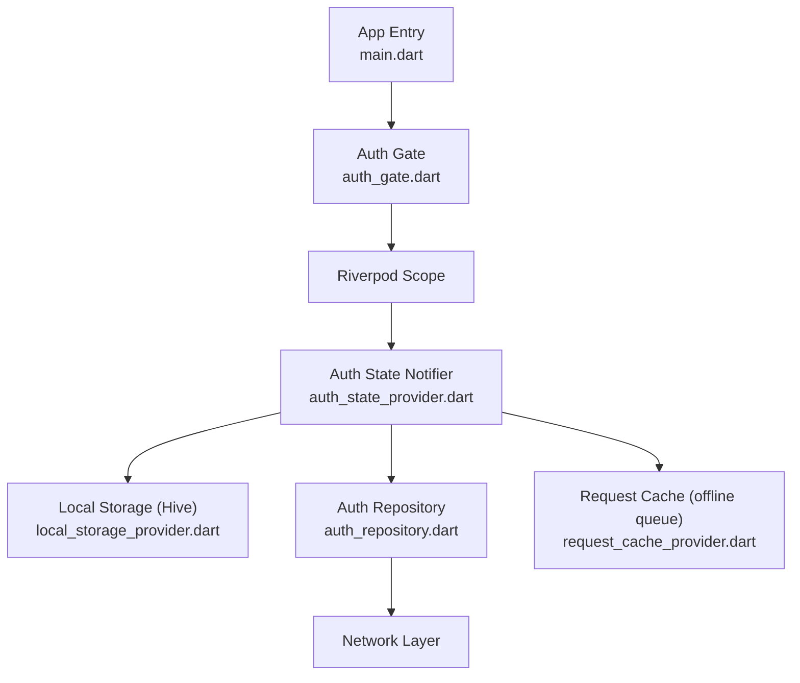
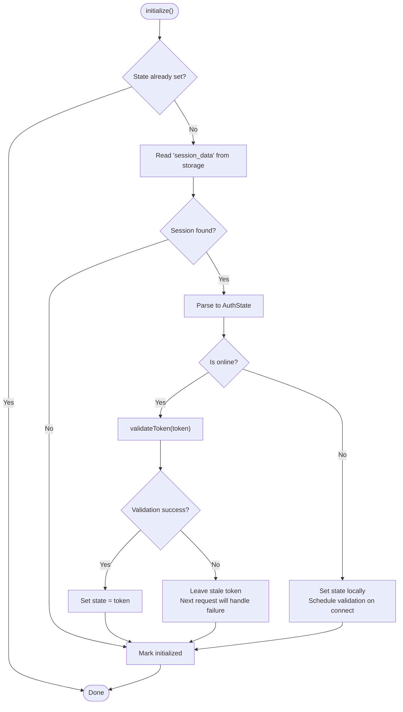
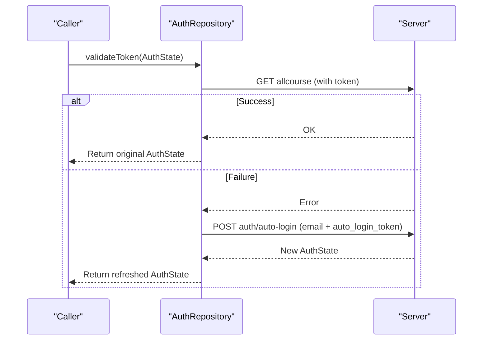
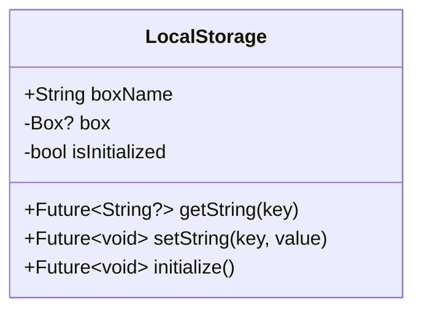
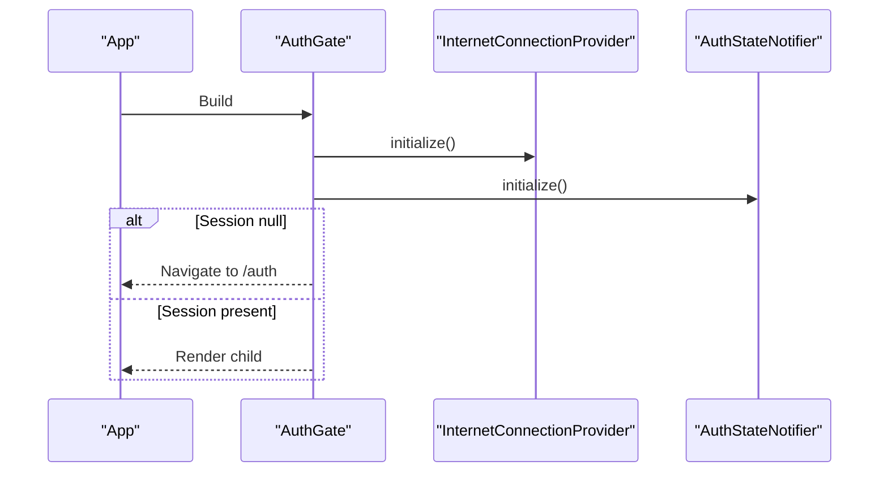
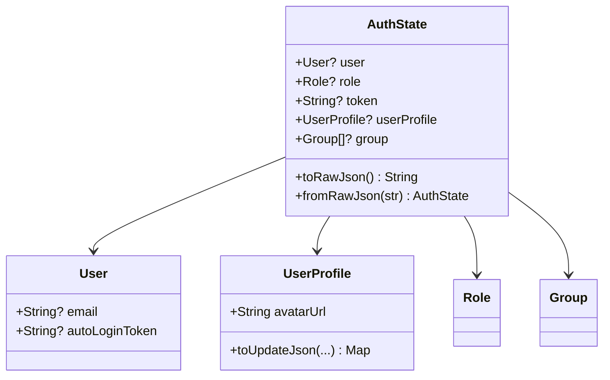
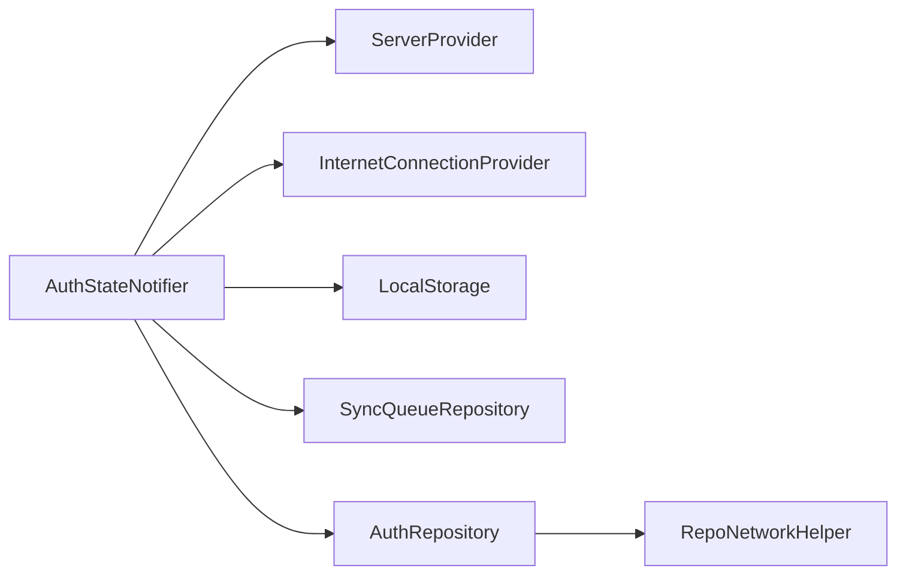

# Session Management

<cite>
**Referenced Files in This Document**
- [main.dart](file://lib/main.dart)
- [auth_state_provider.dart](file://lib/app/features/authentication/app_state/auth_state_provider.dart)
- [auth_repository.dart](file://lib/app/features/authentication/repository/auth_repository.dart)
- [auth_state.dart](file://lib/app/features/authentication/model/auth_state.dart)
- [auth_gate.dart](file://lib/app/features/authentication/view/auth_gate.dart)
- [local_storage_provider.dart](file://lib/app/core/provider/local_storage_provider.dart)
- [request_cache_provider.dart](file://lib/app/core/provider/request_cache_provider.dart)
- [pubspec.yaml](file://pubspec.yaml)
</cite>

## Table of Contents
1. [Introduction](#introduction)
2. [Project Structure](#project-structure)
3. [Core Components](#core-components)
4. [Architecture Overview](#architecture-overview)
5. [Detailed Component Analysis](#detailed-component-analysis)
6. [Dependency Analysis](#dependency-analysis)
7. [Performance Considerations](#performance-considerations)
8. [Troubleshooting Guide](#troubleshooting-guide)
9. [Conclusion](#conclusion)

## Introduction
This document explains how user sessions are created, maintained, and destroyed across the application lifecycle. It covers the Riverpod-based session state provider, persistence mechanisms for tokens and user preferences, automatic restoration on app start or background resume, token refresh flows, logout cleanup, timeout handling, concurrent session management, and security considerations for protecting sensitive data.

## Project Structure
Session management is centered around:
- A Riverpod StateNotifier that owns the authenticated session state and orchestrates login, token refresh, profile updates, and logout.
- An authentication repository that performs network calls to authenticate and validate tokens.
- A local storage abstraction backed by Hive for persisting session data.
- An auth gate widget that initializes connectivity and restores sessions before rendering protected routes.



**Diagram sources**
- [main.dart:16-37](file://lib/main.dart#L16-L37)
- [auth_gate.dart:17-68](file://lib/app/features/authentication/view/auth_gate.dart#L17-L68)
- [auth_state_provider.dart:15-202](file://lib/app/features/authentication/app_state/auth_state_provider.dart#L15-L202)
- [local_storage_provider.dart:6-48](file://lib/app/core/provider/local_storage_provider.dart#L6-L48)
- [auth_repository.dart:7-65](file://lib/app/features/authentication/repository/auth_repository.dart#L7-L65)
- [request_cache_provider.dart:40-83](file://lib/app/core/provider/request_cache_provider.dart#L40-L83)

**Section sources**
- [main.dart:16-37](file://lib/main.dart#L16-L37)
- [auth_gate.dart:17-68](file://lib/app/features/authentication/view/auth_gate.dart#L17-L68)
- [auth_state_provider.dart:15-202](file://lib/app/features/authentication/app_state/auth_state_provider.dart#L15-L202)
- [local_storage_provider.dart:6-48](file://lib/app/core/provider/local_storage_provider.dart#L6-L48)
- [auth_repository.dart:7-65](file://lib/app/features/authentication/repository/auth_repository.dart#L7-L65)
- [request_cache_provider.dart:40-83](file://lib/app/core/provider/request_cache_provider.dart#L40-L83)

## Core Components
- AuthStateNotifier (Riverpod): Owns the current session, persists it, validates tokens, refreshes access tokens using an auto-login token, updates profiles, and handles logout.
- AuthRepository: Performs login, auto-login, and token validation endpoints.
- LocalStorage (Hive): Persists session JSON under a specific key and supports initialization per platform.
- AuthGate: Initializes connectivity and session restoration before allowing navigation into protected areas.
- Request Cache: Queues offline requests and replays them when connectivity returns; cleared on logout to prevent cross-session leakage.

Key responsibilities:
- Create session on successful login and persist it.
- Restore session on app startup or when coming back from background.
- Validate or refresh tokens as needed.
- Update and persist user profile changes.
- Clean up session and queued operations on logout.

**Section sources**
- [auth_state_provider.dart:15-202](file://lib/app/features/authentication/app_state/auth_state_provider.dart#L15-L202)
- [auth_repository.dart:7-65](file://lib/app/features/authentication/repository/auth_repository.dart#L7-L65)
- [local_storage_provider.dart:6-48](file://lib/app/core/provider/local_storage_provider.dart#L6-L48)
- [auth_gate.dart:17-68](file://lib/app/features/authentication/view/auth_gate.dart#L17-L68)
- [request_cache_provider.dart:40-83](file://lib/app/core/provider/request_cache_provider.dart#L40-L83)

## Architecture Overview
The session architecture combines Riverpod state management with persistent storage and network-backed validation/refresh. The flow ensures users remain logged in across app restarts while keeping tokens valid and secure.

```mermaid
sequenceDiagram
participant App as "App"
participant Gate as "AuthGate"
participant Net as "InternetConnectionProvider"
participant S as "AuthStateNotifier"
participant Store as "LocalStorage (Hive)"
participant Repo as "AuthRepository"
App->>Gate : Build UI
Gate->>Net : Initialize connectivity
Gate->>S : initialize()
S->>Store : Read "session_data"
alt Session exists
S->>S : Parse AuthState
opt Online
S->>Repo : validateToken(token)
Repo-->>S : Success or error
S->>Store : Persist updated session if refreshed
else Offline
S->>S : Set state locally
S->>S : Schedule validation when connected
end
else No session
S->>S : State remains null
end
Gate-->>App : Render protected UI or redirect to login
```

**Diagram sources**
- [auth_gate.dart:17-68](file://lib/app/features/authentication/view/auth_gate.dart#L17-L68)
- [auth_state_provider.dart:168-201](file://lib/app/features/authentication/app_state/auth_state_provider.dart#L168-L201)
- [auth_repository.dart:45-64](file://lib/app/features/authentication/repository/auth_repository.dart#L45-L64)
- [local_storage_provider.dart:13-28](file://lib/app/core/provider/local_storage_provider.dart#L13-L28)

## Detailed Component Analysis

### AuthStateNotifier (Session State Provider)
- Responsibilities:
  - Login: authenticates via repository and persists session JSON.
  - Profile updates: merges and persists updated profile fields.
  - Token refresh: deduplicates concurrent refresh attempts using an in-flight guard and exchanges an auto-login token for a new access token.
  - Initialization: restores session from storage, validates online, or defers validation until connectivity resumes.
  - Logout: clears persisted session, clears offline queue, resets state.

- Persistence:
  - Stores full session JSON under a single key.
  - Updates stored session whenever state changes (login, profile update, token refresh).

- Concurrency and resilience:
  - Uses an in-flight guard to avoid multiple simultaneous refresh calls.
  - Gracefully handles offline mode by deferring validation until connectivity returns.



**Diagram sources**
- [auth_state_provider.dart:168-201](file://lib/app/features/authentication/app_state/auth_state_provider.dart#L168-L201)

**Section sources**
- [auth_state_provider.dart:42-69](file://lib/app/features/authentication/app_state/auth_state_provider.dart#L42-L69)
- [auth_state_provider.dart:79-99](file://lib/app/features/authentication/app_state/auth_state_provider.dart#L79-L99)
- [auth_state_provider.dart:114-150](file://lib/app/features/authentication/app_state/auth_state_provider.dart#L114-L150)
- [auth_state_provider.dart:152-162](file://lib/app/features/authentication/app_state/auth_state_provider.dart#L152-L162)
- [auth_state_provider.dart:168-201](file://lib/app/features/authentication/app_state/auth_state_provider.dart#L168-L201)

### AuthRepository (Authentication Endpoints)
- loginWithEmail: Authenticates user and returns session payload.
- autoLogin: Exchanges an auto-login token for a fresh access token without requiring password re-entry.
- validateToken: Attempts a lightweight validation call; if it fails, falls back to auto-login to restore a valid session.



**Diagram sources**
- [auth_repository.dart:45-64](file://lib/app/features/authentication/repository/auth_repository.dart#L45-L64)

**Section sources**
- [auth_repository.dart:16-27](file://lib/app/features/authentication/repository/auth_repository.dart#L16-L27)
- [auth_repository.dart:29-43](file://lib/app/features/authentication/repository/auth_repository.dart#L29-L43)
- [auth_repository.dart:45-64](file://lib/app/features/authentication/repository/auth_repository.dart#L45-L64)

### LocalStorage (Persistence Layer)
- Provides string key-value storage using Hive.
- Initializes Hive appropriately for web vs. mobile platforms.
- Used to store and retrieve the serialized session JSON.



**Diagram sources**
- [local_storage_provider.dart:6-48](file://lib/app/core/provider/local_storage_provider.dart#L6-L48)

**Section sources**
- [local_storage_provider.dart:13-28](file://lib/app/core/provider/local_storage_provider.dart#L13-L28)
- [local_storage_provider.dart:34-48](file://lib/app/core/provider/local_storage_provider.dart#L34-L48)

### AuthGate (Entry Guard)
- Ensures connectivity is initialized and session is restored before rendering protected content.
- Redirects to login if no active session is present after initialization.



**Diagram sources**
- [auth_gate.dart:17-68](file://lib/app/features/authentication/view/auth_gate.dart#L17-L68)

**Section sources**
- [auth_gate.dart:17-68](file://lib/app/features/authentication/view/auth_gate.dart#L17-L68)

### Data Model (AuthState and related)
- Holds user, role, token, profile, groups, and other context required for authenticated operations.
- Supports serialization/deserialization for persistence and network payloads.



**Diagram sources**
- [auth_state.dart:12-93](file://lib/app/features/authentication/model/auth_state.dart#L12-L93)
- [auth_state.dart:132-380](file://lib/app/features/authentication/model/auth_state.dart#L132-L380)
- [auth_state.dart:382-672](file://lib/app/features/authentication/model/auth_state.dart#L382-L672)

**Section sources**
- [auth_state.dart:12-93](file://lib/app/features/authentication/model/auth_state.dart#L12-L93)
- [auth_state.dart:132-380](file://lib/app/features/authentication/model/auth_state.dart#L132-L380)
- [auth_state.dart:382-672](file://lib/app/features/authentication/model/auth_state.dart#L382-L672)

## Dependency Analysis
- Riverpod provides dependency injection and reactive state via providers.
- LocalStorage depends on Hive and path_provider for platform-specific initialization.
- AuthStateNotifier depends on:
  - ServerProvider for base URL configuration.
  - InternetConnectionProvider for online/offline behavior.
  - SyncQueueRepository to clear queued operations on logout.
- AuthRepository uses a shared network helper to perform HTTP requests.



**Diagram sources**
- [auth_state_provider.dart:15-25](file://lib/app/features/authentication/app_state/auth_state_provider.dart#L15-L25)
- [auth_repository.dart:7-15](file://lib/app/features/authentication/repository/auth_repository.dart#L7-L15)
- [local_storage_provider.dart:6-48](file://lib/app/core/provider/local_storage_provider.dart#L6-L48)

**Section sources**
- [auth_state_provider.dart:15-25](file://lib/app/features/authentication/app_state/auth_state_provider.dart#L15-L25)
- [auth_repository.dart:7-15](file://lib/app/features/authentication/repository/auth_repository.dart#L7-L15)
- [local_storage_provider.dart:6-48](file://lib/app/core/provider/local_storage_provider.dart#L6-L48)

## Performance Considerations
- Token refresh deduplication prevents redundant network calls during bursts of 401 responses.
- Deferring token validation until connectivity resumes improves perceived performance in offline scenarios.
- Storing the entire session as JSON reduces repeated parsing overhead but should be balanced against storage size; consider trimming non-essential fields if needed.
- Clearing the offline queue on logout avoids unnecessary retries for the next user.

[No sources needed since this section provides general guidance]

## Troubleshooting Guide
Common issues and resolutions:
- Session expired mid-session:
  - The system attempts to refresh using the stored auto-login token. If refresh fails, callers should treat it as unauthorized and prompt re-login.
- No internet connection at startup:
  - The app sets the last known session locally and schedules validation when connectivity returns.
- Stale profile display:
  - Profile updates push changes to the global session state and persist them so cold starts reflect the latest profile.
- Logout not clearing queued tasks:
  - Ensure logout clears the sync queue to prevent cross-user data leakage.

**Section sources**
- [auth_state_provider.dart:114-150](file://lib/app/features/authentication/app_state/auth_state_provider.dart#L114-L150)
- [auth_state_provider.dart:168-201](file://lib/app/features/authentication/app_state/auth_state_provider.dart#L168-L201)
- [auth_state_provider.dart:152-162](file://lib/app/features/authentication/app_state/auth_state_provider.dart#L152-L162)

## Conclusion
The session management implementation leverages Riverpod for reactive state, Hive for persistence, and a robust repository layer for authentication and token maintenance. It supports seamless restoration across app restarts and background processes, handles token expiration gracefully, and cleans up properly on logout. Security-sensitive data is persisted in a local key-value store; consider additional hardening measures such as encrypting the stored session or leveraging platform secure storage for tokens in future iterations.

[No sources needed since this section summarizes without analyzing specific files]