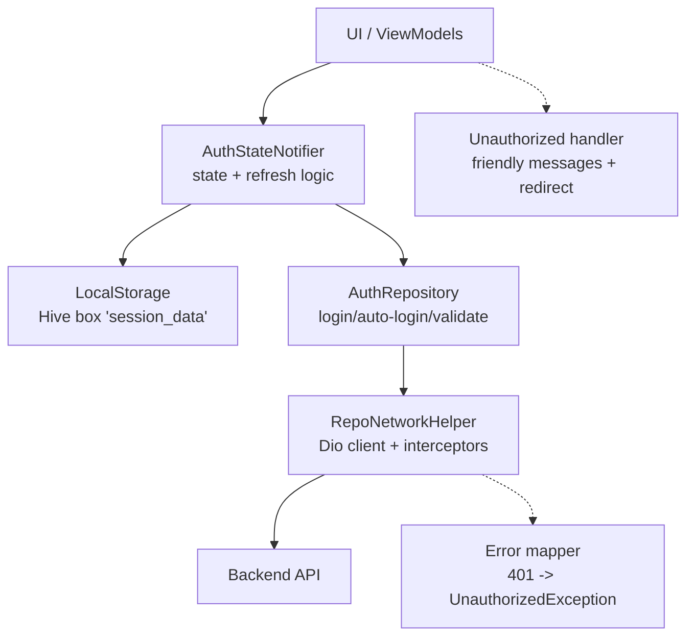
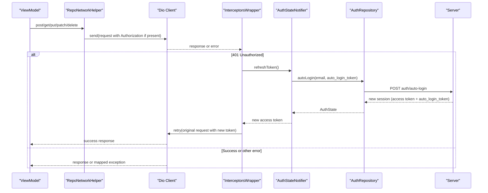
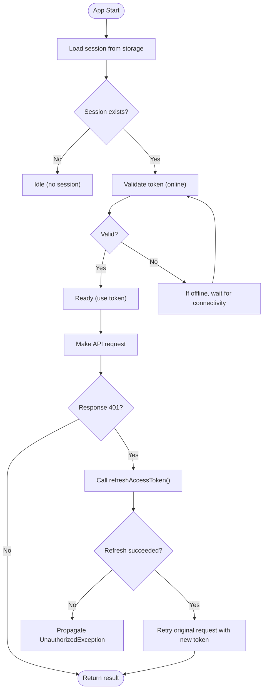
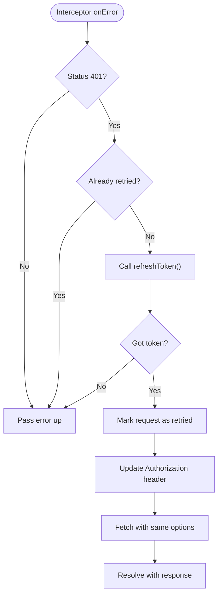
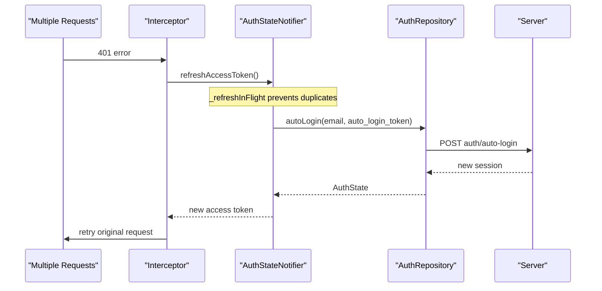
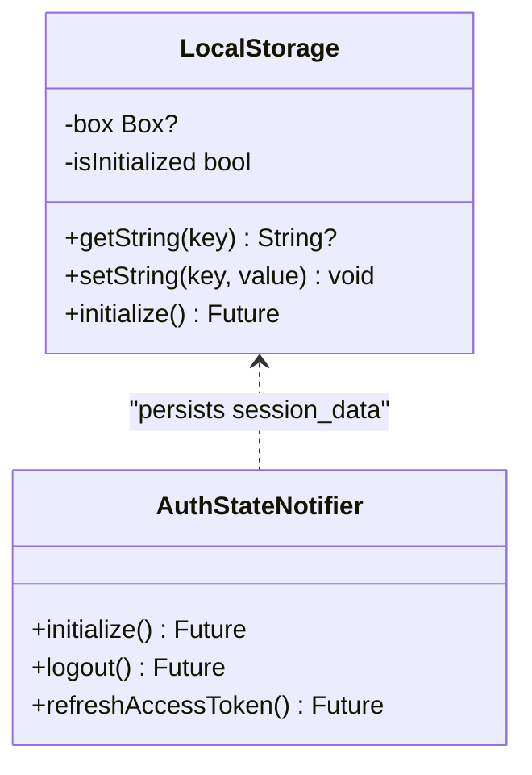
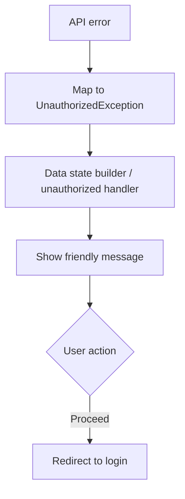
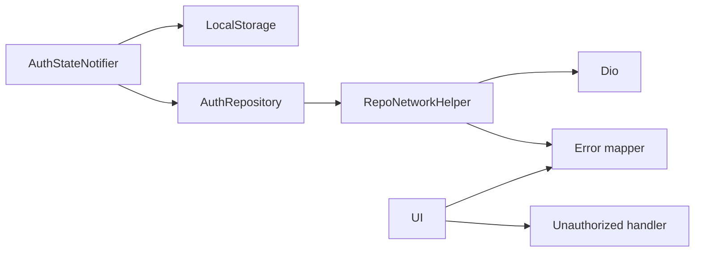

# Token Handling

<cite>
**Referenced Files in This Document**
- [repo_network_helper.dart](file://lib/app/core/logic/repository/repo_network_helper.dart)
- [auth_state_provider.dart](file://lib/app/features/authentication/app_state/auth_state_provider.dart)
- [auth_repository.dart](file://lib/app/features/authentication/repository/auth_repository.dart)
- [local_storage_provider.dart](file://lib/app/core/provider/local_storage_provider.dart)
- [error.dart](file://lib/app/core/logic/repository/error.dart)
- [app_exception.dart](file://lib/app/core/logic/repository/app_exception.dart)
- [unauthorized_handler.dart](file://lib/app/core/views/elements/unauthorized_handler.dart)
- [data_state_builder.dart](file://lib/app/core/views/elements/data_state_builder.dart)
- [auth_state.dart](file://lib/app/features/authentication/model/auth_state.dart)
</cite>

## Table of Contents
1. [Introduction](#introduction)
2. [Project Structure](#project-structure)
3. [Core Components](#core-components)
4. [Architecture Overview](#architecture-overview)
5. [Detailed Component Analysis](#detailed-component-analysis)
6. [Dependency Analysis](#dependency-analysis)
7. [Performance Considerations](#performance-considerations)
8. [Troubleshooting Guide](#troubleshooting-guide)
9. [Conclusion](#conclusion)
10. [Appendices](#appendices)

## Introduction
This document explains the token handling mechanisms in the application, covering the full lifecycle: generation at login, storage, automatic attachment to HTTP requests via an interceptor-based approach, background refresh on expiration, and invalidation on logout. It also details error handling for authentication failures and outlines security considerations around token storage and protection.

## Project Structure
Token handling spans several layers:
- Authentication state management and persistence
- Network layer with Dio and interceptors
- Repositories that call auth endpoints
- Error mapping and user-facing unauthorized handling
- Local storage for session data

**Diagram sources**
- [auth_state_provider.dart:15-202](file://lib/app/features/authentication/app_state/auth_state_provider.dart#L15-L202)
- [auth_repository.dart:7-65](file://lib/app/features/authentication/repository/auth_repository.dart#L7-L65)
- [repo_network_helper.dart:31-126](file://lib/app/core/logic/repository/repo_network_helper.dart#L31-L126)
- [local_storage_provider.dart:6-48](file://lib/app/core/provider/local_storage_provider.dart#L6-L48)
- [error.dart:19-94](file://lib/app/core/logic/repository/error.dart#L19-L94)
- [unauthorized_handler.dart:7-67](file://lib/app/core/views/elements/unauthorized_handler.dart#L7-L67)

**Section sources**
- [auth_state_provider.dart:15-202](file://lib/app/features/authentication/app_state/auth_state_provider.dart#L15-L202)
- [auth_repository.dart:7-65](file://lib/app/features/authentication/repository/auth_repository.dart#L7-L65)
- [repo_network_helper.dart:31-126](file://lib/app/core/logic/repository/repo_network_helper.dart#L31-L126)
- [local_storage_provider.dart:6-48](file://lib/app/core/provider/local_storage_provider.dart#L6-L48)
- [error.dart:19-94](file://lib/app/core/logic/repository/error.dart#L19-L94)
- [unauthorized_handler.dart:7-67](file://lib/app/core/views/elements/unauthorized_handler.dart#L7-L67)

## Core Components
- RepoNetworkConfig: Holds base URL, optional authToken, connection provider, offline mode flag, and a refreshToken callback used by the interceptor.
- RepoNetworkHelper (mixin): Builds a Dio client with timeouts, attaches Authorization headers when present, and installs an InterceptorsWrapper that retries once after a successful refresh on 401.
- AuthStateNotifier: Persists and restores session data, validates tokens on startup, and provides a deduplicated refreshAccessToken method that calls auto-login to obtain a new access token.
- AuthRepository: Calls login, auto-login, and validate-token endpoints; returns structured AuthState.
- LocalStorage: Hive-backed key-value store used to persist session_data across app restarts.
- Error mapping: Converts Dio errors into typed exceptions (e.g., UnauthorizedException).
- Unauthorized handling: Provides friendly messages and redirects to login when sessions expire.

**Section sources**
- [repo_network_helper.dart:31-126](file://lib/app/core/logic/repository/repo_network_helper.dart#L31-L126)
- [auth_state_provider.dart:15-202](file://lib/app/features/authentication/app_state/auth_state_provider.dart#L15-L202)
- [auth_repository.dart:7-65](file://lib/app/features/authentication/repository/auth_repository.dart#L7-L65)
- [local_storage_provider.dart:6-48](file://lib/app/core/provider/local_storage_provider.dart#L6-L48)
- [error.dart:19-94](file://lib/app/core/logic/repository/error.dart#L19-L94)
- [unauthorized_handler.dart:7-67](file://lib/app/core/views/elements/unauthorized_handler.dart#L7-L67)

## Architecture Overview
The system uses an interceptor-driven approach to automatically attach Bearer tokens to outgoing requests and handle token expiration transparently. When a 401 is received, the interceptor attempts a single refresh using a stored auto-login token. If successful, it retries the original request with the new token. If refresh fails or the retry still fails, the error propagates as an UnauthorizedException, which UI components translate into user-friendly prompts and navigation to login.

**Diagram sources**
- [repo_network_helper.dart:79-126](file://lib/app/core/logic/repository/repo_network_helper.dart#L79-L126)
- [auth_state_provider.dart:114-150](file://lib/app/features/authentication/app_state/auth_state_provider.dart#L114-L150)
- [auth_repository.dart:29-43](file://lib/app/features/authentication/repository/auth_repository.dart#L29-L43)

## Detailed Component Analysis

### Token Lifecycle
- Generation: Login endpoint returns a session containing an access token and an auto-login token. The session is persisted under a single key.
- Storage: Session data is stored in Hive via LocalStorage under a specific key. On app start, the session is restored and validated if online.
- Attachment: RepoNetworkConfig.header adds Authorization: Bearer <token> to all requests when a token exists.
- Refresh: On 401, the interceptor invokes a refresh callback that calls auto-login using the stored auto-login token. On success, the new token replaces the old one in the request and the original request is retried once.
- Invalidation: Logout clears the stored session and any queued offline operations, resetting state to null.

**Diagram sources**
- [auth_state_provider.dart:168-201](file://lib/app/features/authentication/app_state/auth_state_provider.dart#L168-L201)
- [repo_network_helper.dart:88-123](file://lib/app/core/logic/repository/repo_network_helper.dart#L88-L123)
- [auth_repository.dart:45-64](file://lib/app/features/authentication/repository/auth_repository.dart#L45-L64)

**Section sources**
- [auth_state_provider.dart:42-69](file://lib/app/features/authentication/app_state/auth_state_provider.dart#L42-L69)
- [auth_state_provider.dart:152-162](file://lib/app/features/authentication/app_state/auth_state_provider.dart#L152-L162)
- [repo_network_helper.dart:63-69](file://lib/app/core/logic/repository/repo_network_helper.dart#L63-L69)
- [repo_network_helper.dart:88-123](file://lib/app/core/logic/repository/repo_network_helper.dart#L88-L123)
- [auth_repository.dart:16-27](file://lib/app/features/authentication/repository/auth_repository.dart#L16-L27)
- [auth_repository.dart:29-43](file://lib/app/features/authentication/repository/auth_repository.dart#L29-L43)
- [auth_repository.dart:45-64](file://lib/app/features/authentication/repository/auth_repository.dart#L45-L64)
- [local_storage_provider.dart:13-28](file://lib/app/core/provider/local_storage_provider.dart#L13-L28)

### Interceptor-Based Automatic Token Attachment and Retry Logic
- Header injection: When a token is present in configuration, every request includes Authorization: Bearer <token>.
- Interceptor behavior: On error, if status is 401 and this is not already a retried attempt, the interceptor calls the provided refreshToken callback.
- Retry guard: A per-request flag ensures only one retry per failed request to avoid loops.
- Successful refresh: The request is retried with the new token; otherwise, the original error is propagated.

**Diagram sources**
- [repo_network_helper.dart:88-123](file://lib/app/core/logic/repository/repo_network_helper.dart#L88-L123)

**Section sources**
- [repo_network_helper.dart:79-126](file://lib/app/core/logic/repository/repo_network_helper.dart#L79-L126)

### Background Refresh Strategy and Concurrency Control
- Deduplication: Concurrent 401s share a single refresh operation via an in-flight promise to avoid multiple auto-login calls.
- Auto-login flow: Uses email and auto_login_token to obtain a fresh access token and updates persisted session data.
- Validation on startup: On app launch, if a session exists, the app validates the current token; if offline, validation runs when connectivity resumes.

**Diagram sources**
- [auth_state_provider.dart:114-150](file://lib/app/features/authentication/app_state/auth_state_provider.dart#L114-L150)
- [auth_repository.dart:29-43](file://lib/app/features/authentication/repository/auth_repository.dart#L29-L43)

**Section sources**
- [auth_state_provider.dart:114-150](file://lib/app/features/authentication/app_state/auth_state_provider.dart#L114-L150)
- [auth_state_provider.dart:168-201](file://lib/app/features/authentication/app_state/auth_state_provider.dart#L168-L201)

### Token Storage Implementation
- Persistence key: A single key stores the entire serialized session (including access token and auto-login token).
- Read/write: LocalStorage wraps Hive to provide getString/setString methods, initializing the box lazily.
- Initialization: On app start, the session is loaded and validated if possible.

**Diagram sources**
- [local_storage_provider.dart:6-48](file://lib/app/core/provider/local_storage_provider.dart#L6-L48)
- [auth_state_provider.dart:168-201](file://lib/app/features/authentication/app_state/auth_state_provider.dart#L168-L201)

**Section sources**
- [local_storage_provider.dart:13-28](file://lib/app/core/provider/local_storage_provider.dart#L13-L28)
- [auth_state_provider.dart:168-201](file://lib/app/features/authentication/app_state/auth_state_provider.dart#L168-L201)

### Error Handling for Authentication Failures
- Mapping: Dio errors are converted to typed exceptions; 401/403 map to UnauthorizedException.
- UI handling: Data state builders and unauthorized handlers detect unauthorized errors and show friendly messages, prompting re-login.
- Redirect: A helper logs out and navigates to the login screen when a session is detected as expired.

**Diagram sources**
- [error.dart:38-49](file://lib/app/core/logic/repository/error.dart#L38-L49)
- [data_state_builder.dart:12-47](file://lib/app/core/views/elements/data_state_builder.dart#L12-L47)
- [unauthorized_handler.dart:7-67](file://lib/app/core/views/elements/unauthorized_handler.dart#L7-L67)

**Section sources**
- [error.dart:19-94](file://lib/app/core/logic/repository/error.dart#L19-L94)
- [data_state_builder.dart:12-47](file://lib/app/core/views/elements/data_state_builder.dart#L12-L47)
- [unauthorized_handler.dart:7-67](file://lib/app/core/views/elements/unauthorized_handler.dart#L7-L67)

### Security Measures and Storage Practices
- Token presence in headers: Tokens are attached only when present in configuration, minimizing exposure.
- Storage medium: Session data is stored in a local Hive box; ensure platform-level sandboxing protects the file system.
- Encryption note: The codebase includes a simple XOR obfuscation utility for cached media files; it is not cryptographic encryption and should not be used for secrets like tokens. For sensitive data, prefer platform-provided secure storage solutions and consider encrypting at rest with strong algorithms where appropriate.
- Transport security: Ensure HTTPS is enforced server-side and network configurations do not bypass certificate checks.

[No sources needed since this section provides general guidance]

## Dependency Analysis
Key dependencies and relationships:
- AuthStateNotifier depends on LocalStorage for persistence and AuthRepository for network calls.
- AuthRepository depends on RepoNetworkHelper for HTTP transport and error mapping.
- RepoNetworkHelper configures Dio with timeouts and an interceptor that depends on AuthStateNotifier’s refresh callback.
- Error mapping centralizes conversion of HTTP statuses to domain exceptions consumed by UI.

**Diagram sources**
- [auth_state_provider.dart:15-202](file://lib/app/features/authentication/app_state/auth_state_provider.dart#L15-L202)
- [auth_repository.dart:7-65](file://lib/app/features/authentication/repository/auth_repository.dart#L7-L65)
- [repo_network_helper.dart:31-126](file://lib/app/core/logic/repository/repo_network_helper.dart#L31-L126)
- [error.dart:19-94](file://lib/app/core/logic/repository/error.dart#L19-L94)

**Section sources**
- [auth_state_provider.dart:15-202](file://lib/app/features/authentication/app_state/auth_state_provider.dart#L15-L202)
- [auth_repository.dart:7-65](file://lib/app/features/authentication/repository/auth_repository.dart#L7-L65)
- [repo_network_helper.dart:31-126](file://lib/app/core/logic/repository/repo_network_helper.dart#L31-L126)
- [error.dart:19-94](file://lib/app/core/logic/repository/error.dart#L19-L94)

## Performance Considerations
- Timeouts: Dio client sets connect, receive, and send timeouts to prevent indefinite hangs.
- Single refresh: Interceptor retries only once per request to avoid repeated refresh storms.
- Deduplication: Concurrent 401s share one refresh call to reduce unnecessary network traffic.
- Caching: Non-auth endpoints may use caching strategies; ensure cache keys include auth context to avoid leaking data between sessions.

[No sources needed since this section provides general guidance]

## Troubleshooting Guide
Common issues and resolutions:
- Persistent 401 errors: Indicates refresh failed or auto-login token expired. Clear session and require re-login.
- Stale session after restart: App validates token on startup; if invalid, next authenticated request will surface the failure and trigger refresh or redirect.
- User-facing messages: Unauthorized errors are translated into friendly messages; ensure UI uses the provided builders/handlers.

**Section sources**
- [error.dart:38-49](file://lib/app/core/logic/repository/error.dart#L38-L49)
- [data_state_builder.dart:12-47](file://lib/app/core/views/elements/data_state_builder.dart#L12-L47)
- [unauthorized_handler.dart:7-67](file://lib/app/core/views/elements/unauthorized_handler.dart#L7-L67)

## Conclusion
The application implements a robust token lifecycle with automatic attachment, background refresh on expiration, and clear error handling. The interceptor-based design centralizes token management, while state and storage layers ensure resilience across app restarts and connectivity changes. For enhanced security, consider adopting stronger encryption for sensitive data and enforcing strict transport policies.

[No sources needed since this section summarizes without analyzing specific files]

## Appendices

### Data Model Reference
- AuthState contains the access token and nested user information including the auto-login token used for refresh.

**Section sources**
- [auth_state.dart:12-93](file://lib/app/features/authentication/model/auth_state.dart#L12-L93)
- [auth_state.dart:132-380](file://lib/app/features/authentication/model/auth_state.dart#L132-L380)